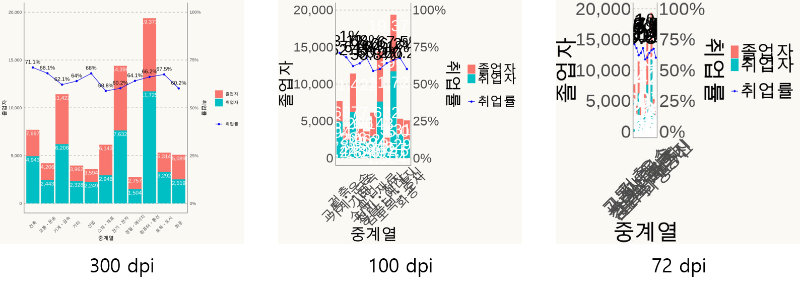
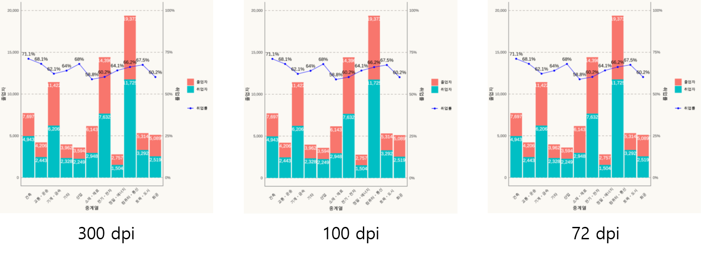

```{r setup, include=FALSE}
knitr::opts_chunk$set(echo = TRUE, message = FALSE, warning = FALSE, out.width = '100%', dpi = 96, fig.width = 6.5)

library(showtext)
showtext_auto()
library(tidyverse)
library(readxl)
library(scales)
library(patchwork)
showtext_opts(dpi = 96)
df_입학자 <- read_excel('c:/R/git/datavisualization/chap3/2021_연도별 입학자수.xlsx', 
                 ## 'data' 시트의 데이터를 불러오는데,
                 sheet = 'Sheet0',
                 ## 앞의 10행을 제외하고
                 skip = 3, 
                 ## 첫번째 행은 열 이름을 설정
                 col_names = FALSE, 
                 ## 열의 타입을 설정, 처음 8개는 문자형으로 다음 56개는 수치형으로 설정
                 col_types = c(rep('text', 2), rep('numeric', 30)))
df_입학자 <- df_입학자 |> select(1, 2, 5, 7, 9, 11, 13, 19, 29, 31)

## df_입학자의 열이름을 적절한 이름으로 설정
colnames(df_입학자) <- c('연도', '지역', '전문대학', '교육대학', '일반대학', '방송통신대학', '산업대학', '원격및사이버대학', '석사', '박사')

df_입학자 <- df_입학자 |> filter(!is.na(지역))

df_입학자_long <- df_입학자 |> pivot_longer(3:10, names_to = '학교종류', values_to = '입학생수')

```

```{r include=FALSE}

df_취업통계 <- read_excel('c:/R/git/datavisualization/chap3/2020년 학과별 고등교육기관 취업통계.xlsx', 
                     ## '학과별' 시트의 데이터를 불러오는데,
                     sheet = '학과별',
                     ## 앞의 13행을 제외하고
                     skip = 13, 
                     ## 첫번째 행은 열 이름으로 설정
                     col_names = TRUE, 
                     ## 열의 타입을 설정, 처음 9개는 문자형으로 다음 79개는 수치형으로 설정
                     col_types = c(rep('text', 9), rep('numeric', 79)))

## df_취업통계에서 첫번째부터 9번째까지의 열과 '계'로 끝나는 열을 선택하여 다시 df_취업통계에 저장
df_취업통계 <- df_취업통계 |> select(1:9, ends_with('계'), '입대자')

## df_취업통계 정보 확인
str(df_취업통계)

set.seed(123)
df_취업통계_sample <- df_취업통계 |> filter(취업률_계 != 100, 졸업자_계 >= 1) |>
  filter(졸업자_계 < 500) |>
  sample_n(2000)

df_취업통계_sample$과정구분 <- fct_relevel(df_취업통계_sample$과정구분, '전문대학과정', '대학과정', '대학원과정')

## 대계열의 순서를 맞추기 위해 과정구분을 팩터로 설정하고 레벨의 순서를 설정
df_취업통계_sample$대계열 <- fct_relevel(df_취업통계_sample$대계열, '인문계열', '사회계열', '교육계열', '자연계열', '공학계열', '의약계열', '예체능계열')

theme_set(
  theme(
    ## 축의 눈금자(ticks)를 모두 제거
    axis.ticks = element_blank(),
    ## 축의 선을 grey50으로 설정
    axis.line = element_line(colour = "grey50"),
    ## 전체 제목의 크기를 15, 수평 정렬은 중간, 아래 여백을 20으로 설정
    plot.title = element_text(size = 15, vjust = 0.5, margin = margin(b = 10)), 
    ## 패널의 눈금선의 색을 'wheat3'로 설정
    panel.grid = element_line(color = "wheat3"), ###b4aea9
    ## 패널의 부눈금선을 제거
    panel.grid.minor = element_blank(),
    ## 패널의 X축 주눈금선을 제거
    panel.grid.major.x = element_blank(),
    ## 패널의 Y축 주눈금선을 'dashed'형태로 설정
    panel.grid.major.y = element_line(linetype = "dashed"),
    ## 패널의 배경색과 선색을 'seashell'으로 설정
    panel.background = element_rect(fill = "snow", color = "snow"),
    ## 전체 배경색과 선색을 'seashell'으로 설정
    plot.background = element_rect(fill = "snow", color = "snow"),
    ## 범례 배경색과 선색을 'seashell'으로 설정
    legend.background = element_rect(fill = "snow", color = "snow"),
    ## 범례 키의 배경색과 'seashell', 선색을 제거
    legend.key = element_rect(fill = "snow", color = NA),  #fbf9f4
    legend.title = element_text(hjust = 0.5)
    )
  )

df_취업통계_계열별 <- df_취업통계 |> 
  group_by(과정구분, 대계열, 중계열) |>  
  summarise(졸업자 = sum(졸업자_계), 
            취업자 = sum(취업자_합계_계), 
            교외취업자 = sum(취업자_교외취업자_계), 
            교내취업자 = sum(취업자_교내취업자_계), 
            해외취업자 = sum(취업자_해외취업자_계), 
            농림어업종사자 = sum(취업자_농림어업종사자_계), 
            개인창작활동종사자 = sum(취업자_개인창작활동종사자_계), 
            일인창사업자 = sum(`취업자_1인창(사)업자_계`), 
            프리랜서 = sum(취업자_프리랜서_계), 
            진학자 = sum(진학자_계), 
            입대자 = sum(입대자),
            취업불가능자 = sum(취업불가능자_계), 
            외국인유학생 = sum(외국인유학생_계), 
            제외인정자 = sum(제외인정자_계), 
            기타 = sum(기타_계), 
            미상 = sum(미상_계), 
    ## 백분률인 취업률은 그 자체로 합계나 평균을 낼 수 없으니 각 그룹별로 재계산
            취업률 = 취업자 / (졸업자 - (진학자+입대자+취업불가능자+외국인유학생+제외인정자))) |>
  ## 계열의 표시 순서를 설정하기 위해 레벨을 재조정
  mutate(대계열 = fct_relevel(대계열, '인문계열', '사회계열', '교육계열', '자연계열', '공학계열', '의약계열', '예체능계열'))
```

# 벤다이어그램

------------------------------------------------------------------------

벤다이어그램은 아마도 중학교 시절 한번식은 그려본 차트일 것이다. 사실 이 차트는 지금까지 줄기차게 설명했던 데이터의 시각화와는 좀 다른 형태의 시각화이다. 우선 데이터의 양에 직접적인 관계가 없고 데이터의 성질에 관계가 있다는 점에서 정량적 시각화가 아닌 정성적 시각화이다. 각 데이터의 크기를 비교하는 것이 아닌 데이터간의 관계를 표현한다는 점도 다른 시각화와 매우 다르다. 하지만 데이터의 전반적 구조를 표현하거나 데이터 분석을 통해 도출된 인사이트를 전달하는 과정에서 효과적으로 사용될 수 있는 시각화이다.

R의 많은 사용자들은 데이터와 직접적 관계가 없는 벤다이어그램을 R에서 그린다는게 어색할 것이다. 보통 이렇게 데이터와 직접적 관계가 없는 시각화는 파워포인트와 같은 프리젠테이션 전용 툴이나 일러스트레이터와 같은 전문 그래픽 툴을 사용하는 것이 일반적이다. 하지만 R 마크다운을 사용하여 R에서 직접적으로 문서를 만들거나 그래픽 툴에 익숙하지 않은 데이터 분석가들을 위해 R에서 벤다이어그램을 그릴 수 있도는 패키지가 제공되고 있다.

R에서 벤다이어그램을 만들 수 있도록 제공되는 패키지는 `ggVennDiagram` 패키지이다.[^1] 이 패키지에서 제공하는 `ggVennDiagram()`을 이용해서 벤다이어그램을 만들 수 있다.

[^1]: 이 패키지외에 `VennDiagram` 패키지도 있지만 `VennDiagram` 패키지에서는 한글을 지원하지 못한다는 결정적 단점이 있다.

## 기본 벤다이어그램

벤다이어그램을 그리기 위해서는 먼저 `ggVennDiagram`패키지를 설치한다.

```{r}
## ggVennDiagram 설치
if(!require(ggVennDiagram)) {
  install.packages('ggVennDiagram')
  library(ggVennDiagram)
}
```

`ggVennDiagram` 패키지에서 제공하는 `ggVennDiagram()`의 사용법은 다음과 같다.

```{r eval=FALSE}
ggVennDiagram(x, category.names = names(x), show_intersect = FALSE, set_color = "black", set_size = NA, label = c("both", "count", "percent", "none"), label_alpha = 0.5, label_geom = c("label", "text"), label_color = "black", label_size = NA,  label_percent_digit = 0, label_txtWidth = 40, edge_lty = "solid", edge_size = 1,  ...)
  - x : 벤다이어그램에 사용 할 벡터 리스트
  - category.names : 각각의 원에 해당하는 카테고리의 이름 설정
  - show_intersect : 인터랙티브 플롯(plotly)으로 생성할지 여부를 결정하는 논리값
  - set_color : 벤다이어그램 안의 텍스트 라벨 색 설정
  - set_size : 벤다이어그램 안의 텍스트 라벨 크기 설정
  - label : 텍스트 라벨의 표시 형태 설정, "both", "count", "percent", "none" 중에 하나 설정
  - label_alpha : 벤다이어그램 안의 텍스트 라벨 투명도 설정
  - label_geom : 벤다이어그램 안의 텍스트 기하요소 설정, "label", "text" 중에 하나 설정
  - label_color : 벤다이어그램 안의 텍스트 색 설정
  - label_size : 벤다이어그램 안의 라벨 크기 설정
  - label_percent_digit : 라벨 타입이 'percent'일 경우 소수점 아래 몇자리까지 출력할지 설정
  - label_txtWidth : 벤다이어그램 교차부분의 텍스트 너비 설정
  - edge_lty : 벤다이어그램 가장자리 라인 타입 설정
  - edge_size : 벤다이어그램 가장자리 라인 굵기 설정

```

벤다이어그램은 보통 3개의 원으로 표현되는 것이 효율적이다. 그 이상의 원으로 표현은 가능하겠지만 오히려 데이터의 특징을 전반적으로 확인하는데 방해되는 경우도 많다.

벤다이어그램을 그리기 위해서는 먼저 벤다이어그램에 사용할 데이터 벡터를 생성해야 한다. 여기서는 공학계열의 학과들을 과정구분별로 필터링해서 세개의 벡터를 생성하고 이에 대한 벤다이어그램을 그리도록 한다.

```{r}
## 전문대학과정의 공학계열 학과명을 벡터로 저장
vec_전문대학과명 <- df_취업통계 |> 
  filter(대계열 == '공학계열', 과정구분 == '전문대학과정') |>
  select(학과명) |> 
  ## 하나의 열만 선택하더라도 여전히 데이터프레임이기 때문에 pull()로 벡터화
  pull()

## 대학과정의 공학계열 학과명을 벡터로 저장
vec_대학학과명 <- df_취업통계 |> 
  filter(대계열 == '공학계열', 과정구분 == '대학과정') |>
  select(학과명) |> 
  pull()

## 대학원과정의 공학계열 학과명을 벡터로 저장
vec_대학원학과명 <- df_취업통계 |> 
  filter(대계열 == '공학계열', 과정구분 == '대학원과정') |>
  select(학과명) |> 
  pull()

## 벤다이어그램의 제목 설정과 데이터를 연결한 리스트 생성
list_venn_diagram <- list(전문대학 = vec_전문대학과명, 대학 = vec_대학학과명, 대학원 = vec_대학원학과명)
```

```{r fig.cap='기본 벤다이어그램'}
## 벤다이어그램 생성
ggVennDiagram(list_venn_diagram)
```

## 벤다어그램 색 바꾸기

`ggVenDiagram()`은 `ggplot`의 기본 컨셉을 사용하기 때문에 색을 바꾸는 것은 `scale_fill_*()`을 사용할 수 있다. 다음은 흰색부터 하늘색까지의 그라디언트를 사용한 벤다이어그램이다. 추가적으로 범례를 제거하고 제목을 설정하였다.

```{r fig.cap='벤다이어그램 꾸미기'}
## 벤다이어그램 생성
ggVennDiagram(list_venn_diagram) + 
  ## fill 스케일을 'white'부터 'skyblue'까지인 그라디언트로 설정하고 범례는 제거
  scale_fill_gradient(low = "white", high = "skyblue", guide = FALSE) + 
  ## color 스케일을 사용자 정의형으로 설정하고 범례는 제거
  scale_color_manual(values = c('전문대학' = 'grey', '대학' = 'grey', '대학원' = 'grey'), guide = FALSE) +
#  theme(legend.position = "none") + 
  labs(title = '공학계열 학과의 분포') + 
  theme(plot.title = element_text(hjust = 0.5))
```

## ggplot 객체로 꾸미기

`ggVenDiagram()`은 사실 `ggplot2`의 simple feature 객체를 생성하는 `geom_sf()`를 조합하여 만들어진 일종의 헬퍼 함수이다. 따라서 `ggVendiagram()`으로 세부설정이 안되는 부분은 `geom_sf()`를 사용하여 세부적으로 설정이 가능하다. 대표적인 세부설정이 어려운 부분이 각 원의 선의 색이다.

`ggVenDiagram()`을 `ggplot` 객체로 편집하기 위해서는 먼저 데이터를 벤다이어그램의 형태로 전처리해주어야 한다. 이를 위해서는 `Venn()`을 사용하여 Venn 객체를 생성한 후 `process_data()`로 플롯을 위한 데이터를 얻어내야 한다.

```{r eval=FALSE}
Venn(sets)
  - sets : 벤다이어그램을 만들 벡터 리스트

process_data(venn, ...)
  - venn : Venn 객체

```

위의 함수를 사용해 플롯 데이터를 만드는 코드는 다음과 같다.

```{r}
## list_venn_diagram을 벤다이어그램화하기 위해 Venn 객체로 변환 
Venn <- Venn(list_venn_diagram)

## Venn 객체를 벤다이그램 시각화 데이터 객체인 VennPlotData 객체로 변환
plotdata_venn <- process_data(Venn)
class(plotdata_venn)
```

따라서 플롯 데이터인 'plotdata_venn'과 `geom_sf()`를 사용해면 벤다이어그램을 원하는대로 편집할 수 있다. 다음은 원 둘레의 색과 두께를 설정, 라벨의 배경색을 투명하게 설정하는 코드는 다음과 같다.

```{r fig.cap='geom_sf()를 사용한 벤다이어그램'}
ggplot() + 
  ## venn_region()을 사용하여 plotdata_venn 객체의 지역을 그림
  geom_sf(data = venn_region(plotdata_venn), aes(fill=count)) +
  ## venn_region()을 사용하여 plotdata_venn 객체의 경계선을 그림
  geom_sf(data = venn_setedge(plotdata_venn), color = 'grey', show.legend = F, size = 3) + 
  ## venn_region()을 사용하여 plotdata_venn 객체의 이름을 표시
  geom_sf_text(data = venn_setlabel(plotdata_venn), aes(label = name)) +
  ## venn_region()을 사용하여 plotdata_venn 객체의 데이터 라벨을 표시
  geom_sf_label(data = venn_region(plotdata_venn), aes(label= paste0(count, '\n', '(', round(prop.table(count)*100, 1), '%)')), label.size = NA, alpha = 0) +
  ## 테마요소를 제거
  theme_void() + 
  ## fill 스케일을 'white'부터 'skyblue'까지인 그라디언트로 설정하고 범례는 제거
  scale_fill_gradient(low = "white", high = "skyblue") + 
  ## 범례 제거
  theme(legend.position = "none") + 
  labs(title = '공학계열 학과의 분포') + 
  theme(plot.title = element_text(hjust = 0.5))


```

## 3개이상 값에 대한 벤다이어그램

보통 벤다이어그램은 원 3개를 사용하는 것이 대부분이다. 하지만 `ggVennDiagram` 패키지에서는 7개까지의 값에 대한 벤다이어그램을 지원한다. 다음은 변수에 수에 다른 벤다이어그램의 형태를 보이고 있다.

```{r echo=FALSE}
plot_shapes()
```

앞서 그려보았던 벤다이어그램의 대학원을 석사와 박사로 나눠 네개의 변량에 대한 벤다이어그램은 다음과 같이 생성할 수 있다.

```{r}
## 석사과정의 공학계열 학과명을 벡터로 저장
vec_석사학과명 <- df_취업통계 |> 
  filter(대계열 == '공학계열', 과정구분 == '대학원과정', 학위구분 == '석사') |>
  select(학과명) |> 
  pull()

## 박사과정의 공학계열 학과명을 벡터로 저장
vec_박사학과명 <- df_취업통계 |> 
  filter(대계열 == '공학계열', 과정구분 == '대학원과정', 학위구분 == '박사') |>
  select(학과명) |> 
  pull()

## 벤다이어그램의 제목 설정과 데이터를 연결한 리스트 생성
list_venn_diagram1 <- list(전문대학 = vec_전문대학과명, 대학 = vec_대학학과명, 석사 = vec_석사학과명, 박사 = vec_박사학과명)
```

```{r fig.cap='4개의 변량 벤다이어그램'}
ggVennDiagram(list_venn_diagram1)

```

# 산키 다이어그램(Sankey Diagram)

------------------------------------------------------------------------

산키 다이어그램은 두개 혹은 두개 이상의 변수간의 데이터 흐름을 잘 보여주는 다이어그램이다. 각각의 변수 항목의 변량들은 왼쪽과 오른쪽에 네모 박스로 표현하고 변량들의 데이터가 연관된 항목간의 데이터 량에 따라 굵기가 다른 선으로 이어지는 형태로 표현되는 다이어그램으로 비교적 최근부터 사용되기 시작한 그래프 형태이다.

최근 `ggplot2`의 확장 패키지로 만들어진 `ggsankey` 패키지를 통해 `ggplot` 객체의 산키 다이어그램을 만들 수 있다. 이외에도 `plotly`나 `networkD3` 패키지를 사용할 수 있다.하지만 `ggsankey` 패키지는 아직 완성이 되지 못해 R의 공식 패키지를 배포하는 CRAN(Comprehensive R Archive Network)에 등록되지 못했다. 그리고 `ggsankey`를 사용해 만들어진 산키 다이어그램도 아직은 투박하다.

`plotly`와 `networkD3`패키지로 작성된 산키 다이어그램은 모두 대화형(interactive) 그래프로 산키 다이어그램이 생성되기 때문에 웹상에서는 마우스 포인터의 위치에 따라 해당 내용이 화면에 표기된다.

이번 절에서는 `networkD3`패키지를 사용하여 산키 다이어그램을 만드는 방법에 대해 설명한다. 만들어볼 산키 다이어그램은 과정구분(전문대학과정, 대학과정, 대학원과정)의 졸업자가 졸업후 어떤 진로를 선택했는지(취업, 진학 등)의 흐름을 연결하는 다이어그램이다. 이 산키 다이어그램을 생성하기 위해서는 일단 산키 다이어그램을 생성하기 위한 데이터의 전처리가 필요하다.

산키 다이어그램을 생성하기 위해서는 세가지 데이터가 필요하다.

첫번째는 (네모 박스로 표현되는) 각각 노드의 이름, 두번째는 각각의 노드들이 연결되는 링크에 대한 정보, 세번째는 링크의 굵기가 표현될 데이터 정보이다.

이를 위해 df_취업통계 데이터를 다음과 같이 전처리하였다.

```{r}
df_sankey <- df_취업통계 |> 
  ## 열 중에서 3열(과정구분, 왼쪽 노드로 사용)과 12열, 21열부터 26열(오른쪽 노드로 사용)까지를 선택
  select(3, 12, 21:26) |> 
  ## 과정구분 열을 사용하여 그룹화
  group_by(과정구분) |>
  ## 전체 열에 대해 `sum`을 적용(summarise_all은 전체 열에 동일한 요약함수를 적영하는 함수임)
  summarise_all(sum) |>
  ## 열이름을 적절히 변경
  rename(c('취업자' = '취업자_합계_계', '진학자' = '진학자_계', '취업불가능자' = '취업불가능자_계', '외국인유학생' = '외국인유학생_계', '제외인정자' = '제외인정자_계', '기타' = '기타_계', '미상' = '미상_계')) |>
  ##  첫번째 열을 제외하고 나머지 열들에 긴 형태의 데이터로 변환, 열 이름이 들어간 열은 '구분'으로 데이터 값이 들어간 열은 '학생수'열로 설정
  pivot_longer(cols = 2:8, names_to = '구분', values_to = '학생수') |>
  ## 과정구분 열과 구분 열의 순서설정을 위해 팩터 레벨 설정
  mutate(과정구분 = fct_relevel(과정구분, '전문대학과정', '대학과정', '대학원과정'), 
           구분 = fct_relevel(구분, '취업자', '진학자', '취업불가능자', '외국인유학생', '제외인정자', '기타', '미상')) |>
  ## 종류 열과 구분 열로 정렬
  arrange(과정구분, 구분)
```

위의 데이터에서 앞서 설명한 세가지 데이터를 생성한다.

첫번째로 노드의 이름을 생성한다. 노드의 이름은 좌측 노드(from)와 우측 노드(to)의 이름을 벡터로 만들었다. 좌측 노드는 종류 열, 우측 노드는 구분 열로 정리했기 때문에 각각의 열을 벡터로 변환하면 쉽게 얻을 수 있다.

```{r}
## 왼쪽 노드로 사용할 변량을 from에 저장
from <- unique(as.character(df_sankey$과정구분))

## 오른쪽 노드로 사용할 변량을 to에 저장
to <- unique(as.character(df_sankey$구분))

```

두번째로는 노드 링크 정보를 생성한다. 노드 링크 정보는 앞서 생성한 'from'과 'to'의 노드 이름 벡터의 인덱스 정보를 사용해서 source와 target을 설정한다. 여기서 중요한 것이 R에서 사용하는 인덱스는 일반적으로 1부터 시작하지만 여기서 사용하는 인덱스는 0부터 시작한다는 것이다. 앞서 생성한 벡터에서 가장 앞에 위치한 '전문대학과정'은 인덱스 0으로, 두번쨰인 '대학과정'는 인덱스 1로 사용한다. 여기서 그리고자 하는 Sankey 다이어그램은 전문대학과정(0)-취업자(3), 전문대학과정(0)-진학자(4), 대학과정(1)-취업자(3), ... , 대학원과정(2)-미취업자(7) 등의 링크가 필요하다.

다음과 같이 source와 target을 설정할 수 있고 이를 데이터프레임으로 만들어 준다.

```{r}
## 21개 노드링크에 사용할 소스노드(왼쪽) 벡터 생성
source <- c(rep(0, 7), rep(1, 7), rep(2, 7))

## 21개 노드링크에 사용할 타겟노드(오른쪽) 벡터 생성
target <- c(rep(3:9, 3))

```

세번쨰로 노드 데이터 정보를 생성한다. 앞서 설정된 노드 링크 정보는 총 21개(왼쪽 노드 3개, 오른쪽 노드 7개)이다. 따라서 각 노드 링크마다 할당되어야 하는 데이터의 개수도 21개가 필요하다. 앞서 데이터를 선처리 할 때 노드링크의 순서에 따라 데이터를 정리해 놓았기 때문에 sankey\$학생수를 바로 사용할 수 있다.

```{r}
## 각각의 노드링크의 두께값으로 사용할 값 벡터 생셩
value <- df_sankey$학생수

```

위에서 생성한 source, target, value를 데이터프레임으로 만들어 준다.

```{r}

## 노드의 이름이 저장된 데이터프레임 생성
nodes <- data.frame(
  name = c(from, to)
)

## 노드 링크 정보와 노드 데이터 정보가 저장된 데이터 프레임 생성
links <- data.frame(
  source = source,
  target = target,
  value = value
)

```

이제 데이터의 전처리가 끝났으니 `networkD3`패키지의 `sankeyNetwork()`를 사용하여 산키 다이어그램을 생성한다. `sankeyNetwork()`의 사용법은 다음과 같다.

```{r eval = FALSE}
sankeyNetwork(Links, Nodes, Source, Target, Value, NodeID, NodeGroup = NodeID, LinkGroup = NULL, units = "", colorScale =  JS("d3.scaleOrdinal(d3.schemeCategory20);"), fontSize = 7, fontFamily = NULL, nodeWidth = 15, nodePadding = 10, margin = NULL, height = NULL, width = NULL, iterations = 32, sinksRight = TRUE)
  - Links : 노드간의 링크 정보를 가진 데이터프레임
  - Nodes : 노드의 id와 속성을 가진 데이터프레임
  - Source : Links 데이터프레임에서 왼쪽 링크를 가르키는 열
  - Target : Links 데이터프레임에서 오른쪽 링크를 가르키는 열
  - Value : Links 데이터프레임에서 링크의 두께를 결정하는 열
  - NodeID : Nodes 데이터프레임에서 노드 이름을 가지는 열
  - NodeGroup : Nodes 데이터프레임에서 노드들의 그룹 이름을 가지는 열
  - LinkGroup : Links 데이터프레임에서 링크들의 그룹 이름을 가지는 열
  - units : 값에 대한 물리적인 단위 설정
  - colorscale : 노드 색에 대한 스케일 설정
  - iterations : 각각의 노드 위치를 결정하기 위해 반복적으로 실행하는 계산의 수, 0으로 설정하면 데이터의 위치를 사용자가 설정한 대로 표시

```

```{r fig.cap='networkD3를 사용한 산키 다이어그램'}
## networkD3 패키지 설치
if(!require(networkD3)) {
  install.packages('networkD3')
  library(networkD3)
}

## sankey diagram 생성
sankeyNetwork(Links = links, Nodes = nodes,
              Source = "source", Target = "target",
              Value = "value", NodeID = "name")
```

`networkD3`패키지로 생성된 산키 다이어그램은 R-Studio에서 마우스포인터를 링크에 위치하면 해당 링크의 왼쪽노드, 오른쪽노드, 값이 나타난다. 또 노드의 위치도 움직일 수 있다.

# ggplot 이어 붙이기

------------------------------------------------------------------------

`ggplot2` 패키지를 사용해 그려진 플롯은 여러개를 동시에 그릴 수 없다. 여러개의 `ggplot` 객체를 이어 붙여 그리려면 이를 지원하는 특수 패키지인 `gridExtra`, `cowplot`이나 `patchwork`를 사용해야 한다.

## patchwork를 사용한 이어 붙이기

`patchwork` 패키지는 각각 생성된 `ggplot`객체를 `+`와 `/` 같은 단순 연산자를 사용해 하나의 그래픽으로 만드는 다양한 함수를 제공한다.

`patchwork`의 기능을 살펴보기 위해 앞선 6장의 히스토그램 `bins`의 설명에 사용했던 코드를 살펴보도록 하겠다. 우선 다음과 같은 네개의 `ggplot` 객체를 만든다.

```{r}
## `bins`가 다른 네개의 히스토그램 생성
p_histo <- df_취업통계 |>
  ggplot() + 
  labs(x = '취업률', y = '학과수')

fig1 <- p_histo +
  geom_histogram(aes(x = 취업률_계), bins = 20) +
  labs(title = 'bins = 20')

fig2 <- p_histo +
  geom_histogram(aes(x = 취업률_계), bins = 30) +
  labs(title = 'bins = 30(default)')

fig3 <- p_histo +
  geom_histogram(aes(x = 취업률_계), bins = 50) +
  labs(title = 'bins = 50')

fig4 <- p_histo +
  geom_histogram(aes(x = 취업률_계), bins = 100) +
  labs(title = 'bins = 100')

```

이제 네개의 `ggplot` 객체를 하나의 `ggplot`으로 붙이기 위해 `patchwork` 패키지를 사용한다. 먼저 `patchwork` 패키지를 설치한다.

```{r}
## patchwork 패키지 설치
if(!require(patchwork)) {
  install.packages('patchwork')
  library(patchwork)
}

```

`patchwork`를 사용하여 여러 ggplot의 위치를 구성할 때에는 `+`, `/` 등의 연산자를 사용하면 쉽게 구성할 수 있다.

`+` 연산자는 플롯들을 순서대로 오른쪽으로 붙여주는 역할을 한다. 아래의 코드와 같이 `ggplot`를 오른쪽으로 붙일 수 있다.

```{r fig.cap='+를 사용한 ggplot 붙이기'}
fig1 + fig2
```

`/` 연산자는 플롯들을 순서대로 아래쪽으로 붙여주는 역할을 한다. 아래의 코드와 같이 `ggplot`를 아래쪽으로 붙일 수 있다.

```{r fig.cap='/를 사용한 ggplot 붙이기'}
fig1 / fig2
```

`+`와 `/`를 적절히 사용해서 다음과 같이 네개의 `ggplot`을 구성할 수 있다.

```{r fig.cap='+와 /를 사용한 ggplot 붙이기'}
(fig1 + fig2) / (fig3 + fig4)
```

하나로 합쳐진 플롯에 대한 다양한 설명에 대한 주석을 붙이려면 `plot_annotation()`을 사용한다. `plot_annotation()`에서 설정할 수 있는 주석은 다음과 같다.

```{r eval=FALSE}
plot_annotation(title = NULL, subtitle = NULL, caption = NULL, tag_levels = NULL, tag_prefix = NULL, tag_suffix = NULL, tag_sep = NULL, theme = NULL)

  - title : 하나로 합쳐진 플롯에 대한 플롯 제목을 설정
  - subtitle : 하나로 합쳐진 플롯에 대한 플롯 부제목을 설정
  - caption : 하나로 합쳐진 플롯에 대한 플롯 캡션을 설정
  - tag_levels : 플롯들에 붙이는 번호를 설정, ‘a’, ‘A’, ‘1’, ‘i’, ’I’등의 번호를 설정
  - tag_prefix, tag_surfix : 플롯들에 붙이는 번호의 접두어나 접미어를 를 설정
  - theme : ggplot에서 사용하는 주석에 대한 theme 명세를 기술

```

`plot_annotation()`를 사용하여 플롯을 다음과 같이 꾸며본다.

```{r fig.cap='주석이 추가된 patchwork'}
(fig1 + fig2) / (fig3 + fig4) + 
  ## plot_annotation()을 사용해 제목, 태그, 캡션, 테마요소 설정
  plot_annotation(title = 'bins에 따른 히스토그램', 
                  tag_levels = 'I', 
                  caption = '(데이터 출처 : 교육통계 서비스 홈페이지)', 
                  theme = theme(plot.title = element_text(size = 16, hjust = 0.5)))
```

## gridExtra를 사용한 이어 붙이기

`patchwork` 패키지와 유사한 기능을 제공하는 패키지로 `gridExtra`패키지가 있다. `gridExtra` 패키지도 `patchwork` 패키지와 유사한 기능을 제공하지만 `patchwork`에서는 `+`, `/`연산자를 사용하였지만 `gridExtra` 패키지에서는 `grid.arrange()`를 이용한다.

```{r eval=FALSE}
grid.arrange(..., newpage = TRUE)
  - ... : 이어서 그릴 ggplot 객체
  - newpage : 새로운 페이지를 사용할 것인지를 설정하는 논리값
```

`grid.arrange()`를 사용하여 앞서 만든 `ggplot`를 붙이는 코드는 다음과 같다.

```{r fig.cap='gridExtra를 이용한 ggplot 이어 붙이기'}
## gridExtra 설치
if(!require(gridExtra)) {
  install.packages('gridExtra')
  library(gridExtra)
}

## grid.arrange()를 사용한 이어 붙이기
grid.arrange(fig1, fig2, fig3, fig4)
```

## cowplot을 사용한 이어 붙이기

`cowplot` 패키지는 `ggplot`의 추가적 테마 세트, `ggplot` 객체와 R 기본 그래프 등의 플롯의 정렬, 배열하는 기능, 플롯에 주석을 달거나 플롯과 이미지를 병합하는 기능의 다양한 기능을 제공한다. 이 패키지는 `ggplot2`의 애드온(Add-on) 패키지이기 때문에 `ggplot`객체를 대상으로 작업이 가능하다. `cowplot`에서 많은 기능을 제공하고 있지만 여기서는 이어 붙이기 위주로 설명한다.

`cowplot` 패키지에서 `ggplot` 객체를 이어 붙이기 위해서는 `plot_grid()`를 사용한다.

```{r eval=FALSE}
plot_grid(..., plotlist = NULL, align = c("none", "h", "v", "hv"), axis = c("none", "l", "r", "t", "b", "lr", "tb", "tblr"), nrow = NULL, ncol = NULL, rel_widths = 1, rel_heights = 1, labels = NULL, label_size = 14, label_fontfamily = NULL, label_fontface = "bold", label_colour = NULL, label_x = 0, label_y = 1,   hjust = -0.5, vjust = 1.5, scale = 1, greedy = TRUE, byrow = TRUE)
  - ... : 이어 붙일 플롯
  - plotlist : 이어 붙일 플롯 리스트
  - align : 그래프를 가로("h") 또는 세로("v")로 정렬할지 여부를 설정
  - axis : 그래프를 왼쪽("l"), 오른쪽("r"), 위쪽("t") 또는 아래쪽("b") 여백으로 정렬할지 여부를 설정
  - nrow, ncol : 플롯 그리드의 행, 열 갯수 설정
  - rel_width, rel_height : 상대적인 열의 너비와 높이 설정, 숫자형 벡터로 설정
  - labels, label_size, label_fontfamily, label_fontface, label_colour, label_x, label_y, hjust, vjust : 플롯 그리드의 라벨 특성 설정
  - scale : 플롯의 크기를 설정하는 수치값 또는 수치 벡터
  - byrow : 플롯을 행(기본값) 또는 열로 정렬해야 하는지 여부를 나타내는 논리값

```

`cowplot`으로 `ggplot`객체를 이어 붙이는 코드는 다음과 같다. 먼저 `cowplot`패키지를 설치하고 `plot_grid()`를 사용하여 플롯을 이어 붙인다.

```{r fig.cap='cowplot를 이용한 ggplot 이어 붙이기'}
## cowplot 패키지 설치
if(!require(cowplot)) {
  install.packages('cowplot')
  library(cowplot)
}

## plot_grid()를 이용해 플롯을 이어 붙임
plot_grid(fig1, fig2, fig3, fig4)
```

`cowplot` 패키지에서 많은 기능을 제공하는데 몇몇 유용한 기능을 살펴보면 다음과 같다.

#### 워터마크 주석 넣기

`ggplot2`에서 제공하는 `annotate()`를 사용하여 주석을 넣을 수 있지만 `cowplot`에서도 간단히 사용할 수 있는 유용한 주석 넣기 기능이 있다. 그 중 가장 유용한 것이 워터마크 주석을 넣는 기능이다. 간혹 진행중인 프로젝트에서 생성된 문서나 대외비 문서를 강조하기 위해 그래프나 문서의 중간에 크게 'DRAFT'나 '대외비'라고 하는 문구를 본적이 있을 것이다. 이를 위해서 `cowplot`의 기본 플롯을 생성하는 `ggdraw()`와 기본 플롯 위에 라벨 레이어를 추가하는 `draw_label()`을 사용한다.

```{r eval = FALSE}
ggdraw(plot = NULL, xlim = c(0, 1), ylim = c(0, 1), clip = "off")
  - plot : 기본 레이어로 생성할 플롯 설정 
  - xlim : X축의 범위
  - ylim : Y축의 범위
  - clip : 플롯이 설정된 범위를 벗어나면 자를지를 설정하는 논리값

draw_label(label, x = 0.5, y = 0.5, hjust = 0.5, vjust = 0.5, fontfamily = "", fontface = "plain", color = "black", size = 14, angle = 0, lineheight = 0.9, alpha = 1)
  - label : 라벨로 사용할 문자열
  - x : 라벨의 X축 위치
  - y : 라벨의 Y축 위치
  - hjust : 라벨의 수평 위치 정렬값
  - vjust : 라벨의 수직 위치 정렬값
  - fontfamily, fontface : 라벨의 폰트 설정
  - color : 라벨의 색 설정
  - size : 라벨의 크기 설정
  - angle : 라벨의 각도 설정
  - lineheight : 라벨의 선 높이 설정
  - alpha : 라벨의 투명도 설정
```

`ggdraw()`와 `draw_label()`을 사용하여 다음과 같이 워터마크 주석을 넣을 수 있다.

```{r fig.cap='cowplot를 이용한 워터마크 주석 넣기'}
##  ggdraw()를 사용해 기본 그래프를 그림
ggdraw(fig1) + 
  ## draw_label() 을 이용해 워터마크 주석 표기
  draw_label("대외비", color = "darkred", size = 100, angle = 30, alpha = 0.3)

```

#### ggplot안에 ggplot 넣기

`cowplot` 패키지에서는 `ggplot`의 안에 `ggplot`를 넣는 기능을 제공한다. 사실 이 기능은 `patchwork`나 `gridExtra` 패키지에서도 제공하는 기능이다. `ggdraw()`를 사용해 기본 플롯을 그리고 이 위에 `draw_plot()`을 사용하여 덧붙여 그리는 형태이다.

```{r eval = FALSE}
draw_plot(plot, x = 0, y = 0, width = 1, height = 1, scale = 1, hjust = 0, vjust = 0, halign = 0.5, valign = 0.5)
  - plot : 덧붙일 플롯 설정
  - x : 플롯의 X축 위치 설정
  - y : 플롯의 Y축 위치 설정
  - width : 플롯의 너비 설정
  - height : 플롯의 높이 설정
  - scale : 플롯의 크기 배수 설정
  - hjust, vjust : 플롯의 수평, 수직 정렬 설정
  - halign, valign : 플롯 박스안에서의 수평, 수직 정렬 설정

```

`ggplot`에 넣은 `ggplot`를 그리는 코드는 다음과 같다.

```{r fig.cap='cowplot를 이용한 ggplot에 ggplot 넣기'}
## ggdraw()를 시용해 기초 플롯을 그림
ggdraw(fig1) +
  ## draw_plot()을 이용해 fig1안에 fig2를 그림
  draw_plot(fig2, 0.1, .50, .4, .4)

```

# 병합된 그래프

------------------------------------------------------------------------

시각화를 하다보면 여러개의 그래프를 하나의 그래프에 병합해서 그려야 할 떄가 많다. 가장 흔한 병합 그래프가 막대 그래프와 선그래프가 병합된 그래프이다. 사실 `ggplot2`에서 병합 그래프는 그래프를 다로 그려서 겹치는 것이 아니고(물론 `cowplot`과 같은 패키지를 사용하면 겹쳐 그릴 수도 있다.) 기하요소의 레이어를 계속 겹쳐가면서 그리는 것이다. 병합된 그래프에서 가장 많이 사용되는 선그래프와 막대 그래프의 병합을 차근차근 설명해보겠다. 병합된 그래프의 목표는 대학과정 공학계열의 중계열별 졸업자와 취업자를 stack 타입의 막대그래프로 그리고 이들 중계열의 취업률을 선그래프로 그려보도록 하겠다. 앞선 선 그래프에서 설명한 이중축의 설정과 매우 유사한 과정이 될 것이다.

우선 병합 그래프에 사용할 데이터부터 준비하도록 하겠다. 병합 그래프에 사용할 데이터는 8자의 막대그래프를 설명하면서 만들었던 df_취업통계_계열별 데이터프레임을 사용한다. 이중 공학계열의 중계열을 대상으로 하기 때문에 대학과정 공학계열을 필터링한 데이터 프레임을 만든다.

```{r}
df_mix <- df_취업통계_계열별 |> 
  ## 대학과정 공하계열 데이터 필터링
  filter(대계열 == '공학계열', 과정구분 == '대학과정')

```

데이터가 준비됐다면 이제 첫번째 막대 그래프를 그린다. 막대 그래프는 중계열별 졸업자와 취업자를 stack 타입으로 다음과 같이 생성한다.

```{r fig.cap='병합을 위한 막대 그래프'}
df_mix |>
  ggplot() + 
  ## X축을 중계열, Y축을 졸업자, fill을 '졸업자'로 매핑한 geom_col 레이어 생성
  geom_col(aes(x = 중계열, y = 졸업자, fill = '졸업자')) +
  ## X축을 중계열, Y축을 취업자, fill을 '취업자'로 매핑한 geom_col 레이어 추가
  geom_col(aes(x = 중계열, y = 취업자, fill = '취업자')) + 
  ## X축을 중계열, Y축을 졸업자, label을 콤마형태의 졸업자로 매핑한 geom_text 레이어 추가 - 졸업자 데이터 값 표시
  geom_text(aes(x = 중계열, y = 졸업자, label = scales::comma(졸업자)), vjust = 1.5, color = 'white') + 
  ## X축을 중계열, Y축을 취업자, label을 콤마형태의 취업자로 매핑한 geom_text 레이어 추가 - 취업자 데이터 값 표시
  geom_text(aes(x = 중계열, y = 취업자, label = scales::comma(취업자)), vjust = 1.5, color = 'white')

```

이번에는 대학과정 중계열별 취업률의 선그래프를 다음과 같이 그려보겠다.

```{r fig.cap='병합을 위한 선 그래프'}
df_mix |>
  ggplot() + 
  ## X축을 중계열 Y축을 취업률, group을 1(단일 그룹), color를 '취업률'로 매핑한 geom_line 레이어 생성
  geom_line(aes(x = 중계열, y = 취업률, group = 1, color = '취업률')) +
  ## X축을 중계열 Y축을 취업률, color를 '취업률'로 매핑한 geom_line 레이어 추가
  geom_point(aes(x = 중계열, y = 취업률, color = '취업률')) + 
  ## X축을 중계열 Y축을 취업률, label을 취업률의 소수점 세째자리에서 반올림하고 100을 곱한 수치에 %를 붙여서 매핑한 geom_line 레이어 추가
  geom_text(aes(x = 중계열, y = 취업률, label = paste0(round(취업률, 3) * 100, '%')), vjust = -1)

```

이 두개의 그래프를 병합해야 하는데 첫번째 막대 그래프에 선 그래프를 생성하는데 사용했던 세개의 레이어(geom_line 레이어, geom_text 레이어, geom_point 레이어)를 막대 그래프 레이어에 추가해준다.

```{r fig.cap='비정상적 그래프 병합'}
df_mix |>
  ggplot() + 
  ## 막대 그래프 레이어
  geom_col(aes(x = 중계열, y = 졸업자, fill = '졸업자')) +
  geom_col(aes(x = 중계열, y = 취업자, fill = '취업자')) + 
  geom_text(aes(x = 중계열, y = 졸업자, label = scales::comma(졸업자)), vjust = 1.5, color = 'white') + 
  geom_text(aes(x = 중계열, y = 취업자, label = scales::comma(취업자)), vjust = 1.5, color = 'white') +
  ## 선그래프 레이어
  geom_line(aes(x = 중계열, y = 취업률, group = 1, color = '취업률')) +
  geom_point(aes(x = 중계열, y = 취업률, color = '취업률')) + 
  geom_text(aes(x = 중계열, y = 취업률, label = paste0(round(취업률, 3) * 100, '%')), vjust = -1)

```

그런데 이상한 점이 보인다. 막대 그래프는 정상적으로 나오는데 선 그래프는 맨 아래에 깔려서 나온다. 왜 그러는 것일까? 선 그래프의 Y값을 살펴보자. 선 그래프의 Y축 값은 백분률 값이기 때문에 가장 큰 값이 100이다. 따라서 전체 Y축의 스케일이 0부터 20000까지로 보이는데 여기서 100은 매우 작은 값이고 이 떄문에 선 그래프가 아래로 깔리게 된 것이다. 이를 위해서는 선 그래프와 막대 그래프의 스케일을 적절히 맞춰줄 필요가 있다. 앞선 7장의 이중축 그리기에서 사용했던 방법을 비슷하게 차용할 수 있다. 우선 Y축의 전체 스케일을 보면 가장 큰 값이 19,373이기 때문에 20,000정도까지 표현이 되면 될 듯하다. 따라서 졸업자수의 Y축 스케일을 0부터 20,000까지로 설정한다면 취업률도 0부터 20,000까지의 범위를 가지면 된다. 하지만 취업률은 비율로 저장되어 있기 때문에 0부터 1까지의 범위이기 때문에 취업률에 20000을 곱하면 된다. 위의 코드를 다음과 같이 수정한다.

```{r fig.cap='정상적 그래프 병합'}
p_mix <- df_mix |>
  ggplot() + 
  ## 막대 그래프 레이어
  geom_col(aes(x = 중계열, y = 졸업자, fill = '졸업자')) +
  geom_col(aes(x = 중계열, y = 취업자, fill = '취업자')) + 
  geom_text(aes(x = 중계열, y = 졸업자, label = scales::comma(졸업자)), vjust = 1.5, color = 'white') + 
  geom_text(aes(x = 중계열, y = 취업자, label = scales::comma(취업자)), vjust = 1.5, color = 'white') +
  ## 선그래프 레이어 - Y축에 매핑되는 값을 
  geom_line(aes(x = 중계열, y = 취업률 * 20000, group = 1, color = '취업률')) +
  geom_point(aes(x = 중계열, y = 취업률 * 20000, color = '취업률')) + 
  geom_text(aes(x = 중계열, y = 취업률 * 20000, label = paste0(round(취업률, 3) * 100, '%')), vjust = -1) +
  ylim(0, 20000)

p_mix
```

이제 전반적으로 그래프의 형태는 잘 나온듯 하다. 하지만 색들이 비슷해서 겹쳐지는 부분이 잘 드러나지 않는다. 또 범례 이름도 설정이 다시 필요할 듯하고 X축의 중계열 이름들도 겹쳐서 표시되지 않는 부분도 있다. 세부 설정을 다음과 같이 수정한다.

```{r fig.cap='병합된 그래프 설정'}
p_mix1 <- p_mix +
  ## Y축의 label을 콤마형태로 설정, Y축의 범위를 재설정
  scale_y_continuous(labels = scales::comma, limits = c(0, 20000)) +
  scale_color_manual(values = c('취업률' = 'blue')) + 
  ## X축 text를 45도 회전
  theme(axis.text.x = element_text(angle = 45),
        ## 범례 제목의 수평 정렬을 중간으로 설정
        legend.title = element_text(hjust = 0.5)) + 
  labs(color = NULL, fill = NULL)

p_mix1
```

앞의 코드를 실행하면 오류는 아니지만 메세지가 나올 것이다. 이 메세지는 앞선 코드에서 `ylim()`를 사용해서 Y축에 대한 스케일 정의를 했는데 이번 코드에서 또 Y축 스케일의 정의가 되었으니 앞선 Y축의 스케일은 무시되고 새로운 Y축 스케일이 적용된다는 의미이다. 따라서 새로 적용하는 Y축 스케일에 Y축의 범위를 재설정하였다.

여기에 두번째 Y축이 있으면 그래프의 이해가 좀 쉬워질 것 같다. 다음과 같이 두번째 Y축을 만들어 준다.

```{r fig.cap='병합된 그래프 이중축 설정'}
p_mix2 <- p_mix1 + 
  ## scale_y_continuous()를 이용해 이중 축 설정
  scale_y_continuous(labels = scales::comma, ## 라벨은 콤마형
                     limits = c(0, 20000), ## 0부터 20000까지 범위 설정
                     ## 두 번쨰 축은 Y축값을 20000으로 나눈 스케일, 라벨은 백분률형, 이름은 취업률로 설정
                     sec.axis = sec_axis(~ . / 20000, labels = scales::percent, name = '취업률'))

p_mix2
```

# ggplot의 저장

------------------------------------------------------------------------

열심히 `ggplot`을 만들었으면 이제 어딘가에 써야 한다. 그러려면 `ggplot` 객체를 비트맵 이미지 파일이던 벡터 이미지 파일이던 파일로 저장해야 한다. `ggplot2` 패키지에서는 이 두가지 파일의 형태를 모두 지원한다. 비트맵 이미지 파일과 벡터 이미지 파일은 다음과 같이 다르다. [^2]

[^2]: <https://imweb.me/faq?mode=view&category=29&category2=33&idx=71515>

-   비트맵 이미지 파일 : 간단히 말해 서로 다른 점(픽셀)들의 조합으로 그려지는 이미지 표현 방식이다. 비트맵 이미지는 주로 사진 이미지에 주로 사용되는데, 크기를 늘리거나 줄이면 원본 이미지에 손상이 가는 것이 특징이며, 우리는 흔히 이것을 '이미지가 깨졌다'라고 표현한다. 비트맵 이미지는 이미지를 표시하는 방식에서 컴퓨터에 부담을 덜 주는 구조를 갖고 있기 때문에, 웹에서 이미지를 표시할 때는 주로 비트맵 이미지를 사용한다. 비트맵 이미지는 .jpg, .jpeg, .png, .gif 등이 있다.

-   벡터 이미지 파일 : 점과 점을 연결하는 수학적 공식을 이용해 그림을 그려 표현하는 방식을 말한다. 벡터 이미지는 그 특성 상 이미지의 크기를 늘리고 줄여도 손상되지 않는 장점이 있지만, 사진과 같은 복잡한 그림을 표현하는 것이 어려워 웹에서는 잘 사용되지 않았다. 그러나 최근에는 컴퓨터 하드웨어의 발달로 웹사이트의 로고 및 아이콘 표시에 벡터 그래픽이 사용되고 있다. 벡터 이미지 파일은 .ai, .eps, .svg 가 있다.

`ggplot` 객체를 이미지 파일로 저장하기 위해서는 `ggsave()`를 사용한다.

```{r eval=FALSE}
ggsave(filename, plot = last_plot(), device = NULL, path = NULL, scale = 1, width = NA, height = NA, units = c("in", "cm", "mm", "px"), dpi = 300, limitsize = TRUE, bg = NULL, ...)
  - filename : ggplot 객체가 저장될 파일 이름
  - plot : 저장할 ggplot 객체, 생략되면 마지막으로 출력된 플롯
  - device : 저장에 사용할 디바이스(파일 포맷) 설정
  - scale : 저장시 사용할 스케일 배수
  - width, height : 너비와 높이 설정
  - unit : 너비와 높이 설정에 사용되는 단위 설정(인치, 센치미터, 밀리미터, 픽셀)
  - dpi : 저장에 사용되는 해상도, 수치로 설정하거나 미리 정의된("retina" (320), "print" (300), or "screen" (72)) 문자열 사용가능

```

앞에서 만든 병합 그래프를 비트맵 이미지 파일로 저장하는 코드는 다음과 같다.

```{r}
## p_mix2를 'merge_graph.jpg'로 저장(dpi는 기본 300dpi)
ggsave('merge_graph.jpg', plot = p_mix2)

## 100 dpi 이미지 저장
ggsave('merge_graph_100.jpg', plot = p_mix2, dpi = 100)

## 72 dpi 이미지 저장
ggsave('merge_graph_72.jpg', plot = p_mix2, dpi = 72)

```

앞서의 코드에서는 이미지 파일의 저장때 해상도(dpi)를 달리해서 저장했다. 이 파일들을 확인해보면 알겠지만 해당도가 낮아질수록 글자의 크기가 커진다. 따라서 자신의 응용에 맞는 해당도를 선택해야한다. 



이 과정에서 `ggsave()`의 해상도 기본값인 300dpi 출력 파일에서 R-Studio의 화면에 보인 글자에 비해 파일의 글자가 현저하게 작게 보일 수 있다. 이는 한글 폰트의 문제를 해결하기 위해 앞선 3장에서 설명한 `showtext` 패키지의 설정 때문이다. `showtext` 패키지의 `showtext_auto()`를 호출하면 기본 텍스트 dpi는 96으로 설정된다. `ggsave()`에서는 dpi를 300으로 설정했기 때문에 `showtext_auto()`의 dpi와 약 3배의 차이가 있어 글자가 1/3크기로 출력되는 것이다. 이를 방지하기 위해서는 `showtext`의 dpi옵션을 300으로 설정하여야 한다. 이는 `showtext_opts(dpi = 300)`으로 설정이 가능하다. 

아무리 해상도(dpi)를 높여도 비트맵 이미지가 가지는 한계는 여전하다. 또 해상도를 높이면 높일수록 파일 사이즈가 커져서 다루는데 어려움이 따른다. 그래서 가급적 비트맵 이미지보다는 벡터 이미지를 권장한다. 벡터 이미지 중에 가장 보편적으로 사용되는 pdf 포맷으로 저장하면 아무리 크게 확대해도 깨지지 않고 파일 사이즈도 상대적으로 작기 때문에 사용하기 쉽다. 또 pdf 편집 프로그램을 사용하면 저장된 파일에서 데이터를 변경할 수도 있고 폰트나 색 변경 등이 가능하기 때문에 매우 활용도가 크다. 

다만 3장에서도 설명했듯이 `ggplot` 객체를 바로 pdf로 저장하면 한글의 표현에 문제가 발생한다. 이것을 해결하기 위해 `showtext` 패키지의 `showtext_auto()`를 먼저 실행하기를 언급했다. 여기에 추가적으로 dpi 옵션까지 실행시켜 주는 습관을 들이는 게 좋다. 

```{r}
## showtext 패키지 설치
if(!require(showtext)) {
  install.packages('showtext')
  library(showtext)
}
## showtext 기능의 자동설정
showtext_auto()

## showtext의 dpi를 300으로 설정
showtext_opts(dpi = 300)

## pdf 포맷으로 저장
ggsave('merge_graph.pdf', plot = p_mix2)

ggsave('merge_graph_100.pdf', plot = p_mix2, dpi = 100)

ggsave('merge_graph_72.pdf', plot = p_mix2, dpi = 72)


```

해상도를 달리한 pdf들은 앞선 비트맵 이미지와 달리 그래프의 품질이 일정하다. 따라서 가급적 pdf와 같은 벡터 이미지 포맷을 이용하기를 권한다. 


