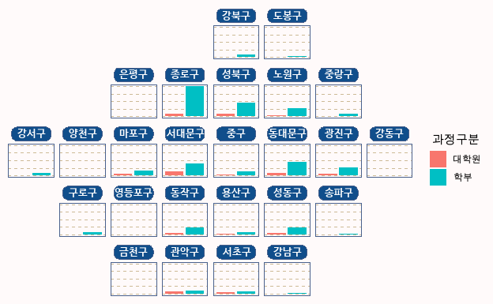

```{r setup, include=FALSE}
knitr::opts_chunk$set(echo = TRUE, message = FALSE, warning = FALSE, out.width = '100%', dpi = 120, fig.width = 6.5, fig.cap = TRUE)
library(officedown)
library(officer)

fp <- fp_par(
  text.align = "center", 
  padding.bottom = 20, padding.top = 120, 
  border.bottom = fp_border())

ft <- fp_text(shading.color='#EFEFEF', bold = TRUE)

library(showtext)
showtext_auto()
library(tidyverse)
library(readxl)
library(scales)
library(patchwork)


df_입학자 <- read_excel('c:/R/git/datavisualization/chap3/2021_연도별 입학자수.xlsx', 
                 ## 'data' 시트의 데이터를 불러오는데,
                 sheet = 'Sheet0',
                 ## 앞의 10행을 제외하고
                 skip = 3, 
                 ## 첫번째 행은 열 이름을 설정
                 col_names = FALSE, 
                 ## 열의 타입을 설정, 처음 8개는 문자형으로 다음 56개는 수치형으로 설정
                 col_types = c(rep('text', 2), rep('numeric', 30)))
df_입학자 <- df_입학자 |> select(1, 2, 5, 7, 9, 11, 13, 19, 29, 31)

## df_입학자의 열이름을 적절한 이름으로 설정
colnames(df_입학자) <- c('연도', '지역', '전문대학', '교육대학', '일반대학', '방송통신대학', '산업대학', '원격및사이버대학', '석사', '박사')

df_입학자 <- df_입학자 |> filter(!is.na(지역))

df_입학자_long <- df_입학자 |> pivot_longer(3:10, names_to = '학교종류', values_to = '입학생수')

theme_set(
  theme(
    ## 축의 눈금자(ticks)를 모두 제거
    axis.ticks = element_blank(),
    ## 축의 선을 grey50으로 설정
    axis.line = element_line(colour = "grey50"),
    ## 전체 제목의 크기를 15, 수평 정렬은 중간, 아래 여백을 20으로 설정
    plot.title = element_text(size = 15, vjust = 0.5, margin = margin(b = 10)), 
    ## 패널의 눈금선의 색을 'wheat3'로 설정
    panel.grid = element_line(color = "wheat3"), ###b4aea9
    ## 패널의 부눈금선을 제거
    panel.grid.minor = element_blank(),
    ## 패널의 X축 주눈금선을 제거
    panel.grid.major.x = element_blank(),
    ## 패널의 Y축 주눈금선을 'dashed'형태로 설정
    panel.grid.major.y = element_line(linetype = "dashed"),
    ## 패널의 배경색과 선색을 'seashell'으로 설정
    panel.background = element_rect(fill = "snow", color = "snow"),
    ## 전체 배경색과 선색을 'seashell'으로 설정
    plot.background = element_rect(fill = "snow", color = "snow"),
    ## 범례 배경색과 선색을 'seashell'으로 설정
    legend.background = element_rect(fill = "snow", color = "snow"),
    ## 범례 키의 배경색과 'seashell', 선색을 제거
    legend.key = element_rect(fill = "snow", color = NA),  #fbf9f4
    legend.title = element_text(hjust = 0.5)
    )
  )

df_입학자_long$연도 <- as.Date(df_입학자_long$연도, '%Y')

## 학교종류의 순서 설정을 위해 레벨 설정
df_입학자_long$학교종류 <- fct_relevel(df_입학자_long$학교종류, '전문대학', '일반대학', '교육대학', '산업대학',  '방송통신대학', '원격및사이버대학', '석사', '박사')

```

```{r include=FALSE}
df_취업통계 <- read_excel('c:/R/git/datavisualization/chap3/2020년 학과별 고등교육기관 취업통계.xlsx', 
                     ## '학과별' 시트의 데이터를 불러오는데,
                     sheet = '학과별',
                     ## 앞의 13행을 제외하고
                     skip = 13, 
                     ## 첫번째 행은 열 이름으로 설정
                     col_names = TRUE, 
                     ## 열의 타입을 설정, 처음 9개는 문자형으로 다음 79개는 수치형으로 설정
                     col_types = c(rep('text', 9), rep('numeric', 79)))

## df_취업통계에서 첫번째부터 9번째까지의 열과 '계'로 끝나는 열을 선택하여 다시 df_취업통계에 저장
df_취업통계 <- df_취업통계 |> select(1:9, ends_with('계'), '입대자')


```

# 비교 그룹간 분포 비교와 회귀 방정식 표기

------------------------------------------------------------------------

::: {custom-style="boxBorder"}
목표 : 비교의 대상이 되는 두 개의 그룹에 대한 산점도와 추세선을 각각 그리고 추세선의 선형회귀 방정식을 표현하여 각각의 그룹의 분포를 서로 비교하고 통계적 유의성을 전달  
활용 시각화 :  산점도, 회귀선, 클러스터 산점도, 러그 플롯, 선형회귀  
:::

```{r}
library(grid)
library(ggalt)

df_의약 <- df_취업통계 |> filter(대계열 == '의약계열')
df_인문 <- df_취업통계 |> filter(대계열 == '인문계열')

model_lm_의약 <- lm(df_의약$취업자_합계_계 ~ df_의약$졸업자_계)
model_lm_인문 <- lm(df_인문$취업자_합계_계 ~ df_인문$졸업자_계)

glance_의약 <- broom::glance(model_lm_의약)
glance_인문 <- broom::glance(model_lm_인문)

tidy_의약 <- broom::tidy(model_lm_의약)
tidy_인문 <- broom::tidy(model_lm_인문)

equ_의약 <- paste0('의약계열 : y = ', round(tidy_의약$estimate[2], 2), 'x + ', round(tidy_의약$estimate[1], 2), ', R\u00B2', ' = ',round(glance_의약$r.squared, 3))

equ_인문 <- paste0('인문계열 : y = ', round(tidy_인문$estimate[2], 2), 'x + ', round(tidy_인문$estimate[1], 2), ', R\u00B2', ' = ',round(glance_인문$r.squared, 3))

df_취업통계 |> 
  ggplot() +
  ## X축이 졸업자_계, Y축이 취업자_합계_계에 매핑된 geom_point 레이어 생성
  geom_point(aes(x = 졸업자_계, y = 취업자_합계_계), color = 'grey75', alpha = 0.5) + 
  geom_smooth(aes(x = 졸업자_계, y = 취업자_합계_계), color = 'grey75', se = F, method = 'lm') + 
  geom_point(data = df_인문,
             aes(x = 졸업자_계, y = 취업자_합계_계, color = '인문계열'), alpha = 0.5) + 
  geom_smooth(data = df_인문,
              aes(x = 졸업자_계, y = 취업자_합계_계, color = '인문계열'), se = F, method = 'lm') + 
  geom_point(data = df_의약,
             aes(x = 졸업자_계, y = 취업자_합계_계, color = '의약계열'), alpha = 0.5) + 
  geom_smooth(data = df_의약,
             aes(x = 졸업자_계, y = 취업자_합계_계, color = '의약계열'), se = F, method = 'lm') + 
  geom_encircle(data = df_의약, 
                aes(x = 졸업자_계, y = 취업자_합계_계, color='의약계열')) + 
  geom_rug(data = df_의약,
           aes(x = 졸업자_계, y = 취업자_합계_계), col= "steelblue", alpha=0.5) + 
  ## X축과 Y축의 범위를 설정
  labs(title =  '의약계열 졸업현황', x = '졸업자수', y = '취업자수', subtitle = '졸업자수 대비 취업자수', caption = '출처 : 실전에서 바로쓰는 데이터 시각화 in R') +
  scale_x_continuous(breaks = c(100, 300, 500), labels = c(100, 300, 500), limits = c(0, 500)) + 
  scale_y_continuous(breaks = c(100, 300, 500), labels = c(100, 300, 500), limits = c(0, 500)) + 
  scale_color_manual(name = NULL, values = c('의약계열' = '#4169E1', '인문계열' = '#FA8072'), 
                     labels = c(equ_의약, equ_인문)) +
  theme(strip.text.x = element_blank(),
        strip.background = element_rect(colour="white", fill="white"),
        legend.position=c(.2,.9), 
        legend.background = element_rect(fill = NA), 
        legend.key = element_rect(fill = NA), 
        plot.title = element_text(size = 20, family = 'NanumBarunGothicBold'),
        plot.subtitle = element_text(vjust = 0.5, size = 12, family = 'NanumBarunGothic'),
        axis.line = element_blank(), 
        plot.background = element_rect(fill = '#FFFAFA'), 
        panel.background = element_rect(fill = '#FFFAFA'), 
        plot.margin = margin(0.025, 0.01, 0.01, 0.01, "npc")
  )

grid.lines(
  x = c(0, 1),
  y = 1,
  gp = gpar(col = "#e5001c", lwd = 4)
)

grid.rect(
  x = 0,
  y = 1,
  width = 0.1,
  height = 0.025,
  just = c("left", "top"),
  gp = gpar(fill = "#e5001c", col = "#e5001c", lwd = 0)
)
```


# 전체 그룹의 비교 시각화와 설명문 삽입

------------------------------------------------------------------------

::: {custom-style="boxBorder"}
목표 : 전체 데이터의 그룹별 분포와 기술 통계를 시각화하여 전달하고 시각화를 통해 전달하고자 하는 인사이트를 삽입
활용 시각화 :  박스 플롯, 바이올린 플롯, 산점도(jitter)
:::

```{r}

library(ggtext)
font_add('NanumBarunGothicBold', 'c:/windows/fonts/NanumBarunGothicBold.ttf')

font_add('NanumBarunGothic', 'c:/windows/fonts/NanumBarunGothic.ttf')

df_전체_요약 <- df_취업통계 |>
  summarise(mean = mean(취업률_계), median = median(취업률_계), n = n())

subtitle <- paste0('전체 사례수 : ', scales::comma(df_전체_요약$n, accuracy = 1))

df_계열_요약 <- df_취업통계 |>
  group_by(대계열) |>
  summarise(median = median(취업률_계), n = n())

labels <- paste0('<span style= "font-family: NanumBarunGothicBold;font-size: 12pt" >', df_계열_요약$대계열, '</span> <br>', '중앙값 : ', scales::percent(df_계열_요약$median, scale = 1), '<br>', '사례수 : ', scales::comma(df_계열_요약$n, accuracy = 1))

labels_name <- pull(df_계열_요약, 대계열)

title <- "<b><span style= 'font-family: NanumBarunGothicBold;font-size: 15pt'>대학의 계열별 학과 취업률 분포</b>"

subtitle <- "<span style = 'font-size:10pt'>전체 대학의 취업률 평균은 11.11%인데 <span style = 'color:red;'>의약계열</span>의 평균이 <span style = 'color:red;'> 75.8%</span> 중앙값이 <span style = 'color:red;'> 81.4%</span>로 가장 높게 나타나고 전체적인 분포도 높게 분포함.</span>"

df_취업통계$대계열 = reorder(df_취업통계$대계열, df_취업통계$취업률_계, mean)

df_취업통계 |>
  ggplot(aes(x = 대계열, y = 취업률_계)) +
  geom_jitter(aes(color = 대계열), width = 0.1, alpha = 0.1, show.legend = F) +
  geom_boxplot(fill = NA, width = 0.4) +
  geom_violin(fill = NA, width = 0.4) +
  geom_point(aes(x = 대계열, y = 취업률_계), stat = 'summary', fun.y = 'mean', color = 'tomato3', size = 4) +
  geom_label(aes(x = 대계열, y = 취업률_계, label = paste0('평균 : ', round(..y.., 1))), stat = 'summary', fun.y = 'mean', color = 'tomato3', size = 4, nudge_y = -7) + 
  labs(title = title, x =  NULL, y =  NULL, subtitle = subtitle) +
  scale_x_discrete(expand = expansion(add = c(0.5, 0.5)), labels = setNames(labels, labels_name), limits = rev) +
  theme(strip.text.x = element_blank(),
        strip.background = element_rect(colour="white", fill="white"),
        legend.position=c(.2,.9), 
        legend.background = element_rect(fill = NA), 
        legend.key = element_rect(fill = NA), 
        plot.title = element_textbox_simple(halign = 0.5),
        plot.subtitle = element_textbox_simple(width = unit(0.95, "npc"), size = 13,
                                        lineheight = 1,
                                        padding = margin(5.5, 0.5, 5.5, 5.5),
                                        margin = margin(10, 0, 5.5, 0),
                                        halign = 0.5, 
                                        box.color = 'red',
                                        r = grid::unit(8, "pt"),
                                        linetype = 1),
        axis.line = element_blank(), 
        plot.background = element_rect(fill = 'lemonchiffon'), 
        panel.background = element_rect(fill = 'lemonchiffon'), 
        axis.text.x = element_markdown(), 
        plot.margin = margin(0.025, 0, 0.075, 0, "npc"),
  )


grid.text(
  '출처: 실전에서 바로쓰는 데이터 시각화 in R', 
  x = 0.005, 
  y = 0.03, 
  just = c("left", "bottom"),
  gp = gpar(
    col = "grey50",
    fontsize = 10,
    fontfamily = "Econ Sans Cnd"
  )
)

# Add third caption
grid.text(
  "참조 : https://www.r-graph-gallery.com/", 
  x = 0.995, 
  y = 0.03, 
  just = c("right", "bottom"),
  gp = gpar(
    col = "grey50",
    fontsize = 10,
    fontfamily = "Econ Sans Cnd"
  )
)

```


# 영국 이코노미스트지 스타일의 시각화

------------------------------------------------------------------------

::: {custom-style="boxBorder"}
목표 : 비교의 대상이 되는 두 개의 그룹에 대한 산점도와 추세선을 각각 그리고 추세선의 선형회귀 방정식을 표현하여 각각의 그룹의 분포를 서로 비교하고 통계적 유의성을 전달
활용 시각화 :  박스 플롯, 바이올린 플롯, 산점도
:::


```{r}
library(ggtext)
library(grid)
library(tidyverse)

theme_set(
  theme_grey()
)

df_total_line <- df_입학자_long |> filter(지역 == '전체', lubridate::year(연도) %in% c(seq(from = 2001, to = 2021, by = 5)), 학교종류 %in% c('전문대학', '일반대학', '석사', '박사')) 

data_labels <- bind_rows(df_total_line |> filter(lubridate::year(연도) == 2001, 학교종류 %in% c('일반대학', '석사', '박사')), df_total_line |> filter(lubridate::year(연도) == 2006, 학교종류 %in% c('전문대학')))

df_total_line |>
  ggplot(aes(x = 연도, y = (입학생수)/1000)) + 
  ## geom_line 레이어를 생성
  geom_line(aes(group = 학교종류, color = 학교종류), size = 2.4) +
  geom_point(aes(fill = 학교종류), size = 5, 
    shape = 21, # Type of point that allows us to have both color (border) and fill.
    color = "white", 
    stroke = 1 # The width of the border, i.e. stroke.
  ) + 
  scale_x_date(
    expand = c(0, 0), # The horizontal axis does not extend to either side
    limits = c(as.Date('2000-01-01'), as.Date('2022-12-01')), 
    breaks = seq(from = as.Date("2001-01-01"), to = as.Date("2021-01-01"),
                 by = "5 years"), 
    labels = lubridate::year(seq(from = as.Date("2001-01-01"), to = as.Date("2021-01-01"),
                 by = "5 years"))  # Set custom break locations
    # Set custom break locations
#    labels = c("2008", "12", "16", "20") # And custom labels on those breaks!
  ) + 
  scale_y_continuous(
    limits = c(0, 380),
    expand = c(0, 0)
  ) -> line_ch7_1

line_ch7_1 +
  theme(
    # Set background color to white
    panel.background = element_rect(fill = "white"),
    # Remove all grid lines
    panel.grid = element_blank(),
    # But add grid lines for the vertical axis, customizing color and size 
    panel.grid.major.y = element_line(color = "#A8BAC4", size = 0.3),
    # Remove tick marks on the vertical axis by setting their length to 0
    axis.ticks.length.y = unit(0, "mm"), 
    # But keep tick marks on horizontal axis
    axis.ticks.length.x = unit(2, "mm"),
    # Remove the title for both axes
    axis.title = element_blank(),
    # Only the bottom line of the vertical axis is painted in black
    axis.line.x.bottom = element_line(color = "black"),
    # Remove labels from the vertical axis
    axis.text.y = element_blank(),
    # But customize labels for the horizontal axis
    axis.text.x = element_text(family = "Econ Sans Cnd", size = 16)
  ) -> line_ch7_2


line_ch7_2 + 
  geom_text(data = data_labels, aes(x = 연도, y = (입학생수/1000) + 20, label = 학교종류, color  = 학교종류), show.legend = F) + 
  geom_text(
    data = data.frame(x = as.Date('2022-09-01'), y = seq(0, 300, by = 100)),
    aes(x, y, label = y),
    hjust = 1, # Align to the right
    vjust = -0.5, # Align to the bottom
    family = "Econ Sans Cnd",
    size = 3, 
    color = 'grey50'
  ) + 
  theme(legend.position = 'none') +
  labs(
    title = "**교육과정별 졸업생수(k)**",
  ) + 
  theme(
    # theme_markdown() is provided by ggtext and means the title contains 
    # Markdown that should be parsed as such (the '**' symbols)
    plot.title = element_markdown(
      family = "Econ Sans Cnd", 
      size = 12
    )
  ) -> line_ch7_3


ggplot(df_total_line) +
  # color = "white" indicates the color of the lines between the areas
  geom_area(aes(x = 연도, y = (입학생수)/1000, group = 학교종류, fill = 학교종류), color = "white") +
#  scale_fill_manual(values = c('grey', 'brown', 'green', 'blue')) +
  theme(legend.position = "None") + # no legend +
  scale_x_date(
  expand = c(0, 0), # The horizontal axis does not extend to either side
  limits = c(as.Date('2000-01-01'), as.Date('2022-12-01')), 
  breaks = seq(from = as.Date("2001-01-01"), to = as.Date("2021-01-01"),
               by = "5 years"), 
  labels = lubridate::year(seq(from = as.Date("2001-01-01"), to = as.Date("2021-01-01"),
                               by = "5 years"))  # Set custom break locations
  # Set custom break locations
  #    labels = c("2008", "12", "16", "20") # And custom labels on those breaks!
  ) + 
  scale_y_continuous(
    limits = c(0, 790),
    expand = c(0, 0)
  )  -> area_ch7_1

area_ch7_1 + 
  theme(
    # Set background color to white
    panel.background = element_rect(fill = "white"),
    # Remove all grid lines
    panel.grid = element_blank(),
    # But add grid lines for the vertical axis, customizing color and size 
    panel.grid.major.y = element_line(color = "#A8BAC4", size = 0.3),
    # Remove tick marks on the vertical axis by setting their length to 0
    axis.ticks.length.y = unit(0, "mm"), 
    # But keep tick marks on horizontal axis
    axis.ticks.length.x = unit(2, "mm"),
    # Remove the title for both axes
    axis.title = element_blank(),
    # Only the bottom line of the vertical axis is painted in black
    axis.line.x.bottom = element_line(color = "black"),
    # Remove labels from the vertical axis
    axis.text.y = element_blank(),
    # But customize labels for the horizontal axis
    axis.text.x = element_text(family = "Econ Sans Cnd", size = 16)
  ) -> area_ch7_2

area_ch7_2 + 
  geom_text(aes(x = as.Date('2011-01-01'), y = 600), label = '전문대학', color = 'white') + 
  geom_text(aes(x = as.Date('2011-01-01'), y = 300), label = '일반대학', color = 'white') + 
  geom_text(aes(x = as.Date('2011-01-01'), y = 80), label = '석사', color = 'white') + 
  geom_text(aes(x = as.Date('2014-01-01'), y = 80), label = '박사', color = 'white') + 
  geom_segment(aes(x = as.Date('2014-01-01'), xend = as.Date('2014-01-01'), y = 12, yend = 60), color = 'white', arrow = arrow(angle = 30, length = unit(0.1, "inches"))) + 
  geom_text(
    data = data.frame(x = as.Date('2022-09-01'), y = seq(0, 800, by = 200)),
    aes(x, y, label = y),
    hjust = 1, # Align to the right
    vjust = -0.5, # Align to the bottom
    family = "Econ Sans Cnd",
    size = 3, 
    color = 'grey50'
  ) + 
  theme(legend.position = 'none') + 
  labs(
    title = "고등교육기관 졸업생 수(k)",
  ) + 
  theme(
    plot.title = element_markdown(
      family = "Econ Sans Cnd", 
      size = 12
    )
  ) -> area_ch7_3


plt1 <- line_ch7_3 + theme(plot.margin = margin(0, 0.05, 0, 0, "npc"))
plt2 <- area_ch7_3 + theme(plot.margin = margin(0, 0, 0.05, 0, "npc"))
plt <- plt1 | plt2

title_theme <- theme(
  plot.title = element_text(
    hjust = 0.02,
    size = 15,
    margin = margin(0.8, 0, 0.3, 0, "npc")
  ),
  plot.subtitle = element_text(
    hjust = 0.02,
    size = 12,
    margin = margin(0.4, 0, 0.5, 0, "npc")
  )
)

plt <- plt + plot_annotation(
  title = "전문대학의 위기",
  subtitle = "전문대학 학생수 감소 추세",
  theme = title_theme
) +
  theme(
    plot.margin = margin(0.075, 0, 0.1, 0, "npc"),
  )
 
plt

# Add line on top of the chart
grid.lines(
  x = c(0, 1),
  y = 1,
  gp = gpar(col = "#e5001c", lwd = 4)
)

# Add rectangle on top-left
# lwd = 0 means the rectangle does not have an outer line
# 'just' gives the horizontal and vertical justification
grid.rect(
  x = 0,
  y = 1,
  width = 0.05,
  height = 0.025,
  just = c("left", "top"),
  gp = gpar(fill = "#e5001c", col = "#e5001c", lwd = 0)
)
# Add first caption
grid.text(
  '출처: 실전에서 바로쓰는 데이터 시각화 in R', 
  x = 0.005, 
  y = 0.06, 
  just = c("left", "bottom"),
  gp = gpar(
    col = "grey50",
    fontsize = 10,
    fontfamily = "Econ Sans Cnd"
  )
)

# Add third caption
grid.text(
  "참조 : https://www.r-graph-gallery.com/", 
  x = 0.995, 
  y = 0.06, 
  just = c("right", "bottom"),
  gp = gpar(
    col = "grey50",
    fontsize = 10,
    fontfamily = "Econ Sans Cnd"
  )
)

```

# 둥근 막대 그래프

------------------------------------------------------------------------

```{r}
library(tidyverse)
library(patchwork)
library(showtext)
showtext_auto()

font_add('NanumBarunGothic', 'c:/windows/fonts/NanumBarunGothic.ttf')

df_취업통계$대계열 = fct_relevel(df_취업통계$대계열, '인문계열', '사회계열', '교육계열', '자연계열', '공학계열', '의약계열', '예체능계열')

df_취업통계$과정구분 = fct_relevel(df_취업통계$과정구분, '전문대학과정', '대학과정',  '대학원과정')


df_취업통계_계열별 <- df_취업통계 |>
  group_by(과정구분, 대계열) |>  
  summarise(졸업자 = sum(졸업자_계), 
               취업자 = sum(취업자_합계_계), 
               진학자 = sum(진학자_계), 
               입대자 = sum(입대자),
               취업불가능자 = sum(취업불가능자_계), 
               외국인유학생 = sum(외국인유학생_계), 
               제외인정자 = sum(제외인정자_계),
               ## 백분률인 취업률은 그 자체로 합계나 평균을 낼 수 없으니 각 그룹별로 재계산
               취업률 = 취업자 / (졸업자 - (진학자+입대자+취업불가능자+외국인유학생+제외인정자))) |>
  ## 계열의 표시 순서를 설정하기 위해 레벨을 재조정
  arrange(과정구분, 대계열) |>
  ungroup() |>
  mutate(id = seq(1:n())) |>
  mutate(angle = 90 - (id-0.5)/n() * 360) |>
  mutate(angle1 = case_when(
    id > n()/2 ~ angle + 180, 
    id <= n()/2 ~ angle
  ))


df_취업통계_과정별 <- df_취업통계 |> 
  group_by(과정구분) |>  
  summarise(졸업자 = sum(졸업자_계), 
               취업자 = sum(취업자_합계_계), 
               진학자 = sum(진학자_계), 
               입대자 = sum(입대자),
               취업불가능자 = sum(취업불가능자_계), 
               외국인유학생 = sum(외국인유학생_계), 
               제외인정자 = sum(제외인정자_계),
               ## 백분률인 취업률은 그 자체로 합계나 평균을 낼 수 없으니 각 그룹별로 재계산
               취업률 = 취업자 / (졸업자 - (진학자+입대자+취업불가능자+외국인유학생+제외인정자))) |>
  ## 계열의 표시 순서를 설정하기 위해 레벨을 재조정
  arrange(과정구분) |>
  ungroup() |>
  mutate(id = seq(1:n())) |>
  mutate(angle = 90 - (id-0.5)/n() * 360) |>
  mutate(angle1 = case_when(
    id >= n()/2 ~ angle + 270, 
    id < n()/2 ~ angle -90, 
  ))

df_취업통계_전체 <- df_취업통계 |> 
  summarise(## 백분률인 취업률은 그 자체로 합계나 평균을 낼 수 없으니 각 그룹별로 재계산
            취업률 = sum(취업자_합계_계) / (sum(졸업자_계) - (sum(진학자_계)+sum(입대자)+sum(취업불가능자_계)+sum(외국인유학생_계)+sum(제외인정자_계)))) |>
  select(취업률) |>
  pull()

#View(df_취업통계_계열별)
# angle <- 90 - (df_취업통계_계열별$id-0.5)/nrow(df_취업통계_계열별) * 360
# calculate the ANGLE of the labels
# I substract 0.5 because the letter must have the angle of the center of the bars. Not extreme right(1) or extreme left (0)

# calculate the alignment of labels: right or left
# If I am on the left part of the plot, my labels have currently an angle < -90
#label_data$hjust<-ifelse( angle < -90, 1, 0)

# flip angle BY to make them readable
#label_data$angle<-ifelse(angle < -90, angle+180, angle)
library(geomtextpath)

df_취업통계_계열별 |>
  ggplot(aes(x = id, y = 취업률, fill = 대계열)) + 
  geom_col(position = 'dodge', show.legend = F)+ 
  scale_y_continuous(labels = scales::percent, limits = c(-0.5, 1.2)) +
  scale_x_continuous(limits = c(0.5, 21.5)) +
  annotate(xmin = 0.5, xmax = 7.5, ymin = -0.1, ymax = 1, alpha = 0.1, geom = 'rect', fill = 'red') +
  annotate(xmin = 7.5, xmax = 14.5, ymin = -0.1, ymax = 1, alpha = 0.1, geom = 'rect', fill = 'green') +
  annotate(xmin = 14.5, xmax = 21.5, ymin = -0.1, ymax = 1, alpha = 0.1, geom = 'rect', fill = 'blue') +
  geom_textpath(data = df_취업통계_과정별,aes(x = 4+((id-1)*7), y = 1.0, label = paste0(과정구분, ', ', round(취업률*100, 1), '%'), color = as.factor(id)), inherit.aes = F, show.legend = F, rich = TRUE, family = 'NanumBarunGothic') +
 geom_text(data = df_취업통계_계열별, aes(x=id, y=0.5, label=paste0(대계열, ', ', round(취업률*100, 1), '%'), angle= angle1), color="black", inherit.aes = FALSE, size = rel(3), hjust = 0.5) +
  geom_segment(data = df_취업통계_과정별, aes(x = 0.5+((id-1)*7), xend = 7.5+((id-1)*7), y = 취업률, yend = 취업률, color = as.factor(id)), inherit.aes = F, show.legend = F) + 
  scale_fill_brewer(palette = 'Set3') + 
  coord_curvedpolar() +
  theme_void() + 
  theme(plot.title = element_text(hjust = 0.5, size = 20), 
        plot.margin = margin(0.25, 0, 0, 0), 
        text = element_text(family = 'NanumBarunGothic')) + 
  annotate(x = 0.5, y = -0.35, geom = 'text', label = '전체취업률') + 
  geom_text(aes(x = 0.5, y = -0.5, label = paste0(round(df_취업통계_전체, 3)*100, '%')), size = rel(4)) 


```

# ggplot와 지도의 병합

------------------------------------------------------------------------

```{r}
if(!require(geofacet)) {
  install.packages('geofacet')
  library(geofacet)
}

font_add('NanumBarunGothic', 'c:/windows/fonts/NanumBarunGothic.ttf')
font_add('NanumBarunGothicBold', 'c:/windows/fonts/NanumBarunGothicBold.ttf')

df_seoul_grid <- read_excel('c:/R/git/datavisualization/chap12/seoul_grid.xlsx', 
                      ## 'sheet0' 시트의 데이터를 불러오는데,
                      sheet = 'Sheet1', col_names = TRUE, col_types = c('text', rep('numeric', 2)))
                      

df_행정구역 <- read_excel('c:/R/git/datavisualization/chap10/2021_행정구역별 학과수 및 학년별 재적학생수.xlsx', 
                      ## 'sheet0' 시트의 데이터를 불러오는데,
                      sheet = 'Sheet0',
                      ## 앞의 3행을 제외하고
                      skip = 3, 
                      ## 첫번째 행은 열 이름이 아님을 설정
                      col_names = FALSE, 
                      ## 열의 타입을 설정, 처음 4개는 문자형으로 다음 39개는 수치형으로 설정
                      col_types = c(rep('text', 4), rep('numeric', 39)))

## 읽어온 데이터에서 '소계', '전체'에 해당하는 데이터는 제거하고 '서울'데이터만 필터링해서 필요한 열만 남김
df_행정구역 <- df_행정구역 |> filter(...1 == '서울',  ...2 != '소계', ...3 != '전체', ...4 == '소계') |>
  select(1, 2, 3, 4, 5, 10)

## 열 이름을 적절히 설정
names(df_행정구역) <- c('시도', 'code', '과정구분', '학제구분', '대학수', '재적학생수')

## 구이음 열에서 '서울 ' 문자열을 ''으로 치환
df_행정구역$code <- gsub('서울 ', '', df_행정구역$code)

```

```{r eval = FALSE}
grid_design(data = df_seoul_grid)

df_seoul_grid$code = df_seoul_grid$name

grid_preview(df_seoul_grid)

grid_design(data = df_seoul_grid)

mygrid <- data.frame(
  name = c("강북구", "도봉구", "은평구", "종로구", "성북구", "노원구", "중랑구", "강서구", "양천구", "마포구", "서대문구", "중구", "동대문구", "광진구", "강동구", "구로구", "영등포구", "동작구", "용산구", "성동구", "송파구", "금천구", "관악구", "서초구", "강남구"),
  row = c(1, 1, 2, 2, 2, 2, 2, 3, 3, 3, 3, 3, 3, 3, 3, 4, 4, 4, 4, 4, 4, 5, 5, 5, 5),
  col = c(5, 6, 3, 4, 5, 6, 7, 1, 2, 3, 4, 5, 6, 7, 8, 2, 3, 4, 5, 6, 7, 3, 4, 5, 6),
  code = c("강북구", "도봉구", "은평구", "종로구", "성북구", "노원구", "중랑구", "강서구", "양천구", "마포구", "서대문구", "중구", "동대문구", "광진구", "강동구", "구로구", "영등포구", "동작구", "용산구", "성동구", "송파구", "금천구", "관악구", "서초구", "강남구"),
  stringsAsFactors = FALSE
)

grid_submit(mygrid, name = "mygrid", desc = "An awesome grid...")

```

```{r eval = FALSE}
df_행정구역 |>
  ggplot() +
  geom_col(aes(x = 과정구분, y = 재적학생수, fill = 과정구분)) +
  facet_geo(~code, grid = mygrid) + 
  theme(
    strip.background = element_blank(), 
    axis.line = element_blank(), 
    axis.text = element_blank(),
    axis.ticks = element_blank(),
    strip.text = element_textbox_simple(family = 'NanumBarunGothicBold', 
                                        size = 10,
                                        color = "white", fill = "dodgerblue4", box.color = "#4A618C",
                                        halign = 0.5, linetype = 1, r = unit(5, "pt"), width = unit(1, "npc"),
                                        padding = margin(2, 0, 1, 0), margin = margin(3, 3, 3, 3)), 
    panel.border = element_rect(color = '#4A618C', fill = NA), 
    panel.background = element_blank()
  ) +
  labs(x = NULL, y = NULL)
  

```




# 각 분야별 Top 3 

------------------------------------------------------------------------

```{r}
library(tidyverse)
library(showtext)
showtext_auto()

font_add('NanumBarunGothic', 'c:/windows/fonts/NanumBarunGothic.ttf')
font_add('NanumBarunGothicBold', 'c:/windows/fonts/NanumBarunGothicBold.ttf')


df_취업통계_계열별 <- df_취업통계 |> 
  group_by(과정구분, 대계열, 중계열, 소계열) |>  
  summarise(학과수 = n(), 졸업자 = sum(졸업자_계), 
               취업자 = sum(취업자_합계_계), 
               교외취업자 = sum(취업자_교외취업자_계), 
               교내취업자 = sum(취업자_교내취업자_계), 
               해외취업자 = sum(취업자_해외취업자_계), 
               농림어업종사자 = sum(취업자_농림어업종사자_계), 
               개인창작활동종사자 = sum(취업자_개인창작활동종사자_계), 
               일인창사업자 = sum(`취업자_1인창(사)업자_계`), 
               프리랜서 = sum(취업자_프리랜서_계), 
               진학자 = sum(진학자_계), 
               입대자 = sum(입대자),
               취업불가능자 = sum(취업불가능자_계), 
               외국인유학생 = sum(외국인유학생_계), 
               제외인정자 = sum(제외인정자_계), 
               기타 = sum(기타_계), 
               미상 = sum(미상_계), 
               ## 백분률인 취업률은 그 자체로 합계나 평균을 낼 수 없으니 각 그룹별로 재계산
               취업률 = 취업자 / (졸업자 - (진학자+입대자+취업불가능자+외국인유학생+제외인정자))) |>
  ## 계열의 표시 순서를 설정하기 위해 레벨을 재조정
  mutate(대계열 = fct_relevel(대계열, '인문계열', '사회계열', '교육계열', '자연계열', '공학계열', '의약계열', '예체능계열'))

df_취업통계_과정별 <- df_취업통계 |> 
  group_by(과정구분) |>  
  summarise(학과수 = n(), 졸업자 = sum(졸업자_계), 
               취업자 = sum(취업자_합계_계), 
               교외취업자 = sum(취업자_교외취업자_계), 
               교내취업자 = sum(취업자_교내취업자_계), 
               해외취업자 = sum(취업자_해외취업자_계), 
               농림어업종사자 = sum(취업자_농림어업종사자_계), 
               개인창작활동종사자 = sum(취업자_개인창작활동종사자_계), 
               일인창사업자 = sum(`취업자_1인창(사)업자_계`), 
               프리랜서 = sum(취업자_프리랜서_계), 
               진학자 = sum(진학자_계), 
               입대자 = sum(입대자),
               취업불가능자 = sum(취업불가능자_계), 
               외국인유학생 = sum(외국인유학생_계), 
               제외인정자 = sum(제외인정자_계), 
               기타 = sum(기타_계), 
               미상 = sum(미상_계), 
               ## 백분률인 취업률은 그 자체로 합계나 평균을 낼 수 없으니 각 그룹별로 재계산
               취업률 = 취업자 / (졸업자 - (진학자+입대자+취업불가능자+외국인유학생+제외인정자))) |>
  mutate(rank = min_rank(-취업률), 
         pos = case_when(
            과정구분 == '대학원과정' ~ 1,
            과정구분 == '대학과정' ~ 2,
            과정구분 == '전문대학과정' ~ 3
         ))
  


df_취업통계_소계열별 <- df_취업통계_계열별 |> filter(학과수 >= 3) |>
  group_by(과정구분) |>
  top_n(n = 10, wt = 취업률) |>
  mutate(소계열순위 = min_rank(-취업률)) |>
  mutate(과정구분 = fct_relevel(과정구분, '대학원과정', '대학과정', '전문대학과정'))
  


df_취업통계_소계열별 |>
  ggplot() + 
  geom_col(aes(x = 과정구분, y = 취업률, fill = as.factor(소계열순위)), position = position_dodge2(width = 0.9, padding = 0.1, reverse = TRUE), show.legend = FALSE, size = 0) + 
  geom_text(aes(x = 과정구분, y = 0.01, fill = as.factor(소계열순위), label = 소계열), position = position_dodge2(width = 0.9, padding = 0.1, reverse = TRUE), hjust = 0, show.legend = FALSE) +
  geom_text(aes(x = 과정구분, y = 취업률, fill = as.factor(소계열순위), label = paste0(round(취업률, 3)*100, '%')), position = position_dodge2(width = 0.9, padding = 0.1, reverse = TRUE), hjust = 1.1, show.legend = FALSE) +
  geom_segment(aes(x = 0.55, xend = 1.45, y = -0.01, yend = -0.01), color = 'goldenrod1') +
  geom_segment(aes(x = 1.55, xend = 2.45, y = -0.01, yend = -0.01), color = 'coral2') +
  geom_segment(aes(x = 2.55, xend = 3.45, y = -0.01, yend = -0.01), color = 'mediumpurple1') +
  scale_fill_manual(values = c("goldenrod1",  "mediumpurple1", "coral2", rep("gray70", 7))) +
  scale_x_discrete(labels = c('대\n학\n원\n과\n정', '대\n학\n과\n정', '전\n문\n대\n학\n과\n정'), 
                   expand = expansion(add = c(0, 0))) +
  scale_y_continuous(expand = expansion(add = c(0.005, 0.05)), label = scales::percent) +
  theme(text = element_text(family = 'NanumBarunGothic', size = rel(4)), 
        axis.text.y = element_text(hjust = 0, size = 15), 
        axis.ticks.y = element_line(unit(0, 'mm')), 
        panel.background = element_blank()) +
  labs(x = NULL, y = NULL) + 
  geom_segment(data = df_취업통계_과정별 |> filter(과정구분 == '대학원과정'), aes(x = 0.55, xend = 1.45, y = 취업률, yend = 취업률), color = 'goldenrod1') + 
  geom_segment(data = df_취업통계_과정별 |> filter(과정구분 == '대학과정'), aes(x = 1.55, xend = 2.45, y = 취업률, yend = 취업률), color = 'coral2') + 
  geom_segment(data = df_취업통계_과정별 |> filter(과정구분 == '전문대학과정'), aes(x = 2.55, xend = 3.45, y = 취업률, yend = 취업률), color = 'mediumpurple1') + 
  geom_label(data = df_취업통계_과정별 |> filter(과정구분 == '대학원과정'), aes(x = 1, y = 취업률, label = round(취업률, 3)*100), color = 'goldenrod1', fill = 'white') + 
  geom_label(data = df_취업통계_과정별 |> filter(과정구분 == '대학과정'), aes(x = 2, y = 취업률, label = round(취업률, 3)*100), color = 'coral2', fill = 'white') + 
  geom_label(data = df_취업통계_과정별 |> filter(과정구분 == '전문대학과정'), aes(x = 3, y = 취업률, label = round(취업률, 3)*100), color = 'mediumpurple1', fill = 'white') + 
  coord_flip()

```