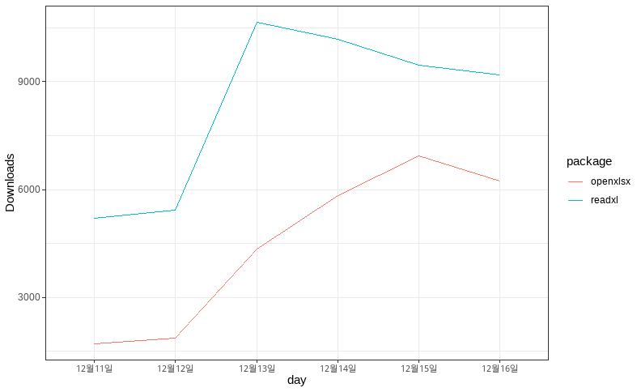
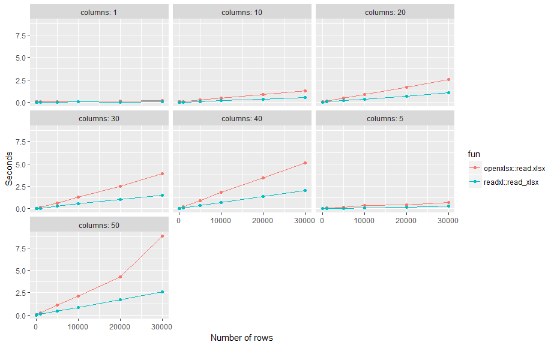

```{r setup, include=FALSE}
knitr::opts_chunk$set(echo = TRUE, message = FALSE, warning = FALSE, fig.align = "center", fig.height = 8, cache=T, dpi = 300)
library(showtext)
showtext_auto()

library(openxlsx)
getwd()

## `read.xlsx()`을 사용하여 엑셀 파일의 데이터를 불러옴
df <- read.xlsx(xlsxFile = './주요-06 (유초)지역규모별 개황(1999-2021)_211214y.xlsx', 
                sheet = 'data',  ## 불러오는 데이터가 저장된 sheet는 '학과별 주요현황'
                startRow = 11,   ##시작하는 열은 13번쨰열
                na.string = '-', ## NA값은 '-'로 표기
                colNames = F) ## 맨 첫줄은 열 이름 
```

# II. 데이터 시각화를 위한 R의 기초

R은 통계 모델링, 시각화 및 데이터 분석을 위한 최고의 프로그래밍 언어이자 R은 데이터 분석을 위한 전문 도구이다. 통계 분석, 빅 데이터 및 머신 러닝을 위해 주로 사용되며 무료 오픈 소스 프로그래밍 언어라는 매우 큰 장점이 있다. R은 ggplot, lattice, ggvis 등과 매우 우수한 데이터 시각화 패키지를 사용하여 데이터 시각화에 매우 탁월한 성능을 보여준다. 또한 전세계적으로 매우 거대한 개발자 커뮤니티를 보유하고 있기 때문에 모든 사용자는 사용자이면서 R의 개발자가 되고 있다. R은 Facebook, Google, Twitter, Uber 등의 글로벌 기업에서도 사용되고 있는 매우 훌륭한 데이터 분석 툴이다.

하지만 R은 그 자체 프로그램만으로는 사용에 불편함이 따른다. R은 C나 JAVA와 같이 프로그램을 완전히 만든후에 실행 파일을 실행시키는 컴파일러 방식의 언어가 아니고 프로그램 한줄 한줄을 실행시켜가며 사영하는 인터프리터 방식의 언어이기 때문에 코딩의 환경이 매우 중요하다. 하지만 R에서 제공하는 코딩환경은 매우 열악하다. 이를 보완하기 위해 사용되는 툴이 R-Studio이다. R-Studio는 R을 보다 편리하게 사용하게 도와주는 통합 개발 환경(IDE : Integrated Development Environment)이다. 따라서 R-Studio가 작동하기 위해서는 데이터 분석 엔진인 R이 반드시 필요하기 떄문에 두 개의 프로그램은 반드시 같이 설치해야 한다.

최근에는 R-Studio가 Python 환경까지 지원하고 R-Studio Cluod를 제공하면서 데이터 분석 종합 플랫폼으로 발전하고 있다. R-Studio Cloud는 사용자가 R과 R-Studio를 구지 자신의 PC에 설치하지 않고 인터넷이 가능한 곳에서 언제든지 데이터 분석이 가능한 환경을 제공한다.[^1]

[^1]: <https://rstudio.cloud/>

이번 장에서는 R과 R-Studio를 사용하여 데이터 시각화를 하기 위해 필요한 R의 기본적인 사용법을 알아보겠다.

## 1. R과 R-Studio의 설치

### 1.1 R의 설치

-   R 프로그램 다운로드

R을 사용하려면 먼저 R을 설치해야 한다. R을 다운로드 하려면 먼저 R공식 홈페이지(<https://www.r-project.org/>)에 들어간다.


위의 그림과 같이 R 공식 홈페이지에 들어가서 ' Download R' 링크를 클릭하면 R을 다운로드 받을 수 있는 서버를 선택하는 페이지로 넘어간다.


R을 다운로드 받을 수 있는 사이트를 'Cran'이라고 한다. Cran은 전세계에 퍼져있는데 한국 서버도 있다. 선택하는 Cran의 R 다운로드 페이지로 이동한다.


Cran의 R 다운로드 페이지에서 자신의 운영체제에 맞는 R을 다운로드 받는다. R은 현재 Linux(Debian, Fedora/Redhat, Ubuntu), MacOS, MS Windows 세가지 종류의 운영체제를 지원한다. 다운로드 페이지 상단의 운영체제를 선택하면 각각의 운영체제에 적합한 실행 파일 형태의 R을 다운로드 받을 수 있다. 만약 소스 코드를 다운로드 받아서 직접 컴파일하고자 한다면 하단의 '\*.tar.gz' 파일을 다운로드 받으면 된다.


운영체제를 선택하면 각각의 운영체제에 맞는 프로그램을 다운로드 받는 페이지로 넘어간다. 여기서는 Windows용 R을 기준으로 설명하겠다. Windows용 R을 다운로드 받는 페이지에서 'base' 링크나 'Install R for the first time'를 선택하면 R 프로그램을 다운로드 받는 페이지로 넘어간다.


이제 진짜 R 프로그램을 다운로드하는 페이지이다. 위의 'Download Rx.x.x for Windows' 링크를 선택하면 R 프로그램이 다운로드 된다.

-   R 프로그램 설치

    R을 다운로드 받았으면 해당 파일을 실행시켜 R을 설치한다. Windows에서 R을 설치하는 과정은 다음의 그림과 같이 9단계를 거친다. 몇몇의 단계에서는 R의 세부적인 설치 옵션을 설정할 수 있지만 R의 전문가가 된 후에 조절해 주는 것이 좋고 가급적이면 기본값으로 설치해 주는 것을 추천한다.

    

### 1.2 R-Studio의 설치

R을 실행해 보면 실행은 잘 되겠지만 사용에는 좀 불편함이 따른다. 우선 코딩을 직접 R 인터프리터(R 프로그램)에 해야하기 때문에 오타가 나면 처음부터 다시 코딩해야 한다. 간단한 코딩이야 별 오류없이 할 수 있겠지만 길게 코딩하면 오류를 피할 수 없다. 이렇게 R의 사용시 불편함을 해소해 주는 프로그램이 R-Studio이다. 사실 R은 분석 엔진으로써의 역할을 할 뿐 사용자는 거의 R-Studio만 사용하는 것이 일반적이다.

-   R-Studio 다운로드

R-Studio를 설치하기 위해서는 먼저 R-Studio 메인 페이지(<https://www.rstudio.com/>)에서 R-Studio를 다운로드(<https://www.rstudio.com/products/rstudio/download/>)해야 한다.


R-Studio 다운로드 페이지에 들어가면 R-Studio의 두가지 버전 중에 하나를 고를 수 있다. R-Studio Desktop은 R-Studio를 자신의 PC에 설치하는 프로그램이고 R-Studio Server는 자신의 PC에 설치하는 R-Studio를 웹을 통해 다른 사용자들이 접근할 수 있는 서버용 프로그램이다. R-Studio와 R-Studio Server는 모두 무료와 유료버전이 공존하기 떄문에 잘 보고 설치해야한다.


최근 R-Studio는 R을 지원하는 IDE에서 벗어나 Python, Jupyter, and VSCode를 지원하기 시작했다. 그러면서 Workbench라는 이름으로 서비스하는데 과거 R-Studio Server Pro 를 버전업 한 것이다.


R-Studio는 홈페이지에서 운영체제를 바로 인식해서 적합한 프로그램을 다운로드 할 수 있도록 해준다. 하지만 다른 운영체제의 R-Studio도 다운로드 받을 수 있다.

-   R-Studio 설치

    R-Studio는 5단계를 거쳐 설치된다. R과 마찬가지로 몇몇 단계에서는 세부 옵션을 설정할 수 있지만 가급적 기본값으로 설치하는 것을 권장한다.

    

## 2. R과 R-Studio의 사용

R과 R-Studio를 설치했다면 이제 R을 쓸 수 있다. 앞에서 언급했지만 R은 보통 R-Studio의 분석 엔진으로 사용되고 코딩은 R-Studio에서 하는 것이 편리하다. 따라서 R의 사용법은 따로 언급하지 않고 R-Studio의 기본 사용법을 익힌 후에 R 언어를 설명하겠다. 이번 장에서 R 언어 사용법을 설명하기 위해 사용하는 예제 데이터는

### 2.1 R-Studio의 기초 사용법

-   화면 구성

R-Studio를 실행시키면 다음과 같은 화면이 나온다.


초기 화면에서는 크게 세 부분으로 화면이 분할되어 있다. 좌측 화면은 R 콘솔로 R 프로그램을 실행한 것과 동일한 화면이고 우측 상단은 R에 로딩되어 있는 각종 데이터와 환경변수가 나타나며 우측 하단은 폴더 구조, 플롯 결과, 도움말 등이 표현된다. 이 화면에서도 코딩은 가능하지만 이 상태는 R 프로그램을 쓰는것과 다르지 않다.R-Studio의 메뉴 중 File->New File -> R Script를 선택하거나 CRTL + SHIFT + N을 눌러 소스 코드를 작성하는 추가적 화면을 불러내면 다음과 같이 나타난다.


-   소스 코드 패널 : R 언어를 코딩하는 에디터 패널이다. 이 패널은 일반 에디터와 유사하게 사용이 가능하지만 R 코드를 실행시킬수도 있다. 소스 코드 패널에서 R 코드를 실행시키려면 실행시킬 코드에 커서를 두고 CTRL + Enter를 눌러 실행시킬수 있고 특정 부분만 실행시키려면 Shift키를 이용해서 실행시킬 부분을 선택한 후 CRTL + Enter를 누르면 해당 부분만 실행된다. 사실 소스 코드 패널에서 실행되는 것이 아니고 해당 코드를 R 콘솔 패널로 넘기고 R콘솔 패널에서 실행이 되는 구조이다. 그렇기 때문에 실행결과는 소스 코드 패널에 나타나는 것이 아니고 R 콘솔 패널에 나타난다.

-   R 콘솔 패널 : 이 패널은 R 프로그램을 실행시킨 것과 동일한 화면이 나타난다. 앞서 설명한 바와 같이 소스 코드 패널에서 실행시킨 코드는 R 콘솔 패널로 전달되며 이 패널에서 실행되어 결과가 나타난다.

-   환경변수 패널 : 이 패널에는 기본적으로 5가지 정보가 탭으로 구분되어 제공된다. 첫번째 탭은 Environment 탭으로 현재 R 분석 엔진에 로딩되어 있는 각종 변수들의 형태와 데이터가 나타난다. 두번째 탭은 History탭으로 지금까지 실행시킨 R 코드들이 기록되는 탭이다. 세번째 탭는 Connection 탭으로 ODBC나 Spark를 사용하여 연결한 데이터 소스를 나타낸다. 네번째 탭은 GIt 탭으로 Github에 대이터를 올리기 위한 Commit, Push, Pull 등의 실행을 위해 사용된다. 다섯번째 탭은 Tutorial 탭으로 `learnr` 패키지에서 제공하는 R-Studio의 사용법을 표시하는 탭이다.

-   파일, 플롯, 패키지, 도움말, 뷰어 패널 : 이 패널에도 5가지 정보가 탭으로 구분되어 제공된다. 첫번째 탭은 Files 탭으로 현재 워킹 디렉토리의 파일 구조를 나타낸다. 두번쨰 탭은 Plots 탭으로 R 코드의 실행에 의해 생성된 각종 플롯이나 그래프가 표현되는 탭니다. 세번째는 Packages 탭으로 현재 R에 설치된 패키지를 나타낸다. 네번쨰는 Help 탭으로 각종 도움말이 표현되는 탭이며 다섯번째 탭은 Viewer 탭으로 웹 컨텐츠 형태로 출력되는 결과를 표현하는 탭이다.

-   단축키

    R-Stutio에서 많이 사용되는 단축키는 다음과 같다.

    

위의 표에서 제시한 단축키는 사실 전체 단축키에 일부분에 불과하다. 그렇다고 저 많은 단축키를 다 외울수는 없을 것이기 때문에 자신에게 꼭 필요한 단축키 몇 개와 Alt + Shift + K 만 외워두자. 다음의 그림은 Alt + Shift + K를 누르면 나오는 화면이다.


### 2.2 R 패키지

R이 데이터 분석 언어로써 유명해진 것은 언어 자체의 우수성이라기 보다는 R에서 지원하는 수많은 패키지의 우수성이었다. R은 비영리단체에서 유지관리하기 때문에 R의 추가적인 기능은 R 코어 팀에서 제공한다기 보다는 R을 사용하는 수많은 사용자들이 스스로 R의 개발자가 되어 많은 기능을 제공하고 있다. R의 사용자들이 R의 기능으로 제공하는 방법이 바로 패키지이다.

패키지는 R에서 특정한 기능을 제공하기 위한 데이터와 함수, 설명문 등을 모아 놓은 파일들을 말한다. R 사용자들은 자신의 목적이나 필요에 따라 패키지를 만들어 배포할 수도 있고 다른 사람들이 만들어 놓은 패키지를 다운로드 받아 사용할 수도 있다. 사용자가 개발한 수많은 패키지들 중에 R 코어 팀에서 검증하여 문제가 없다고 판단된 패키지는 R의 공식 배포 서버인 CRAN에 등록되어 공식적으로 서비스된다. 하지만 검증이 완료되지 못한 패키지들은 주로 Github에 등록하고 서비스된다. Github에 등록된 패키지를 다운로드 받기 위해서는 다운로드를 받을 Github의 주소를 알아야 다운로드를 받을 수 있다는 번거로움이 있다.

R의 공식 CRAN에는 현재(2021.12.18) 18,632개의 패키지가 배포되고 있다. 이렇게 많은 패키지를 다 알고 사용한다는 것은 불가능하기 때문에 자신이 원하는 기능의 패키지가 있는지 주기적으로 파악할 필요가 있다. 하지만 R을 사용하는 사용자에게 가장 필요한 능력은 구글링을 통해 자신이 원하는 패키지를 찾아 사용하는 능력일 것이다.

R은 R이 실행되면서 가장 기본적으로 `base` 이라는 패키지를 로딩한다. R에서 제공하는 가장 기본적인 기능들이 담겨져있는 패키지로, 이 패키지에는 산술, 입/출력, 기본 프로그래밍 지원 등 R이 언어로 기능하도록 하는 기본 기능이 포함되어 있다.

패키지 설치

R을 처음 설치하면 `base` 외에 몇가지 패키지가 설치되지만 추가로 설치해야 할 패키지가 많다. 패키지를 설치하기 위해서는 `install.packages()` 를 사용하는데 사용법과 주요 매개변수는 다음과 같다.

    install.packages(pkgs, lib, repos, dependencies)
    -   pkgs : 설치하려는 패키지 이름
    -   lib :  패키지가 설치되는 library 디렉토리
    -   repos : CRAN mirror의 URL
    -   dependencies : 설치되는 패키지가 동작하는데 필요한 패키지를 같이 설치(TRUE/FALSE)

패키지를 설치하는 코드는 다음과 같다.

```{r eval=FALSE}
install.packages('패키지명')
```

패키지를 설치한 후에 해당 패키지를 설치하기 위해서는 반드시 R 엔진에 로딩해야 한다. 이 과정이 필요한 이유는 패키지를 매번 설치하는 것을 방지하기 위해서이다. 패키지의 설치는 한번만 설치하면 되지만 설치된 패키지를 사용하는 건 필요할 때마다이기 때문에 매번 다운로드 받아 설치할 필요가 없기 때문이다. 그렇기 때문에 사용하려는 패키지는 `library()`나 `require()`를 통해 R로 불러들여야 한다.

    library(package)

    -   package : 로딩할 패키지 이름

    require(package)

    -   package : 로딩할 패키지 이름

`library()`와 `require()` 모두 패키지를 R로 로딩시켜준다. `require()`은 패키지를 로딩한 결과를 TRUE/FALSE값으로 되돌려주기 떄문에 패키지가 정상적으로 로딩되었는지 확인이 가능하다. 따라서 설치었는지 확신할 수 없는 경우 `require()`를 다음과 같이 사용할 수 있다. 아래의 코드는 R 언어 실습에 필수적으로 필요한 `tidyverse` 패키지를 설치하고 로딩하는 코드이다.

```{r, eval=FALSE}
## `requre()`를 사용해 패키지를 로딩, 정상적으로 실행되지 않으면 `if`안으로 들어감
if(!require(tidyverse)) {
  ## `tidyverse` 패키지 설치
  install.packages('tidyverse')
  ## `tidyverse` 패키지 로딩
  library(tidyverse)
}
```

### 2.3 R의 데이터 타입과 데이터 구조(Data Structure)

앞선 장에서 데이터를 불러들이는 작업과 불러들인 데이터를 확인하는 작업까지 해보았다. R 언어를 본격적으로 다루기 전에 미리 알고 가야하는 것들이 있다.

#### 가. 연산자

-   사칙연산 연산자

R의 사칙연산은 일반적인 프로그래밍언어에서 사용하는 연산자인 +, -, \*, / 를 사용한다.

-   변수 할당 연산자

`=`은 왼쪽에 지정된 변수에 오른쪽에 지정된 값을 할당하는 연산자로 다른 프로그래밍 언어에서도 공통적으로 사용되는 할당 기호이기 때문에 별다른 설명이 필요없지만 R에서 특별하게 사용되는 `->`와 `<-`는 잘 알아두는 것이 좋겠다. 사실 R에서는 `=` 보다 `->`와 `<-`를 많이 사용한다. `=`은 왼쪽의 변수에 오른쪽의 값을 대응한다. `<-` 은 `=`과 같이 왼쪽의 변수에 오른쪽 값을 대응하지만 `<-`은 오른쪽의 변수에 왼쪽의 값을 할당한다. R은 좌우를 모두 쓸수 있는 할당 연산자를 제공한다. 그래서 아래와 같은 다중 할당도 가능하다.

```{r}
a = 3 * 4   ## 변수 a에 계산값을 할당 
print(a)    ## print함수를 사용해 변수를 출력

b <- 12/3   ## 변수 b에 계산값을 할당
(b)         ## ()를 사용해 변수를 출력

'abc' -> c  ## 변수 c에 문자열을 할당
c           ## 변수명을 사용해 변수를 출력

a <- b <- c <- TRUE  ## TRUE를 a, b, c에 할당
```

-   비교 연산자

    비교 연산자는 좌측과 우측의 값을 비교 연산자에 따라 비교하여 참(TRUE) 또는 거짓(FALSE)를 돌려주는 연산자이다. 비교 연산자는 다음과 같다.

    | 연산자    | 의미              | 연산자 | 의미            |
    |-----------|-------------------|--------|-----------------|
    | ==        | 같다              | \<     | 작다            |
    | !=        | 같지않다          | \<=    | 보다 작다(이하) |
    | is.na()   | 누락값(NA)가 존재 | \>     | 크다            |
    | is.null() | NULL 값인지 비교  | \>=    | 보다 크다(이상) |

#### 나. R의 기본 데이터 타입

R 언어를 최대한 활용하려면 기본 데이터 타입과 데이터 구조, 그리고 이를 다루는 방법을 가장 먼저 알아야 한다. 데이터 구조는 R에서 데이터 분석을 위해 데이터를 불러와서 저장하는 구조이다. 이 구조를 정확하게 알아야 각종 데이터 핸들링 함수를 자유자재로 사용할 수 있다. R은 기본 데이터 타입으로 다음의 6가지를 제공한다.

-   문자(character) : "a", "가나다"

-   숫자(numeric) : 2, 15.5

-   정수(integer) : 3L (L은 정수형을 가르킴)

-   논리(logical) : TRUE, FALSE

-   복소수(complex): 1+4i

#### 나. R의 데이터 구조

R의 데이터 타입은 벡터(Vector), 행렬(Matrix) 등의 데이터 구조(Data Structure)를 구성하는 기본 단위이다. 데이터 구조는 R에서 데이터를 다루는 기본 단위이기 때문에 잘 알아둘 필요가 있다. R에서는 매우 많은 데이터 구조를 지원한다. 하지만 아래의 다섯가지가 가장 기본이 되는 데이터 구조이다. 우선 아래의 다섯가지만 잘 알아두면 R을 쓰는데 큰 무리는 없다.

-   atomic vector

    벡터는 R에서 가장 기본적인 데이터 타입이다. R에서 제공하는 거의 대부분의 데이터 구조는 기본적으로 벡터 타입에서부터 시작한다. 일반적인 프로그래밍 언어에서 보통 1차원 배열이라고 하는 타입을 R에서는 벡터라고 부른다. 벡터는 동일한 데이터 타입을 가지는 데이터의 집합을 말한다. 인덱스를 사용하여 벡터의 각각의 요소를 사용할 수도 있고 벡터 전체를 하나의 데이터처럼 사용할 수도 있다. 벡터는 그 안에 저장되는 데이터 타입이 무엇이냐에 따라 'character vector', 'numeric vector', 'logical vector', 'integer vector'로 나뉠 수 있다.

    -   벡터의 생성

        벡터를 생성할 때는 다음의 세가지 방법이 있다.

    1.  `c()` 사용 : `c()`는 'concatenate'의 준말로 괄호안에 나열한 데이터로 구성된 벡터를 만들어 주는 함수이다.

    ```{r}
    a <- c('가', '나', '다')  ## 변수 a를 문자 벡터로 할당
    a

    b <- c(1.1, 2.1, 3.1, 4.1) ## 변수 b에 실수 벡터를 할당
    b

    c <- c(1L, 2L, 3L, 4L, 5L)  ## 변수 c에 정수 벡터를 할당
    c
    ```

    2.  콜론(`:`) 연산자 사용`:`은 연속된 수치 벡터를 생성하는 연산자이다. `:`연산자의 좌측값부터 우측값까지 1씩 증가한 벡터를 생성하는데 좌측값이 정수이면 정수형 벡터를 실수이면 실수형 벡터를 생성한다.

    ```{r}
    a <- 1:20  ## 변수 a에 1부터 20까지 1씩 증가하는 정수 벡터를 할당
    a

    b <- 1.1:5.5 ## 변수 b에 1.1부터 5.5까지 1씩 증가하는 실수 벡터를 할당
    b
    ```

    3.  `seq()` 사용 : `seq()`는 'sequence'의 준말이다. 클론(`:`) 연산자와 유사한 기능을 하지만 증가량을 설정할 수 있다는 점에서 차이가 있다.

    <!-- -->

        seq(from, to, by)
        -   from : 연속된 값의 시작값
        -   to : 연속된 값의 끝값
        -   by : 연속된 값의 증감치

    ```{r}
    a <- seq(from = 20, to = 1, by = -1)  ## 20부터 1까지 -1씩 변동하는 순차값 벡터를 b에 할당
    a
    ```

    4.  `rep()` 사용 : `rep()`는 'replecate'의 준말이다. 매개변수로 지정된 값이나 벡터를 반복하여 벡터를 생성해주는 함수이다.

    <!-- -->

        rep(x, times, each, ...)
        - x : 반복에 사용할 벡터
        - times : 전체 벡터를 반복할 회수
        - each : 벡터의 원소를 반복할 회수

    ```{r}
    a <- rep(1:3, times = 3)  ## 1에서 3까지의 순차값을 가지는 벡터를 3회 반복한 벡터 생성 
    a

    b <- rep(1:3, each = 3)  ## 1에서 3까지의 순차값을 가지는 벡터의 원소를 3회 반복한 벡터 생성 
    b
    ```

    -   벡터 함수

        벡터를 다루는 함수는 매우 많다. 대표적인 네가지는 다음과 같다.

    1.  `sort()` : 벡터에 저장된 데이터 값의 크기에 따라 정렬한 벡터를 생성하는 함수

    <!-- -->

        sort(x, decreasing, ...)
        - x : 정렬에 사용할 벡터
        - decreasing : TRUE로 설정하면 내림차순으로 정렬

    ```{r}
    a <- c('c', 'd', 'a', 'b') 
    sort(a)  ## 벡터의 데이터 값에 따라 오름차순으로 정렬
    sort(a, decreasing = TRUE)  ## 벡터의 데이터 값에 따라 내림차순으로 정렬
    ```

    2.  `rev()` : 벡터에 저장된 데이터의 순서를 역순으로 바꾸는 함수

    <!-- -->

        rev(x)
        - x : 역순에 사용할 벡터

    ```{r}
    a <- c('c', 'd', 'a', 'b') 
    rev(a)  ## 벡터의 데이터 값을 역순으로 한 벡터 생성
    ```

    3.  `table()` : 벡터에 저장된 데이터의 빈도를 나타내는 함수

    <!-- -->

        table(x, ...)
        - x : 역순에 사용할 벡터

    ```{r}
    a <- c('c', 'd', 'a', 'b', 'a', 'c') 
    table(a)  ## 벡터의 데이터 값을 역순으로 한 벡터 생성
    ```

    4.  `unique()` : 벡터에 저장된 데이터의 유니크 값을 나타내는 함수

    <!-- -->

        unique(x, ...)
        - x : 유니크 값을 구할 벡터

    ```{r}
    a <- c('c', 'd', 'a', 'b', 'a', 'c') 
    unique(a)  ## 벡터의 데이터 값을 역순으로 한 벡터 생성
    ```

    -   벡터 내 데이터 선택

        벡터에 포함된 데이터를 접근하기 위해서는 다음의 두가지 방법이 있다.

    1.  인덱스를 사용한 선택 : 대괄호와 인덱스를 사용한다. 인덱스는 1부터 시작하고 대괄호 안에 지정해주면 인덱스로 지정하는 데이터를 접근할 수 있다. 인덱스는 시퀀스 함수를 사용할 수 있고 숫자 벡터의 형태로 주면 원하는 만큼의 벡터를 만들어줄 수도 있다. 또 인덱스를 음수로 써주면 해당 인덱스 데이터를 제외한다는 의미이다.

    ```{r}
    ## 인덱스를 사용한 데이터 선택
    a <- c('c', 'd', 'a', 'b', 'a', 'c') 
    a[4]     ## 벡터 a의 네번쨰 데이터 선택
    a[-4]    ## 벡터 a의 네번쨰 데이터만 제외하고 나머지 데이터 선택
    a[2:4]   ## 벡터 a의 두번째부터 네번째까지의 데이터 선택
    a[-(2:4)]  ## 벡터 a의 두번쨰부터 네번쨰까지의 데이터를 제와하고 나머지 선택
    a[c(1, 4)]  ## 벡터 a의 첫번쨰, 네번째 데이터 선택
    ```

    2.  값을 사용한 선택 : 조건식을 사용한다. 조건식에 사용하는 연산자는 비교 연산자(`==`, `<`, `>`, `<=`, `>=`, `!=`)을 사용하여 조건에 맞는 데이터를 선택할 수 있다.

    ```{r}
    ## 값을 사용한 데이터 선택
    a <- c('apple', 'banana', 'orange', 'strawberry') 
    a[a == 'apple']     ## 벡터 a의 네번쨰 데이터 선택
    a[a >= 'banana']    ## 벡터 a의 네번쨰 데이터만 제외하고 나머지 데이터 선택
    a[a %in% c('apple', 'banana')]   ## 벡터 a의 두번째부터 네번째까지의 데이터 선택
    a[-(2:4)]  ## 벡터 a의 두번쨰부터 네번쨰까지의 데이터를 제와하고 나머지 선택
    a[c(1, 4)]  ## 벡터 a의 첫번쨰, 네번째 데이터 선택
    ```

    3.  네임드 벡터(Named Vector) : 벡터의 각 데이터에 이름이 설정해놓은 네임드 벡터는 설정한 이름을 통해 해당 데이터를 접근할 수 있다.

    ```{r}
    ## 값을 사용한 데이터 선택
    a <- c('apple' = 3, 'banana' = 2, 'orange' = 5, 'strawberry' = 1) ## 네임드 벡터를 생성
    a['apple']     ## 벡터의 'apple' 데이터 출력
    a[c('apple', 'banana')]    ## 벡터의 'apple'과 'banana'를 출력
    ```

-   리스트(list)

리스트는 R에서 컨테이너 역할을 한다. 벡터는 같은 데이터 타입의 데이터 집합이지만 리스트는 다른 데이터 타입을 포함할 수 있다는 것이 가장 큰 차이이다. 리스트는 기본 데이터 타입외에 함수나 데이터프레임등의 다양한 데이터 구조를 포함할 수 있다는 점이 벡터와 가장 큰 차이이다. 리스트의 생성에는 `list()`를 사용한다. 리스트에 포함된 데이터도 벡터처럼 개별 접근이 가능한데 벡터는 단일 대괄호(\[ \])에 인덱스를 사용하나 리스트는 중복 대괄호(\[\[ \]\])에 인덱스를 사용한다는 것이 차이이다.

```{r}
a <- list(1L, '가', TRUE, 1.1)     ## 정수, 문자, 논리값, 실수를 가지는 리스트 생성 
a               ## 리스트 a의 값 출력 

a[[2]]          ## 리스트 a의 2번째 값 출력
```

리스트에서 반드시 알고 넘어가야 하는 중요한 요소가 named list이다. named list는 list의 개별 데이터를 접근하기 위한 인덱스를 숫자가 아닌 의미를 가진 문자로 설정된 리스트를 말한다. 아래의 예를 그림으로 표현해보자.

```{r}
a <- list(first = 1:5, second = c('가', '나', '다'), third = 'list testing')     ## 정수, 문자, 논리값, 실수를 가지는 리스트 생성 
```


위의 그림과 같이 변수 a에 할당된 리스트는 사실 각각의 벡터를 포인팅 하는 정보만을 가지고 있다. 앞서 리스트는 컨테이너라고 했던 이유가 바로 이것이다. 따라서 리스트를 인덱싱하는 중복 대괄호(\[\[ \]\])는 리스트에서 포인팅하고 있는 벡터를 가리키고 뒤에 벡터 인덱싱인 단일 대괄호(\[ \])를 사용하면 벡터 내에서의 개별 데이터에 접근이 가능하다.

```{r}
a               ## 리스트 a의 값 출력 
a[[2]]          ## 리스트 a의 2번째 벡터 출력
a[[2]][3]       ## 리스트 a의 2번째 벡터의 세번째 값 출력
a[[3]][1]       ## 리스트 a의 3번째 벡터 값 출력

```

-   행렬(matrix)

행렬은 2차원 벡터로 표현이 가능하다. 다만 행렬에 포함되는 데이터는 반드시 그 데이터 타입이 같은 데이터이어야 하고 일반적으로 문자형 또는 숫자형 데이터가 저장된다. 하지만 행렬은 주료 수학적 계산에 큰 장점이 있기 때문에 문자형 행렬보다는 숫자형 행렬이 효과적이다. 행렬은 `matrix()`를 사용해 생성이 가능하다.

    matrix(data, nrow, ncol, byrow, dimnames)
      - data : 행렬의 데이터가 될 벡터
      - nrow : 행렬의 행의 수
      - ncol : 행렬의 열의 수
      - byrow : TRUE일 경우 행 방향으로 데이터 저장
      - dimnames : 행과 열의 이름 설정

```{r}
a <- matrix(c(1:6), nrow = 2, ncol = 3, byrow = TRUE,
               dimnames = list(c("row1", "row2"),
                               c("col1", "col2", "col3")))
a
```

-   data frame

    데이터프레임은 R에서 데이터를 저장하는데 가장 많이 사용되는 데이터 구조이다. 흔히 표라고 말하는 형태의 2차원 자료구조인데 앞에서 설명한 2차원 자료구조인 행렬(Matrix)는 전체가 단일한 데이터 타입을 가져야하지만 데이터프레임은 각각의 열 단위로 서로 다른 데이터를 저장할 수 있다는 특징을 가진다. 일반적으로 열은 데이터의 특성을 나타내는 변수를 나타내고 행은 각각의 관찰치 케이스를 나타낸다.

    -   데이터프레임의 생성

        데이터프레임을 생성할 때는 여러개의 방법이 있다. 가장 많이 사용되는 방법은 다음 절에서 설명할 외부의 데이터를 읽어오는 방법이지만 R내에서 데이터프레임을 만들때는 각각의 데이터 변수에 해당하는 벡터를 연결하여 데이터 프레임을 만드는 방법이 있다. 데이터프레임은 `data.frame()`을 사용하여 만들수 있다.

        ```{r}
        gender <- c("M", "F", "F", "M", "M", "M")
        ages <- c(20, 21, 20, 23, 23, 25)
        name <- c('이몽룡', '성춘향', '향단이', '방자', '변학도', '이방')
        df <- data.frame(name, gender, ages)
        df
        ```

        사실 데이터프레임은 R내에서 리스트로 표현되어 있다. 그래서 다음과 같이 만들 수도 있다. 다만 리스트와 다른 점은 리스트는 리스트를 구성하는 벡터의 길이가 달라도 되지만 데이터프레임은 각각의 벡터이 길이가 같아야 한다는 점, 각각의 벡터(열)의 이름이 반드시 설정되어야 한다는 점이다.

        ```{r}
        df <- data.frame(first = 1:5, second = c('가', '나', '다', '라','마'))
        df
        ```

    -   데이터프레임 액세스

        데이터프레임의 데이터에 접근하는 방법은 데이터프레임 원소를 접근하는 방법, 열 전체를 접근하는 법, 행 전체를 접근하는 법의 세가지 방법이 있다. 보통 데이터프레임의 일부 부분을 가져오는 데 사용하기 때문에 데이터프레임 서브세팅(Subsetting)이나 필터링(Filtering)이라고도 한다.

        1.  원소 액세스 : 원소에 접근하는 방법은 대괄호(\[\])를 사용하여 행번호, 열번호로 인덱싱하여 접근한다.

            ```{r}
              df[3, 2]  ## df 데이터프레임의 2번째 행의 3번째 열을 액세스
            ```

        2.  행 방향 액세스 : 행 방향 액세스는 행 단위로 접근하는 방식을 말한다. 행 번호나 조건을 통해 해당 행의 전체를 가져올 수 있다. 행 번호 액세스는 행 번호를 인덱스하여 행 번호에 해당하는 행 전체를 가져온다. 가져오는 결과 데이터는 여러개의 데이터가 혼합되어 있을 수 있기 때문에 리스트로 저장되어 반환된다.

            ```{r}
              df[4, ]  ## df 데이터프레임의 4번째 행을 액세스
              is.list(df[4, ]) ## df 데이터프레임의 4번째 행의 액세스 결과가 리스트인지 검사
              df[2:4, ]  ## df 데이터프레임의 2번째 부터 4번째 행까지 액세스
            ```

            반면 조건을 통한 액세스는 앞서 행 인덱스를 기입했던 곳에 조건을 넣어줌으로써 해당 조건에 맞는 행을 모두 가져오는 방법이다.

            ```{r}
              df[df$first == 2,]  ## df의 first 열이 2인 행을 액세스
              is.list(df[df$first == 2,]) ## df의 first 열이 2인 행의 액세스 결과가 리스트인지 검사
            ```

        3.  열 방향 액세스 : 
        
        
-   factors

### 2.4 데이터 불러오기와 확인하기

R을 사용하여 데이터 분석을 하려면 먼저 데이터가 필요하다. 데이터는 R에서 직접 만들 수도 있고 엑셀이나 CSV 파일 등으로 저장된 데이터를 불러읽어 사용할 수도 있다. 또 ODBC나 Spark를 사용하여 외부 데이터 소스에서 데이터를 가져올 수도 있다.

-   `openxlsx` 과 `readxl` 패키지

    엑셀 파일에 저장된 데이터를 불러 들일때 많이 사용되는 패키지가 `openxlsx` 패키지와 `readxl` 패키지이다. 사실 두개의 패키지 중 더 많이 사용되는 패키지는 `readxl` 패키지이다.

    

    하지만 그림과 같이 데이터가 많아질수록 `readxl` 패키지의 성능이 `openxlsx` 보다 떨어진다고 알려져 있다.



`readxl` 패키지에서 제공하는 함수 중 엑셀 파일을 읽어들이는 함수로 많이 사용되는 함수는 `read_xlsx()`이다. 사용법과 주요 매개변수는 다음과 같다.

        read_xlsx(path, sheet,, col_names = TRUE, col_types = NULL, skip = 0)

        -   path : 읽어들일 엑셀 파일의 경로명과 파일이름
        -   sheet : 엑셀 파일 중 읽어들일 데이터가 기록된 시트명
        -   col_names : 읽어들인 데이터의 첫 행이 열 이름인지 설정
        -   col_types : 읽어들인 데이터의 각 열이 어떤 데이터 타입인지 설정
        -   skip : 읽어들일 데이터의 상위 몇 행을 제외할지 설정

`openxlsx` 패키지에서 제공하는 함수 중 엑셀 파일을 읽어들이는 함수로 많이 사용되는 함수는 `read.xlsx()`이다. 사용법과 주요 매개변수는 다음과 같다.

    read.xlsx(xlsxFile, sheet, startRow = 1, colNames = TRUE, rowNames = FALSE, ...)

        -   xlsxFile : 읽어들일 엑셀 파일의 경로명과 파일이름
        -   sheet : 엑셀 파일 중 읽어들일 데이터가 기록된 시트명
        -   startRow : 읽어들일 데이터가 시작되는 행 번호
        -   colNames : 읽어들인 데이터의 첫번째 열은 열 이름으로 설정
        -   rowNames : 읽어들인 데이터의 첫번째 행은 행 이름으로 설정

이제 실제로 데이터를 불러들여보겠다. 이번 장에서 사용할 예제 데이터는 한국교육개발원 교육통계서비스 홈페이지[^2]의 '\[06\] 지역규모별(대도시/중소도시/읍면지역/도서지역) 학교수 학생수 교원수 등(1999-2021)'[^3]를 활용하겠다.[^4]

[^2]: <https://kess.kedi.re.kr>

[^3]: <https://kess.kedi.re.kr/post/6731898?code=&words=&since=&until=&page=0&itemCode=04&menuId=m_02_04_03_01>

[^4]: 해당 데이터는 필자의 블로그(2stndard.tistory.com)에서 다운로드 받을 수 있다.

다운로드 받은 엑셀 파일의 파일명도 그대로 사용하도록 한다.(21년 고등 학과별 입학정원 입학 지원 재적 재학 휴학 외국인유학생 졸업 교원_211119.xlsx) 이 파일을 열어보면 탭이 세 개 존재하고 데이터가 들어있는 탭(학과별 주요 현황)에는 상단 몇 줄이 표 제목으로 들어있다. 이들을 모두 제거하고 데이터를 읽어들여야 한다. 본 장에서 사용하는 예제는 크기가 크지 않아서 많이 사용하는 `read_excel()`를 사용하도록 하겠다. 아래는 앞에서 설명한 `read_excel()`을 사용하여 데이터를 불러들이는 코드이다.

```{r eval=FALSE}
if(!require(readxl)) {
  install.packages('readxl')
  library(readxl)
}
## `read_excel()`을 사용하여 엑셀파일을 읽어옴
df <- read_excel('./chap2/주요-06 (유초)지역규모별 개황(1999-2021)_211214y.xlsx', 
                 ## '학과별 주요 현황' 시트의 데이터를 불러오는데,
                 sheet = 'data', 
                 skip = 10, 
                 ## 첫번째 행은 열 이름을 설정
                 col_names = FALSE, 
                 ## 열의 타입을 설정, 처음 8개는 문자형으로 다음 56개는 수치형으로 설정
                 col_types = c(rep('text', 3), rep('numeric', 45)))

```

-   데이터 확인하기

    정상적으로 데이터를 불러들였다면 데이터를 확인해보겠다. 데이터를 확인하는데는 `head()` 를 사용한다. `head()` 는 데이터의 첫 6행을 출력하는 함수이다. 만약 6행이 아닌 행의 수를 확인하려면 행의 수를 매개변수로 전달한다. 데이터의 마지막 6행을 확인하기 위해서는 `tail()` 을 사용할 수 있다.

            head(x, n = 6L, ...)
            tail(x, n = 6L, ...)

            -   x : 데이터를 확인할 데이터프레임
            -   n : 데이터를 확인할 행의 수(생략하면 기본값 6)

    ```{r}
    head(df, 4)
    ```

앞에서 벡터에 저장되는 값은 4가지 값이 저장된다고 하였다. 하지만 벡터에 저장되는 특별한 값이 있는데 NA와 Inf, NaN이다. NA는 Not Available의 준말로써 보통 결측치를 의미한다. Inf는 infinity를 의미하는 것으로 무한대를 표현한다. 무한대는 양의 무한대와 음의 무한대가 있다. NaN은 Not a Number의 준말로써 값을 정의할 수 없다는 의미이다.

```{r}
a <- c('가', '나', NA, '라')  ## 중간에 NA를 가지는 벡터를 할당
a
typeof(a)
length(a)
str(a)

b <- c(1, 2, 3, Inf, 5, -Inf)  ## 양의 무한대와 음의 무한대 값을 가지는 벡터를 할당
b
typeof(b)
length(b)
str(b)

0/0  ## 수치로 정의가 불가능한 NaN의 예

```

벡터에 저장된 많은 값들 중에 특정한 값을 접근하기 위해서는 대괄호와 인덱스를 사용한다. 인덱스는 1부터 시작하고 대괄호 안에 지정해주면 인덱스로 지정하는 데이터를 접근할 수 있다. 인덱스는 시퀀스 함수를 사용할 수 있고 숫자 벡터의 형태로 주면 원하는 만큼의 벡터를 만들어줄 수도 있다.

```{r}
a <- 1:20     ## 1부터 20까지의 순차값을 가지는 벡터 생성 
a[3]          ## 벡터 a의 3번째 값 출력
a[4:7]        ## 벡터 a의 4번째부터 7번째 값을 출력
a[seq(4, 10, 2)]    ## 벡터 a의 4번째부터 10번쨰까지 2씩 증가한 인덱스의 값을 출력
a[c(2, 5, 9, 16)]   ## 벡터 a의 2번쨰, 5번째, 9번째 16번째 값을 출력

```

```{r}
a <- b <- c <- 3 * 4   ## 변수 a, b, c에 계산값을 할당 
print(a)    ## print함수를 사용해 변수를 출력
(b)         ## ()를 사용해 변수를 출력
c           ## 변수명을 사용해 변수를 출력
```

### 2.5 tidy한 데이터 만들기
