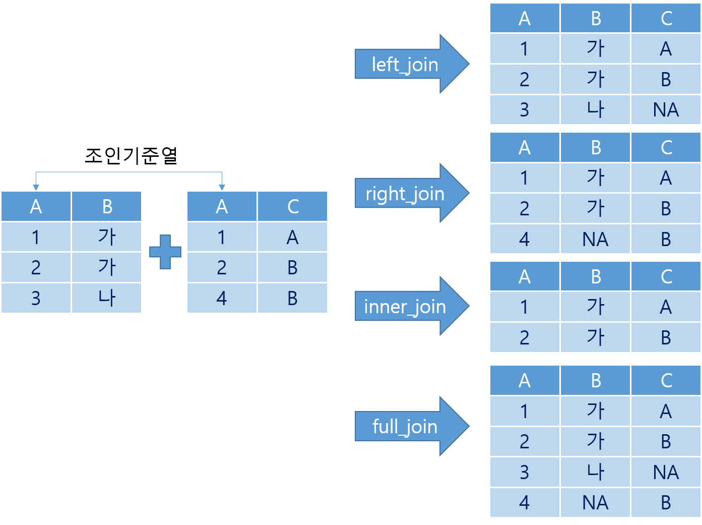

```{r setup, include=FALSE}
knitr::opts_chunk$set(echo = TRUE, message = FALSE, warning = FALSE, fig.align = "center", fig.height = 8, cache=T, dpi = 300)
library(showtext)
showtext_auto()
```

# II. 데이터 시각화를 위한 R의 기초

R은 통계 모델링, 시각화 및 데이터 분석을 위한 최고의 프로그래밍 언어이자 R은 데이터 분석을 위한 전문 도구이다. 통계 분석, 빅 데이터 및 머신 러닝을 위해 주로 사용되며 무료 오픈 소스 프로그래밍 언어라는 매우 큰 장점이 있다. R은 ggplot, lattice, ggvis 등과 매우 우수한 데이터 시각화 패키지를 사용하여 데이터 시각화에 매우 탁월한 성능을 보여준다. 또한 전세계적으로 매우 거대한 개발자 커뮤니티를 보유하고 있기 때문에 모든 사용자는 사용자이면서 R의 개발자가 되고 있다. R은 Facebook, Google, Twitter, Uber 등의 글로벌 기업에서도 사용되고 있는 매우 훌륭한 데이터 분석 툴이다.

하지만 R은 그 자체 프로그램만으로는 사용에 불편함이 따른다. R은 C나 JAVA와 같이 프로그램을 완전히 만든후에 실행 파일을 실행시키는 컴파일러 방식의 언어가 아니고 프로그램 한줄 한줄을 실행시켜가며 사영하는 인터프리터 방식의 언어이기 때문에 코딩의 환경이 매우 중요하다. 하지만 R에서 제공하는 코딩환경은 매우 열악하다. 이를 보완하기 위해 사용되는 툴이 R-Studio이다. R-Studio는 R을 보다 편리하게 사용하게 도와주는 통합 개발 환경(IDE : Integrated Development Environment)이다. 따라서 R-Studio가 작동하기 위해서는 데이터 분석 엔진인 R이 반드시 필요하기 떄문에 두 개의 프로그램은 반드시 같이 설치해야 한다.

최근에는 R-Studio가 Python 환경까지 지원하고 R-Studio Cluod를 제공하면서 데이터 분석 종합 플랫폼으로 발전하고 있다. R-Studio Cloud는 사용자가 R과 R-Studio를 구지 자신의 PC에 설치하지 않고 인터넷이 가능한 곳에서 언제든지 데이터 분석이 가능한 환경을 제공한다.[^1]

[^1]: <https://rstudio.cloud/>

이번 장에서는 R과 R-Studio를 사용하여 데이터 시각화를 하기 위해 필요한 R의 기본적인 사용법을 알아보겠다.

## 1. R과 R-Studio의 설치

### 1.1 R의 설치

#### 1.1.1 R 프로그램 다운로드

R을 사용하려면 먼저 R을 설치해야 한다. R을 다운로드 하려면 먼저 R공식 홈페이지(<https://www.r-project.org/>)에 들어간다.


위의 그림과 같이 R 공식 홈페이지에 들어가서 ' Download R' 링크를 클릭하면 R을 다운로드 받을 수 있는 서버를 선택하는 페이지로 넘어간다.


R을 다운로드 받을 수 있는 사이트를 'Cran'이라고 한다. Cran은 전세계에 퍼져있는데 한국 서버도 있다. 선택하는 Cran의 R 다운로드 페이지로 이동한다.


Cran의 R 다운로드 페이지에서 자신의 운영체제에 맞는 R을 다운로드 받는다. R은 현재 Linux(Debian, Fedora/Redhat, Ubuntu), MacOS, MS Windows 세가지 종류의 운영체제를 지원한다. 다운로드 페이지 상단의 운영체제를 선택하면 각각의 운영체제에 적합한 실행 파일 형태의 R을 다운로드 받을 수 있다. 만약 소스 코드를 다운로드 받아서 직접 컴파일하고자 한다면 하단의 '\*.tar.gz' 파일을 다운로드 받으면 된다.


운영체제를 선택하면 각각의 운영체제에 맞는 프로그램을 다운로드 받는 페이지로 넘어간다. 여기서는 Windows용 R을 기준으로 설명하겠다. Windows용 R을 다운로드 받는 페이지에서 'base' 링크나 'Install R for the first time'를 선택하면 R 프로그램을 다운로드 받는 페이지로 넘어간다.


이제 진짜 R 프로그램을 다운로드하는 페이지이다. 위의 'Download Rx.x.x for Windows' 링크를 선택하면 R 프로그램이 다운로드 된다.

#### 1.1.2 R 프로그램 설치

R을 다운로드 받았으면 해당 파일을 실행시켜 R을 설치한다. Windows에서 R을 설치하는 과정은 다음의 그림과 같이 9단계를 거친다. 몇몇의 단계에서는 R의 세부적인 설치 옵션을 설정할 수 있지만 R의 전문가가 된 후에 조절해 주는 것이 좋고 가급적이면 기본값으로 설치해 주는 것을 추천한다.


### 1.2 R-Studio의 설치

R을 실행해 보면 실행은 잘 되겠지만 사용에는 좀 불편함이 따른다. 우선 코딩을 직접 R 인터프리터(R 프로그램)에 해야하기 때문에 오타가 나면 처음부터 다시 코딩해야 한다. 간단한 코딩이야 별 오류없이 할 수 있겠지만 길게 코딩하면 오류를 피할 수 없다. 이렇게 R의 사용시 불편함을 해소해 주는 프로그램이 R-Studio이다. 사실 R은 분석 엔진으로써의 역할을 할 뿐 사용자는 거의 R-Studio만 사용하는 것이 일반적이다.

#### 1.2.1 R-Studio 다운로드

R-Studio를 설치하기 위해서는 먼저 R-Studio 메인 페이지(<https://www.rstudio.com/>)에서 R-Studio를 다운로드(<https://www.rstudio.com/products/rstudio/download/>)해야 한다.


R-Studio 다운로드 페이지에 들어가면 R-Studio의 두가지 버전 중에 하나를 고를 수 있다. R-Studio Desktop은 R-Studio를 자신의 PC에 설치하는 프로그램이고 R-Studio Server는 자신의 PC에 설치하는 R-Studio를 웹을 통해 다른 사용자들이 접근할 수 있는 서버용 프로그램이다. R-Studio와 R-Studio Server는 모두 무료와 유료버전이 공존하기 떄문에 잘 보고 설치해야한다.


최근 R-Studio는 R을 지원하는 IDE에서 벗어나 Python, Jupyter, and VSCode를 지원하기 시작했다. 그러면서 Workbench라는 이름으로 서비스하는데 과거 R-Studio Server Pro 를 버전업 한 것이다.


R-Studio는 홈페이지에서 운영체제를 바로 인식해서 적합한 프로그램을 다운로드 할 수 있도록 해준다. 하지만 다른 운영체제의 R-Studio도 다운로드 받을 수 있다.

#### 1.2.2 R-Studio 설치

R-Studio는 5단계를 거쳐 설치된다. R과 마찬가지로 몇몇 단계에서는 세부 옵션을 설정할 수 있지만 가급적 기본값으로 설치하는 것을 권장한다.


## 2. R과 R-Studio의 사용

R과 R-Studio를 설치했다면 이제 R을 쓸 수 있다. 앞에서 언급했지만 R은 보통 R-Studio의 분석 엔진으로 사용되고 코딩은 R-Studio에서 하는 것이 편리하다. 따라서 R의 사용법은 따로 언급하지 않고 R-Studio의 기본 사용법을 익힌 후에 R 언어를 설명하겠다. 이번 장에서 R 언어 사용법을 설명하기 위해 사용하는 예제 데이터는

### 2.1 R-Studio의 기초 사용법

#### 2.1.1 화면 구성

R-Studio를 실행시키면 다음과 같은 화면이 나온다.


초기 화면에서는 크게 세 부분으로 화면이 분할되어 있다. 좌측 화면은 R 콘솔로 R 프로그램을 실행한 것과 동일한 화면이고 우측 상단은 R에 로딩되어 있는 각종 데이터와 환경변수가 나타나며 우측 하단은 폴더 구조, 플롯 결과, 도움말 등이 표현된다. 이 화면에서도 코딩은 가능하지만 이 상태는 R 프로그램을 쓰는것과 다르지 않다.R-Studio의 메뉴 중 File->New File -> R Script를 선택하거나 CRTL + SHIFT + N을 눌러 소스 코드를 작성하는 추가적 화면을 불러내면 다음과 같이 나타난다.


-   소스 코드 패널 : R 언어를 코딩하는 에디터 패널이다. 이 패널은 일반 에디터와 유사하게 사용이 가능하지만 R 코드를 실행시킬수도 있다. 소스 코드 패널에서 R 코드를 실행시키려면 실행시킬 코드에 커서를 두고 CTRL + Enter를 눌러 실행시킬수 있고 특정 부분만 실행시키려면 Shift키를 이용해서 실행시킬 부분을 선택한 후 CRTL + Enter를 누르면 해당 부분만 실행된다. 사실 소스 코드 패널에서 실행되는 것이 아니고 해당 코드를 R 콘솔 패널로 넘기고 R콘솔 패널에서 실행이 되는 구조이다. 그렇기 때문에 실행결과는 소스 코드 패널에 나타나는 것이 아니고 R 콘솔 패널에 나타난다.

-   R 콘솔 패널 : 이 패널은 R 프로그램을 실행시킨 것과 동일한 화면이 나타난다. 앞서 설명한 바와 같이 소스 코드 패널에서 실행시킨 코드는 R 콘솔 패널로 전달되며 이 패널에서 실행되어 결과가 나타난다.

-   환경변수 패널 : 이 패널에는 기본적으로 5가지 정보가 탭으로 구분되어 제공된다. 첫번째 탭은 Environment 탭으로 현재 R 분석 엔진에 로딩되어 있는 각종 변수들의 형태와 데이터가 나타난다. 두번째 탭은 History탭으로 지금까지 실행시킨 R 코드들이 기록되는 탭이다. 세번째 탭는 Connection 탭으로 ODBC나 Spark를 사용하여 연결한 데이터 소스를 나타낸다. 네번째 탭은 GIt 탭으로 Github에 대이터를 올리기 위한 Commit, Push, Pull 등의 실행을 위해 사용된다. 다섯번째 탭은 Tutorial 탭으로 `learnr` 패키지에서 제공하는 R-Studio의 사용법을 표시하는 탭이다.

-   파일, 플롯, 패키지, 도움말, 뷰어 패널 : 이 패널에도 5가지 정보가 탭으로 구분되어 제공된다. 첫번째 탭은 Files 탭으로 현재 워킹 디렉토리의 파일 구조를 나타낸다. 두번쨰 탭은 Plots 탭으로 R 코드의 실행에 의해 생성된 각종 플롯이나 그래프가 표현되는 탭니다. 세번째는 Packages 탭으로 현재 R에 설치된 패키지를 나타낸다. 네번쨰는 Help 탭으로 각종 도움말이 표현되는 탭이며 다섯번째 탭은 Viewer 탭으로 웹 컨텐츠 형태로 출력되는 결과를 표현하는 탭이다.

#### 2.1.2 단축키

R-Stutio에서 많이 사용되는 단축키는 다음과 같다.


위의 표에서 제시한 단축키는 사실 전체 단축키에 일부분에 불과하다. 그렇다고 저 많은 단축키를 다 외울수는 없을 것이기 때문에 자신에게 꼭 필요한 단축키 몇 개와 Alt + Shift + K 만 외워두자. 다음의 그림은 Alt + Shift + K를 누르면 나오는 화면이다.


#### 2.1.3 프로젝트

본격적으로 R코딩을 위해서는 R 코딩을 위한 프로젝트를 생성해야한다. R-Studio에서 제공하는 프로젝트는 R의 작업 디렉토리(Working Directory)를 생성하고 해당 프로젝트의 작업 디렉토리를 설정해주기 때문에 코딩에 사용되는 관련된 파일들을 관리하기가 쉽고 여러개의 코딩 파일들을 구조적으로 관리해주기 쉬운 방법을 제공한다.

-   작업 디렉토리

    작업 디렉토리는 R에서 필요한 외부 파일을 불러오거나 저장할 때 기준이 되는 디렉토리를 말한다. 이 작업 디렉토리는 `setwd()` 로 설정할 수 있고 `getwd()` 로 현재 설정된 작업 디렉토리를 알아낼 수 있다. 사용법은 아래와 같다. 다만 사용을 할 때 하나 주의해야 하는 것은 윈도우 OS를 사용하는 경우 Path를 설정할 때 역슬래쉬(\\)를 사용하지만 `setwd()` 에 Path를 전달할 때는 역슬래쉬가 아닌 슬래쉬(/)를 사용하여야 한다.

    <div>

    getwd() : 현재 설정된 작업 디렉토리를 반환하는 함수

    setwd(dir) : dir로 전달된 디렉토리를 작업디렉토리로 설정하는 함수

    </div>

-   프로젝트 만들기

    프로젝트를 만들기 위해서는 R-Studio의 File->New Project...을 선택하면 프로젝트 생성을 위한 창이 뜬다.  

    새로운 디렉토리에 프로젝트를 생성하기 위해서는 'New Directory', 기존 디렉토리에 프로젝트를 생성하기 위해서는 'Existing Directory'를 선택한다. Github과 같은 버전 컨트롤 사이트나 리포지토리를 사용하기 위해서는 'Version Control'을 선택한다. 'New Directory'를 선택하면 프로젝트 타입을 설정하는 창이 뜨는데 원하는 프로젝트의 타입을 선택해 준다. 데이터 분석을 위한 R 코딩을 위해서 'New Project'를 선택한다.\
    

    'New Project'를 선택하면 디렉토리를 설정하는 창이 뜬다. 여기에 적절한 디렉토리 이름을 설정하면 R 프로젝트를 위한 몇 개의 파일이 생성된 디렉토리가 생성되고 작업 디렉토리가 이 디렉토리로 설정된다. [^2]

-   

    여기까지 진행하면 아래와 같이 프로젝트가 생성된다.

    

    우측 하단의 'Files' 화면을 보면 앞에서 설정한 디렉토리가 생성되었고 이 디렉토리에 프로젝트에 관련된 몇 개의 파일이 생성되었음을 볼 수 있다. 하지만 소스코드를 작성하기 위한 소스코드 패널이 보이지 않을 것이다. 앞서 설명한 바와 같이 Ctrl + Shift + N을 누르거나 File-> New File -> R Script를 선택하여 소스코드 패널을 불러낼 수 있다.

    

[^2]: 실습을 진행하기 위해 'visualizaion' 프로젝트를 생성하도록 한다. 프로젝트가 생성되는 폴더는 'C:/visualizaion'으로 설정하겠지만 사용자의 환경에 따라 적절히 설정하도록 한다.

### 2.2 R 패키지

R이 데이터 분석 언어로써 유명해진 것은 언어 자체의 우수성이라기 보다는 R에서 지원하는 수많은 패키지의 우수성이었다. R은 비영리단체에서 유지관리하기 때문에 R의 추가적인 기능은 R 코어 팀에서 제공한다기 보다는 R을 사용하는 수많은 사용자들이 스스로 R의 개발자가 되어 많은 기능을 제공하고 있다. R의 사용자들이 R의 기능으로 제공하는 방법이 바로 패키지이다.

패키지는 R에서 특정한 기능을 제공하기 위한 데이터와 함수, 설명문 등을 모아 놓은 파일들을 말한다. R 사용자들은 자신의 목적이나 필요에 따라 패키지를 만들어 배포할 수도 있고 다른 사람들이 만들어 놓은 패키지를 다운로드 받아 사용할 수도 있다. 사용자가 개발한 수많은 패키지들 중에 R 코어 팀에서 검증하여 문제가 없다고 판단된 패키지는 R의 공식 배포 서버인 CRAN에 등록되어 공식적으로 서비스된다. 하지만 검증이 완료되지 못한 패키지들은 주로 Github에 등록하고 서비스된다. Github에 등록된 패키지를 다운로드 받기 위해서는 다운로드를 받을 Github의 주소를 알아야 다운로드를 받을 수 있다는 번거로움이 있다.

R의 공식 CRAN에는 현재(2021.12.18) 18,632개의 패키지가 배포되고 있다. 이렇게 많은 패키지를 다 알고 사용한다는 것은 불가능하기 때문에 자신이 원하는 기능의 패키지가 있는지 주기적으로 파악할 필요가 있다. 하지만 R을 사용하는 사용자에게 가장 필요한 능력은 구글링을 통해 자신이 원하는 패키지를 찾아 사용하는 능력일 것이다.

R은 R이 실행되면서 가장 기본적으로 `base` 이라는 패키지를 로딩한다. R에서 제공하는 가장 기본적인 기능들이 담겨져있는 패키지로, 이 패키지에는 산술, 입/출력, 기본 프로그래밍 지원 등 R이 언어로 기능하도록 하는 기본 기능이 포함되어 있다.

#### 2.2.1 패키지 설치

R을 처음 설치하면 `base` 외에 몇가지 패키지가 설치되지만 추가로 설치해야 할 패키지가 많다. 패키지를 설치하기 위해서는 `install.packages()` 를 사용하는데 사용법과 주요 매개변수는 다음과 같다.

    install.packages(pkgs, lib, repos, dependencies)
    -   pkgs : 설치하려는 패키지 이름
    -   lib :  패키지가 설치되는 library 디렉토리
    -   repos : CRAN mirror의 URL
    -   dependencies : 설치되는 패키지가 동작하는데 필요한 패키지를 같이 설치(TRUE/FALSE)

패키지를 설치하는 코드는 다음과 같다.

```{r eval=FALSE}
install.packages('패키지명')
```

#### 2.2.2 패키지 로딩

패키지를 설치한 후에 해당 패키지를 설치하기 위해서는 반드시 R 엔진에 로딩해야 한다. 이 과정이 필요한 이유는 패키지를 매번 설치하는 것을 방지하기 위해서이다. 패키지의 설치는 한번만 설치하면 되지만 설치된 패키지를 사용하는 건 필요할 때마다이기 때문에 매번 다운로드 받아 설치할 필요가 없기 때문이다. 그렇기 때문에 사용하려는 패키지는 `library()`나 `require()`를 통해 R로 불러들여야 한다.

    library(package)

    -   package : 로딩할 패키지 이름

    require(package)

    -   package : 로딩할 패키지 이름

`library()`와 `require()` 모두 패키지를 R로 로딩시켜준다. `require()`은 패키지를 로딩한 결과를 TRUE/FALSE값으로 되돌려주기 떄문에 패키지가 정상적으로 로딩되었는지 확인이 가능하다. 따라서 설치었는지 확신할 수 없는 경우 `require()`를 다음과 같이 사용할 수 있다. 아래의 코드는 R 언어 실습에 필수적으로 필요한 `tidyverse` 패키지를 설치하고 로딩하는 코드이다.

```{r}
## `requre()`를 사용해 패키지를 로딩, 정상적으로 실행되지 않으면 `if`안으로 들어감
if(!require(tidyverse)) {
  ## `tidyverse` 패키지 설치
  install.packages('tidyverse')
  ## `tidyverse` 패키지 로딩
  library(tidyverse)
}
```

### 2.3 R의 데이터 타입과 데이터 구조(Data Structure)

앞선 장에서 데이터를 불러들이는 작업과 불러들인 데이터를 확인하는 작업까지 해보았다. R 언어를 본격적으로 다루기 전에 미리 알고 가야하는 것들이 있다.

#### 2.3.1 연산자

-   사칙연산 연산자

R의 사칙연산은 일반적인 프로그래밍언어에서 사용하는 연산자인 +, -, \*, / 를 사용한다.

-   변수 할당 연산자

`=`은 왼쪽에 지정된 변수에 오른쪽에 지정된 값을 할당하는 연산자로 다른 프로그래밍 언어에서도 공통적으로 사용되는 할당 기호이기 때문에 별다른 설명이 필요없지만 R에서 특별하게 사용되는 `->`와 `<-`는 잘 알아두는 것이 좋겠다. 사실 R에서는 `=` 보다 `->`와 `<-`를 많이 사용한다. `=`은 왼쪽의 변수에 오른쪽의 값을 대응한다. `<-` 은 `=`과 같이 왼쪽의 변수에 오른쪽 값을 대응하지만 `<-`은 오른쪽의 변수에 왼쪽의 값을 할당한다. R은 좌우를 모두 쓸수 있는 할당 연산자를 제공한다. 그래서 아래와 같은 다중 할당도 가능하다.

```{r}
a = 3 * 4   ## 변수 a에 계산값을 할당 
print(a)    ## print함수를 사용해 변수를 출력

b <- 12/3   ## 변수 b에 계산값을 할당
(b)         ## ()를 사용해 변수를 출력

'abc' -> c  ## 변수 c에 문자열을 할당
c           ## 변수명을 사용해 변수를 출력

a <- b <- c <- TRUE  ## TRUE를 a, b, c에 할당
```

-   비교 연산자

    비교 연산자는 좌측과 우측의 값을 비교 연산자에 따라 비교하여 참(TRUE) 또는 거짓(FALSE)를 돌려주는 연산자이다. 비교 연산자는 다음과 같다.

    | 연산자    | 의미              | 연산자 | 의미            |
    |-----------|-------------------|--------|-----------------|
    | ==        | 같다              | \<     | 작다            |
    | !=        | 같지않다          | \<=    | 보다 작다(이하) |
    | is.na()   | 누락값(NA)가 존재 | \>     | 크다            |
    | is.null() | NULL 값인지 비교  | \>=    | 보다 크다(이상) |

#### 2.3.2. R의 기본 데이터 타입

R 언어를 최대한 활용하려면 기본 데이터 타입과 데이터 구조, 그리고 이를 다루는 방법을 가장 먼저 알아야 한다. 데이터 구조는 R에서 데이터 분석을 위해 데이터를 불러와서 저장하는 구조이다. 이 구조를 정확하게 알아야 각종 데이터 핸들링 함수를 자유자재로 사용할 수 있다. R은 기본 데이터 타입으로 다음의 6가지를 제공한다.

-   문자(character) : "a", "가나다"

-   숫자(numeric) : 2, 15.5

-   정수(integer) : 3L (L은 정수형을 가르킴)

-   논리(logical) : TRUE, FALSE

-   복소수(complex): 1+4i

#### 2.3.3 R의 데이터 구조

R의 데이터 타입은 벡터(Vector), 행렬(Matrix) 등의 데이터 구조(Data Structure)를 구성하는 기본 단위이다. 데이터 구조는 R에서 데이터를 다루는 기본 단위이기 때문에 잘 알아둘 필요가 있다. R에서는 매우 많은 데이터 구조를 지원한다. 하지만 아래의 다섯가지가 가장 기본이 되는 데이터 구조이다. 우선 아래의 다섯가지만 잘 알아두면 R을 쓰는데 큰 무리는 없다.

##### 2.3.3.1 atomic vector

벡터는 R에서 가장 기본적인 데이터 타입이다. R에서 제공하는 거의 대부분의 데이터 구조는 기본적으로 벡터 타입에서부터 시작한다. 일반적인 프로그래밍 언어에서 보통 1차원 배열이라고 하는 타입을 R에서는 벡터라고 부른다. 벡터는 동일한 데이터 타입을 가지는 데이터의 집합을 말한다. 인덱스를 사용하여 벡터의 각각의 요소를 사용할 수도 있고 벡터 전체를 하나의 데이터처럼 사용할 수도 있다. 벡터는 그 안에 저장되는 데이터 타입이 무엇이냐에 따라 'character vector', 'numeric vector', 'logical vector', 'integer vector'로 나뉠 수 있다.

-   벡터의 생성

    벡터를 생성할 때는 다음의 세가지 방법이 있다.

1.  `c()` 사용 : `c()`는 'concatenate'의 준말로 괄호안에 나열한 데이터로 구성된 벡터를 만들어 주는 함수이다.

```{r}
a <- c('가', '나', '다')  ## 변수 a를 문자 벡터로 할당
a

b <- c(1.1, 2.1, 3.1, 4.1) ## 변수 b에 실수 벡터를 할당
b

c <- c(1L, 2L, 3L, 4L, 5L)  ## 변수 c에 정수 벡터를 할당
c
```

2.  콜론(`:`) 연산자 사용`:`은 연속된 수치 벡터를 생성하는 연산자이다. `:`연산자의 좌측값부터 우측값까지 1씩 증가한 벡터를 생성하는데 좌측값이 정수이면 정수형 벡터를 실수이면 실수형 벡터를 생성한다.

```{r}
a <- 1:20  ## 변수 a에 1부터 20까지 1씩 증가하는 정수 벡터를 할당
a

b <- 1.1:5.5 ## 변수 b에 1.1부터 5.5까지 1씩 증가하는 실수 벡터를 할당
b
```

3.  `seq()` 사용 : `seq()`는 'sequence'의 준말이다. 클론(`:`) 연산자와 유사한 기능을 하지만 증가량을 설정할 수 있다는 점에서 차이가 있다.

```{r eval=FALSE}
    seq(from, to, by)
    -   from : 연속된 값의 시작값
    -   to : 연속된 값의 끝값
    -   by : 연속된 값의 증감치
```

```{r}
a <- seq(from = 20, to = 1, by = -1)  ## 20부터 1까지 -1씩 변동하는 순차값 벡터를 b에 할당
a
```

4.  `rep()` 사용 : `rep()`는 'replecate'의 준말이다. 매개변수로 지정된 값이나 벡터를 반복하여 벡터를 생성해주는 함수이다.

```{r eval=FALSE}
    rep(x, times, each, ...)
    - x : 반복에 사용할 벡터
    - times : 전체 벡터를 반복할 회수
    - each : 벡터의 원소를 반복할 회수
```

```{r}
a <- rep(1:3, times = 3)  ## 1에서 3까지의 순차값을 가지는 벡터를 3회 반복한 벡터 생성 
a

b <- rep(1:3, each = 3)  ## 1에서 3까지의 순차값을 가지는 벡터의 원소를 3회 반복한 벡터 생성 
b
```

-   벡터 함수

벡터를 다루는 함수는 매우 많다. 대표적인 네가지는 다음과 같다.

1.  `sort()` : 벡터에 저장된 데이터 값의 크기에 따라 정렬한 벡터를 생성하는 함수

```{r eval=FALSE}
    sort(x, decreasing, ...)
    - x : 정렬에 사용할 벡터
    - decreasing : TRUE로 설정하면 내림차순으로 정렬
```

```{r}
a <- c('c', 'd', 'a', 'b') 
sort(a)  ## 벡터의 데이터 값에 따라 오름차순으로 정렬
sort(a, decreasing = TRUE)  ## 벡터의 데이터 값에 따라 내림차순으로 정렬
```

2.  `rev()` : 벡터에 저장된 데이터의 순서를 역순으로 바꾸는 함수

```{r eval=FALSE}
    rev(x)
    - x : 역순에 사용할 벡터
```

```{r}
a <- c('c', 'd', 'a', 'b') 
rev(a)  ## 벡터의 데이터 값을 역순으로 한 벡터 생성
```

3.  `table()` : 벡터에 저장된 데이터의 빈도를 나타내는 함수

```{r eval=FALSE}
    table(x, ...)
    - x : 역순에 사용할 벡터
```

```{r}
a <- c('c', 'd', 'a', 'b', 'a', 'c') 
table(a)  ## 벡터의 데이터 값을 역순으로 한 벡터 생성
```

4.  `unique()` : 벡터에 저장된 데이터의 유니크 값을 나타내는 함수

```{r eval=FALSE}
    unique(x, ...)
    - x : 유니크 값을 구할 벡터
```

```{r}
a <- c('c', 'd', 'a', 'b', 'a', 'c') 
unique(a)  ## 벡터의 데이터 값을 역순으로 한 벡터 생성
```

-   벡터 내 데이터 선택

    벡터에 포함된 데이터를 접근하기 위해서는 다음의 두가지 방법이 있다.

1.  인덱스를 사용한 선택 : 대괄호와 인덱스를 사용한다. 인덱스는 1부터 시작하고 대괄호 안에 지정해주면 인덱스로 지정하는 데이터를 접근할 수 있다. 인덱스는 시퀀스 함수를 사용할 수 있고 숫자 벡터의 형태로 주면 원하는 만큼의 벡터를 만들어줄 수도 있다. 또 인덱스를 음수로 써주면 해당 인덱스 데이터를 제외한다는 의미이다.

```{r}
## 인덱스를 사용한 데이터 선택
a <- c('c', 'd', 'a', 'b', 'a', 'c') 
a[4]     ## 벡터 a의 네번쨰 데이터 선택
a[-4]    ## 벡터 a의 네번쨰 데이터만 제외하고 나머지 데이터 선택
a[2:4]   ## 벡터 a의 두번째부터 네번째까지의 데이터 선택
a[-(2:4)]  ## 벡터 a의 두번쨰부터 네번쨰까지의 데이터를 제와하고 나머지 선택
a[c(1, 4)]  ## 벡터 a의 첫번쨰, 네번째 데이터 선택
```

2.  값을 사용한 선택 : 조건식을 사용한다. 조건식에 사용하는 연산자는 비교 연산자(`==`, `<`, `>`, `<=`, `>=`, `!=`)을 사용하여 조건에 맞는 데이터를 선택할 수 있다.

```{r}
## 값을 사용한 데이터 선택
a <- c('apple', 'banana', 'orange', 'strawberry') 
a[a == 'apple']     ## 벡터 a의 네번쨰 데이터 선택
a[a >= 'banana']    ## 벡터 a의 네번쨰 데이터만 제외하고 나머지 데이터 선택
a[a %in% c('apple', 'banana')]   ## 벡터 a의 두번째부터 네번째까지의 데이터 선택
a[-(2:4)]  ## 벡터 a의 두번쨰부터 네번쨰까지의 데이터를 제와하고 나머지 선택
a[c(1, 4)]  ## 벡터 a의 첫번쨰, 네번째 데이터 선택
```

3.  네임드 벡터(Named Vector) : 벡터의 각 데이터에 이름이 설정해놓은 네임드 벡터는 설정한 이름을 통해 해당 데이터를 접근할 수 있다.

```{r}
## 값을 사용한 데이터 선택
a <- c('apple' = 3, 'banana' = 2, 'orange' = 5, 'strawberry' = 1) ## 네임드 벡터를 생성
a['apple']     ## 벡터의 'apple' 데이터 출력
a[c('apple', 'banana')]    ## 벡터의 'apple'과 'banana'를 출력
```

##### 2.3.3.2 리스트(list)

리스트는 R에서 컨테이너 역할을 한다. 벡터는 같은 데이터 타입의 데이터 집합이지만 리스트는 다른 데이터 타입을 포함할 수 있다는 것이 가장 큰 차이이다. 리스트는 기본 데이터 타입외에 함수나 데이터프레임등의 다양한 데이터 구조를 포함할 수 있다는 점이 벡터와 가장 큰 차이이다. 리스트의 생성에는 `list()`를 사용한다. 리스트에 포함된 데이터도 벡터처럼 개별 접근이 가능한데 벡터는 단일 대괄호(\[ \])에 인덱스를 사용하나 리스트는 중복 대괄호(\[\[ \]\])에 인덱스를 사용한다는 것이 차이이다.

```{r}
a <- list(1L, '가', TRUE, 1.1)     ## 정수, 문자, 논리값, 실수를 가지는 리스트 생성 
a               ## 리스트 a의 값 출력 

a[[2]]          ## 리스트 a의 2번째 값 출력
```

리스트에서 반드시 알고 넘어가야 하는 중요한 요소가 named list이다. named list는 list의 개별 데이터를 접근하기 위한 인덱스를 숫자가 아닌 의미를 가진 문자로 설정된 리스트를 말한다. 아래의 예를 그림으로 표현해보자.

```{r}
a <- list(first = 1:5, second = c('가', '나', '다'), third = 'list testing')     ## 정수, 문자, 논리값, 실수를 가지는 리스트 생성 
```


위의 그림과 같이 변수 a에 할당된 리스트는 사실 각각의 벡터를 포인팅 하는 정보만을 가지고 있다. 앞서 리스트는 컨테이너라고 했던 이유가 바로 이것이다. 따라서 리스트를 인덱싱하는 중복 대괄호(\[\[ \]\])는 리스트에서 포인팅하고 있는 벡터를 가리키고 뒤에 벡터 인덱싱인 단일 대괄호(\[ \])를 사용하면 벡터 내에서의 개별 데이터에 접근이 가능하다.

```{r}
a               ## 리스트 a의 값 출력 
a[[2]]          ## 리스트 a의 2번째 벡터 출력
a[[2]][3]       ## 리스트 a의 2번째 벡터의 세번째 값 출력
a[[3]][1]       ## 리스트 a의 3번째 벡터 값 출력

```

##### 2.3.3.3 행렬(matrix)

행렬은 2차원 벡터로 표현이 가능하다. 다만 행렬에 포함되는 데이터는 반드시 그 데이터 타입이 같은 데이터이어야 하고 일반적으로 문자형 또는 숫자형 데이터가 저장된다. 하지만 행렬은 주료 수학적 계산에 큰 장점이 있기 때문에 문자형 행렬보다는 숫자형 행렬이 효과적이다. 행렬은 `matrix()`를 사용해 생성이 가능하다.

    matrix(data, nrow, ncol, byrow, dimnames)
      - data : 행렬의 데이터가 될 벡터
      - nrow : 행렬의 행의 수
      - ncol : 행렬의 열의 수
      - byrow : TRUE일 경우 행 방향으로 데이터 저장
      - dimnames : 행과 열의 이름 설정

```{r}
a <- matrix(c(1:6), nrow = 2, ncol = 3, byrow = TRUE,
               dimnames = list(c("row1", "row2"),
                               c("col1", "col2", "col3")))
a
```

##### 2.3.3.4 data frame

데이터프레임은 R에서 데이터를 저장하는데 가장 많이 사용되는 데이터 구조이다. 흔히 표라고 말하는 형태의 2차원 자료구조인데 앞에서 설명한 2차원 자료구조인 행렬(Matrix)는 전체가 단일한 데이터 타입을 가져야하지만 데이터프레임은 각각의 열 단위로 서로 다른 데이터를 저장할 수 있다는 특징을 가진다. 일반적으로 열은 데이터의 특성을 나타내는 변수를 나타내고 행은 각각의 관찰치 케이스를 나타낸다.

-   데이터프레임의 생성

    데이터프레임을 생성할 때는 여러개의 방법이 있다. 가장 많이 사용되는 방법은 다음 절에서 설명할 외부의 데이터를 읽어오는 방법이지만 R내에서 데이터프레임을 만들때는 각각의 데이터 변수에 해당하는 벡터를 연결하여 데이터 프레임을 만드는 방법이 있다. 데이터프레임은 `data.frame()`을 사용하여 만들수 있다.

```{r}
gender <- c("M", "F", "F", "M", "M", "M")
ages <- c(20, 21, 20, 23, 23, 25)
name <- c('이몽룡', '성춘향', '향단이', '방자', '변학도', '이방')

##  벡터들을 묶어 데이터프레임으로 저장
df_춘향전 <- data.frame(name, gender, ages)

##  데이터프레임 확인
df_춘향전

## `str()`을 사용하여 데이터프레임 구조 확인
str(df_춘향전)

```

사실 데이터프레임은 R내에서 리스트로 표현되어 있다. 그래서 다음과 같이 만들 수도 있다. 다만 리스트와 다른 점은 리스트는 리스트를 구성하는 벡터의 길이가 달라도 되지만 데이터프레임은 각각의 벡터이 길이가 같아야 한다는 점, 각각의 벡터(열)의 이름이 반드시 설정되어야 한다는 점이다.

```{r}
df_1 <- data.frame(first = 1:5, second = c('가', '나', '다', '라','마'))
df_1
```

-   데이터프레임 액세스

    데이터프레임의 데이터에 접근하는 방법은 데이터프레임 원소를 접근하는 방법, 열 전체를 접근하는 법, 행 전체를 접근하는 법의 세가지 방법이 있다. 보통 데이터프레임의 일부 부분을 가져오는 데 사용하기 때문에 데이터프레임 서브세팅(Subsetting)이나 필터링(Filtering)이라고도 한다.

    1.  원소 액세스 : 원소에 접근하는 방법은 대괄호(\[\])를 사용하여 행번호, 열번호로 인덱싱하여 접근한다.

        ```{r}
            df_1[3, 2]  ## df 데이터프레임의 2번째 행의 3번째 열을 액세스
        ```

    2.  행 방향 액세스 : 행 방향 액세스는 행 단위로 접근하는 방식을 말한다. 행 번호나 조건을 통해 해당 행의 전체를 가져올 수 있다. 행 번호 액세스는 행 번호를 인덱스하여 행 번호에 해당하는 행 전체를 가져온다. 가져오는 결과 데이터는 여러개의 데이터가 혼합되어 있을 수 있기 때문에 리스트로 저장되어 반환된다. 반면 조건을 통한 액세스는 앞서 행 인덱스를 기입했던 곳에 조건을 넣어줌으로써 해당 조건에 맞는 행을 모두 가져오는 방법이다.

        ```{r}
          df_1[4, ]  ## df 데이터프레임의 4번째 행을 액세스
          is.list(df_1[4, ]) ## df 데이터프레임의 4번째 행의 액세스 결과가 리스트인지 검사
          df_1[2:4, ]  ## df 데이터프레임의 2번째 부터 4번째 행까지 액세스
          df_1[df_1$first == 2,]  ## df의 first 열이 2인 행을 액세스
          is.list(df_1[df_1$first == 2,]) ## df의 first 열이 2인 행의 액세스 결과가 리스트인지 검사

        ```

    3.  열 방향 액세스 : 열방향 액세스는 열단위로 접근하는 방식을 말한다. 앞서 행방향 액세스처럼 행번호를 대괄호를 사용하여 인덱스로 사용할 수 있고 '\\\$' 를 사용하여 열 이름을 사용하여 액세스할 수도 있다.

        ```{r}
          ## 데이터 프레임의 두번째 열을 액세스
          df_1[, 2]
          
          ## 데이터프레임의 first열을 액세스
          df_1$first
        ```

##### 2.3.3.5 factors

팩터(factor)는 다른 프로그래밍 언어와 달리 R과 같은 데이터를 주로 다루는 언어에서 특수하게 제공하는 데이터 구조이다. 데이터를 특정한 구분으로 나누고 분류하기 위한 분류 기준으로 사용되는 데이터 구조로 사용된다. 예를 들어 학생들의 데이터를 '남', '여'로 나누거나 연령대별로 '10대', '20대', '30대 이상' 등으로 구분하고 분류하기 위해 사용되는 기준점으로 사용된다. 팩터는 구분자로 활용될 벡터를 `factor()` 를 사용하여 생성할 수 있다. 또 이미 생성된 데이터의 경우 특정 열의 데이터를 팩터로 변환함으로써 사용할 수도 있다.

```{r}
# 벡터의 생성
data <- c("10대","30대이상","20대","20대","10대","30대이상","20대","30대이상","10대")

# `factor()`를 사용하여 팩터 생성
factor_data <- factor(data)

## 'factor()`로 데이터프레임의 특정열을 팩터로 변환
df_춘향전$gender <- factor(df_춘향전$gender)

## 데이터프레임 구조 확인
str(df_춘향전)

```

팩터의 가장 큰 특징은 팩터의 요인들에 대한 순서를 설정할 수 있다는 점이다. 팩터에는 레벨(level)과 라벨(label)이라는 특성을 지닌다. 레벨은 팩터의 순서 수준을 결정하는 요인이다. 앞서 설명했던 연령대에 대한 팩터의 경우 일반적으로 순서를 '10대', '20대', '30대이상'으로 설정할 수 있다. 물론 역순으로도 설정할 수 있다.

```{r}
##  `factor()`를 사용하여 팩터를 만드는데 `level`을 사용하여 팩터 레벨을 설정
data_level <- factor(data, level = c('10대', '20대', '30대이상'))

##  `factor()`를 사용하여 팩터를 만드는데 `level`에 `unique()`를 사용하여 레벨을 설정
## `unique()` : 벡터의 원소의 종류를 벡터로 반환하는 함수
data_level_unique <- factor(data, level = unique(data))

```

라벨은 팩터의 레벨에 따라서 표시되는 문자열을 말한다. 앞선 예제에서 '10대', '20대', '30대이상'과 같은 문자열을 말한다.

```{r}
##  팩터의 라벨을 설정
data_label <- factor(data, label = c('10s', '20s', '30 or older'))
```

## 3. `tidyverse`를 사용한 데이터 조작하기

`tidyverse` 는 R-Studio를 개발하고 있는 Hadley Wickham이 주도하여 개발한 일련의 패키지들을 묶어놓은 패키지를 말한다. Hadley Wickham은 데이터 과학의 단계를 다음과 같이 5단계로 나누었다. 그리고 이 5단계를 위해 필요한 패키지들을 제작하여 전반적인 `tidyverse` 생태계를 제작해서 배포하였다.


`tidyverse` 생태계는 간결하게 정제된(tidy) 데이터를 `tidyverse` 생태계의 데이터프레임인 `tibble` 에 저장하여 사용하는 다양한 방법을 통칭한다. 따라서 `tibble` 데이터 구조를 활용하여 데이터 과학의 전반적인 단계를 수행하기 위한 다양한 패키지를 제공하는데 기본적으로 8개의 패키지를 제공한다. 하지만 8개의 패키지에서 사용하는 패키지까지 포함하면 87개 패키지를 포함한다고 알려져 있다.

| 패키지명 | 패키지 설명                         |
|----------|-------------------------------------|
| ggplot2  | 데이터 시각화 패키지                |
| dplyr    | 데이터 처리 패키지                  |
| tidyr    | 깔끔한(tidy) 데이터를 만드는 패키지 |
| readr    | 데이터를 불러들여 오는 패키지       |
| purrr    | 함수형 프로그래밍을 위한 패키지     |
| tibble   | tibble 데이터 구조를 위한 패키지    |
| stringr  | 문자열 처리를 위한 패키지           |
| forcats  | 팩터 처리를 위한 패키지             |

위의 8개의 패키지는 데이터를 가져오고(Import) 깔끔하게 정제하고(Tidy) 분석에 적합하도록 변환하고(Transform) 시각화(Visualize)하는데까지 사용되는 패키지들로 구성되어 있다. 모델링은 `tidymodel` 과 같은 추가적인 패키지나 머신러닝 패키지를 사용할 수 있다. 따라서 `tidyverse` 계열의 패키지만 잘 사용할 수 있다면 R의 기초 사용법은 대부분 다룰 수 있다고 할 수 있다. `tidyverse` 를 잘 사용하기 위해서는 우선 몇가지 사전 지식이 필요하다.

### 3.1 `tidyverse` 기초 지식

#### 3.1.1 Tidy한 데이터란?

`tidyverse` 패키지를 사용하는 `tidyverse` 생태계에서는 데이터를 간결히 정제(tidy)하게 만드는 과정이 필수적으로 선행된다. Hadley Wickham은 "Tidy Data"를 각 변수가 열이고 각 관찰(또는 사례)이 행이 되도록 배열된 데이터 세트"로 정의했다.[^3] 다음의 세가지를 만족하는 데이터를 tidy한 데이터라고 할 수 있다.

[^3]: Wickham, Hadley (20 February 2013). ["Tidy Data"](https://www.jstatsoft.org/index.php/jss/article/view/v059i10/v59i10.pdf) (PDF). *Journal of Statistical Software*.

    -   각각의 관찰값(Observation)은 하나의 행으로 구성

    -   각각의 변수(Variable)는 하나의 열로 구성된다.

    -   하나의 값(Value)은 각각의 셀로 구성된다

        

#### 3.1.2 파이프(Pipe)

`tidyverse` 계열의 패키지 함수를 사용할 때 가장 많이 사용되는 연산자가 파이프 연산자(`%>%`, `|>`)이다. `tidyverse` 생태계(echosystem)의 일부인 `magrittr` 패키지는 R 코드를 작성하기 쉽고 읽기 쉽게 만들어주는 연산자(operator)인 파이프를 제공한다. 파이프 연산자는 현재 두가지 연산자로 제공된다. R 버전 4.1 이하에서는 `%>%` 가 사용되며 R 버전 4.1 이상에서는 `%>%` 과 `|>` 의 두가지 파이프를 제공한다. 여기서는 대부분의 기능이 유사하고 최신 버전에서 사용되는 `|>` 을 위주로 설명하도록 하겠다. 파이프는 다음의 기능을 제공한다.

##### 3.1.2.1 데이터 읽는 방향의 설정

일반적인 프로그래밍 언어에서 여러 개의 함수를 하나의 코드로 작성하는 것을 중첩 함수(Nested Function)이라고 한다. 보통 중첩 함수는 뒤에서 앞으로, 오른쪽에서 왼쪽으로 실행되기 때문에 코드를 읽을 떄도 뒤에서 앞으로, 오른쪽에서 왼쪽으로 읽게 된다. 하지만 우리는 앞에서 뒤로, 왼쪽에서 오른쪽으로 글을 읽는데 익숙해 있다. 파이프는 중첩함수의 실행을 글을 읽는 방향인 앞에서 뒤로, 왼쪽에서 오른쪽으로 실행하도록 해주는 연산자이다. 다음의 예를 보자.

```{r eval=FALSE}
f(g(h(x)))
```

위의 코드는 함수 f(), g(), h()를 실행하는 코드이다. 이 코드에서 실행시킨 세개의 함수는 h(), g(), f()의 순서로 실행된다. 그렇기 때문에 이 코드를 읽을 때도 오른쪽에서 왼쪽의 방향으로 읽어야 한다. 이는 우리가 일반적으로 글을 읽는 방향과 다르고 괄호가 많기 때문에 코드를 읽기가 쉽지 않다. 이를 파이프를 사용하여 코딩하면 다음과 같다.

```{r eval=FALSE}
x |> h() |> g() |> f()
```

위의 코드는 앞선 코드보다 코드의 실행 과정이 직관적으로 구성되어 있어 읽기가 편하다. x는 다음번 함수 h()에 전달되며 이 결과값이 다음 함수 g()에 전달되고 이 결과가 다음번 함수 f()에 전달된다. 중첩 함수의 실행 순서와 읽는 방향이 모두 우리가 익숙한 방향으로 구성되어 있고 실행 과정이 순차적으로 작성되어 코드의 해석이 매우 편리해진다.

##### 3.1.2.2 첫번째 매개변수 전달

파이프는 파이프의 왼쪽(Left-Hand Side, LHS)에 지정된 객체(Object)에 오른쪽(Right-Hand Side, RHS)에 지정된 함수의 첫번째 매개변수로 전달하는 역할을 한다. 사실 이 기능이 파이프를 사용하는데 가장 편리한 기능이라고 할 수 있다. 코딩의 순차적인 결과물들을 차곡차곡 다음번 함수로 넘겨서 실행하는 것이다. 실행결과를 파이프를 사용해 다음번 함수로 넘길때 앞에서의 결과는 다음번 함수의 첫번째 매개변수가 된다. 그래서 \`tidyverse\` 생태계에서 제공하는 대부분의 함수들은 첫번째 매개변수를 데이터프레임이나 \`tibble\` 과 같은 데이터프레임의 확장 객체를 사용하고 결과값을 파이프로 전달된 객체와 동일한 형태의 객체로 전달한다. 만약 첫번째 매개변수가 데이터 프레밍 형태가 아닌 경우에는 데이터프레임 형태로 강제로 변환 후에 함수가 실행된다.

```{r}

## 파이프를 사용하여 df의 앞 3열을 확인

df_춘향전 |> head(3)

## 위의 코드를 파이프없이 동일하게 작성

head(df_춘향전, 3)

```

##### 3.1.2.3 중첩 함수 실행 방지

    파이프를 여러개 사용함으로써 함수 실행 결과를 연속하여 다음 함수에 전달할 수 있다. 결국 파이프가 중첩 함수의 사용이 없이 중첩 함수를 사용하는 동일한 결과를 내준다는 것이다. 이를 통해 코드가 더욱 읽기 쉬워진다는 장점이 있다.

```{r}
## df의 앞 열개 행을 선택하고 마지막 행을 선택 
df_춘향전 |> head(4) |> tail(2)
```

#### 3.1.3.`tibble`

`tibble` 은 `tidyverse` 생태계에서 사용하는 데이터 구조이다. R base에서 제공하는 데이터프레임을 확장한 데이터 구조로 데이터프레임과 몇가지 다른점이 있지만 가장 흔히 만날 수 있는 다른점은 데이터의 출력 방법이다. 다음의 그림을 보면 `tlbble` 데이터 구조를 출력했을때와 데이터프레임 데이터 구조를 출력했을때의 차이를 볼수 있다.


데이터프레임과 `tibble`은 R에서 큰 차이없이 사용된다. `tidyverse` 생태계 패키지 함수를 사용할 때는 사용되는 데이터가 데이터프레임이라면 먼저 내부적으로 `tibble`로 변환하고 사용된다. 데이터프레임을 `tibble`로 변환하는 함수는 `as_tibble()`이다. 
```{r eval = FALSE}
as_tibble(data, ...)
  - data : `tibble`로 변환할 객체
```

```{r}
as_tibble(df_춘향전)
```

#### 3.1.4.데이터 구조 확인

데이터프레임이던 `tibble`이던 데이터가 잘 만들어졌는지, 데이터의 행, 열 구조는 어떤지, 데이터의 형태는 어떤지를 확인해야 할때가 많다. 이렇게 데이터프레임이나 `tibble`의 구조를 확인해야 할때 사용하는 함수가 `str()`, `glimpse()`, `View()`이다. 

-   `str()` : 데이터프레임 구조 출력(R base)
-   `glimpse()` : 데이터프레임이나 `tibble`의 구조 출력
-   `View()` : 데이터프레임이나 `tibble`에 저장된 데이터를 엑셀과 같은 스프레드 시트 방식으로 출력('V'가 대문자)

```{r}
str(df_춘향전)
glimpse(df_춘향전)
```

### 3.2 `readxl` 을 사용한 데이터 불러오기(Data Import)

R을 사용하여 데이터 분석을 하려면 먼저 데이터가 필요하다. 앞절에서 설명한 바와 같이 데이터 구조에 직접 데이터를 입력해서 데이터를 만들수도 있지만 엑셀이나 CSV 파일 등으로 저장된 데이터를 불러읽어 사용할 수도 있다. 또 ODBC나 Spark를 사용하여 외부 데이터 소스에서 데이터를 가져올 수도 있다. `tidyverse` 계열 패키지는 데이터를 불러오기 위해 `realr` 패키지를 제공한다. 하지만 `readr` 패키지에는 Microsoft Excel 파일 포맷인 'xls', 'xlsx' 확장자 파일을 불러 읽을수 있는 함수를 제공하지 못한다는 치명적인 단점이 있다. 그래서 `tidyverse` 생태계에서는 Excel 파일을 불러읽도록 `readxl` 을 제공한다. 하지만 `readxl` 패키지는 데이터의 크기가 커지면 속도가 저하되는 단점이 있다. 이를 위해 `openxlsx`패키지도 많이 사용된다.

앞서 설명한 바와 같이 `tidyverse` 생태계에서는 데이터를 불러들이기 위해 기본적으로 `readr` 패키지를 제공한다. `readr` 패키지에는 다양한 파일 포맷의 데이터를 불러들이는 함수들을 제공하는데 `readr` 에서 제공하는 함수는 주요 함수는 다음과 같다.

-   `read_csv()`, `write_csv()` : 콤마(,)로 구분된 텍스트 파일(CSV)을 읽고 쓰는 함수

-   `read_csv2()`, `write_csv2()` : 세미콜론(;)로 구분된 텍스트 파일(CSV)을 읽고 쓰는 함수

-   `read_tsv()`, `write_tsv()` : 탭으로 구분된 텍스트 파일을 읽고 쓰는 함수

-   `read_delim()`, `write_delim()` : 다양한 구분자를 사용하는 텍스트 파일을 읽고 쓰는 함수

-   `read_fwf()` : 고정된 너비를 가지는 파일을 읽는 함수

-   `read_table()` : 화이트 스페이스(공란)으로 구분된 열을 가지는 표형태의 파일을 읽는 함수

-   `read_log()`: 웹 로그 파일을 읽는 함수

위의 함수와 같이 `readr` 에서 제공하는 함수로 불러들일 수 있는 데이터는 대부분 텍스트 파일 형태로 저장된 데이터이다. 사실 학교나 직장에서 많이 사용하는 엑셀 파일은 백만개이상의 데이터를 저장하는데 한계[^4]가 있기 때문에 기가급, 테라급 데이터를 저장하는데는 많은 무리가 따른다. 따라서 매우 큰 사이즈의 파일은 CSV나 TSV의 형태로 저장하여 불러들여야 한다. 물론 R을 RDB(관계형 데이터베이스, Relational DataBase)에 직접 연결하는 방법도 사용할 수 있다.

[^4]: <https://answers.microsoft.com/ko-kr/msoffice/forum/all/%EC%97%91%EC%85%80-2016-%EC%B5%9C%EB%8C%80/a0c5487b-c410-4acd-a4a6-9035d6c8f624>

하지만 회사나 학교에서는 엑셀을 사용해 저장된 데이터가 더 많을 것이다. 이러한 대중성때문에 R에서도 엑셀 파일을 불러들이는 함수를 제공하지 않을 수 없었다. 그래서 `tidyverse` 생태계에서 엑셀 파일을 불러들이는 전용 패키지인 `readxl` 패키지를 제공한다. 사실상 `readxl` 패키지에서 제공하는 함수는 엑셀 파일을 읽어들이는 함수와 엑셀파일의 메타데이터를 읽어들이는 함수 등 단 10여 개만을 제공한다. 이 중 가장 많이 사용되는 함수는 `read_excel()` 이다. `read_excel()` 의 주요 사용법은 다음과 같다.

```{r eval=FALSE}
    read_excel(path, sheet = NULL, range = NULL, col_names = TRUE,  col_types = NULL, na = "", trim_ws = TRUE, skip = 0, …)

      - path : 읽어들일 엑셀이 저장된 디렉토리와 파일명
      - sheet : 불러들일 데이터가 저장된 시트명
      - range : 데이터를 불러들일 셀 범위
      - col_names : 불러 읽어들인 데이터의 첫 행이 열 이름인지 여부
      - col_types : 불러 읽어들인 데이터의 열 타입을 설정
      - na : 결측치를 어떻게 표현할 지를 설정
      - trim_ws : 공백을 없앨것인지 여부
      - skip : 읽어들인 데이터의 상위 몇 행을 제외할지 설정
```

아래의 코드는 `read_excel()` 을 사용하여 데이터를 불러들이는 코드이다. 아래의 코드로 불러들인 데이터는 이번 장에서 샘플로 사용할 데이터로써 한국교육개발원 교육통계서비스 홈페이지[^5]의 '고등교육기관 연도별 입학자수'[^6]를 활용하였다.[^7]

[^5]: <https://kess.kedi.re.kr>

[^6]: <https://kess.kedi.re.kr/stats/school?menuCd=0102&cd=5545&survSeq=2021&itemCode=01&menuId=m_010205&uppCd1=010205&uppCd2=010205&flag=B>

[^7]: 해당 데이터는 필자의 블로그(2stndard.tistory.com)에서 다운로드 받을 수 있다. 데이터를 읽어 들이는 실제 상황을 경험하기 위해 다운로드한 데이터를 그대로 사용했다.

다운로드 받은 엑셀 파일의 파일명도 그대로 사용하도록 한다.(2021_연도별 입학자수.xlsx) 다운로드 받은 파일은 작업 디렉토리에 복사해 넣어두고, 이 파일을 열어보면 'Sheet0'탭에 데이터가 존재하고 상단 몇 줄이 열 이름이 중첩되어 들어있다. 만약 열 이름이 중첩되어 있지 않고 한 행으로 깔끔하게 들어있다면 바로 열이름으로 사용할 수 있겠지만 몇개의 행으로 중첩된 열 이름은 사용할 수 없다. 따라서 일단 중첩된 열 이름은 모두 제거하고 데이터를 읽어들여야 한다. 아래는 앞에서 설명한 `read_excel()`을 사용하여 데이터를 불러들이는 코드이다. `tidyverse` 생태계에 포함된 패키지이지만 `tidyverse` 패키지 설치와 로딩 시에 설치되지 않기 때문에 설치와 로딩이 따로 필요하다.

```{r}
if(!require(readxl)) {
  install.packages('readxl')
  library(readxl)
}
## `read_excel()`을 사용하여 엑셀파일을 읽어옴
df_입학자 <- read_excel('2021_연도별 입학자수.xlsx', 
                 ## 'data' 시트의 데이터를 불러오는데,
                 sheet = 'Sheet0',
                 ## 앞의 10행을 제외하고
                 skip = 3, 
                 ## 첫번째 행은 열 이름을 설정
                 col_names = FALSE, 
                 ## 열의 타입을 설정, 처음 8개는 문자형으로 다음 56개는 수치형으로 설정
                 col_types = c(rep('text', 2), rep('numeric', 30)))
```

정상적으로 데이터를 불러들였다면 데이터를 확인해보겠다. 데이터를 확인하는데는 `head()` 를 사용한다. `head()` 는 데이터의 첫 6행을 출력하는 함수이다. 만약 6행이 아닌 행의 수를 확인하려면 행의 수를 매개변수로 전달한다. 데이터의 마지막 6행을 확인하기 위해서는 `tail()` 을 사용할 수 있다.[^8]

[^8]: tail(df_입학자, 4)의 결과는 조금 이상해 보인다. 데이터 파일을 확인해보면 맨 마지막에 표의 간략한 설명이 들어가 있는데 이 부분도 데이터로 불러들인 것이다. 이 부분은 데이터를 처리하는 과정에서 없애도록 할것이다.

```{r eval=FALSE}
        head(x, n = 6L, ...)
        tail(x, n = 6L, ...)
            -   x : 데이터를 확인할 데이터프레임
            -   n : 데이터를 확인할 행의 수(생략하면 기본값 6)
```

```{r}
head(df_입학자, 4)
tail(df_입학자, 4)
```

위의 코드를 실행하고 데이터를 확인해보면 각각의 열의 이름이 '...1'과 같이 숫자로 설정되어 있음을 알 수 있다. 이렇게 열 이름이 설정되면 데이터의 의미를 파악하기가 매우 어려워진다. 따라서 열에 적합한 열 이름을 설정해 주어야 한다. 열 이름을 설정은 `colnames()` 를 사용할 수 있다. 위의 예에서 불러읽은 샘플 데이터의 열의 수가 32개나 되기 때문에 이중 일부만 사용하도록 하겠다. 아래의 코드에서 사용된 파이프(`|>`)와 `select()` 는 추후 설명하도록 하겠다.

```{r eval=FALSE}
colnames(x) <- value
  - x : 열 이름을 설정할 데이터프레임
  - value : 열 이름으로 설정할 문자열 벡터, 데이터 프레임의 열 수와 같은 길이의 벡터
```

```{r}
library(tidyverse)
## df_입학자 데이터에서 1, 2열과 3번부터 32열까지 2열마다 하나씩 선택하여  다시 df_입학자로 저장

df_입학자 <- df_입학자 |> select(1, 2, 5, 7, 9, 11, 13, 19, 29, 31)

## df_입학자의 열이름을 적절한 이름으로 설정
colnames(df_입학자) <- c('연도', '지역', '전문대학', '교육대학', '일반대학', '방송통신대학', '산업대학', '원격및사이버대학', '석사', '박사')
```

### 3.3 `tidyr`, `dplyr` 을 사용한 데이터 처리

`tidyr`와 `dplyr`는 `tidyverse` 생태계에서 데이터를 조작하고 처리하기 위한 가장 핵심적인 기능을 제공하는 함수이다 .이 패키지를 사용하여 데이터를 처리하거나 부분집합을 구하는 것이다. 사실 영어적 표현(subset)을 한글로 옮기다보니 다소 부자연스럽게 들리긴 하지만 전체 데이터에서 조건에 맞는 일부 데이터만 걸러내는 과정이다. 이 처리 과정은 데이터 시각화나 데이터 모델링을 위해 데이터를 전처리하기 위해서 많이 사용되지만 특정한 조건에 맞는 데이터를 알아낼 때도 많이 사용되기 때문에 잘 알아두는 것이 좋다.

#### 3.3.1 관측치(행) 서브셋(부분집합, Subset) 처리

관측치 서브셋 추출은 조건에 맞는 행을 추출하거나 행을 대상으로 연산하여 처리하는 과정을 말한다. 관측치 서브셋 추출을 위해 사용되는 함수는 `filter()`, `distinct()`, `slice()`, `top_n()`, `arrange()` 등이 있고 행의 순서를 바꾸는 `arrange()` 등이 있다.

##### 3.3.1.1 `filter()`

`filter()` 는 데이터프레임이나 `tibble` 에 저장된 데이터 중에 특정 조건에 맞는 행을 추출하기 위해 조건을 지정하는 함수이다. 조건에 TRUE인 행만 추출되며 결측치인 NA는 모두 걸러지게 된다.

```{r eval=FALSE}
filter(.data, 조건절, ...)
  - .data : 데이터프레임, `tibble`과 같은 확장된 데이터프레임
  - 조건절 : 행에 적용할 조건들의 식, 하나 이상의 조건식이 콤마(,)를 통해 나열되면 그리고(and) 조건절로 인식 
```

```{r}
## df_입학자에서 연도가 2021년인 관측치(행) 만 추출
df_입학자 |> filter(연도 == '2021')

## df_입학자에서 연도가 2021년이고 지역이 서울인 관측치(행) 만 추출
df_입학자 |> filter(연도 == '2021', 지역 == '서울')

## df_입학자에서 연도가 2021년이거나 연도가 2019인 관측치(행) 만 추출
df_입학자 |> filter(연도 == '2021' | 연도 == '2019')

## df_입학자에서 연도가 2017과 2021년이 들어간 관측치(행) 만 추출
df_입학자 |> filter(연도 %in% c('2017', '2021'))

## df_입학자에서 연도가 2021년이면서 전문대학 입학생수가 10000명 초과인 관측치(행) 만 추출
df_입학자 |> filter(연도 == '2021' ,전문대학 > 10000)

## 연도에 결측치가 입력된 데이터는 제외하여 df_입학자로 저장(엑셀 데이터 하단의 설명 라인 제거)
df_입학자 <- df_입학자 |> filter(!is.na(지역))

```

##### 3.3.1.2 `distinct()`

`distinct()` 는 데이터프레임이나 `tibble` 의 지정된 열에 포함된 값들을 알아내기 위해 사용된다.

```{r eval=FALSE}
distinct(.data, 열이름, ...)
  - .data : 데이터프레임, `tibble`과 같은 확장된 데이터프레임
  - 열이름 : .data에 포함된 열의 이름 
```

```{r}
## df_입학자에서 연도열에 포함된 값을 추출
df_입학자 |> distinct(연도)

## df_입학자에서 지역열에 포함된 값을 추출
df_입학자 |> distinct(지역)
```

##### 3.3.1.3 `slice()`

`slice()` 는 데이터프레임이나 `tibble` 에 저장된 데이터 중에 관측치의 특정 부분만을 선택할때 사용되는 함수이다.

```{r eval=FALSE}
slice(.data, 선택행, ...)
  - .data : 데이터프레임, `tibble`과 같은 확장된 데이터프레임
  - 선택행 : 선택할 행의 범위, 행 번호, 행 이름 등 행 선택을 위한 벡터 
```

```{r}
## df_입학자에서 3번째부터 6번쨰까지 관측치(행) 만 추출
df_입학자 |> slice(3:6)

## df_입학자에서 3, 5, 9번째 관측치(행) 만 추출
df_입학자 |> slice(c(3, 5, 9))

```

##### 3.3.1.4 `top_n()`

`top_n()` 은 데이터프레임이나 `tibble` 에 저장된 데이터 중에 지정된 갯수만큼 관측치의 상위 행을 선택하는 함수이다. `group_by()`로 그루핑된 경우 각각의 그룹에 상위 행을 선택한다.

```{r eval=FALSE}
top_n(x, n, wt)
  - x : 데이터프레임
  - n : `top_n()`에 의해 선택되는 행의 수
  - wt : 순서설정에 기준이 되는 열
```

```{r}
## df_입학자에서 위에서 3번째까지 관측치(행) 만 추출
df_입학자 |> top_n(3)

## df_입학자에서 원격및사이버대학의 순서대로 위에서 3번째까지 관측치(행) 만 추출
df_입학자 |> top_n(3, 원격및사이버대학)

```

##### 3.3.1.5 `arrange()`

`arrange()` 은 데이터프레임이나 `tibble` 에 저장된 데이터를 특정 열의 값을 기준으로 정렬하는 함수이다. 기본적으로 오름차순으로 정렬되지만 내림차순으로 정렬하기 위해서는 `desc()` 함수를 사용한다.

```{r eval=FALSE}
arrange(.data, 열이름, ...)
  - .data : 데이터프레임, `tibble`과 같은 확장된 데이터프레임
  - 열이름 : 정렬에 사용할 열
```

```{r}
## df_입학자에서 연도가 2021년인 관측치(행)을 일반대학 값의 오름차순으로 추출
df_입학자 |> filter(연도 == '2021') |> arrange(일반대학)

## df_입학자에서 연도가 2021년인 관측치(행)을 일반대학 값의 내림차순으로 추출
df_입학자 |> filter(연도 == '2021') |> arrange(desc(일반대학))

```

#### 3.3.2 변수(열) 서브셋 추출

변수 서브셋 추출은 조건에 맞는 열을 추출하거나 열을 대상으로 하는 연산하여 처리하는 과정을 말한다. 변수 서브셋 추출을 위해 사용되는 함수는 `select()`가 유일하다. 또 열에 대한 조건 검색은 열의 이름을 대상으로 하는데 행과 같은 조건절을 사용하지 않고 열 이름의 문자열을 처리하는 함수를 사용한다. 이 함수를 헬퍼 함수라고 하는데 `contains()`, `ends_with()`, `everything()`, `matches()`, `starts_with()` 등이 있다.

-   `contains()` : 특정 문자열이 들어가 있는 열 이름을 가진 열 선택

-   `everything()` : 전체 열을 선택

-   `starts_with()` : 특정 문자열로 시작하는 열 이름을 가진 열 선택

-   `ends_with()` : 특정 문자열로 끝나는 열 이름을 가진 열 선택

-   `matches()` : 정규표현식[^9](Regular Expression)에 맞는 열 선택

[^9]: 특정한 규칙을 가진 문자열의 집합을 표현하는 데 사용하는 형식 언어로 문자열의 일정한 패턴을 표현하는 방법을 말한다.

```{r eval=FALSE}
select(.data, ...)
  - .data : 데이터프레임, `tibble`과 같은 확장된 데이터프레임
  - ... : 열 선택을 위한 열 번호 또는 열 이름 벡터나 헬퍼 함수
```

```{r}
## df_입학자에서 연도가 2021인 행 중에서 1번쨰부터 3번째까지 변수(열) 만 추출
df_입학자 |> filter(연도 == '2021') |> select(1:3)

## df_입학자에서 연도가 2021인 행 중에서 일반대학과 석사 변수(열) 만 추출
df_입학자 |> filter(연도 == '2021') |> select(일반대학, 석사)

## df_입학자에서 연도가 2021인 행 중에서 열이름데 '사'가 들어가는 변수(열) 만 추출
df_입학자 |> filter(연도 == '2021') |> select(contains('사'))

## df_입학자에서 연도가 2021인 행 중에서 열이름데 '사'로 끝나는 변수(열) 만 추출
df_입학자 |> filter(연도 == '2021') |> select(ends_with('사'))

```


#### 3.3.3 변수(열) 만들기(mutate)

데이터를 처음 불러읽어들인 후에 데이터간의 연산 및 처리의 결과를 데이터프레임에 저장해야할 경우가 많다. 예를 들어 성적 데이터의 경우 학생들의 성적 합계를 구해 합계 열을 만든다거나 합계에 따라 평균을 구한다거나 평균에 따른 등위를 구해서 해당 학생의 변수로 저장하는 경우이다. 이때 사용하는 함수가 `mutate()`와 `transmute()`이다. `mutate()`는 계산식에 따라 계산된 결과를 지정한 열 이름으로 생성한 후 데이터프레임의 맨 뒤에 생성한다. 반면 `transmute()`는 ``mutate()`와 유사하게 작동하지만 기존의 열이 삭제되고 계산된 열만 나타난다. 이 두 함수는 뒤에서 설명할 `summarise()`와 유사하지만 매우 다른 함수이다. `mutate()`로 생성된 열은 행 단위로 계산되고 모든 관측치(행)에 동일하게 적용된다. 


```{r eval=FALSE}
summarise(.data, 연산식, ...)
  - .data : 열을 추가할 데이터프레임이나 `tibble`
  - 연산식 : 요약값을 산출할 연산식 
```

```{r}
df_입학자 |> summarise(전문대학합계 = sum(전문대학), 전문대학평균 = mean(전문대학), 전문대학최고 = max(전문대학), 전문대학최저 = min(전문대학))

df_입학자 |> mutate(전문대학비율 = 전문대학 / (전문대학 + 교육대학 + 일반대학 + 방송통신대학 + 산업대학 + 원격및사이버대학 + 석사 + 박사))

df_입학자 |> transmute(합계 = 전문대학 + 교육대학 + 일반대학 + 방송통신대학 + 산업대학 + 원격및사이버대학 + 석사 + 박사)

df_입학자 |> transmute(연도, 지역, 전문대학비율 = 전문대학 / (전문대학 + 교육대학 + 일반대학 + 방송통신대학 + 산업대학 + 원격및사이버대학 + 석사 + 박사))

```

#### 3.3.4 데이터 요약하기(summarise)

위에서 살펴본 `muatate()`는 행 단위로 주어진 연산을 통해 산출된 결과값을 가진 열을 추가하는 함수이다. 하지만 각각의 행 단위가 아닌 열 단위로 전체 데이터를 요약이 필요할 떄는 `summarise()`를 사용한다. `summarise()`는 요약 함수(summarise function)를 사용하여 전체 데이터의 요약값을 구하는 것이 일반적이다. 요약 함수는 보통 하나의 행으로 산출되며 요약 함수를 여러개 사용함으로써 하나의 행에 여러 열의 요약값을 산출할 수 있다. 다음은 주로 사용되는 요약 함수들이다. 

-   `min()` : 열의 최소값을 산출
-   `max()` : 열의 최대값을 산출
-   `mean()` : 열의 평균값을 산출
-   `median()` : 열의 중간값을 산출
-   `var()` : 열의 분산값 산출
-   `sd()` : 열의 표준편차 산출
-   `n()` : 열의 길이(값의 갯수) 산출


```{r eval=FALSE}
summarise(.data, 연산식, ...)
  - .data : 열을 추가할 데이터프레임이나 `tibble`
  - 연산식 : 추가될 열에 적용할 연산식 
```

```{r}
df_입학자 |> summarise(전문대학합계 = sum(전문대학), 전문대학평균 = mean(전문대학), 전문대학최고 = max(전문대학), 전문대학최저 = min(전문대학))

```


#### 3.3.5 데이터 그루핑하기(group_by)

데이터를 다루다 보면 데이터들을 특정한 기준에 따라 구분하여 그루핑해서 연산해야할 경우가 많다. 예를 들어 성적 데이터를 다룰때 학년별로 혹은 반별로 남여별로 그루핑하여 연산을 해야하는 경우이다. 위에서 불러들인 예에서도 연도별로 그루핑을 할 수 있고 지역별로 그루핑을 할수도 있을 것이다. 


이 작업을 `filter()`를 사용해서 수행한다면 `filter()`로 서브셋을 각각 만들고 연산을 적용하는 과정을 반복적으로 수행해야 할 것이고 이 과정에서 코드도 길어지고 오류를 낼 가능성도 많아진다. 이를 위해 사용되는 함수가 `group_by()`이다. `group_by()`는 구분자로 사용될 열에 포함된 값에 따라 데이터를 분리하고 연산을 각각의 그룹에 적용시켜주는 함수이다. 

```{r eval=FALSE}
group_by(.data, 그루핑 열, ...)
  - .data : 데이터프레임, `tibble`과 같은 확장된 데이터프레임
  - 그루핑 열 : 그루핑할 구분자가 포함된 열 이름
```

```{r}
df_입학자 |> group_by(연도)

df_입학자 |> group_by(연도, 지역)
```

위의 코드를 실행시켜보면 실행 결과는 별 차이가 없는 것같다. 하지만 자세히 보면 하나 차이를 발견할 수 있는데 데이터가 표시되는 바로 윗 줄에 '# Groups:' 로 시작하는 한 줄이 표시된다. `group_by()`는 데이터프레임을 내부적으로 `tibble`로 변환하고, 변환된 `tibble`을 그루핑 구분자에 따라 해당 그룹으로 분할하여 저장한다. 그렇기 때문에 `group_by()`를 적용한 객체의 타입이 `grouped_df`로 변경되고 내부적으로 그루핑된 데이터 구조를 가지는 객체로 변환된다. 다음의 코드를 실행해보자. 

```{r}
## df_입학자의 데이터 구조 출력
df_입학자 |>  str()

## df_입학자를 연도별로 그루핑한 결과의 구조 출력
df_입학자 |> group_by(연도) |> str()
```

위의 코드 중 앞선 코드는 df_입학자의 데이터 구조를 출력하는 코드이다. 데이터의 열과 열의 타입, 몇 개의 데이터 내용이 표시된다. 두번째 코드는 연도별로 그루핑된 데이터 구조를 출력하는 코드이다. 데이터 타입이 `grouped_df`로 변경되었다. 열은 앞선 결과와 별 차이없이 나타나지만 그 아래 추가적인 정보가 나타나는데 각각의 그룹에 속한 행번호가 표기된다. 이렇게 그루핑된 데이터를 다시 하나의 데이터로 변환하기 위해서는 `ungroup()`을 사용한다. 이 함수를 사용하면 `grouped_df`로 바뀌었던 데이터 구조가 다시 데이터프레임이나 `tibble`로 변환된다.


```{r}
## df_입학자를 연도별로 그루핑한 결과를 다시 ungroup()한 결과의 구조 출력
df_입학자 |> group_by(연도) |> ungroup() |> str()
```

위에서는 `group_by()`의 구조를 설명하였다. `group_by()`의 사용은 `summarise()`를 사용하여 그룹별로 요약값을 산출할 때 주로 사용된다. 


```{r}
## df_입학자를 연도별로 그루핑하고 `summarise()`를 사용하여 연도별 전문대학 합계, 평균, 최고, 최저를 산출
df_입학자 |> group_by(연도) |> summarise(전문대학합계 = sum(전문대학), 전문대학평균 = mean(전문대학), 전문대학최고 = max(전문대학), 전문대학최저 = min(전문대학))

## df_입학자를 지역별로 그루핑하고 `summarise()`를 사용하여 연도별 일반대학 합계, 평균, 최고, 최저를 산출
df_입학자 |> group_by(지역) |> summarise(일반대학합계 = sum(일반대학), 일반대학평균 = mean(일반대학), 일반대학최고 = max(일반대학), 일반대학최저 = min(일반대학))

```

앞서 설명한 바와 같이 `group_by()`는 주로 `summarise()`와 요약 함수를 사용하여 그룹별로 요약 값을 산출하는데 많이 사용된다. 하지만 `group_by()`에 `mutate()`를 사용할 수도 있다. `group_by()`된 객체에 `summarise()`를 사용하면 그룹마다 요약 행이 하나씩 생성되어 그룹수만큼의 행이 출력된다. 반면 `mutate()`를 사용하면 각 그룹의 데이터를 대상으로 연산된 결과 열이 포함된 결과가 산출된다. 


예를 들어 위의 예에서 각 연도마다 일반대학 입학생의 지역별 분포 비율을 구해야 한다고 생각해보자. 먼저 각 연도마다 일반대학 전체 입학생의 합계값이 필요할 것이다. 이 합계값을 지역별 입학생으로 나누어야 지역별 분포가 나올 것이다. 이를 위해서는 먼저 각 연도 그룹별로 일반대학 입학생의 합계를 모든 행에 넣어주어야 `mutate()`를 사용하여 비율을 구할 것이다. 이를 `group_by()`없이 구현해야 한다면 다음과 같이 구할 수 있을 것이다. 

```{r}
## df_입학자를 연도 1999년으로 필터링하고 전체행을 삭제한 후에 전체 일반대학 합계(sum(일반대학))를 각각의 지역값으로 나누어 비율을 산출
df_입학자 |> filter(연도 == 1999, 지역 != '전체') |> transmute(연도, 지역, 일반대학비율 = 일반대학/sum(일반대학))
```

위의 코드를 각각의 연도에 적용해야 하기 때문에 이 코드를 1999부터 2021까지 22번 실행해야 한다. 다른 프로그래밍 경험이 있는 사용자라면 `for` 루프를 사용할 수도 있겠지만 `group_by()`와 `mutate()`를 다음과 같이 사용하면 간단히 해결된다.  

```{r}
df_입학자 |>    ## df_입학자에서 
  filter(지역 != '전체') |>  ## 지역이 전체가 아닌 행들만 걸러내고
  group_by(연도) |>   ## 연도별로 그루핑하고
  transmute(연도, 지역, 일반대학합계 = sum(일반대학), 일반대학비율 = 일반대학/일반대학합계) |>  ## 연도, 지역, 일반대학합계, 일반대학비율 열을 생성
  filter(연도 == 1999)  ## 데이터 확인을 위해 연도가 1999년만 필터링
```

#### 3.3.6 데이터 구조 변환(reshape)

`tidyverse` 생태계에서 가장 기본적인 전제는 데이터가 간결히 정제(tidy)되어야 한다는 것이다. 이 간결히 정제된 데이터는 원본 데이터(raw data)에서는 적용이 가능하다. 하지만 전처리가 시작되면 간결히 정제된 데이터로 유지하기 어려울 경우도 있고 경우에 따라서는 일부러 정제되지 않은 데이터로 변환해야 할 경우가 있다. 정제되지 않은 데이터는 긴(long) 형태의 데이터와 넓은(wide) 형태의 데이터 두가지 종류로 구분된다. 

##### 3.3.6.1 긴 형태의 데이터

긴 형태의 데이터는 열로 표현된 변수들을 행 방향으로 풀어 넣음으로써 열의 개수는 줄고 행의 개수는 늘어나는 형태의 데이터이다. 데이터를 긴 형태의 데이터로 변환할 떄는 `gather()`를 사용한다. `gather()`에는 여러개의 열 이름들을 하나의 열로 들어가야 하고 각각의 열에 해당하는 값이 들어가야 하기 때문에 2개의 열이 필요하다. 아래의 그림은 2번쨰와 3번째 열의 이름을 key라는 열로 넣고 각각의 값들을 value열로 넣는 예를 보이고 있다. 


긴 형태의 데이터는 이 책에서 중점적으로 설명할 데이터 시각화에 매우 적합한 형태이다. 긴 형태의 데이터와 팩터를 잘 활용하면 짧고 읽기 쉬운 코드로 데이터 시각화가 가능하다는 장점이 있다. 하지만 긴 형태의 데이터는 사람이 데이터를 읽고 판단하기에 매우 부적합하는 단점이 있다. 

긴 형태의 데이터를 만들기 위해서는 `tidyr` 패키지에서 제공하는 `gather()` 또는 `pivot_longer()`를 사용한다. `tidyr`의 공식 매뉴얼에 의하면 `gather()`의 개발은 완료되었고 향후 `pivot_longer()`로 전환되어 사용을 권고한다고 표기되어 있다. 따라서 `pivot_longer()`를 위주로 설명하겠다. 

```{r, eval=FALSE}
pivot_longer(data, cols, names_to = "name", values_to = "value", ...)
  - data : 긴 형태로 만들 데이터프레임
  - cols : 긴 형태로 만들 열 이름 벡터, 열 번호, 열 번호 범위 등
  - names_to : cols에서 지정한 열 이름으로 구성될 열의 이름
  - values_to : 각 셀의 값을 저장할 열 이름
```

다음의 세개의 코드는 모두 같은 결과를 낸다. 첫번째 코드는 열 이름 벡터로, 두번쨰 코드는 열 번호 벡터로, 세번째 코드는 시퀀스를 이용한 열 번호 벡터를 사용하는 방법이다. 

```{r}
## '전문대학', '교육대학', '일반대학', '방송통신대학', '산업대학', '원격및사이버대학', '석사', '박사' 열 이름을 '학교종류'열에 넣고 그 데이터 값을 '입학생수'열에 넣어 긴 형태 데이터로 변환
df_입학자 |> pivot_longer(c('전문대학', '교육대학', '일반대학', '방송통신대학', '산업대학', '원격및사이버대학', '석사', '박사'), names_to = '학교종류', values_to = '입학생수')

## 3, 4, 5, 6, 7, 8, 9, 10 번째 열 이름을 '학교종류'열에 넣고 그 데이터 값을 '입학생수'열에 넣어 긴 형태 데이터로 변환
df_입학자 |> pivot_longer(c(3, 4, 5, 6, 7, 8, 9, 10), names_to = '학교종류', values_to = '입학생수')

## 3열부터 10열까지의 열 이름을 '학교종류'열에 넣고 그 데이터 값을 '입학생수'열에 넣어 긴 형태 데이터로 변환
df_입학자_long <- df_입학자 |> pivot_longer(3:10, names_to = '학교종류', values_to = '입학생수')

```

##### 3.3.6.2 넓은 형태의 데이터

넓은 형태의 데이터는 행로 표현된 변수들을 열 방향으로 풀어 넣음으로써 행의 개수는 줄고 열의 개수는 늘어나는 형태의 데이터이다. 데이터를 넓은 형태의 데이터로 변환할 떄는 `spread()`를 사용한다. `spread()`에는 하나의 열에 포함된 고유값들이 열 이름으로 들어가고 이 열들에 들어가야하는 값이 지정되어야 한다. 긴 형태의 데이터 변환시에는 여러개의 열 이름을 지정해야하지만 넓은 형태의 데이터 변환시에는 옆으로 펼쳐질 열 이름과 값으로 들어갈 열 이름의 단 두개의 열 이름을 지정함으로써 변환이 가능하다. 아래의 그림은 key 열의 데이터를 열 이름으로 풀고 value 열을 각각의 값으로 설정하는 예를 보이고 있다. 


넓은 형태의 데이터는 사람이 데이터의 전체를 이해하기에 비교적 용이한 형태이다. 하지만 팩터를 사용한 데이터 시각화에 부적합하기 떄문에 데이터 시각화 코드가 길어지고 일기 어렵게 코딩해야한 다는 단점이 있다. 일부 데이터 시각화 함수는 넓은 형태의 데이터를 지원하지 않는다.  

넓은 형태의 데이터를 만들기 위해서는 `tidyr` 패키지에서 제공하는 `spread()` 또는 `pivot_wider()`를 사용한다. `gather()`와 마찬가지로  `tidyr`의 공식 매뉴얼에 의하면 `spread()`의 개발은 완료되었고 향후 `pivot_wider()`로 전환되어 사용을 권고한다고 표기되어 있다. 따라서 `pivot_wider()`를 위주로 설명하겠다. 

```{r, eval=FALSE}
pivot_wider(data, names_from = "name", values_from = "value", ...)
  - data : 긴 형태로 만들 데이터프레임
  - names_from : 열 이름으로 구성될 열의 이름
  - values_from : 각 셀의 값으로 구성될 열 이름
```

```{r}
## '전문대학', '교육대학', '일반대학', '방송통신대학', '산업대학', '원격및사이버대학', '석사', '박사' 열 이름을 '학교종류'열에 넣고 그 데이터 값을 '입학생수'열에 넣어 긴 형태 데이터로 변환
df_입학자_long |> pivot_wider(names_from = '학교종류', values_from = '입학생수')
```


#### 3.3.7 데이터 결합

서로 다른 데이터프레임에 저장된 데이터를 합쳐서 하나의 데이터프레임으로 만들어 사용하는 것을 데이터 결합(Combine)이라고 한다. R에서 데이터를 결합하는 방법은 데이터 조인과 데이터 바인딩으로 구분된다.

##### 3.3.7.1 데이터 조인

데이터 조인은 서로 다른 데이터프레임에서 같은 값을 가진 열의 데이터를 사용하여 두개의 데이터프레임을 하나로 묶어주는 방법이다. 조인의 기준을 어디에 두느냐에 따라 왼쪽 조인(`left_join()`), 오른쪽 조인(`right_join()`), 내부 조인(`inner_join()`), 전체 조인(`full_Join()`)으로 나뉜다. 

  - 왼쪽 조인 : 조인의 기준을 왼쪽 데이터프레임에 두고 왼쪽 데이터 프레임에 대응되는 오른쪽 데이터프레임의 값을 가져온다. 만약 왼쪽 데이터프레임에 대응되는 오른쪽 데이터프레임의 값이 없다면 NA값을 넣어준다. 
  - 오른쪽 조인 : 조인의 기준을 오른쪽 데이터프레임에 두고 오른쪽 데이터 프레임에 대응되는 왼쪽 데이터프레임의 값을 가져온다. 만약 오른쪽 데이터프레임에 대응되는 왼쪽 데이터프레임의 값이 없다면 NA값을 넣어준다.
  - 내부 조인 : 두개의 데이터프레임의 결합 기준이 되는 데이터가 일치하는 데이터만 조인된다. 앞의 왼쪽 조인, 오른쪽 조인에서 NA값을 제거하는 방법이다. 
  - 전체 조인 : 왼쪽 조인과 오른쪽 조인을 모두 사용하는 방법으로 왼쪽 조인으로 발생되는 NA와 오른쪽 조인으로 발생되는 NA를 모두 생성하는 방법이다. 
  


```{r, eval=FALSE}
left_join(x, y, by, ...)
  - x : 왼쪽 데이터프레임
  - y : 오른쪽 데이터프레임
  - by : 조인의 기준이 될 열

right_join(x, y, by, ...)
  - x : 왼쪽 데이터프레임
  - y : 오른쪽 데이터프레임
  - by : 조인의 기준이 될 열

inner_join(x, y, by, ...)
  - x : 왼쪽 데이터프레임
  - y : 오른쪽 데이터프레임
  - by : 조인의 기준이 될 열

full_join(x, y, by, ...)
  - x : 왼쪽 데이터프레임
  - y : 오른쪽 데이터프레임
  - by : 조인의 기준이 될 열

```

```{r}
df_join1 <- data.frame(A = c(1, 2, 3), B = c('가', '가', '나'))

df_join2 <- data.frame(A = c(1, 2, 4), C = c('A', 'B', 'B'))

left_join(df_join1, df_join2, by = 'A')

right_join(df_join1, df_join2, by = 'A')

inner_join(df_join1, df_join2, by = 'A')

full_join(df_join1, df_join2, by = 'A')
```

##### 3.3.7.2 데이터 바인딩

데이터 조인과 달리 데이터 바인딩은 특별한 조건없이 데이터를 행 방향(아래쪽)이나 열 방향(오른쪽)에 붙이는 방법이다. 행 방향으로 데이터를 붙이는 것은 `bind_rows()`를 사용하고 열 방향으로 데이터를 붙이는 것은 `bind_cols()`를 사용한다. `bind_cols()`는 두개의 데이터프레임의 행의 개수가 같아야하고 각 데이터프레임의 행 순서대로 붙는다. `bind_rows()`는 두개의 데이터프레임의 열의 개수가 같아야하고 붙는 순서는 각 데이터프레임의 열의 순서대로 붙는다.그리고 `bind_rows()`에서 하나 주의할 점이 각각의 열의 순서에 따른 데이터 타입이 같아야 한다는 점이다. 


```{r, eval=FALSE}
bind_cols(x, y, ...)
  - x : 데이터프레임
  - y : 데이터프레임

bind_rows(x, y, ...)
  - x : 데이터프레임
  - y : 데이터프레임
```

```{r}
df_bind1 <- data.frame(A = c(1, 2, 3), B = c('가', '가', '나'))

df_bind2 <- data.frame(A = c(1, 2, 4), C = c('A', 'B', 'B'))

bind_cols(df_bind1, df_bind2)

bind_rows(df_bind1, df_bind2)
```

