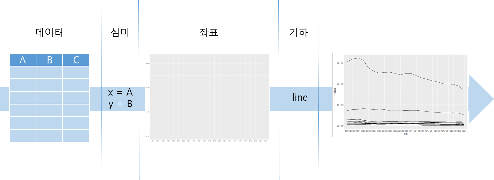
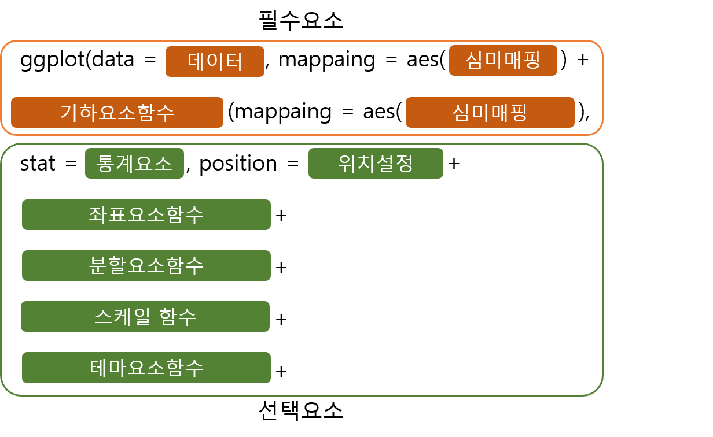
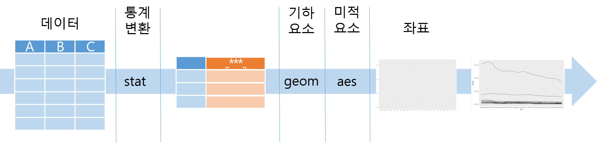
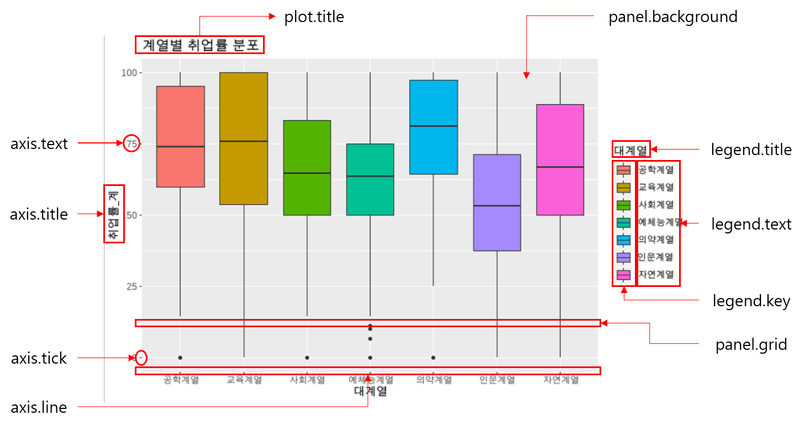
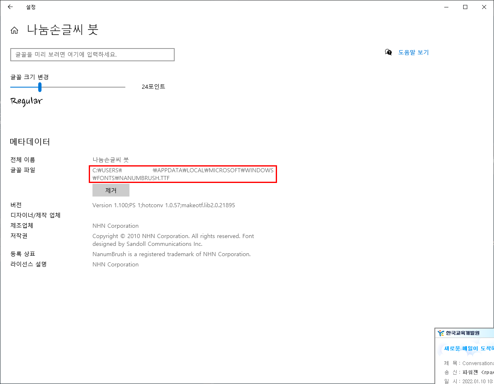
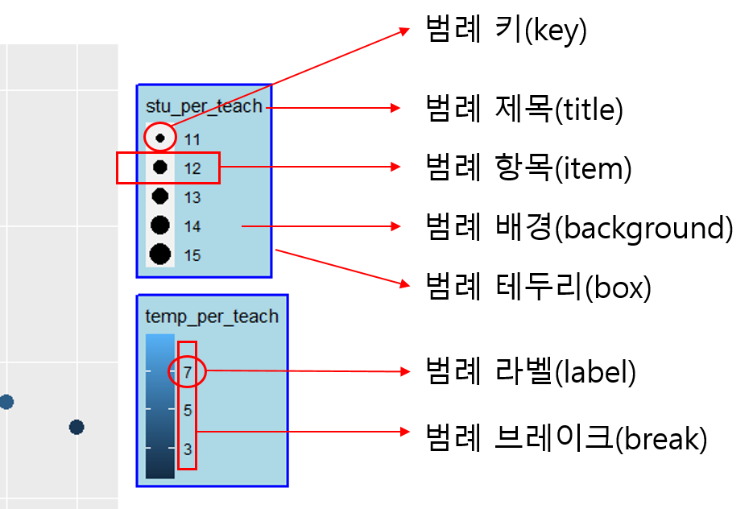
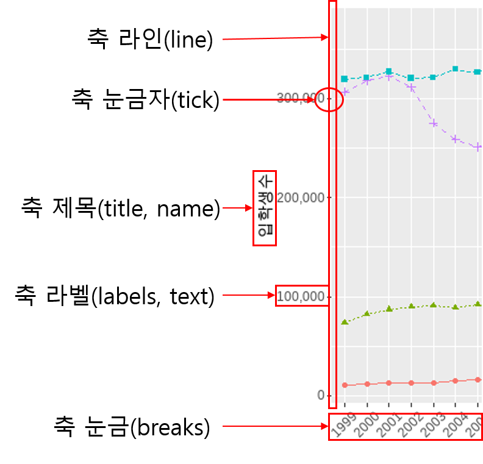

```{r setup, include=FALSE}
knitr::opts_chunk$set(echo = TRUE, message = FALSE, warning = FALSE, out.width = '100%', dpi = 120)
library(showtext)
showtext_auto()
library(tidyverse)
library(readxl)
df_입학자 <- read_excel('2021_연도별 입학자수.xlsx', 
                 ## 'data' 시트의 데이터를 불러오는데,
                 sheet = 'Sheet0',
                 ## 앞의 10행을 제외하고
                 skip = 3, 
                 ## 첫번째 행은 열 이름을 설정
                 col_names = FALSE, 
                 ## 열의 타입을 설정, 처음 8개는 문자형으로 다음 56개는 수치형으로 설정
                 col_types = c(rep('text', 2), rep('numeric', 30)))
df_입학자 <- df_입학자 |> select(1, 2, 5, 7, 9, 11, 13, 19, 29, 31)

## df_입학자의 열이름을 적절한 이름으로 설정
colnames(df_입학자) <- c('연도', '지역', '전문대학', '교육대학', '일반대학', '방송통신대학', '산업대학', '원격및사이버대학', '석사', '박사')

df_입학자 <- df_입학자 |> filter(!is.na(지역))

df_입학자_long <- df_입학자 |> pivot_longer(3:10, names_to = '학교종류', values_to = '입학생수')


```

지금까지 데이터 시각화를 위한 R의 기초 사용법에 대해 알아보았다. 이제 본격적으로 `ggplot2` 패키지를 위주로 데이터 시각화 방법을 알아보도록 하자.

먼저 데이터 시각화를 실습하기 위한 데이터를 설정하도록 하겠다. 세 개의 데이터를 사용할 것인데 하나는 2장에서 사용했던 df_입학자 데이터와 df_입학자를 긴 형태로 만든 df_입학자_long[^1]이고 나머지 하나는 교육통계 서비스 홈페이지에서 제공하는 학교/학과별 데이터셋의 2020년 취업통계 학과별 데이터 셋[^2] 을 사용하겠다. 취업통계 데이터 셋을 불러 들이는 코드는 다음과 같다.[^3]

[^1]: 넓은 형태의 데이터와 긴 형태의 데이터를 모두 사용하는 예를 보이기 위해 유사한 데이터이지만 두 개를 사용함. 혼동되지 않게 주의 바람.

[^2]: <https://kess.kedi.re.kr/contents/dataset?itemCode=04&menuId=m_02_04_03_02&tabId=m3>

[^3]: 해당 데이터는 필자의 블로그(2stndard.tistory.com)에서 다운로드 받을 수 있다.

```{r}
df_취업통계 <- read_excel('2020년 학과별 고등교육기관 취업통계.xlsx', 
                     ## '학과별' 시트의 데이터를 불러오는데,
                     sheet = '학과별',
                     ## 앞의 13행을 제외하고
                     skip = 13, 
                     ## 첫번째 행은 열 이름으로 설정
                     col_names = TRUE, 
                     ## 열의 타입을 설정, 처음 9개는 문자형으로 다음 79개는 수치형으로 설정
                     col_types = c(rep('text', 9), rep('numeric', 79)))

## df_취업통계에서 첫번째부터 9번째까지의 열과 '계'로 끝나는 열을 선택하여 다시 df_취업통계에 저장
df_취업통계 <- df_취업통계 |> select(1:9, ends_with('계'))

## df_취업통계 정보 확인
str(df_취업통계)
```

# ggplot2 란

`ggplot2` 패키지는 R에서 데이터 시각화를 위해 가장 널리 사용되는 패키지이다. 이 패키지는 R-Studio의 수석 데이터 사이언티스트인 Hadley Wickham이 주도적으로 개발한 패키지로 2005년 발간된 Leland Wilkinson의 The Grammar of Graphics을 기본으로 작성되었다.

The Grammar of Graphics는 데이터를 효과적으로 요소를 다음의 7가지로 구분하였다. `ggplot2`에서는 이 7가지 요소를 사용하여 데이터를 시각화하도록 각종 함수들을 제공하고 있다.

-   data(데이터)

    시각화에서 표현해야할 데이터를 지정한다. 하나의 `ggplot2` 시각화에는 하나 이상의 데이터를 사용할 수 있는데 최소 하나 이상의 데이터가 필수적으로 포함되어야 한다. `ggplot2`에서 지원하는 데이터 타입은 데이터프레임이나 `tibble`이다. 내부적으로 데이터프레임은 `tibble`로 변환되어 사용된다.

-   Aesthetics(미적요소)

    Aesthetics는 데이터 시각와에서 시각적 속성과 해당 시각적 속성을 연결시키는 매핑 정보를 표현한다. Aesthetics로 매핑될 수 있는 시각적 속성은 X, Y축, 색깔, 크기 등이다.

-   Geometries(기하요소)

    Geometries는 데이터 시각화에서 실질적으로 데이터를 표현하는데 사용되는 기하학적 도형을 말한다. 기하학적 도형은 점, 선, 막대 등이 있는데 각각의 기하 요소는 각각의 레이어로 시각화되고 이 기하 요소의 레이어를 여러개 사용하여 동시에 여러개의 기하요소를 사용할 수 있다.

-   Statistics(통계요소)

    데이터 시각화에 표현될 데이터가 원데이터가 아닌 mean, median 등 통계처리되어 표현할 경우 사용되는 요소이다.

-   Facet(분할요소)

    데이터 시각화에 표현되는 데이터가 일변량(univariate)이 아닌 다변량(multivariate)인 경우 하나의 시각화에 각 변량의 기하요소를 여러개 표현하면 여러 기하요소가 혼재되어 데이터 시각화를 통한 분석이 어렵게 된다. 이런 경우 다변량 기하 요소를 일변량화하여 일변량 시각화로 분할하여 표현할 수 있다.

-   Coordinates(좌표요소)

    데이터 시각화에 사용되는 좌표계를 설정한다. 사용되는 좌표계는 우리가 흔히 X, Y 축의 2차원 좌표계인 데카르트 좌표계(Cartesian Coordinates)나 극좌표계(Polar Coordinates) 등이 제공된다.

-   Theme(테마요소)

    시각화 제목, 축 제목, 축 단위, 범례 등 데이터 시각화의 전반적인 디자인을 꾸며주는 각종 요소를 말한다. 자신만의 Theme을 만들거나 미리 정의된 Theme을 적용하여 사용할 수 있다.

`ggplot2` 는 일정하고 반복적인 코드를 사용하여 일관된 문법을 제공한다는 점이 가장 큰 장점이다. 함수의 사용법이 일관적이어서 편리하고 읽기가 쉽다는 점과 그래픽의 완성도가 또한 큰 장점이기 때문에 R 사용자들이 가장 애용하는 데이터 시각화 패키지이다.

`ggplot2` 는 레이어를 추가하는 방식으로 여러 타입의 데이터 시각화 요소들을 동시에 표현할 수 있다. 위에서 설명한 7가지 레이어를 적절히 겹쳐서 시각화를 표현한다.

# ggplot2 그리기

`ggplot2` 에서 사용하는 7가지 요소중에 필수적으로 필요한 요소는 데이터, 좌표요소, 기하요소의 세가지이다. 하지만 데이터와 좌표 요소를 미적요소를 통해 연결하게 되기 때문에 결국 데이터, 좌표요소, 기하요소와 미적요소가 가장 기본적인 `ggplot2` 의 요소라고 할 수 있겠다. 이 중 좌표 요소는 별다른 함수를 사용하지 않아도 기본적으로 설정되고 나머지 데이터, 기하요소, 미적요소는 `ggplot2` 에서 제공하는 각종 함수를 사용하여 지정해야 한다.



`ggplot2` 의 문법은 아래의 그림과 같다. 시작은 반드시 `ggplot()` 함수부터이다. 이후는 순서에 큰 영향은 없으나 일반적으로 `geom_` 으로 시작하는 기하요소 함수를 사용하며 이 기하요소 함수 안에서 `aes()` 함수를 사용하여 미적 요소를 매핑한다. 각각의 기하요소에 공통적으로 적용될 미적요소의 매핑은 `ggplot()` 에 넣어 준다. `ggplot()` 를 사용하여 여러개의 레이어를 중첩하여 사용하기 위해서는 문법에서 제공하는 각각의 함수를 파이프가 아닌 `+` 기호 연결하여 사용한다.



## ggplot()

`ggplot()` 는 `ggplot()` 객체를 만들기 위해 초기화하는 함수이다. `ggplot()` 은 시각화를 위한 대상 데이터를 선언하고 전체 레이어에서 공통적으로 사용될 미적 요소들을 지정하는데 사용된다. `ggplot()` 의 사용법과 주요 매개변수는 다음과 같다.

```{r eval=FALSE}
ggplot(data = NULL, mapping = aes(), ...)
  - data : ggplot 객체를 위해 사용할 전체 레이어에 공통으로 사용될 기본 데이터프레임을 선언
`- mapping : aes()를 사용하여 전체 레이어에 공통으로 사용될 미적 요소 선언
```

`ggplot()` 에는 데이터에 연결된 기하요소가 선언되지 않기 때문에 데이터 시각화가 완전히 완성되지는 않는다. 하지만 데이터 미적요소의 매핑 결과는 볼 수 있다. 아래의 코드를 실행하면 앞 장에서 읽어들인 입학자 데이터를 X축과 Y축에 매핑한 결과를 볼 수 있다.

```{r}
## df_입학자 데이터를 사용하여 x축은 연도열, y축은 전문대학열을 매핑하는 ggplot 객체 생성
ggplot(df_입학자, aes(x = 연도, y = 전문대학))
```

위의 코드에서 사용된 `aes()` 는 미적요소을 매핑을 생성하는데 사용되는 함수이다. 미적요소 매핑은 어떤 데이터의 열(변수)가 어떤 시각화 요소들로 연결되는지를 선언하는 방법을 말한다. 위의 코드에서 `aes()` 에 `x` 시각화 요소중에 X축을 나타내는 매개변수인데 이 `x` 가 df_입학자 데이터프레임의 연도열과 연결되었다. 또 `y` 는 시각화 요소 중 Y축을 나타내는 매개변수로 이 `y` 가 df_입학자의 전문대학열과 연결되었다. 이 함수는 `ggplot()` 뿐아니라 기하요소를 정의하는 `geom_*` 함수에서도 공통적으로 사용된다. `aes()` 의 사용법과 주요 매개변수는 다음과 같다.

```{r eval=FALSE}
aes(x, y, ...)
  - x : X축에 매핑될 데이터 열
  - y : y축에 매핑될 데이터 열
```

앞서 설명한 바와 같이 `ggplot()` 에 선언되는 데이터와 미적 요소은 전체 `ggplot` 객체의 레이어에 공통으로 적용되는 데이터와 미적요소이다. `ggplot()` 에 선언되는 미적요소은 X축과 Y축의 매핑만 하는 것이 일반적이다. 모든 레이어에 공통적으로 적용되는 미적요소이 많지 않기 때문에 미리 정의해봐야 일부 레이어에서만 사용되기 떄문이다. 물론 `ggplot()` 에서 선언된 미적요소들이 각각의 레이어에서 다시 선언되는 경우에는 `ggplot()` 에서 선언된 데이터와 미적 요소보다 각각의 레이어에서 선언되는 데이터와 미적 요소이 해당 레이어에서 우선된다.

만약 모든 레이어에 공통적으로 적용되는 데이터나 미적 요소들이 없다면 매개변수 없이도 사용될 수 있고 데이터만 선언될 수도 있다. 하지만 데이터 선언없이 미적요소의 선언은 불가하다. 데이터가 없거나 미적요소이 없다면 아래와 같이 빈 `ggplot` 객체가 생성된다.

```{r}
## 기초 데이터를 df_입학자로 설정된 ggplot객체
ggplot(df_입학자)
```

## 미적요소

미적요소는 데이터를 표현하는데 사용되는 필요한 요소들을 통칭한다. 즉 미적요소로 지정할 수 있는 모든 요소은 `ggplot` 객체의 X, Y 좌표내에 표현되는 기하요소의 표현을 위한 요소들로 시각적 요소와 데이터 변수간의 매핑을 통해서 구현된다.

미적요소는 `aes()` 를 사용하여 매핑할 수 있고 고정값을 설정할 수 있다. 이 부분은 미적요소의 사용에 가장 혼동을 유발하는 부분이다. 미적요소를 매핑한다는 것은 미적요소가 데이터 변수에 의해 변경되어야 하는 경우 사용한다. 즉 미적요소가 변수에 대응됨으로써 변수의 변량에 따라 해당 미적요소들이 바뀌어서 표현된다. 그러나 고정값을 설정한다는 것은 변수에 대응되는 것이 아닌 특정값에 고정되도록 설정하기 때문에 고정값으로 설정된 기하요소들은 변수의 변량이 변경되어도 같은 미적요소로 표현된다. 미적요소는 사용하고자 하는 기하요소 함수(`geom_*()`) 내에서 사용되지만 매핑할때는 반드시 `aes()` 함수를 사용하여 데이터 열이나 매핑 변수를 설정하여야 하고 고정값을 설정할 때는 반드시 `aes()` 함수 바깥에서 선언되어야 한다. 다음의 예를 살펴보자.

```{r}
df_입학자 |> ggplot(aes(x = 연도, y = 전문대학)) +
  geom_point(aes(color = 지역))

df_입학자 |> ggplot(aes(x = 연도, y = 전문대학)) +
  geom_point(color = 'red')

```

위의 코드에서 차이는 `color` 미적요소이 `aes()` 내에 df_입학자의 열이 매핑된 것과 `aes()` 밖에서 고정값(red)로 설정된 것이다. 결과에서 보이듯이 매핑된 `color` 는 지역 변수의 변량에 따라 `color` 가 자동적으로 바뀌어 데이터의 구분이 확연히 보인다. 반면 `aes()` 밖에서 고정값인 red값으로 설정된 코드는 전체 값들이 모두 red 값으로 표현되어 지역적으로 구분되지 않는다.

설정이 가능한 미적요소들은 다음과 같다.

### 위치(x , y, xend, yend)

x와 y는 기하요소가 표시될 X축의 위치와 Y축의 위치 설정에 필요한 데이터 열의 매핑을 설정한다. 일부 선을 그리거나 사각형을 그리는 `geom_segment()` 나 `geom_rect()` 와 같은 기하요소 함수에서는 x, y 부터 시작하여 xend, yend까지 기하요소를 그린다. 다른 미적요소와는 달리 x, y, xend, yend는 매핑과 고정값 설정시 모두 반드시 `aes()` 함수안에서 사용되야 한다.

### color, colour

기하요소의 외곽선 색상을 설정한다. R에서 사용되는 색상은 색상 이름으로 설정하거나 RGB코드값으로 설정할 수 있다.

R에서 미리 정의된 색상 이름은 총 657개로 `colors()` 를 사용하면 확인이 가능하다.

```{r}
## R에서 미리 정의된 색상 이름 출력, 지면 관계상 10개만 출력
colors() |> head(10)
```

RGB 색상 코드는 HTML/CSS에서와 같이 RGB 코드를 16진수 값(00에서 FF)을 사용하여 2자리씩 정의하는데 "#" 접두사로 붙은 문자열로 설정한다. 예를 들어 red는은 "#FF0000"으로 표현된다.

```{r}
## df_입학자의 지역이 '전체'인 데이터를 시각화하는데 막대의 외곽선 색상을 빨강으로 설정
df_입학자 |> filter(지역 == '전체') |>
  ggplot(aes(x = 연도, y = 전문대학)) +
  geom_col(color = '#ff0000')

```

### fill

기하요소의 내부 색상의 설정을 설정한다. 색상의 설정은 `color` 설정과 동일하다.

```{r}
## df_입학자의 지역이 '전체'인 데이터를 시각화하는데 막대의 내부 색상을 빨강으로 설정
df_입학자 |> filter(지역 == '전체') |>
  ggplot(aes(x = 연도, y = 전문대학)) +
  geom_col(fill = '#ff0000')

```

### alpha

기하요소의 투명도를 설정한다. `alpha` 는 정수형 수치로 설정하는데 0부터 1사이의 값을 가진다. 0에 가까울수록 투명해지고 1에 가까울 수록 불투명해진다.

```{r}
## df_입학자의 지역이 '전체'인 데이터를 시각화하는데 막대의 투명도를 0.3으로 설정
df_입학자 |> filter(지역 == '전체') |>
  ggplot(aes(x = 연도, y = 전문대학)) +
  geom_col(alpha = 0.3)

## df_입학자의 지역이 '전체'인 데이터를 시각화하는데 막대의 투명도를 0.7로 설정
df_입학자 |> filter(지역 == '전체') |>
  ggplot(aes(x = 연도, y = 전문대학)) +
  geom_col(alpha = 0.7)

```

### linetype

기하요소 중 선으로 그려지는 기하 요소의 선 타입을 결정한다. R에서는 총 7가지의 선 타입을 제공하는데 0부터 6까지의 숫자나 선 타입의 이름을 사용하여 설정할 수 있다.

```{r echo=FALSE}
ggplot() +
  geom_segment(aes(x = 10, xend = 100, y = 1, yend = 1), linetype = 0) +
  geom_segment(aes(x = 10, xend = 100, y = 2, yend = 2), linetype = 1) +
  geom_segment(aes(x = 10, xend = 100, y = 3, yend = 3), linetype = 2) +
  geom_segment(aes(x = 10, xend = 100, y = 4, yend = 4), linetype = 3) +
  geom_segment(aes(x = 10, xend = 100, y = 5, yend = 5), linetype = 4) +
  geom_segment(aes(x = 10, xend = 100, y = 6, yend = 6), linetype = 5) +
  geom_segment(aes(x = 10, xend = 100, y = 7, yend = 7), linetype = 6) +
  geom_text(aes(x = 0, y = 1), label = 'blank, 0') +
  geom_text(aes(x = 0, y = 2), label = 'solid, 1') +
  geom_text(aes(x = 0, y = 3), label = 'dashed, 2') +
  geom_text(aes(x = 0, y = 4), label = 'dotted, 3') +
  geom_text(aes(x = 0, y = 5), label = 'dotdash, 4') +
  geom_text(aes(x = 0, y = 6), label = 'longdash, 5') +
  geom_text(aes(x = 0, y = 7), label = 'twodash, 6') +
  theme_void()

```

```{r}
## df_입학자의 지역이 '전체'인 데이터를 시각화하는데 선의 타입을 'dashed'로 설정
df_입학자 |> filter(지역 == '전체') |>
  ggplot(aes(x = 연도, y = 전문대학)) +
  geom_line(aes(group = 1), linetype = 'dotted')

```

### size

`size` 는 기하요소의 크기를 설정한다. 기하요소가 점이면 점의 크기, 선이면 선의 굵기를 설정한다. 점의 크기를 결정할 때는 반지름의 길이를 밀리미터 단위로 지정한다. 또 선의 굵기도 밀리미터 단위로 지정할 수 있다.

```{r}
## df_입학자의 지역이 '전체'인 데이터를 시각화하는데 선의 크기를 3으로 설정
df_입학자 |> filter(지역 == '전체') |>
  ggplot(aes(x = 연도, y = 전문대학)) +
  geom_line(aes(group = 1), size = 3)

## df_입학자의 지역이 '전체'인 데이터를 시각화하는데 점의 크기를 3으로 설정
df_입학자 |> filter(지역 == '전체') |>
  ggplot(aes(x = 연도, y = 전문대학)) +
  geom_point(size = 3)

```

### shape

`shape` 는 기하요소가 점일때 점의 모양을 표현하는 미적요소이다. R에서는 점을 표현하는 기하요소를 25가지 지원한다. 앞선 라인타입과 유사하게 번호로 표현할 수도 있고 사전에 정의된 `shape` 이름을 사용할 수도 있다. 다음은 R에서 제공하는 `shape`이다.

```{r echo=FALSE}
shapes <- data.frame(
  shape_name = c('square open, 0', 
            'circle open, 1', 
            'triangle open, 2', 
            'plus, 3', 
            'cross, 4', 
            'diamond open, 5', 
            'triangle down open, 6', 
            'square cross, 7', 
            'astrisk, 8', 
            'diamond plus, 9',
            'circle plus, 10', 
            'triangle up and down,11', 
            'square plus, 12', 
            'circle cross, 13', 
            'triangle square, 14', 
            'square, 15', 
            'circle, 16', 
            'triangle, 17', 
            'diamond, 18', 
            'circle small, 19', 
            'bullet, 20', 
            'circle fill, 21', 
            'square fill, 22', 
            'diamond fill, 23', 
            'triangle fill, 24'),
  shape = 0:24, 
  x = 0:24 %/% 5,
  y = -(0:24 %% 5)
)
ggplot(shapes, aes(x, y)) + 
  geom_point(aes(shape = shape), size = 5, fill = "red") +
  geom_text(aes(label = shape_name), hjust = 0.5, vjust = 3) +
  scale_shape_identity() +
  lims(x = c(-0.5, 4.55), y = c(-4.5, 0)) +
  theme_void()
```

위의 `shape`를 실제 사용하는 예제는 다음과 같다.

```{r}
## df_입학자의 지역이 '전체'인 데이터를 시각화하는데 점의 모양을 15로 설정
df_입학자 |> filter(지역 == '전체') |>
  ggplot(aes(x = 연도, y = 전문대학)) +
  geom_point(shape = 15)

## df_입학자의 지역이 '전체'인 데이터를 시각화하는데 점의 모양을 'triangle open'으로 설정
df_입학자 |> filter(지역 == '전체') |>
  ggplot(aes(x = 연도, y = 전문대학)) +
  geom_point(shape = 'triangle open')

```

### label

`label`은 텍스트로 표현되는 기하요소를 말한다. 데이터의 위치에 대한 수치값을 표현한다거나 데이터의 분류에 대한 문자를 표현할 때 사용되는 미적요소이다. `label`은 주로 텍스트에 관련된 기하요소인 `geom_text()`나 `geom_label()`에서 주로 사용된다.

```{r}
## df_입학자의 지역이 '전체'인 데이터를 시각화하는데 라벨을 '전문대학'으로 설정
df_입학자 |> filter(지역 == '전체') |>
  ggplot(aes(x = 연도, y = 전문대학)) +
  geom_text(label = '전문대학')

## df_입학자의 지역이 '전체'인 데이터를 시각화하는데 라벨을 '전문대학'열에 매핑
df_입학자 |> filter(지역 == '전체') |>
  ggplot(aes(x = 연도, y = 전문대학)) +
  geom_text(aes(label = 전문대학))

```

### group

기하요소는 개별(individual) 기하요소와 집합(collective) 기하요소로 구분될 수 있다. 개별 기하요소는 각각의 관측이(행)을 각각의 기하요소로 매핑해서 표현하지만 집합 기하요소는 여러개의 관측치를 하나의 기하요소로 표현한다.[^4] 집합 기하요소는 통계적인 요약이 필요한 Box Plot이나 한번에 여러개의 변량이 연결되어 표현되야하는 도형(polygon), 선, 세그먼트 등에서 연결되는 구분이 설정되어야한다. 이를 표현하기 위해 사용되는 미적요소가 `group`이다. 설명한대로 `group` 은 직접적으로 표현되는 미적요소는 아니지만 미적요소가 적용되는 범위를 설정하기 위해 사용되는 미적요소이다.

[^4]: Hadley Wickham, ggplot2:Elegant Graphics for Data Analysis 2nd edition, P 46, Springer, 2016.

아래의 코드를 살펴보자.

```{r}
## df_입학자_long 중 학교종류 별로 입학생을 선 그래프로 시각화하는데 정상적이지 않음
df_입학자_long |> filter(지역 == '전체') |>
  ggplot(aes(x = 연도, y = 입학생수)) +
  geom_line(aes(color = 학교종류))
```

위의 코드에서는 `group` 을 지정하지 않고 `color` 만 df_입학자_long 데이터의 학교종류 열에 매핑하였다. 하지만 선으로 표현될 미적요소는 학교종류별로 그루핑되어야 정상적으로 표현되는데 단지 `color` 만의 매핑으로는 정상적으로 표현되지 않는다. 따라서 `geom_line()` 으로 여러개의 선이 표현되는 선 그래프를 표현하기 해서는 반드시 `group` 으로 그루핑되는 열을 지정해야 정상적으로 표현된다.

```{r}
## df_입학자_long를 x축에 연도, y축에 입학생수를 매핑하여 학교종류별 입학생수를 선 그래프로 시각화하는데 group을 학교종류으로 설정함으로써 학교종류별 구분이 가능
df_입학자_long |> filter(지역 == '전체') |>
  ggplot(aes(x = 연도, y = 입학생수)) +
  geom_line(aes(color = 학교종류, group = 학교종류))

```

그렇다면 단 하나의 선만이 있는 선 그래프는 어떻게 될까? 단 하나의 선이기 때문에 `group` 이 필요없을까? 답은 그렇지 않다. 다만 단 하나의 선이 있는 경우에는 `group = 1` 로 선언함으로써 열을 매핑하지 않고 사용할 수도 있다.

```{r}
## df_입학자_long 중 지역이 전체에 해당하는 전문대학 입학생을 선 그래프로 시각화하는데 지역이 하나뿐이므로 group을 1로 설정함으로써 선그래프를 그릴 수 있음
df_입학자_long |> filter(지역 == '전체', 학교종류 == '전문대학') |>
  ggplot(aes(x = 연도, y = 입학생수)) +
  geom_line(aes(group = 1))

```

## 기하요소

기하요소는 `ggplot()` 로 생성된 초기화 `ggplot` 객체에 데이터를 표현하는 방법을 지정하는 요소이다. 2.기하요소에는 여러가지가 있지만 우리가 흔히 생각하는 것은 점(Point), 선(Line), 막대(Bar, Col) 등이 대표적이다.

기하요소를 생성하기 위해서는 `geom_*()` 함수를 사용하고 각각의 `geom_*()` 함수를 호출할 때마다 각각의 기하요소 레이어가 생성되고 이 레이어들이 계속 겹쳐서 그려짐으로써 데이터 시각화가 진행된다. 기하요소를 위한 `geom_*()` 의 주요 함수는 각각의 함수에 따라 선언되는 시각화 요소들이 다르지만 데이터, 미적요소 매핑, 기하요소 지정, 통계 변환, 위치 조정 등이 선언된다.

기하요소를 선택할 때는 각각의 기하요소에 따라 표현되는 값의 제한이 있다. 예를 들어 막대 그래프의 경우 Y축은 연속된 정수값이 표현되는 것이 가능하지만 X축에는 연속된 정수값이 아닌 값의 구별이 가능한 이산 값(discrete value)가 와야한다. 그래야 분리된 하나의 이산값에 하나의 막대가 표현될 수 있다. 이렇게 표현하고자 하는 값의 종류에 따라 적합한 기하요소를 선택하여야 한다. 값의 종류는 연속된 값(continuous value), 분리된 이산값(discrete value) 나 팩터(factor)의 여부, 일변량, 다변량의 여부 등으로 나눌 수 있다.

### 일변수(One Variable) 데이터 시각화

일변수 데이터는 수치형 데이터 열 하나를 의미한다. `ggplot()` 는 보통 X축과 Y축의 2차원 표현이 기본이기 때문에 하나의 데이터 열만이 정의되면 나머지 하나의 데이터는 자동적으로 결정되어야 한다. 이렇게 자동적으로 결정되는 데이터는 보통 면적(Area), 밀도 분포(Density), 도수 분포(Histogram) 등이다. 일변수 데이터 시각화는 일변수로 설정되는 데이터가 연속성 수치 데이터인지 이산성 데이터인지에 따라 구분하여 기하요소 함수를 사용할 수 있다.

#### 연속형 수치 데이터

##### geom_histogram()

`geom_histogram` 은 도수분포표를 그리는 기하요소 함수이다. 도수분포는 초등학교때 배우는 가장 기본적인 막대그래프로 각각의 변수 변량에 따른 데이터의 개수를 표현하는 시각화 방법이다. 변수 변량에 따른 데이터의 개수를 표현하기 때문에 X축 데이터만 설정하면 데이터를 자동적으로 분석하여 X축에 매핑된 변수의 변량별로 데이터 개수를 산출하게 되고 이 개수를 막대 그래프로 표현하게 된다. 따라서 도수분포는 막대그래프에 속하는 종류 중 하나일 뿐이다.

앞에서 막대그래프는 연속된 수치값이 아닌 분리된 이산값이 X축에 매핑되어야 한다고 설명는데 연속된 일변량 기하요소에 `geom_histogram()` 이 속하는 것은 왜일까? `geom_histogram()` 은 연속된 수치값을 X축에 매핑한다. 하지만 내부적으로 적절한 단위로 전체 X값을 분리하여 이산값으로 만들어 준 후에 막대그래프를 생성해 준다. 이 과정이 통계요소이고 `geom_histogram()` 에서 사용되는 유일한 통계요소은 연속된 값을 층화하여 구간하는 방법인 binning이다. 이처럼 자동적으로 계산되는 binning 떄문에 연속된 일변량 기하요소에 속하고 이를 위해 통계요소를 'bin'으로 사용한다.

`geom_histogram` 의 사용법과 주요 매개변수는 다음과 같다.

```{r eval=FALSE}
geom_histogram(mapping = NULL, data = NULL, stat = "bin", position = "stack", bins, binwidth, ...)
  - mapping : aes()를 사용하여 매핑할 미적요소, 생략되면 ggplot()에 정의된 미적매핑 사용
  - data : 시각화를 위해 사용될 데이터, 생략되면 ggplot()에 정의된 데이터 사용
  - stat : 시각화에 적용될 통계요소, 기본값은 'bin'
  - position : 시각화에 적용될 위치요소, 기본값은 'stack'
  - bins : X축을 나누는 bin의 개수 설정
  - binwidth : X축을 나누는 bin의 너비 설정, 숫자벡터를 사용할 수 있다. (bin과 binwidth는 동시에 사용될 수 없다)
```

`geom_histogram()` 에 매핑될 수 있는 미적요소은 위치(x, y), alpha, color, fill, linetype, size 등이다.

```{r}
##  df_취업통계를 ggplot 객체로 생성하고 p_histogram에 저장
p_histogram <- df_취업통계 |>
  ggplot()

## p_histogram에 x축을 '취업률_계'열로 매핑, binning 옵션을 주지 않았으므로 bins = 30이 기본값으로 설정한 geom_histogram 레이어를 생성 
p_histogram +
  geom_histogram(aes(x = 취업률_계))

## p_histogram에 x축을 '취업률_계'열로 매핑, bins = 90으로 설정한 geom_histogram 레이어를 생성 
p_histogram +
  geom_histogram(aes(x = 취업률_계), bins = 90)

## p_histogram에 x축을 '취업률_계'열로 매핑, binwidth = 10으로 설정한 geom_histogram 레이어를 생성 
p_histogram +
  geom_histogram(aes(x = 취업률_계), binwidth = 10)

## p_histogram에 x축을 '취업률_계'열로 매핑, binwidth = 5으로 설정한 geom_histogram 레이어를 생성 
p_histogram +
  geom_histogram(aes(x = 취업률_계), binwidth = 5)

## p_histogram에 x축을 '취업률_계'열로 매핑, 각각의 미적요인을 설정한  geom_histogram 레이어를 생성 
p_histogram + 
  geom_histogram(aes(x = 취업률_계), color = 'red', fill = 'red', alpha = 0.2, linetype = 2)

```

##### geom_freqpoly()

`geom_freqpoly()` 는 하나의 데이터 열에 기록된 연속형 수치 데이터를 표현하는데 사용되는 기하요소 함수이다. 앞선 `geom_histogram()` 은 막대를 사용하여 데이터의 수치를 표현해지만 `geom_freqpoly()` 는 데이터 값들을 연결한 다각형을 사용하여 데이터의 수치를 표현한다.`geom_freqpoly()`도 `geom_histogram()`과 같이 binning을 기본적으로 사용하기 때문에 통계요소를 'bin'이 기본적으로 적용된다. 만약 다각형을 조금 부드럽게(smoothing) 하려면 통계요소를 'density'로 설정하는데 이 경우는 `geom_density()`와 동일한 결과가 나온다.

```{r eval=FALSE}
geom_freqpoly(mapping = NULL, data = NULL,  stat = "bin",  position = "identity", na.rm = FALSE, show.legend = NA, ...)
  - mapping : aes()를 사용하여 매핑할 미적요소, 생략되면 ggplot()에 정의된 미적매핑 사용
  - data : 시각화를 위해 사용될 데이터, 생략되면 ggplot()에 정의된 데이터 사용
  - stat : 시각화에 적용될 통계요소, 기본값은 'bin'
  - position : 시각화에 적용될 위치요소, 기본값은 'identity'
  - na.rm : NA 값을 생략할 것인지를 설정하는 논리값(TRUE/FALSE)
  - show.legend : 범례를 사용할 것인지를 설정하는 논리값(TRUE/FALSE)
```

`geom_freqpoly()` 에서 사용이 가능한 미적요소는 위치(x, y), alpha, color, linetype, size, group이다.

`geom_freqpoly()` 를 사용한 데이터 시각화는 다음과 같다.

```{r}
##  df_취업통계를 ggplot 객체로 생성하고 p_freqpoly에 저장
p_freqpoly <- df_취업통계 |>
  ggplot()

## p_freqpoly에 x축을 '취업률_계'열로 매핑, bins = 30으로 설정한 geom_freqpoly 레이어를 생성 
p_freqpoly +
  geom_freqpoly(aes(x = 취업률_계), bins = 30)

## p_freqpoly에 x축을 '취업률_계'열로 매핑, bins = 30으로 설정하는데 통계요소를 'density'로 설정한 geom_freqpoly 레이어를 생성
p_freqpoly +
  geom_freqpoly(aes(x = 취업률_계), stat = 'density', bins = 30)

## p_freqpoly에 x축을 '취업률_계'열로 매핑, binwidth = 10으로 설정한 geom_freqpoly 레이어를 생성 
p_freqpoly +
  geom_freqpoly(aes(x = 취업률_계), binwidth = 10, rm.na = TRUE)

## p_freqpoly에 x축을 '취업률_계'열로 매핑, binwidth = 10으로 설정하고 미적요소를 설정한 geom_freqpoly 레이어를 생성
p_freqpoly +
  geom_freqpoly(aes(x = 취업률_계), binwidth = 10, color = 'red', linetype = 2)

## p_freqpoly에 x축을 '취업률_계'열로 매핑, group과 color를 과정구분으로 매핑, binwidth = 10으로 설정한 geom_freqpoly 레이어를 생성 
p_freqpoly +
  geom_freqpoly(aes(x = 취업률_계, group = 과정구분, color = 과정구분), binwidth = 10, linetype = 2)

```

##### geom_density()

`geom_density()` 도 하나의 데이터 열에 기록된 연속형 수치 데이터를 표현하는데 사용되는 기하요소 함수인데 데이터의 분포에 따른 확률분포함수를 표현하는 함수이다. 데이터 값으로 주어진 연속된 수치 데이터를 확률밀도함수에 대입하여 계산된 연속확률분포를 시각화한다. 따라서 X값에 따라 계산된 연속확률분포값은 확률값이기 때문에 1보다 작은 값들이고 이 값들이 연결되어 표현된다. `geom_density()` 를 사용하여 연속확률분포를 시각화할 수 있다. 따라서 통계요소가 앞선 두 함수와는 달리 'density'가 기본값으로 설정된다.

```{r eval=FALSE}
geom_density(mapping = NULL, data = NULL, stat = "density",  position = "identity", na.rm = FALSE, show.legend = NA, ...)
  - mapping : aes()를 사용하여 매핑할 미적요소, 생략되면 ggplot()에 정의된 미적매핑 사용
  - data : 시각화를 위해 사용될 데이터, 생략되면 ggplot()에 정의된 데이터 사용
  - stat : 시각화에 적용될 통계요소, 기본값은 'density'
  - position : 시각화에 적용될 위치요소, 기본값은 'identity'
  - na.rm : NA 값을 생략할 것인지를 설정하는 논리값(TRUE/FALSE)
  - show.legend : 범례를 사용할 것인지를 설정하는 논리값(TRUE/FALSE)
```

`geom_density()` 에서 사용할 수 있는 미적요소는 위치(x, y), alpha, color, fill, linetype, size 등이다.

```{r}
##  df_취업통계를 ggplot 객체로 생성하고 p_density에 저장
p_density <- df_취업통계 |>
  ggplot()

## p_density객체에 x축을 '취업률_계'열로 매핑한 geom_density 레이어를 생성
p_density + 
  geom_density(aes(x = 취업률_계))

## p_density객체에 x축을 '취업률_계'열로 매핑, 미적요소 설정한 geom_density 레이어를 생성
p_density + 
  geom_density(aes(x = 취업률_계), color = 'blue', fill = 'skyblue', linetype = 2, size = 1, alpha = 0.5)

```

#### 이산(Discrete) 데이터 : `geom_bar()`

앞 절에서 설명한 `geom_histogram()`, `geom_freqpoly()`, `geom_density()` 는 연속된 수치값에 대한 일변량 시각화 기하요소함수였다. 그렇다면 팩터와 같은 구분되고 분리되는 이산된 일변량 시각화는 어떻게 시각화되는가? 이산된 일변량 데이터를 위한 기하요소 함수는 `geom_bar()` 가 유일하다. 사실 `geom_bar()` 는 뒤에서 설명될 `geom_col()` 과 거의 유사한 결과를 내는 막대 그래프 시각화이다. 다만 `geom_bar()` 는 앞선 연속된 일변량 데이터 시각화와 같이 하나의 데이터만 제공되면 해당 데이터의 빈도를 자동적으로 계산하여 변수의 변량에 따른 데이터의 빈도를 막대 그래프 형태로 시각화한다. 이는 또 `geom_histogram()` 과 유사하게 나타나지만 X축으로 제공되는 데이터가 연속형 수치 데이터인가 이산형 데이터인가에 따라 차이가 있다. 또 X 축에 매핑되는 데이터가 이산형 데이터이기 때문에 꼭 수치 데이터가 아닐 수 있다.

```{r eval=FALSE}
geom_bar(mapping = NULL, data = NULL, stat = "count", position = "stack", width = NULL, na.rm = FALSE, show.legend = NA, ...)
  - mapping : aes()를 사용하여 매핑할 미적요소, 생략되면 ggplot()에 정의된 미적매핑 사용
  - data : 시각화를 위해 사용될 데이터, 생략되면 ggplot()에 정의된 데이터 사용
  - stat : 시각화에 적용될 통계요소, 기본값은 'count'
  - position : 시각화에 적용될 위치요소, 기본값은 'stack'
  - na.rm : NA 값을 생략할 것인지를 설정하는 논리값(TRUE/FALSE)
  - show.legend : 범례를 사용할 것인지를 설정하는 논리값(TRUE/FALSE) 
```

`geom_bar()` 에서 사용이 가능한 미적요소는 x, alpha, color, fill, linetype, size, weight가 있다.

```{r}
##  df_취업통계를 ggplot 객체로 생성하고 p_bar에 저장
p_bar <- df_취업통계 |>
  ggplot()

## p_bar 객체에 x축을 대계열로 매핑한 geom_bar 레이어 생성 
p_bar +
  geom_bar(aes(x = 대계열))

## p_bar 객체에 x축을 대계열로 매핑하고 미적요소를 설정한 geom_bar 레이어 생성
p_bar +
  geom_bar(aes(x = 대계열), color = 'blue', fill = 'skyblue', linetype = 2, size = 1, alpha = 0.5)
```

### 이변수(Two Variable) 데이터 시각화

앞서 언급한 바와 같이 `ggplot` 객체는 보통 X, Y 두 개의 축으로 표현되는 2차원 시각화를 기본으로 하고 있다. 따라서 변수 두개를 사용한 데이터 시각화가 일반적 형태의 시각화이다. 변수 두개를 사용한 데이터 시각화도 일변수 데이터 시각화와 마찬가지로 시각화해야할 데이터가 연속형 수치 데이터인지 이산형 데이터인지에 따라 사용하는 기하요소의 종류와 함수가 달라진다.

#### 2개의 연속형 수치 변수

X축과 Y축에 매핑되어 시각화해야하는 두개의 변수가 모두 연속형 수치 변수인 경우에는 X축과 Y축의 매핑에 따라 위치를 표시해 주는 시각화가 대부분이다. 보통 데이터의 분포를 확인해야 하는 경우와 데이터에 수치값이나 텍스트를 표현해야 할 때 많이 사용된다.

##### geom_point()

데이터의 전반적 분포를 확인할 때 가장 많이 사용되는 기하요소가 점을 사용한 데이터 시각화이다. 이렇게 X, Y축에 따라 데이터를 점으로 표현한 시각화를 산점도(Scatter Plot)라고 한다. 산점도는 X축과 Y축의 좌표값에 따라 점을 표시함으로서 데이터의 전반적인 분포를 살펴보고 X, Y축의 증감에 따른 데이터의 상관관계를 살펴보는데 효과적인 시각화 방법이다. 따라서 시각화 과정에서 데이터 값을 통계처리하지 않고 사용되기 때문에 통계요소가 'identity'로 설정된다.

```{r eval=FALSE}
geom_point(mapping = NULL, data = NULL,  stat = "identity",  position = "identity", na.rm = FALSE, show.legend = NA,  ...)
  - mapping : aes()를 사용하여 매핑할 미적요소, 생략되면 ggplot()에 정의된 미적매핑 사용
  - data : 시각화를 위해 사용될 데이터, 생략되면 ggplot()에 정의된 데이터 사용
  - stat : 시각화에 적용될 통계요소, 기본값은 'identity'
  - position : 시각화에 적용될 위치요소, 기본값은 'identity'
  - na.rm : NA 값을 생략할 것인지를 설정하는 논리값(TRUE/FALSE)
  - show.legend : 범례를 사용할 것인지를 설정하는 논리값(TRUE/FALSE) 
```

`geom_point()`에서 사용이 가능한 미적요소는 x, y, alpha, colour, fill, group, shape, size, stroke 등이다.

```{r}
##  df_취업통계 데이터 중 졸업자가 500명 이하인 학과를 필터링하여 ggplot 객체로 생성하고 p_point에 저장
p_point <- df_취업통계 |> filter(졸업자_계 < 500) |>
  ggplot()

##  p_point객체에x축은 졸업자_계, y축은 취업자_합계_계로 매핑한  geom_point 레이어를 생성
p_point +
  geom_point(aes(x = 졸업자_계, y = 취업자_합계_계))

##  p_point객체에 x축은 졸업자_계, y축은 취업자_합계_계, color를 대계열로 매핑하고 투명도를 설정한 geom_point 레이어를 생성
p_point +
  geom_point(aes(x = 졸업자_계, y = 취업자_합계_계, color = 대계열), alpha = 0.5)
```

##### geom_text()

`geom_text()`는 `geom_point()`와 데이터 표현방식은 동일하나 표현되는 데이터가 문자열이라는 점에서 차이가 있다. `geom_text()`는 주로 점이나 선, 막대 등으로 표현된 기하요소 레이어에 추가하여 해당 데이터들의 값이나 정보를 표현하기 위한 부가 정보를 제공하는데 활용된다. 그렇기 때문에 기본 기하요소와 겹쳐지 않기 위해 위치 조정을 위한 매개변수가 추가될 수 있다.

```{r eval = FALSE}
geom_text(mapping = NULL, data = NULL, stat = "identity", position = "identity", nudge_x = 0, nudge_y = 0, check_overlap = FALSE, na.rm = FALSE, show.legend = NA, ...)
  - mapping : aes()를 사용하여 매핑할 미적요소, 생략되면 ggplot()에 정의된 미적매핑 사용
  - data : 시각화를 위해 사용될 데이터, 생략되면 ggplot()에 정의된 데이터 사용
  - stat : 시각화에 적용될 통계요소, 기본값은 'identity'
  - position : 시각화에 적용될 위치요소, 기본값은 'identity'
  - nudge_x : X축 방향으로 문자열의 이동
  - nudge_y :  Y축 방향으로 문자열의 이동
  - check_overlap : 텍스트가 겹치는 것을 허용할지에 대한 논리값(TRUE/FALSE)
  - na.rm : NA 값을 생략할 것인지를 설정하는 논리값(TRUE/FALSE)
  - show.legend : 범례를 사용할 것인지를 설정하는 논리값(TRUE/FALSE) 
```

`geom_text()`에서 사용 가능한 미적요소는 x, y, label, alpha, angle, color, family, fontface, group, hjust, lineheight, size, vjust 등이다.

-   angle : 문자열이 표현되는 각도 설정

-   family : 문자열 시각화에 사용될 폰트 설정

-   fontface : 문자열 시각화에 사용될 문자 특성("plain", "bold", "italic", "bold.italic")

-   hjust : 수평 맞춤 설정, 0부터 1사이의 값을 지정

-   vjust : 수직 맞춤 설정, 0부터 1사이의 값을 지정

-   lineheight : 줄간격 설정, 0부터 1사이의 값을 지정

```{r}
##  df_입학자 데이터 중 지역이 전체인 데이터를 필터링하여 ggplot 객체로 생성하고 p_text에 저장
p_text <- df_입학자 |> filter(지역 == '전체') |>
  ggplot()

##  p_text에 x축은 연도, y축은 전문대학을 매핑한 geom_point 레이어와 geom_text레이어를 생성
p_text +
  geom_point(aes(x = 연도, y = 전문대학)) +
  geom_text(aes(x = 연도, y = 전문대학, label = 전문대학))

##  p_text에 x축은 연도, y축은 전문대학을 매핑하고 미적요소를 설정한 geom_point 레이어와 geom_text레이어를 생성
p_text +
  geom_point(aes(x = 연도, y = 전문대학)) +
  geom_text(aes(x = 연도, y = 전문대학, label = 전문대학), nudge_x = 1, fontface = 'bold')

```

##### geom_label()

`geom_label()`은 `geom_text()`와 거의 유사한 시각화를 제공한다. 다만 `geom_text()`는 문자열만을 시각화하지만 `geom_label()`은 박스로 둘러싸여진 문자열을 시각화한다. 따라서 문자열을 둘러싸고 있는 박스에 대한 설정외에는 `geom_text()`의 설정과 동일하다.

```{r eval = FALSE}
geom_label(mapping = NULL, data = NULL, stat = "identity", position = "identity", nudge_x = 0, nudge_y = 0, label.padding = unit(0.25, "lines"), label.r = unit(0.15, "lines"), label.size = 0.25, na.rm = FALSE, show.legend = NA, ...)
  - mapping : aes()를 사용하여 매핑할 미적요소, 생략되면 ggplot()에 정의된 미적매핑 사용
  - data : 시각화를 위해 사용될 데이터, 생략되면 ggplot()에 정의된 데이터 사용
  - stat : 시각화에 적용될 통계요소, 기본값은 'identity'
  - position : 시각화에 적용될 위치요소, 기본값은 'identity'
  - nudge_x : X축 방향으로 문자열의 이동
  - nudge_y :  Y축 방향으로 문자열의 이동
  - label.padding : 박스와 문자열간의 여백 설정
  - label.r = 박스의 귀퉁이를 둥글게 설정할 경우 반지름 설정
  - label.size = 박스 라인의 두께 설정
  - na.rm : NA 값을 생략할 것인지를 설정하는 논리값(TRUE/FALSE)
  - show.legend : 범례를 사용할 것인지를 설정하는 논리값(TRUE/FALSE) 
```

`geom_label()`에서 사용 가능한 미적요소는 x, y, label, alpha, angle, color, family, fontface, group, hjust, lineheight, size, vjust 등이다.

```{r}
##  df_입학자 데이터 중 지역이 전체인 데이터를 필터링하여 ggplot 객체로 생성하고 p_label에 저장
p_label <- df_입학자 |> filter(지역 == '전체') |>
  ggplot()

##  p_label에 x축은 연도, y축은 전문대학을 매핑 geom_point 레이어와 geom_label 레이어를 생성
p_label +
  geom_point(aes(x = 연도, y = 전문대학)) +
  geom_label(aes(x = 연도, y = 전문대학, label = 전문대학))

##  p_label에 x축은 연도, y축은 전문대학을 매핑하고 미적요소를 설정한 geom_point 레이어와 geom_label 레이어를 생성
p_label +
  geom_point(aes(x = 연도, y = 전문대학)) +
  geom_label(aes(x = 연도, y = 전문대학, label = 전문대학), nudge_x = 1, fontface = 'bold')

```

##### geom_smooth()

`geom_smooth()`는 데이터의 전반적인 추세선을 표현하는 기하요소 함수이다. 이 추세선은 데이터의 패턴을 찾기 위해 사용되고 특히 오버플로팅된 데이터에 대한 패턴을 찾아낼때 유용하게 사용된다. `geom_smooth()`에서 추세선을 결정하기 위해 제공하는 통계 방법은 "lm", "glm", "gam", "loess"의 네가지를 제공한다.

```{r eval = FALSE}
geom_smooth(mapping = NULL, data = NULL, stat = "smooth", position = "identity", method = NULL,   formula = NULL, se = TRUE, na.rm = FALSE, orientation = NA, show.legend = NA, ...)
  - mapping : aes()를 사용하여 매핑할 미적요소, 생략되면 ggplot()에 정의된 미적매핑 사용
  - data : 시각화를 위해 사용될 데이터, 생략되면 ggplot()에 정의된 데이터 사용
  - stat : 시각화에 적용될 통계요소, 기본값은 'smooth'
  - position : 시각화에 적용될 위치요소, 기본값은 'identity'
  - method : 추세선을 결정하기 위해 사용하는 통계 방법 설정, "lm", "glm", "gam", "loess" 중 하나임
  - formula :  추세선을 결정하기 위해 사용하는 함수식 설정
  - se : 추세선에 대한 표준오차 설정을 위한 논리값(TRUE/FALSE)
  - na.rm : NA 값을 생략할 것인지를 설정하는 논리값(TRUE/FALSE)
  - show.legend : 범례를 사용할 것인지를 설정하는 논리값(TRUE/FALSE) 
```

`geom_smooth()`에서 사용 가능한 미적요소는 x, y, alpha, color, fill, group, linetype, size, weight, ymax, ymin 등이다.

```{r}
##  df_입학자 데이터 중 지역이 전체인 데이터를 필터링하여 ggplot 객체로 생성하고 p_smooth에 저장
p_smooth <- df_입학자 |> filter(지역 == '전체') |>
  ggplot()

##  p_smooth에 x축은 연도, y축은 전문대학을 매핑, geom_smooth의 추세선 결정 방법은 'loess'로 설정한 geom_line레이어와 geom_smooth레이어를 생성
p_smooth +
  geom_line(aes(x = 연도, y = 전문대학, group = 1)) +
  geom_smooth(aes(x = 연도, y = 전문대학, group = 1), method = 'loess')

##  p_smooth에 x축은 연도, y축은 전문대학을 매핑, geom_smooth의 추세선 결정 방법은 'lm', se는 FALSE로 설정한 geom_line레이어와 geom_smooth레이어를 생성
p_smooth +
  geom_line(aes(x = 연도, y = 전문대학, group = 1)) +
  geom_smooth(aes(x = 연도, y = 전문대학, group = 1), method = 'lm', se = FALSE)

```

#### 연속형 수치 변수와 이산형 변수

반별 성적 평균이라던지 지역별 매출액 평균등을 시각화 할 때같이 연속형 수치변수와 이산형 변수를 사용하여 데이터를 시각화하는 경우가 많이 있다. 사실 시각화의 가장 효과적인 활용 방법이 이 경우일 것이다.

##### geom_col()

`geom_col()`은 막대그래프를 그리기 위해 사용하는 시각화 함수이다. 앞에서 막대그래프는 이미 `geom_histogram()`과 `geom_bar()`가 설명되었다. 그런데 또 `geom_col()`이 제공된다. 막대그래프는 시각화하고자 하는 데이터의 종류에 따라 각각의 특성에 맞는 함수가 제공된다. 하지만 `geom_col()`이 가장 포괄적인 막대그래프 시각화 함수로써 `geom_col()`를 사용하여 `geom_histogram()`과 `geom_bar()`와 동일한 막대그래프를 그릴 수도 있다. 특히 `geom_col()`은 `geom_bar(stat = 'ideneity)`와 동일한 시각화 효과를 낸다.

```{r eval=FALSE}
geom_col(mapping = NULL, data = NULL, position = "stack", width = NULL, na.rm = FALSE, show.legend = NA, ...)
  - mapping : aes()를 사용하여 매핑할 미적요소, 생략되면 ggplot()에 정의된 미적매핑 사용
  - data : 시각화를 위해 사용될 데이터, 생략되면 ggplot()에 정의된 데이터 사용
  - position : 시각화에 적용될 위치요소, 기본값은 'stack'
  - width : 막대의 너비 설정
  - na.rm : NA 값을 생략할 것인지를 설정하는 논리값(TRUE/FALSE)
  - show.legend : 범례를 사용할 것인지를 설정하는 논리값(TRUE/FALSE) 

```

`geom_col()`에서 특별하게 활용되는 매개변수가 `position`이다. 이 `position`를 설정하여 막대그래프의 타입을 달리하여 시각화가 가능하다는 것이다. `position`의 종류는 `stack`, `dodge`, `fill` 의 세가지가 많이 사용된다. `stack`은 막대를 구성하는 그룹을 하나의 막대에 쌓아가면서 표현하고 `dodge`는 막대를 구성하는 그룹에 대한 막대를 각각 구성하여 옆에 붙여준다. `fill`은 전체를 100%로 막대를 구성하고 그 막대를 구성하는 그룹의 구성 비율에 따라 막대를 구분해 준다. `fill`은 전체를 100%로 변환하기 때문에 모든 막대의 길이는 같게 되고 Y축의 레벨이 0부터 1까지로 변경된다.

```{r}
##  df_입학자_long 데이터 중 지역이 전체인 데이터를 필터링하여 ggplot 객체로 생성하고 p_col에 저장
p_col <- df_입학자_long |> filter(지역 == '전체') |>
  ggplot()

##  p_col에 x축은 연도, y축은 입학생수을 매핑한  geom_col레이어를 생성
p_col +
  geom_col(aes(x = 연도, y = 입학생수), position = 'stack')

##  p_col에 x축은 연도, y축은 입학생수, fill을 학교종류로 매핑하고 position을 stack으로 설정한  geom_col레이어를 생성
p_col +
  geom_col(aes(x = 연도, y = 입학생수, fill = 학교종류), position = 'stack')

##  p_col에 x축은 연도, y축은 입학생수, fill을 학교종류로 매핑하고 position을 dodge으로 설정한  geom_col레이어를 생성
p_col +
  geom_col(aes(x = 연도, y = 입학생수, fill = 학교종류), position = 'dodge')

##  p_col에 x축은 연도, y축은 입학생수, fill을 학교종류로 매핑하고 position을 fill으로 설정한  geom_col레이어를 생성
p_col +
  geom_col(aes(x = 연도, y = 입학생수, fill = 학교종류), position = 'fill')

```

`geom_col()`에서 사용 가능한 미적요소는 x, y, alpha, color, fill, group, linetype, size 등이다.

```{r}

##  p_col에 x축은 연도, y축은 일반대학을 매핑하고 stat을 'identity'로 설정한 geom_col레이어를 생성, geom_col과 동일한 결과
p_col +
  geom_bar(aes(x = 연도, y = 입학생수), stat = 'identity')

##  p_col에 x축은 연도, y축은 일반대학으로 매핑하고 미적요소를 설정한 geom_col레이어를 생성
p_col +
  geom_col(aes(x = 연도, y = 입학생수), alpha = 0.5, color = 'red',  linetype = 2)

```

##### geom_boxplot()

박스 플롯은 데이터의 전반적 분포를 살펴볼 수 있는 매우 좋은 시각화 방법이다. 앞서 설명한 산점도는 X, Y축 모두 연속형 수치 변수를 사용하지만 박스 플롯은 이산형 변수로 분류되는 데이터의 전반적 분포를 시각화할 수 있다는 점에서 활용도가 크고 Scatter Plot에서는 표현할 수 없었던 중간값, IQR 범위, 이상치 등의 추가적인 정보를 같이 볼 수 있다는 장점이 있다. R에서 박스 플롯 레이어를 생성하기 위해서는 `geom_boxplot()`을 사용한다.

박스 플롯으로 표현되는 상자의 중심은 중앙값이다. 중앙값은 가로선으로 표현되며 그 주위를 상자가 둘러싸고 있다. 상자의 상단과 하단은 관측값들의 25%\~75%를 나타내고 중간 선은 전체 데이터의 중간값(50%)을 표현한다. 상자의 상단과 하단 범위를 벗어나면 사분위 범위의 1.5배에 해당하는 '수염(whisker)'으로 표현된다. 수염 밖으로 존재하는 값은 점으로 표기하며 일반적으로 이상치로 간주한다. 

```{r eval = FALSE}
geom_boxplot(mapping = NULL, data = NULL, stat = "boxplot", position = "dodge2", outlier.color = NULL, outlier.fill = NULL, outlier.shape = 19, outlier.size = 1.5, outlier.stroke = 0.5, outlier.alpha = NULL, notch = FALSE, notchwidth = 0.5, na.rm = FALSE, show.legend = NA, ...)
  - mapping : aes()를 사용하여 매핑할 미적요소, 생략되면 ggplot()에 정의된 미적매핑 사용
  - data : 시각화를 위해 사용될 데이터, 생략되면 ggplot()에 정의된 데이터 사용
  - stat : 시각화에 적용될 통계요소, 기본값은 'boxplot'
  - position : 시각화에 적용될 위치요소, 기본값은 'dodge2'
  - outlier.colour, outlier.color, outlier.fill, outlier.shape, outlier.size, outlier.stroke, outlier.alpha : 이상치로 표현되는 점의 미적요소 설정
  - notch : 상자의 중간값을 구분하는 귀퉁이를 표현할 지를 설정하기 위한 논리값(TRUE/FALSE)
  - na.rm : NA 값을 생략할 것인지를 설정하는 논리값(TRUE/FALSE)
  - show.legend : 범례를 사용할 것인지를 설정하는 논리값(TRUE/FALSE) 
```

`geom_boxplot()`에서 사용이 가능한 미적요소는 x, y, lower(xlower), upper(xupper), middle(xmiddle), ymin(xmin), ymax(xmax), alpha, colour, fill, group, linetype, shape, size, weight 등이 있다. 이 중 lower(xlower), upper(xupper), middle(xmiddle), ymin(xmin), ymax(xmax)는 박스를 수동으로 설정하기 위해 사용하는 미적요소이다.

```{r}
##  df_취업통계 데이터를 ggplot 객체로 생성하고 p_boxplot에 저장
p_boxplot <- df_취업통계 |>
  ggplot()

## p_boxplot에 x축에 대계열, y축에 취업률_계로 매핑한 geom_boxplot 레이어를 생성
p_boxplot + 
  geom_boxplot(aes(x = 대계열, y = 취업률_계)) 
  
## p_boxplot에 x축에 대계열, y축에 취업률_계, fill을 대계열로 매핑, 미적요소를 설정한 geom_boxplot레이어를 생성
p_boxplot + 
  geom_boxplot(aes(x = 대계열, y = 취업률_계, fill = 대계열), linetype = 2) 

## p_boxplot에 x축에 대계열, y축에 취업률_계, fill을 대계열로 매핑, 미적요소를 설정한 geom_boxplot레이어를 생성
p_boxplot + 
  geom_boxplot(aes(x = 대계열, y = 취업률_계, fill = 대계열), linetype = 2, notch = TRUE, notchwidth = 0.2, outlier.shape = 3) 

```

##### geom_violin()

`geom_violin()`은 박스플롯과 거의 유사한 시각화 방법인데 박스대신 데이터의 분포를 표현하는 바이올린과 유사한 형태의 도형으로 표현하는 시각화 방법이다. 박스 플롯에서는 25%부터 75%까지의 범위를 표현하는데 유용하지만 그 범위내에서 데이터가 어느 구간에 많이 분포되어 있는지는 표현하지 못한다. 이와 같은 단점을 극복하기 위해 `geom_violin()`은 데이터가 많이 분포하는 구간은 좌우를 넓게 표현하고 데이터가 적게 분포하는 구간은 좌우를 좁게 표현해서 데이터의 전체 구간에 데이터의 분포를 시각화할 수 있다.

```{r eval=FALSE}
geom_violin(mapping = NULL, data = NULL, stat = "ydensity", position = "dodge", draw_quantiles = NULL, trim = TRUE, scale = "area", na.rm = FALSE, show.legend = NA, ...)
  - mapping : aes()를 사용하여 매핑할 미적요소, 생략되면 ggplot()에 정의된 미적매핑 사용
  - data : 시각화를 위해 사용될 데이터, 생략되면 ggplot()에 정의된 데이터 사용
  - stat : 시각화에 적용될 통계요소, 기본값은 'ydensity'
  - position : 시각화에 적용될 위치요소, 기본값은 'dodge'
  - draw_quantiles : 박스플롯에서 표현하는 것과 같이 분위라인을 그리는데 사용될 분위 설정
  - trim : 끝부분을 잘라낼지 여부를 결정하는 논리값(TRUE/FALSE)
  - scale : 데이터의 분포를 표현하는 도형의 크기를 표현하는 단위 설정, 'area'는 모든 도형의 크기를 동일하게 설정, 'count'는 데이터 개수에 따라 도형의 크기를 설정, 'width'는 모든 도형의 최대 너비를 동일하게 설정
  - na.rm : NA 값을 생략할 것인지를 설정하는 논리값(TRUE/FALSE)
  - show.legend : 범례를 사용할 것인지를 설정하는 논리값(TRUE/FALSE) 
```

`geom_violin()` 에서 사용할 수 있는 미적요소는 x, y, alpha, color, fill, group, linetype, size, weight 등 이다.

```{r}
##  df_취업통계 데이터를 ggplot 객체로 생성하고 p_violin에 저장
p_violin <- df_취업통계 |>
  ggplot()

## p_violin에 x축에 대계열, y축에 취업률_계로 매핑한 geom_violin레이어를 생성
p_violin + 
  geom_violin(aes(x = 대계열, y = 취업률_계)) 

## p_violin에 x축에 대계열, y축에 취업률_계로 매핑하고 0.25, 0.5, 0.75 위치에 선을 그림고 양쪽 끝을 자른 geom_violin레이어를 생성
p_violin + 
  geom_violin(aes(x = 대계열, y = 취업률_계), draw_quantiles = c(0.25, 0.5, 0.75), trim = F) 
  
## p_violin에 x축에 대계열, y축에 취업률_계, color를 대계열로 매핑하고 선타입을 2로, 도형 표현 단위를 'count'로 설정한 geom_violin레이어를 생성
p_violin + 
  geom_violin(aes(x = 대계열, y = 취업률_계, fill = 대계열), linetype = 2, scale = 'count') 

```

#### 두개의 이산형 변수

X축과 Y축 모두 이산형 변수를 표현하고자 하는 경우는 X축과 Y축이 만나는 위치에 해당하는 데이터의 개수를 표현하는 방법이 거의 유일한 데이터 시각화 방법이다. 이를 위해 제공하는 함수가 `geom_count()`이다. `geom_count()`는 양 축의 교차되는 위치에 해당하는 데이터의 크기를 도형의 크기로 표현하는 시각화 방법이다.

```{r eval = FALSE}
geom_count(mapping = NULL, data = NULL, stat = "sum", position = "identity", na.rm = FALSE,
  show.legend = NA, ...)
  - mapping : aes()를 사용하여 매핑할 미적요소, 생략되면 ggplot()에 정의된 미적매핑 사용
  - data : 시각화를 위해 사용될 데이터, 생략되면 ggplot()에 정의된 데이터 사용
  - stat : 시각화에 적용될 통계요소, 기본값은 'sum'
  - position : 시각화에 적용될 위치요소, 기본값은 'identity'
  - na.rm : NA 값을 생략할 것인지를 설정하는 논리값(TRUE/FALSE)
  - show.legend : 범례를 사용할 것인지를 설정하는 논리값(TRUE/FALSE) 
```

`geom_count()`에서 사용이 가능한 미적요소는 x, y, alpha, color, fill, group, shape, size, stroke 등 이다 .

```{r}
##  df_취업통계 데이터를 ggplot 객체로 생성하고 p_count에 저장
p_count <- df_취업통계 |> 
  ggplot()

## p_count에 x축에 대계열, y축에 학제를 매핑한 geom_count레이어를 생성
p_count + 
  geom_count(aes(x = 대계열, y = 학제))

```

### 세개의 연속형 변수

`ggplot`은 3차원 시각화는 지원하지 않는다. 하지만 3차원 공간을 2차원 평면에서 구현하는 방법을 제공한다. 그래서 X, Y, Z의 세 축으로 표현되는 3차원을 2차원으로 표현하기 위해서는 먼저 X, Y의 조합이 중복되지 않는 유일한 조합으로 설정되어야 하고 z값이 같은 위치들을 선으로 이어 등고선 형태로 이어주거나 해당 위치의 데이터 값을 색으로 표현하는 두가지 방법이 있다. 앞의 등고선을 사용하는 방법은 `geom_contour()`를 사용하고 색으로 표현하는 방법은 `geom_contour_filled()`를 사용한다.

```{r eval=FALSE}
geom_contour(mapping = NULL, data = NULL, stat = "contour", position = "identity", bins = NULL, binwidth = NULL, breaks = NULL, na.rm = FALSE, show.legend = NA, ...)
  - mapping : aes()를 사용하여 매핑할 미적요소, 생략되면 ggplot()에 정의된 미적매핑 사용
  - data : 시각화를 위해 사용될 데이터, 생략되면 ggplot()에 정의된 데이터 사용
  - stat : 시각화에 적용될 통계요소, 기본값은 'contour'
  - position : 시각화에 적용될 위치요소, 기본값은 'identity'
  - bins : X축을 나누는 bin의 개수 설정
  - binwidth : X축을 나누는 bin의 너비 설정, 숫자벡터를 사용할 수 있다. (bin과 binwidth는 동시에 사용될 수 없다)
  - breaks : 등고선이 구분되는 수치 벡터 설정
  - na.rm : NA 값을 생략할 것인지를 설정하는 논리값(TRUE/FALSE)
  - show.legend : 범례를 사용할 것인지를 설정하는 논리값(TRUE/FALSE) 
```

`geom_contour()`에서 사용이 가능한 미적요소는 x, y, alpha, color, group, linetype, size, weight 등 이다.

```{r}
##  df_취업통계 데이터를 ggplot 객체로 생성하고 p_contour에 저장
p_contour <- df_취업통계 |>
  ggplot()

## p_contour에 x축에 졸업자_계, y축에 취업자_합계_계, z축에 취업률_계를 매핑한 geom_contour레이어를 생성
p_contour + 
  geom_contour(aes(x = 졸업자_계, y = 취업자_합계_계, z = 취업률_계))
```

`geom_contour_filled()`의 사용법과 주요 매개변수는 다음과 같다.

```{r eval=FALSE}
geom_contour_filled(mapping = NULL, data = NULL, stat = "contour_filled", position = "identity", bins = NULL, binwidth = NULL, breaks = NULL, na.rm = FALSE, show.legend = NA, ...)
  - mapping : aes()를 사용하여 매핑할 미적요소, 생략되면 ggplot()에 정의된 미적매핑 사용
  - data : 시각화를 위해 사용될 데이터, 생략되면 ggplot()에 정의된 데이터 사용
  - stat : 시각화에 적용될 통계요소, 기본값은 'contour_filled'
  - position : 시각화에 적용될 위치요소, 기본값은 'identity'
  - bins : X축을 나누는 bin의 개수 설정
  - binwidth : X축을 나누는 bin의 너비 설정, 숫자벡터를 사용할 수 있다. (bin과 binwidth는 동시에 사용될 수 없다)
  - breaks : 등고선이 구분되는 수치 벡터 설정
  - na.rm : NA 값을 생략할 것인지를 설정하는 논리값(TRUE/FALSE)
  - show.legend : 범례를 사용할 것인지를 설정하는 논리값(TRUE/FALSE) 
```

`geom_contour_filled()`에서 사용이 가능한 미적요소는 x, y, alpha, color, group, linetype, size, subgroup 등 이다.

```{r}
##  df_취업통계 데이터를 ggplot 객체로 생성하고 p_contour_filled에 저장
p_contour_filled <- df_취업통계 |>
  ggplot()

## p_contour_filled에 x축에 졸업자_계, y축에 취업자_합계_계, z축에 취업률_계를 매핑한 geom_contour_filled 레이어를 생성
p_contour_filled + 
  geom_contour_filled(aes(x = 졸업자_계, y = 취업자_합계_계, z = 취업률_계))
```

### 관측치 연결

관측치 연결이 가장 많이 사용되는 데이터가 시계열 데이터이다. 시계열 데이터는 시간의 흐름에 따라 표현되는 데이터이다. 이 데이터는 보통 X축의 왼쪽에서 오른쪽으로 이동하면서 데이터가 표현된다. 따라서 X축에는 이산형 데이터로 표현되는 시간(연, 월, 일 등)이나 횟수가 매핑되고 하나의 X 변량에는 하나의 데이터만이 표현되어 이들 데이터들을 서로 연결하여 하나의 시계열 데이터를 생성한다. 보통 이 시계열 데이터는 선 그래프로 표현되는데 하나의 시각화에 여러개의 선으로 여러 시계열 데이터를 표현할 수도 있다.

#### geom_line()

시계열 데이터를 표현하는 선 그래프를 시각화하는데 에는 `geom_line()`이 사용된다.

```{r eval=FALSE}
geom_line(mapping = NULL, data = NULL, stat = "identity", position = "identity", na.rm = FALSE, show.legend = NA, ...)
  - mapping : aes()를 사용하여 매핑할 미적요소, 생략되면 ggplot()에 정의된 미적매핑 사용
  - data : 시각화를 위해 사용될 데이터, 생략되면 ggplot()에 정의된 데이터 사용
  - stat : 시각화에 적용될 통계요소, 기본값은 'identity'
  - position : 시각화에 적용될 위치요소, , 기본값은 'identity'
  - na.rm : NA 값을 생략할 것인지를 설정하는 논리값(TRUE/FALSE)
  - show.legend : 범례를 사용할 것인지를 설정하는 논리값(TRUE/FALSE) 
```

`geom_line()`에서 사용이 가능한 미적요인은 x, y, alpha, color, group, linetype, size 등 이다.

```{r}
##  df_입학자_long 데이터 중 지역이 전체인 데이터를 필터링하여 ggplot 객체로 생성하고 p_line에 저장
p_line <- df_입학자_long |> filter(지역 == '전체') |>
  ggplot()

##  p_line객체에 x축에 연도, y축에 입학생수으로 매핑하고 각각의 line은 학교종류으로 그루핑하고, color는 학교종류로 매핑한 geom_line레이어를 생성
p_line + 
  geom_line(aes(x = 연도, y = 입학생수, group = 학교종류, color = 학교종류))

```

#### geom_area()

`geom_area()`는 `geom_line()`과 유사한 선 그래프를 그린다. 다만 `geom_line()`은 데이터를 연결하는 선만이 그려지는 반면 `geom_area()`는 데이터를 연결한 선에서부터 X축까지의 면적을 색으로 채운다. 하지만 더 큰 차이는 여러 변량이 표현되는 다중 선 그래프의 경우 면적이 계속 쌓이는 방식으로 표현된다는 점이다.

```{r eval=FALSE}
geom_area(mapping = NULL, data = NULL, stat = "identity", position = "stack", na.rm = FALSE, show.legend = NA, outline.type = "upper", ...)
  - mapping : aes()를 사용하여 매핑할 미적요소, 생략되면 ggplot()에 정의된 미적매핑 사용
  - data : 시각화를 위해 사용될 데이터, 생략되면 ggplot()에 정의된 데이터 사용
  - stat : 시각화에 적용될 통계요소, 기본값은 'identity'
  - position : 시각화에 적용될 위치요소, 기본값은 'identity'
  - na.rm : NA 값을 생략할 것인지를 설정하는 논리값(TRUE/FALSE)
  - show.legend : 범례를 사용할 것인지를 설정하는 논리값(TRUE/FALSE) 

```

`geom_area()`에서 사용이 가능한 미적요인은 x, y, alpha, color, fill, group, linetype, size 등 이다.

```{r}
##  df_입학자_long 데이터 중 지역이 전체인 데이터를 필터링하여 ggplot 객체로 생성하고 p_area에 저장
p_area <- df_입학자_long |> filter(지역 == '전체') |>
  ggplot()

##  p_area객체에 x축에 연도, y축에 입학생수로 매핑하고 각각의 line은 학교종류으로 그루핑하고, fill는 학교종류로 매핑한 geom_area 레이어를 생성
p_area + 
  geom_area(aes(x = 연도, y = 입학생수, group = 학교종류, fill = 학교종류))

```

### 무변수 기하요소

무변수 기하요소로 매핑되는 변수가 없이 데이터 설정만으로 생성할 수 있는 기하요소를 말한다. `ggplot` 매뉴얼에서는 무변수 기하요소라는 표현은 사용하지 않고 그래픽 기본요소(Graphical Primitive)라는 문구로 표현되는 기하요소이다. 이 기하요소들은 데이터에 매핑되지 않기 때문에 세부 설정을 사용자가 직접하여야 한다. 따라서 데이터로 표현되기 어려운 설명과 강조점들을 생성할 때 사용한다. `geom_rect()`, `geom_segment()`, `geom_polygon()`, `geom_abline()`, `geom_vline()`, `geom_hline()` 등이 있고 `geom_text()`도 변수 매핑 없이 사용할 수 있다. 하지만 이 함수들은 생각보다 잘 작동하지 않는 미적요소들이 있다. 예를들면 `geom_rect()`의 경우 투명도를 설정하는 `alpha`가 정상적으로 작동하지 않는다. 이 절에서는 각각의 함수에 대해 간략히 설명하겠지만 이번 장의 마지막에서 설명할 `annotate()`를 사용하는 것을 권장한다. 

#### geom_rect()

`geom_rect()`는 `ggplot` 객체에 사각형을 그리는 레이어를 생성하는 함수이다. 사각형을 그리기 위해 사각형의 네 꼭지점 좌표를 결정하기 위한 xmin, ymin, xmax, ymax값이 필요하고 사각형 선의 색이나 내부 색 등을 설정할 수 있다. `geom_rect()`를 사용할 때 하나 주의해야 할 것이 미적요소의 순서에 따라 

```{r eval=FALSE}
geom_rect(mapping = NULL, data = NULL, stat = "identity", position = "identity", linejoin = "mitre", na.rm = FALSE, show.legend = NA, ...)
  - mapping : aes()를 사용하여 매핑할 미적요소, 생략되면 ggplot()에 정의된 미적매핑 사용
  - data : 시각화를 위해 사용될 데이터, 생략되면 ggplot()에 정의된 데이터 사용
  - stat : 시각화에 적용될 통계요소, 기본값은 'identity'
  - position : 시각화에 적용될 위치요소, 기본값은 'identity'
  - linejoin : 사각형의 꼭지점의 처리 방법 설정(round, mitre, bevel)
  - na.rm : NA 값을 생략할 것인지를 설정하는 논리값(TRUE/FALSE)
  - show.legend : 범례를 사용할 것인지를 설정하는 논리값(TRUE/FALSE) 

```

`geom_rect()`에서 사용이 가능한 미적요인은 xmin, ymin, xmax, ymax, alpha, color, fill, linetype, size 등 이다.

```{r}
ggplot() +
  geom_rect(aes(xmin = '2001', ymin = -Inf, xmax = '2005', ymax = Inf), fill = 'yellow', alpha = 0.25) +
  geom_rect(aes(xmin = '2012', ymin = -Inf, xmax = '2017', ymax = Inf), fill = 'green', alpha = 0.25) +
  geom_rect(aes(xmin = -Inf, ymin = 70000, xmax = Inf, ymax = 110000), fill = 'skyblue', alpha = 0.25) +
  geom_line(data =  df_입학자_long |> filter(지역 == '전체'), aes(x = 연도, y = 입학생수, group = 학교종류, color = 학교종류))
  
```

#### geom_segment()

`geom_segment()`는 


## 통계 요소

앞서 설명한 기하요소 중에 산점도와 같은 시각화는 데이터의 자체 값을 사용하는 기하요소이고 히스토그램과 같은 시각화는 데이터를 통계 처리한 후 그 결과를 사용하였다. 사실 데이터 자체값을 그대로 사용하는 경우에도 함수의 매개변수로 통계 변환을 뜻하는 매개변수인 `stat`을 `identity`로 설정함으로서 그 자체값을 사용하는 통계변환을 지정한다. 따라서 모든 기하요소에는 기본적으로 디폴트 통계 변환 요소가 포함된다.\


### stat\_\*()

`ggplot`를 사용하는 사용자들은 주로 `geom_*` 함수를 사용하여 시각화의 주요 데이터 레이어를 를 생성한다. 하지만 `stat_*()` 함수를 사용하여 데이터 레이어를 생성할 수도 있다. 모든 `geom_*()` 로 생성된 레이어는 `stat_*()` 사용하여 동일한 레이어를 생성할 수 있다. 다시 말하자면 `geom_*()`은 데이터가 표현될 도형을 위주로 시각화 레이어를 생성하는 방법이고 `stat_*()`은 데이터의 통계적 변환을 위주로 시각화 레이어를 생성하는 방법이다.

`stat_*()`을 사용하여 `geom_*()`과 동일한 데이터 레이어를 생성하는 방법은 생각보다 간단하다. `geom_*()`의 모든 함수에는 `stat =` 이라는 매개변수가 있다. 이 매개변수를 `stat_` 다음에 붙여주고 `stat_*()` 매개변수에 `geom =`에 기하요소 이름을 넣어주면 된다. 이 명명 법칙이 일부 적용되지 않는 함수도 있지만 대부분 아래의 그림과 같이 적용이 가능하다.


```{r}
## geom_histogram()과 동일한 결과
p_histogram + stat_bin(aes(x = 취업률_계), geom = 'bar')

## geom_freqpoly()과 동일한 결과
p_density + 
  stat_bin(aes(x = 취업률_계), geom = 'line')

## geom_density()과 동일한 결과
p_density + 
  stat_density(aes(x = 취업률_계), geom = 'line')

## geom_point()과 동일한 결과
p_point + stat_identity(aes(x = 졸업자_계, y = 취업자_합계_계), geom = 'point')

## geom_text()과 동일한 결과
p_text +
  stat_identity(aes(x = 연도, y = 전문대학), geom = 'point') +
  stat_identity(aes(x = 연도, y = 전문대학, label = 전문대학), geom = 'text')

## geom_label()과 동일한 결과
p_label +
  stat_identity(aes(x = 연도, y = 전문대학, label = 전문대학), geom = 'label')

## geom_smooth()과 동일한 결과
p_smooth + 
  stat_identity(aes(x = 연도, y = 전문대학), geom = 'point') +
  stat_smooth(aes(x = 연도, y = 전문대학, group = 1), method = 'loess', geom = 'smooth')

## geom_col()과 동일한 결과
p_col +
  stat_identity(aes(x = 연도, y = 입학생수), geom = 'bar')

## geom_boxplot()과 동일한 결과
p_boxplot + 
  stat_boxplot(aes(x = 대계열, y = 취업률_계)) 

## geom_violin()과 동일한 결과
p_violin + 
  stat_ydensity(aes(x = 대계열, y = 취업률_계)) 

## geom_line()과 동일한 결과
p_line + 
  stat_identity(aes(x = 연도, y = 입학생수, group = 학교종류, color = 학교종류), geom = 'line')

## geom_area()과 동일한 결과
p_area + 
  stat_identity(aes(x = 연도, y = 입학생수, group = 학교종류, fill = 학교종류), geom = 'area', position = 'stack')

```

위에서 살펴본 바와 같이 `geom_*()`으로 생성할 수 있는 기하요소 레이어는 `stat_*()`을 사용하여 동일하게 생성할 수 있다. 하지만 `geom_*()`에서는 제공하지 않는 `stat_*()`에서만 제공하는 특별한 레이어가 있다.

### stat_summary()

`geom_*()`으로 생성한 기하요소 레이어에 통계적으로 변환된 데이터를 추가적으로 표현해야 할 경우가 있다. 가장 대표적인 예가 박스 플롯에서 중간값이 자동적으로 표현되지만 평균값을 추가적으로 표현해야 하는 경우가 있다. 이런 경우에 대비하여 특정 함수로 요약한 통계치를 표현하는 레이어를 추가할 때 `stat_summary()`를 사용한다.

```{r eval=FALSE}
stat_summary(mapping = NULL, data = NULL, geom = "pointrange", position = "identity", fun.data = NULL, fun = NULL, fun.max = NULL, fun.min = NULL, fun.args = list(), na.rm = FALSE, show.legend = NA, fun.y, fun.ymin, fun.ymax)
  - mapping : aes()를 사용하여 매핑할 미적요소, 생략되면 ggplot()에 정의된 미적매핑 사용
  - data : 시각화를 위해 사용될 데이터, 생략되면 ggplot()에 정의된 데이터 사용
  - geom : 시각화에 적용될 미적요소를 설정, 기본값은 'pointrange'
  - position : 시각화에 적용될 위치요소 설정, 기본값은 'identity'
  - fun.data : ymin, y, ymax를 포함하는 데이터프레임을 반환하는 함수 설정
  - fun, fun.y : X값에 대응하는 Y값을 구하는 함수 설정
  - fun.min, fun.ymin : X에 대응하는 Y값의 최소값 함수 설정
  - fun.max, fun.ymax :  X에 대응하는 Y값의 최대값 함수 설정
  - fun.args : 함수에 전달될 
  - na.rm : NA 값을 생략할 것인지를 설정하는 논리값(TRUE/FALSE)
  - show.legend : 범례를 사용할 것인지를 설정하는 논리값(TRUE/FALSE) 
```

아래의 코드는 박스 플롯에 평균을 추가하는 코드이다.

```{r}
## p_boxplot에 geom_boxplot 레이어를 만들고 X값에 대한 Y 값은 평균(mean), 미적요소는 point, color는 'red'로 설정한 stat_summary 레이어를 추가
p_boxplot + 
  geom_boxplot(aes(x = 대계열, y = 취업률_계)) +
  stat_summary(aes(x = 대계열, y = 취업률_계), fun = 'mean', geom = 'point', color = 'red')

## p_point에 geom_point 레이어를 만들고 X값에 대한 Y 값은 평균(mean), 미적요소는 point, color는 'red'로 설정한 레이어와 stat_summary 레이어를 추가하는데 X값에 대한 Y 값은 평균(mean), 미적요소는 point, color는 'red'로 설정한 레이어를 추가 
p_point + 
  geom_point(aes(x = 대계열, y = 취업률_계), alpha = 0.1) +
  stat_summary(aes(x = 대계열, y = 취업률_계), fun = 'mean', geom = 'point', color = 'red', size = 3) +
    stat_summary(aes(x = 대계열, y = 취업률_계), fun = 'median', geom = 'point', color = 'blue', size = 3)

```

위의 `stat_summary()`를 `geom_*()`을 사용하여 코딩하면 다음과 같다.

```{r}
p_point + 
  geom_point(aes(x = 대계열, y = 취업률_계), alpha = 0.1) +
  geom_point(aes(x = 대계열, y = 취업률_계), stat = 'summary', fun = 'mean', color = 'red', size = 3) +
  geom_point(aes(x = 대계열, y = 취업률_계), stat = 'summary', fun = 'median', color = 'blue', size = 3) 


```

### 통계 변수의 생성

`stat_*()` 레이어를 사용할 때는 먼저 원본 데이터프레임을 적절한 통계처리를 통해 처리한 결과 데이터프레임을 산출하고 이를 시각화 데이터로 사용한다. 그래서 통계처리된 후에는 원본 데이터프레임에는 없었던 새로운 변수(열)이 생성된다. `ggplot`에서는 이렇게 내부적으로 변환되어 생성된 변수를 미적요소로 매핑이 가능하도록 지원한다. 하지만 내부적으로 계산되어 생성된 변수의 이름을 어떻게 알아낼 수 있을 것인가? `ggplot`에서는 통계처리되는 방법에 따라 미리 변수 이름을 지정해 놓았기 때문에 이 변수를 쉽게 사용할 수 있다. `ggplot`이 통계변환을 통해 생성하는 통계 변수는 다음과 같다.

-   ..count.. : 각각의 bin에 해당하는 사례수
-   ..density.. : 각각의 bin에 해당하는 사례의 밀도
-   ..x.. : 각각의 bin의 중간값

사실 앞에서 설명한 일변수 데이터 시각화인 `geom_histogram()`은 y축에 ..count..가 매핑되어 있고 `geom_density()`에는 ..density.. 가 y축에 매핑되어 있는 것이다.

다음의 코드를 살펴보자

```{r}
## geom_histogram()과 동일한 결과
p_histogram + geom_histogram(aes(x = 취업률_계, y = ..count..))

## geom_density()과 동일한 결과
p_density + geom_density(aes(x = 취업률_계, y = ..density..))

```

## 분할 요소

팩터와 같은 여러개의 범주(Category)를 가지고 있는 변수를 시각화할 때 하나의 그래프에 표현한다면 동시에 표현되는 기하 요소가 많아지기 떄문에 시각화의 효과가 저해되는 상황이 발생한다. 아래의 예를 보자.

```{r}
p_line + 
  geom_line(aes(x = 연도, y = 입학생수, group = 학교종류, color = 학교종류))

```

위의 선 그래프는 지역 변수에 포함된 총 8개 변량에 따라 총 8개의 선이 표현된다. 맨 위의 선은 겹치는 선이 없으니 잘 보이지만 아래의 선들은 서로 겹쳐서 각각의 변량을 쉽게 확인하기 어렵다. 또 각각의 변량을 구분하기 위해 색으로 구분해 놓았지만 너무 많은 변량이 존재함에 따라 색도 구분하기 어려워진다. 이러한 경우는 각각의 선 그래프를 분할하여 독립된 그래프로 그려주면 데이터를 확인하기가 편해진다. 이러한 경우 사용하는 것이 분할(Facet) 요소이다.

분할 요소는 동시에 표현되는 기하요소의 갯수가 많아져 데이터 시각화가 효과적이지 않은 경우 각각의 기하요소를 분리하여 작은 그래프로 분할하여 그려주는 방법을 말한다. 이 분할 요소로 그려지는 분할 그래프들은 동시에 여러개의 데이터 패턴을 파악할 수 있기 때문에 작지만 매우 강력한 시각화 방법이다. 이 분할 요소는 구현하는 것은 `facet_wrap()`과 `facet_grid()`의 두가지 방법이 있다.

`facet_wrap()`과 `facet_grid()`는 모두 주어진 변수에 따라 그래프를 분할하는 함수이다. 다만 두 함수의 차이는 분할 변수에 따라 표현되는 서브 그래프의 순서가 어떻게 배열되는지에 따라 달라진다. 배열 순서를 설명하기 위해서는 분할 변수를 지정하는 방법에 대해 먼저 알아야한다.

분할 변수를 지정할때는 R에서 독립변수와 종속변수의 관계를 뜻하는 틸드(\~)를 사용하여 지정한다. 예를 들어 'A \~ B'라고 표현되면 독립변수 B에 대한 종속변수 A라는 의미이다. `facet_grid()`이와 같이 독립변수와 종속변수 표현식을 사용하여 분할변수를 지정한다. 반면 `facet_wrap()`은 '\~B'와 같이 독립변수만을 지정한다.

'A \~ B'로 표현된 `facet_grid()`는 Y축으로 A변수, X축으로 B변수의 순서로 표현된다. 만약 'A \~ .'로만 표현된다면 Y축의 방향으로 A변수 순서로 표현되고 '. \~ B'로 표현된다면 X축의 방향으로 B변수 순서로 표현된다. `facet_wrap()`은 독립변수만을 표현하기 때문에 '\~ A'와 같이 분할 변수를 지정한다.

이와 같이 독립변수와 종속변수의 관계를 표현하는 상관식으로 표현하는 것이 일반적이지만 매개변수(rows, cols)와 `vars()`를 이용하는 방법도 있다. `vars()`는 `ggplot` 객체에 포함된 데이터프레임의 일부 변수를 선택하는 함수이다. 사실 `ggplot2`가 계속해서 버전업되면서 현재는 앞의 상관식을 사용하는 것보다는 이 방법을 권장하고 있다. 이 방법을 사용할 때 주의해야 하는 것은 `facet_grid()`와 `facet_wrap()`의 함수 용법이 조금 다르다는 것이다.

### facet_wrap()

`facet_wrap()`의 사용법과 주요 매개변수는 다음과 같다.

```{r eval =FALSE}
facet_wrap(facets, nrow = NULL, ncol = NULL, scales = "fixed", labeller = "label_value", as.table = TRUE, strip.position = "top", ...)
  - facets : 시각화를 분할할때 사용될 분할 변수, `vars()`를 이용하거나 변수명 앞에 틸드(~)를 붙임. 
  - nrow : 행의 개수를 고정
  - ncol : 열의 개수를 고정
  - scales : 각각의 분할 그래프의 X, Y축의 스케일을 전체적으로 고정('fixed')할지 개별 축적으로 설정('free_y', 'free_x')할 것인지 결정
  - labeller : 서브 그래프의 라벨을 설정
  - as.table : 서브 그래프의 순서를 bottom-right로 할지 top-right로 할지를 결정하는 논리값(TRUE/FALSE)
  - strip.position : 서브 그래프 라벨의 위치 설정

```

`facet_wrap()`은 다음과 같이 사용할 수 있다.

```{r}
## p_line 객체에 x축은 연도, y축은 일반대학, group과 color를 지역으로 매핑한 geom_line 레이어를 생성하고 지역별로 시각화를 분할(vars() 사용)
p_line + 
  geom_line(aes(x = 연도, y = 입학생수, group = 학교종류, color = 학교종류)) +
  facet_wrap(vars(학교종류))
```

위의 예에서 전체 Y축의 스케일(Scale)을 전체적으로 고정시켰기 때문에 전반적인 데이터의 수준은 어느 지역이 높고 어느 지역이 낮은지가 눈에 보이지만 지역별로 데이터의 흐름이 잘 보이지 않는다. 이를 위해 다음과 같이 Y축의 스케일을 풀어줄 수 있다.

```{r}
## p_line 객체에 x축은 연도, y축은 일반대학, group과 color를 지역으로 매핑한 geom_line 레이어를 생성하고 지역별로 시각화를 분할(vars() 사용)
p_line + 
  geom_line(aes(x = 연도, y = 입학생수, group = 학교종류, color = 학교종류)) +
  facet_wrap(vars(학교종류), scales = 'free_y')
```

아래는 지역과 연도를 바꾸어 막대그래프로 표현한 분할 시각화이다.

```{r}
## p_col 객체에 x축은 지역, y축은 일반대학으로 매핑한 geom_line 레이어를 생성하고 연도별로 시각화를 분할(~ 사용)
p_col + 
  geom_col(aes(x = 학교종류, y = 입학생수)) +
  facet_wrap(~연도)
```

### facet_grid()

`facet_grid()`의 사용법과 주요 매개변수는 다음과 같다.

```{r eval =FALSE}
facet_grid(rows = NULL, cols = NULL, scales = "fixed", labeller = "label_value", as.table = TRUE, facets, ...)
  - rows : 행의 방향으로 설정될 변수 설정
  - cols : 열의 방향으로 설정될 변수 설정
  - scales : 각각의 분할 그래프의 X, Y축의 스케일을 전체적으로 고정('fixed')할지 개별 축적으로 설정('free_y', 'free_x')할 것인지 결정
  - labeller : 서브 그래프의 라벨을 설정
  - as.table : 서브 그래프의 순서를 bottom-right로 할지 top-right로 할지를 결정하는 논리값(TRUE/FALSE)
  - facets : 시각화를 분할할때 사용될 분할 변수식, 현재는 권장되지 않음

```

`facet_grid()`은 다음과 같이 사용할 수 있다.

```{r}
## p_histogram 객체에 x축은 취업률_계로 매핑한 geom_histogram 레이어를 생성하고 X축방향으로 대계열, Y축방향으로 과정구분으로 시각화를 분할(vars() 사용)
p_histogram +
  geom_histogram(aes(x = 취업률_계)) +
  facet_grid(rows = vars(대계열), cols = vars(과정구분))

## p_col 객체에 x축은 지역, y축은 일반대학으로 매핑한 geom_line 레이어를 생성하고 연도별로 시각화를 분할(~ 사용)
p_density + 
  geom_density(aes(x = 취업률_계)) +
  facet_grid(과정구분 ~ 대계열)

```

## 좌표 요소

좌표요소는 사실 크게 많이 활용되는 요소는 아닌듯하다. 청중들은 X, Y축으로 구성된 2차원 좌표인 데카르트(Cartesian) 좌표계에 너무 익숙하기 때문에 다른 좌표계를 사용하는 시각화는 다소 어색하다. 하지만 `ggplot`에서 핵심으로 제공하는 요소이니만큼 간략하게나마 언급하겠다.

`ggplot`에서는 앞서 설명한 바와 같이 X, Y축이 동일한 스케일을 가진 좌표계로 이루어진 선형(Linear) 좌표계와 각도(angle)과 반지름(radius)의 좌표계, Log나 지수와 같은 변환으로 이루어진 비선형 (Non Linear)좌표계를 제공한다.

### 선형 좌표계

`ggplot`에서는 선형 좌표계 함수로 `coord_cartesian()`, `coord_flip()`, `coord_fixed()`의 세가지를 제공한다.

#### coord_cartesian()

`coord_cartesian()`으로 제공되는 좌표계는 가장 일반적이고 대중적으로 사용되는 2차원 좌표계이다. 이 함수를 사용해서 X축과 Y축의 범위를 설정할 수 있고 이 범위의 설정은 Zoom과 같이 특정 부분을 확대하거나 축소할 수 있다.

```{r eval=FALSE}
coord_cartesian(xlim = NULL, ylim = NULL, expand = TRUE, ...)
  - xlim, ylim : X축과 Y축의 범위를 설정, 최소와 최대값의 벡터로 전달
  - expand : X축과 Y축의 범위를 조금 넓게 확장해줄 수 있는지 결정하는 논리값(TRUE/FALSE)

```

`coord_cartesian()`은 다음과 같이 사용할 수 있다.

```{r}
## p_line 객체에 x축은 연도, y축은 입학생수, group과 color는 학교종류으로 매핑된 geom_line 레이어를 생성하는데 y축의 범위를 20000에서 40000으로 설정
p_line + 
  geom_line(aes(x = 연도, y = 입학생수, group = 학교종류, color = 학교종류)) + 
  coord_cartesian(ylim = c(20000, 40000))

## p_line 객체에 x축은 연도, y축은 입학생수, group과 color는 학교종류으로 매핑된 geom_line 레이어를 생성하는데 y축의 범위를 20000에서 40000으로 설정하고 expand를 FALSE로 설정하여 확장을 제한
p_line + 
  geom_line(aes(x = 연도, y = 입학생수, group = 학교종류, color = 학교종류)) + 
  coord_cartesian(ylim = c(20000, 40000), expand = FALSE)
```

#### coord_flip()

`coord_flip()`에서 제공하는 좌표계는 X축과 Y축이 서로 뒤바꾸어 표현되는 좌표계이다. X축과 Y축의 표현만이 바뀌는 것이지 매핑은 바뀌지 않기 때문에 이 부분을 잘 고려해야 한다. 보통 X축과 Y축에 매핑되는 데이터의 경우 주어진 X값에 따라 산출된 Y값으로 설정하는 경우가 많다. 하지만 주어진 Y값에 대해 X값을 표현해야하는 경우 `coord_flip()`을 사용하여 축을 틀어 표현하거나 가로 형태로 길게 표현되어야 하는 시각화의 경우 X축과 Y축을 바꾸어 표현하는 방법을 사용한다.

```{r eval=FALSE}
coord_flip(xlim = NULL, ylim = NULL, expand = TRUE, ...)
  - xlim, ylim : X축과 Y축의 범위를 설정, 최소와 최대값의 벡터로 전달
  - expand : X축과 Y축의 범위를 조금 넓게 확장해줄 수 있는지 결정하는 논리값(TRUE/FALSE)

```

`coord_flip()`은 다음과 같이 사용할 수 있다.

```{r}
## p_col 객체에 x축은 연도, y축은 일반대학이 매핑된 geom_col 레이어를 생성하는데 축을 바꾸어 줌
p_col +
  geom_col(aes(x = 연도, y = 입학생수)) + 
  coord_flip()

```

#### coord_fixed()

`coord_fixed()`는 X축과 Y축의 비율을 고정시킨 좌표계를 제공한다. 따라서 `coord_fixed()`에서 사용되는 X축과 Y축은 유사한 범위를 가진 데이터로 매핑하는 것이 좋다. 예를 들어 X축을 0부터 100까지 데이터가 표현되는 백분률을 표현할 경우 Y축도 이와 유사한 데이터가 매핑되도록 해야한다. 그런데 둘다 백분률 데이터라고 해도 하나의 데이터는 0과 100까지의 범위, 하나의 데이터는 0과 1까지의 범위라면 두 데이터의 비율이 1:1이 아닌 1:0.01이 될 것이기 때문에 데이터가 정확히 표현되지 않을 것이다. 이런 경우에는 `rario` 매개변수를 사용하여 비율을 조절할 필요가 있다.

```{r eval=FALSE}
coord_fixed(ratio = 1, xlim = NULL, ylim = NULL, expand = TRUE, ...)
  - ratio : X축과 Y축의 비율을 설정
  - xlim, ylim : X축과 Y축의 범위를 설정, 최소와 최대값의 벡터로 전달
  - expand : X축과 Y축의 범위를 조금 넓게 확장해줄 수 있는지 결정하는 논리값(TRUE/FALSE)

```

아래의 코드는 `coord_fixed()`의 사용 예제이다. y축에 매핑된 데이터가 0부터 100까지의 백분률 데이터이기 때문에 X축의 0부터 100까지의 길이에 해당하는 만큼의 Y축만 표현된다.

```{r}
## p_point 객체에 x축이 졸업자_계, y축은 취업률_계로 매핑된 geom_point 레이어를 생성하고 양쪽 축의 스케일을 1:1로 고정
p_point +
  geom_point(aes(x = 졸업자_계, y = 취업률_계)) + 
  coord_fixed()
```

위와 같이 Y축이 좁아진 것을 넓혀주려면 `rario` 매개변수를 조절한다.

```{r}
## p_point 객체에 x축이 졸업자_계, y축은 취업률_계로 매핑된 geom_point 레이어를 생성하고 양쪽 축의 스케일을 3:1로 고정
p_point +
  geom_point(aes(x = 졸업자_계, y = 취업률_계)) + 
  coord_fixed(ratio = 3)

```

### 비선형 좌표계

비선형 좌표계는 X축과 Y축의 직선형태로 표현되는 좌표계가 아닌 둥글게 표현되는 극 좌표계와 X축과 Y축으로 표현은 되지만 길이의 스케일이 달라지는 축 변환에 의한 좌표계를 말한다. 극 좌표계는 `coord_polar()`를 사용하고 축 변환은 `coord_trans()`이 사용된다.

#### coord_tran()

선형이라는 의미는 직선상으로 표현되는 데이터가 어느 위치에서나 같은 데이터 간격은 같은 길이에 표현된다. 따라서 비선형이라는 의미는 직선상에 표현되는 데이터라 하더라도 위치에 따라 같은 데이터 간격이 다른 길이에 표현된다는 것을 의미한다. 비선형 좌표계를 위한 변환은 여러가지가 있지만 가장 흔히 사용되는 비선형 좌표계는 로그변환을 통한 로가리듬(logarithm)이나 지수변환이다. 그외에도 사용자 정의 변환도 사용할 수 있다.

```{r eval = FALSE}
coord_trans(x = "identity", y = "identity", xlim = NULL, ylim = NULL, expand = TRUE, ...)
  - x, y : X축과 Y축의 변환 이름
  - xlim, ylim : X축과 Y축의 범위 지정
  - expand : X축과 Y축의 범위를 조금 넓게 확장해줄 수 있는지 결정하는 논리값(TRUE/FALSE)
```

앞에서 시각화했던 `geom_point()`의 결과를 보면 졸업자 `coord_trans()`는 다음과 같이 사용할 수 있다.

```{r}
## p_point객체에 x축은 졸업자_계, y축은 취업자_합계_계로 매핑된 geom_point 레이어를 생성하는데 x축을 'log10' 변환
p_point +
  geom_point(aes(x = 졸업자_계, y = 취업자_합계_계)) + 
  coord_trans(x = 'log10')

```

위의 예에서 보면 Y축의 경우 0부터 100까지의 거리나 200에서 300까지의 거리는 동일하다. 하지만 X축의 경우 0부터 100까지의 거리와 500부터 600까지의 거리가 다르다. Y축은 선형 좌표계이고 X축은 비선형 좌표계이다.

#### coord_polar()

`coord_polar()`는 반지름과 각도를 사용하여 좌표를 지정하는 극(Polar) 좌표계를 설정하는 함수이다. 사실 극 좌표계는 모든 기하요소에서 사용하기 보다는 특정한 응용이 필요한 기하요소에서 사용되는 좌표계이다. 극 좌표계에서 표현되는 기하요소는 좌표계의 변형에 따라 같이 변형되기 때문에 막대 그래프가 원형 그래프로 변형된다. `coord_polar()`는 다음과 같이 사용된다.

```{r eval=FALSE}
coord_polar(theta = "x", start = 0, direction = 1, ...)
  - theta : 각도로 매핑될 변수 설정(x나 y중 하나)
  - start : 시작각도로 사용할 위치점의 12시 방향에서부터의 오프셋값
  - direction : 1은 시계방향, -1은 반시계방향

```

`ggplot`에서 파이차트를 그리는 방법은 막대 그래프에 극 좌표계를 적용시키는 방법이다.

```{r}
## df_입학자_long 데이터프레임에서 연도가 '2021'년도, 지역이 전체인 데이터를 필터링하고
df_입학자_long |> filter(연도 == '2021', 지역 == '전체') |>
## ggplot 객체를 생성하는데 x축을 NULL, y축을 입학생수, fill을 학교종류으로 매핑한 ggplot 객체를 생성하고   
  ggplot(aes(x = '', y = 입학생수, fill = 학교종류)) +
## 통계 변환이 없는(identity)  geom_col 레이어를 생성하고
  geom_col(stat = 'identity') +
## y축을 기준으로 극 좌표계를 적용
  coord_polar(theta = 'y')

```

## 테마요소

테마요소는 `ggplot` 객체의 데이터로 표현되지 않는 시각화 세부 요소들에 대한 설정을 위한 요소이다. 테마요소는 데이터와 관련 없는 요소들이기 때문에 시각화의 근본적인 속성을 변경하지는 않고 시각화를 접하는 청중이 시각화 내용을 보다 이해하기 쉽게 만들어 주는 폰트, 백그라운드, 패널 보조선, 눈금 등의 설정과 관련된 요소이다. `ggplot`에서의 테마요소 설정에는 다음의 네가지 요소를 사용하여 설정된다.

### theme()

테마요소를 설정하기 위해서 사용하는 함수이다. 테마요소들은 모두 `theme()` 안에서 설정되어야 한다. 이를 설정하기 위해 `theme()` 안에서 다음에 설명하는 엘리먼트와 엘리먼트 함수를 사용한다.

### 엘리먼트(element)

테마 엘리먼트는 데이터 시각화 세부 요소 중에 데이터와 관련되지 않은 요소들을 지칭한다. 예를 들어 `plot.title`은 전체 시각화의 제목을 지칭하고 `axis.x.ticks`는 X축의 눈금선을 지칭한다. 이렇게 지칭된 엘리먼트들의 특성을 설정함으로써 테마요소들을 설정하게 된다. 많이 사용되는 테마 엘리먼트의 이름은 다음과 같다.



`ggplot`에서 설정이 가능한 테마 엘리먼트들은 너무 많아 다 설명할 수 없다. 주로 사용되는 엘리먼트는 다음과 같다.

+-------------------------------------------------------------+--------------------------+-----------------------+
| 엘리먼트 이름                                               | 세부 엘리먼트            | 설명                  |
+=============================================================+==========================+=======================+
| plot.title                                                  |                          | 전체 시각화 제목      |
+-------------------------------------------------------------+--------------------------+-----------------------+
| axis.title, axis.title.x, axis.title.y                      | top, bottom, left, right | 축 제목의 설정        |
+-------------------------------------------------------------+--------------------------+-----------------------+
| axis.text, axis.text.x, axis.text.y                         | top, bottom, left, right | 축의 눈금 텍스트 설정 |
+-------------------------------------------------------------+--------------------------+-----------------------+
| axis.ticks, axis.ticks.x, axis.ticks.y                      | top, bottom, left, right | 축의 눈금자 설정      |
+-------------------------------------------------------------+--------------------------+-----------------------+
| axis.ticks.length, axis.ticks.length.x, axis.ticks.length.y | top, bottom, left, right | 축의 눈금자 길이 설정 |
+-------------------------------------------------------------+--------------------------+-----------------------+
| axis.line, axis.line.x, axis.line.y                         |                          | 축의 눈금선 설정      |
+-------------------------------------------------------------+--------------------------+-----------------------+
| legend.background                                           |                          | 범례의 배경 설정      |
+-------------------------------------------------------------+--------------------------+-----------------------+
| legend.key                                                  | size, height, width      | 범례 키 설정          |
+-------------------------------------------------------------+--------------------------+-----------------------+
| legend.text                                                 | align                    | 범례 키 라벨 설정     |
+-------------------------------------------------------------+--------------------------+-----------------------+
| panel.background                                            |                          | 패널의 배경 설정      |
+-------------------------------------------------------------+--------------------------+-----------------------+
| panel.grid                                                  | major, minor             | 패널의 눈금선 설정    |
+-------------------------------------------------------------+--------------------------+-----------------------+

### 엘리먼트 함수

위의 엘리먼트 이름을 사용하여 엘리먼트가 지정되면 `element_*()`를 사용하여 세부적인 특성을 설정할 수 있다. 엘리먼트 함수는 엘리먼트의 종류에 따라 `element_line()`, `element_text()`, `element_rect()`, `element_blank()` 등이 있다.

#### element_blank()

`element_blank()`는 모든 엘리먼트에 사용할 수 있는 엘리먼트 설정 함수로써 엘리먼트에 설정되어 있는 모든 특성을 제거해 표현되지 않게 만드는 함수이다. 엘리먼트를 제거할 때 사용하거나 모든 특성을 제거하고 자신이 원하는 특성을 만들 때 사용된다. `element_blank()`는 매개변수 없이 함수의 선언만으로 사용이 가능하다.

#### element_line()

엘리먼트가 선의 형태로 표현되는 엘리먼트의 특성을 설정할 때 사용하는 함수이다. `element_line()`의 사용법과 주요 매개변수는 다음과 같다.

```{r eval = FALSE}
element_line(colour = NULL, size = NULL, linetype = NULL, lineend = NULL, color = NULL, arrow = NULL, ...)
  - color : 선의 색 설정
  - size : 선의 두께 설정
  - linetype : 선의 종류 설정
  - lineend : 선의 끝 스타일 설정(round, butt, square)
  - arrow : 선 끝의 화살표 설정

```

`element_line()`을 사용하여 테마요소를 설정하는 방법은 다음과 같다.

```{r}
## 엘리먼트 설정을 위해 df_입학자_long 데이터르레임에서 x축은 연도, y축은 입학생수으로 매핑된 ggplot객체를 생성하고 theme_element에 저장
theme_element <- df_입학자_long |> ggplot(aes(x = 연도, y = 입학생수))

## theme_element에 
theme_element + 
### theme() 으로 테마요소를 설정
  theme(
    ## axis.line.x는 line이므로 element_line()을 사용하여 선 특성 설정
    axis.line.x = element_line(linetype = 2, size = 1, color = 'blue', arrow = grid::arrow()), 
    ## axis.line.y는 line이므로 element_line()을 사용하여 선 특성 설정
    axis.line.y = element_line(linetype = 3, size = 1.5, color = 'skyblue', arrow = grid::arrow()), 
    ## panel.grid.major.x는 line이므로 element_line()을 사용하여 선 특성 설정
    panel.grid.major.x = element_line(linetype = 1, color = 'red')
    )

```

#### element_text()

엘리먼트가 문자열로 표현되는 엘리먼트의 특성을 설정할 때 사용하는 함수이다. `element_text()`의 사용법과 주요 매개변수는 다음과 같다.

```{r eval = FALSE}
element_text(family = NULL, face = NULL, colour = NULL, size = NULL, hjust = NULL, vjust = NULL,  angle = NULL, lineheight = NULL, color = NULL, margin = NULL, ...)
  - family : 폰트 패밀리 설정
  - face : 문자 특성 설정("plain", "italic", "bold", "bold.italic")
  - color : 문자의 색 설정
  - size : 문자의 크기 설정
  - hjust : 수평 정렬 설정(0부터 1까지)
  - vjust : 수직 정렬 설정 0부터 1까지)
  - angle : 문자 각도 설정
  - linehight : 선의 높이 설정
  - margin : 문자 주위의 여백 설정
  - arrow : 선 끝의 화살표 설정

```

위에서 설명한 `element_text()` 매개변수들 중에서 폰트를 설정하는 'family' 설정을 한글 폰트로 설정하는 데에는 추가적인 작업이 필요하다. 한글 폰트를 이용해서 `ggplot` 시각화를 위해서는 먼저 `font_add()`를 사용하여 한글폰트를 추가하고 TTF(True Type Font)를 지원하는 그래픽 장치(Graphic Device)를 열어 이 그래픽 장치에 시각화를 해야 한다. `font_add()`는 `sysfonts` 패키지에서 제공하고 TTF 폰트를 지원하는 그래픽 장치를 제어하기 위해서는 `showtext`패키지를 사용한다. 필자는 R을 실행시키면 먼저 `tidyverse` 패키지와 `showtext` 패키지의 `showtext_auto()`를 실행시키고 시작한다.

아래의 코드는 `showtext` 패키지를 설치, 로딩하고 `showtext_auto()`를 실행시켜 TTF 폰트를 지원하는 그래픽 장치를 설정한다.

```{r}
## showtext 패키지가 설치되어 있지 않다면
if(!require(showtext)) {
  ## showtext 패키지를 설치
  install.packages('showtext')
  ## showtext 패키지 로딩
  library(showtext)
}
## showtext 패키지에서 그래픽 장치를 자동적으로 설정하는 함수인 showtext_auto() 실행
showtext_auto()
```

이제 사용하고자 하는 폰트를 설정해주어야 한다. 이를 위해서는 `font_add()`함수를 사용하는데 폰트 패밀리 이름과 TTF 폰트 파일의 위치를 설정해야한다. 여기서 주의해야 할 것이 폰트 파일의 위치가 잘 설정이 되어야 한다. 윈도우 10이전 버전에서는 보통 'C:/windows/fonts/'에 설정이 되지만 윈도우 10이후에서는 사용자 설치 폰트가 사용자 폴더에 설정이 된다. 설정에 따라 다르지만 보통 'C:/Users/사용자 이름/AppData/Local/Microsoft/Windows/Fonts'에 설정된다.[^5] 따라서 사용하고자 하는 TTF 파일의 정확한 위치를 파악하는것이 중요하고 이를 시스템 환경변수인 'path'에 포함해주는 것도 좋은 방법이다. 또 하나 주의해야할 점이 파일이름은 대소문자를 구분한다는 점이다. 폰트 파일의 정확한 위치는 윈도우 설정에서 글꼴 화면에서 알아낼 수 있다.

[^5]: R에서는 윈도우즈 폴더 설정에 '\\'를 사용하지 않고 '/'를 사용한다.




```{r eval = FALSE}
## sysfonts 패키지가 설치되어 있지 않다면
if(!require(sysfonts)) {
  ## showtext 패키지를 설치
  install.packages('sysfonts')
  ## showtext 패키지 로딩
  library(sysfonts)
}
## font_add를 사용하여 
font_add("NANUMBRUSH", "TTF폴더/NANUMBRUSH.TTF")

```

```{r echo = FALSE}
font_add("NANUMBRUSH", "C:/USERS/STANDARD/APPDATA/LOCAL/MICROSOFT/WINDOWS/FONTS/NANUMBRUSH.TTF")
```

```{r}
## theme_element에 
theme_element + 
  ### theme() 으로 테마요소를 설정
  theme(
    ## axis.text.y는 문자이므로 element_text()을 사용하여 문자 특성 설정, 앞서 설정한 폰트 패밀리를 설정
    axis.text.y = element_text(family = 'NANUMBRUSH', size = 10, color = 'blue'), 
    ## axis.text.x는 문자이므로 element_text()을 사용하여 문자 특성 설정
    axis.text.x = element_text(family = 'NANUMBRUSH', size = 10, angle = 45), 
    ## axis.title.x은 문자이므로 element_text()을 사용하여 문자 특성 설정
    axis.title.x = element_text(size = 10, color = 'red', hjust = 0), 
    ## axis.title.y은 문자이므로 element_text()을 사용하여 문자 특성 설정
    axis.title.y = element_text(size = 10, color = 'green', hjust = 1, angle = 0)
  )

```

#### element_rect()

엘리먼트가 사각형으로 표현되는 경계선이나 배경과 같은 엘리먼트의 특성을 설정할 때 사용하는 함수이다. `element_rect()`의 사용법과 주요 매개변수는 다음과 같다

```{r eval=FALSE}
element_rect(fill = NULL, size = NULL, linetype = NULL, color = NULL, ...)
  - fill : 사각형을 채우는 색 설정
  - color : 사각형의 외곽선 색 설정
  - size : 사각형의 외곽선 두께 설정
  - linetype: 사각셩 외곽선 타입 설정

```

`element_rect()`을 사용하여 테마요소를 설정하는 방법은 다음과 같다.

```{r}
## theme_element에 
theme_element + 
  ### theme() 으로 테마요소를 설정
  theme(
    ## panel.background는 사각형이므로 element_rect()를 사용하여 특성 설정
    panel.background = element_rect(fill = "grey90", color = 'red', size = 1, linetype = 2),
    ## plot.background는 사각형이므로 element_rect()를 사용하여 특성 설정
    plot.background = element_rect(fill = "grey50", colour = "black", size = 1)
)
```

# ggplot2 꾸미기

앞 절에서는 주로 `ggplot2`패키지를 사용하여 시각화를 만드는 방법을 `ggplot2` 문법 위주로 설명하였다. `ggplot2`의 문법을 사용하여 생성한 시각화에는 X, Y축의 범위, 눈금 간격 등과 같은 스케일(Scale), 범례 크기, 위치 등과 같은 범례(Legend), 축 제목, 축 라벨 표시방법 등과 같은 축(Axis)이 자동적으로 계산되어 설정된다. 하지만 청중들이 시각화를 보다 쉽게 이해하기 위해서는 스케일, 범례, 축의 표현이 매우 중요하기 때문에 이를 적절히 꾸며주는 것이 매우 중요하다. 이번 절에서는 이 세가지 시각화 요소들을 설정하여 시각화를 보다 예쁘게 꾸미는 방법을 앞에서 생성한 몇가지 시각화를 차근차근 완성해가면서 설명하겠다.

## 스케일(Scale)

스케일은 데이터와 미적요소의 매핑을 조절해하는 방법을 말한다. 데이터가 미적요소인 크기(size), 색(color), 라인타입(linetype) 등과 매핑되는 과정인데 이 과정에서 필요한 여러가지를 설정할 수 있다. 스케일은 `scale_*()`를 사용하여 세부 설정하는 것이 원칙이나 `lims()`와 같이 많이 사용하는 스케일은 전용 함수를 통해 쉽게 설정이 가능하다.

스케일을 설정하는 `scale_*()`의 명명 규칙은 크게 세부분으로 나뉜다. 첫번째 부분은 `scale_`로 시작한다는 점이다. 이후 `_`를 사용하여 미적요소의 객체명(x, y, color, fill, shape 등)을 붙이고 `_` 다음에 scale명(discrete, continuous, date, gradient 등)을 붙여서 만든다. 원칙적으로 `scale_*()` 를 사용하여 스케일을 설정하여야 하지만 일부 많이 사용되는 스케일의 경우는 헬퍼 함수를 사용하여 쉽게 설정할 수도 있다. 많이 사용되는 `scale_*()` 는 다음과 같은 것들이 있다.

+-----------------------------------------------------------------------------------------------------------------------------------------------------------------------+------------------------------------------------------------+
| 함수명                                                                                                                                                                | 설명                                                       |
+=======================================================================================================================================================================+============================================================+
| `labs()` `xlab()` `ylab()` `ggtitle()`                                                                                                                                | 축, 범례, 플롯의 라벨 설정에 대한 헬퍼 함수                |
+-----------------------------------------------------------------------------------------------------------------------------------------------------------------------+------------------------------------------------------------+
| `lims()` `xlim()` `ylim()`                                                                                                                                            | 스케일 범위(scale limits) 설정에 대한 헬퍼 함수            |
+-----------------------------------------------------------------------------------------------------------------------------------------------------------------------+------------------------------------------------------------+
| `expand_limits()`                                                                                                                                                     | 시각화 범위 확장에 대한 헬퍼 함수                          |
+-----------------------------------------------------------------------------------------------------------------------------------------------------------------------+------------------------------------------------------------+
| `scale_alpha()` `scale_alpha_continuous()` `scale_alpha_binned()` `scale_alpha_discrete()` `scale_alpha_ordinal()`                                                    | alpha 스케일 설정                                          |
+-----------------------------------------------------------------------------------------------------------------------------------------------------------------------+------------------------------------------------------------+
| `scale_x_binned()` `scale_y_binned()`                                                                                                                                 | bin으로 구분된 연속형 변수의 스케일 설정                   |
+-----------------------------------------------------------------------------------------------------------------------------------------------------------------------+------------------------------------------------------------+
| `scale_colour_brewer()` `scale_fill_brewer()`                                                                                                                         | 컬러팔레트(RColorBrewer)를 사용하는 색 스케일 설정         |
+-----------------------------------------------------------------------------------------------------------------------------------------------------------------------+------------------------------------------------------------+
| `scale_colour_continuous()` `scale_fill_continuous()` `scale_colour_binned()` `scale_fill_binned()`                                                                   | 연속형과 bin으로 구분된 변수의 색(color, fill) 스케일 설정 |
+-----------------------------------------------------------------------------------------------------------------------------------------------------------------------+------------------------------------------------------------+
| `scale_colour_discrete()` `scale_fill_discrete()`                                                                                                                     | 이산형 변수의 색(color, fill) 스케일 설정                  |
+-----------------------------------------------------------------------------------------------------------------------------------------------------------------------+------------------------------------------------------------+
| `scale_x_continuous()` `scale_y_continuous()` `scale_x_log10()` `scale_y_log10()` `scale_x_reverse()` `scale_y_reverse()` `scale_x_sqrt()` `scale_y_sqrt()`           | 연속형 변수의 스케일 설정                                  |
+-----------------------------------------------------------------------------------------------------------------------------------------------------------------------+------------------------------------------------------------+
| `scale_x_date()` `scale_y_date()` `scale_x_datetime()` `scale_y_datetime()` `scale_x_time()` `scale_y_time()`                                                         | 날짜형, 시간형 변수의 스케일 설정                          |
+-----------------------------------------------------------------------------------------------------------------------------------------------------------------------+------------------------------------------------------------+
| `scale_x_discrete()` `scale_y_discrete()`                                                                                                                             | 이산형 변수의 스케일 설정                                  |
+-----------------------------------------------------------------------------------------------------------------------------------------------------------------------+------------------------------------------------------------+
| `scale_colour_gradient()` `scale_fill_gradient()`                                                                                                                     | 색(color, fill)의 그래디언트 스케일 설정                   |
+-----------------------------------------------------------------------------------------------------------------------------------------------------------------------+------------------------------------------------------------+
| `scale_linetype()` `scale_linetype_binned()` `scale_linetype_continuous()` `scale_linetype_discrete()`                                                                | 선 타입의 스케일 설정                                      |
+-----------------------------------------------------------------------------------------------------------------------------------------------------------------------+------------------------------------------------------------+
| `scale_colour_manual()` `scale_fill_manual()` `scale_size_manual()` `scale_shape_manual()` `scale_linetype_manual()` `scale_alpha_manual()` `scale_discrete_manual()` | 사용자 정의형 스케일 설정                                  |
+-----------------------------------------------------------------------------------------------------------------------------------------------------------------------+------------------------------------------------------------+
| `scale_shape()` `scale_shape_binned()`                                                                                                                                | 점 모형 스케일 설정                                        |
+-----------------------------------------------------------------------------------------------------------------------------------------------------------------------+------------------------------------------------------------+
| `scale_size()` `scale_radius()` `scale_size_binned()` `scale_size_area()` `scale_size_binned_area()`                                                                  | 원형 점의 스케일 설정                                      |
+-----------------------------------------------------------------------------------------------------------------------------------------------------------------------+------------------------------------------------------------+

스케일은 생략되어도 기본적으로 설정된다. 아래의 코드를 살펴보자.

```{r}
## p_line 객체에서
scale_line <- p_line +
  ## x축을 연도, y축을 입학생수, group을 학교종류, color를 학교종류으로 매핑한 geom_line 레이어 생성하고 scale_line에 저장
    geom_line(aes(x = 연도, y = 입학생수, group = 학교종류, color = 학교종류))

```

위의 코드에는 X축, Y축, color가 매핑되어 있기 때문에 이 세가지 매핑에 댜한 스케일이 정의되어야 한다. 따라서 위의 코드는 세개의 스케일에 대한 생략된 코드가 있다. 전체 코드는 다음과 같다.

```{r}
scale_line +
  ## X축의 스케일은 이산값(discrete)으로 설정
  scale_x_discrete() +
  ## Y축의 스케일은 연속값(continuous)으로 설정
  scale_y_continuous() +
  ## color의 스케일은 이산값(discrete)으로 설정
  scale_color_discrete()

```

만약 매핑된 변수와 특성이 다른 스케일을 설정하는 경우에는 다음과 같이 에러를 내게 된다.

```{r error=TRUE}
scale_line +
  ## X축의 스케일은 이산값(discrete)d이지만 continuous로 설정하면 에러 발생
  scale_x_continuous()

```

주요 `scale_*()`에서 공통적으로 많이 사용되는 매개변수는 다음과 같다.

```{r eval=FALSE}
scale_*_*(palette, name = waiver(), breaks = waiver(), labels = waiver(), limits = NULL, guide = "legend", position = "left", ...)
  - palette : 색상 선택을 위한 팔래트 함수
  - name : 스케일에 설정할 이름, 축이나 범례의 이름
  - breaks : 이산값의 분할점을 설정하는 매개변수로 NULL(분할값 없음), waiver() 함수(`ggplot`의 기본 설정 값 사용 함수), 분할점의 문자열 벡터, 분할점을 리턴하는 함수 중 하나 설정
  - labels : 분할점에 표기될 라벨로 NULL(라벨 없음), waiver(), 라벨로 사용할 문자열 벡터(breaks와 동일한 벡터 길이), 분할점 라벨을 리턴하는 함수 중 하나 설정
  - limits : 이산값의 범위를 설정하는데 NULL(기본값 사용), 이산값의 범위에 해당하는 문자열 벡터, 이산값의 범위 벡터를 리턴하는 함수 중 하나를 설정
  - guide : guide_*()를 사용하여 설정하는 범례나 축의 세부 설정
  - position : 스케일의 위치 설정(left, right, top, bottom)

```

위의 시각화에서 설정한 스케일 함수에 아래와 같이 세부 설정이 가능하다.

```{r}
scale_line +
  ## X축의 스케일은 이산값(discrete)으로 위치를 top으로 설정
  scale_x_discrete(position = 'top') +
  ## Y축의 스케일은 연속값(continuous)으로 축이름을 설정
  scale_y_continuous(name = '일반대학 입학생수(명)') +
  ## color의 스케일은 RColorBrewer에서 제공하는 팔레트의 'Set1'으로 설정
  scale_color_brewer(palette = 'Set1')

```

### 제목, 부제목, 축 제목 설정

제목, 부제목, 축 제목 스케일을 위해 제공하는 헬퍼함수는 `labs()`(ggplot의 제목, 부제목 설정), `xlab()`(X축의 제목을 설정), `ylab()`(Y축의 제목을 설정), `ggtitle()`(ggplot의 제목, 부제목 설정) 이다.

```{r eval=FALSE}
labs(title = waiver(), subtitle = waiver(), caption = waiver(),...)
  - title : ggplot의 전체 제목 설정
  - subtitle : ggplot의 부제목 설정
  - caption : ggplot의 설명문 설정 

xlab(label)
  - label : X축 제목

ylab(label)
  - label : X축 제목

ggtitle(label, subtitle = waiver()) 
  - title : ggplot의 전체 제목 설정
  - subtitle : ggplot의 부제목 설정

```

```{r}
## scale_line 객체에
scale_line1 <- scale_line +
  ## labs()로 전체 제목, 부제목, 설명문을 설정 
  labs(title = '학교종류별 입학생수', subtitle = '2021년 입학생', caption = '출처 : 교육통계서비스홈페이지') +
  ## xlab()으로 X축 제목 설정
  xlab('연도') +
  ## ylab()으로 Y축 제목 설정
  ylab('입학생수') +
  ## plot.title의 hjust를 50%(0.5)로 설정 - 전체 제목의 수평위치를 중간으로 설정
  theme(plot.title = element_text(hjust = 0.5), 
  ## plot.subtitle의 hjust를 50%(0.5)로 설정 - 부제목의 수평위치를 중간으로 설정
        plot.subtitle = element_text(hjust = 0.5))

scale_line1
```

### 축 눈금 간격과 눈금 레벨 설정

축의 눈금 간격 설정은 `scale_*()`에서 `breaks` 매개변수를 사용하여 설정이 가능하다. `breaks`를 사용해 눈금 간격을 설정하기 위해서는 간격으로 사용할 문자형 벡터를 사용하여 설정이 가능하다. 앞 선 '학교종류별 입학생수' 선 그래프에서 연도가 겹쳐서 보기가 어렵다. 이 연도를 홀수연도만 표현하기 위해서는 다음과 같이 설정할 수 있다.

```{r}
## scale_line1객체에
scale_line1 +
  ## x축의 눈금을 1999부터 2021까지 2씩 증가한 수치로 설정
  scale_x_discrete(breaks = c(seq(from = 1999, to = 2021, by = 2)))

```

이번에는 X축 눈금 라벨에 '년'을 붙여야 할 경우를 생각해보자. 앞서 `breaks`로 설정한 벡터의 길이와 동일한 길이의 라벨 벡터를 `labels` 매개변수를 통해 전달함으로서 가능하다. 이 경우 라벨이 너무 붙기 때문에 보기 좋게 회전하였다.

```{r}
## scale_line1에서 
scale_line2 <- scale_line1  +
  ## x축의 눈금을 1999부터 2021까지 2씩 증가한 수치로 설정
  ## x축의 눈금 라벨을 문자열 벡터로 설정
  scale_x_discrete(breaks = c(seq(from = 1999, to = 2021, by = 2)), 
                   labels = c('1999년', '2001년', '2003년', '2005년', '2007년', '2009년', '2011년', '2013년', '2015년', '2017년', '2019년', '2021년')) +
  ## axis.text.x(X축 텍스트)를 45도 회전하고 수직위치를 0.5로 설정
  theme(axis.text.x = element_text(angle = 45, vjust = 0.5))

scale_line2
```

위의 선 그래프에서 Y축이 지수형태의 라벨로 표현되기 때문에 축을 읽기가 어렵다. `ggplot`는 십만(100,000) 이상의 수치는 위와 같이 지수형으로 표현한다. 이를 천단위 콤마가 있는 수치로 표현하려면 다음과 같다.

```{r}
## scale_line2에서
scale_line3 <- scale_line2 +
  ## y축에 표현된 라벨을 scales 패키지의 comma함수를 적용(scales 패키지 설치 필요)
  scale_y_continuous(labels = scales::comma)

scale_line3
```

### 색 스케일 설정

`ggplot`에서 색을 설정할 때 기본적으로 제공하는 색 구성은 아래의 그림과 같다. 이렇게 제공되는 기본 색상을 변경하고자 할때는 `scale_color_*()`를 사용할 수 있다.

```{r echo=FALSE}
n2 <- 16              
hex_codes2 <- scales::hue_pal()(n2)
scales::show_col(hex_codes2)  
```

색상을 설정하는데 가장 편리한 방법은 미리 정의된 색상 세트인 팔레트를 사용하는 것이다. R에서 많이 사용하는 색상 팔레트는 `RColorBrewer` 패키지에서 정의하는 색상 팔레트인데 `scale_color_brewer()`를 사용하여 `RColorBrewer`에서 제공하는 색상 팔레트를 사용할 수 있다. `scale_color_brewer()`는 `scale_fill_brewer()`와 사용방법이 동일하다. 

```{r eval=FALSE}
scale_colour_brewer(scale_*_*() 매개변수, type = "seq", palette = 1, direction = 1)

scale_fill_brewer(scale_*_*() 매개변수, type = "seq", palette = 1, direction = 1)

  - scale_*_*() 매개변수 : scale_*_*()의 주요 매개변수
  - type : 'seq', 'div', 'qual'중의 하나로 팔레트 타입을 설정
  - pallette : RColorBrewer에서 제공하는 팔레트 이름
  - direction : 컬러 팔레트의 순서 방향

```

`RColorBrewer`에서 제공하는 색상의 확인은 다음과 같다.

```{r}
RColorBrewer::display.brewer.all()
```

이 중에서 원하는 색상 세트의 이름을 사용하여 팔레트를 설정하면 해당 색상을 사용할 수 있다.

```{r}
## scale_line3에서
scale_line3 + 
  ## 색 설정을 RColorBrewer 패키지의 'Accent'로 설정
  scale_color_brewer(palette = 'Accent')

```

하지만 각 변량마다 사용자가 정의한 색상을 사용해야 하는 경우도 있을것이다. 이렇게 사용자가 자신의 색상 세트를 정의할 때는 `scale_color_manual()`의 `values` 매개변수를 사용해서 색상을 설정할 수 있다.

```{r}
## scale_line3에서
scale_line4 <- scale_line3 +
  ## 색상 세트를 문자열 벡터를 `values`에 전달하여 설정
  scale_color_manual(values = c('red', 'orange', 'yellow', 'green', 'blue', 'darkblue', 'violet', 'black'))

scale_line4
```

## 범례(Legend)

그래프와 플롯을 사용해 데이터를 시각화할때 독자가 데이터를 이해하는데 매우 중요한 것이 바로 범례(Legend)이다. 범례는 그래프를 읽는 사람에게 그래프에 표현된 각종 표식들이 어떤 의미를 지니는 지를 독자에게 설명하는 매우 중요한 요소이지만 다루기는 쉽지가 않다. 범례는 여러개의 레이어로 분리된 기하요소들을 하나의 범례로 표현해야하고 `ggplot2`에서는 범례를 설정하 매우 많은 함수를 제공한다.

범례를 구성하는 세부요소는 다음의 그림과 같다.



### 범례 생성

앞에서 살펴본 스케일과 같이 범례도 `ggplot`에서 자동적으로 생성된다. `ggplot`에서 자동적으로 표현되는 범례는 `aes()`로 매핑된 미적요소를 대상으로 자동 생성(위치 지정 미적요소(x, y)는 제외)된다. 따라서 범례이름이나 범례 아이템, 범례 키 등이 변수명이나 변량명으로 사용되기 때문에 매핑되지 않는 기하요소나 미적요소는 범례에 표현되지 않는다. 아래의 예를 살펴보자.

```{r}
df_입학자 |> filter(지역 == '전체') |>
  ggplot(aes(x = 연도)) +
  geom_line(aes(y = 전문대학, group = 1), color = 'red') +
  geom_line(aes(y = 일반대학, group = 1), color = 'blue') +
  geom_line(aes(y = 석사, group = 1), color = 'green') + 
  geom_line(aes(y = 박사, group = 1), color = 'black')

```

위의 그래프에서 사용한 데이터는 연도별 입학생수를 넓은 형태로 표현한 데이터프레임이다. 각각의 열에 학교종류에 해당하는 입학생수가 저장되어 있다. 이 데이터를 사용하여 각각의 `geom_line()`레이어에서 각각 하나씩 학교종류 열을 매핑하여 전체 선 그래프를 구성하였다. 또 각각의 레이어에서는 선이 하나씩 밖에 없기 때문에 색(color)를 매핑하지 않고 설정하였다. 따라서 이 시각화에서는 매핑된 미적요소가 위치요소(x, y)외에는 존재하지 않는다. 따라서 범례도 표현되지 않는다. 하지만 같은 그래프로 다음의 그래프를 살펴보자.

```{r}
df_입학자_long |> 
  filter(지역 == '전체', 학교종류 %in% c('전문대학', '일반대학', '석사', '박사')) |>
  ggplot(aes(x = 연도)) +
  geom_line(aes(y = 입학생수, group = 학교종류, color = 학교종류))

```

위의 선 그래프는 앞선 그래프와 동일한 그래프이다. 하지만 데이터를 넓은 형태의 데이터가 아닌 넓은 형태의 데이어에서 각 열로 표현되어 었던 열 이름들이 하나의 열에 저장한 긴 형태의 데이터를 사용하였다. 이렇게 함으로써 학교종류 열을 색(color)로 매핑이 가능하다. 색으로 매핑된 학교종류에 포함된 변량값에 따라 범례가 표현되었다. 동일한 변수로 매핑된 서로 다른 기하요소들은 다음과 같이 범례 키에 중첩되어 표현된다.

```{r}
legend_line <- df_입학자_long |> 
  filter(지역 == '전체', 학교종류 %in% c('전문대학', '일반대학', '석사', '박사')) |>
  ggplot(aes(x = 연도)) +
  geom_line(aes(y = 입학생수, group = 학교종류, color = 학교종류, linetype = 학교종류)) +
  geom_point(aes(y = 입학생수, shape = 학교종류, color = 학교종류)) + 
  scale_y_continuous(labels = scales::comma) + 
  theme(axis.text.x = element_text(angle = 45, vjust = 0.5))

legend_line
```

앞선 장에서 넓은 형태의 데이터와 긴 형태의 데이터를 설명하면서 데이터 시각화에는 넓은 형태보다는 긴 형태의 데이터가 효율적이라고 했다. 이 이유가 바로 미적요소 매핑에 따른 범례 표현에 있다. 그렇다면 앞서 넓은 형태의 데이터로 생성한 선 그래프와 같이 미적요소로 매핑되지 않은 범례를 생성할 때에는 `scale_*()`를 사용하여 미적 요소를 수동으로 설정할 수 있다.

위의 넓은 형태의 그래프에는 각각의 선을 색으로 구분했다. 따라서 `scale_color_*()`함수가 사용된다. 이렇게 사용자가 직접 미적요소의 스케일을 설정하는 함수의 접미사는 'manual'이기 떄문에 `scale_color_manual()`함수를 사용한다. `scale_color_manual()`와 `scale_fill_manual()`의 사용법과 주요 매개변수는 다음과 같다. 

```{r eval=FALSE}
scale_color_manual(scale_*_*() 매개변수, values, breaks = waiver(),  na.value = "grey50")

scale_fill_manual(scale_*_*() 매개변수, values, breaks = waiver(), na.value = "grey50")

  - scale_*_*() 매개변수 : scale_*_*()의 주요 매개변수
  - values : 데이터 변량과 색의 매핑을 위한 네임드 벡터
  - breaks : 색의 구분값으로 사용될 벡터
  - na.value : 결측치에 대한 값 설정

```

`scale_color_manual()`를 사용한 코드는 다음과 같다.

```{r}
df_입학자 |> filter(지역 == '전체') |>
  ggplot(aes(x = 연도)) +
  geom_line(aes(y = 전문대학, group = 1, color = '전문대 입학생')) +
  geom_line(aes(y = 일반대학, group = 1, color = '일반대 입학생')) +
  geom_line(aes(y = 석사, group = 1, color = '석사 입학생')) + 
  geom_line(aes(y = 박사, group = 1, color = '박사 입학생')) + 
  scale_color_manual(values = c('전문대 입학생' = 'red', '일반대 입학생' = 'blue', '석사 입학' = 'green', '박사 입학' = 'black'))

```

위의 코드는 *그림* 의 코드와는 조금 다르다.  각각의 `geom_line()` 레이어에 `color` 미적요소를 설정에서 `aes()`를 사용한 매핑으로 바꾸어주었다. 그러면서 매핑 이름을 각각 설정해 주었는데 y축의 매핑에서는 데이터 열을 가르키기 때문에 따옴표가 없는 데이터 열 이름을 설정했고 `color`에는 따옴표에 넣어서 데이터 열 이름이 아닌 문자열로 매핑 이름을 만들어 주었다. 또 `scale_color_manual()`의 `values`에 네임드 벡터를 설정하였다. 네임드 벡터의 벡터 이름은 매핑 이름을, 벡터 값을 색상명으로 설정하면 해당 매핑명이 색상명으로 스케일되고 이 스케일에 따라 범례가 표시된다. 이와 같이 `scale_*_manual()`은 `values` 매개변수를 사용하여 사용자 설정 스케일과 범례를 생성할 수 있다.

### 범례 요소 세부 설정

`ggplot`에서 자동적으로 생성된 범례도 그대로 사용해도 큰 무리가 없다. 하지만 사용자의 필요에 따라 하나 하나 세부 설정도 가능하다. 범례의 세부 설정은 설정 요소에 따라 구현하는 방법이 여러개 있다. `theme()`을 사용할 수도 있고, `scale_*()`의 `guide` 매개변수를 사용할 수도 있고, `guides()`와 `guide_legend()`를 사용할 수도 있다.[^6]

[^6]: 지면 관계 상 모든 방법을 다 설명할 수는 없어 대표적인 방법 한, 두가지만 설명하고자 한다.

이 중 `guide()`는 축과 범례에 대한 스케일의 세부 설정을 위한 함수이다. `guides()`는 가이드 설정을 위한 리스트를 생성하는 함수이고 이 리스트를 지정하는 함수가 `guide_legend()`이다. 따라서 `guides()`의 미적요소 매개변수에 각각의 설정을 위한 세부 설정을 `guide_legend()`를 사용하여 설정한다. `guide_legend()`의 사용법과 주요 매개변수는 다음과 같다.

```{r eval=FALSE}
guides(...)
  - ... : 미적요소 스케일 이름과 가이드 특성을 페어로 설정

guide_legend(title = waiver(), title.position = NULL, title.theme = NULL,   title.hjust = NULL, title.vjust = NULL, label = TRUE, label.position = NULL, label.theme = NULL, label.hjust = NULL, label.vjust = NULL, keywidth = NULL, keyheight = NULL, direction = NULL, nrow = NULL, ncol = NULL, byrow = FALSE, reverse = FALSE, ...)
  - title : 범례의 제목 설정
  - title.position : 범례 제목의 위치 설정
  - title.theme : 범례 제목의 테마 설정
  - title.hjust : 범례 제목의 수평 위치 설정
  - title.vjust : 범례 제목의 수직 위치 설정
  - label : 범례 라벨을 표현할지를 결정하는 논리값
  - label.position : 범례 라벨 위치를 설정
  - label.theme : 범례 라벨의 테마 설정
  - label.hjust : 범례 라벨의 수평 위치 설정
  - label.vjust : 범례 라벨의 수직 위치 설정
  - keywidth : 범례 키의 너비 설정
  - keyheight : 범례 키의 높이 설정 
  - direction : 가이드의 방향('horizontal', 'vertical')
  - nrow : 범례의 행 갯수
  - ncol : 범례의 열 갯수
  - byrow : 범례의 행, 열을 설정할 때 행 방향으로 범례를 표시하는 논리값 
  - reverse : 범례의 순서를 역방향으로 설정하는 논리값

```

#### 범례 제목

범례의 제목을 설정하는 방법은 헬퍼함수를 사용하는 방법, `theme()`을 사용하는 방법, `scale_*()`의 `guide = guide_legend()`를 사용하는 방법, `guide()`와 `guide_legend()`를 사용하는 방법이 있다.

##### 헬퍼 함수 사용

범례 제목은 `scale_*()`이나 `guide_legend()`에서 설정이 가능하지만 가장 쉬운 방법은 스케일의 헬퍼함수인 `labs()`를 사용하는 방법이다.

```{r}
legend_line +
  labs(color = '학교급')
```

위에서는 `color`로 매핑되었던 미적요소들에 대한 범례는 지정한대로 '학교급'이라는 범례 제목이 설정되었지만 설정되지 않았던 `shape`, `linetype`은 범례 제목이 설정되지 않았기 때문에 원래 매핑열이었던 '학교종류'로 설정되면서 분리되었다. 모두 같은 값으로 설정하면 다시 하나로 합쳐진다.

```{r}
legend_line +
  labs(color = '학교급', shape = '학교급', linetype = '학교급')
```

##### `scale_*()`의 `guide = guide_legend()` 사용

이를 `scale_*()`을 사용하여 범례 제목을 설정할 때는 제목을 설정할 각각의 미적요소에 대한 `scale_*()`에서 `guide` 매개변수를 `guide_legend()`를 사용하여 `title`을 설정한다. 단 범례의 제목에 한해서는 각 `scale_*()`의 `name` 매개변수를 사용하여 제목을 할당할 수도 있다.

```{r}
legend_line +
  scale_color_discrete(guide = guide_legend(title = '학교급')) +
  scale_shape_discrete(guide = guide_legend(title = '학교급')) +
  scale_linetype_discrete(guide = guide_legend(title = '학교급'))

legend_line +
  scale_color_discrete(name = '학교급') +
  scale_shape_discrete(name = '학교급') +
  scale_linetype_discrete(name = '학교급')

```

##### `guides()`와 `guide_legend()` 사용

`guides()`와 `guide_legend()`를 사용하여 제목을 설정할 때에는 `guide()`에서 `guide_legend()`를 사용하여 `title` 매개변수에 적절한 제목을 설정하고 이 제목을 붙여줄 미적요소에 할당한다.

```{r}
legend_line +
  guides(color = guide_legend(title = '학교급'), 
         shape = guide_legend(title = '학교급'), 
         linetype = guide_legend(title = '학교급'))

```

##### 범례 제목 꾸미기

범례 제목을 보기좋게 꾸미기 위해서는 `theme()`을 사용하거나 `guide()`를 사용할 수 있다. 이 중 `theme()`을 사용하여 꾸미는 방법은 다음과 같다. 

```{r}
legend_line +
  scale_color_discrete(name = '학교급') +
  scale_shape_discrete(name = '학교급') +
  scale_linetype_discrete(name = '학교급') +
  theme(legend.title = element_text(size = 10, face = 'bold', hjust = 0.5, color = 'red'))

```


#### 범례 라벨

범례 제목을 설정하는 것만큼 많이 사용되는 범례 설정은 범례 아이템들의 라벨을 설정하는 것이다. 앞선 선 그래프에서 범례에 표시되는 라벨의 단위를 표현해 줄 필요도 있을 것이다. 범례 라벨을 설정하기 위해서는 `scale_*()`에 `labels`를 사용한다.

`scale_*()`에 `labels`을 사용할 때는 각각의 미적요소의 `scale_*()`의 `labels` 매개변수에 각각의 라벨에 대응되는 문자열 벡터를 설정함으로서 설정이 가능하다.

```{r}
legend_line +
  scale_color_discrete(name = '학교급', labels = c('박사(명)', '석사(명)', '일반대학(명)', '전문대학(명)')) +
  scale_shape_discrete(name = '학교급', labels = c('박사(명)', '석사(명)', '일반대학(명)', '전문대학(명)')) +
  scale_linetype_discrete(name = '학교급', labels = c('박사(명)', '석사(명)', '일반대학(명)', '전문대학(명)'))

```

사실 위의 코드는 원칙적으로 `breaks`를 같이 써야한다. 하지만 color, shape, linetype으로 매핑된 변량을 그대로 사용하기 때문에 생략한 것이다. 만약 이 중 일부를 삭제하기 위해서는 `breaks`에서 제거하고 이에 대칭되도록 라벨을 설정해 주면 가능하다. 

```{r}
legend_line +
  scale_color_discrete(name = '학교급', breaks = c('일반대학', '전문대학'),  labels = c('일반대학(명)', '전문대학(명)')) +
  scale_shape_discrete(name = '학교급', breaks = c('일반대학', '전문대학'),  labels = c('일반대학(명)', '전문대학(명)')) +
  scale_linetype_discrete(name = '학교급', breaks = c('일반대학', '전문대학'),  labels = c('일반대학(명)', '전문대학(명)'))

```

하나 주의해야 할 것은 `breaks`에 설정하는 값은 미적요소에 매핑된 열의 변량과 정확히 같은 값들이어야 한다는 점이다. 정확히 같지 않은 값을 사용하면 생각지도 않게 범례에서 사라지게 되어 아래와 같이 나타난다. 

```{r}
legend_line +
  scale_color_discrete(name = '학교급', breaks = c('전문대', '일반대', '석사', '박사')) +
  scale_shape_discrete(name = '학교급', breaks = c('전문대', '일반대', '석사', '박사')) +
  scale_linetype_discrete(name = '학교급', breaks = c('전문대', '일반대', '석사', '박사'))

```

위의 코드에서 보면 '석사'와 '박사'는 미적요소에 매핑된 학교종류 열의 변량값에 포함된 값이지만 '전문대'와 '일반대'는 정확한 값이 아니기 때문에 범례에 표시되지 않았다. 

`breaks`를 사용해 몇개를 삭제할 수 있다는 것은 `breaks`를 통해 범례 아이템의 순서도 바꿀 수 있다는 것을 의미한다. 사실 우리가 대학의 순서를 말할 때는 보통
'전문대학', '일반대학', '석사', '박사'의 순서이다. 이와 같은 순서로 범례의 순서를 설정하는 코드는 다음과 같다. 

```{r}
legend_line +
  scale_color_discrete(name = '학교급', breaks = c('전문대학', '일반대학', '석사', '박사')) +
  scale_shape_discrete(name = '학교급', breaks = c('전문대학', '일반대학', '석사', '박사')) +
  scale_linetype_discrete(name = '학교급', breaks = c('전문대학', '일반대학', '석사', '박사'))

```

위의 코드에서는 라벨을 따로 설정하지 않았다. 이 이유는 라벨을 따로 설정하지 않는 경우 `breaks`에 설정된 이름을 그대로 사용하기 때문이다. 

위의 그래프에서 범례 라벨의 수평이 맞지 않는다. 이를 맞추기 위해서는 `hjust` 매개면수를 사용하여 중간으로 맞추어 준다. `scale_*()`의 `guide`를 사용하는 방법은 다음과 같다. 

```{r}
legend_line +
  scale_color_discrete(name = '학교급', breaks = c('전문대학', '일반대학', '석사', '박사'), guide = guide_legend(label.hjust = 0.5)) +
  scale_shape_discrete(name = '학교급', breaks = c('전문대학', '일반대학', '석사', '박사'), guide = guide_legend(label.hjust = 0.5)) +
  scale_linetype_discrete(name = '학교급', breaks = c('전문대학', '일반대학', '석사', '박사'), guide = guide_legend(label.hjust = 0.5))

```

이를 `theme()`을 사용하면 다음과 같이 코딩할 수 있다. 

```{r}
legend_line +
  scale_color_discrete(name = '학교급', breaks = c('전문대학', '일반대학', '석사', '박사')) +
  scale_shape_discrete(name = '학교급', breaks = c('전문대학', '일반대학', '석사', '박사')) +
  scale_linetype_discrete(name = '학교급', breaks = c('전문대학', '일반대학', '석사', '박사')) +
  theme(legend.text.align = 0.5)

```

#### 범례 키

범례의 키는 범례에서 실제 표현되는 미적요소의 모형을 보여주는 부분을 말한다. `ggplot`에서 제공하는 범례 키의 형태는 리스트 형태의 키와 컬러바 형태의 키의 두가지이다. 

##### 개별 범례 키

범례 키가 각각 구분된 미적요소의 모형을 보여주는 형태의 범례 키 구성을 말한다. 개별 범례 키는 매핑된 기하요소 레이어에 의해 생성되고 `guide_legend()`를 사용해서 세부 설정을 변경할 수 있다. 

```{r}
legend_line +
  scale_color_discrete(name = '학교급', 
                       breaks = c('전문대학', '일반대학', '석사', '박사'), 
                       guide = guide_legend(keywidth = 3, nrow = 2)) +
  scale_shape_discrete(name = '학교급', breaks = c('전문대학', '일반대학', '석사', '박사')) +
  scale_linetype_discrete(name = '학교급', breaks = c('전문대학', '일반대학', '석사', '박사')) +
  theme(legend.text.align = 0.5)
  
```

##### 컬러바 범례 키

컬러바 형태의 키는 앞서 사용했던 `guide_legend()`를 사용하지만 컬러바 형태의 범례 키는 연속형 데이터에서 사용하며 `guide_colorbar()`로 설정한다. 

```{r eval=FALSE}
guide_colorbar(title = waiver(), title.position = NULL, title.theme = NULL, title.hjust = NULL, title.vjust = NULL, label = TRUE, label.position = NULL, label.theme = NULL, label.hjust = NULL, label.vjust = NULL, barwidth = NULL, barheight = NULL, nbin = 300, frame.colour = NULL, frame.linewidth = 0.5, frame.linetype = 1, ticks = TRUE, ticks.colour = "white", ticks.linewidth = 0.5, draw.ulim = TRUE, draw.llim = TRUE, direction = NULL, default.unit = "line", reverse = FALSE, ...)
  - barwidth : 컬러바의 너비 설정
  - barheight : 컬러바의 높이 설정
  - nbin : 컬러바의 색상 단계 설정
  - frame.colour, frame.linewidth, frame.linetype : 컬러바의 테두리 색, 너비, 타입 설정
  - ticks, ticks.colour, ticks.linewidth : 컬러바의 눈금자 표현을 위한 논리값과 색, 선 너비 설정
  - draw.ulim, draw.llim : 최대 눈금과 최소 눈금 표현을 위한 논리값
  - direction : 범례 표시 방향('horizontal', 'vertical')
  - reverse : 범례 표시 방향을 역순으로 표시하는 논리값

```

앞선 절의 선 그래프를 다음과 같이 바꾸면 컬러바 형태의 범례 키가 나타난다. 

```{r}
legend_colorbar <- df_입학자_long |> 
  filter(지역 == '전체', 학교종류 %in% c('전문대학', '일반대학', '석사', '박사')) |>
  ggplot(aes(x = 연도)) +
  geom_line(aes(y = 입학생수, 
                group = 학교종류, 
                linetype = 학교종류)) +
  geom_point(aes(y = 입학생수, 
                 color = 입학생수), 
             size = 5) + 
  scale_y_continuous(labels = scales::comma) + 
  theme(axis.text.x = element_text(angle = 45, vjust = 0.5))

legend_colorbar
```

위의 `ggplot`에서 컬러바에 표시되는 라벨이 지수형태로 되어 있어 알아보기가 어렵다. 이를 천단위 콤마가 표시된 숫자형태로 나타내려면 앞에서 사용했던 `scales::comma`를 사용한다. 또 단계가 세개 뿐인데 만약 이를 늘이거나 줄이려면 `breaks`를 사용한다. 또 컬러바의 세부 모양을 설정하려면 `guide_colorbar()`를 사용한다. 

```{r}
legend_colorbar + 
  scale_color_continuous(labels = scales::comma, 
                         breaks = c(50000, 100000, 150000, 200000, 250000, 300000, 350000), 
                         guide = guide_colorbar(label.hjust = 0.5, 
                                                frame.colour = 'blue', 
                                                frame.linewidth = 2, 
                                                ticks = FALSE, 
                                                reverse = TRUE))
```

#### 범례 위치

범례의 위치는 범례의 위치는 기본적으로 좌측에 위치한다. 이를 바꾸기 위해서는 `theme()`의 `legend.position` 매개변수에 범례 위치를 설정하는 키워드를 설정하여 바꿀 수 있다.

범례 위치를 설정하는 키워드는 'right', 'left', 'top', 'bottom'의 네가지이다. 

```{r}
legend_line +
  scale_color_discrete(name = '학교급', 
                       breaks = c('전문대학', '일반대학', '석사', '박사'), 
                       guide = guide_legend(keywidth = 3)) +
  scale_shape_discrete(name = '학교급', 
                       breaks = c('전문대학', '일반대학', '석사', '박사')) +
  scale_linetype_discrete(name = '학교급', 
                          breaks = c('전문대학', '일반대학', '석사', '박사')) +
  theme(legend.text.align = 0.5, 
        legend.position = 'bottom')

```

#### 범례 제거

범례를 없애기를 원할 경우에는 앞선 위치 설정 방법과 동일한데 `theme()`의 `legend.position` 매개변수에 ’none’을 설정하면 범례가 없어진다.

```{r}
legend_line +
  scale_color_discrete(name = '학교급', 
                       breaks = c('전문대학', '일반대학', '석사', '박사'), 
                       guide = guide_legend(keywidth = 3)) +
  scale_shape_discrete(name = '학교급', 
                       breaks = c('전문대학', '일반대학', '석사', '박사')) +
  scale_linetype_discrete(name = '학교급', 
                          breaks = c('전문대학', '일반대학', '석사', '박사')) +
  theme(legend.text.align = 0.5, 
        legend.position = 'none')

```

#### 범례 정렬
범례의 위치는 `theme()`의 `legend.position`으로 설정할 수 있는데 기본적으로 각각 사이드의 중간에 정렬된다. 설정된 사이드내에서 위쪽이나 아래쪽, 혹은 오른쪽이나 왼쪽에 위치하게 설정하기 위해서는 `legend.justification` 매개변수에 아래의 키워드를 설정함으로써 위치를 설정 할 수 있다. 범례 정렬을 위해 제공되는 키워드는 'right', 'left', 'top', 'bottom'의 네가지가 있다. 

```{r}
legend_line +
  scale_color_discrete(name = '학교급', 
                       breaks = c('전문대학', '일반대학', '석사', '박사'), 
                       guide = guide_legend(keywidth = 3)) +
  scale_shape_discrete(name = '학교급', 
                       breaks = c('전문대학', '일반대학', '석사', '박사')) +
  scale_linetype_discrete(name = '학교급', 
                          breaks = c('전문대학', '일반대학', '석사', '박사')) +
  theme(legend.text.align = 0.5, 
        legend.position = 'bottom', 
        legend.justification = 'right')

```

#### 범례 방향

위의 범례를 보면 왼쪽과 오른쪽에 위치한 범례는 모두 세로 방향으로 범례가 표현되고 위쪽과 아래쪽에 위치한 범례는 모두 가로 방향으로 범례가 표현된다. 만약 왼쪽과 오른쪽에 위치한 범례를 가로방향으로 설정하거나 위쪽과 아래쪽에 위치한 범례를 세로방향으로 설정하기 위해서는 `theme()`의 `legend.direction` 매개변수에 ‘horizontal’(가로방향) 혹은 ‘vertical’(세로방향)을 설정하여 범례 방향을 바꿀 수 있다.

```{r}
legend_line +
  scale_color_discrete(name = '학교급', 
                       breaks = c('전문대학', '일반대학', '석사', '박사'), 
                       guide = guide_legend(keywidth = 3)) +
  scale_shape_discrete(name = '학교급', 
                       breaks = c('전문대학', '일반대학', '석사', '박사')) +
  scale_linetype_discrete(name = '학교급', 
                          breaks = c('전문대학', '일반대학', '석사', '박사')) +
  theme(legend.text.align = 0.5, 
        legend.position = 'bottom', 
        legend.direction = 'vertical')

```

#### 범례 배경

범례의 배경을 설정하기 위해서는 `theme()`의 `legend.background`에 색 이름을 설정함으로써 바꾸어줄 수 있다. 다만 앞의 설정과는 다른 것이 범례 배경을 설정할 때는 `element_rect()`의 `fill` 매개변수에 색 이름을 설정해야 한다는 것이다.

```{r}
legend_line +
  scale_color_discrete(name = '학교급', 
                       breaks = c('전문대학', '일반대학', '석사', '박사'), 
                       guide = guide_legend(keywidth = 3)) +
  scale_shape_discrete(name = '학교급', 
                       breaks = c('전문대학', '일반대학', '석사', '박사'), 
                       guide = guide_legend(keywidth = 3)) +
  scale_linetype_discrete(name = '학교급', 
                          breaks = c('전문대학', '일반대학', '석사', '박사'), 
                          guide = guide_legend(keywidth = 3)) +
  theme(legend.text.align = 0.5, 
        legend.background = element_rect(fill = 'skyblue'), 
        legend.key = element_rect(fill = 'transparent'))

```

위의 코드에서 하나 추가한 것은 `legend.key = element_rect(fill = 'transparent'`부분이다. 이 코드는 범례 키의 배경을 투명하게 설정한 것로 이를 설정하지 않으면 어색하게 보여 설정하였다. 

#### 범례 테두리

범례의 테두리를 설정하기 위해서는 `theme()`의 `legend.background`에 색 이름을 설정함으로써 바꾸어줄 수 있다. 이 설정도 앞의 범례 배경과 같이 `element_rect()`를 사용하는데 `color`로 색을 지정하고 `size`로 두께를 지정하여 설정한다.

```{r}
legend_line +
  scale_color_discrete(name = '학교급', 
                       breaks = c('전문대학', '일반대학', '석사', '박사'), 
                       guide = guide_legend(keywidth = 3)) +
  scale_shape_discrete(name = '학교급', 
                       breaks = c('전문대학', '일반대학', '석사', '박사'), 
                       guide = guide_legend(keywidth = 3)) +
  scale_linetype_discrete(name = '학교급', 
                          breaks = c('전문대학', '일반대학', '석사', '박사'), 
                          guide = guide_legend(keywidth = 3)) +
  theme(legend.text.align = 0.5, 
        legend.background = element_rect(fill = 'skyblue', 
                                         color = 'blue', 
                                         size = 1), 
        legend.key = element_rect(fill = 'transparent'))

```

#### 범례 여백

위의 범례 테두리를 그려보면 범례 안에서의 여백이 없음이 명확히 보인다. 여백을 만들기 위해서는 `theme()`의 `legend.margin`을 사용하는데 앞선 범례 배경이나 범례 테두리와 유사하게 `margin()`을 사용하여 네개의 수치를 전달하는데 12시 방향에서부터 시계방향인 3시, 6시, 9시의 여백을 지정하게 할 수 있다.

```{r}
legend_line +
  scale_color_discrete(name = '학교급', 
                       breaks = c('전문대학', '일반대학', '석사', '박사'), 
                       guide = guide_legend(keywidth = 3)) +
  scale_shape_discrete(name = '학교급', 
                       breaks = c('전문대학', '일반대학', '석사', '박사'), 
                       guide = guide_legend(keywidth = 3)) +
  scale_linetype_discrete(name = '학교급', 
                          breaks = c('전문대학', '일반대학', '석사', '박사'), 
                          guide = guide_legend(keywidth = 3)) +
  theme(legend.text.align = 0.5, 
        legend.background = element_rect(fill = 'skyblue', 
                                         color = 'blue', 
                                         size = 1), 
        legend.key = element_rect(fill = 'transparent'), 
        legend.margin = margin(0,10,10,0))

```

## 축(Axis)

`ggplot`에서는 3차원을 지원하지 않기 때문에 X축과 Y축으로 축이 제공된다. 앞 절의 스케일에서 일부 설명하였지만 X축과 Y축을 제어하기 위해서는 `scale_x_*()`, `scale_y_*()`와 `theme()`를 사용한다. 우선 축을 구성하는 요소부터 살펴보도록 하자. 



축을 구성하는 요소는 축 제목(title, name), 축 눈금자(tick), 축 라벨(labels, text), 축 눈금(breaks) 등으로 구성되어 있다. 이 중 `scale_*()`의 매개변수로 사용되는 것은 `name`, `labels`, `breaks`이고 `theme()`의 매개변수로 사용되는 것은 title, text, ticks, line으로 접두사로 'axis'를 사용하고 세부 설정을 위해 'x', 'y', 'length' 등을 '.'을 사용해 붙여 설정할 수 있다. 축을 설정하는 `scale_*()`의 사용법과 주요 매개변수는 다음과 같다.  

```{r eval=FALSE}
scale_x_discrete(scale_*_*() 매개변수, expand = waiver(), position = "bottom")

scale_y_discrete(scale_*_*() 매개변수, expand = waiver(), position = "left")

scale_x_continuous(scale_*_*() 매개변수, minor_breaks = waiver(), n.breaks = NULL, na.value = NA_real_, trans = "identity", sec.axis = waiver())

scale_x_continuous(scale_*_*() 매개변수, minor_breaks = waiver(), n.breaks = NULL, na.value = NA_real_, trans = "identity", sec.axis = waiver())

  - scale_*_*() 매개변수 : scale_*_*()의 주요 매개변수
  - expand : 축의 범위에서 확장의 범위를 설정, 연속형 변수는 5%의, 이산형 변수는 0.6 유닛의 확장이 기본값
  - position : 축이 표시되는 위치 설정
  - minor_breaks : 주 눈금사이에 표시되는 보조 눈금 설정
  - n.breaks : 주 눈금을 눈금의 갯수로 설정
  - na.value : 결측치를 표기방법 설정
  - trans : 축의 변환을 위해 사용하는 변환 함수 설정
  - sec.axis : 두번째 보조 축의 설정

```

또 `theme()`에서 설정 가능한 축의 매개변수는 다음과 같다. 

```{r eval=FALSE}
theme(axis.title, axis.title.x, axis.title.x.top, axis.title.x.bottom,   axis.title.y, axis.title.y.left, axis.title.y.right, axis.text, axis.text.x, axis.text.x.top, axis.text.x.bottom, axis.text.y, axis.text.y.left, axis.text.y.right, axis.ticks, axis.ticks.x, axis.ticks.x.top, axis.ticks.x.bottom, axis.ticks.y, axis.ticks.y.left, axis.ticks.y.right,  axis.ticks.length, axis.ticks.length.x, axis.ticks.length.x.top, axis.ticks.length.x.bottom, axis.ticks.length.y, axis.ticks.length.y.left, axis.ticks.length.y.right, axis.line, axis.line.x, axis.line.x.top, axis.line.x.bottom, axis.line.y, axis.line.y.left, axis.line.y.right, ...)

  - axis.title, axis.title.x, axis.title.x.top, axis.title.x.bottom,   axis.title.y, axis.title.y.left, axis.title.y.right : 축 제목에 관한 설정 매개변수
  - axis.text, axis.text.x, axis.text.x.top, axis.text.x.bottom, axis.text.y, axis.text.y.left, axis.text.y.right : 축 라벨(텍스트)에 관한 설정 매개변수
  - axis.ticks, axis.ticks.x, axis.ticks.x.top, axis.ticks.x.bottom, axis.ticks.y, axis.ticks.y.left, axis.ticks.y.right,  axis.ticks.length, axis.ticks.length.x, axis.ticks.length.x.top, axis.ticks.length.x.bottom, axis.ticks.length.y, axis.ticks.length.y.left, axis.ticks.length.y.right : 축 눈금자에 관한 설정 매개변수
  - axis.line, axis.line.x, axis.line.x.top, axis.line.x.bottom, axis.line.y, axis.line.y.left, axis.line.y.right : 축 선에 관한 설정 매개변수

```


### 축 제목 특성 설정

축 제목은 앞선 스케일에서 언급한 바와 같이 `labs()`, `xlab()`, `ylab()`을 사용하여 설정이 가능하다. 또 `scale_*()`의 `name`을 사용하여 설정하는 것도 가능하고 축 제목의 특성은 `theme()`을 사용하여 설정이 가능하다. 

```{r}
legend_line + 
  theme(axis.title = element_text(color = 'blue', 
                                  size = 15), 
        axis.title.y = element_text(color = 'darkgreen', 
                                    size = 10, 
                                    angle = -90, 
                                    margin = margin(0,10,0,0)))
```

### 축 눈금자(tick) 특성 설정

축의 눈금자는 기본적으로 축의 라벨이 표기되는 곳에 짧은 선으로 표기된다. 선으로 표기되기 때문에 눈금자를 설정하기 위해서는 `element_line()`을 사용하여 세부 특성 값을 설정할 수 있다. 다만 길이를 표현하는 매개변수는 `unit()`을 사용하여 길이를 설정한다. 

```{r}
legend_line +
  theme(axis.ticks.x = element_line(color = 'red', size = 2), 
        axis.ticks.y = element_line(color = 'green', size = 1), 
        axis.ticks.length = unit(0.25, 'cm')
        )

```

### 축 라벨(label, text) 특성 설정

축의 라벨은 축에서 주요 눈금들이 표기되는 곳의 값을 표기하는 문자열이다. 이 축 라벨은 `scale_*()`에서는 `labels` 매개변수를 사용해서 라벨을 개별적으로 설정할 수 있다. 하지만 이에 대한 특성을 설정하는 `theme()`에서는 `labels` 애신 `text`가 들어간 매개변수를 사용하여 설정한다. 축 라벨은 문자열이기 때문에 `element_text()`를 사용하여 세부 특성 값을 설정한다. 

```{r}
legend_line +
  theme(axis.text.x = element_text(color = 'red', size = 10, face = 'bold'), 
        axis.text.y = element_text(color = 'darkgreen', size = 10, vjust = 1)
        )

```

### 축 선(line) 특성 설정

축 선은 X축과 Y축의 눈금자가 위치하는 선을 의미한다. 이 선을 구분하여 데이터가 표시되는 곳과 표시되지 않는 곳이 구분된다. `ggplot`은 이 축 선을 따로 설정하지 않으면 기본값으로는 표현되지 않는다. 따라서 이 선은 `theme()`을 사용하여 설정해야 보여진다. 축 선은 선(line)으로 표현되기 때문에 `element_line()`을 사용하여 세부 특성 값을 설정한다. 

```{r}
legend_line +
  theme(axis.line.x = element_line(color = 'red', arrow = arrow()), 
        axis.line.y = element_line(color = 'darkgreen', linetype = 2, arrow = arrow())
        )

```


