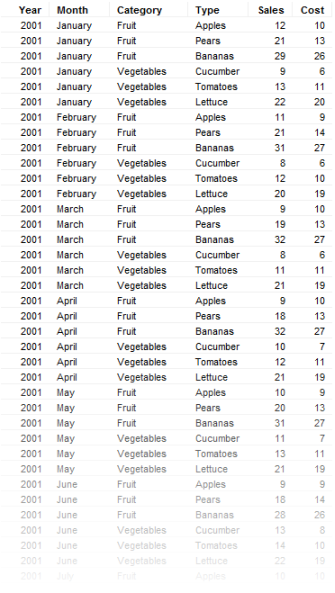
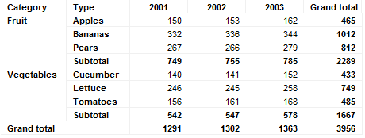
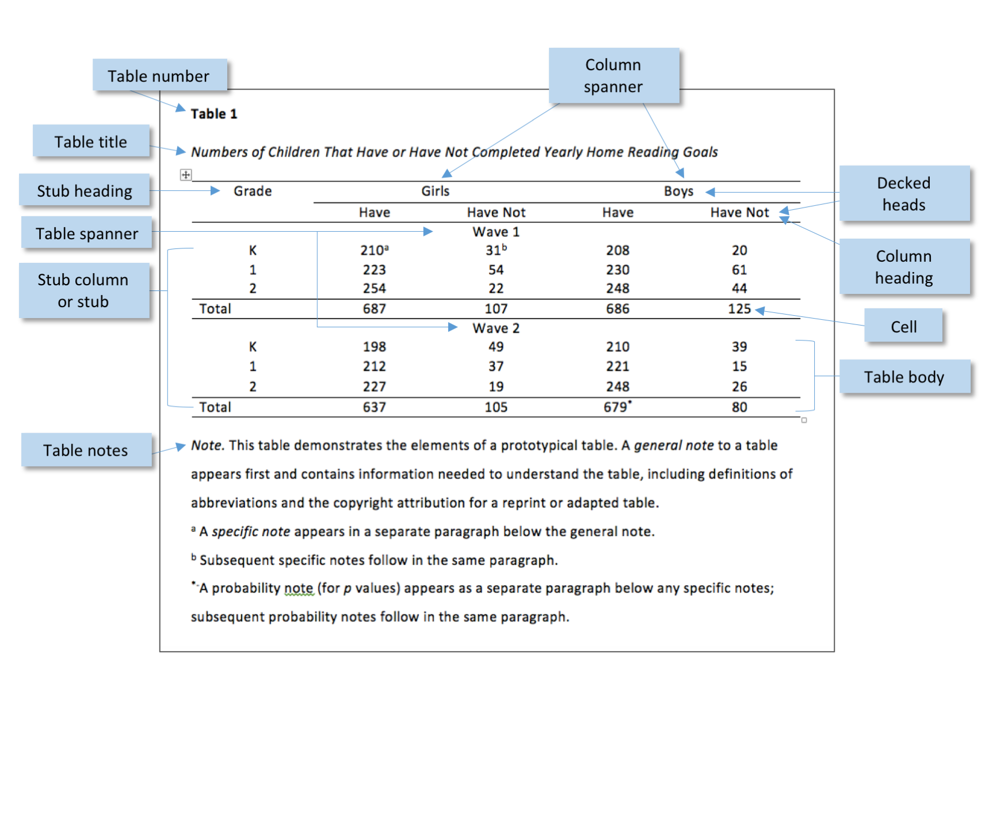
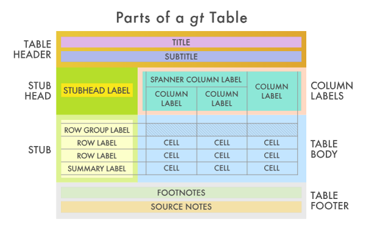
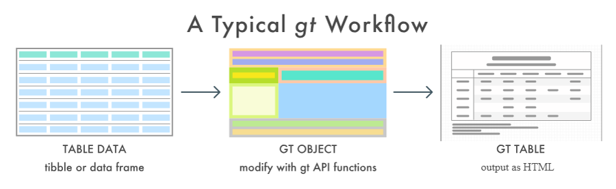
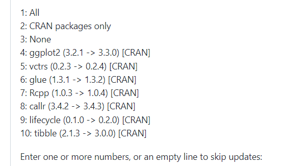
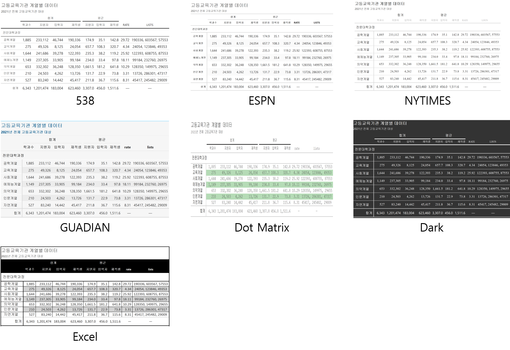
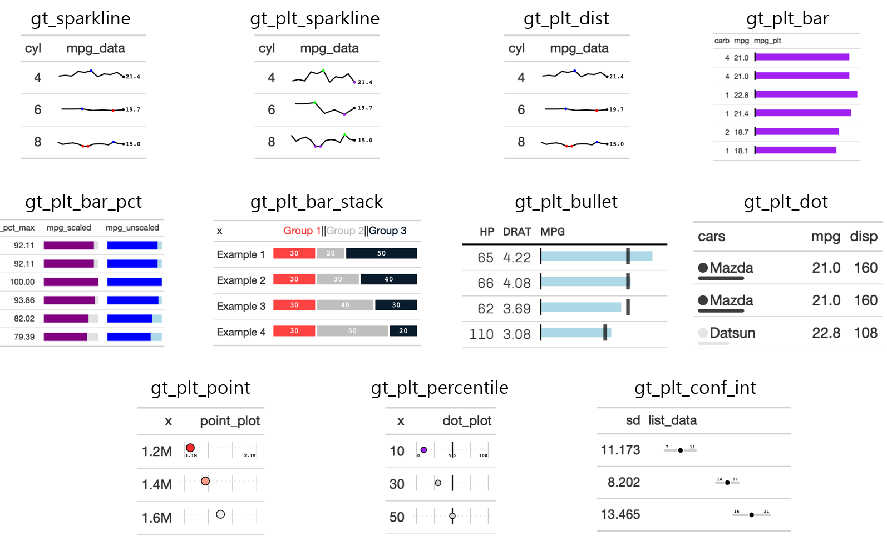

```{r setup, include=FALSE}
knitr::opts_chunk$set(echo = TRUE, message = FALSE, warning = FALSE, out.width = '100%', dpi = 120, fig.width = 6.5)

library(showtext)
showtext_auto()
library(tidyverse)
library(readxl)
library(scales)

```

```{r include=FALSE}
df_취업통계 <- read_excel('c:/R/git/datavisualization/chap3/2020년 학과별 고등교육기관 취업통계.xlsx', 
                     ## '학과별' 시트의 데이터를 불러오는데,
                     sheet = '학과별',
                     ## 앞의 13행을 제외하고
                     skip = 13, 
                     ## 첫번째 행은 열 이름으로 설정
                     col_names = TRUE, 
                     ## 열의 타입을 설정, 처음 9개는 문자형으로 다음 79개는 수치형으로 설정
                     col_types = c(rep('text', 9), rep('numeric', 79)))

## df_취업통계에서 첫번째부터 9번째까지의 열과 '계'로 끝나는 열을 선택하여 다시 df_취업통계에 저장
df_취업통계 <- df_취업통계 |> select(1:9, ends_with('계'), '입대자')

## df_취업통계 정보 확인
str(df_취업통계)
```

데이터 시각화를 한다고 하면 대부분 떠올리는 작업이 그래프를 그리는 작업이다. 그래서 데이터 시각화를 시작할 때는 먼저 데이터를 대상으로 할지, 어떤 그래프를 써서 데이터를 예쁘고 직관적으로 표현할지를 고민하게 된다. 하지만 데이터 시각화 결과가 들어갈 보고문서에는 대부분 그래프와 함께 표가 들어가는 경우가 대부분이지만 데이터를 설명하는 데이터 시각화를 해야할 때 많은 사람들은 표까지 생각하지는 않는 듯하다. 인터넷 상의 표의 정의[^1]를 보면 '시각적 의사소통과 자료의 정렬 양식'으로 나와 있다. 결국 표도 데이터 시각화의 일부인 것이다.

[^1]: <https://ko.wikipedia.org/wiki/%ED%91%9C>

표는 데이터를 직접적으로 표현한다는 점에서 그래프나 플롯과는 다르다. 데이터를 직접 표현하기 때문에 데이터를 정확하게 표현하지만 데이터의 전체적인 흐름이나 분포를 알아보기에는 적절치 않다. 하지만 그래프나 플롯은 정확한 데이터를 알아보기 힘들다는 점에서 표와 그래프, 플롯은 상호 보완적으로 사용되어야 한다.

# 표(table)란?

표는 행과 열로 이루어진 데이터의 모음이다. 행은 각각의 개별 사례2나 개별 사례를 적절히 그루핑한 요약된 데이터가 표현된다. 열은 각각의 사례를 설명하기 위해 필요한 속성이 나열된다. 행과 열은 이 만나는 곳이 사용자가 알고 싶어하는 데이터가 위치하고 이 곳을 칸, 혹은 셀이라고 한다.

표는 그 구성 방법에 따라 1차원 표와 다차원 표로 구성된다. 1차원 표는 단순히 데이터의 나열인 경우를 말한다. 이런 테이블을 '단순 표(simple table)'이라고도 한다. 다차원 표는 1차원 표를 적절한 변환(추상화)하여 표에서 제공하는 몇가지 차원의 정보를 모두 가져야 데이터를 해석할 수 있는 표를 말한다. 다차원 표 중에서 가장 흔하게 보이는 표가 2차원 표, 교차표(cross table)이다. 2차원 표는 행(X축)과 열(Y축)의 정보를 가지고 해당 칸(셀)의 정보를 해석할 수 있다.

아래의 그림은 1차원 표와 2차원 표의 예를 보이고 있다.





위의 그림에서 보면 1차원 표의 경우는 데이터를 설명하는 속성이 위쪽에만 설정되어 있다. 하지만 2차원 표의 경우는 데이터를 설명하는 속성이 위쪽과 왼쪽에 모두 설정되어 있다. 특정 칸의 데이터를 해석하기 위해서는 행과 열의 속성 정보를 모두 알아야 한다는 것이다.

1차원 표의 장점은 데이터를 원본 차원에서 확인 할 수 있다는 점이다. 반면 데이터의 행이 길어질 수 있어 보고서에 수록하는 것인 적절치 않을 때가 있다. 하지만 다차원 표의 가장 큰 장점은 데이터를 요약하고 구조화하였기 때문에 대량의 데이터의 특성을 간략히 표현했다는 점이다. 하지만 데이터를 요약하는 방식에 따라 전달되는 정보가 제한적일 수 있다는 단점이 있다.

표의 구성 방법과 요소는 사용자가 표현하고 싶은 데이터와 형태에 따라 표현방식이 매우 다르기 때문에 어느 하나로 정의하기가 어렵다. 다음 그림은 논문의 작성에서 대표적으로 사용되는 미국 심리학회의 표 구성 가이드라인이다.



모든 표를 APA 가이드라인에 맞춰 그릴 수는 없겠지만 APA 가이드라인을 보면 표에 꼭 들어가야 할 몇가지 요소들을 알 수 있다.

-   제목(Title) : 표에서 표현하고 있는 데이터를 대표하는 제목

-   헤드(Heading) : 표에서 제시하고 있는 사례들의 속성값들에 대한 이름이 표현된 표 가로축의 맨 위줄

-   스텁(Stub) : 표에서 사례를 표현하는 세로축의 묶음

-   스패너(Spanner) : 표의 특성을 표현하는 가로축 중에 유사한 특성의 묶음

-   몸체(Body) : 표의 헤드와 스텁으로 감싸고 있는 데이터가 표현된 셀들이 표현된 부분

실무에서 표를 그릴 때 가장 많이 사용하는 툴은 아마도 MS-Excel일 것이다. SpreadSheet로 거의 유일하게(?) 살아남은 이 툴은 표를 그리는 WYSYWYG(What You See IS Wat You Get) 툴로 거의 모든 Spreadsheet를 없애버렸다고 해도 과언이 아닐 듯 하다. 어쨌던 엑셀은 표를 그리는데 매우 특화된 툴임에는 틀림없고 초보자들도 쉽게 사용할 수 있지만 사용하다보면 몇가지 단점을 만날 수 있다.

가장 큰 단점이 반복된 작업을 하기가 어렵다는 점이다. 이는 WYSIWIG 툴들이 가지는 공통된 단점이다. 표를 쉽게 만들 수 있지만 유사한 표를 다시 만들어야 하는 경우 반복된 작업을 수행해야하고 반복된 작업을 꼼꼼히 기록해두지 않으면 동일한 표를 만들기 어렵다. 또 하나의 단점이 기초 데이터의 구조가 업데이트 되면 표를 다시 그려야 하는 경우가 발생한다는 점이다. 기초 데이터의 열 이름이 바뀌거나 열이 추가, 삭제되면 이 데이터로부터 파생된 표가 정상적으로 표현되지 않는다는 것이다. 이러한 문제는 엑셀을 사용해 본 사용자라면 한번쯤, 아니 자주 겪는 문제일 것이다.

이제 엑셀에서 탈피해서 R에서 표를 그려보자. R에서도 아주 훌륭한, 그리고 예쁘게 표를 그릴 수 있는 다양한 방법을 제공한다. R로 표를 그려보면 반복된 작업을 할 필요가 없다는 점에서, 기초 데이터의 업데이트가 발생해도 바로 반영할 수 있다는 점, 표를 세세하게 다룰 수 있다는 점에서 엑셀로 다시 돌아갈 수 없을 수도 있다.

# gt 패키지

R에서 표를 만들기 위해 사용되는 패키지 중에 하나가 `gt` 패키지이다. `gt` 패키지는 표의 세부 구성들을 상세히 구분하고 이들을 구조적으로 조화롭게 구성시켜서 표를 만드는 다양한 함수와 매개 변수들을 제공한다. `gt` 패키지에서 사용하는 표의 세부 파트는 다음의 그림과 같다.



표의 구성을 보면 앞에서 살펴보았던 APA 가이드라인상의 표와 유사한 형태를 보인다. 이와 같이 표를 세부적인 파트로 구분하고 이들을 각각 설정함으로써 표를 만들 수 있다.

`gt` 패키지에서 권장하는 표 생성 방식은 다음의 그림과 같다



우선 표를 만들기 위한 기초 데이터를 생성해야 한다. `gt` 패키지로 생성되는 표는 `tidyverse` 방식을 준용하여 생성하는 것이 편하다. 따라서 `gt` 표를 생성하기 위해 만드는 기초 데이터도 `tidyverse` 의 `tibble` 이나 R의 기초 데이터 셋인 `data.frame` 으로 생성한다. 이렇게 생성된 기초 데이터 셋은 `gt` 객체로 변환되고 `gt` 패키지에서 제공되는 다양한 함수와 매개변수를 설정하여 사용자가 원하는 형태의 표로 만들게 된다. 마지막으로 이 표를 다른 문서에서 활용하기 위해 html, pdf 등의 문서로 변환하여 활용한다.

우선 `gt` 패키지를 사용하기 위해서는 `gt` 패키지를 설치하고 로딩하여야 한다.

```{r}
if(!require('gt')) {
  install.packages('gt')
  library(gt)
}

```

이번 장에서 사용할 데이터는 앞 장에서 생성한 df_취업통계 데이터를 사용하겠다. 최종 생성될 표는 각각의 과정구분에 따라 편성된 대계열 학과들에 대한 취업 정보를 요약한 표이다. 표에서는 각각의 열을 과정구분로 구분(Stub)하고, 특성으로 표현되는 열은 졸업자, 취업자, 취업률 등 졸업 후 상황별 학생수를 표기하는데 취업 상세 학생과 비취업 상세 학생으로 열을 묶어(Spanner)하고 소계와 총계가 나타나는 표를 그리겠다.

## 데이터 전처리

우선 목표한 표를 만들기 위해 가진 데이터를 전처리하는 과정이 필요하다. 우선 추가적으로 필요한 열을 생성한다. 개별 학과별로 저장된 원본 데이터를 대계열별, 과정구분별로 요약(Summarise)하고 표현될 순서를 설정하기 위해 팩터로 레벨을 설정하도록 하겠다.

```{r}
## df_취업통계를 전처리하여 df_gt로 저장
df_gt <- df_취업통계 |>
  ## 과정구분과 대계열로 그루핑
  group_by(과정구분, 대계열) |>
  ## 각각의 열단위로 합계값으로 요약된 열 생성 
  summarise(졸업자 = sum(졸업자_계), 
            취업자 = sum(취업자_합계_계), 
            교외취업자 = sum(취업자_교외취업자_계), 
            교내취업자 = sum(취업자_교내취업자_계), 
            해외취업자 = sum(취업자_해외취업자_계), 
            농림어업종사자 = sum(취업자_농림어업종사자_계), 
            개인창작활동종사자 = sum(취업자_개인창작활동종사자_계), 
            일인창사업자 = sum(`취업자_1인창(사)업자_계`), 
            프리랜서 = sum(취업자_프리랜서_계), 
            진학자 = sum(진학자_계), 
            입대자 = sum(입대자),
            취업불가능자 = sum(취업불가능자_계), 
            외국인유학생 = sum(외국인유학생_계), 
            제외인정자 = sum(제외인정자_계), 
            기타 = sum(기타_계), 
            미상 = sum(미상_계), 
    ## 백분률인 취업률은 그 자체로 합계나 평균을 낼 수 없으니 각 그룹별로 재계산
            취업률 = 취업자 / (졸업자 - (진학자+입대자+취업불가능자+외국인유학생+제외인정자))) |>
  ## 최종결과는 그룹 설정을 제거
  ungroup()  |> 
  arrange(과정구분)

head(df_gt, 10)

## 과정구분의 순서를 맞추기 위해 과정구분을 팩터로 설정하고 레벨의 순서를 설정
df_gt$과정구분 <- fct_relevel(df_gt$과정구분, '전문대학과정', '대학과정', '대학원과정')

## 대계열의 순서를 맞추기 위해 과정구분을 팩터로 설정하고 레벨의 순서를 설정
df_gt$대계열 <- fct_relevel(df_gt$대계열, '인문계열', '사회계열', '교육계열', '자연계열', '공학계열', '의약계열', '예체능계열')

## 백분률인 취업률은 그 자체로 합계나 평균을 낼 수 없으니 각 소계 그룹별로 재계산하여 dt_gt_summary에 저장
df_gt_summary <- df_gt |> group_by(대계열) |> 
  summarise(취업률 = sum(취업자) / (sum(졸업자) - (sum(진학자)+sum(입대자)+sum(취업불가능자)+sum(외국인유학생)+sum(제외인정자))))

## 백분률인 취업률은 그 자체로 합계나 평균을 낼 수 없으니 각 총계로 재계산하여 dt_gt_grand_summary에 저장
df_gt_grand_summary <- df_gt |>  
  summarise(취업률 = sum(취업자) / (sum(졸업자) - (sum(진학자)+sum(입대자)+sum(취업불가능자)+sum(외국인유학생)+sum(제외인정자))))

```

## gt 객체 생성하기

gt 패키지를 사용하여 표를 그리려면 먼저 gt 패키지의 `gt()` 함수를 사용하여 gt 객체를 생성한다.

```{r eval=FALSE}
gt(data, rowname_col = "rowname", groupname_col = dplyr::group_vars(data), ...)
  - data : 표에 사용할 데이터프레임이나 tibble
  - rowname_col : 표 스텁으로 사용할 열 이름
  - groupname_col : 행 그룹으로 그루핑할 열 이름

```

매개변수 없이 `gt()`만으로도 `gt` 객체가 생성된다. 이 경우는 앞서 설명한 1차원 표의 형태인 단순 표(simple table)의 형태이다. 하지만 2차원 표의 형태를 만들기 위해서는 행에 대한 이름(Stub)을 붙여주고 유사한 행들을 그루핑(row group)하여야 한다. 행 그룹으로 사용할 열은 `groupname_col`로, 표의 스텁(Stub)으로 사용할 열인 `rowname_col`을 설정해주면 표의 전반적인 기본 형태를 볼 수 있기 때문에 가급적이면 `gt` 객체를 생성할 때 설정해 주는 것이 좋다.

```{r}
## df_gt 데이터를 사용해 생성된 gt 객체를 gt_table1에 저장
gt_table1 <- df_gt |>
  ## gt()로 rowname_col을 과정구분, groupname_col을 대계열로 설정한 gt 객체 생성
  gt(rowname_col = '과정구분', 
     groupname_col = '대계열')

gt_table1

```


## 표제 생성하기

이제 표의 각 부분을 설정하는데 먼저 표의 제목부터 설정한다. 표 제목을 설정하기 위해서는 `tab_header()`를 사용한다. `tab_header()`의 `title` 매개변수로 표 제목을 설정하고 `subtitle`을 사용하여 표 부제목을 설정할 수 있다.

```{r}
gt_table2 <- gt_table1 |>
  ## tab_header()를 사용하여 제목과 부제목을 설정
  tab_header(title = '고등교육기관 취업통계', 
             subtitle = '2021년 전체 고등교육기관 대상')

gt_table2
```


## 데이터 포맷 설정

다음으로 각각의 셀에 표현되는 수치값의 형태를 설정한다. `gt` 객체의 각 셀의 포맷을 설정할 떄는 다음과 같은 `fmt_*()`를 사용한다.

| 함수명                                                                     | 설명                      |
|----------------------------------------------------------------------------|---------------------------|
| [fmt_number()](https://gt.rstudio.com/reference/fmt_number.html)           | 숫자형 포맷을 설정        |
| [fmt_integer()](https://gt.rstudio.com/reference/fmt_integer.html)         | 정수형 포맷을 설정        |
| [fmt_scientific()](https://gt.rstudio.com/reference/fmt_scientific.html)   | 과학 표기 포맷을 설정     |
| [fmt_engineering()](https://gt.rstudio.com/reference/fmt_engineering.html) | 공학 표기 포맷을 설정     |
| [fmt_percent()](https://gt.rstudio.com/reference/fmt_percent.html)         | 백분률 포맷을 설정        |
| [fmt_currency()](https://gt.rstudio.com/reference/fmt_currency.html)       | 통화기호 포맷을 설정      |
| [fmt()](https://gt.rstudio.com/reference/fmt.html)                         | 사용자 정의형 포맷을 설정 |

`fmt_*()` 의 주요 매개변수는 다음과 같다.

```{r eval = FALSE}
fmt_*(data, columns, rows = everything(), decimals = 2, sep_mark = ",", dec_mark = ".", use_seps = TRUE,  ...)
  - data : 표에 사용할 gt 객체
  - columns : 포맷을 설정할 열 이름, `c()`를 사용하여 열 이름 벡터나 열 번호를 사용할 수 있고 헬퍼 함수인 `starts_with()`, `ends_with()`, `contains()`, `matches()`, `one_of()`, `num_range()`, `everything()`으로 열을 선택할 수 있음 
  - decimals : 소수점 아래 표기 자리수 설정
  - sep_mark : 천단위 구분자로 사용할 기호 설정
  - dec_mark : 소수점 구분자로 사용할 기호 설정
  - use_seps : 천단위 구분자를 사용할지를 결정하는 논리값

```

학생수는 정수로 모두 소수점이하가 필요없고 취업률은 백분율이기 때문에 소수점 한자리까지 표현되는 백분률 포맷으로 설정한다.

```{r}
gt_table3 <- gt_table2 |> 
  ## 4열부터 18열까지는 수치형 포맷으로 소수점이하를 제거하고 천단위 구분자 사용
  ## 3열을 제외한 이유는 다음 절에서 설명할 gtExtras 패키지의 -gt_color_box()를 사용하기 위해 포맷을 설정하지 않았음.
  fmt_number(columns = 4:18, decimals = 0, use_seps = TRUE) |>
  ## 19열은 백분률 포맷으로 소수점 첫자리까지 표기하고 천단위 구분자는 미사용
  fmt_percent(columns = 19, decimals = 1, use_seps = FALSE)

gt_table3
```


## 표 헤드 설정

표의 헤드는 표의 데이터가 표시되어 데이터 각 열의 이름이 표시되는 줄이다. 표 헤드는 한 줄로 표현이 가능하지만 유사한 열끼리 묶어 여러 행으로 표현하는 경우도 있다. 이 부분을 스패너(Spanner)라고 한다. 결국 표 헤드를 수정한다는 것은 각각의 열 이름이나 위치에 대한 수정, 유사한 열끼리를 묶는 스패너를 생성, 열을 묶어 하나의 열로 만드는 과정들이다. 표 헤드를 설정하기 위해 사용되는 주요 함수는 다음과 같다. [^2]

[^2]: 각각의 함수에 대한 세부 사용법은 `gt` 패키지 매뉴얼(<https://gt.rstudio.com/reference/index.html>)을 참조하라.

| 함수명               | 설명                  |
|----------------------|-----------------------|
| tab_spanner()        | 스패너 열을 생성      |
| cols_align()         | 열의 정렬 수정        |
| cols_width()         | 열의 너비 수정        |
| cols_label()         | 열의 이름 수정        |
| cols_move_to_start() | 열을 맨 앞으로 이동   |
| cols_move_to_end()   | 열을 맨 뒤로 이동     |
| cols_move()          | 열을 특정 위치로 이동 |
| cols_hide()          | 열을 감춤             |
| cols_unhide()        | 감춘 열을 보임        |
| cols_merge()         | 열을 묶음(Merge)      |

앞에서 만든 표는 `gt` 객체에 사용한 df_gt의 열 이름이 그대로 사용되어 헤드가 한줄로만 표현되었다. 이 중 교외 취업자, 교내 취업자 등 5열부터 11열까지는 취업자의 상세 내용이고 12열부터 18열까지는 비취업자의 상세 내용이기 때문에 이 두 부분을 각각 스패너로 묶어주면 좋을 듯 하다. 헤드의 스패너를 생성하기 위해서는 `tab_spanner()` 를 사용한다.

```{r eval=FALSE}
tab_spanner(data, label, columns, id = label, gather = TRUE)
  - data : 표에 사용할 gt 객체
  - label : 스패너 라벨
  - columns : 스패너에 속할 열의 집합, 열 이름 벡터나 열 번호 벡터 가능
  - id : 스패너의 ID
  - gather : 스패너에 속한 열들을 모아줄 것인지를 결정하는 논리값
  
```

`tab_spanner()`를 사용하여 스패너를 생성하는 코드는 다음과 같다.

```{r}
## gt_table3 객체에서
gt_table4 <- gt_table3 |> 
  ## 5열부터 11열까지 스패너로 묶어주는데 스페너 라벨은 '취업 상세'
  tab_spanner(columns = 5:11, label = '취업 상세') |>
  ## 12열부터 18열까지 스패너로 묶어주는데 스페너 라벨은 '비취업 상세'
  tab_spanner(columns = 12:18, label = '비취업 상세') 

gt_table4
```


앞선 전처리 과정에서 '1인창(사)업자' 열은 열이름의 맨 앞이 숫자이고 특수문자가 들어가기 때문에 열이름을 '일인창사업자로' 설정했다. '1인창(사)업자'와 같이 숫자가 맨앞에 들어가는 열은 '\`'을 사용하여 접근이 가능하지만 여러모로 불편한점이 있다. 하지만 표에서의 표기는 원상태대로 해주겠다. `col_label()`을 이용하여 헤더에 표함된 열이름을 바꾸어 줄 수 있다.

```{r eval=FALSE}
cols_label(.data, ...)
  - data : 표에 사용할 gt 객체
  - ... : 바꾸어줄 열의 이름과 바꿀 이름의 페어

```

```{r}
gt_table5 <- gt_table4 |> 
  ## '일인창사업자'열이름을 '1인창(사)업자'로 변경
  cols_label(일인창사업자 = '1인창(사)업자')

gt_table5
```


## 행 그룹 설정

행 그룹은 열의 스패너와 비슷한 개념으로 유사한 행들을 묶어 표현할 수 있다. 행 그룹의 설정은 `gt()` 객체 생성시 `groupname_col`로 설정한 행끼리 묶어주는 행이 나타난다. 하지만 이 그룹들의 순서는 따로 설정되지 않았기 때문에 알파벳 순서(가나다 순)으로 정렬되었다. 이 부분을 사용자가 원하는 순서대로 설정하기 위해서는 `row_group_order()`를 사용한다.

```{r eval=FALSE}
row_group_order(data, groups)
  - data : 표에 사용할 gt 객체
  - group : 행 그룹의 순서로 설정할 문자열 벡터

```

앞선 표의 행 그룹 순서를 설정하는 코드는 다음과 같다.

```{r}
gt_table6 <- gt_table5 |> 
  row_group_order(
    ## 행 그룹의 정렬에 설정할 문자열 벡터 설정
    groups = c('인문계열', '사회계열', '교육계열', '자연계열', '공학계열', '의약계열', '예체능계열')
  )

gt_table6
```


## 요약 행 생성

우리가 사용하는 많은 표들은 각 행 그룹이나 전체 표의 마지막에 소계, 총계, 평균과 같은 요약 행를 넣는 경우가 많다. `gt` 패키지는 각 행그룹과 전체 표의 요약행을 넣어주는 기능을 제공한다. 각 행그룹의 요약행을 넣는 함수는 `summary_rows()`이고 전체 요약행을 넣는 함수는 `grand_summary_rows()`이다.

```{r eval = FALSE}
summary_rows(data, groups , columns = everything(), fns, missing_text = "---",formatter = fmt_number, ...)
  - data : 표에 사용할 gt 객체
  - groups : 요약행을 넣어줄 그룹 지정, 그룹명을 지정할 수도 있지만 TRUE를 지정하면 모든 행 그룹에 적용
  - columns : 요약 함수를 적용할 열 지정
  - fns : 요약에 사용할 함수, 일반적 요약 함수(mean, median, max, min 등)와 사용자 정의 함수 모두 가능
  - missing_text : 누락치의 표현에 사용할 문자열
  - formatter : 요약 행에 적용할 포맷 지정, fmt_*()를 사용할 수 있음

```

위의 표에서 합계를 요약 함수로 사용할 수 있는 열은 학생수가 표현되는 3열부터 18열까지이다. 이는 요약함수로 `sum()`을 사용하여 각각의 행 그룹에 대한 합계를 표현하는 행을 생성하는 코드는 아래와 같다. 또 19번째 열은 취업률인데 이 열은 합계나 평균으로 요약값을 제공하는 것은 정확하지도 쓸모가 있지도 않다. 따라서 이 요약행은 각 그룹에 따라 미리 계산된 값을 넣어주도록 하겠다.

```{r}
gt_table7 <- gt_table6 |> 
  ## 요약행을 만드는데
  summary_rows(
    ## 모든 그룹에 요약행을 만듦
    groups = T,
    ## 3번째부터 18번째까지 열을 대상으로 함
    columns = 3:18,
    ## 요약함수로
    fns = list(
      ## sum()함수를 사용하여 요약행 이름을 소계로 설정
      소계 = ~sum(.)),
    ## 수치포맷으로 설정
    formatter = fmt_number,
    ## 소수점 아래는 제거
    decimals = 0,
    ## 천단위 구분자를 사용
    use_seps = TRUE
  ) |>
  ## 요약행을 만드는데 
  summary_rows(
    ## 인문계열 그룹의 요약행
    groups = '인문계열',
    ## 요약할 열은 19열
    columns = 19,
    ## 요약 함수를 사용자 정의형으로 생성
    fns = list(
      소계 = ~pull(df_gt_summary |> filter(대계열 == '인문계열') |> select(취업률))
      ),
    ## 포맷은 백분률형태
    formatter = fmt_percent,
    ## 소수점은 한자리
    decimals = 1
  ) |>
  summary_rows(
    ## 사회계열 그룹의 요약행
    groups = '사회계열',
    columns = 19,
    fns = list(
      소계 = ~pull(df_gt_summary |> filter(대계열 == '사회계열') |> select(취업률))
    ),
    formatter = fmt_percent, 
    decimals = 1
  ) |>
  summary_rows(
    ## 교육계열 그룹의 요약행
    groups = '교육계열',
    columns = 19,
    fns = list(
      소계 = ~pull(df_gt_summary |> filter(대계열 == '교육계열') |> select(취업률))
    ),
    formatter = fmt_percent, 
    decimals = 1
  ) |>
  summary_rows(
    ## 자연계열 그룹의 요약행
    groups = '자연계열',
    columns = 19,
    fns = list(
      소계 = ~pull(df_gt_summary |> filter(대계열 == '자연계열') |> select(취업률))
    ),
    formatter = fmt_percent, 
    decimals = 1
  ) |>
  summary_rows(
    ## 공학계열 그룹의 요약행
    groups = '공학계열',
    columns = 19,
    fns = list(
      소계 = ~pull(df_gt_summary |> filter(대계열 == '공학계열') |> select(취업률))
    ),
    formatter = fmt_percent, 
    decimals = 1
  ) |>
  summary_rows(
    ## 의약계열 그룹의 요약행
    groups = '의약계열',
    columns = 19,
    fns = list(
      소계 = ~pull(df_gt_summary |> filter(대계열 == '의약계열') |> select(취업률))
    ),
    formatter = fmt_percent, 
    decimals = 1
  ) |>
  summary_rows(
    ## 예체능계열 그룹의 요약행
    groups = '예체능계열',
    columns = 19,
    fns = list(
      소계 = ~pull(df_gt_summary |> filter(대계열 == '예체능계열') |> select(취업률))
    ),
    formatter = fmt_percent, 
    decimals = 1
  )

gt_table7
```


각 행 그룹별 요약행이 생성되면 전체 요약행을 생성한다. 전체 요약행은 `grand_summary_rows()`를 사용한다.

```{r eval=FALSE}
grand_summary_rows(data, columns = everything(), fns, missing_text = "---", formatter = fmt_number, ...)
  - data : 표에 사용할 gt 객체
  - columns : 요약 함수를 적용할 열 지정
  - fns : 요약에 사용할 함수, 일반적 요약 함수(mean, median, max, min 등)와 사용자 정의 함수 모두 가능
  - missing_text : 누락치의 표현에 사용할 문자열
  - formatter : 요약 행에 적용할 포맷 지정, fmt_*()를 사용할 수 있음

```

위의 표에 전체 요약행을 생성하는 코드는 다음과 같다.

```{r}
gt_table8 <- gt_table7 |>
  ## 전체 요약행을 생성
  grand_summary_rows(
    ## 3열부터 18열을 대상
    columns = 3:18,
    ## 요약함수는 sum()이고 이름을 총계로 설정
    fns = list(
      총계 = ~sum(.)), 
    ## 포맷은 수치형
    formatter = fmt_number, 
    ## 소수점 아래는 제거
    decimals = 0,
    ## 천단위 구분자 사용
    use_seps = TRUE
  ) |>
  ## 전체 요약행을 생성
  grand_summary_rows(
    ## 19열을 대상
    columns = 19,
    ## 요약 함수를 사용자 정의형으로 생성
    fns = list(
      총계 = ~pull(df_gt_grand_summary |> select(취업률))), 
    ## 포맷은 백분률형
    formatter = fmt_percent, 
    ## 소수점은 한자리까지 표기
    decimals = 1
  )


gt_table8
```


## 전체 표 꾸미기

표를 꾸밀때는 선 형태, 선 색깔, 셀 배경색, 글자 폰트, 글자 크기 등 여러가지 워드프로세서에서나 가능할 만한 여러가지 특성 요소를 직접 설정할 수 있어야 한다. `gt` 패키지에서는 `tab_options()` 함수의 다양한 매개 변수를 설정함에 따라 이들 특성 요소들을 직접 설정할 수 있다. 다만 `tab_options()`에서 제공하는 매개 변수들이 너무 많아서 다 설명할 수 없다. 이 중 많이 사용되는 매개변수는 다음과 같다.[^3]

[^3]: 보다 자세한 매개변수는 `gt` 의 매뉴얼(<https://gt.rstudio.com/reference/tab_options.html>)을 참조하라.

+------------------------------------------------------------------------------------------------------------------------------------------------------------------------------------------------------------------------------------------------------------------------------------------------------------------------------------------------------------------------------------------------------------------------------------------------------------------------------------------------------------------------------------------------------------------+-------------------------------------------+
| 매개변수                                                                                                                                                                                                                                                                                                                                                                                                                                                                                                                                                         | 설명                                      |
+==================================================================================================================================================================================================================================================================================================================================================================================================================================================================================================================================================================+===========================================+
| table.width, table.layout, table.align , table.margin.left, table.margin.right, table.background.color, table.additional_css, table.font.names, table.font.size, table.font.weight, table.font.style, table.font.color, table.font.color.light, table.border.top.style, table.border.top.width, table.border.top.color, table.border.right.style, table.border.right.width, table.border.right.color, table.border.bottom.style, table.border.bottom.width, table.border.bottom.color, table.border.left.style, table.border.left.width, table.border.left.color | 전체 표의 특성 설정에 관련된 매개변수     |
+------------------------------------------------------------------------------------------------------------------------------------------------------------------------------------------------------------------------------------------------------------------------------------------------------------------------------------------------------------------------------------------------------------------------------------------------------------------------------------------------------------------------------------------------------------------+-------------------------------------------+
| heading.background.color, heading.align, heading.title.font.size, heading.title.font.weight , heading.subtitle.font.size, heading.subtitle.font.weight, heading.padding, heading.border.bottom.style, heading.border.bottom.width, heading.border.bottom.color, heading.border.lr.style, heading.border.lr.width, heading.border.lr.color                                                                                                                                                                                                                        | 헤드 특성 설정에 관련된 매개변수          |
+------------------------------------------------------------------------------------------------------------------------------------------------------------------------------------------------------------------------------------------------------------------------------------------------------------------------------------------------------------------------------------------------------------------------------------------------------------------------------------------------------------------------------------------------------------------+-------------------------------------------+
| column_labels.background.color, column_labels.font.size, column_labels.font.weight, column_labels.text_transform, column_labels.padding, column_labels.vlines.style, column_labels.vlines.width, column_labels.vlines.color, column_labels.border.top.style, column_labels.border.top.width, column_labels.border.top.color, column_labels.border.bottom.style, column_labels.border.bottom.width, column_labels.border.bottom.color, column_labels.border.lr.style, column_labels.border.lr.width, column_labels.border.lr.color, column_labels.hidden          | 열 제목(라벨)의 특성 설정을 위한 매개변수 |
+------------------------------------------------------------------------------------------------------------------------------------------------------------------------------------------------------------------------------------------------------------------------------------------------------------------------------------------------------------------------------------------------------------------------------------------------------------------------------------------------------------------------------------------------------------------+-------------------------------------------+
| row_group.background.color, row_group.font.size, row_group.font.weight, row_group.text_transform, row_group.padding, row_group.border.top.style, row_group.border.top.width, row_group.border.top.color, row_group.border.bottom.style, row_group.border.bottom.width, row_group.border.bottom.color, row_group.border.left.style, row_group.border.left.width, row_group.border.left.color, row_group.border.right.style, row_group.border.right.width, row_group.border.right.color, row_group.default_label, row_group.as_column                              | 행 그룹의 특성 설정을 위한 매개변수       |
+------------------------------------------------------------------------------------------------------------------------------------------------------------------------------------------------------------------------------------------------------------------------------------------------------------------------------------------------------------------------------------------------------------------------------------------------------------------------------------------------------------------------------------------------------------------+-------------------------------------------+
| table_body.hlines.style, table_body.hlines.width, table_body.hlines.color, table_body.vlines.style, table_body.vlines.width, table_body.vlines.color, table_body.border.top.style, table_body.border.top.width, table_body.border.top.color, table_body.border.bottom.style, table_body.border.bottom.width, table_body.border.bottom.color                                                                                                                                                                                                                      | 표 본체의 특성 설정을 위한 매개변수       |
+------------------------------------------------------------------------------------------------------------------------------------------------------------------------------------------------------------------------------------------------------------------------------------------------------------------------------------------------------------------------------------------------------------------------------------------------------------------------------------------------------------------------------------------------------------------+-------------------------------------------+
| stub.background.color, stub.font.size, stub.font.weight, stub.text_transform, stub.border.style, stub.border.width, stub.border.color, stub_row_group.font.size, stub_row_group.font.weight, stub_row_group.text_transform, stub_row_group.border.style, stub_row_group.border.width, stub_row_group.border.color                                                                                                                                                                                                                                                | 스텁의 특성 설정을 위한 매개변수          |
+------------------------------------------------------------------------------------------------------------------------------------------------------------------------------------------------------------------------------------------------------------------------------------------------------------------------------------------------------------------------------------------------------------------------------------------------------------------------------------------------------------------------------------------------------------------+-------------------------------------------+
| summary_row.background.color, summary_row.text_transform, summary_row.padding, summary_row.border.style, summary_row.border.width, summary_row.border.color, grand_summary_row.background.color, grand_summary_row.text_transform, grand_summary_row.padding, grand_summary_row.border.style, grand_summary_row.border.width, grand_summary_row.border.color, footnotes.background.color,                                                                                                                                                                        | 요약 행의 특성 설정을 위한 매개변수       |
+------------------------------------------------------------------------------------------------------------------------------------------------------------------------------------------------------------------------------------------------------------------------------------------------------------------------------------------------------------------------------------------------------------------------------------------------------------------------------------------------------------------------------------------------------------------+-------------------------------------------+

위에서 생성한 표의 주요 속성을 설정하는 코드는 다음과 같다.[^4]

[^4]: 아래의 코드 중 색상명에서 오류가 발생한다면 주석에 기재된 RGB코드를 사용하라. 색상에 따른 RGB코드는 'R Charts'의 'Colors in R'(<https://r-charts.com/colors/>)에서 확인할 수 있다.

```{r}
 gt_table9 <- gt_table8 |>
   tab_options(
     table.font.size = 12,
     ## 행 그룹 요약 행의 배경색 설정("#009acd")
     summary_row.background.color = "deepskyblue3",
     ## 전체 요약 행의 배경색 설정("#00688B")
     grand_summary_row.background.color = "deepskyblue4",
     ## 구분(Stub) 행의 헤더 외곽선 스타일 설정
     stub.border.style = 'solid', 
     ## 구분(Stub) 행의 배경색 설정('#00BFFF')
     stub.background.color = 'lightskyblue1',
     ## 행 그룹 이름 표현 셀 배경색 설정('#F0F8FF')
     row_group.background.color = 'aliceblue',
     ## 열 제목(Heading) 배경색 설정('#104E8B')
     heading.background.color = 'dodgerblue4',
     ## 표 몸체(Body) 수평선 스타일 설정
     table_body.hlines.style = 'dashed', 
     ## 표 몸체(Body) 수직선 색깔 설정 
     table_body.vlines.color = 'grey',
     ## 표 몸체(BOdy) 수직선 스타일 설정
     table_body.vlines.style = 'dashed'
   )


gt_table9
```


## 개별 셀 꾸미기

`tab_options()`에서 많은 설정값을 제공하지만 표를 세부적으로 설정하기가 다소 어려울 것이다. 표의 전체를 일괄적으로 설정 때는 `tab_options()`를 사용하지만 생각보다 세부적인 설정이 어렵다. 따라서 셀 단위로 세부적인 설정을 위해서는 `tab_style()`을 사용한다. `tab_style()`은 표에서 설정할 셀을 선택하고 이 부분에 대한 특성을 설정함으로써 표를 꾸밀 수 있다. 이 함수에서는 셀 위치(locations)와 셀 스타일(style)을 지정하는 두가지 매개변수가 필요하다. 이 매개변수들을 설정할 때는 도움 함수(helper function)[^5]을 사용하는데 tab_style() 의 사용법은 다음과 같다.

[^5]: 특정 함수안에서만 사용이 되는 함수로 해당 함수의 세부 기능을 수행하기 위해 사용되는 함수를 말한다.

```{r eval=FALSE}
tab_style(data, style, locations)
  - data : 표에 사용할 gt 객체
  - locations : 셀의 위치를 설정하기 위한 헬퍼함수
  - style : 셀의 속성을 설정하기 위한 도움 함수, 2개 이상의 도움 함수를 사용해야 할 경우는 list로 만들어준다.

```

`tab_style()` 의 위치(`locations`)를 설정하는데 사용하는 도움 함수는 다음과 같다.

+------------------+-------------------------------------------------------------------+----------------------------------------------------------------+
| 도움함수명       | 설명                                                              | 매개변수                                                       |
+==================+===================================================================+================================================================+
| `cell_fill()`    | 셀 안을 채우는 색깔을 지정하는 함수                               | `color`, `alpha`                                               |
+------------------+-------------------------------------------------------------------+----------------------------------------------------------------+
| `cell_text()`    | 셀 안의 문자 형태(색깔, 폰트, 크기, 스타일, 굵기)를 지정하는 함수 | `color`, `font`, `size`, `style`, `weight` , `align`, `indent` |
+------------------+-------------------------------------------------------------------+----------------------------------------------------------------+
| `cell_borders()` | 셀의 테두리 설정                                                  | `sides`, `color`, `style`, `weight`                            |
+------------------+-------------------------------------------------------------------+----------------------------------------------------------------+

셀의 위치(`locations`)를 설정할 때 사용하는 도움 함수는 다음과 같다.

| 도움 함수                    | 설명                          | 매개변수              |
|------------------------------|-------------------------------|-----------------------|
| `cells_title()`              | 표 제목 셀 선택               | groups                |
| `cells_stubhead()`           | 구분(Stub) 열 제목셀 선택     |                       |
| `cells_column_spanners()`    | 열 이름 묶음(Spanner) 셀 선택 | spanners              |
| `cells_column_labels()`      | 열 이름 셀 선택               | columns               |
| `cells_row_groups()`         | 행 그룹 셀 선택               | groups                |
| `cells_stub()`               | 구분 셀 선택                  | rows                  |
| `cells_body()`               | 표 몸체(Body) 셀 선택         | columns, rows         |
| `cells_summary()`            | 요약 셀 선택                  | groups, columns, rows |
| `cells_grand_summary()`      | 전체 요약 셀 선택             | columns, rows         |
| `cells_stub_summary()`       | 요약 구분 셀 선택             | groups, rows          |
| `cells_stub_grand_summary()` | 전체 요약 구분 셀 선택        | rows                  |
| `cells_footnotes()`          | 각주 셀 선택                  |                       |
| `cells_source_notes()`       | 출처 셀 선택                  |                       |

그러면 이제 차근차근 표를 꾸며보자. 먼저 표 제목을 굵게하고 크기를 25로 부제목을 크기 15로 다음과 같이 설정한다.

```{r}
gt_table10 <- gt_table9 |>
  ## tab_style()로 셀을 설정
  tab_style(
    ## cell_title()의 group = title로 제목 셀을 선택 
    locations = cells_title(groups = "title"),
    ## 스타일을 설정
    style     = list(
      ## 텍스트에 대한 설정이므로 cell_text()를 사용하여 세부 설정
      cell_text(weight = "bold", size = px(25))
    )
  ) |>
  ## tab_style()로 셀을 설정
  tab_style(
    ## cell_title()의 group = subtitle로 부제목 셀을 선택 
    locations = cells_title(groups = "subtitle"),
    ## 스타일을 설정
    style     = list(
      ## 텍스트에 대한 설정이므로 cell_text()를 사용하여 세부 설정
      cell_text(size = px(15))
    )
  )


gt_table10
```


다음으로는 헤드에 대한 특성을 설정한다. 헤드는 열 라벨과 스패너로 구성되어 있다. '취업 상세' 스패너와 '비취업 상세' 스패너의 상세 특성 설정과 나머지 라벨들의 세부 설정 코드는 다음과 같다. 자세히 살펴보면 `cell_text()`로 설정하지 않은 "vertical-align:middle" 특성이 있다. 이는 CSS에서 사용하는 특성 설정으로 CSS 속성을 사용할 수 있다.

```{r}
gt_table11 <- gt_table10 |>
  ## tab_style()로 셀을 설정
  tab_style(
    ## cells_column_spanners()로 '취업 상세' 스패너를 선택
    locations = cells_column_spanners(spanners = "취업 상세"),
    style     = list(
      cell_text(weight = "bold", color = 'grey20', align = 'center')
    )
  ) %>% 
  tab_style(
    ## cells_column_labels()로  5열부터 11열까지 헤드 라벨 선택
    locations = cells_column_labels(columns = 5:11),
    style     = list(
      cell_text(weight = "lighter", color = 'grey50', align = 'center'), 
      "vertical-align:middle"   ## css attribute
    )
  ) %>% 
  tab_style(
    ## cells_column_spanners()로 '비취업 상세'를 스패너 선택
     locations = cells_column_spanners(spanners = "비취업 상세"),
    style     = list(
      cell_text(weight = "bold",color = "grey20", align = 'center')
    )
  ) |>
  tab_style(
    ## cells_column_labels()로 12열부터 18열까지 헤드 라벨 선택
    locations = cells_column_labels(columns = 12:18),
    style     = list(
      cell_text(weight = "lighter", color = 'grey50', align = 'center'), 
      "vertical-align:middle"   ## css attribute
    )
  ) |>
  tab_style(
    ## cells_column_labels()로 3, 4열과 19열 헤드 라벨 선택
    locations = cells_column_labels(columns = c(3:4, 19)),
    style     = list(
      cell_text(weight = "bold", color = 'grey20', align = 'center'), 
      "vertical-align:middle"   ## css attribute
    )
  )


gt_table11
```


이번에는 행 그룹 셀, 행그룹 요약 셀, 전체 요약 셀, 요약 스텁 셀에 대한 세부 특성을 설정하도록 한다.

```{r}
gt_table12 <- gt_table11 |> 
  tab_style(
    ## cells_row_groups()으로 전체 열 그룹 셀 선택
    locations = cells_row_groups(groups = everything()),
    style     = list(
      cell_text(color = "grey25", size = 24, align = 'center', weight = 'bold'), 
      cell_fill(color = 'aliceblue')
    )
  ) |>
  tab_style(
    ## cells_summary()로 전체 행 그룹 요약 셀 선택
    locations = cells_summary(groups = everything()),
    style     = list(
      cell_text(color = "white", size = 24, align = 'center', weight = 'bold')
    )
  ) |>
  tab_style(
    ## cells_grand_summary()로 전체 요약 셀 선택
    locations = cells_grand_summary(),
    style     = list(
      cell_text(color = "white", size = 24, align = 'center', weight = 'bold')
    )
  ) |>
  tab_style(
    ## cells_stub_summary()로 행 그룹 요약 스텁 셀 선택
    locations = cells_stub_summary(),
    style     = list(
      cell_text(color = "white", size = 24, align = 'center', weight = 'bold')
    )
  ) |>
  tab_style(
    ## cells_stub_grand_summary()로 전체 요약 스텁 셀 선택
    locations = cells_stub_grand_summary(),
    style     = list(
      cell_text(color = "white", size = 24, align = 'center', weight = 'bold')
    )
  )

gt_table12
```


셀에 대한 세부 특성 설정을 완료되고 나서 보면 열의 너비가 제각각이어서 보기가 좋지 않다. `cols_width()`로 전체 셀의 너비를 설정할 수 있다. `cols_width()`의 사용에서 하나 주의해야할 것은 열의 선택과 열의 너비를 선택하는 좌측과 우측을 모두 함수를 사용하여야 한다는 것과 할당 연산자인 `=` 나 `<-`를 사용하지 않고 `~`를 사용한다는 것이다. 좌측에는 열의 선택에 사용하는 `starts_with()`, `ends_with()` 와 같은 함수나 열 이름으로 벡터를 만들기 위해 `c()`를 사용하고 우측에는 `px()`를 사용한다.

```{r}
gt_table13 <- gt_table12 |> 
  ## cols_width()로 전체 셀(everything())을 선택하고 너비를 설정
  cols_width(everything() ~ px(70))

gt_table13
```


## 셀 배경색을 통한 데이터 강조

표를 보다보면 최대값이나 최소값을 강조할 필요가 있다. 또 표에 포함된 숫자의 크기에 따라 글자색이나 배경색을 표기해주면 표를 읽기가 더 쉬워진다. `gt` 패키지에서는 이 기능을 지원하기 위해 `data_color()` 를 제공한다. `data_color()` 를 사용하여 열의 숫자에 따라 색을 달리 표현할 수 있다.

data_color()의 사용법은 다음과 같다.

```{r eval=FALSE}
data_color(data, columns, colors, alpha = NULL, apply_to = c("fill", "text"), autocolor_text = TRUE)
  - data : 표 그리기에 사용할 gt 객체
  - columns : 배경색 변경을 적용해야하는 열
  - color : 열의 색 변경에 사용할 색 벡터로써 scales 패키지의 색상 매핑 함수나 열의 개별 값(수준)에 매칭될 색 벡터
  - alpha : 옵션 값으로 열의 색 변경에 적용되는 투명도 값
  - apply_to : 열의 색을 배경색(fill)에 적용할지 글자색(text)에 적용할 지를 지정
  - autocolor_text : 셀의 배경색에 따라 글자색을 변경하는 옵션 지정(기본값은 TRUE)

```

위의 `data_color()` 사용법에서 `color` 매개변수에는 `scales` 패키지의 색상 매핑 함수를 사용할 수 있다. `scales` 패키지의 색상 매핑 함수는 `scales::col_quantile()`, `scales::col_bin()`, `scales::col_numeric(`), `scales::col_factor(`) 를 사용할 수 있다.

| 함수                     | 설명                                                           |
|--------------------------|----------------------------------------------------------------|
| `scales::col_numeric()`  | 선형적 변환에 의해 데이터 값을 색상으로 매핑                   |
| `scales::col_quantile()` | 데이터 값을 지정된 분위(기본값은 4)에 따라 색상으로 매핑       |
| `scales::col_bin()`      | 데이터 값을 기반으로 구간을 나누고(bins) 이에 따라 색상을 매핑 |
| `scales::col_factor()`   | 매핑될 데이터가 팩터인 경우 팩터값에 따라 색상을 매핑          |

`scales` 패키지의 색상 매핑 함수는 적절한 색상 팔레트를 정의해야 한다. 하지만 사용자가 색상 팔레트를 일일이 정의하는 것은 쉽지 않은 일이다. 따라서 R에서 제공하는 다양한 팔레트를 이용하는 것이 효율적인데 팔레트 설정을 위해 많이 사용되는 패키지가 `paletteer` 패키지이다. `paletteer` 패키지에서 제공하는 `paletteer_d()`는 R에서 제공하는 패키지에 포함되어 있는 팔레트 정보를 벡터로 추출해오는 함수이다. 따라서 이 함수를 사용하면 다양한 패키지에서 제공하는 팔레트를 표 색상을 설정하는데 사용할 수 있다. 다만 이 함수를 사용하는데 하나 주의해야 할 것이 결과값이 수치형 벡터이기 때문에 이를 문자형 벡터로 변환시켜 주는 과정이 필요하다는 점이다. `paletteer::paletteer_d()`를 사용하여 데이터 강조색을 설정하는 코드는 다음과 같다.

```{r}
gt_table14 <- gt_table13  |>
  data_color(
    columns = c(19),
    colors = scales::col_numeric(
      palette = paletteer::paletteer_d(
        palette = "ggsci::red_material"
      ) |> as.character(),
      domain = NULL
    )
  )

gt_table14
```


# gtExtras 패키지

앞의 절에서 그린 표는 워드프로세서에서 그리는 것이 가능한 것이지만 `data_color()`를 사용하여 데이터 색 강조는 워드프로세서에서는 불가능한 기능이다. 그러나 `data_color()`의 기능은 엑셀에서는 지원한다. 결국 지금까지 `gt` 패키지를 이용해서 그린 표는 엑셀에서도 그리는게 가능했다는 것이다. 하지만 이번 절에서 소개하는 `gtExtras` 패키지에서 제공하는 기능은 워드프로세서도 엑셀도 지원하지 못하는 기능이다.

## gtExtras 패키지

`gtExtras` 패키지는 `gt` 객체로 그려진 표를 더 예쁘게 꾸미기 위해 추가적으로 제공하는 함수들로 구성된 패키지이다. 하지만 `gtExtras` 패키지는 아직은 완전히 완성된 패키지는 아니기 때문에 CRAN에 등록되지 않고 Github에 등록되어 있다.[^6]

[^6]: `gtExtras` 패키지는 현재까지(2022년 2월) 완성된 패키지는 아니다. 따라서 일부 기능의 오류있을 수 있고 함수의 보완으로 이 책에서 언급한 바와 일부 사용법이 달라질 수 있다. 관련한 사항은 `gtExtras` 패키지 홈페이지(<https://jthomasmock.github.io/gtExtras/index.html>)를 참조하라.

그래서 `gtExtras` 패키지의 설치는 다른 패키지와는 다소 다르다.

```{r eval=FALSE}
# `remotes` 패키지가 설치되어 있지 않다면 `install.packages("remotes")`로 `remotes` 패키지를 설치하라
remotes::install_github("jthomasmock/gtExtras")

```

간혹 위의 코드를 실행하면 `gtExtras` 패키지를 설치하는데 필요한 몇가지 패키지를 업데이트하라는 메세지가 나온다. 그러면 'All'을 선택하여 전체 패키지를 업데이트해 주는 것이 좋지만 그냥 엔터를 쳐서 skip할 수도 있다.



## 표 테마 사용

앞선 `gt` 패키지에서 각각의 표 요소들을 개별적으로 설정하여 사용자가 원하는 표를 설정하는 과정을 살펴보았다. 하지만 이렇게 하나 하나 표를 설정하는 것은 번거로운데다가 표를 완성해놓고 보면 색상의 배열이나 표의 구조가 영 마음에 들지 않는 경우가 있을 것이다. 여러 디자이너들이 미리 예쁘게 만들어 놓은 템플릿을 사용하면 좀 편하게 표를 디자인 할 수 있을 것이다. `gtExtras` 패키지는 사전에 정의된 7개의 템플릿을 제공한다. 이를 적용하는 함수는 다음과 같다.

+-----------------------+----------------------------------------------------------------------------------------------------------------+
| 함수명                | 설명                                                                                                           |
+=======================+================================================================================================================+
| gt_theme_538()        | five thirty eight(미국의 여론 조사 분석, 정치, 경제 및 스포츠 블로그를 운영하는 사이트)에서 사용하는 형태의 표 |
+-----------------------+----------------------------------------------------------------------------------------------------------------+
| gt_theme_espn()       | 미국 ESPN(스포츠 네트워크)에서 사용하는 형태의 표                                                              |
+-----------------------+----------------------------------------------------------------------------------------------------------------+
| gt_theme_nytimes()    | 미국 뉴욕타임즈에서 사용하는 형태의 표                                                                         |
+-----------------------+----------------------------------------------------------------------------------------------------------------+
| gt_theme_guardian()   | 영국 가디언즈에서 사용하는 형태의 표                                                                           |
+-----------------------+----------------------------------------------------------------------------------------------------------------+
| gt_theme_dot_matrix() | 도트 매트릭스 형태의 표                                                                                        |
+-----------------------+----------------------------------------------------------------------------------------------------------------+
| gt_theme_dark()       | 어두운 형태의 표                                                                                               |
+-----------------------+----------------------------------------------------------------------------------------------------------------+
| gt_theme_excel()      | 엑셀 형태의 표                                                                                                 |
+-----------------------+----------------------------------------------------------------------------------------------------------------+



## 표에 그래프 넣기

`gtExtras`에서 제공하는 그래프 중에 가장 독특한 기능이 표안에 그래프를 넣을수 있다는 점이다. `gtExtras` 패키지에서 넣을 수 있는 그래프는 여러가지가 있다. 다음 그림은 `gtExtras` 패키지에서 제공하는 그래프이다.



이 중 백분률을 점으로 표시하는 백분률 도트 플롯의 사용 예를 보겠다. 백분률 도트 플롯은 `gt_plt_percentile()` 로 만들 수 있다.

```{r eval=FALSE}
gt_plt_percentile(gt_object, column, palette = c("#007ad6", "#f0f0f0", "#f72e2e"), width = 25, scale = 1)
  - gt_object : 표 그리기에 사용할 gt 객체
  - column : 백분률 도트 플롯으로 변환할 열 설정
  - palette : 백분률 도트 플롯에 사용될 색상 설정
  - width : 백분률 도트 플롯의 너비 설정, mm단위
  - scale : 열 값의 스케일(배수)를 설정할 정수
```

`gt_plt_percentile()`을 사용하여 취업률을 막대그래프로 변환해보겠다. 변환하기 위해 먼저 `gt_duplicate_column()`으로 취업률 열의 복사열을 하나 생성한다. `gt_duplicate_column()`의 사용법은 다음과 같다.

```{r eval=FALSE}
gt_duplicate_column(gt_object, column, after = dplyr::last_col(), append_text = "_dupe", dupe_name = NULL)
  - gt_object : 표 그리기에 사용할 gt 객체
  - column : 복사열을 만들 열 설정
  - after : 복사된 열의 위치 설정
  - append_text : 복사된 열의 이름에 붙일 접미사 설정
  - dupe_name : 복사된 열의 이름 설정
```

`gt_duplicate_column()`을 사용하여 '취업률' 열의 복사열을 '취업률_막대그래프'의 이름으로 생성하고 '취업률' 열의 뒤에 위치시키고 열 너비를 100으로 설정한 후에 `gt_plt_percentile()`을 사용하여 '취업률_막대그래프'를 백분률 도트 그래프로 변환하는 코드는 다음과 같다.

```{r}
library(gtExtras)

gtextras_table1 <- gt_table14 |>
  ## 취업률을 복사하여 취업률_막대그래프생성하고 취업률 뒤에 위치
  gt_duplicate_column(취업률, dupe_name = '취업률_막대그래프', after = 취업률) |>
  ## 열 너비를 100으로 설정
  cols_width(
    취업률_막대그래프 ~ px(100) 
  ) |>
  ## 취업률_막대그래프를 스케일 100으로 설정한 백분률 도트 그래프로 변환
  gt_plt_percentile(column = 취업률_막대그래프, scale = 100)

gtextras_table1
```


이번에는 `gtExtras` 패키지에서 제공하는 컬러박스 그래프를 사용하는 예를 보겠다. 컬러박스는 앞 절에서 설명한 `data_color()`와 유사하게 색을 사용하여 데이터의 내용을 시각화한다는 점에서 유사하나 `data_color()`는 셀의 배경색을 사용하여 시각화하는 것이고 `geExtras` 패키지에서 제공하는 `gt_color_box()`는 수치 앞에 조그만 색 상자를 사용하여 데이터를 표현하는 것이 다르다. `gt_color_box()`의 사용법은 다음과 같다.

```{r eval=FALSE}
gt_color_box(gt_object, columns, palette = NULL, domain = NULL, width = 70, ...)
  - gt_object : 표 그리기에 사용할 gt 객체
  - column : 컬러 박스를 만들 열 설정
  - palette : 컬러 박스에 매핑할 팔레트 설정 
  - domain : 컬러 박스에 표현될 값의 범위 설정
  - width : 컬러 박스의 너비 설정
```

위의 표에서 졸업자 열을 `gt_color_box()`를 사용하여 색 상자 열로 설정하는 코드는 다음과 같다.

```{r}
gtextras_table2 <- gtextras_table1 |>
  ## 3번 열을 gt_color_box()를 사용하여 색 상자를 만듦
  gt_color_box(columns = 3, 
               ## 값의 범위를 졸업자의 최소값에서 졸업자의 최대값까지이고
               domain = c(min(df_gt$졸업자), max(df_gt$졸업자)),
               ## ggsci 패키지의 blue_material 팔레트 설정
               palette = "ggsci::blue_material") |>
  ## 졸업자의 열 너비는 80으로 설정
    cols_width(
      졸업자 ~ px(80) 
    )

gtextras_table2
```


## 열 병합하기

표를 만들다 보면 몇개의 열을 합쳐서 하나의 열로 표현해야할 경우가 있다. 이 작업은 `gt` 패키지에서 제공하는 함수도 있고 `gtExtras` 패키지에서 제공하는 함수도 있다. 열 병합에 사용할 수 있는 함수는 다음과 같다.

| 패키지     | 함수                                                                                     | 설명                                                                          |
|------------|------------------------------------------------------------------------------------------|-------------------------------------------------------------------------------|
| `gt`       | [cols_merge_range()](https://gt.rstudio.com/reference/cols_merge_range.html)             | 범위로 설정된 두개의 열을 병합하는 함수                                       |
|            | [cols_merge_uncert()](https://gt.rstudio.com/reference/cols_merge_uncert.html)           | 불확실성을 표현하는 열을 병합하는 함수, 불확실성 열을 묶어줄때 ±기호를 붙여줌 |
|            | [cols_merge_n\_pct()](https://gt.rstudio.com/reference/cols_merge_n_pct.html)            | 백분률을 표현하는 열을 병합하는 함수, 백분률은 ()로 묶어줌                    |
|            | [cols_merge()](https://gt.rstudio.com/reference/cols_merge.html)                         | 두개의 열을 병합하는 함수                                                     |
| `gtExtras` | [gt_merge_stack()](https://jthomasmock.github.io/gtExtras/reference/gt_merge_stack.html) | 두개의 열을 병합하는 함수, 두번째 열을 첫번째 열의 아래쪽에 표시              |

이 중 데이터와 백분률을 함께 표현하는 열이 많이 사용되는데 이는 `cols_merge_n_pct()` 통해 생성할 수 있다. `cols_merge_n_pct()` 의 사용법은 다음과 같다.

```{r eval=FALSE}
cols_merge_n_pct(data, col_n, col_pct, autohide = TRUE, ...)
  - data : 표 그리기에 사용할 gt 객체
  - col_n : 개체수(n)가 포함된 열 이름
  - col_pct : 개체 비율이 포함된 열 이름 
  - autohide : col_pct를 숨길지 여부를 결정하는 논리값

```

아래의 코드는 취업자수와 취업자 수의 비율을 병합하는 코드이다. 열을 병합하려면 비율이 계산된 열이 필요하다. 이는 `prop.table()` 을 사용하여 산출할 수 있다. 먼저 취업자 열을 하나 복사하고 이 열의 데이터를 `fmt()` 를 사용하여 데이터를 변환하는데 변환 사용자 정의 함수로 사용하였다. 사용된 사용자 정의 함수는 `prop.table()` 을 사용하여 비율을 산출하고 100을 곱해 백분률로 만들고 `round()` 로 소수점 둘쨰자리에서 반올림한 후 `paste0()` 를 사용하여 '%'를 붙여주는 함수이다. 이렇게 만들어진 취업자 비율 열과 취업자 열을 병합하는데 비율을 포함하기 때문에 `cols_merge_n_pct()` 를 사용하였다.

```{r}
gtextras_table3 <- gtextras_table2 |>
  ## 취업자 열을 복제한 취업자_비율 열 생성
  gt_duplicate_column(취업자, dupe_name = '취업자_비율', after = 취업자) |>
  ## 취업자_비율열의 포맷 설정 
  fmt(columns = 취업자_비율,
      ## 사용자 정의 함수 정의
      fns = function(x) {
        ## prop.table의 값에 100을 곱하고 소수점 둘째 자리에서 반올림하여 '%'를 붙여줌
        paste0(round(prop.table(x) * 100, 1), '%')
      }) |>
  ## 개체수열(취업자)과 비율열(취업자_비율)을 병합
  cols_merge_n_pct(취업자, 취업자_비율, autohide = TRUE) |>
  ## 생성된 열을 스패터로 묶음
  tab_spanner(columns = 19:20, label = '취업 결과') |>
  ## 취업률_막대그래프 열 이름을 그래프로 바꿈
  cols_label(취업률_막대그래프 = '그래프') |>
  tab_style(
    ## 취업결과 스패너 셀을 선택
    locations = cells_column_spanners(spanners = "취업 결과"),
    ## 스타일을 설정
    style     = list(
      cell_text(weight = "bold",color = "grey20", align = 'center')
    )
  ) |>
  tab_style(
    ## 19열과 20열의 열 이름 셀을 선택
    locations = cells_column_labels(columns = 19:20),
    ## 스타일을 설정
    style     = list(
      cell_text(weight = "lighter", color = 'grey50', align = 'center'), 
      "vertical-align:middle"   ## css attribute
    )
  )

gtextras_table3
```


위에서는 취업자 열에 대해 비율 열을 생성하고 이를 병합하는 코드를 보았다. 이를 전체 열에 대해 설정하는 방법을 알아보겠다.

우선 비율을 계산하는 열을 생성하겠다. `gt_duplicate_column()`의 `column`은 단일 열에 대해서만 지원하기 때문에 각각의 열에 대해 코드를 구현하였다.

```{r}
gtextras_table4 <- gtextras_table3 |>
  ## 비율을 계산할 열들을 복제(복제된 열의 이름 접미사를 설정하지 않았으므로 '_dupe'가 설정됨)
  gt_duplicate_column(column = 교외취업자) |>
  gt_duplicate_column(column = 교내취업자) |>
  gt_duplicate_column(column = 해외취업자) |>
  gt_duplicate_column(column = 농림어업종사자) |>
  gt_duplicate_column(column = 개인창작활동종사자) |>
  gt_duplicate_column(column = 일인창사업자) |>
  gt_duplicate_column(column = 프리랜서) |>
  gt_duplicate_column(column = 진학자) |>
  gt_duplicate_column(column = 입대자) |>
  gt_duplicate_column(column = 취업불가능자) |>
  gt_duplicate_column(column = 외국인유학생) |>
  gt_duplicate_column(column = 제외인정자) |>
  gt_duplicate_column(column = 기타) |>
  gt_duplicate_column(column = 미상) |>
  ## 복제된 열의 수치를 비율로 변환(변환 대상열은 접미사가 'dupe'인 열로 한정)
  fmt(columns = ends_with('dupe'),
      fns = function(x) {
        paste0(round(prop.table(x) * 100, 1), '%')
      })


gtextras_table4
```


위의 표를 보면 각각의 열에 대한 비율이 계산된 열이 우측에 생성되었음을 확인할 수 있다. 이 열들을 앞선 개체수 열과 병합하는데 for loop를 사용하여 다음과 같이 구현할 수 있다. 

```{r}
## for loop에 사용될 gt 객체 선언
temp <- temp1 <- gtextras_table4

## 5열부터 18열까지 loop를 도는데
for(i in 5:18) {
  ## temp gt 객체에서
  temp1 <- temp |>
    ## 개체수열(i)과 비율열(i+17)을 병합한 결과를 temp1에 저장
    cols_merge_n_pct(i, i+17, autohide = TRUE)
  ## temp1을 다시 temp에 저장
  temp <- temp1
}

gtextras_table5 <- temp

gtextras_table5
```


