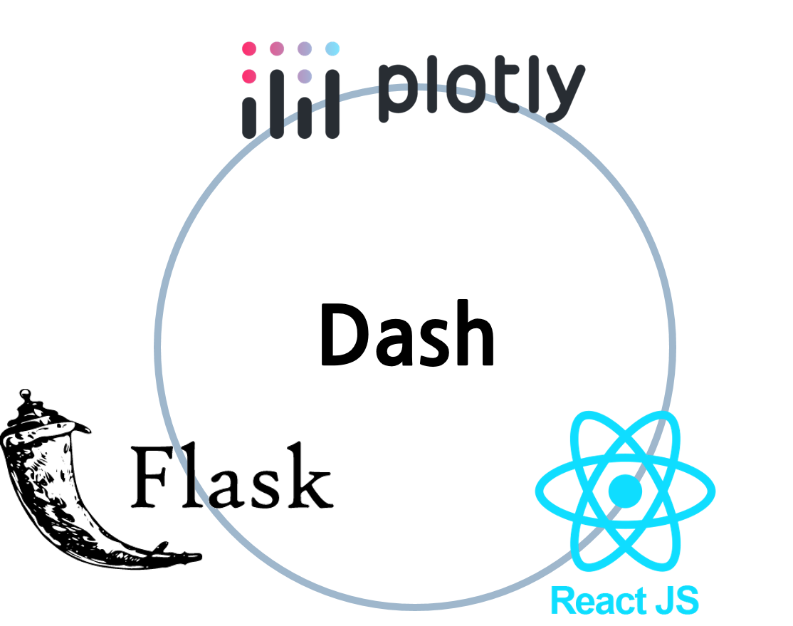

```{r setup, include=FALSE}
knitr::opts_chunk$set(echo = TRUE, message = FALSE, warning = FALSE, fig.width = 6.5, dpi = 130, eval = FALSE)
library(showtext)
showtext_auto()

pacman::p_load("tidyverse", "readxl", "readr", "lubridate", 'plotly')

```

```{r echo = FALSE, message = FALSE, warning = FALSE}
df_covid19 <- read_csv(file = "D:/R/git/datavisualization/plotly/RnPy/owid-covid-data_221203.csv",
                            col_types = cols(Date = col_date(format = "%Y-%m-%d")
                                             )
                            )
df_covid19_100 <- df_covid19 |> 
  filter(iso_code %in% c('KOR', 'OWID_ASI', 'OWID_EUR', 'OWID_OCE', 'OWID_NAM', 'OWID_SAM', 'OWID_AFR')) |>
  filter(date >= max(date) - 100) |>
  mutate(location = case_when(
    location == 'South Korea' ~ '한국', 
    location == 'Asia' ~ '아시아', 
    location == 'Europe' ~ '유럽', 
    location == 'Oceania' ~ '오세아니아', 
    location == 'North America' ~ '북미', 
    location == 'South America' ~ '남미', 
    location == 'Africa' ~ '아프리카')) |>
  mutate(location = fct_relevel(location, '한국', '아시아', '유럽', '북미', '남미', '아프리카', '오세아니아')) |>
  arrange(date)

df_covid19_100_wide <- df_covid19_100 |>
  select(date, location, new_cases, people_fully_vaccinated_per_hundred) |>
  rename('date' = 'date', '확진자' = 'new_cases', '백신접종완료자' = 'people_fully_vaccinated_per_hundred') |>
  pivot_wider(id_cols = date, names_from = location, 
              values_from = c('확진자', '백신접종완료자')) |>
  arrange(date)

df_covid19_stat <- df_covid19 |> 
  group_by(iso_code, continent, location) |>
  summarise(인구수 = max(population, na.rm = T), 
            전체사망자수 = sum(new_deaths, na.rm = T), 
            백신접종자완료자수 = max(people_fully_vaccinated, na.rm = T),
            인구백명당백신접종완료율 = max(people_fully_vaccinated_per_hundred, na.rm = T),
            인구백명당부스터접종자수 = max(total_boosters_per_hundred, na.rm = T)) |> 
    ungroup() |>
    mutate(십만명당사망자수 = round(전체사망자수 / 인구수 *100000, 5),
           백신접종완료율 = 백신접종자완료자수 / 인구수)

margins_R <- list(t = 50, b = 25, l = 25, r = 25)


df_취업률 <- read_excel('d:/R/data/2020년 학과별 고등교육기관 취업통계.xlsx', 
                     ## '학과별' 시트의 데이터를 불러오는데,
                     sheet = '학과별',
                     ## 앞의 13행을 제외하고
                     skip = 13, 
                     ## 첫번째 행은 열 이름으로 설정
                     col_names = TRUE, 
                     ## 열의 타입을 설정, 처음 9개는 문자형으로 다음 79개는 수치형으로 설정
                     col_types = c(rep('text', 9), rep('numeric', 79)))

## df_취업률에서 첫번째부터 9번째까지의 열과 '계'로 끝나는 열을 선택하여 다시 df_취업률에 저장
df_취업률 <- df_취업률 |> 
  select(1:9, ends_with('계'), '입대자')

## df_취업률에서 졸업자가 500명 이하인 학과 2000개 샘플링
df_취업률_500 <- df_취업률 |> 
  filter(졸업자_계 < 500) |>
  mutate(id = row_number()) |>
  filter(row_number() %in% seq(from = 1, to = nrow(df_취업률), by = 4))

## 열 이름을 적절히 설정
names(df_취업률_500)[10:12] <- c('졸업자수', '취업률', '취업자수')

```

```{python echo = FALSE, message = FALSE, warning = FALSE, eval = FALSE}
import pandas as pd
from datetime import datetime, timedelta
from pandas.api.types import CategoricalDtype
from matplotlib import pyplot as plt
import plotly.graph_objects as go

df_covid19 = pd.read_csv("D:/R/git/datavisualization/plotly/RnPy/owid-covid-data_221203.csv")

df_covid19['date'] = pd.to_datetime(df_covid19['date'], format="%Y-%m-%d")

df_covid19_100 = df_covid19[(df_covid19['iso_code'].isin(['KOR', 'OWID_ASI', 'OWID_EUR', 'OWID_OCE', 'OWID_NAM', 'OWID_SAM', 'OWID_AFR'])) & (df_covid19['date'] >= (max(df_covid19['date']) - timedelta(days = 100)))]


df_covid19_100.loc[df_covid19_100['location'] == 'South Korea', "location"] = '한국'
df_covid19_100.loc[df_covid19_100['location'] == 'Asia', "location"] = '아시아'
df_covid19_100.loc[df_covid19_100['location'] == 'Europe', "location"] = '유럽'
df_covid19_100.loc[df_covid19_100['location'] == 'Oceania', "location"] = '오세아니아'
df_covid19_100.loc[df_covid19_100['location'] == 'North America', "location"] = '북미'
df_covid19_100.loc[df_covid19_100['location'] == 'South America', "location"] = '남미'
df_covid19_100.loc[df_covid19_100['location'] == 'Africa', "location"] = '아프리카'

ord = CategoricalDtype(categories = ['한국', '아시아', '유럽', '북미', '남미', '아프리카', '오세아니아'], ordered = True)

df_covid19_100['location'] = df_covid19_100['location'].astype(ord)

df_covid19_100 = df_covid19_100.sort_values(by = 'date')

df_covid19_100_wide = df_covid19_100.loc[:,['date', 'location', 'new_cases', 'people_fully_vaccinated_per_hundred']].rename(columns={'new_cases':'확진자', 'people_fully_vaccinated_per_hundred':'백신접종완료자'})

df_covid19_100_wide = df_covid19_100_wide.pivot(index='date', columns='location', values=['확진자', '백신접종완료자']).sort_values(by = 'date')

df_covid19_100_wide.columns = ['확진자_한국', '확진자_아시아', '확진자_유럽', '확진자_북미', '확진자_남미', '확진자_아프리카','확진자_오세아니아',
                              '백신접종완료자_한국', '백신접종완료자_아시아', '백신접종완료자_유럽', '백신접종완료자_북미', '백신접종완료자_남미', '백신접종완료자_아프리카','백신접종완료자_오세아니아']
                              
df_covid19_stat = df_covid19.groupby(['iso_code', 'continent', 'location'], dropna=False).agg(
    인구수 = ('population', 'max'),
    전체확진자수 = ('new_cases', 'sum'),
    전체사망자수 = ('new_deaths', 'sum'), 
    백신접종자완료자수 = ('people_fully_vaccinated', 'max'),
    인구백명당백신접종완료율 = ('people_fully_vaccinated_per_hundred', 'max'),
    인구백명당부스터접종자수 = ('total_boosters_per_hundred', 'max')
).reset_index()

df_covid19_stat['십만명당사망자수'] = round(df_covid19_stat['전체사망자수'] / df_covid19_stat['인구수'] *100000, 5)

df_covid19_stat['백신접종완료율'] = df_covid19_stat['백신접종자완료자수'] / df_covid19_stat['인구수']

######################################   
## python 코드
## 대학 학과 취업률 데이터 셋

df_취업률 = pd.read_excel("d:/R/data/2020년 학과별 고등교육기관 취업통계.xlsx", 
                           sheet_name = '학과별',
                           skiprows=(13), 
                           header = 0)

df_취업률 = pd.concat([df_취업률.iloc[:, 0:8], 
                    df_취업률.loc[:, df_취업률.columns.str.endswith('계')], 
                    df_취업률.loc[:, '입대자']], 
                   axis = 1
                   )

df_취업률_2000 = df_취업률.loc[(df_취업률['졸업자_계'] < 500)]

df_취업률_2000 = df_취업률_2000.iloc[range(0, len(df_취업률_2000.index) , 4)]

df_취업률_2000 = df_취업률_2000.rename(columns = {'졸업자_계':'졸업자수', '취업률_계':'취업률', '취업자_합계_계':'취업자수'})

margins_P = dict(t = 50, b = 25, l = 25, r = 25)

```

Dash는 반응형 웹 기반 애플리케이션을 만들기 위한 오픈 소스 라이브러리이다. 2015년부터 개발이 시작되었는데 당시에는 Github을 통해 공개 개발 플랫폼으로 개발되다 2017년부터 자체 개발 플랫폼으로 전환되었다. Dash는 Python, R, Julia 및 F#를 지원하는데 전체적으로 매월 800,000회 정도 다운로드되고 있다고 한다.

Dash는 plotly 시각화를 만드는 Plotly.js, 컴포넌트간의 핸들링에는 메타(구 페이스북)에서 개발한 React.js, 앱 어플리케이션 구동 엔진은 flask를 사용하여 작성된 플랫폼으로 데이터 앱을 구축하고 배포하는 데 활용하는 다양한 기능을 제공하는 플랫폼이다.



웹 브라우저에 렌더링되고 사용되기 때문에 OS의 영향을 덜 받고 모바일에서도 사용이 가능한 데이터 전용 앱의 개발에 효과적인 플랫폼이다. Dash는 Tableau나 PowerBI와는 달리 무료 패키지로 사용할 수 있고 R과 python 코딩만으로 javascript를 제어 가능하며, Django와 같은 프레임워크와 비교해서도 매우 적은 코드로 웹 어플리케이션을 만들 수 있다는 장점이 있다.

# Dash 패키지 설치

Dash 프레임워크를 사용하여 데이터 앱을 개발하기 위해서는 먼저 Dash 관련 패키지를 설치하여야 한다. Dash 프레임워크는 `dash` 패키지를 중심으로 'Dash Core Components', 'Dash HTML Components' 세 개의 패키지가 사용된다. 다만 python에서는 'Dash Bootstrap Components'가 추가된다.

> -   Dash : Dash로 대시보드 앱을 개발하기 위한 가장 메인 패키지이다. dash.Dash 객체로 개발되는 앱의 백본 라이브러리이다. 대시보드 앱을 개발하기 위한 사용자 상호작용과 예외처리의 필수적인 함수들을 제공한다.
>
> -   Dash Core Components : dropdown, date picker, slider 등 사용자와의 상호작용에 사용하는 컴포넌트들을 제공하는 라이브러리이다.
>
> -   Dash HTML Components : Dash에서 사용하는 모든 HTML 태그를 지원하는 패키지이다.
>
> -   Dash Bootstrap Components : Dash의 부트스트랩을 지원하는 python 써드파티(Third-Party) 패키지이다. layout과 시각적 시그널에 관련된 다양한 컴포넌트들이 포함되어 있다.

-   R

R에서 Dash 프레임워크를 사용하기 위해서는 `dash` 패키지를 설치하여야 한다. `dash` 패키지는 아직(2023.1월 현재) CRAN(The Comprehensive R Archive Network)에 등록되어 있지 않기 때문에 `remotes` 패키지의 `install_github()`을 사용하여 Github의 패키지를 설치하여야 한다. `dash` 패키지를 설치하면 `dashCoreComponents`, `dashHtmlComponents` 패키지가 같이 설치된다.

```{r}
if (!require('remotes')) {
  install.packages("remotes")
  library(remotes)
}

remotes::install_github("plotly/dashR")

```

-   python

python에서도 Dash 프레임워크를 사용하기 위해서는 `dash` 패키지를 설치하여야 한다. `dash`가 설치되면 `dash_core_components`, `dash_html_components`, `dash_bootstrap_components` 세 개의 패키지가 같이 설치된다.

`dash`는 pip를 사용하여 다음과 같이 설치할 수 있다.

```{python}
pip install dash

```

만약 Jupyter notebook이나 JupyterLab을 사용한다면 jupyter-dash를 설치하는 것이 좋다.

```{python}
pip install jupyter-dash

```

# Dash 앱의 일반적 구조

Dash 앱은 일반적으로 다음의 다섯개의 부분으로 구성되어 있다.

-   패키지 및 라이브러리 로딩 :

+---------------------------+-----------------------------+-------------------------------------+
| app parts                 | R 샘플코드                  | python 샘플코드                     |
+===========================+=============================+=====================================+
| 패키지 및 라이브러리 로딩 | library(dash)               | import dash                         |
|                           |                             |                                     |
|                           | library(dashCoreComponents) | import dash_core_components as dcc  |
|                           |                             |                                     |
|                           | library(dashHtmlComponents) | import dash_html_components as html |
+---------------------------+-----------------------------+-------------------------------------+
| 앱 초기화                 | app \<- dash_app()          | app = Dash(\_\_name\_\_)            |
+---------------------------+-----------------------------+-------------------------------------+
| 앱 레이아웃(layout)       | app \|\> set_layout()       | app.layout = html.Div()             |
+---------------------------+-----------------------------+-------------------------------------+
| 콜백(callback)            | app \|\> add_callback()     | @app.callback()                     |
+---------------------------+-----------------------------+-------------------------------------+
| 앱 실행                   | app \|\> run_app()          | if \_\_name\_\_ == '\_\_main\_\_':  |
|                           |                             |                                     |
|                           |                             | app.run_server()                    |
+---------------------------+-----------------------------+-------------------------------------+

# Dash layout

Dash 앱은 'layout'과 'callback'의 두 부분으로 구성된다. 'layout'은 앱의 전반적인 디자인을 설계하는 부분이고 'callbak'은 앱에서 입력 컨트롤과 출력 컨트롤간의 상호작용을 하는 부분이다.

Dash에서의 'layout'은 HTML을 사용하여 구성된다. Dash 프레임워크에서 제공하는 함수들을 사용하여 다양한 HTML을 구성하는 방식으로 'layout'을 구성한다.
