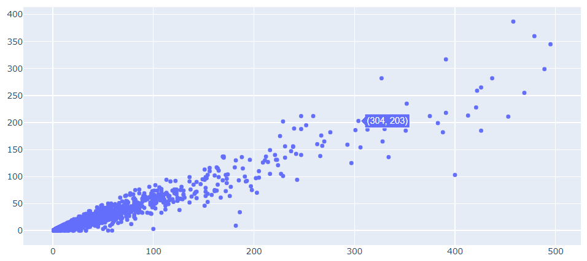

```{r setup, include=FALSE}
knitr::opts_chunk$set(echo = TRUE, message = FALSE, warning = FALSE, fig.width = 6.5, dpi = 130)
library(showtext)
showtext_auto()
library(tidyverse)
library(readxl)
library(patchwork)
library(plotly)
library(reticulate)
```


데이터 분석을 다루는 많은 교육코스나 서적에서 데이터의 시각화는 R의 경우 R base나 `ggplot2` 패키지를 사용하여는 방법, 파이썬의 경우 `matplotlib`이나 `seaborn` 패키지를 사용하는 방법을 위주로 설명한다. 이러한 방법들은 데이터 시각화 방법이 간단하고 그 품질이 좋은 편이기 때문에 많이 사용되고 있지만 정적(Static) 시각화라는 한계를 가진다. 정적 시각화는 대부분 이미지로 저장되며 인포그래픽(Infographic)이라고도 불리며, 일반적으로 문서나 인쇄물에 많이 사용되고 웹에 게시되는 이미지로도 사용된다. 그렇기 때문에 대부분 png, jpg, pdf 등의 벡터 혹은 픽셀 이미지 파일로 제공된다. 정적 데이터 시각화는 데이터 분석가의 의도에 맞춰 작성되기 때문에 데이터 분석가의 데이터 분석 관점에 의존적일 수 밖에 없으며 시각화를 사용하는 사용자의 의도에 따른 해석은 매우 제한될 수 밖에 없다.

이러한 제한점을 극복하기 위해 사용되는 데이터 시각화 방법이 동적(Dynamic) 시각화 혹은 인터랙티브(Interactive) 시각화라고 하는 방법이다. 이 동적 시각화는 시각화를 사용하는 사용자의 의도에 따라 데이터를 다각적 관점에서 살펴볼 수 있다는 점이 특징이다. 사용자의 의도에 따라 데이터가 동적으로 변동되어야 하기 때문에 데이터 시각화가 많이 사용되는 인쇄물 형태 매체에서 사용이 어렵고 웹을 통해 사용되어야 그 장점을 충실히 사용할 수 있다. 따라서 동적 시각화는 웹 사이트에서 제공하는 대시보드(DashBoard)의 형태로 제공되는 것이 일반적이기 때문에 동적 시각화를 위해서는 R이나 파이썬에서 주로 사용되는 시각화 패키지가 아닌 동적 시각화 전용 패키지를 사용해야 한다. R에서는 동적 시각화를 위해 `rbokeh`, `highcharter` 등이 사용되었고 파이썬에서는 `bokeh`, `hvplot` 등을 사용되었다. 하지만 R과 파이썬 모두에서 사용되는 `plotly` 패키지가 등장함으로써 R과 파이썬의 동적 시각화 패키지 시장에서 매우 빠르게 사용자층을 넓혀가고 있다.

하지만 정적 시각화와 동적 시각화의 어느것이 더 효용성이 있는지를 단언할 수 없다. 데이터 시각화가 사용되는 매체, 데이터 시각화를 보는 대상, 데이터 시각화에서 보여주고자 하는 스토리에 따라서 정적 시각화를 사용해야 할 때와 동적 시각화를 사용해야 할 때를 적절히 선택해야 한다.

# plotly란?

'plotly'는 캐나다 몬트리올에 본사를 두고 있는 데이터 시각화 전문 회사의 이름이다. 이 회사는 2012년 처음 설립되었는데 데이터 전문 분석 도구와 데이터 시각화 전문 도구를 개발하여 보급한다. 'plotly'는 이 책에서 설명할 R과 파이썬의 `plotly` 패키지 외에도 R, 파이썬, 줄리아 등의 개발도구에서 사용가능한 데이터 대시보드 플랫폼인 `dash`를 비롯해 `dash` 플랫폼으로 개발된 웹페이지를 배포하기 위한 'Dash Enterprise', `plotly`를 기반으로 온라인 동적 시각화를 만드는 'Chart Studio Cloud' 등의 서비스를 제공하고 있다. 이 중 가장 유명한 제품이 회사의 이름에서도 나타나듯이 `plotly` 시각화 패키지이다.


`plotly` 패키지는 R, 파이썬, Julia, Java Script, F#, MATLAB 등의 다양한 언어에서 사용이 가능하도록 각각의 언어에 바인딩되는 패키지를 개발하여 제공하고 있다. `plotly`에서 제공하는 데이터 시각화는 산점도, 선 그래프와 같은 기본 차트(Basic Chart), 박스 플롯, 히스토그램과 같은 통계 차트(Statistical Chart), 히트맵, 삼각플롯(Ternary Plot)과 같은 과학 차트(Scienctific Chart), 시계열 차트, 캔들 차트와 같은 재정 차트(Finantial Chart) 등의 다양한 차트와 플롯을 제공한다.


다음의 R 그래픽 패키지 다운로드 현황에서 보듯이 여전히 R에서 가장 많이 사용되고 있는 그래픽 패키지는 `ggplot2`이지만 `plotly`는 2021년 하반기부터 다운로드가 늘고 있고 다른 그래픽 패키지에 비해서는 압도적인 다운로드 수를 보인다.

```{r echo = FALSE}
library(dlstats)

#x <- cran_stats(c("ggplot2", "plotly", "rbokeh", "highcharter"))
x1 <- cran_stats(c("ggplot2", "plotly", "rbokeh", "highcharter", 'lattice', 'esquisse', 'leaflet', 'dygraphs', 'ggvis', 'colourpicker', 'patchwork', 'ggforce'))

x1 |> plot_ly() |> #filter(package != 'ggplot2') |> 
  add_lines(x = ~end, y = ~downloads, color = ~package, colors = ~ifelse(package == 'plotly', 'darkblue', 'gray'))

```

`plotly`의 다운로드 수 증가는 파이썬에서도 유사한 흐름을 보인다. 다음의 그림에서도 보이듯이 파이썬에서 많이 사용되는 시각화 패키지 중 가장 다운로드수가 많은 것은 역시나 `matplotlib`이다. 하지만 `matplotlib`을 제외하면 2022년 중순까지만 해도 `seaborn` 패키지의 다운로드 수가 가장 많았으나 이 후 `plotly`가 `seaborn`과 대등하거나 오히려 더 다운로드가 많은 날이 상당히 눈에 띈다. 하지만 파이썬에서 동적 시각화를 지원하는 `bokeh`나 `hvplot`보다는 월등히 많은 다운로드를 보인다. 결국 파이썬에서도 동적 시각화에서는 `plotly`가 가장 많이 사용되는 패키지인 것이다.


# 예제 데이터 Import와 전처리

먼저 `plotly`를 사용하여 시각화를 실습하는데 필요한 데이터 셋 두 가지를 전처리 하겠다.

## Covid19 데이터 셋

첫번째 데이터 셋은 2020년 1월부터 기록된 전세계 국가의 코로나19 발병 관련 데이터이다. 이 데이터는 Github에서 다양한 전세계 데이터를 배포하는 'Open World in Data'에서 제공하는 'COVID-19 Dataset by Our World in Data'를 사용한다.[^1] 이 데이터는 온라인으로 매일 업데이트되기 때문에 다운로드 시점에 따라 시각화 결과가 책과 다소 달라질 수 있다.[^2]

[^1]: <https://github.com/plotly/plotly.js/blob/master/src/plot_api/plot_config.js>

[^2]: 필자의 블로그에 업로드된 데이터를 활용하면 책과 동일한 결과를 얻을 수 있다.

OWID에서 제공하는 데이터를 활용하여 4개의 데이터 셋을 만든다. 첫 번째 데이터 셋은 OWID에서 제공하는 원본 데이터를 가져와서 R에 로딩하는 원본 데이터 셋으로 'df_covid19' 데이터프레임에 저장한다. 'df_covid19' 데이터 프레임은 2020년 1월 1일부터 기록되어 있기 때문에 데이터가 다소 많다. 따라서 이 데이터 중에 최근 100일간의 데이터와 한국과 각 대륙 데이터만을 필터링한 데이터 셋을 두 번째 데이터 셋인 'df_covid19_100' 데이터프레임으로 저장한다. 세 번째 데이터 셋은 100일간의 데이터 셋을 넓은 형태의 데이터 셋으로 변환한 'df_covid19_100_wide'로 저장한 데이터프레임이다. 네 번쨰는 2년 넘게 기록된 Covid19 데이터 셋의 각종 데이터를 국가별 요약 통계치를 산출하여 저장한 'df_covid19_stat' 데이터프레임이다.

-   R

```{r eval = FALSE, class.source="RCode"}
##  R code
## 데이터 전처리를 위한 패키지 설치 및 로딩
if(!require(readr)) {
  install.packages('readr')
  library(readr)
}

if(!require(lubridate)) {
  install.packages('lubridate')
  library(lubridate)
}

if(!require(tidyverse)) {
  install.packages('tidyverse')
  library(tidyverse)
}

## 1. covid19 원본 데이터 셋 로딩
## covid19 데이터 로딩(파일을 다운로드 받은 경우)
# df_covid19 <- read_csv(file = "데이터저장경로/owid-covid-data.csv",
#                             col_types = cols(Date = col_date(format = "%Y-%m-%d")
#                                              )
#                             )
## covid19 데이터 로딩(온라인에서 바로 로딩할 경우)
df_covid19 <- read_csv(file = "https://covid.ourworldindata.org/data/owid-covid-data.csv",
                            col_types = cols(Date = col_date(format = "%Y-%m-%d")
                                             )
                            )
## 2. 전체 데이터셋 중 최근 100일간의 데이터를 필터링한 df_covid19_100 생성
df_covid19_100 <- df_covid19 |> 
  ## 한국 데이터와 각 대륙별 데이터만을 필터링
  filter(iso_code %in% c('KOR', 'OWID_ASI', 'OWID_EUR', 'OWID_OCE', 'OWID_NAM', 'OWID_SAM', 'OWID_AFR')) |>
  ## 읽은 데이터의 마지막 데이터에서 100일전 데이터까지 필터링
  filter(date >= max(date) - 100) |>
  ## 국가명을 한글로 변환
  mutate(location = case_when(
    location == 'South Korea' ~ '한국', 
    location == 'Asia' ~ '아시아', 
    location == 'Europe' ~ '유럽', 
    location == 'Oceania' ~ '오세아니아', 
    location == 'North America' ~ '북미', 
    location == 'South America' ~ '남미', 
    location == 'Africa' ~ '아프리카')) |>
  ## 국가 이름의 순서를 설정 
  mutate(location = fct_relevel(location, '한국', '아시아', '유럽', '북미', '남미', '아프리카', '오세아니아')) |>
  ## 날짜로 정렬
  arrange(date)


## 3. df_covid19_100을 한국과 각 대륙별열로 배치한 넓은 형태의 데이터프레임으로 변환
df_covid19_100_wide <- df_covid19_100 |>
  ## 날짜, 국가명, 확진자와, 백신접종완료자 데이터만 선택
  select(date, location, new_cases, people_fully_vaccinated_per_hundred) |>
  ## 열 이름을 적절히 변경
  rename('date' = 'date', '확진자' = 'new_cases', '백신접종완료자' = 'people_fully_vaccinated_per_hundred') |>
  ## 넓은 형태의 데이터로 변환
  pivot_wider(id_cols = date, names_from = location, 
              values_from = c('확진자', '백신접종완료자')) |>
  ## 날짜로 정렬
  arrange(date)

## 4. covid19 데이터를 국가별로 요약한 df_covid19_stat 생성
df_covid19_stat <- df_covid19 |> 
  group_by(iso_code, continent, location) |>
  summarise(인구수 = max(population, na.rm = T), 
            인당GDP = max(gdp_per_capita, na.rm = T),
            전체확진자수 = sum(new_cases, na.rm = T),
            전체사망자수 = sum(new_deaths, na.rm = T), 
            십만명당중환자실 = last(icu_patients_per_million),
            재생산지수 = last(reproduction_rate),
            봉쇄지수 = max(stringency_index), 
            전체검사자수 = max(total_tests, na.rm = T), 
            신규검사자수 = sum(new_tests, na.rm = T),
            전체백신접종자수 = max(total_vaccinations, na.rm = T),
            백신접종자완료자수 = max(people_fully_vaccinated, na.rm = T),
            부스터접종자수 = max(total_boosters, na.rm = T),
            인구백명당백신접종완료률 = max(people_fully_vaccinated_per_hundred, na.rm = T),
            인구백명당부스터접종자수 = max(total_boosters_per_hundred, na.rm = T)
            ) |> 
    ungroup() |>
    mutate(십만명당사망자수 = round(전체사망자수 / 인구수 *100000, 5),
           백신접종완료률 = 백신접종자완료자수 / 인구수)


```

```{r echo = FALSE}
df_covid19 <- read_csv(file = "https://covid.ourworldindata.org/data/owid-covid-data.csv",
                            col_types = cols(Date = col_date(format = "%Y-%m-%d")
                                             )
                            )
max(df_covid19$date) - 100
df_covid19_100 <- df_covid19 |> 
  filter(iso_code %in% c('KOR', 'OWID_ASI', 'OWID_EUR', 'OWID_OCE', 'OWID_NAM', 'OWID_SAM', 'OWID_AFR')) |>
  filter(date >= max(date) - 100) |>
  mutate(location = case_when(
    location == 'South Korea' ~ '한국', 
    location == 'Asia' ~ '아시아', 
    location == 'Europe' ~ '유럽', 
    location == 'Oceania' ~ '오세아니아', 
    location == 'North America' ~ '북미', 
    location == 'South America' ~ '남미', 
    location == 'Africa' ~ '아프리카')) |>
  mutate(location = fct_relevel(location, '한국', '아시아', '유럽', '북미', '남미', '아프리카', '오세아니아')) |>
  arrange(date)

df_covid19_100_wide <- df_covid19_100 |>
  select(date, location, new_cases, people_fully_vaccinated_per_hundred) |>
  rename('date' = 'date', '확진자' = 'new_cases', '백신접종완료자' = 'people_fully_vaccinated_per_hundred') |>
  pivot_wider(id_cols = date, names_from = location, 
              values_from = c('확진자', '백신접종완료자')) |>
  arrange(date)

df_covid19_stat <- df_covid19 |> 
  group_by(iso_code, continent, location) |>
  summarise(인구수 = max(population, na.rm = T), 
            인당GDP = max(gdp_per_capita, na.rm = T),
            전체확진자수 = sum(new_cases, na.rm = T),
            전체사망자수 = sum(new_deaths, na.rm = T), 
            십만명당중환자실 = last(icu_patients_per_million),
            재생산지수 = last(reproduction_rate),
            봉쇄지수 = max(stringency_index, na.rm = T), 
            전체검사자수 = max(total_tests, na.rm = T), 
            신규검사자수 = sum(new_tests, na.rm = T),
            전체백신접종자수 = max(total_vaccinations, na.rm = T),
            백신접종자완료자수 = max(people_fully_vaccinated, na.rm = T),
            부스터접종자수 = max(total_boosters, na.rm = T),
            인구백명당백신접종완료률 = max(people_fully_vaccinated_per_hundred, na.rm = T),
            인구백명당부스터접종자수 = max(total_boosters_per_hundred, na.rm = T)
            ) |> 
    ungroup() |>
    mutate(십만명당사망자수 = round(전체사망자수 / 인구수 *100000, 5),
           백신접종완료률 = 백신접종자완료자수 / 인구수)

margins <- list(t = 50, b = 25, l = 25, r = 25)

```

-   python

```{python}
import pandas as pd
from datetime import datetime, timedelta
from pandas.api.types import CategoricalDtype
from matplotlib import pyplot as plt
import plotly.graph_objects as go

df_covid19 = pd.read_csv("https://covid.ourworldindata.org/data/owid-covid-data.csv")

df_covid19['date'] = pd.to_datetime(df_covid19['date'], format="%Y-%m-%d")

df_covid19_100 = df_covid19[(df_covid19['iso_code'].isin(['KOR', 'OWID_ASI', 'OWID_EUR', 'OWID_OCE', 'OWID_NAM', 'OWID_SAM', 'OWID_AFR'])) & (df_covid19['date'] >= (max(df_covid19['date']) - timedelta(days = 100)))]


df_covid19_100.loc[df_covid19_100['location'] == 'South Korea', "location"] = '한국'
df_covid19_100.loc[df_covid19_100['location'] == 'Asia', "location"] = '아시아'
df_covid19_100.loc[df_covid19_100['location'] == 'Europe', "location"] = '유럽'
df_covid19_100.loc[df_covid19_100['location'] == 'Oceania', "location"] = '오세아니아'
df_covid19_100.loc[df_covid19_100['location'] == 'North America', "location"] = '북미'
df_covid19_100.loc[df_covid19_100['location'] == 'South America', "location"] = '남미'
df_covid19_100.loc[df_covid19_100['location'] == 'Africa', "location"] = '아프리카'

ord = CategoricalDtype(categories = ['한국', '아시아', '유럽', '북미', '남미', '아프리카', '오세아니아'], ordered = True)

df_covid19_100['location'] = df_covid19_100['location'].astype(ord)

df_covid19_100 = df_covid19_100.sort_values(by = 'date')

df_covid19_100_wide = df_covid19_100.loc[:,['date', 'location', 'new_cases', 'people_fully_vaccinated_per_hundred']].rename(columns={'new_cases':'확진자', 'people_fully_vaccinated_per_hundred':'백신접종완료자'})

df_covid19_100_wide = df_covid19_100_wide.pivot(index='date', columns='location', values=['확진자', '백신접종완료자']).sort_values(by = 'date')

df_covid19_100_wide.columns = ['확진자_한국', '확진자_아시아', '확진자_유럽', '확진자_북미', '확진자_남미', '확진자_아프리카','확진자_오세아니아',
                              '백신접종완료자_한국', '백신접종완료자_아시아', '백신접종완료자_유럽', '백신접종완료자_북미', '백신접종완료자_남미', '백신접종완료자_아프리카','백신접종완료자_오세아니아']
                              
df_covid19_stat = df_covid19.groupby(['iso_code', 'continent', 'location'], dropna=True).agg(
    인구수 = ('population', 'max'),
    인당GDP = ('gdp_per_capita', 'max'), 
    전체확진자수 = ('new_cases', 'sum'),
    전체사망자수 = ('new_deaths', 'sum'), 
    십만명당중환자실 = ('icu_patients_per_million', 'last'),
    재생산지수 = ('reproduction_rate', 'last'),
    봉쇄지수 = ('stringency_index', 'max'), 
    전체검사자수 = ('total_tests', 'max'), 
    신규검사자수 = ('new_tests', 'sum'),
    전체백신접종자수 = ('total_vaccinations', 'max'),
    백신접종자완료자수 = ('people_fully_vaccinated', 'max'),
    부스터접종자수 = ('total_boosters', 'max'),
    인구백명당백신접종완료률 = ('people_fully_vaccinated_per_hundred', 'max'),
    인구백명당부스터접종자수 = ('total_boosters_per_hundred', 'max')
).reset_index()

df_covid19_stat['십만명당사망자수'] = round(df_covid19_stat['전체사망자수'] / df_covid19_stat['인구수'] *100000, 5)

df_covid19_stat['백신접종완료률'] = df_covid19_stat['백신접종자완료자수'] / df_covid19_stat['인구수']
```

## 대학 학과 취업률 데이터 셋

최근 청년층 실업 문제가 사회적 문제로 대두됨에 따라 대학 졸업생의 취업률이 매우 중요하게 활용되고 있는 데이터이다. 이 데이터는 대학 입학을 앞둔 수험생이나 학부모에게 대학 진학을 위한 학과 선택에 중요한 데이터이고 대학 입장에서는 학생들의 진로 지도를 위해 중요하게 사용되는 데이터이다. 이 데이터는 교육통계서비스 홈페이지에서 제공한다.[^3]

[^3]: 해당 데이터는 교육통계 서비스 홈페이지<https://kess.kedi.re.kr/contents/dataset?itemCode=04&menuId=m_02_04_03_02&tabId=m3>에서 다운로드를 받거나 필자의 블로그(2stndard.tistory.com)에서 다운로드 받을 수 있다.

취업률 데이터 셋은 다음과 같이 데이터를 로딩하고 전처리한다.

-   R

```{r message = FALSE, warning = FALSE}
## R 코드

df_취업률 <- read_excel('d:/R/data/2020년 학과별 고등교육기관 취업통계.xlsx', 
                     ## '학과별' 시트의 데이터를 불러오는데,
                     sheet = '학과별',
                     ## 앞의 13행을 제외하고
                     skip = 13, 
                     ## 첫번째 행은 열 이름으로 설정
                     col_names = TRUE, 
                     ## 열의 타입을 설정, 처음 9개는 문자형으로 다음 79개는 수치형으로 설정
                     col_types = c(rep('text', 9), rep('numeric', 79)))

## df_취업률에서 첫번째부터 9번째까지의 열과 '계'로 끝나는 열을 선택하여 다시 df_취업률에 저장
df_취업률 <- df_취업률 |> 
  select(1:9, ends_with('계'), '입대자')

## df_취업률에서 졸업자가 500명 이하인 학과 2000개 샘플링
df_취업률_2000 <- df_취업률 |> 
  filter(졸업자_계 < 500) |>
  mutate(id = row_number()) |>
  filter(row_number() %in% seq(from = 1, to = nrow(df_취업률), by = 4))

## 열 이름을 적절히 설정
names(df_취업률_2000)[10:12] <- c('졸업자수', '취업률', '취업자수')

```

-   python

```{python}
######################################   
## python 코드
## 대학 학과 취업률 데이터 셋

df_취업률 = pd.read_excel("d:/R/data/2020년 학과별 고등교육기관 취업통계.xlsx", 
                           sheet_name = '학과별',
                           skiprows=(13), 
                           header = 0)

df_취업률 = pd.concat([df_취업률.iloc[:, 0:8], 
                    df_취업률.loc[:, df_취업률.columns.str.endswith('계')], 
                    df_취업률.loc[:, '입대자']], 
                   axis = 1
                   )

df_취업률_2000 = df_취업률.loc[(df_취업률['졸업자_계'] < 500)]

df_취업률_2000 = df_취업률_2000.iloc[range(0, len(df_취업률_2000.index) , 4)]

df_취업률_2000 = df_취업률_2000.rename(columns = {'졸업자_계':'졸업자수', '취업률_계':'취업률', '취업자_합계_계':'취업자수'})

```

# plotly의 구조

`plotly` 객체는 plotly.js에서 정의된 JSON 스키마로 저장된다. 이 스키마는 트리 형태로 구성되어 있는데 각 노드는 속성(attribute)로 불리는 값을 가지게 되고 이들 속성들이 모여서 전체 그림(Figure)를 구성한다.

`plotly` 객체 트리의 루트 노드에 바로 아래인 최고 레벨 속성은 'data', 'layout', 'frame'의 세 가지 속성이다. 이 세 가지 속성의 세부 속성들이 설정되어 시각화를 구성하는데 이들 속성들은 부모 속성과 자식 속성으로 구성되는 트리 형태의 JSON 구조로 구성된다. 이 구성은 R과 python이 동일하지만 그 구성 방법은 다소 다르다.

-   R

R에서는 `plotly` 구조를 구성하기 위해서 먼저 `plot_ly()`를 사용하여 `plotly` 객체를 초기화하여야 한다. 이후 세 가지 방법을 사용할 수 있다.  

첫 번째 방법은 `add_*()`와 `layout()`을 사용하는 방법이다. 이 두가지 함수를 사용하기 위해서는 먼저 먼저 `plot_ly()`로  이 초기화된 `plotly` 개체에 `add_trace()`를 사용하여 'data'의 하위 속성들을 구성하고 `layout()`을 사용하여 'layout'의 하위 속성들을 구성한다. 

두 번째 방법은 이 함수들을 사용하지 않고 `plot_ly()`에 직접 'data'와 'layout' 속성들을 설정할 수 있다. 이 방법은 `plolty` 구조를 하나 하나 설정해야하기 때문에 구현하는데 어려움이 있다. 

세 번째 방법은 `add_trace()` 대신 트레이스 종류에 따라 제공되는 `add_*()`(`add_markers()`, `add_lines()`, `add_bars()` 등)을 사용하여 'data' 속성들을 구성하고 `layout()`을 사용하여 'layout' 속성들을 설정한다.  

이러한 방법으로 속성과 속성값을 설정할 때는 속성 이름에 '='을 사용해 속성값을 할당한다. 하지만 속성에 하위 속성이 존재한다면 이 하위 속성들은 R의 list 데이터 구조로 구성하여 할당하여야 한다. 예를 들어 `layout(title = list(text = '타이틀 제목'))`이라는 코드는 'layout' 속성에 하위 속성인 'title' 속성, 이 'title' 속성의 하위 속성인 'text' 속성값을 '타이틀 제목'으로 설정하는 코드이다.

이렇게 구성된 `plotly`객체는 앞서 설명한 바와 같이 JSON의 트리 형태로 구조화되어 있다. 따라서 `plotly` 객체의 속성과 속성값은 바로 접근할 수 있다. 이 값들에 접근하기 위해서는 '.'을 사용해 속성값의 구조적  경로(Path)를 통해 접근할 수 있다. 앞서 예를 들었던 `layout(title = list(text = '타이틀 제목'))`에 바로 접근하려면 `layout.title.text`를 사용하여 접근할 수 있다. 이 방법을 사용하여 `plotly` 객체의 속성값을 추출하거나 해당 속성값을 바로 바꾸어 줄 수 있다. 

-   python

python에서 `plolty`를 설명하기 위해서는 먼저 `plotly`에서 제공하는 라이브러리의 종류를 먼저 이해하여야 한다. `plotly`에서는 python을 위한 라이브러리로 `plotly.graph_objects`와 `plotly.express`의 두 가지 모듈 라이브러리를 제공한다. 기본적으로는 `plotly.graph_objects` 모듈이 `plotly`에서 제공하는 모든 기능을 사용하는 정규 방법이다. 하지만 `plotly.graph_objects`에서 제공하는 수많은 속성중에 자주 사용되는 속성과 이들 속성을 설정하는 다소 쉬운 인터페이스로 설계한 함수들로 구성한 `plotly.express` 모듈도 있다. 

`plotly.express`에서 제공하는 함수들은 `plotly.graphic_object`보다 직관적이고 사용하기 쉽다. `plotly`는 'data' 속성과 'layout' 속성을 루트 노드로하는 속성들의 트리 구조로 구현된다고 앞에서 언급하였다. 각각의 속성들은 세부 속성을 가지는 속성도 있지만 세부 속성없이 바로 속성값을 할당하는 속성도 있기 때문에 이들 구조를 파악하는 것이 매우 중요하지만 매우 어렵다. 하지만 `plotly.express`에서 제공하는 함수들은 이 속성들을 트리 형태로 구성하지 않고 모두 리프 노드의 형태로 설정하는 방법을 사용하기 때문에 함수에 매개변수를 설정하는 방법처럼 바로 속성값을 설정한다. 따라서 일반적 함수의 사용과 비슷하기 때문에 사용하기 쉽다는 장점이 있다. 또 `plotly.graph_objects`의 함수들보다 코드의 길이가 매우 짧아진다는 장점도 있다. 하지만 `plotly.express`는 결정적인 몇가지 단점이 있다. 첫 번째 단점은 'mesh'나 'isosurface'와 같은 3차원 시각화는 아직 `plotly.express`는 지원하지 않는다. 두 번째는 여러개의 trace를 가지는 서브플롯, 다중 축의 사용, 여러개의 trace를 가지는 패싯(facet)과 같은 시각화는 `plotly.express`로 생성하는데 다소 어려움이 있다. 따라서 `plotly.express`로는 다소 복잡한 `plotly` 객체를 생성하는데에는 한계가 있어 `plotly.graphic_object`의 함수들을 사용하여 보완해주어야 한다. 또 `plotly.graphic_object`에서 제공하는 함수와 `plotly.express`에서 제공하는 함수의 속성도 다소 차이가 있기 때문에 `plotly.express`는 사용이 간편하긴 하지만 사용할 때는 사용법을 잘 확인하고 사용해야 한다.[^1] 

[^1]: 본 책에서는 `plotly.graph_objects`위주로 설명한다. `plotly.express`의 사용법은 <https://plotly.com/python-api-reference/> 을 참조하라.

`plotly.graph_objects` 모듈이든 `plotly.express` 모듈이든 `plolty` 객체를 만들기 위해서는 먼저 `plotly`객체를 초기화해야 한다. 이를 위해서는 `plotly.graph_objects`의 `Figure()`를 사용하여 초기화된 `plotly` 객체를 생성한다. 

이 후 초기화된 `plotly` 객체에 'data', 'layout' 속성을 할당하기 위해 `plotly.graph_objects.add_trace()`와 `plotly.graph_objects.update_layout()`을 사용한다. 

'data'와 'layout'의 하위 속성값을 설정하기 위해서는 python의 딕셔너리 데이터 구조를 사용해 구성한다. 딕셔너리는 `{}`를 사용할 수도 있고 `dict()`를 사용할 수도 있다. `{}`를 사용하면 속성명과 속성값을 `:`을 사용하여 할당하고 `dict()`를 사용하면 속성명과 속성값은 `=`을 사용하여 설정해 준다.


## plotly 초기화

`plotly`를 사용하기 위해서는 가장 먼저 해야하는 것이 `plotly` 객체의 초기화이다. 이는 R과 python에서 모두 수행해야 하는 과정이다. `plotly`객체를 초기화하면 plotly.js에서 사용될 수 있는 JSON 형태의 객체가 생성된다. 이 객체에 다양한 시각화 속성들을 추가함으로써 전체 시각화를 완성한다.

-   R

R에서 `plotly`를 초기화하기 위해 `plot_ly()`를 사용한다. `plot_ly()`는 특별한 매개변수 없이 사용이 가능하지만 일반적으로 사용할 데이터프레임을 바인딩하는 경우가 많다. `tidyverse`에서 제공하는 `%>%`나 R base에서 제공하는 `|>`를 사용하여 `plot_ly()`에 사용할 데이터프레임을 설정하거나 `plot_ly()`의 매개변수로 데이터프레임을 전달하면 초기화된 `plotly` 객체가 생성된다. 

```{r fig.cap = 'R의 plot_ly()를 사용한 plotly 초기화'}
## R에서 plotly 객체 초기화
## plot_ly(df_covid19_100)와 동일
df_covid19_100 |> 
  plot_ly()

```

-   python

python에서 `plotly`를 초기화하기 위해서는  `plotly.graph_objects.Figure()`를 사용한다. 앞서 R에서는 `plotly`를 초기화할때 사용하는 데이터프레임을 바인딩했지만 python에서는 초기화때 데이터프레임을 바인딩하지 않는다. 하지만 `plotly.express` 모듈 함수에는 첫 번쨰 매개변수로 해당 함수에서 사용하는 데이터프레임을 첫번째 매개변수로 사용하여 해당 `plotly` 객체에 사용할 데이터를 바인딩해줄수 있다. 

```{python eval = FALSE}
## python에서 plotly 객체 초기화
import plotly.graph_objects as go

go.Figure()

```


## 'data' 속성

초기화된 `plotly` 구조에서 사용하는 첫 번째 레벨 속성인 'data' 속성은 시각화를 통해 표현해야할 데이터와 그 표현 방식을 설정하는 속성이다. 'data' 속성은 데이터를 표현하는 트레이스로 구성된다. 트레이스는 `plotly`로 시각화할 수 있는 그래픽적 데이터 표현 방법을 지칭한다. `plotly`에서는 'scatter', 'pie', 'bar' 등의 40개가 넘는 트레이스를 제공한다.

40여가지 트레이스 중에 사용하고자 하는 트레이스를 설정하기 위해서는 R과 python 모두 `add_trace()`를 사용하여 트레이스를 계속 추가할 수 있는데, `add_trace()`를 사용하기 위해서는 반드시 'type' 속성으로 트레이스 종류를 설정해야 한다. 하지만 'type'을 설정하지 않더라도 X축과 Y축에 바인딩된 변수들을 계산하여 자동적으로 설정하기도 하고, 각각의 트레이스에 특화된 개별 함수를 사용한다면(예를 들어 R의 `add_lines()`나 python의 `plotly.express.line()` 등) 'type' 속성을 사용할 필요는 없다.

-   R

R에서 'data' 속성은 `plot_ly()`나 `add_trace()`를 사용한다. `plot_ly()`와 `add_trace()`모두 매개 변수로 'data'의 하위 속성들을 설정하여 'data' 속성 트리를 구성한다. 'data' 속성의 첫 번째 레벨 속성들은 바로 '='을 사용하여 속성값을 할당하지만 해당 속성이 하위 속성으로 구성되는 경우 R의 기본 데이터 타입인 'list'를 사용하여 묶어서 설정한다. 예를 들어 'data' 속성의 첫 번째 레벨 속성인 'type' 속성은 하위 속성이 없는 속성이기 때문에 '='을 사용하여 바로 속성값을 할당한다. 하지만 'type'과 마찬가지로 'data' 속성의 첫 번째 레벨 속성인 'marker' 속성은 하위 속성들로 구성된 컨테이너 역할을 하는 속성이기 때문에 `list`를 사용하여 하위 속성들의 값을 묶어 설정하여야 한다. 다음의 코드는 `plot_ly()`를 사용하여 'data' 속성의 하위 속성인 'type'를 'scatter'으로 설정하여 스캐터 트레이스로 설정하고, 스캐터 트레이스의 'mode'를 'markers+lines'로 설정하여 산점도와 선그래프, 'marker'(점) 속성을 list로 묶어 그 하위속성인 'color' 속성을 설정하고 'line'(선) 속성을 또 list로 묶어 'color'와 'dash' 속성을 설정한 시각화를 보이고 있다.

```{r fig.cap = 'R의 plot_ly를 사용한 plotly 시각화'}
## 긴 형태의 100일 코로나19 데이터에서
df_covid19_100 |> 
  ## 한국 데이터만을 필터링 
  filter(iso_code == 'KOR') |>
  ## X축에 data, Y축에 new_cases를 매핑하여 plot_ly()로 시각화 생성
  plot_ly(type = 'scatter', x = ~date, y = ~new_cases, 
          mode = 'markers+lines', 
          marker = list(color = '#264E86'), 
          line = list(color = '#5E88FC', 
                      dash = 'dash'
                      )
          )

```

앞 코드의 `plotly` 'data' 속성의 구조적 속성 트리는 다음의 그림과 같다. 


-   python

python에서도 'data' 속성 설정을 위해 `plotly` 초기화 함수인 `plotly.graph_objects.Figure()`와 `add_trace()`를 사용할 수 있다. 앞의 R과 같은 시각화를 만드는 코드는 다음과 같다. 먼저 `plotly.graph_objects` 라이브러리를 'go'로 임포트하고 `go.Figure()`에 직접 'data' 속성을 설정하였다. 'data' 속성임을 'data' 키워드로 명기해주고 'data'의 세부 속성값들을 리스트(`[]`)로 묶어 주었다. 이후 첫 번째 트레이스의 속성값들을 딕셔너리로 묶어 속성과 속성값을 ':'로 매칭하여 설정하였다. 만약 속성이 하위 속성으로 이루어진 속성이라면 다시 하위 속성값들을 딕셔너리로 묶어 설정한다. 여기서는 'data' 속성에 설정된 트레이스가 두 개이기 때문에 리스트(`[]`)로 묶었지만 트레이스가 하나라면 리스트로 묶어주지 않아도 무방하다. 하지만 두 개 이상의 트레이스를 설정해야한다면 반드시 트레이스의 리스트로 설정해주어야 한다. 다음의 코드는 위의 R로 만든 시각화와 동일한 시각화를 만든다. 하지만 앞서에서는 'scatter' 트레이스의 'markers+lines'로 'mode'를 설정해서 하나의 트레이스로 설정했지만 다음의 코드에서는 'markers' 스캐터 트레이스와 'lines' 스캐터 트레이스의 두 개의 트레이스로 구성하였다. 

```{python}
go.Figure(
    data = [{
        'type' : 'scatter',
        'mode' : 'markers',
        'x' : df_covid19_100.loc[df_covid19_100['iso_code'] == 'KOR', 'date'],
        'y' : df_covid19_100.loc[df_covid19_100['iso_code'] == 'KOR', 'new_cases'], 
        'marker' : {
            'color' : '#264E86'}
        }, 
        {
        'type' : 'scatter',
        'mode' : 'lines',
        'x' : df_covid19_100.loc[df_covid19_100['iso_code'] == 'KOR', 'date'],
        'y' : df_covid19_100.loc[df_covid19_100['iso_code'] == 'KOR', 'new_cases'], 
        'line' : {
            'color' : '#5E88FC',
            'dash' : 'dash'}
        }
    ]
    )

```


앞 코드의 `plotly` 'data' 속성의 구조적 속성 트리는 다음의 그림과 같다. 


## 'layout' 속성

'layout' 속성은 데이터를 표현하는 트레이스와 관련되지 않는 시각화의 나머지 속성들을 정의하는 설정들의 최상위 속성이다. 'layout' 에서 설정할 수 있는 속성은 시각화의 차원 축(2차원, 3차원), 여백, 제목, 축, 범례, 컬러바(색 범례), 주석 등이다. 'layout' 속성들도 하위 속성들로 구성되어 있고 이들 하위 속성들은 리프 노드로 구성된 속성도 있지만 다시 하위 속성으로 구성된 속성도 있다. 

-   R

R에서 'layout' 속성을 설정하기 위해서는 `layout()`을 사용한다. 다만 `layout()`을 사용하기 위해서는 최소한 하나 이상의 트레이스가 설정되어야 한다. 다음의 코드는 앞서 그린 시각화에 'layout' 속성인 'title' 속성으로 시각화 제목, 'xaxis' 속성으로 X축 설정, 'yaxis' 속성으로 Y축 설정, 'margin' 속성으로 여백 설정을 하고 있다. 이 중 'xaxis'와 'yaxis'속성은 각각의 하위 속성이 있기 때문에 다시 list로 묶어서 설정하였다.

```{r fig.cap='R의 layout 속성을 사용한 plotly 시각화'}
margins_R <- list(t = 50, b = 25, l = 25, r = 25)

## 긴 형태의 100일 코로나19 데이터에서
df_covid19_100 |> 
  ## 한국 데이터만을 필터링 
  filter(iso_code == 'KOR') |>
  ## X축에 data, Y축에 new_cases를 매핑하여 plot_ly()로 시각화 생성
  plot_ly(type = 'scatter', x = ~date, y = ~new_cases, 
          mode = 'markers+lines', 
          marker = list(color = '#264E86'), 
          line = list(color = '#5E88FC', 
                      dash = 'dash'
                      )
          ) |>
  layout(
    title = "코로나 19 발생 현황",
    xaxis = list(
      title = "날짜",
      showgrid = F),
    yaxis = list(title = "확진자수"), 
    margin = margins_R
    )

```

-   python

python에서 'layout' 속성의 설정은 'data' 속성과 같이 `Figure()`에서 설정이 가능하다. 'data' 속성의 설정이 끝나면 'layout' 속성들로 구성된 딕셔너리를 'layout' 키워드를 사용하여 설정한다. 다음의 코드는 앞서 그린 시각화에 'layout' 속성인 'title' 속성으로 시각화 제목, 'xaxis' 속성을 'title', 'showgrid' 속성의 딕셔너리로 설정하였고, 'yaxis' 속성을 'title' 속성의 딕셔너리로 설정하였다. 또 'margin' 속성으로 미리 설정된 딕셔너리로 설정하였다. 

```{python eval = FALSE}
margins_python = {'t' : 50, 'b' : 25, 'l' : 25, 'r' : 25}

fig = go.Figure(
    data = {
        'type' : 'scatter',
        'mode' : 'markers+lines',
        'x' : df_covid19_100.loc[df_covid19_100['iso_code'] == 'KOR', 'date'],
        'y' : df_covid19_100.loc[df_covid19_100['iso_code'] == 'KOR', 'new_cases'], 
        'marker' : {
            'color' : '#264E86'
        }, 
        'line' : {
            'color' : '#5E88FC',
            'dash' : 'dash'
        }
      }, 
    layout = {
      'title' : "코로나 19 발생 현황",
      'xaxis' : {
        'title' : "날짜",
        'showgrid' : False},
      'yaxis' : {'title' : "확진자수"}, 
      'margin' : margins_python
      }
)

fig.show()
```


## 'frame' 속성

'frame' 속성은 `plotly`의 애니메이션 기능과 관련된 속성 값을 설정하는 노드이다. 이 책에서는 다루지 않겠다.

## 'plotly' 구조 확인

앞서 언급했다시피 `plotly`는 JSON 형태의 데이터 타입으로 구성된다. 따라서 `plotly`로 만들어진 데이터는 그래프의 형태로 시각화 할수도 있지만 `plotly` 데이터의 구조를 직접 볼 수도 있다. 이 구조를 확인하면 `plotly`의 속성 설정을 이해하는데 도움을 받을 수 있다.

-   R

R에서 `plotly`의 구조를 확인하기 위해서는 `plotly_json()`을 사용한다.

```{r}
df_covid19_100 |> 
  ## 한국 데이터만을 필터링 
  filter(iso_code == 'KOR') |>
  ## X축에 data, Y축에 new_cases를 매핑하여 plot_ly()로 시각화 생성
  plot_ly(type = 'scatter', x = ~date, y = ~new_cases, 
          mode = 'markers+lines', 
          marker = list(color = '#264E86'), 
          line = list(color = '#5E88FC', 
                      dash = 'dash'
                      )
          ) |>
  plotly_json()

```

-   python

python에서는 `print()`를 사용하여 데이터 구조를 확인할 수 있다.

```{python}
import plotly.graph_objects as go

fig = go.Figure(
    data = [
      {
        'type' : 'scatter',
        'mode' : 'markers+lines',
        'x' : df_covid19_100.loc[df_covid19_100['iso_code'] == 'KOR', 'date'],
        'y' : df_covid19_100.loc[df_covid19_100['iso_code'] == 'KOR', 'new_cases'], 
        'marker' : {
            'color' : '#264E86'
        }, 
        'line' : {
            'color' : '#5E88FC',
            'dash' : 'dash'
        }
      }
    ]
)

print(fig)

```

# plotly 생성

앞에서 `plotly` 객체의 구조에 대해 살펴보았다. `plotly` 객체는 plolty.js가 시각화해주는 JSON 형태의 데이터 구조체일 뿐이다. 따라서 `plotly`를 사용하여 시각화 한다는 것은 'data', 'layout', 'frame' 속성 값들을 설정하여 JSON 구조를 만드는 것이다.

## data : 트레이스의 생성

`plotly` 객체의 구조에서 시각화해야하는 데이터를 정의하는 속성은 'data' 속성이다. 데이터를 시각화히기 위해 점이든 막대이든 원이든 특정한 도형으로 표현하여야 하는데 이렇게 데이터를 도형으로 표현하는 각각의 레이어를 트레이스라고 하는 것이다. 따라서 'data' 속성은 트레이스로 표현된다. 

`plotly`를 시작하기 위해 먼저 `plolty`를 초기화하고 나면 이 후 R의 `plot_ly()`나 python의 `Figure()`에서 'data' 속성의 하위 속성을 설정하여 `plotly` 객체를 만들 수 있다. 하지만 이 방법을 사용하면 코드의 길이가 길어지고 리스트와 딕셔너리 등 `plotly` 구조에 맞게 괄호들을 설정해야 하기 때문에 매우 복잡해진다.

따라서 이 방법 보다는 `add_trace()`를 사용하여 초기화된 `plotly` 객체에 트레이스를 추가하는 방법이 많이 사용된다.

-   R

R에서 트레이스를 설정하기 위해서는 먼저 `plot_ly()`로 초기화 된 `plotly`객체에 `add_trace()`를 사용하거나 `add_markers()`, `add_bars()`와 같은 트레이스에 특화된에 함수를 사용하여 트레이스를 추가한다. 특화된 함수를 사용할 때는 해당 함수명에 이미 트레이스의 종류가 설정되어 있기 때문에 바로 트레이스와 관련된 속성들을 설정한다. 하지만 `add_trace()`의 경우는 모든 트레이스의 추가에 사용되는 함수이기 때문에 먼저 어떤 형태의 트레이스인지 설정해야 한다.  `add_trace()`에서 설정하는 트레이스 속성 중 'data' 속성의 첫 번째 레벨의 속성은 매개변수처럼 `=`을 사용하여 속성명에 속성값을 설정한다. 만약 이 첫 번쨰 레벨의 속성이 하위 속성들로 구성되어야 한다면 `list()`를 사용하여 리스트 데이터 타입으로 하위 속성들을 설정한다.

`add_trace()`이든 각각의 트레이스에 특화된 `add_*()`이든 하나 주의해아할 점은 `plot_ly()`의 초기화때 바인딩된 데이터프레임의 열을 속성값으로 할당한다면 반드시 열 이름 앞에 '~'를 붙여줘야 한다는 것이다. 만약 `c()`를 사용하여 직접 벡터형 변수를 할당한다면 '~'없이 할당할 수 있다. 

```{r}
df_취업률_2000 |> 
  filter(졸업자수 < 500) |> 
  plot_ly() |>
  add_trace(type = 'scatter', mode = 'markers', 
            x = ~졸업자수, y = ~취업자수, 
            marker = list(size = 3, color = 'darkblue'))

```

-   python

python에서 트레이스를 설정하기 위해서는 먼저 `plotly.graph_objects`를 사용할 것인지, `plotly.express`를 사용할 것인지를 결정해야한다. 여기서는 `plotly.graph_objects`를 사용해서 `plotly`를 그리는 두 가지 방법을 설명한다.

`plotly.graph_objects`를 사용하여 `plotly`를 그리는 첫 번째 방법은 `add_trace()`애 'data'의 하위 속성들을 딕셔너리로 구성하여 설정하는 방법이다. `go.Figure()`에서는 'data' 속성과 'layout' 속성을 모두 설정할 수 있기 때문에 'data' 키워드를 사용하여 'data' 속성값을 구분해줬지만 `add_trace()`에서는 'layout' 속성을 설정하지 않기 때문에 'data' 키워드를 사용하지 않는다. 

```{python evel = FALSE}
fig = go.Figure()

fig.add_trace({
    'type' : 'scatter',
        'mode' : 'markers',
        'x' : df_취업률_2000['졸업자수'],
        'y' : df_취업률_2000['취업자수'], 
        'marker' : {
            'color' : 'darkblue'
        }
})

```


두 번째 방법은 `add_trace()`의 매개변수로 `plotly.graph_objects`에서 제공하는 각각의 트레이스 함수를 사용하는 것이다. `plotly.graph_objects`에서 제공하는 각각의 트레이스 함수는 약 90여개이다. 이들을 다 외울 수는 없으니 plotly 홈페이지에서 확인하여 사용하여야 한다. 하지만 이 트레이스 함수를 사용하는 것도 두 가지 방법이 있다. 

첫 번쨰 방법은 딕셔너리를 구성할 때 `{}`를 사용하는 방법이다. 이 때는 속성명에 반드시 `''`나 `""`로 묶어주어야 하고 속성명과 속성값을 할당할떄는 `:`을 사용하여 할당한다.

```{python eval = FALSE}
fig = go.Figure()

fig.add_trace(go.Scatter({
    'type' : 'scatter',
    'mode' : 'markers',
    'x' : df_취업률_2000['졸업자수'],
    'y' : df_취업률_2000['취업자수'],
    'marker' : {'color' : 'darkblue'}}
))

```

두 번째 방법은 `dict()`를 사용하여 딕셔너리를 구성하는데 이 방법을 사용할 때는 속성명에 따옴표 없이 사용하고 할당 기호로 `=`을 사용한다.

```{python eval = FALSE}
fig = go.Figure()

fig.add_trace(go.Scatter(
    type = 'scatter',
    mode = 'markers',
    x = df_취업률_2000['졸업자수'],
    y = df_취업률_2000['취업자수'],
    marker = dict(color = 'darkblue')
))

```

## 트레이스 공통 속성

앞서 설명한 바와 같이 `plotly`에서는 40여 개가 넘는 트레이스를 제공한다. 그 트레이스마다 사용되는 속성들이 다르지만 공통적으로 사용되는 속성들이 있다. 각각의 트레이스에서 공통적으로 사용되는 대표적인 속성들은 다음과 같다.

### type

트레이스 설정에 가장 중요한 속성이 'type' 속성이다. 'type' 속성은 데이터를 표현할 트레이스의 종류를 설정하기 때문에 시각화의 가장 중요한 형태를 결정하는 속성이다. `plotly`에서 지원하는 주요 'trace'는 다음과 같다.

::: {custom-style="comment"}
-   산점도 타입 : 'scatter', 'scattergl'\
-   막대 타입 : 'bar', 'funnel', 'waterfall'\
-   집계된 bar 타입 : 'histogram'\
-   1차원 분포 타입 : 'box', 'violin'\
-   2차원 밀도 분포 타입 : 'histogram2d', 'histogram2dcontour'\
-   매트릭스 타입 : 'image', 'heatmap', 'contour'\
-   주가 타입 : 'olhc', 'candlestick'\
:::

### mode

'mode'는 'type'이 'scatter'인 스캐터 타입의 트레이스에서 사용하는 속성이다. 스캐터 타입의 트레이스는 점, 선, 문자를 사용하여 데이터를 표현한다. 따라서 스캐터 차트를 그릴때는 세 가지 타입의 스캐터 타입중 어떤 것을 사용할지를 설정해야하는데, 이것을 설정하는 속성이 'mode'이다. 'mode'는 다음의 네 가지가 있는데 이 'mode'들은'+' 기호를 사용하여 여러개의 'mode'를 동시에 사용할 수 있다.

| mode    | 설명                             |
|---------|----------------------------------|
| markers | 데이터를 점으로 표시             |
| lines   | 데이터를 서로 이어주는 선을 표시 |
| text    | 데이터를 문자열로 표시           |
| none    | 데이터를 표시하지 않음           |

### x, y

트레이스 중에서 2차원 데카르트 좌표를 사용하는 트레이스가 X, Y축에 데이터를 매핑하는 속성이 `x`, `y`이다. 데카르트 좌표계를 사용하는 트레이스에서 가장 기본적으로 사용되는 속성이며 하위 속성은 없다.

-   R

R에서는 'x', 'y'에 변수를 할당 가능한 변수는 데이터프레임 열, 리스트, 벡터 등이다. 할당할 때 주의 해아할 것은 `plot_ly()` 초기화시 바인딩된 데이터프레임의 열을 사용한다면 반드시 `~`를 열 이름 앞에 붙여줘야 한다.

```{r fig.cap='plotly 기본 산점도 생성'}
## df_취업률_2000에서 
df_취업률_2000 |> 
  ## X축은 졸업자수, Y축은 취업자수로 매핑한 plotly 객체 생성
  plot_ly() |>
  add_trace(type = 'scatter', mode = 'markers', 
            x = ~졸업자수, y = ~취업자수)

```

-   python

python에서는 'x', 'y' 속성에 리스트(list), 넘파이 배열(numpy array), 수치형 판다스 시리즈(pandas series), 수치형 시리즈(series), 문자열(strings) 날짜와 시간형(datetimes) 등을 설정할 수 있다. `go.Figure()`의 초기화에는 R과 같이 데이터프레임을 바인딩하지 않기 때문에 'x', 'y'에 데이터프레임 열을 설정할 때는 데이터프레임 열을 인덱싱하여 사용하여야 한다.

```{python eval = FALSE}
fig = go.Figure()

fig.add_trace(
    {'type' : 'scatter',
     'mode' : 'markers',
     'x': df_취업률_2000['졸업자수'],
     'y': df_취업률_2000['취업자수']
        }
)
fig.show()

```



### name

'name'은 `plotly`에서 사용되는 각각의 트레이스의 이름을 설정하는 속성이다. 'name'은 범례와 호버에 해당 데이터를 인식하기 위해 사용된다.

-   R

R에서는 'name' 속성에 단일 문자열을 할당할 수도 있고, 'x', 'y'과 같이 `plotly` 초기화 시에 바인딩된 데이터 프레임의 문자형 열, 문자형 리스트, 문자형 벡터를 사용할 수도 있다. 다만 데이터프레임 열, 리스트, 벡터를 사용한다면 `plotly`포 표시되는 데이터에 1:1 매핑되어야 한다. 이렇게 설정된 'name' 속성은 범례와 마두스 포인터에 반응하는 호버에 표시된다. 

```{r eval = FALSE}
df_취업률_2000 |>
  ## X축은 졸업자수, Y축은 취업자수, name은 대계열로 매핑한 plotly 객체 생성
  plot_ly() |>
  add_trace(type = 'scatter', mode = 'markers', 
            x = ~졸업자수, y = ~취업자수, name = ~대계열)

```

```{r echo = FALSE, fig.cap = 'trace 이름 매핑'}
df_취업률_2000 |>
  ## X축은 졸업자수, Y축은 취업자수, name은 대계열로 매핑한 plotly 객체 생성
  plot_ly(x = ~졸업자수, y = ~취업자수, name = ~대계열, color = ~대계열, colors = 'Blues')

```

-   python

python에서 'name' 속성을 사용하는데는 R보다는 다소 번거롭다. python에서 'name'에 설정이 가능한 데이터 타입은 단일 문자열(string)만을 설정할 수 있다. 따라서 'name'을 각각 설정하기 위해서는 트레이스를 여러개로 나누어서 추가해야 한다. 만약 데이터가 넓은 형태로 구성되어 있다면 각각의 열별로 `add_trace()`를 사용하여 트레이스를 추가하는 방식으로 사용할 수 있다. 만약 데이터가 긴 형태로 구성되어 있다면 `groupby()`를 사용하여 데이터를 그룹화하고, 그룹화된 세부 그룹 데이터프레임을 `for` 루프를 사용하여 트레이스를 추가해주는 방식으로 사용할 수 있다.  하지만 `plotly.express`에서 제공하는 함수들은 R과 같이 'name'에 데이터프레임 열을 설정할 수 있어 다소 간단히 그릴 수 있다. 

```{python eval = FALSE}
fig = go.Figure()

for 대계열, group in df_취업률_2000.groupby('대계열'):
    fig.add_trace({
      'type' : 'scatter',
      'mode' : 'markers',
      'x': group['졸업자수'],
      'y': group['취업자수'], 
      'name' : 대계열
      })
fig.show()

```

```{python eval = FALSE, echo = FALSE}
fig = go.Figure()

for 대계열, group in df_취업률_2000.groupby('대계열'):
    fig.add_trace({
      'type' : 'scatter',
      'mode' : 'markers',
      'x': group['졸업자수'],
      'y': group['취업자수'], 
      'name' : 대계열
      })
fig.update_layout(colorway = ("#EFF3FF", "#C6DBEF", "#9ECAE1", "#6BAED6", "#4292C6", "#2171B5", "#084594"))
fig.show()

```


### 데이터 값의 표시

데이터 시각화에서 데이터는 다양한 그래픽적 기하 도형으로 표현되기 때문에 데이터의 정확한 값을 측정하는데 어려움이 있다. 이를 보완하기 위해 데이터 시각화에 데이터 값을 표기하는 경우가 많은데, `plotly`에서 지원하는 대부분의 트레이스에서는 'text' 속성을 사용해서 시각화의 데이터 값을 표현할 수 있다. 또 'textposition'과 'texttemplate'를 사용하여 표시되는 값의 위치나 표현 형태에 대한 세부 속성을 설정할 수 있다.

#### text

'data' 하위 속성 중 'text' 속성은 트레이스에 표시되는 텍스트를 지정하는 속성이다. 이 속성은 하위 속성값을 가지지 않는 리프 노드 속성이기 때문에 직접 문자열을 지정하거나 각각의 데이터에 1:1 매칭되는 문자열 배열이나 벡터를 설정할 수 있다.  

-   R

R에서 'text' 속성에 할당할 수 있는 변수는 단일 문자열이나 데이터 프레임의 문자형 열, 문자형 리스트, 문자형 벡터를 사용할 수 있다. 'text'에 단일 문자열을 할당하면 모든 데이터에 설정된 문자열이 표시되고 데이터 프레임의 문자형 열, 문자형 리스트, 문자형 벡터가 설정되면 문자열 벡터와 표현되는 데이터가 1:1로 매핑되어 해당 데이터에 매핑된 문자열이 표시된다. 만약 `plotly` 초기화때 바인딩된 데이터프레임의 열을 사용한다면 '~'를 붙여주어야 한다. 

```{r}
## 긴 형태의 100일간 코로나19 데이터 중에
df_covid19_100 |>
  ## 국가명으로 그룹화
  group_by(location) |>
  ## 확진자수의 합계를 new_cases로 산출
  summarise(new_cases = sum(new_cases)) |>
  ## X축을 location, Y축과 text를 new_case로 매핑
  plot_ly() |>
  add_trace(type = 'bar', x = ~location, y = ~new_cases, text = ~new_cases) 

```

-   python

python에서 'text' 속성에는 문자열 또는 문자열 배열을 할당할 수 있다. 앞서 'name' 속성때는 문자열 배열을 설정할 수 없었기 떄문에 `for`를 사용한 루프를 사용했지만 'text' 속성은 문자열 배열을 사용할 수 있기 때문에 표현되는 데이터에 1:1로 매핑되는 문자열을 표시할 수 있다.

```{python eval = FALSE}
fig = go.Figure()

temp = df_covid19_100.groupby('location').agg(new_cases = ('new_cases', 'sum'))

fig.add_trace({
      'type' : 'bar',
      'x': temp.index,
      'y': temp['new_cases'],
      'text' : temp['new_cases']
      }
    )

fig.show()

```


#### textposition

'textposition'는 'text'의 위치를 설정하는 속성이다. 'textposition'은 리프 노드 속성으로 'inside', 'outside', 'auto', 'none'의 네 가지 플래그 문자열 중 하나를 설정한다. 'inside'는 막대의 안쪽에 텍스트를 위치시킨다. 이 경우 막대의 너비에 따라 가로로 표시될 수도 있고 세로로 표시될 수도 있다. 'outside'는 막대 끝의 바깥에 텍스트를 위치시키는데 마찬가지로 막대의 너비에 따라 가로 혹은 세로로 표기될 수 있다. 또 'outside'는 막대가 쌓이는 'stack' 형의 막대 그래프에서는 'inside'와 동일하게 표시된다. 'auto'는 `plotly`에서 자동적으로 계산된 형태로 텍스트가 표시된다. 'none'은 텍스트가 표시되지 않는다. 

-   R

다음은 R에서 'textposition'의 설정에 따른 결과를 보여준다. 설명한 바와 같이 막대의 너비에 따라 문자열이 가로 혹은 세로로 표시된다. 

```{r eval = FALSE}
## 긴 형태의 100일간 코로나19 데이터 중에
df_covid19_100 |>
  ## 국가명으로 그룹화
  group_by(location) |>
  ## 확진자수의 합계를 new_cases로 산출
  summarise(new_cases = sum(new_cases)) |>
  ## X축을 location, Y축과 text를 new_case로 매핑
  plot_ly() |>
  add_trace(type = 'bar', x = ~location, y = ~new_cases, text = ~new_cases, 
            ## textposition을 'inside'로 설정
            textposition = 'inside')
) 

df_covid19_100 |>
  group_by(location) |>
  summarise(new_cases = sum(new_cases)) |>
  plot_ly() |>
  add_trace(type = 'bar', x = ~location, y = ~new_cases, text = ~new_cases, 
           ## textposition을 'outside'로 설정
           textposition = 'outside')

df_covid19_100 |>
  group_by(location) |>
  summarise(new_cases = sum(new_cases)) |>
  plot_ly() |>
  add_trace(type = 'bar', x = ~location, y = ~new_cases, text = ~new_cases, 
           ## textposition을 'auto'로 설정
           textposition = 'auto')

df_covid19_100 |>
  group_by(location) |>
  summarise(new_cases = sum(new_cases)) |>
  plot_ly() |>
  add_trace(type = 'bar', x = ~location, y = ~new_cases, text = ~new_cases, 
           ## textposition을 'none'으로 설정
           textposition = 'none')
```

```{r echo = FALSE, fig.cap='textposition에 설정 결과'}
p1 <- df_covid19_100 |>
  group_by(location) |>
  summarise(new_cases = sum(new_cases)) |>
  plot_ly(x = ~location, y = ~new_cases, text = ~new_cases, 
          textposition = 'inside', 
          textfont = list(color = 'white', size = 5.5), color = I('#1f77b4')) |> 
  layout(margin = margins)

p2 <- df_covid19_100 |>
  group_by(location) |>
  summarise(new_cases = sum(new_cases)) |>
  plot_ly(x = ~location, y = ~new_cases, text = ~new_cases, 
          textposition = 'outside', 
          textfont = list(color = 'black', size = 6), color = I('#1f77b4')) |> 
  layout(margin = margins)

p3 <- df_covid19_100 |>
  group_by(location) |>
  summarise(new_cases = sum(new_cases)) |>
  plot_ly(x = ~location, y = ~new_cases, text = ~new_cases, 
          textposition = 'auto', 
          textfont = list(size = 5.5), marker = list(color = '#1f77b4')) |> 
  layout(margin = margins)

p4 <- df_covid19_100 |>
  group_by(location) |>
  summarise(new_cases = sum(new_cases)) |>
  plot_ly(x = ~location, y = ~new_cases, text = ~new_cases, 
          textposition = 'none', 
          textfont = list(color = 'black', size = 7), color = I('#1f77b4')) |> 
  layout(title = list(text = '지역별 코로나19 확진자수'),
         xaxis = list(title = '지역', tickfont = list(size = 7)),
         yaxis = list(title = '확진자수'), 
         margin = margins)

subplot(
  p1 |> layout(annotations = list(x = 0.5 , y = 1.20, text = "textposition = 'inside'", showarrow = F, xref='paper', yref='paper', xanchor = 'center')),
  p2 |> layout(annotations = list(x = 0.5 , y = 1.2, text = "textposition = 'outside'", showarrow = F, xref='paper', yref='paper', xanchor = 'center')), 
  p3 |> layout(annotations = list(x = 0.5 , y = -0.7, text = "textposition = 'auto'", showarrow = F, xref='paper', yref='paper', xanchor = 'center')),
  p4 |> layout(annotations = list(x = 0.5 , y = -0.7, text = "textposition = 'none'", showarrow = F, xref='paper', yref='paper', xanchor = 'center')),
  nrows = 2, margin = 0.1
) |> hide_legend()

```

-   python

다음은 python에서 'textposition'의 설정에 따른 결과를 보여준다. 설명한 바와 같이 막대의 너비에 따라 문자열이 가로 혹은 세로로 표시된다. 

```{python eval = FALSE}
temp = df_covid19_100.groupby('location').agg(new_cases = ('new_cases', 'sum'))

## textposition을 'inside'로 설정
fig = go.Figure()

fig.add_trace({
      'type' : 'bar',
      'x': temp.index,
      'y': temp['new_cases'],
      'text' : temp['new_cases'], 
       'textposition' : 'inside'})

fig.show()

## textposition을 'outside'로 설정
fig = go.Figure()

fig.add_trace({
      'type' : 'bar',
      'x': temp.index,
      'y': temp['new_cases'],
      'text' : temp['new_cases'], 
       'textposition' : 'outside'
      }
    )

fig.show()

## textposition을 'auto'로 설정
fig = go.Figure()

fig.add_trace({
      'type' : 'bar',
      'x': temp.index,
      'y': temp['new_cases'],
      'text' : temp['new_cases'], 
       'textposition' : 'auto'
      }
    )

fig.show()

## textposition을 'none'로 설정
fig = go.Figure()

fig.add_trace({
      'type' : 'bar',
      'x': temp.index,
      'y': temp['new_cases'],
      'text' : temp['new_cases'], 
       'textposition' : 'none'
      }
    )

fig.show()

```

```{python eval = FALSE, echo = FALSE}
from plotly.subplots import make_subplots
fig = make_subplots(rows=2, cols=2)

temp = df_covid19_100.groupby('location').agg(new_cases = ('new_cases', 'sum'))

fig.add_trace({
      'type' : 'bar',
      'x': temp.index,
      'y': temp['new_cases'],
      'text' : temp['new_cases'], 
       'textposition' : 'inside', 
    'marker' : {'color' : 'darkblue'}
      }, row=1, col=1)

fig.add_trace({
      'type' : 'bar',
      'x': temp.index,
      'y': temp['new_cases'],
      'text' : temp['new_cases'], 
       'textposition' : 'outside', 
    'marker' : {'color' : 'darkblue'}
      }, row=1, col=2)

fig.add_trace({
      'type' : 'bar',
      'x': temp.index,
      'y': temp['new_cases'],
      'text' : temp['new_cases'], 
       'textposition' : 'auto', 
    'marker' : {'color' : 'darkblue'}
      }, row=2, col=1)

fig.add_trace({
      'type' : 'bar',
      'x': temp.index,
      'y': temp['new_cases'],
      'text' : temp['new_cases'], 
       'textposition' : 'none', 
    'marker' : {'color' : 'darkblue'}
      }, row=2, col=2)

fig.add_annotation(x = 0.2 , y = 1.10, text = "textposition = 'inside'", 
                   showarrow = False, xref='paper', yref='paper', xanchor = 'center')

fig.add_annotation(x = 0.2 , y = -0.2, text = "textposition = 'auto'", 
                   showarrow = False, xref='paper', yref='paper', xanchor = 'center')

fig.add_annotation(x = 0.8 , y = 1.10, text = "textposition = 'outside'",
                   showarrow = False, xref='paper', yref='paper', xanchor = 'center')

fig.add_annotation(x = 0.8 , y = -0.2, text = "textposition = 'none'",
                   showarrow = False, xref='paper', yref='paper', xanchor = 'center')

fig.update_layout(showlegend = False)

fig.show()
```


#### texttemplate

'texttemplate' 속성은 텍스트가 표시되는 형태를 설정하는 속성이다. 'texttemplate' 속성을 사용하여 텍스트가 표시되는 전체 문자열을 설정할 수도 있고 데이터가 표시되는 포맷을 설정할 수도 있다. 'texttemplate' 속성은 표시되어야 하는 전체 문자열을 속성값으로 설정해야하는데, 이 문자열에 데이터에 따른 속성값이 표시되어야 한다면 '%{속성이름}'의 형태로 문자열에 포함시킬수 있다.  '%{속성이름}'으로 설정된 부분은 해당 속성의 속성값으로 대체되어 표시된다. 앞서 사용했던 'textposition' 예 에서는 'x', 'y', 'text'의 세 가지 속성 을 사용했는데 이 경우 'texttemplate'에서 사용할 수 있는 속성은 '%{x}', '%{y}', '%{text}'의 세 가지이다. 이 속성 값에 대한  표시형식을 설정하고자 한다면 '%{속성이름:포맷}'의 형태로 사용할 수 있다. 포맷에서 사용하는 포맷은 자바 스크립트의 d3 format[^4]을 사용한다. 앞의 예에서 신규확진자수를 천단위 콤마가 포함된 포맷으로 설정하고자 한다면 '%{text:,}'로 설정하고 소수점 아래 두째 자리까지 표기한다면'%{text:2f}'로 설정할 수 있다.

[^4]: <https://github.com/d3/d3-format/tree/v1.4.5#d3-format>

-   R

다음은 'texttemplate' 속성을 사용하여 '확진자수:'를 표기한 후 확진자수를 표시하는데 천단위 콤마를 포함한 포맷으로 표시하는 코드이다. 

```{r fig.cap='texttemplate 설정 결과'}
## 긴 형태의 100일간 코로나19 데이터 중에
df_covid19_100 |>
  ## 국가명으로 그룹화
  group_by(location) |>
  ## 확진자수의 합계를 new_cases로 산출
  summarise(new_cases = sum(new_cases)) |>
  ## X축을 location, Y축과 text를 new_case로 매핑
  plot_ly() |>
  add_trace(type = 'bar', x = ~location, y = ~new_cases, text = ~new_cases, 
            ## textposition을 'inside'로 설정
            textposition = 'inside',
            ## texttemplate를 설정
            texttemplate = '확진자수:%{text:,}'
          )

```

-   python

```{python eval = FALSE}
fig = go.Figure()

fig.add_trace({
      'type' : 'bar',
      'x': temp.index,
      'y': temp['new_cases'],
      'text' : temp['new_cases'], 
       'textposition' : 'inside',
       ## texttemplate를 설정
       'texttemplate' : '확진자수:%{text:,}'
      }
    )

fig.show()

```


### 호버

`plotly`와 같은 동적 시각화에서는 대부분 마우스 포인터를 데이터가 표시된 점이나 선에 위치하면 해당 위치의 데이터가 표시된다. `plotly`에서는 이렇게 데이터의 정보를 표시하는 말풍선을 'hover'라고 한다. 'hover'는 시각화를 설계하는 사용자에 따라 표시할 정보를 설정할 수 있는데 이 정보를 설정하는 속성이 `hover*`이다. 호버는 트레이스의 종류마다 표시되는 데이터가 다르기 때문에 각각의 트레이스마다 설정하는 항목이 다르지만 대부분의 트레이스에서 공통으로 사용되는 호버 설정 속성들은 다음과 같다. 

#### hoverinfo

'hoverinfo' 속성은 호버에 표시되는 데이터 정보를 설정하는 속성으로 'x'(X축 좌표값), 'y'(Y축 좌표값), 'z'(Z축 좌표값), 'text'('hovertext' 속성값), 'name'(trace 이름), 'none'(호버 제거), 'skip'(생략)이 사용될 수 있고 각각은 `+`를 사용하여 조합할 수 있다.

-   R

다음은 'hoverinfo' 속성을 'y'로 설정하여 호버값에 Y축 값만 표시되도록 설정한 코드이다. 

```{r eval = FALSE}
df_취업률_2000 |>
  plot_ly() |>
  add_trace(type = 'scatter', mode = 'markers', 
            x = ~졸업자수, y = ~취업자수,
            hoverinfo = 'y')

```


-   python

다음은 'hoverinfo' 속성을 'y'로 설정하여 호버값에 Y축 값만 표시되도록 설정한 코드이다. 

```{python eval = FALSE}
fig = go.Figure()

fig.add_trace({
  'type' : 'scatter',
  'mode' : 'markers',
  'x': df_취업률_2000['졸업자수'],
  'y': df_취업률_2000['취업자수'], 
  'hoverinfo' : 'y'
  })

fig.show()

```


#### hovertext

'hovertext' 속성은 기본적으로 표시되는 호버의 정보에 추가적인 정보를 표시하는 속성이다. 이 속성에는 데이터프레임의 열을 매핑할 수도 있고 고정된 문자열을 설정할수도 있고 문자열과 데이터프레임의 열을 포함한 문자열을 설정할 수 있다. 이를 위해서는 'texttemplate'의 형태가 아닌 변수를 포함하는 문자열을 만들어서 사용하는 형태로 속성값을 설정하여야 한다. 

-   R

'hovertext' 속성에 속성값을 설정할 때 모든 호버에 동일한 문자열을 설정하려면 단일 문자열을 설정한다. 그러나 호버가 표시되는 데이터에 따라 해당 데이터에 대한 추가적 정보를 표시 하기 위해서는 `paste0()`나 `paste()`를 사용하여 추가적 정보가 표시되는 문자열을 만들어 주어야 한다. 여기서 하나 주의할 것은 `plotly` 초기화때 바인딩한 데이터프레임의 열을 속성값을  사용할때 '~'를 붙여주었지만 'hovertext'에서 사용할 때 `paste0()`나 `paste()`에 데이터프레임 열을 사용한다면 '~'없이 사용해야한다는 것이다. 만약 `paste0()`나 `paste()`를 사용하지 않고 바로 데이터프레임 열을 사용한다면 여전히 '~'를 사용하여야 한다. 다음은 호버에 기본적으로 표시되는 졸업자수와 취업자수 외에 해당 학과의 중계열, 소계열 정보를 추가적으로 표시해주는 코드이다. 

```{r eval = FALSE, fig.cap='hovertext 매핑 결과'}
df_취업률_2000 |>
  plot_ly() |>
  add_trace(type = 'scatter', mode = 'markers', 
            x = ~졸업자수, y = ~취업자수,
            ## hovertext를 학과명으로 매핑
            hovertext = ~paste0('중계열:', 중계열, '\n', '소계열:', 소계열))

```


-   python

python에서도 'hovertext' 속성에 속성값을 설정할 때 모든 호버에 동일한 문자열을 설정하려면 단일 문자열을 설정한다. 하지만 호버가 표시되는 데이터에 따라 해당 데이터에 대한 추가적 정보를 표시 하기 위해서는 '+'를 사용하여 변수들이 포함된 문자열을 만들어주어야 한다. 다음은 호버에 기본적으로 표시되는 졸업자수와 취업자수 외에 해당 학과의 중계열, 소계열 정보를 추가적으로 표시해주는 코드이다. 

```{python eval=FALSE}
fig = go.Figure()

fig.add_trace({
  'type' : 'scatter',
  'mode' : 'markers',
  'x': df_취업률_2000['졸업자수'],
  'y': df_취업률_2000['취업자수'], 
  'hovertext' : '중계열:'+df_취업률_2000['중계열']+'<br>'+'소계열:'+df_취업률_2000['소계열']
  })

fig.show()
```


#### hovertemplate

'hovertemplete'는 호버에 표시되는 정보의 포맷을 설정하는 속성이다. 이 속성은 앞서 설명한 'texttemplate'와 유사하게 설정하는데, 호버에 표시되어야 하는 전체 문자열을 속성값으로 설정한다. 이 문자열에 데이터에 따른 속성값이 표시되어야 한다면 '%{속성이름}'의 형태로 문자열에 포함시킬수 있다.  '%{속성이름}'으로 설정된 부분은 해당 속성의 속성값으로 대체되어 표시되는데 이 값들을 포함한 문자열을 만들어 설정해주면 데이터를 보다 자세히 설명하는 호버가 표시된다. 예를 들어 호버 상자에 Y축 값을 'Y값 : '을 붙여 표시하기 위해서는 'Y값 : %{y}'로 설정한다. 

앞서 설명한 'hovertext'와 'hovertemplate'는 모두 호버에 표시되는 정보를 설정한다는 동일한 기능을 가지고 있다. 하지만 몇 가지 차이점이 있다. 첫 번째 차이점은 'hovertext'는 호버 우측에 트레이스 이름이 표시되지 않지만 'hovertemplate'는 트레이스 이름이 표기된다. 물론 'hovertemplate'에서도 '<<extra></extra>'를 붙여주면 트레이스 이름을 제거할 수 있지만 기본적으로 표시된다. 두 번째는 'hovertemplate'에서는 d3 format으로 표시되는 데이터의 형태를 쉽게 표시할 수 있지만 'hovertext'에서는 데이터의 포맷 설정기능을 제공하지 않는다. 세번쨰는 'hovertext'에서는 표시하는 변수에 특별한 제한이 없지만 'hovertemplate'에서는 속성으로 설정된 속성값만 변수로 사용할 수 이다는 제한이 있다. 

-   R

앞서 사용된 예에서 X축의 값에 '졸업자:', Y축의 값에 '취업자:', 대계열에 '대계열:'를 표시하고 값을 표시하는 R 코드는 다음과 같다.


```{r eval = FALSE, fig.cap='hovertemplate 설정 결과'}
df_취업률_2000 |> 
  plot_ly() |>
  add_trace(type = 'scatter', mode = 'markers', 
            x = ~졸업자수, y = ~취업자수, hovertext = ~대계열,
            ## hovertamplate의 설정
            hovertemplate = ' 졸업자:%{x}, 취업자:%{y}, 대계열:%{hovertext}')

```


-   python

앞서 사용된 예에서 X축의 값에 '졸업자:', Y축의 값에 '취업자:', 대계열에 '대계열:'를 표시하고 값을 표시하는 python 코드는 다음과 같다.


```{python eval = FALSE}
fig = go.Figure()

fig.add_trace({
  'type' : 'scatter',
  'mode' : 'markers',
  'x': df_취업률_2000['졸업자수'],
  'y': df_취업률_2000['취업자수'], 
  'hovertext' : df_취업률_2000['중계열'],
  'hovertemplate' : ' 졸업자:%{x}, 취업자:%{y}, 대계열:%{hovertext}'
  })

fig.show()

```


### opacity

'opacity'는 투명도를 설정하는 속성이다. 투명도는 0부터 1사이의 값을 가지는데 0은 투명하고 1은 불투명하다. 여기서 하나 주의해야할 점은 가급적 'opacity'의 값은 0.5이하로 설정하는 것이 바람직하다는 점이다. 'opacity'는 동일한 트레이스 안에서는 겹쳐진다고 해도 투명도가 변치않는다. 그러나 다른 트레이스 위에 겹쳐지는 경우는 아래의 투명도와 겹쳐져서 투명도가 올라가게 된다. 따라서 0.5 이상의 투명도가 2개 이상 겹치게 되면 투명도가 1이 넘기 때문에 불투명해진다.

-   R

R의 경우에는 투명도 조절에 'opacity'와 'alpha'의 두가지 속성이 사용된다. 아래의 두 시각화는 R에서 'opacity'와 'alpha'와의 차이를 보여준다. 'alpha'는 각각의 색상 채녈에 투명도가 적용되기 때문에 백그라운드 색의 영향을 받지만 'opacity'는 해당 채널에는 모두 같은 투명도가 적용되기 때문에 백그라운드의 영향을 받지 않는다. 하지만 'opacity'도 각각의 채널에 설정이 되면 'alpha'와 동일한 효과가 나온다.


```{r eval = FALSE}
df_취업률_2000 |> 
  ## alpha를 0.3으로 설정
  plot_ly() |>
  add_trace(type = 'scatter', mode = 'markers', 
            x = ~졸업자수, y = ~취업자수, alpha = 0.3)

df_취업률_2000 |> 
  ## opacity를 0.3으로 설정
  plot_ly() |>
  add_trace(type = 'scatter', mode = 'markers', 
            x = ~졸업자수, y = ~취업자수, opacity = 0.3)

```

```{r echo = FALSE, fig.cap='alpha와 opacity의 설정 결과'}
p1 <- df_취업률_2000 |> plot_ly(x = ~졸업자수, y = ~취업자수, alpha = 0.3, color = I('#1f77b4'))

p2 <- df_취업률_2000 |> plot_ly(x = ~졸업자수, y = ~취업자수, opacity = 0.3, color = I('#1f77b4'))

subplot(
  p1 |> layout(annotations = list(x = 0.5 , y = 1.05, text = "alpha = 0.3", showarrow = F, xref='paper', yref='paper', xanchor = 'center')),
  p2 |> layout(annotations = list(x = 0.5 , y = 1.05, text = "opacity = 0.3", showarrow = F, xref='paper', yref='paper', xanchor = 'center')), titleY = T, margin = 0.05
) |> hide_legend() |>
  layout(margin = margins)
```

-   python

python의 경우는 투명도 설정에 'opacity' 속성을 사용한다. 하지만 R과 같이 alpha 값을 사용할 수도 있는데 alpha값은 색상의 RGB값을 설정할때 RGBA 값을 사용하면 각각의 색상 채널에 따른 alpha 값을 설정할 수 있다.

```{python eval = FALSE}
fig = go.Figure()

fig.add_trace({
  'type' : 'scatter',
  'mode' : 'markers',
  'x': df_취업률_2000['졸업자수'],
  'y': df_취업률_2000['취업자수'], 
  'opacity' : 0.3
})

fig.show()

```


### showlegend

'showlegend'는 범례를 표기할지 여부를 설정하는 논리값(TRUE/FALSE) 속성으로 리프 노드 속성이기 때문에 바로 속성값을 설정한다. 이 속성은 각각의 트레이스에 사용되면 해당 트레이스에 대한 범례의 표시를 제어하고 'layout' 속성에서 사용되면 전체 범례의 표시를 제어할 수 있다.  

-   R

R에서는 'showlegend' 속성을 'TRUE' 또는 'FALSE'로 설정함으로써 범례를 표시하거나 없앨 수 있다.

```{r eval = FALSE, fig.cap='showlegend 설정 결과'}
df_취업률_2000 |> 
  plot_ly() |>
  add_trace(type = 'scatter', mode = 'markers', 
            x = ~졸업자수, y = ~취업자수, name = ~대계열,
          ## showlegend을 FALSE로 설정
          showlegend = FALSE)

```

```{r echo = FALSE, fig.cap='showlegend 설정 결과'}
df_취업률_2000 |> 
  plot_ly() |>
  add_trace(type = 'scatter', mode = 'markers', 
            x = ~졸업자수, y = ~취업자수, name = ~대계열, color = ~대계열, colors = 'Blues',
          ## showlegend을 FALSE로 설정
          showlegend = FALSE)

```

-   python

python에서도 'showlegend' 속성을 'True' 또는 'False'로 설정함으로써 범례를 표시하거나 없앨 수 있다.

```{python eval = FALSE}
fig = go.Figure()

for 대계열, group in df_취업률_2000.groupby('대계열'):
    fig.add_trace({
        'type' : 'scatter',
        'mode' : 'markers',
        'x': group['졸업자수'],
        'y': group['취업자수'],
        'name' : 대계열,
        'showlegend' : False
    })

fig.show()

```


```{python eval = FALSE, echo = FALSE}
fig = go.Figure()

for 대계열, group in df_취업률_2000.groupby('대계열'):
    fig.add_trace({
        'type' : 'scatter',
        'mode' : 'markers',
        'x': group['졸업자수'],
        'y': group['취업자수'],
        'name' : 대계열,
        'showlegend' : False, 
        'marker' : {'color' : df_취업률_2000["대계열"].astype('category').values.codes, 'colorscale' : 'Blues'}
    })

fig.show()
```

## layout

지금까지는 시각화를 만들기 위해 필요한 'data' 속성을 사용하여 데이터를 표현하는 트레이스를 구성하는 방법에 대해 알아보았다. `plotly`에서 'data' 속성을 사용하여 데이터를 직접 표현하는 트레이스와 직접적으로 연관되지 않는 다양한 시각화 속성들을 'layout' 속성으로 구성한다. 'layout' 속성으로 다음과 같은 시각화 요소들을 설정할 수 있다. 

::: {custom-style="comment"}
- 전체 플롯의 크기(Dimension)과 여백(Margin)\
- 전체 플롯의 템플릿, 테마, 폰트, 색상, 호버, 모드바의 기본 설정\
- 제목과 범례의 위치 설정\
- 컬러 바에 연관된 색상 축(color axis) 설정\
- 다중 트레이스가 사용되는 서브 플롯의 다양한 타입 설정\
- annotations, shapes, images와 같은 데이터과 관련없는 시각화 설정\
- updatemenus, sliders와 같은 사용자와 상호작용하는 컨트롤 설정\
:::

### layout 설정

R에서 'layout' 속성의 세부 속성을 설정하기 위해서는 `layout()`을 사용한다. 트레이스가 추가된 `plotly`객체를 `layout()`의 첫 번째 매개변수로 설정하고 설정해야할 'layout' 속성들을 설정함으로써 전체 'layout'을 설정하게 된다. 만약 `plotly` 객체를 `tidyverse`의 pipe로 연결한다면 첫 번째 매개변수를 생략할 수 있다.  다음으로 'layout' 속성들을 설정하는데 'data' 속성의 설정과 같이 리프 노드 속성의 경우에는 '='을 사용하여 직접 속성값을 설정하지만 하위 속성이 존재하는 경우는 `list()`로 묶어 리스트형 데이터 타입으로 설정한다. 

python에서는 `plotly.graph_objects.Figure()`에서 'layout' 속성으로 구성된 딕셔너리를 'layout' 키워드에 설정하거나,  `plotly.graph_objects.add_trace()`로 트레이스를 추가한 `plotly` 객체에  `plotly.graph_objects.update_layout()`으로 'layout' 속성을 설정하는 방법이 있다. 다음으로 'layout' 속성들을 딕셔너리로 묶어 설정하는데 `{}`을 사용하여 딕셔너리를 구성한다면 속성명을 따옴표로 묶고  ':'을 사용하여 속성값을 설정한다. 만약 `dict()`를 사용하여 딕셔너리를 구성한다면 따옴표 없이 속성명을 쓰고 '='을 사용하여 속성값을 설정한다. 

### layout 공통 주요 속성

'layout'은 대체적으로 대부분의 속성들에 공통적으로 적용되지만 특정 트레이스에서만 사용되는 속성들도 있다. 다음은 'layout'의 공통 속성들 중에 주요 속성은 다음과 같다.  

#### 제목 설정

`plotly`의 제목을 설정하는 속성은 'title'이다. 'title'의 세부 속성은 다음과 같다. 이 속성은 다른 속성과는 조금 다른 성질이 있다. 원칙적으로 'title'은 'layout'의 첫 레벨 속성으로 세부 속성들의 컨테이너 역할을 하는 속성 이름이다. 하지만 'title'은 리프 노드 속성으로도 사용이 가능하다. 'title'에 설정되는 값이 'title'의 세부 속성에 대한 list나 dict라면 컨테이너 속성 노드로 취급되고 문자열이 설정되면 리프 속성 노드로써 설정된 문자열이 시각화 전체 제목으로 설정되는 동적 속성이다. 로 

'title'에서 사용하는 주요 하위 속성은 다음과 같다.

+-----------+---------------------------------------------+---------------------------------------------------------------+---------------------+
| type      | 설명                                        | type 값 및 설명                                               | 세부 type           |
+===========+=============================================+===============================================================+=====================+
| font      | 제목 글꼴 설정                              |                                                               | color, family, size |
+-----------+---------------------------------------------+---------------------------------------------------------------+---------------------+
| pad       | 제목 패딩(여백과 시각화 개체와의 거리) 설정 |                                                               | b, l, r, t          |
+-----------+---------------------------------------------+---------------------------------------------------------------+---------------------+
| text      | 제목 문자열 설정                            |                                                               |                     |
+-----------+---------------------------------------------+---------------------------------------------------------------+---------------------+
| x         | X축의 정렬                                  | 0부터 1까지의 상대적 위치 설정                                |                     |
+-----------+---------------------------------------------+---------------------------------------------------------------+---------------------+
| xanchor   | X축의 정렬                                  | auto, left, right, center 중 하나 설정                        |                     |
+-----------+---------------------------------------------+---------------------------------------------------------------+---------------------+
| xref      | x가 참조하는 범위 설정                      | 'container'는 전체 플롯 width, 'paper'는 플롯이 표시되는 범위 |                     |
+-----------+---------------------------------------------+---------------------------------------------------------------+---------------------+
| y         | Y축의 정렬,                                 | 0부터 1까지의 상대적 위치 설정                                |                     |
+-----------+---------------------------------------------+---------------------------------------------------------------+---------------------+
| yanchor   | Y축의 정렬                                  | auto, top, middle, bottom 중 하나 설정                        |                     |
+-----------+---------------------------------------------+---------------------------------------------------------------+---------------------+
| yref      | y가 참조하는 범위 설정                      | 'container'는 전체 플롯 width, 'paper'는 플롯이 표시되는 범위 |                     |
+-----------+---------------------------------------------+---------------------------------------------------------------+---------------------+

앞선 'title'의 속성 중 제목의 폰트 설정과 관련된 하위 속성은 'font', 'family', 'size'의 세 가지 속성만을 제공한다. 하지만 플롯 제목은 색상이나 굵기, 기울여쓰기 등 다양한 문자 속성의 설정이 필요하다. `plotly`에서는 제목과 같은 문자열을 꾸미기 위해 HTML 텍스트 태그를 지원한다. 하지만 전체 HTML 태그 중 다음의 5가지 HTML 텍스트 태그만을 지원한다.

| HTML tab           | 설명            |
|--------------------|-----------------|
| <b></b>            | 볼드체 설정     |
| <i></i>            | 이탤릭체 설정   |
| <br>               | 줄 바꿈 설정    |
| <sup></sup>        | 윗 첨자 설정    |
| <sub></sub>        | 아래 첨자 설정  |
| <a href='url'></a> | 하이퍼링크 설정 |

`plotly`가 HTML 텍스트 tag를 일부만 지원함으로써 문자열 스타일링에 한계가 있을듯 하지만 '<span>'을 사용하는 HTML inline 속성을 지원하기 때문에 CSS의 스타일을 사용하여 문자열의 세부 설정이 가능하다. 

-   R

R에서는 'title' 속성을 설정하기 위해서는 `layout()`에서 'title' 키워드에 'title' 하위 속성들을 list로 설정한다. 앞서 설명했다시피 'title'에 바로 문자열을 설정한다면 'title.text'에 문자열을 설정한 것과 동일한 효과가 있다. 하지만 이 방법은 단순히 제목 문자열만 설정할 수 있을뿐 'title'의 다른 하위 속성들을 설정할 수 없다는 단점이 있다. 

다음의 코드는 'title' 속성을 설정하는 R 코드이다. 'text'에 제목으로 사용할 문자열을 설정하였는데 '<b></b>'를 사용하여 볼드체로 설정하였고 'x' 속성으로 x축 방향의 위치를 전체의 중간(0.5), 'xanchor'와 'yanchor'를 'center'와 'top'으로 설정하여 제목의 상세 위치를 설정하였다. 

```{r}
R_layout_scatter <- df_취업률_2000 |> 
  filter(졸업자수 < 500) |> 
  plot_ly() |>
  add_trace(type = 'scatter', mode = 'markers', 
            x = ~졸업자수, y = ~취업자수) |> 
  layout(title = list(text = '<b>졸업자 대비 취업자수</b>', 
                      x = 0.5, xanchor = 'center', yanchor = 'top')
         )

R_layout_scatter
```

다음의 코드는 HTML inline 속성을 사용하여 제목 문자열 스타일을 설정한 R코드이다. '졸업자 대비 취업률'이라는 문자열의 '졸업자'의 크기를 15, 컬러를 'red', 볼드체로, '취업자'의 크기를 15, 컬러를 'blue', 볼드체로, '대비'는 크기 10으로 설정하였다.   

```{r}
R_layout_scatter |> 
  layout(title = list(text = "<span style = 'font-size:15pt'><span style = 'color:red;font-weight:bold;'> 졸업자</span><span style = 'font-size:10pt'> 대비</span> <span style = 'color:blue;font-weight:bold;'>취업자</span></span>", 
                      x = 0.5, xanchor = 'center', yanchor = 'top'))
```

-   python

앞서 설명했듯이 python에서 `plotly.graph_objects`를 사용하여 'layout'을 설정하기 위해서는 `plotly.graph_objects`의 초기화 함수인 `Figure()`에서 'layout' 속성의 세부 속성들을 딕셔너리로 설정하거나 `add_trace()`로 트레이스가 설정된 `plotly`객체에 `update_layout()`을 사용하는 방법이다.

이중 `Figure()`를 사용하는 방법은 다음과 같다.

```{python eval = FALSE}
fig = go.Figure()

go.Figure(
    data = [
      {
        'type' : 'scatter',
        'mode' : 'markers',
        'x' : df_취업률_2000['졸업자수'],
        'y' : df_취업률_2000['취업자수'], 
        'marker' : {
            'color' : 'darkblue'
        }
      }
    ], 
    layout = {
      'title' : {'text' : "<b>졸업자 대비 취업자수</b>",
                 'x' : 0.5,
                 'xanchor' : 'center',
                 'yanchor' : 'top'
                 }
      }
)

```


`update_layout()`을 사용하는 방법은 다음과 같다. `update_layout()`를 사용할 때 주의해야 하는 것은 'layout'에 바로 아래 하위 속성들은 딕셔너리로 설정하지 않고 `=`을 사용하여 할당하고 이들 하위 속성의 하위 속성이 존재할 때는 다시 딕셔너리로 구성하여야 한다. 또 딕셔너리를 구성하는 방법도 `{}`을 사용하거나 `dict()`를 사용하는 두 가지 방법이 있다. 다음은 `update_layout()`에서 `dict()`를 사용하여 딕셔너리를 구성하는 python 코드이다.  

```{python evel = FALSE}
fig_scatter = go.Figure()

fig_scatter.add_trace({
    'type' : 'scatter',
        'mode' : 'markers',
        'x' : df_취업률_2000['졸업자수'],
        'y' : df_취업률_2000['취업자수'], 
        'marker' : {'color' : 'darkblue'}
})

fig_scatter.update_layout(title = dict(text = "<b>졸업자 대비 취업자수</b>",
                                       x = 0.5, xanchor = 'center',
                                       yanchor = 'top'))

```


python도 '<span>'을 사용하는 HTML inline 속성을 사용하여 CSS의 스타일의 세부 설정이 가능하다. 다음의 python 코드는 앞의 코드와 동일하나 `add_trace()`에 속성 설정을 `go.Scatter()`를 사용하고 제목 문자열을 CSS inline으로 설정한 코드이다.

```{python eval=FALSE}
fig_scatter_temp = go.Figure(fig_scatter)

fig_scatter_temp.update_layout(title = {'text' : "<span style = 'font-size:15pt'><span style = 'color:red;font-weight:bold;'> 졸업자</span><span style = 'font-size:10pt'> 대비</span> <span style = 'color:blue;font-weight:bold;'>취업률</span></span>",
                           'x' : 0.5, 'xanchor' : 'center',
                           'yanchor' : 'top'})
                           
```


#### 색 설정 

'layout'에서 플롯의 배경색이나 플롯에서 사용되는 전반적인 색 스케일을 설정하는 속성은 다음과 같다.

+---------------+--------------------------------------------+-----------------+----------------------------------------+
| type          | 설명                                       | type 값 및 설명 | 세부 type                              |
+===============+============================================+=================+========================================+
| paper_bgcolor | 플롯이 그려지는 용지의 배경색을 설정       |                 |                                        |
+---------------+--------------------------------------------+-----------------+----------------------------------------+
| plot_bgcolor  | x축과 y축 사이의 플로팅 영역의 배경색 설정 |                 |                                        |
+---------------+--------------------------------------------+-----------------+----------------------------------------+
| colorscale    | 컬러 스케일의 설정                         |                 | diverging, sequential, sequentialminus |
+---------------+--------------------------------------------+-----------------+----------------------------------------+
| colorway      | 기본 컬러 벡터 설정                        |                 |                                        |
+---------------+--------------------------------------------+-----------------+----------------------------------------+

`plotly`에서 사용하는 색의 설정은 색 이름 설정, 16진수로 설정된 RGB값 설정, `rgb()` 함수를 사용한 RGB값의 설정 세 가지 방법이 주로 사용된다. 이외에도 색조, 채도, 명도(lightness)를 사용하는 `hsl()`을 사용하는 방법, 색조, 채도, 명도(value)를 사용하는 `hsv()`를 사용하는 방법도 있다. `plotly`에서 사용이 가능한 색 이름은 W3.org에서 제공하는 CSS 색 이름을 사용한다.[^5]

[^5]: <https://www.w3schools.com/cssref/css_colors.asp>

-   R

다음의 코드는 앞서 그린 산점도의 전체 배경과 플롯 영역 배경 색을 'darkgray'로 바꾸어주는 R 코드이다. 

```{r}
R_layout_scatter <- R_layout_scatter |> 
  layout(paper_bgcolor = 'lightgray', plot_bgcolor = 'lightgray')

R_layout_scatter
```

-   python

다음의 코드는 앞서 그린 산점도의 전체 배경과 플롯 영역 배경 색을 'darkgray'로 바꾸어주는 python 코드이다. 

```{python eval = FALSE}
fig_scatter.update_layout(paper_bgcolor = 'lightgray', plot_bgcolor = 'lightgray')
```


#### 축 설정 

`plotly`에서 축은 트레이스에 따라 다른 이름으로 불린다. X, Y축을 사용하는 2차원의 데카르트 좌표계에서는 'axis', 3차원 trace에서는 'scene', 극 좌표계에서는 'polar', 삼각축 좌표계(ternary)에서는 'ternary', 지형(Geo) 좌표계에서는 'geo', Mapbox 좌표계에서는 'mapbox', 색 좌표계에서는 'coloraxis'로 사용된다. 이 중 2차원 데카르트 좌표계에서 사용되는 'xaxis'와 'yaxis'의 주요 속성은 다음과 같다. 

+----------------------------------------+----------------------------------------------------------+-------------------------------------------------------------------------------------------------------------------------------------------------------+-------------------------------------------+
| type                                   | 설명                                                     | type 값 및 설명                                                                                                                                       | 세부 type                                 |
+========================================+==========================================================+=======================================================================================================================================================+===========================================+
| title                                  | 축 이름 설정                                             | 예외적으로 title에 세부 list를 설정하지 않고 직접 문자열로 축이름 설정 가능                                                                           | font(color, family, size), standoff, text |
+----------------------------------------+----------------------------------------------------------+-------------------------------------------------------------------------------------------------------------------------------------------------------+-------------------------------------------+
| type                                   | 축 유형 설정                                             | 'linear'은 선형 축, 'log'은 로그 변환 축, 'date'은 날짜형 축, 'category'은 팩터형 축, 'multicategory'은 다중 팩터형 축 설정                           |                                           |
+----------------------------------------+----------------------------------------------------------+-------------------------------------------------------------------------------------------------------------------------------------------------------+-------------------------------------------+
| range                                  | 축 범위 설정                                             | 축 범위가 지정된 list 설정                                                                                                                            |                                           |
+----------------------------------------+----------------------------------------------------------+-------------------------------------------------------------------------------------------------------------------------------------------------------+-------------------------------------------+
| rangemode                              | 축 범위의 특성 설정                                      | 'normal'이면 입력 데이터의 최대, 최소값으로 범위를 설정, 'tozero'이면 입력 데이터에 관계없이 범위가 0부터 시작, 'non-negative'이면 음수 범위는 제거됨 |                                           |
+----------------------------------------+----------------------------------------------------------+-------------------------------------------------------------------------------------------------------------------------------------------------------+-------------------------------------------+
| linecolor, linewidth                   | 축 선 설정                                               | 'linecolor'는 축 선 색, 'linewidth'는 축 선 두께 설정                                                                                                 |                                           |
+----------------------------------------+----------------------------------------------------------+-------------------------------------------------------------------------------------------------------------------------------------------------------+-------------------------------------------+
| zeroline, zerolinecolor, zerolinewidth | 0 선 설정                                                | 'zeroline'은 TRUE/FALSE, 'zerolinecolor'는 색, 'zerolinewidth'는 두께 설정                                                                            |                                           |
+----------------------------------------+----------------------------------------------------------+-------------------------------------------------------------------------------------------------------------------------------------------------------+-------------------------------------------+
| position                               | 축 선 위치 설정                                          | 0부터 1까지 상대 위치 설정                                                                                                                            |                                           |
+----------------------------------------+----------------------------------------------------------+-------------------------------------------------------------------------------------------------------------------------------------------------------+-------------------------------------------+
| gridcolor, gridwidth                   | 눈금선 설정                                              | 'gridcolor'는 눈금선 색, 'gridwidth'는 눈금선 두께 설정                                                                                               |                                           |
+----------------------------------------+----------------------------------------------------------+-------------------------------------------------------------------------------------------------------------------------------------------------------+-------------------------------------------+
| autotypenumber                         | 축에 설정되는 값이 문자형일때 숫자형으로 변환할지를 결정 | 'convert types'은 문자형 수치를 숫자형으로 변환하고 'strict'는 문자형 수치를 그대로 사용                                                              |                                           |
+----------------------------------------+----------------------------------------------------------+-------------------------------------------------------------------------------------------------------------------------------------------------------+-------------------------------------------+
| ticks                                  | 눈금자를 어느쪽으로 그릴지 설정                          | 'outside'는 플롯 바깥쪽, 'inside'는 플롯 안쪽으로 눈금자를 그림                                                                                       |                                           |
+----------------------------------------+----------------------------------------------------------+-------------------------------------------------------------------------------------------------------------------------------------------------------+-------------------------------------------+
| tickangle, ticklen, tickcolor          | 눈금자의 각도, 길이, 색 설정                             | 'tickangle'은 눈금자 각도, 'ticklen'은 눈금자 길이, 'tickcolor'는 눈금자 색 설정                                                                      |                                           |
+----------------------------------------+----------------------------------------------------------+-------------------------------------------------------------------------------------------------------------------------------------------------------+-------------------------------------------+
| tick0, dtick, nticks                   | 눈금자의 시작점, 눈금자의 간격, 눈금자의 개수 설정       | 'tick0'는 눈금자가 시작하는 위치, 'dtick'은 눈금자의 간격, 'nticks'는 눈금자의 개수 설정                                                              |                                           |
+----------------------------------------+----------------------------------------------------------+-------------------------------------------------------------------------------------------------------------------------------------------------------+-------------------------------------------+
| tickvals, ticktext                     | 눈금자의 위치, 표시문자 설정                             | 'tickvals'에 설정된 수치 벡터나 리스트의 위치에 눈금자 설정, 'ticktext'는 'tickvalues'에 설정된 위치에 표기할 문자열 설정                             |                                           |
+----------------------------------------+----------------------------------------------------------+-------------------------------------------------------------------------------------------------------------------------------------------------------+-------------------------------------------+
| showgrid, showline, showticklabel      | 눈금선, 축 선, 눈금자 라벨의 표시 여부 설정              | 'showgrid'는 눈금선, 'showline'은 축 선, 'showticklabel'은 눈금자 라벨의 표시 여부를 설정하는 TRUE/FALSE                                              |                                           |
+----------------------------------------+----------------------------------------------------------+-------------------------------------------------------------------------------------------------------------------------------------------------------+-------------------------------------------+
| tickprefix, ticksuffix                 | 눈금자 라벨의 접두어, 접미어 설정                        | 'tickprefix'는 눈금자 라벨의 접두어, 'ticksuffix'는 접미어 설정                                                                                       |                                           |
+----------------------------------------+----------------------------------------------------------+-------------------------------------------------------------------------------------------------------------------------------------------------------+-------------------------------------------+

##### 축 제목, 원점 선, 그리드의 설정

축의 제목을 설정하기 위해서는 'xaxis', 'yaxis'의 하위 속성인 'title'을 사용하여 설정한다. 플롯의 전체 제목 설정에 사용했던 'title'과 동일한 하위 속성을 가진다. 또 전체 제목 설정과 같이 'title'은 리프 속성 노드로도 사용될 수 있고 하위 속성을 담는 컨테이너 속성으로도 사용될 수 있다. 

2차원 좌표계를 사용하는 시각화에서는 가급적 원점부터 데이터를 표시하여 데이터의 왜곡을 줄이는 것이 좋다고 알려져 있다. 이렇게 원점부터 데이터를 표시할 때 원점을 지나는 X, Y 축의 선을 강조할 필요가 있다면 'zerolinecolor', 'zerolinewidth'으로 설정이 가능하다.

2차원 좌표계에서 수평선과 수직선으로 축의 데이터를 표현하는 보조선을 그리드라고 한다. `plotly`에서  그리드를 설정하는 속성이 'gridcolor', 'gridwidth'를 사용하여 설정이 가능하다. 

다음의 코드는 축 제목, 원점 선, 그리드를 설정하는 R과 python의 코드이다. X축의 설정에서 'title' 설정은 하위 속성을 설정하는 `list()`와 `dict()`를 사용하여 설정하였고 Y축의 설정에서 'title'의 설정은 리프 속성 노드로 설정하는 방법을 사용하였다.  축 제목은 HTML 태그를 이용하여 볼드체와 아래 첨자를 설정하였다. 또 'xaix'와 'yaxis'의 첫 번째 레벨로써 'color'를 설정하면  line, font, tick, and grid 색상의 기본값을 설정하게 된다. 이 외에 원점 선 색('zerolinecolor')을 'black', 원점 선 두께('zerowidth')를 3, 그리드 색('gridcolor')을 'gray', 그리드 두께('gridwidth')를 1로 설정하였다.  

-   R

```{r}
R_layout_scatter <- R_layout_scatter |>
  layout(xaxis = list(title = list(text = '<b>학과 졸업자수</b><sub>(명)</sub>'), color =  'black',
                      zerolinecolor = 'black', zerolinewidth = 3, 
                      gridcolor = 'gray', gridwidth = 1), ## 정상적 방법 
         yaxis = list(title = '<b>학과 취업자수</b><sub>(명)</sub>', color = 'black',
                      zerolinecolor = 'black', zerolinewidth = 3, 
                      gridcolor = 'gray', gridwidth = 1) ## 약식 방법
         )

R_layout_scatter
```

-   python

```{python eval = FALSE}
fig_scatter.update_layout(
  xaxis = dict(
    title = dict(text = '<b>학과 졸업자수</b><sub>(명)</sub>'),
    color =  'black', 
    zerolinecolor = 'black', zerolinewidth = 3,
    gridcolor = 'grey', gridwidth = 1
    ), ## 정상적 방법
  yaxis = dict(
    title = dict(text = '<b>학과 취업자수</b><sub>(명)</sub>'), 
    color = 'black',
    zerolinecolor = 'black', zerolinewidth = 3,
    gridcolor = 'grey', gridwidth = 1)
    )
 
```


##### 눈금 라벨, 눈금 간격 설정

축의 설정에서 매우 많이 사용되는 설정이 바로 눈금에 대한 설정이다. 특히 눈금 라벨과 눈금 간격을 어떻게 설정하는가에 따라 해당 시각화에서 제공하는 정보가 매우 달라진다. `plotly`에서 눈금 라벨과 눈금 간격을 설정하기 위해 'tickmode', 'tick0', 'nticks', 'dtick', 'ticktext', 'tickvals' 속성을 이용해 설정할 수 있다. 이 속성들은 모두 'xaxis'와 'yaxis'의 첫 번째 레벨 속성 노드이기 때문에 바로 속성값을 설정한다. 

'tickmode'는 눈금이 표시되는 방법을 설정한다. 'tickmode'는 'auto', 'linear', 'array'의 세 가지 속성값을 가진다. 'auto'는 'nticks'의 속성값으로 설정된 개수만큼 자동적으로 눈금이 표시된다. 'linear'는 'tick0'에서부터 'dtick'만큼의 간격으로 눈금이 표시된다. 'array'는 'tickvals'와 'ticktext'에 설정된 눈금 배열만큼 눈금이 표시된다. 

다음은 'xaxis'를 'array' 모드로 'ticktext'와 'tickvals'를 사용해 눈금 라벨과 눈금 간격을 설정하였다. 눈금에 사용하는 라벨은 숫자 대신 숫자가 의미하는 텍스트를 사용해 사용자에게 추가적 정보를 줄 수 있도록 설정하였다. 'yaxis'를 'linear' 모드로 'tick0'와 'dtick'을 사용하여 설정하는 R과 python 코드이다. 

-   R

```{r}
R_layout_scatter <- R_layout_scatter |> 
  layout(xaxis = list(tickmode = 'array',
                      ticktext = c('소규모', '중규모', '대규모'),
                      tickvals = c(100, 300, 400)
                      ),  ## 정상적 방법 
                    yaxis = list(tickmode = 'linear', tick0 = 100, dtick = 100) ## 약식 방법
                    )
R_layout_scatter
```

-   python

```{python eval = FALSE}
fig_scatter_temp.update_layout(
    xaxis = dict(tickmode = 'array',
                 ticktext = ('소규모', '중규모', '대규모'),
                 tickvals = (100, 300, 400)
                 ),  ## 정상적 방법
    yaxis = dict(tickmode = 'linear', tick0 = 100, dtick = 100) ## 약식
)
```


##### 축 범위 설정

`plotly`에서는 트레이스에 할당된 데이터들이 다 표현되도록 각각의 축의 범위를 자동적으로 설정한다. 하지만 시각화를 하다보면 축의 일부를 강조하거나 확대하기 위해 전체 축의 범위중에 일부의 범위에 한정하여 데이터를 표현해야할 경우가 있다. 이렇게 축의 범위를 한정하거나 설정할 때 사용하는 속성이 'range'와 'rangemode'이다. 또 `plotly`는 'range'에 관련된 'rangeslider'나 'rangeselector'와 같은 축 범위 설정과 관련한 컨트롤을 제공하는데 이는 '시간의 시각화'에서 설명하도록 한다. 

'range'는 표현하고자 하는 축의 최소값과 최대값으로 구성된 배열이나 벡터를 사용하여 축의 범위를 설정해주는 속성이다. 'range' 속성을 사용하여 Zoom In이나 Zoom Out과 유사한 효과를 낼 수 있다. 'rangemode'는 축 범위의 효과를 설정하는 속성으로 'normal', 'tozero', 'nonnegative'의 세 가지 속성값을 가진다. 'normal'은 `plotly`의 기본값으로 데이터가 표현되는 전체를 축의 범위로 설정한다. 'tozero'는 축의 시작점을 0부터 시작하도록 설정하고, 'nonnegative'는 축에서 음수의 범위를 표시하지 않도록 설정한다. 

다음은 R과 python에서 X축과 Y축의 'range'와 'rangemode'를 설정하는 코드이다. X축은 0부터 350까지, Y축은 0부터 300까지로 설정하고 X축의 'rangemode'는 'nonnegative'로 Y축의 'rangemode'는 'tozero'로 설정하였다. 만약 'range'는 음수부터 시작하고 'rangemode'는 'nonnegative'인 경우와 같이 'range'와 'rangemode'의 설정이 서로 배치되는 경우에는 'range' 속성이 우선한다. 이렇게 설정하면 눈금 라벨과 축과의 거리가 너무 가까워지기 때문에 'margin' 속성의 'pad' 속성을 사용하여 약간의 여백을 주었다. 

-   R

R에서 'range' 속성을 설정하기 위해서는 `c()`를 사용하여 최소값과 최대값으로 구성된 벡터를 설정한다. 

```{r}
R_layout_scatter |>
  layout(xaxis = list(range = c(0, 350), rangemode = 'nonnegative'),
         yaxis = list(range = c(0, 300), rangemode = 'tozero'), 
         margin = list(pad = 5))

```

-   python

R에서 'range' 속성을 설정하기 위해서는 배열이나 튜플을 사용하여 최소값과 최대값으로 구성된 벡터를 설정한다. 배열을 사용한다면 `[]`로 최소값과 최대값을 묶고 튜플을 사용한다면 `()`로 최소값과 최대값을 묶어준다. 

```{pyhon eval = FALSE}
fig_scatter_temp = go.Figure(fig_scatter)
fig_scatter_temp.update_layout(
    xaxis = dict(range = (0, 350), rangemode = 'nonnegative'),
    yaxis = dict(range = [0, 300], rangemode = 'tozero'), 
    margin = dict(pad = 5)
    )

```


#### 범례 설정 

`layout()`에서 범례 설정과 관련된 첫 레벨 속성은 'showlegend'와 'legend'뿐 이다.

'showlegend'는 범례를 표시하거나 삭제하는 속성인데 `add_trace()`에서도 설정이 가능하다. `add_trace()`에서 설정하면 해당 트레이스만 범례에서 삭제하고 `layout()`에서 설정하면 전체 범례를 삭제하게 된다.

'legend'는 범례의 하위 속성의 컨테이너 속성이다. 'legend'로 설정이 가능한 주요 속성은 다음과 같다.

+--------------------------+-----------------------------------------------+------------------------------------------------------------------------------------------------------------------------------------------------------+---------------------------------------+
| type                     | 설명                                          | type 값 및 설명                                                                                                                                      | 세부 type                             |
+==========================+===============================================+======================================================================================================================================================+=======================================+
| bgcolor                  | 범례의 배경색 설정                            |                                                                                                                                                      |                                       |
+--------------------------+-----------------------------------------------+------------------------------------------------------------------------------------------------------------------------------------------------------+---------------------------------------+
| bordercolor, borderwidth | 범례를 둘러싸는 외곽선 색, 두께 설정          |                                                                                                                                                      |                                       |
+--------------------------+-----------------------------------------------+------------------------------------------------------------------------------------------------------------------------------------------------------+---------------------------------------+
| font                     | 범례의 문자열에 적용되는 문자 속성 설정       |                                                                                                                                                      | color, family, size                   |
+--------------------------+-----------------------------------------------+------------------------------------------------------------------------------------------------------------------------------------------------------+---------------------------------------+
| groupclick               | 범례 아이템을 클릭할 때 범례 그룹의 동작 설정 | 'toggleitem'은 범례에서 클릭한 항목의 표시를 토들, 'togglegroup'은 범례에서 클릭한 항목 그룹의 표시를 토글                                           |                                       |
+--------------------------+-----------------------------------------------+------------------------------------------------------------------------------------------------------------------------------------------------------+---------------------------------------+
| grouptitlefont           | 범례 아이템 그룹의 제목과 제목 설정           | 범례 그룹 제목과 그 형태 설정                                                                                                                        | color, family, size                   |
+--------------------------+-----------------------------------------------+------------------------------------------------------------------------------------------------------------------------------------------------------+---------------------------------------+
| itemclick                | 범례 아이템을 클릭 할 때의 동작 설정          | 'toggle'은 범례에서 클릭한 항목의 표시를 토글, 'toggleothers'는 클릭한 항목만을 보이게 설정, "FALSE"는 범례 항목 클릭 동작을 비활성화                |                                       |
+--------------------------+-----------------------------------------------+------------------------------------------------------------------------------------------------------------------------------------------------------+---------------------------------------+
| itemdoubleclick          | 범례 아이템을 더블 클릭 할 때의 동작 설정     | 'toggle'은 범례에서 더블 클릭한 항목의 표시를 토글, 'toggleothers'는 더블 클릭한 항목만을 보이게 설정, "FALSE"는 범례 항목 더블 클릭 동작을 비활성화 |                                       |
+--------------------------+-----------------------------------------------+------------------------------------------------------------------------------------------------------------------------------------------------------+---------------------------------------+
| orientation              | 범례 표시 방향의 설정                         | 'v'는 세로형태, 'h'는 가로 형태로 표시                                                                                                               |                                       |
+--------------------------+-----------------------------------------------+------------------------------------------------------------------------------------------------------------------------------------------------------+---------------------------------------+
| title                    | 범례 제목 설정                                |                                                                                                                                                      | font(color, family, size), side, text |
+--------------------------+-----------------------------------------------+------------------------------------------------------------------------------------------------------------------------------------------------------+---------------------------------------+
| traceorder               | 범례 순서 설정                                | 'reversed', 'grouped', 'normal'의 조합('+')                                                                                                          |                                       |
|                          |                                               |                                                                                                                                                      |                                       |
|                          |                                               | "normal"은 trace의 추가와 동일한 순서, "reversed"는 'normal'과 반대 순서, 'grouped'는 'legendgroup'이 설정된 경우 그룹의 순서로 표시                 |                                       |
+--------------------------+-----------------------------------------------+------------------------------------------------------------------------------------------------------------------------------------------------------+---------------------------------------+
| x, y, xanchor, yanchor   | 범례 위치 설정                                |                                                                                                                                                      |                                       |
+--------------------------+-----------------------------------------------+------------------------------------------------------------------------------------------------------------------------------------------------------+---------------------------------------+

다음의 코로나 19의 확진자 수를 넓은 형태의 데이터프레임에서 선형 차트로 그리는 R과 python 코드이다. 각각의 대륙을 `add_trace()`로 추가하여 총 4개의 트레이스를 추가하였고 이중 아시아 트레이스에는 'showlegend'를 FALSE로 설정하여 아시아 트레이스의 범례를 제거하였다. 또 'layout'에서 범례의 방향을 가로방향, 범례의 테두리 색을 회색, 테두리 두께를 2, x와 y의 위치를 0.95, xanchor를 'right'로 설정했다.  

-   R

```{r eval = FALSE}
R_layout_line <- df_covid19_100_wide |> 
  plot_ly() |>
  add_trace(type = 'scatter', mode = 'lines',
            x = ~date, y = ~확진자_한국, name = '한국')

R_layout_line <- R_layout_line |> 
  add_trace(type = 'scatter', mode = 'lines',
            x = ~date, y = ~확진자_아시아, name = '아시아', showlegend = FALSE)

R_layout_line <- R_layout_line |> 
  add_trace(type = 'scatter', mode = 'lines',
            x = ~date, y = ~확진자_유럽, name = '유럽')

R_layout_line <- R_layout_line |> 
  add_trace(type = 'scatter', mode = 'lines',
            x = ~date, y = ~확진자_북미, name = '북미')

R_layout_line <- R_layout_line |> 
  layout(title = list(text = '<b>대륙별 신규 확진자수 추이</b>',
                      x = 0.5, xanchor = 'center', yanchor = 'top'),
         legend = list(orientation = 'v',  bordercolor = 'gray', borderwidth = 2,
                       x = 0.95, y = 0.95, xanchor = 'right')
  )
  
R_layout_line
```

```{r echo = FALSE}
R_layout_line <- df_covid19_100_wide |> 
  plot_ly() |>
  add_trace(type = 'scatter', mode = 'lines',
            x = ~date, y = ~확진자_한국, name = '한국', color = I("#084594"))

R_layout_line <- R_layout_line |> 
  add_trace(type = 'scatter', mode = 'lines',
            x = ~date, y = ~확진자_아시아, name = '아시아', showlegend = FALSE, color = I("#2171B5"))

R_layout_line <- R_layout_line |> 
  add_trace(type = 'scatter', mode = 'lines',
            x = ~date, y = ~확진자_유럽, name = '유럽', color = I("#4292C6"))

R_layout_line <- R_layout_line |> 
  add_trace(type = 'scatter', mode = 'lines',
            x = ~date, y = ~확진자_북미, name = '북미', color = I("#6BAED6"))

R_layout_line <- R_layout_line |> 
  layout(title = list(text = '대륙별 신규 확진자수 추이',
                      xanchor = 'center', yanchor = 'top'),
         legend = list(orientation = 'v',  bordercolor = 'gray', borderwidth = 2,
                       x = 0.95, y = 0.95, xanchor = 'right'), 
         showlegend = TRUE
                    )
R_layout_line

```

-   python

```{python eval = FALSE}
fig_line = go.Figure()

fig_line.add_trace({
    'type' : 'scatter', 
    'mode' : 'lines', 
    'x' : df_covid19_100_wide.index,
    'y' : df_covid19_100_wide['확진자_한국'],
    'name' : '한국'
})

fig_line.add_trace({
    'type' : 'scatter', 
    'mode' : 'lines', 
    'x' : df_covid19_100_wide.index,
    'y' : df_covid19_100_wide['확진자_아시아'],
    'name' : '아시아'
})

fig_line.add_trace({
    'type' : 'scatter', 
    'mode' : 'lines', 
    'x' : df_covid19_100_wide.index,
    'y' : df_covid19_100_wide['확진자_유럽'],
    'name' : '유럽'
})

fig_line.add_trace({
    'type' : 'scatter', 
    'mode' : 'lines', 
    'x' : df_covid19_100_wide.index,
    'y' : df_covid19_100_wide['확진자_북미'],
    'name' : '북미'
})

fig_line.update_layout(
    title = dict(text = '대륙별 신규 확진자수 추이', x = 0.5,
             xanchor = 'center', yanchor = 'top'),
    legend = dict(orientation = 'v',  bordercolor = 'gray', borderwidth = 2,
                  x = 0.95, y = 0.95, xanchor = 'right'), 
         showlegend = True)

```

```{python eval=FALSE, echo = FALSE}
fig_line = go.Figure()

fig_line.add_trace({
    'type' : 'scatter', 
    'mode' : 'lines', 
    'x' : df_covid19_100_wide.index,
    'y' : df_covid19_100_wide['확진자_한국'],
    'name' : '한국'
})

fig_line.add_trace({
    'type' : 'scatter', 
    'mode' : 'lines', 
    'x' : df_covid19_100_wide.index,
    'y' : df_covid19_100_wide['확진자_아시아'],
    'name' : '아시아'
})

fig_line.add_trace({
    'type' : 'scatter', 
    'mode' : 'lines', 
    'x' : df_covid19_100_wide.index,
    'y' : df_covid19_100_wide['확진자_유럽'],
    'name' : '유럽'
})

fig_line.add_trace({
    'type' : 'scatter', 
    'mode' : 'lines', 
    'x' : df_covid19_100_wide.index,
    'y' : df_covid19_100_wide['확진자_북미'],
    'name' : '북미'
})

fig_line.update_layout(
    title = dict(text = '대륙별 신규 확진자수 추이', x = 0.5,
             xanchor = 'center', yanchor = 'top'),
    legend = dict(orientation = 'v',  bordercolor = 'gray', borderwidth = 2,
                  x = 0.95, y = 0.95, xanchor = 'right'), 
    colorway = ("#084594", "#2171B5", "#4292C6", "#6BAED6"),
         showlegend = True)


```


#### 여백 설정

'layout'의 하위 속성 중 에서 여백의 설정과 관련된 속성은 'margin'이다. 'margin'은 컨테이너 속성으로  설정되는 여백은 플롯이 표시되는 면적과 전체 플롯 경계선과의 여백을 말한다. 여백 설정에 사용되는 세부 속성은 다음과 같다.

+-------------+--------------------------------+-----------------+-------------+
| type        | 설명                           | type 값 및 설명 | 세부 속성   |
+=============+================================+=================+=============+
| autoexpand  | 여백 설정 값을 사용할지 설정   | TRUE/FALSE      |             |
+-------------+--------------------------------+-----------------+-------------+
| b           | 아래쪽 여백 설정               |                 |             |
+-------------+--------------------------------+-----------------+-------------+
| l           | 왼쪽 여백 설정                 |                 |             |
+-------------+--------------------------------+-----------------+-------------+
| r           | 오른쪽 여백 설정               |                 |             |
+-------------+--------------------------------+-----------------+-------------+
| t           | 위쪽 여백 설정                 |                 |             |
+-------------+--------------------------------+-----------------+-------------+
| pad         | 플로팅 지역과 축과의 여백 설정 |                 |             |
+-------------+--------------------------------+-----------------+-------------+

다음은 여백의 설정을 위한 R과 python 코드이다. 

-   R

```{r}
R_layout_line <- R_layout_line |> 
  layout(margin = list(t = 50, b = 25, l = 25, r = 25))

R_layout_line
```

-   python

```{python eval = FALSE}
fig_line.update_layout(
    margin = dict(t = 50, b = 25, l = 25, r = 25)
)

```


#### 플롯 크기 설정

'layout'에서 전체 플롯 크기의 설정을 위해서는 'autosize', 'height', 'width'의 세 가지 속성이 주로 사용된다. 'autosize'는 사용자가 정의하지 않은 레이아웃의 너비 또는 높이를 자동적으로 설정하는 논리값을 설정한다. 그리고 사용자가 크기를 결정하려면 'height'와 'width'는 전체 플롯 레이아웃의 높이와 너비를 설정하는 속성이다.

다음은 세로로 긴 플롯 사이즈를 설정하는 R과 python 코드이다. 

-   R

```{r}
R_layout_scatter |> 
  layout(width = 450, height = 700)

```

-   python

```{python eval = FALSE}
fig_scatter_temp.update_layout(width = 450, height = 700)
```


#### 폰트 설정 

'layout'에서 플롯 전체적인 문자열의 설정과 관련된 속성은 'font'이다. 'font'는 다음과 같은 세 개의 세부 속성을 설정할 수 있다. 특히 이 'font' 속성은 문자열과 관련된 많은 속성들에서 공통적으로 사용되는 속성이다. 하지만 'layout'의 첫 레벨로써 'font' 설정은 `plotly` 전체적인 폰트를 설정하게 된다.

| type   | 설명                     | type 값 및 설명 | 세부 type |
|--------|--------------------------|-----------------|-----------|
| color  | 플롯 전체 문자 색 설정   |                 |           |
| family | 플롯 전체 문자 폰트 설정 |                 |           |
| size   | 플롯 전체 문자 크기 설정 |                 |           |

다음은 플롯 전체에 적용되는 폰트 설정에 대한 R과 python 코드이다. 

-   R

전체적인 폰트의 설정은 다음과 같이 설정할 수 있다. `ggplot2`에서는 한글 폰트의 설정에 다소 어려움이 있었지만 `plotly`에서는 `family` type에 바로 폰트 이름을 설정하면 쉽게 한글 폰트를 사용할 수 있다.

```{r}
R_layout_line <- R_layout_line |> 
  layout(font = list(family = "나눔고딕", color = 'MidnightBlue', size = 12))

R_layout_line
```

-   python

python에서 문자열에 대한 폰트 설정 코드는 다음과 같다. 폰트명은 OS에 설치된 폰트명을 사용하고 색상과 크기를 설정하였다. 

```{python eval = FALSE}
fig_line.update_layout(font = dict(family = "나눔고딕", color = 'MidnightBlue', size = 15))

```


# 서브 플롯

데이터를 시각화할 때 하나의 시각화에 여러 개의 데이터를 표시하는 경우는 매우 빈번하게 발생한다. 보통 이런 경우 각각의 데이터를 구별하기 위해 색상, 크기, 라인타입 등의  다양한 속성 값을 사용하여 데이터를 구분한다. 하지만 구분되어야 하는 데이터가 많은 경우는 데이터 구분 속성을 알아보기 힘들거나 일부 구간에 중복되어 인식하기 어려운 경우도 많다. 이런 경우 각각의 데이터들을 따로 떼서 작은 시각화를 만들어 주면 이런 현상을 해소할 수 있다. `plolty`에서도 이렇게 여러 개의 작은 플롯을 만드는 기능을 'subplot'이라는 이름으로 지원하는데, 서브 플롯은 동일한 트레이스를 사용하는 플롯으로 구성할 수도 있고 서브 플롯마다 각자의 트레이스를 사용할 수도 있다. 

## 서브 플롯 생성과 제목 설정

`plolty`에서 서브 플롯을 생성하기 위해서 사용하는 함수는 R에서는  `subplot()`, python에서는 `make_subplots()`이다. 앞서 'data'와 'layout'의 경우 R과 python이 유사한 방법을 사용했지만 서브 플롯에서는 두 언어간 구현 방식이 다소 다르다. 

`subplot()`의 사용시에 하나 주의해야할 부분은 서브 플롯은 서브 플롯으로 표현되는 세부 플롯과 전체 플롯으로 구성된다는 것이다. 따라서 'layout'의 속성을 사용하여 플롯의 세부 속성들을 설정할 때 전체 플롯으로 설정되는 것이 우선된다는 것이다. 예를 들어 플롯의 제목의 경우 세부 서브 플롯들의 제목과 전체 플롯의 제목이 모두 'layout'의 'title' 속성으로 설정된다. 하지만 서브 플롯들에 'layout'의 'title'로 세부 설정을 한다고 해도 결국은 전체 제목으로 설정된다는 것이다. 하지만 'xaxis'나 'yaxis'와 같이 전체 플롯에는 없는 설정의 경우는 각각의 세부 플롯에서 설정된 값들이 유지된다. 

-   R

R에서 `plotly`가 구현되는 방식은 먼저 서브 플롯에 사용될 각각의 `plotly` 객체를 생성하고 이 객체들을 `subplot()`으로 서브 플롯으로 구성한다. `subplot()`에서는 `plotly`객체 뿐 아니라 `ggplot2`로 만들어진 객체도 서브 플롯으로 구성할 수 있다. 또 `subplot()`에서 사용되는 매개변수들은 앞서 `add_trace()`나 `layout()`과 같이 JSON 데이터로 구조화한 속성이 아닌 함수의 매개변수 형태로 사용한다. R에서 서브 플롯을 설정할 때 가장 중요한 것이 'nrows' 속성이다. 'nrows'는 서브 플롯의 행의 개수를 설정하는 속성인데 'nrows'가 설정되면 전체 서브 플롯의 수에 따라 자동적으로 열의 수가 결정된다. 

`subplot()`의 주요 매개변수는 다음과 같다.

::: {custom-style="comment"}
subplot(..., nrows = 1, widths = NULL, heights = NULL, margin = 0.02, shareX = FALSE, shareY = FALSE, titleX = shareX, titleY = shareY, which_layout = "merge")\
- ... : plotly나 ggplot2 객체의 이름, 리스트, tibble\
- nrows : subplot의 행의 개수\
- widths : 각각의 subplot의 0부터 1사이의 상대적 열 너비\
- heights : 각각의 subplot의 0부터 1사이의 상대적 열 높이\
- margin : 0부터 1사이의 단일 수치나 4개의 수치(왼쪽, 오른쪽, 위, 아래)의 여백\
- shareX : X축을 공유할지에 대한 논리값\
- shareY : Y축을 공유할지에 대한 논리값\
- titleX : X축의 제목을 남길지에 대한 논리값\
- titleY : Y축의 제목을 남길지에 대한 논리값\
- which_layout : 어떤 플롯의 레이아웃에 적용할지 결정, 기본값은 "merge"로 뒤 플롯의 레이아웃 옵션이 앞 옵션보다 우선함을 의미\
:::

다음은 대륙별 확진자수의 선 그래프를 서브 플롯으로 구성하는 코드이다. 먼저 전체적인 `plotly` 객체를 초기화하고 이 초기화된 객체를 사용하여 한국, 아시아, 유럽, 북미, 남미, 오세아니아, 아프리카의 `plotly` 객체를 각각 생성한다. 이 객체들을 `subplot()`을 사용하여 서브 플롯을 만들어주고 서브 플롯의 'layout'을 설정하였다. 

```{r fig.cap='서브 플롯 생성'}
## 서브플롯 생성을 위한 기본 plotly 객체 생성
p_line_wide <- df_covid19_100_wide |> plot_ly()

## 첫 번째 서브 플롯 생성
p1 <- p_line_wide |> 
  add_trace(type = 'scatter', mode = 'lines', x = ~date, 
            y = ~확진자_한국, name = '한국') |> 
  layout(xaxis = list(tickfont = list(size = 10)), 
         yaxis = list(title = list(text = '확진자수')))

## 두 번째 서브 플롯 생성
p2 <- p_line_wide |> 
  add_trace(type = 'scatter', mode = 'lines', x = ~date, 
            y = ~확진자_아시아, name = '아시아') |> 
  layout(xaxis = list(tickfont = list(size = 10)), 
         yaxis = list(title = list(text = '확진자수')))

## 세 번째 서브 플롯 생성
p3 <- p_line_wide  |> 
  add_trace(type = 'scatter', mode = 'lines', x = ~date, 
            y = ~확진자_유럽, name = '유럽') |> 
  layout(xaxis = list(tickfont = list(size = 10)), 
         yaxis = list(title = list(text = '확진자수')))

## 네 번째 서브 플롯 생성
p4 <- p_line_wide  |> 
  add_trace(type = 'scatter', mode = 'lines', x = ~date, 
            y = ~확진자_북미, name = '북미') |> 
  layout(xaxis = list(tickfont = list(size = 10)), 
         yaxis = list(title = list(text = '확진자수')))

## 댜섯 번째 서브 플롯 생성
p5 <- p_line_wide  |> 
  add_trace(type = 'scatter', mode = 'lines', x = ~date, 
            y = ~확진자_남미, name = '남미') |> 
  layout(xaxis = list(tickfont = list(size = 10)), 
         yaxis = list(title = list(text = '확진자수')))

## 여섯 번째 서브 플롯 생성
p6 <- p_line_wide  |> 
  add_trace(type = 'scatter', mode = 'lines', x = ~date,
            y = ~확진자_아프리카, name = '아프리카') |> 
  layout(xaxis = list(tickfont = list(size = 10)), 
         yaxis = list(title = list(text = '확진자수')))
## 일곱 번째 서브 플롯 생성
p7 <- p_line_wide  |> 
  add_trace(type = 'scatter', mode = 'lines', x = ~date, 
            y = ~확진자_오세아니아, name = '오세아니아') |> 
  layout(xaxis = list(tickfont = list(size = 10)), 
         yaxis = list(title = list(text = '확진자수')))

subplots <- subplot(p1, p2, p3, p4, p5, p6, p7, nrows = 3) |>
  layout(## 전체 제목 설정
         title = '최근 100일간 코로나19 확진자수',
          ## 전체 여백 설정
         margin = margins
         )

subplots
```

```{r fig.cap='서브 플롯 생성'}
## 서브플롯 생성을 위한 기본 plotly 객체 생성
p_line_wide <- df_covid19_100_wide |> plot_ly()

## 첫 번째 서브 플롯 생성
p1_blue <- p_line_wide |> 
  add_trace(type = 'scatter', mode = 'lines', x = ~date, 
            y = ~확진자_한국, color = I(RColorBrewer::brewer.pal(9, 'Blues')[9]), name = '한국') |> 
  layout(title = list(text = '한국'),
         xaxis = list(tickfont = list(size = 10)), 
         yaxis = list(title = list(text = '확진자수')))

## 두 번째 서브 플롯 생성
p2_blue <- p_line_wide |> 
  add_trace(type = 'scatter', mode = 'lines', x = ~date, 
            y = ~확진자_아시아, color = I(RColorBrewer::brewer.pal(9, 'Blues')[8]), name = '아시아') |> 
  layout(title = list(text = '아시아'),
         xaxis = list(tickfont = list(size = 10)), 
         yaxis = list(title = list(text = '확진자수')))

## 세 번째 서브 플롯 생성
p3_blue <- p_line_wide  |> 
  add_trace(type = 'scatter', mode = 'lines', x = ~date, 
            y = ~확진자_유럽, color = I(RColorBrewer::brewer.pal(9, 'Blues')[7]), name = '유럽') |> 
  layout(title = list(text = '유럽'),
         xaxis = list(tickfont = list(size = 10)), 
         yaxis = list(title = list(text = '확진자수')))

## 네 번째 서브 플롯 생성
p4_blue <- p_line_wide  |> 
  add_trace(type = 'scatter', mode = 'lines', x = ~date, 
            y = ~확진자_북미, color = I(RColorBrewer::brewer.pal(9, 'Blues')[6]), name = '북미') |> 
  layout(title = list(text = '북미'),
         xaxis = list(tickfont = list(size = 10)), 
         yaxis = list(title = list(text = '확진자수')))

## 댜섯 번째 서브 플롯 생성
p5_blue <- p_line_wide  |> 
  add_trace(type = 'scatter', mode = 'lines', x = ~date, 
            y = ~확진자_남미, color = I(RColorBrewer::brewer.pal(9, 'Blues')[5]), name = '남미') |> 
  layout(title = list(text = '남미'),
         xaxis = list(tickfont = list(size = 10)), 
         yaxis = list(title = list(text = '확진자수')))

## 여섯 번째 서브 플롯 생성
p6_blue <- p_line_wide  |> 
  add_trace(type = 'scatter', mode = 'lines', x = ~date,
            y = ~확진자_아프리카, color = I(RColorBrewer::brewer.pal(9, 'Blues')[4]), name = '오세아니아') |> 
  layout(title = list(text = '아프리카'),
         xaxis = list(tickfont = list(size = 10)), 
         yaxis = list(title = list(text = '확진자수')))

## 일곱 번째 서브 플롯 생성
p7_blue <- p_line_wide  |> 
  add_trace(type = 'scatter', mode = 'lines', x = ~date, 
            y = ~확진자_오세아니아, color = I(RColorBrewer::brewer.pal(9, 'Blues')[3]), name = '아프리카') |> 
  layout(title = list(text = '오세아니아'),
         xaxis = list(tickfont = list(size = 10)), 
         yaxis = list(title = list(text = '확진자수')))

subplot(p1_blue, p2_blue, p3_blue, p4_blue, p5_blue, p6_blue, p7_blue, nrows = 3) |>
  layout(## 전체 제목 설정
         title = '최근 100일간 코로나19 확진자수',
          ## 전체 여백 설정
         margin = margins
         )

```

앞의 `subplot()`에서의 주의깊게 보아야하는 것은 제목의 설정이다. 앞의 코드에서 각각의 서브 플롯을 만들때 'layout'의 'title' 속성을 사용하여 제목을 설정하였다. 하지만 결과 서브 플롯에서는 세부 서브 플롯들의 제목들이 반영되지 않는다. 앞서 설명했듯이 'title'과 같이 전체 플롯과 서브 플롯에 공통적으로 적용되는 속성들은 전체 플롯에 우선되기 때문에 이 코드에서는 결국 전체 플롯의 제목이 '한국'에서 '아시아'로, '아시아'에서 '유럽'으로 바뀌어 최종적으로 마지막 'layout'의 'title'인 '최근 100일간 코로나19 확진자수'로 설정된다. 만약 마지막 'layout'에서 'title' 속성이 설정되지 않는다면 마지막 'title' 속성인 '아프리카'로 제목이 설정된다. 만약 서브 플롯의 제목을 설정하기 위해서는 `add_annotation()`을 사용하여 주석(annotation)을 제목처럼 붙여주어야 한다.  

또 앞의 예와 같이 서브 플롯이 몇 개 되지 않을때는 각각 `plotly` 객체를 만들어주고 `subplot()`으로 묶어 전체 서브플롯을 만들어 주는 것이 가능하겠지만, 서브 플롯이 많을 때는 이러한 작업이 매우 어려워진다. 특히 긴 형태의 데이터프레임의 경우 각각의 서브 플롯을 만들기 위해 데이터를 필터링하고 `plolty` 객체를 만들어야하기 때문에 매우 번거로운 작업이 수반된다. 이럴 경우는 `group_by()`로 데이터프레임을 그룹화하고 `.`을 사용하여 각각의 그룹화된 데이터 그룹별로 `plotly` 객체를 만드는 방식으로 간단히 서브 플롯을 만들어 줄 수 있다. 이 때 `do`를 사용하여 각각의 그룹화된 데이터 그룹별 `plotly` 객체를 만드는 코드를 적용하여야 한다. 다음의 코드는 `group_by()`와 `do`를 사용하여 서브 플롯을 만드는 코드인데 각각의 서브 플롯에 `add_annotation()`을 사용하여 서브 플롯의 제목을 설정하였다. 

```{r eval = FALSE, fig.cap='group_by()를 사용한 subplot 생성'}
df_covid19_100 |>
  ## 국가명으로 그룹화
  group_by(location) |>
  ## 그룹화한 각각의 데이터 그룹들에 적용할 코드 설정
  do(
      ## 각 그룹화한 데이터를 사용해 plotly 객체 생성    
      p = plot_ly(.) |> 
        ## line 모드의 스캐터 trace 추가
      add_trace(type = 'scatter', mode = 'lines',
                ## X, Y축에 변수 매핑, color를 설정
                x = ~date, y = ~new_cases, name = ~location) |>
      add_annotations(x = 0.5 , y = 1.02, text = ~location, 
                                showarrow = F, xref='paper', 
                                yref='paper', xanchor = 'center') |>
      ## layout으로 X, Y축을 설정
      layout(xaxis = list(tickfont = list(size = 10)),  
             yaxis = list(title = list(text = '확진자수')))
  ) |>
  ## 생성된 plotly 객체들을 subplot 생성
  subplot(nrows = 3, margin = 0.04) |>
  ## 생성된 subplot의 layout 설정
  layout(showlegend = TRUE, 
         title = '최근 100일간 코로나19 확진자수',
         margin = margins)
```
```{r echo = FALSE, fig.cap='group_by()를 사용한 subplot 생성'}
subplots_blue <- df_covid19_100 |>
  ## 국가명으로 그룹화
  group_by(location) |>
  ## 그룹화한 각각의 데이터 그룹들에 적용할 코드 설정
  do(
      ## 각 그룹화한 데이터를 사용해 plotly 객체 생성    
      p = plot_ly(.) |> 
        ## line 모드의 스캐터 trace 추가
      add_trace(type = 'scatter', mode = 'lines',
                ## X, Y축에 변수 매핑, color를 설정
                x = ~date, y = ~new_cases, color = ~location, 
                name = ~location, colors = c("#08306B", "#08519C", "#2171B5", "#4292C6", "#6BAED6", "#9ECAE1", "#C6DBEF")) |>
      add_annotations(x = 0.5 , y = 1.02, text = ~location, 
                                showarrow = F, xref='paper', 
                                yref='paper', xanchor = 'center') |>
      ## layout으로 X, Y축을 설정
      layout(xaxis = list(tickfont = list(size = 10)),  
             yaxis = list(title = list(text = '확진자수')))
  ) |>
  ## 생성된 plotly 객체들을 subplot 생성
  subplot(nrows = 3, margin = 0.04) |>
  ## 생성된 subplot의 layout 설정
  layout(showlegend = TRUE, 
         title = '최근 100일간 코로나19 확진자수',
         margin = margins)

subplots_blue
```

-   python

python에서 서브 플롯을 만들기 위해서는 `plotly` 객체를 초기화하는 과정에서 먼저 서브 플롯의 전체적 구조를 설정해야 한다. 단일 플롯을 만들기 위한 초기화는 `plotly.graph_objects.Figure()`를 사용했지만 서브 플롯을 만들기 위해서는 먼저 가로, 세로로 몇개의 서브 플롯을 배치할지 결정하고 `plotly.subplots` 모듈에서 제공하는 `make_subplots()`에 'row', 'col' 매개변수를 사용하여 전체 서브 플롯의 구조를 초기화해야한다. 

`make_subplots()`의 주요 매개변수는 다음과 같다. 

::: {custom-style="comment"}
make_subplots(rows=1, cols=1, shared_xaxes=False, shared_yaxes=False, start_cell='top-left', print_grid=False, horizontal_spacing=None, vertical_spacing=None, subplot_titles=None, column_widths=None, row_heights=None, specs=None, insets=None, column_titles=None, row_titles=None, x_title=None, y_title=None, figure=None, **kwargs)\
\
- rows, cols : subplot의 행과 열의 개수\
- shared_xaxes, shared_yaxes : X, Y축을 공유할지에 대한 논리값\
- horizontal_spacing, vertical_spacing : 각각의 subplot의 가로, 세로 간격\
- subplot_titles : 각각의 subplot의 제목의 설정\
- column_widths,  row_heights : 서브 플롯의 너비와 높이\
- specs : 서브 플롯의 타입에 대한 설정\
- x_title, y_title : 서브 플롯들의 아래와 왼쪽에 표기할 타이틀\
:::

python에서 서브 플롯을 사용할 때 주의해야 하는 것이 앞에서도 언급했다시피 python에서 `plotly`에서 간편하게 시각화를 만드는 방법으로 제공하는 `plotly.express`에서는 서브 플롯 기능을 제공하지 않는다는 것이다. 다만 패싯(facet) 속성을 사용해 서브 플롯과 유사한 기능을 제공한다. 패싯 속성을 사용할 때는 패싯에 설정한 변수의 변량수만큼 동일한 트레이스의 서브 플롯이 만들어지고 서브 플롯들의 세부 설정이 한계가 있다는 단점이 있다.

다음은 대륙별 확진자수의 선 그래프를 서브 플롯으로 구성하는 코드이다. 먼저 `plotly.subplots`을 import하고 `make_subplots()`를 사용하여 가로, 세로 3개씩의 서브 플롯으로 구성되는 `plotly` 객체를 초기화한다. 이후 서브 플롯에 들어갈 트레이스를 만드는데 각각의 트레이스에 'row'와 'col' 속성을 사용하여 서브 플롯에서의 위치를 지정한다. python에서는 R과는 달리 각각의 서브 플롯의 제목을 설정할 수 있다. 다만 각각의 서브 플롯의 'layout' 설정에서 제목을 설정하는 것이 아닌 `make_subplot()`의 매개변수로 각각의 서브 플롯 제목을 'subplot_titles'을 사용하여 설정한다.  

```{python eval = FALSE}
from plotly.subplots import make_subplots

fig_subplot = make_subplots(
    rows=3, cols=3, 
    subplot_titles = ('한국', '아시아', '유럽', '북미', '남미', '오세아니아', '아프리카'))

fig_subplot.add_trace({
    'type' : 'scatter', 'mode' : 'lines', 
    'x': df_covid19_100_wide.index,
    'y': df_covid19_100_wide['확진자_한국'], 
    'name':'한국'},
    row=1, col=1
    )

fig_subplot.add_trace({
    'type' : 'scatter', 'mode' : 'lines', 
    'x': df_covid19_100_wide.index,
    'y': df_covid19_100_wide['확진자_아시아'], 
    'name':'아시아'},
    row=1, col=2
    )

fig_subplot.add_trace({
    'type' : 'scatter', 'mode' : 'lines', 
    'x': df_covid19_100_wide.index,
    'y': df_covid19_100_wide['확진자_유럽'], 
    'name':'유럽'},
    row=1, col=3
    )

fig_subplot.add_trace({
    'type' : 'scatter', 'mode' : 'lines', 
    'x': df_covid19_100_wide.index,
    'y': df_covid19_100_wide['확진자_북미'], 
    'name':'북미'},
    row=2, col=1
    )

fig_subplot.add_trace({
    'type' : 'scatter', 'mode' : 'lines', 
    'x': df_covid19_100_wide.index,
    'y': df_covid19_100_wide['확진자_남미'], 
    'name':'남미'},
    row=2, col=2
    )

fig_subplot.add_trace({
    'type' : 'scatter', 'mode' : 'lines', 
    'x': df_covid19_100_wide.index,
    'y': df_covid19_100_wide['확진자_아프리카'], 
    'name':'아프리카'},
    row=2, col=3
    )

fig_subplot.add_trace({
    'type' : 'scatter', 'mode' : 'lines', 
    'x': df_covid19_100_wide.index,
    'y': df_covid19_100_wide['확진자_오세아니아'], 
    'name':'오세아니아'},
    row=3, col=1
    )

fig_subplot.update_layout(title=dict(text = "최근 100일간 코로나19 확진자", 
                            x = 0.5))

```

```{python eval = FALSE, echo = FALSE}
from plotly.subplots import make_subplots

fig_subplot = make_subplots(
    rows=3, cols=3, 
    subplot_titles = ('한국', '아시아', '유럽', '북미', '남미', '오세아니아', '아프리카'))

fig_subplot.add_trace({
    'type' : 'scatter', 'mode' : 'lines', 
    'x': df_covid19_100_wide.index,
    'y': df_covid19_100_wide['확진자_한국'], 
    'name':'한국', 
     'line':{'color':'#08306B'}},
    row=1, col=1
    )

fig_subplot.add_trace({
    'type' : 'scatter', 'mode' : 'lines', 
    'x': df_covid19_100_wide.index,
    'y': df_covid19_100_wide['확진자_아시아'], 
    'name':'아시아', 
     'line':{'color':'#08519C'}},
    row=1, col=2
    )

fig_subplot.add_trace({
    'type' : 'scatter', 'mode' : 'lines', 
    'x': df_covid19_100_wide.index,
    'y': df_covid19_100_wide['확진자_유럽'], 
    'name':'유럽', 
     'line':{'color':'#2171B5'}},
    row=1, col=3
    )

fig_subplot.add_trace({
    'type' : 'scatter', 'mode' : 'lines', 
    'x': df_covid19_100_wide.index,
    'y': df_covid19_100_wide['확진자_북미'], 
    'name':'북미', 
     'line':{'color':'#4292C6'}},
    row=2, col=1
    )

fig_subplot.add_trace({
    'type' : 'scatter', 'mode' : 'lines', 
    'x': df_covid19_100_wide.index,
    'y': df_covid19_100_wide['확진자_남미'], 
    'name':'남미', 
     'line':{'color':'#6BAED6'}},
    row=2, col=2
    )

fig_subplot.add_trace({
    'type' : 'scatter', 'mode' : 'lines', 
    'x': df_covid19_100_wide.index,
    'y': df_covid19_100_wide['확진자_아프리카'], 
    'name':'아프리카', 
     'line':{'color':'#9ECAE1'}},
    row=2, col=3
    )

fig_subplot.add_trace({
    'type' : 'scatter', 'mode' : 'lines', 
    'x': df_covid19_100_wide.index,
    'y': df_covid19_100_wide['확진자_오세아니아'], 
    'name':'오세아니아', 
     'line':{'color':'#C6DBEF'}},
    row=3, col=1
    )

fig_subplot.update_layout(title=dict(text = "최근 100일간 코로나19 확진자", 
                            x = 0.5))

```


## 서브 플롯 범례 설정

앞선 예에서는 서브 플롯으로 사용되는 플롯들에 세부 제목을 붙여줌으로써 각각의 서브 플롯의 의미를 부여하였다. 그렇기 때문에 우측에 표현되는 범례가 큰 의미가 없다. 이렇게 서브 플롯의 범례는 세부 플롯마다 범례가 표시되는 것이 아니라 전체 플롯의 범례로 모아서 하나의 범례로 표시된다. 따라서 모아진 범례를 표시하거나 표시하지 않는 것을 결정하는 전체 플롯의 'layout'의 'showlegend' 속성을 사용해 결정할 수 있다. 

다음은 서브 플롯의 범례를 없애는 R과 python 코드이다. 

-   R

```{r eval = FALSE, fig.cap='서브 플롯 생성'}
subplots |> 
  ## 범례는 제거
  layout(showlegend = FALSE)
```

```{r echo = FALSE, fig.cap='서브 플롯 생성'}
subplots_blue |> 
  ## 범례는 제거
  layout(showlegend = FALSE)
```

-   python

```{python eval = FALSE}
fig_subplot.update_layout(showlegend = False)

```


## 서브 플롯 위치 배치와 편집

서브 플롯은 일반적으로 행열의 수만큼 격자형으로 배치하는 것이 일반적이다. 그러나 서브 플롯에 표현되는 데이터의 범위에 따라 격자형 배치가 아닌 배치를 사용할 때도 있다. `plotly`애서는 서브 플롯의 크기나 위치를 편집하는 기능을 제공한다. 이 설정도 R과 python에서의 방법이 다르다.

-   R

R에서의 서브 플롯은 서브 플롯안에 포함되는 플롯들의 위치를 행과 열의 설정을 통해 2차원 형태로 배치할 수 있다. 행의 수를 설정하기 위해서는 'nrows' 속성을 사용하지만 열의 수를 설정할 수는 없다는 점을 주의해야 한다. 기본적으로 서브 플롯에 포함되는 플롯들의 크기는 서브 플롯에 설정된 행과 열의 수에 따라 전체 높이와 너비를 동일한 비율로 공유한다. 하지만 이 비율은 'heights', 'widths'를 사용하여 변경할 수 있는데, 각각의 플롯의 크기를 변경함으로써 플롯들의 위치와 크기를 사용자가 원하는 대로 편집할 수 있다.'heights'와 'widths'는 전체 플롯의 높이와 너비를 1로 보고 상대적인 크기를 설정하며 여러개의 'heights'와 'widths'가 필요하다면 `c()`를 사용하여 벡터로 만들어야 한다. 

서브 플롯을 원하는 대로 배치하고 크기를 설정하기 위해서는 서브 플롯이 배치되는 방향을 잘 고려해야 한다. 앞서 살펴본 서브 플롯의 경우 p1부터 p7까지를 순서대로 `subplot()`의 매개변수로 설정했다. 그리고 'nrows'를 3으로 설정했기 때문에 7개의 플롯을 표시하기 위해서는 자동적으로 열의 수가 3으로 설정된다. 따라서 전체 플롯을 9개로 등분하고 각각의 매개변수 호출 순서대로 열 방향으로 배치하게 된다. 전체 플롯을 9등분 하기 때문에 2개의 등분은 빈 공간으로 남게 된다. 만약 마지막 행의 빈 공간을 적절히 사용하기 위해서는 `plotly_empty()`를 사용해서 적절한 위치에 비어있는 `plotly` 객체를 넣어 주는 방법을 사용한다. 

앞의 예에서는 1행에 p1(한국), p2(아시아), p3(유럽), 2행에 p4(북미), p5(남미), p6(오세아니아)가 배치되고 마지막 행에는 하나 남은 p7(아프리카)가 1열에 배치되며 나머지 2열은 비게 된다. 만약 p1 플롯을 좀 부각시키기 위해서는 다음과 같이 설정할 수 있다. 전체 9개의 서브플롯 공간의 높이와 넓이를 0.5, 0.25, 0.25로 각각 설정한다. 그러면 다음의 그림과 같이 길이와 너비가 각각 설정된 9개의 서브 플롯 공간이 생기는데 여기서 비워둘 공간은 `plotly_empty()`를 사용하고 각각의 위치에 들어갈 `plotly` 객체를 `subplot()`에서 배치한다. 


```{r eval = FALSE, fig.cap='서브 플롯의 크기와 배치 설정'}
subplot(
  p1, p2, p3, plotly_empty(), p4, p5, plotly_empty(), p6, p7,
  ## 서브플롯은 3개의 열로 설정
  nrows = 3,
  ## 서브플롯간의 여백 설정
  heights = c(0.5, 0.25, 0.25), 
  widths = c(0.5, 0.25, 0.25), 
  margin = 0.04) |> 
  ## 범례는 제거
  layout(showlegend = TRUE,
         ## 전체 제목 설정
         title = '최근 100일간 코로나19 확진자수',
         ## 전체 여백 설정
         margin = margins)

```

```{r echo = FALSE, fig.cap='서브 플롯의 크기와 배치 설정'}
subplot(
  p1_blue, p2_blue, p3_blue, plotly_empty(), p4_blue, p5_blue, plotly_empty(), p6_blue, p7_blue,
  ## 서브플롯은 3개의 열로 설정
  nrows = 3,
  ## 서브플롯간의 여백 설정
  heights = c(0.5, 0.25, 0.25), 
  widths = c(0.5, 0.25, 0.25), 
  margin = 0.04) |> 
  ## 범례는 제거
  layout(showlegend = TRUE,
         ## 전체 제목 설정
         title = '최근 100일간 코로나19 확진자수',
         ## 전체 여백 설정
         margin = margins)

```

앞의 서브 플롯을 보면 한국 플롯이 크게 표현되어 강조되는 효과를 내기는 했지만 같은 행, 같은 열에 있는 플롯들은 한쪽으로 길게 표시되어 보기에 어색해 보인다. 이를 해결하기 위해서는 `subplot()`을 중첩해서 해결할 수 있다. `subplot()`을 중첩하여 사용한다는 것은 `subplot()`으로 완성된 서브 플롯을 다시 `subplot()`으로 배열한다는 것이다.

다음은 한국을 위에 길게 표현하고 아래에 6개의 플롯을 2행으로 배열하는 예이다. 다음의 예에서는 p1(한국)과 p2부터 p7까지의 플롯을 `subplot()`으로 하나의 `plotly`로 생성하여 이 두개의 플롯을 다시 `subplot()`으로 붙여주는 코드이다.

```{r eval=FALSE, fig.cap='크기와 배치를 수정한 서브 플롯'}
subplot(
  ## 아래의 nrows가 2이기 때문에 맨 위 열에 p1 하나를 위치시킴
  p1, 
  ## subplot()으로 p2부터 p7까지를 묶어 하나의 플롯으로 만듬
  subplot(p2, p3, p4, p5, p6, p7,
  ## 서브플롯은 2개의 열로 설정함으로써 2행 3열 서브 플롯 생성
  nrows = 2), 
  ## 전체 서브 플롯은 2열로 구성
  nrows = 2
) |> 
  ## 범례는 제거
  layout(showlegend = TRUE,
         ## 전체 제목 설정
         title = '최근 100일간 코로나19 확진자수',
         ## 전체 여백 설정
         margin = margins)

```

```{r echo=FALSE, fig.cap='크기와 배치를 수정한 서브 플롯'}
subplot(
  ## 아래의 nrows가 2이기 때문에 맨 위 열에 p1 하나를 위치시킴
  p1_blue, 
  ## subplot()으로 p2부터 p7까지를 묶어 하나의 플롯으로 만듬
  subplot(p2_blue, p3_blue, p4_blue, p5_blue, p6_blue, p7_blue,
  ## 서브플롯은 2개의 열로 설정함으로써 2행 3열 서브 플롯 생성
  nrows = 2), 
  ## 전체 서브 플롯은 2열로 구성
  nrows = 2
) |> 
  ## 범례는 제거
  layout(showlegend = TRUE,
         ## 전체 제목 설정
         title = '최근 100일간 코로나19 확진자수',
         ## 전체 여백 설정
         margin = margins)

```

-   python

python에서는 R과 같이 서브 플롯의 행과 열의 높이와 너비를 설정하는 방법을 사용할 수 있다. 그리고 또 하나의 방법을 제공하는데 `make_subplots()`에서 'specs'을 사용하여 서브 플롯의 위치와 크기를 편집할 수도 있다.

다음은 서브 플롯의 행과 열의 높이와 너비를 설정하는 방법이다. 행의 높이를 설정하기 위해서는 'row_heights', 열의 너비를 설정하기 위해서는 'column_widths'를 사용하는데 행과 열의 수에 맞게 각각의 서브플롯의 행과 열의 높이와 너비가 설정되어야 하며 높이와 너비는 전체 값을 1하여 상대적 높이와 너비를 설정한다. 다음에서는 행의 높이를 [0.5, 0.25, 0.25], 열의 너비를 [0.5, 0.25, 0.25]로 설정하였다.  

```{python eval = FALSE}
from plotly.subplots import make_subplots

fig_subplot = make_subplots(
    rows=3, cols=3, 
    column_widths = [0.5,0.25,0.25], 
    row_heights = [0.5,0.25,0.25],
    subplot_titles = ('한국', '아시아', '유럽', '', '북미', '남미', '', '오세아니아', '아프리카'))

fig_subplot.add_trace({
    'type' : 'scatter', 'mode' : 'lines', 
    'x': df_covid19_100_wide.index,
    'y': df_covid19_100_wide['확진자_한국'], 
    'name':'한국', 
     'line':{'color':'#08306B'}},
    row=1, col=1
    )

fig_subplot.add_trace({
    'type' : 'scatter', 'mode' : 'lines', 
    'x': df_covid19_100_wide.index,
    'y': df_covid19_100_wide['확진자_아시아'], 
    'name':'아시아', 
     'line':{'color':'#08519C'}},
    row=1, col=2
    )

fig_subplot.add_trace({
    'type' : 'scatter', 'mode' : 'lines', 
    'x': df_covid19_100_wide.index,
    'y': df_covid19_100_wide['확진자_유럽'], 
    'name':'유럽', 
     'line':{'color':'#2171B5'}},
    row=1, col=3
    )

fig_subplot.add_trace({
    'type' : 'scatter', 'mode' : 'lines', 
    'x': df_covid19_100_wide.index,
    'y': df_covid19_100_wide['확진자_북미'], 
    'name':'북미', 
     'line':{'color':'#4292C6'}},
    row=2, col=2
    )

fig_subplot.add_trace({
    'type' : 'scatter', 'mode' : 'lines', 
    'x': df_covid19_100_wide.index,
    'y': df_covid19_100_wide['확진자_남미'], 
    'name':'남미', 
     'line':{'color':'#6BAED6'}},
    row=2, col=3
    )

fig_subplot.add_trace({
    'type' : 'scatter', 'mode' : 'lines', 
    'x': df_covid19_100_wide.index,
    'y': df_covid19_100_wide['확진자_아프리카'], 
    'name':'아프리카', 
     'line':{'color':'#9ECAE1'}},
    row=3, col=2
    )

fig_subplot.add_trace({
    'type' : 'scatter', 'mode' : 'lines', 
    'x': df_covid19_100_wide.index,
    'y': df_covid19_100_wide['확진자_오세아니아'], 
    'name':'오세아니아', 
     'line':{'color':'#C6DBEF'}},
    row=3, col=3
    )

fig_subplot.update_layout(title=dict(text = "최근 100일간 코로나19 확진자", 
                            x = 0.5))

```


두 번쨰 방법은 'specs'를 사용하는 방법이다. 'specs'는 서브 플롯 별로 옵션을 설정하는 매개변수로써 'rows'와 'cols'로 만들어지는 2차원 서브 플롯 그리드에 일치하는 list로 구성된다. 'specs'로 해당 서브 플롯 그리드 셀의 길이('rowspan')와 너비('colspan')을 설정한다. 셀의 길이와 너비는 셀 단위의 크기를 설정하는데 예를 들어 특정 서브 플롯이 2칸의 행, 3칸의 열 크기를 사용한다면 'colspan'이 3로, 'rowspan'이 2으로 설정된 딕셔너리로 해당 셀을 설정해야 한다. 만약 셀을 비워야 한다면 'None' 키워드를 사용한다. 다음은 한국의 서브 플롯을 상단 2행, 3열의 크기로 설정하고 나머지 서브 플롯을 배치하는 python 코드이다. 여기서 'colspan'과 'rowspan'이 모두 1로 설정된다면 설정을 생략하고 `{}`만 설정해도 가능하다. 

```{python eval = FALSE}
from plotly.subplots import make_subplots

fig_subplot = make_subplots(
    rows=4, cols=3, 
    specs = [
        [{'colspan' : 3, 'rowspan' : 2}, None, None], 
        [None, None, None],
        [{}, {}, {}],
        [{}, {}, {}]  
    ], 
    subplot_titles = ('한국', '아시아', '유럽', '북미', '남미', '오세아니아', '아프리카'))

fig_subplot.add_trace({
    'type' : 'scatter', 'mode' : 'lines', 
    'x': df_covid19_100_wide.index,
    'y': df_covid19_100_wide['확진자_한국'], 
    'name':'한국', 
     'line':{'color':'#08306B'}},
    row=1, col=1
    )

fig_subplot.add_trace({
    'type' : 'scatter', 'mode' : 'lines', 
    'x': df_covid19_100_wide.index,
    'y': df_covid19_100_wide['확진자_아시아'], 
    'name':'아시아', 
     'line':{'color':'#08519C'}},
    row=3, col=1
    )

fig_subplot.add_trace({
    'type' : 'scatter', 'mode' : 'lines', 
    'x': df_covid19_100_wide.index,
    'y': df_covid19_100_wide['확진자_유럽'], 
    'name':'유럽', 
     'line':{'color':'#2171B5'}},
    row=3, col=2
    )

fig_subplot.add_trace({
    'type' : 'scatter', 'mode' : 'lines', 
    'x': df_covid19_100_wide.index,
    'y': df_covid19_100_wide['확진자_북미'], 
    'name':'북미', 
     'line':{'color':'#4292C6'}},
    row=3, col=3
    )

fig_subplot.add_trace({
    'type' : 'scatter', 'mode' : 'lines', 
    'x': df_covid19_100_wide.index,
    'y': df_covid19_100_wide['확진자_남미'], 
    'name':'남미', 
     'line':{'color':'#6BAED6'}},
    row=4, col=1
    )

fig_subplot.add_trace({
    'type' : 'scatter', 'mode' : 'lines', 
    'x': df_covid19_100_wide.index,
    'y': df_covid19_100_wide['확진자_아프리카'], 
    'name':'아프리카', 
     'line':{'color':'#9ECAE1'}},
    row=4, col=2
    )

fig_subplot.add_trace({
    'type' : 'scatter', 'mode' : 'lines', 
    'x': df_covid19_100_wide.index,
    'y': df_covid19_100_wide['확진자_오세아니아'], 
    'name':'오세아니아', 
     'line':{'color':'#C6DBEF'}},
    row=4, col=3
    )

fig_subplot.update_layout(title=dict(text = "최근 100일간 코로나19 확진자", 
                            x = 0.5))

```


## 축 공유

서브 플롯도 'layout'의 세부 속성의 설정이 가능하다. 하지만 서브 플롯에서 사용되는 속성값이 몇 개 있는데 그 중 꼭 알아두어야 하는 속성 값이 R의 경우 'shareX'와 'shareY', python의 경우 'shared_xaxes', 'shared_yaxes'이다. 이 두 속성은 서브 플롯에 표시되는 각각의 플롯의 X, Y축을 공유할지를 결정하는 속성이다. 이 속성값은 R의 경우 `subplot()`에서, python의 경우 `make_subplots()`에서 설정하는데 'shareX'나 'shared_xaxes' 값이 TRUE로 설정되면 같은 열의 서브 플롯들의 X축은 모두 같은 스케일로 공유된다. 하지만 FALSE로 설정할 경우 모두 각각의 서브 플롯에 적합한 축으로 표현되기 때문에 서브 플롯별로 X축의 스케일이 달라질 수 있다. 마찬가지로 'shareY'나 'shared_yaxes'가 TRUE로 설정되면 같은 행에 표현된 서브 플롯은 같은 스케일의 Y축을 공유한다.

다음은 X, Y축을 공유하는 서브플롯을 그리는 R과 python 코드이다. 

-   R

```{r eval = FALSE, fig.cap='shareX, shareY가 설정된 subplot'}
subplot(
  p1, 
  subplot(p2, p3, p4, p5, p6, p7,
          nrows = 2, 
          ## shareX, shareY를 TRUE로 설정하여 축 공유
          shareX = TRUE, shareY = TRUE), 
  nrows = 2, margin = 0.04
  ## shareX, shareY를 TRUE로 설정하여 축 공유
  ) |> 
  layout(showlegend = TRUE, 
         title = '최근 100일간 코로나19 확진자수',
         margin = margins)
```

```{r echo = FALSE, fig.cap='shareX, shareY가 설정된 subplot'}
subplot(
  p1_blue, 
  subplot(p2_blue, p3_blue, p4_blue, p5_blue, p6_blue, p7_blue,
          nrows = 2, 
          ## shareX, shareY를 TRUE로 설정하여 축 공유
          shareX = TRUE, shareY = TRUE), 
  nrows = 2, margin = 0.04
  ## shareX, shareY를 TRUE로 설정하여 축 공유
  ) |> 
  layout(showlegend = TRUE, 
         title = '최근 100일간 코로나19 확진자수',
         margin = margins, 
          ## shareX, shareY를 TRUE로 설정하여 축 공유
         shareX = TRUE, shareY = TRUE)
```

-   python

```{python eval = FALSE}
fig_subplot = make_subplots(
    rows=4, cols=3, 
    specs = [
        [{'colspan' : 3, 'rowspan' : 2}, None, None], 
        [None, None, None],
        [{}, {}, {}],
        [{}, {}, {}]  
    ], 
    shared_xaxes = True, shared_yaxes = True,
    subplot_titles = ('한국', '아시아', '유럽', '북미', '남미', '오세아니아', '아프리카'))

fig_subplot.add_trace({
    'type' : 'scatter', 'mode' : 'lines', 
    'x': df_covid19_100_wide.index,
    'y': df_covid19_100_wide['확진자_한국'], 
    'name':'한국', 
     'line':{'color':'#08306B'}},
    row=1, col=1
    )

fig_subplot.add_trace({
    'type' : 'scatter', 'mode' : 'lines', 
    'x': df_covid19_100_wide.index,
    'y': df_covid19_100_wide['확진자_아시아'], 
    'name':'아시아', 
     'line':{'color':'#08519C'}},
    row=3, col=1
    )

fig_subplot.add_trace({
    'type' : 'scatter', 'mode' : 'lines', 
    'x': df_covid19_100_wide.index,
    'y': df_covid19_100_wide['확진자_유럽'], 
    'name':'유럽', 
     'line':{'color':'#2171B5'}},
    row=3, col=2
    )

fig_subplot.add_trace({
    'type' : 'scatter', 'mode' : 'lines', 
    'x': df_covid19_100_wide.index,
    'y': df_covid19_100_wide['확진자_북미'], 
    'name':'북미', 
     'line':{'color':'#4292C6'}},
    row=3, col=3
    )

fig_subplot.add_trace({
    'type' : 'scatter', 'mode' : 'lines', 
    'x': df_covid19_100_wide.index,
    'y': df_covid19_100_wide['확진자_남미'], 
    'name':'남미', 
     'line':{'color':'#6BAED6'}},
    row=4, col=1
    )

fig_subplot.add_trace({
    'type' : 'scatter', 'mode' : 'lines', 
    'x': df_covid19_100_wide.index,
    'y': df_covid19_100_wide['확진자_아프리카'], 
    'name':'아프리카', 
     'line':{'color':'#9ECAE1'}},
    row=4, col=2
    )

fig_subplot.add_trace({
    'type' : 'scatter', 'mode' : 'lines', 
    'x': df_covid19_100_wide.index,
    'y': df_covid19_100_wide['확진자_오세아니아'], 
    'name':'오세아니아', 
     'line':{'color':'#C6DBEF'}},
    row=4, col=3
    )

fig_subplot.update_layout(title=dict(text = "최근 100일간 코로나19 확진자", 
                            x = 0.5))

```


# 정적 시각화(ggplot, matplotlib)의 plotly 변환

기존의 데이터 분석에서 시각화를 위해 많이 사용하는 패키지가 R은 `ggplot2`일 것이고 python 사용자는 `matplotlib`이나 `seaborn`을 사용한다. `plotly`는 이들 정적 시각화를 인터랙티브 데이터 시각화로 변환하는 기능도 제공하기 때문에 기존의 시각화도 재활용할 수 있다.

-   R

R의 경우는 `plotly` 패키지에서 제공하는 `ggplotly()`를 사용하면 간단히 변환된다. `ggplot2`로 생성된 객체를 `ggplotly()`에 매개변수로 전달해 주면 `plotly` 객체로 변환된다.

```{r eval = FALSE, fig.cap='ggplot2 객체의 전환'}
ggplotly <- df_covid19_100 |> 
  ggplot(aes(x = date, y = new_cases, color = location )) +
  geom_line(aes(group = location, linetype = location)) +
  scale_x_date(breaks = '1 months') +
  scale_y_continuous(labels = scales::comma) +
  labs(x = '날짜', y = '확진자수', linetype = '지역', color = '지역')

## ggplot객체를 plotly 객체로 변환
ggplotly(ggplotly)

```

```{r echo = FALSE, fig.cap='ggplot2 객체의 전환'}
ggplotly <- df_covid19_100 |> 
  ggplot(aes(x = date, y = new_cases, color = location )) +
  geom_line(aes(group = location, linetype = location)) +
  scale_x_date(breaks = '1 months') +
  scale_y_continuous(labels = scales::comma) +
  scale_color_brewer(palette = 'Blues', direction = -1) + 
  labs(x = '날짜', y = '확진자수', linetype = '지역', color = '지역')

## ggplot객체를 plotly 객체로 변환
ggplotly(ggplotly)

```

-   python

python의 경우는 `plotly.tools` 패키지의 `mpl_to_plotly()`를 사용하여 `matplotlib`과 `seaborn` 패키지로 생성된 정적 시각화를 `plotly`의 동적 시각화로 변환할 수 있다.

```{python eval = FALSE}
import seaborn as sns
import plotly.tools as tls

sns.lineplot(x="date", y="new_cases",
             hue="location",
             data=df_covid19_100)

mpl_fig = plt.gcf()
plotly_fig = tls.mpl_to_plotly(mpl_fig)
plotly_fig.show()

```


# plotly 시각화 사용하기

R의 `ggplot2`나 python의 `matplotlib`, `seaborn`로 만든 정적 시각화는 그래프를 만들때 시각화한 데이터 외에 시각화 자체에서 추가적인 데이터를 얻기가 어렵다. 따라서 시각화에 추가적인 데이터를 제공하기 위해서는 다시 코딩해서 만들어야하는 불편함이 따른다. 특히 특정 위치의 데이터 값을 확인하거나 특정 구간 데이터를 줌인하기 위해서도 다시 코딩해야하는데 사용자의 사용을 예상하여 따라 수없이 많은 시각화를 만들어 놓을 수는 없다. 반면 `plotly`와 같은 동적 시각화에서는 특징적 데이터 값의 확인, 줌인, 줌 아웃, 특정 데이터만의 표기 등과 같은 탐색적 데이터 분석에 자유롭게 사용할 수 있는 다양한 기능을 제공한다.

## modebar의 사용

`plotly`가 시각화 사용자와의 상호작용을 위한 주요 기능을 제공하는 메뉴가 'modebar'이다. 'modebar'는 `plotly`가 실행되는 R-Studio나 웹 브라우저에서 오른쪽 상단에 나타나는 버튼 메뉴를 말한다. 기본적으로 설정되는 'modebar'는 다음의 그림과 같이 8개의 기능을 버튼을 통해 제공한다.


## 마우스를 사용한 데이터 확인

`plotly` 시각화에서 가장 쉽게 사용하는 기능은 마우스를 사용하여 해당 위치의 데이터 정보를 확인하는 기능이다. `plotly` 객체로 생성된 시각화 위에 표현된 각 trace들은 자체 데이터를 JSON의 형태로 포함하고 있기 때문에 마우스 포인터를 trace위에 위치시키면 해당 trace의 정보가 표시된다.

마우스 포인터를 사용하여 표시되는 기본 정보는 X, Y축에 매핑된 정보와 trace에 설정되거나 매핑된 `name` 속성이 표시된다. 이 정보를 변경하기 위해서는 두가지 방법이 있는데 앞선 plotly 시각화 생성에서 설명한 호버(hover)의 설정인 `hoverinfo`를 사용하는 방법과 `hovertemplate`를 사용하는 방법이다. `hoverinfo`(실행결과 2-\*)를 사용하는 방법이 보다 간단하고 쉬운 반면 `hovertemplate`(실행결과 2-\*)는 표시되는 정보를 세부적으로 설정할 수 있다는 장점이 있다.


## 마우스 드래그를 통한 줌

`plotly`로 완성된 시각화에서 trace가 나타나는 plotting area에서 마우스를 클릭한 상태로 드래그하면 다음 그림과 같이 줌 인 영역을 선택할 수 있다. 이렇게 영역을 선택한 후에 마우스 클릭을 놓으면 해당 부분이 줌인 되어 표시되게 된다. 만약 다시 처음의 상태로 돌아가려면 모드바의 집 아이콘인 'Reset Axes' 버튼을 사용한다.


## 마우스 휠을 사용한 줌

줌인과 줌아웃을 지원하는 많은 프로그램에서는 마우스 휠을 사용하는 프로그램이 많다. `plotly`도 마우스 휠을 사용하여 줌인과 줌아웃을 사용할 수 있는데 이 기능은 기본적으로 지원하지 않고 `config()`를 사용하여 설정해야 한다. `config()`는 `plotly` 시각화가 사용자와의 상호작용을 지원하는 기능을 조절하고 설정하는 다양한 속성을 조절하는 함수이다. `config()`에서 설정할 수 있는 주요 속성은 다음과 같다.[^6]

[^6]: <https://github.com/plotly/plotly.js/blob/master/src/plot_api/plot_config.js>

+------------------------+------------------------------------------------+---------------------------------------------------+------------------------------------------------------------------------------------------+
| 속성                   | 설명                                           | 속성값                                            | 세부 속성                                                                                |
+========================+================================================+===================================================+==========================================================================================+
| staticPlot             | 정적 시각화로 설정                             | 논리값                                            |                                                                                          |
+------------------------+------------------------------------------------+---------------------------------------------------+------------------------------------------------------------------------------------------+
| editable               | 시각화를 편집할 수 있는지를 설정               | 논리값                                            |                                                                                          |
+------------------------+------------------------------------------------+---------------------------------------------------+------------------------------------------------------------------------------------------+
| edit                   | editable이 TRUE인 경우 편집 가능한 세부 속성   | 세부 속성들의 리스트                              | annotationPosition, annotationText, axisTitleText, legendPosition, legendText, titleText |
+------------------------+------------------------------------------------+---------------------------------------------------+------------------------------------------------------------------------------------------+
| scrollZoom             | 마우스 휠을 줌으로 사용할지를 설정             | 'cartesian', 'gl3d', 'geo', 'mapbox', TRUE, FALSE |                                                                                          |
+------------------------+------------------------------------------------+---------------------------------------------------+------------------------------------------------------------------------------------------+
| doubleClick            | 마우스 더블 클릭을 어떤 기능으로 사용할지 설정 | FALSE, 'reset', 'autosize', 'reset+autosize'      |                                                                                          |
+------------------------+------------------------------------------------+---------------------------------------------------+------------------------------------------------------------------------------------------+
| showTips               | 팁(호버)를 사용할지 설정                       | 논리값                                            |                                                                                          |
+------------------------+------------------------------------------------+---------------------------------------------------+------------------------------------------------------------------------------------------+
| displayModeBar         | 모드바의 표시 방법 설정                        | 'hover', TRUE, FALSE                              |                                                                                          |
+------------------------+------------------------------------------------+---------------------------------------------------+------------------------------------------------------------------------------------------+
| modeBarButtonsToRemove | 모드바의 버튼 중 없앨 버튼 설정                | 버튼 ID 문자열                                    |                                                                                          |
+------------------------+------------------------------------------------+---------------------------------------------------+------------------------------------------------------------------------------------------+
| modeBarButtonsToAdd    | 모드바에 포함시킬 버튼 설정                    | 버튼 ID 문자열                                    |                                                                                          |
+------------------------+------------------------------------------------+---------------------------------------------------+------------------------------------------------------------------------------------------+
| toImageButtonOptions   | 이미지 저장 버튼의 설정                        |                                                   |                                                                                          |
+------------------------+------------------------------------------------+---------------------------------------------------+------------------------------------------------------------------------------------------+
| displaylogo            | 모드바의 plotly 로고를 표시할지 설정           | 논리값                                            |                                                                                          |
+------------------------+------------------------------------------------+---------------------------------------------------+------------------------------------------------------------------------------------------+

## 축의 이동

`plotly` 시각화에서 마우스를 사용한 기능중에 또 하나가 축의 이동이다. `plotly`의 플롯 영역(plotting area)에서 마우스를 클릭하고 드래그를 하면 줌인의 기능을 위한 사각형이 만들어지지만 X, Y축의 위치에서 마우스를 클릭하고 드래그하면 축을 이동시킬수 있다. 따라서 줌인한 후에 축을 이동시키면 사용자가 자세히 보기를 원하는 지역의 데이터를 확인할 수 있다.


## 범례의 사용

`plotly`에서 범례는 단순히 trace들의 이름과 표현방식을 매핑해주는 역할을 넘어 trace들의 표시를 조절할 수 있는 기능이 있다. 범례의 아이템을 클릭하면 해당 trace가 표시를 토글하는 역할을 한다. 따라서 여러 데이터 trace중에 특정한 trace만을 확인하기 위해서 해당 trace만 남기고 다른 trace의 표시를 꺼둘수 있는 기능이 있다. 또 `legendgroup`으로 그룹화된 범례는 해당 그룹의 아이템의 클릭만으로 그 그룹의 전체 trace를 켜거나 꺼둘 수 있다.


