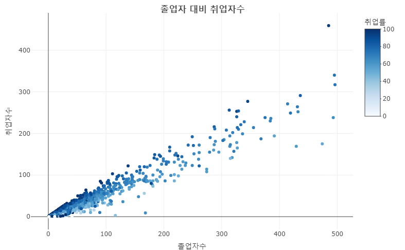
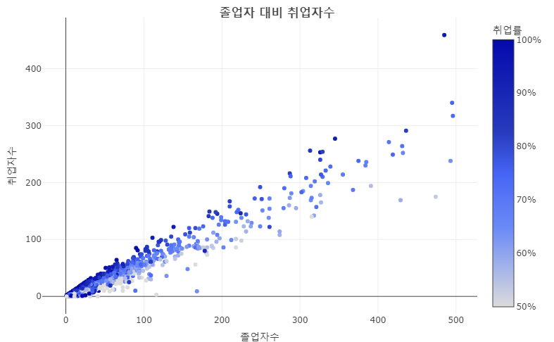
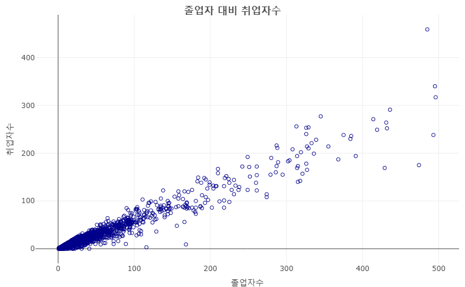
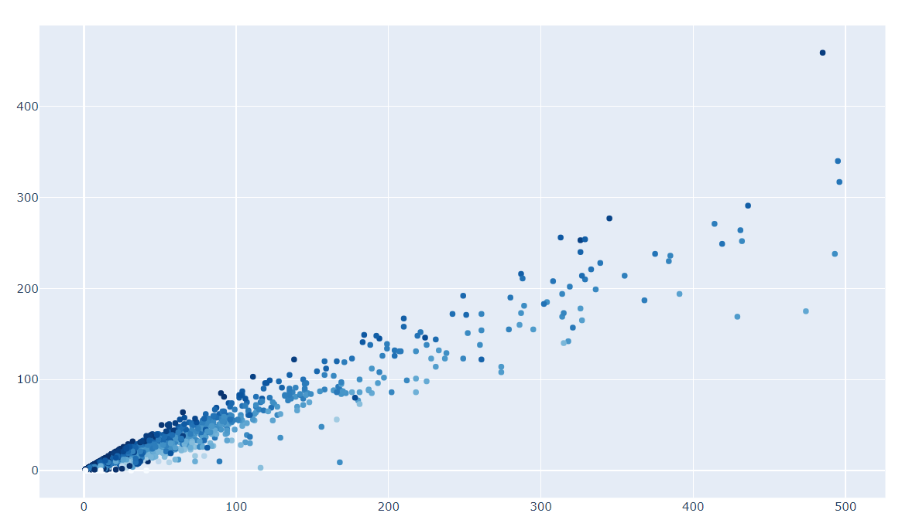
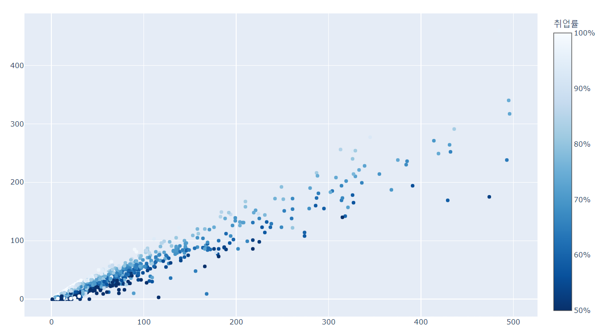
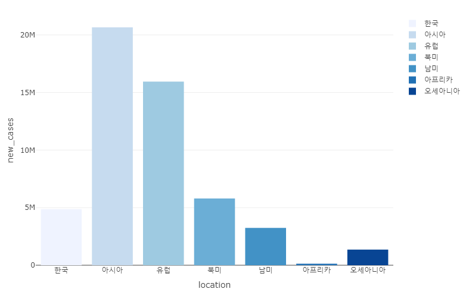
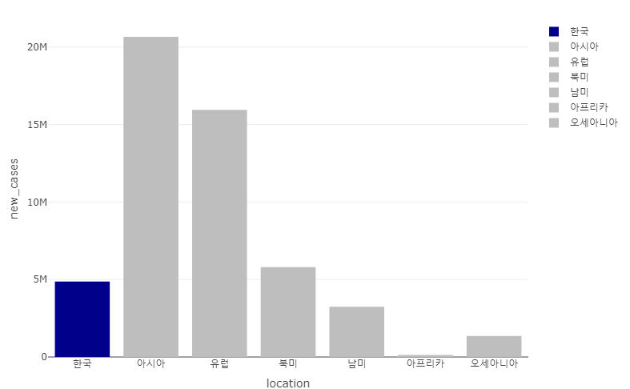
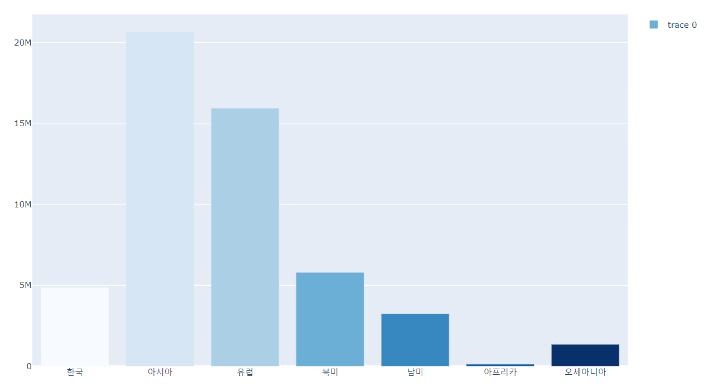
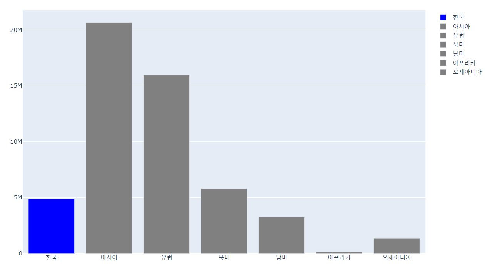

```{r setup, include=FALSE}
knitr::opts_chunk$set(echo = TRUE, message = FALSE, warning = FALSE, fig.width = 6.5, dpi = 130, eval = FALSE) # nolint
library(showtext)
showtext_auto()

library(tidyverse)
library(readxl)
library(readr)
library(lubridate)
library(plotly)

```

```{r echo = FALSE, message = FALSE, warning = FALSE}
df_covid19 <- read_csv(file = "D:/R/data/Rnpy/owid-covid-data.csv",
                            col_types = cols(date = col_date(format = "%Y-%m-%d")
                                             )
                            )
df_covid19_100 <- df_covid19 |> 
  filter(iso_code %in% c('KOR', 'OWID_ASI', 'OWID_EUR', 'OWID_OCE', 'OWID_NAM', 'OWID_SAM', 'OWID_AFR')) |>
  filter(date >= max(date) - 100) |>
  mutate(location = case_when(
    location == 'South Korea' ~ '한국', 
    location == 'Asia' ~ '아시아', 
    location == 'Europe' ~ '유럽', 
    location == 'Oceania' ~ '오세아니아', 
    location == 'North America' ~ '북미', 
    location == 'South America' ~ '남미', 
    location == 'Africa' ~ '아프리카')) |>
  mutate(location = fct_relevel(location, '한국', '아시아', '유럽', '북미', '남미', '아프리카', '오세아니아')) |>
  arrange(date)

df_covid19_100_wide <- df_covid19_100 |>
  select(date, location, new_cases, people_fully_vaccinated_per_hundred) |>
  rename('date' = 'date', '확진자' = 'new_cases', '백신접종완료자' = 'people_fully_vaccinated_per_hundred') |>
  pivot_wider(id_cols = date, names_from = location, 
              values_from = c('확진자', '백신접종완료자')) |>
  arrange(date)

df_covid19_stat <- df_covid19 |> 
  group_by(iso_code, continent, location) |>
  summarise(인구수 = max(population, na.rm = T), 
            전체사망자수 = sum(new_deaths, na.rm = T), 
            백신접종자완료자수 = max(people_fully_vaccinated, na.rm = T),
            인구백명당백신접종완료율 = max(people_fully_vaccinated_per_hundred, na.rm = T),
            인구백명당부스터접종자수 = max(total_boosters_per_hundred, na.rm = T)) |> 
    ungroup() |>
    mutate(십만명당사망자수 = round(전체사망자수 / 인구수 *100000, 5),
           백신접종완료율 = 백신접종자완료자수 / 인구수)

margins_R <- list(t = 50, b = 25, l = 25, r = 25)


df_취업률 <- read_excel('d:/R/data/Rnpy/2021년 학과별 고등교육기관 취업통계.xlsx', 
                     ## '학과별' 시트의 데이터를 불러오는데,
                     sheet = '학과별',
                     ## 앞의 13행을 제외하고
                     skip = 13, 
                     ## 첫번째 행은 열 이름으로 설정
                     col_names = TRUE, 
                     ## 열의 타입을 설정, 처음 9개는 문자형으로 다음 79개는 수치형으로 설정
                     col_types = c(rep('text', 9), rep('numeric', 79)))

## df_취업률에서 첫번째부터 9번째까지의 열과 '계'로 끝나는 열을 선택하여 다시 df_취업률에 저장
df_취업률 <- df_취업률 |> 
  select(1:9, ends_with('계'), '입대자')

## df_취업률에서 졸업자가 500명 이하인 학과 2000개 샘플링
df_취업률_500 <- df_취업률 |> 
  filter(졸업자_계 < 500) |>
  mutate(id = row_number()) |>
  filter(row_number() %in% seq(from = 1, to = nrow(df_취업률), by = 4))

## 열 이름을 적절히 설정
names(df_취업률_500)[10:12] <- c('졸업자수', '취업률', '취업자수')

```

## 색상 설정

데이터 시각화에서 데이터의 표현을 위해 가장 중요한 것은 데이터를 어떠한 도형을 사용하여 구조적으로 표현할 것인지이다. 하지만 그 데이터 시각화를 보다 효과적으로  사용하기 위해서 가장 효율적으로 사용되는 것이 데이터를 표현하는 색상이다. 색상을 어떻게 쓰느냐에 따라서 청중들을 데이터 시각화에서 전달하고자 하는 핵심에 빠르게 집중시킬 수도 있고 전혀 집중하지 못하게 할 수도 있다. 따라서 데이터 트레이스에 원하는 색상을 정확히 사용하는 방법을 익히는 것이 매우 중요하다. 데이터 시각화에서 사용하는 색상은 크게 연속형 색상과 이산형 색상으로 나눌 수 있다. 

### 연속헝 색상

연속형 색상은 일반적으로 연속형 변수에 매핑되어 색상간의 단계 구분없이 색상의 전반적인 흐름을 사용하여 데이터의 변량 값을 표현한다. plotly에서 연속형 색상을 표현하는 방법으로 다음의 네 가지 컨셉을 사용한다. 

-   color scale : 전체 색상의 범위와 데이터를 0에서 1까지의 범위로 정규화하고 데이터에 매핑되는 색상으로 데이터를 표현하는 방법이다. 따라서 보통의 경우 0에 해당하는 색상과 1에 해당하는 색상을 설정하고 이 사이의 색상들을 보간(interpolate)하여 색상을 생성하고 여기에 데이터를 매핑하여 표현할 색상을 결정한다. 

-   color ranges : colorscale의 색상 범위인 0~1에 매핑될 데이터 값의 범위를 설정함으로써 색상을 매핑하는 방법이다. 기본적으로 color range는 기본적으로 매핑되는 데이터의 최솟값과 최댓값으로 설정되지만 'cmin', 'cmid', 'cmax' 속성값을 사용해 설정할 수 있다. 

-   colorbar : plolty에서는 연속형 색상의 범례를 표현하는 방식으로 컬러바를 사용한다. 이 컬러바는 전체적인 colorscale을 눈금 레이블과 눈금 표시를 사용하는 색상 범례를 말한다. 컬러바는 레이아웃의 'colorbar' 속성을 사용하여 설정하거나 scatter 트레이스 'marker' 속성의 'colorbar' 속성으로 설정이 가능하다. 

- color axes : 컬러 축은 위의 세 가지 컬러 컨셉을 데이터와 연결한다. 기본적으로 컬러로 표현될 수 있는 속성은 그 자체적인 색상 축으로 설정되어 연결된다. 

색상을 설정할 때 R과 python에 몇 가지 차이점이 있다. 

R에서는 트레이스 설정에 사용하는 'data' 속성의 하위 리프 노드 속성으로 'color'를 사용할 수 있지만 python에서는 데이터가 실제로 표시되는 'data' 속성의 하위 속성인 'marker' 속성의 하위 속성으로 'color'를 설정한다는 것이다. 또 R에서는 'data' 속성의 하위 리프 노드 속성으로 'colors'를 사용하여 색상 팔레트를 설정하지만 python에서는 'colors' 속성이 존재하지 않는다.

반면 R에서 색상의 설정시 특정 색상으로 지정할 때는 색상명을 바로 쓸 수 없고 `I()`를 사용하여 색상을 설정하여야 한다. 

다음은 졸업자수 대비 취업자수의 scatter 트레이스에 연속형 변수인 취업률을 색상 변수로 사용하는 R과 python 코드이다. 

-   R

R에서 변수를 색상에 매핑하기 위해서는 'data' 속성의 하위 속성인 'color' 속성에 색상을 매핑할 데이터프레임 열이나 벡터를 설정한다. 데이터프레임 열을 매핑할 때는 'x', 'y' 속성과 같이 "~"를 열 이름 앞에 붙여주어야 한다. 만약 전반적 컬러 스케일을 변경하고자 한다면 두 가지 방법을 사용할 수 있는데, 사용자가 직접 최솟값에 해당하는 색상과 최댓값에 해당하는 색상을 설정함으로서 변경할 수 있고 미리 정의된 팔레트를 사용하는 방법이 있다. 컬러 팔레트를 설정한다면 다음과 같이 'colors' 속성에 색상 팔레트 설정하여 사용할 수 있다.    

```{r}
df_취업률_500 |> 
  filter(졸업자수 < 500) |> 
  plot_ly() |>
  add_trace(type = 'scatter', mode = 'markers', 
            x = ~졸업자수, y = ~취업자수, 
            color = ~취업률, colors = 'Blues') |> 
  ## title 속성의 설정
  layout(title = list(text = '<b>졸업자 대비 취업자수</b>', 
                      x = 0.5, xanchor = 'center', yanchor = 'top'))

```



색상의 전반적 스케일 중 일부 스케일에만 관심이 있다면 color ranges를 설정하여 범위를 설정할 수 있다. 'color'와 'colors' 속성외에 속성을 설정하기 위해서는 python과 같이 'marker' 속성의 세부 속성으로 설정해야 한다. 다음은 'cmin'과 'cmax'를 사용하여 color range를 50~100사이로 설정하는 R 코드이다. 'marker' 내부에서 'colorscale'을 설정하면 'marker'외부에서 'colors'로 설정하는 것과 반대로 설정되기 때문에 'reversescale'을 사용하여 색상 스케일을 반전시켰고 'colorbar'의 'title'을 사용하여 컬러바 제목과 'ticksufix'를 사용하여 컬러바의 라벨에 '%' 붙여주었다.  

```{r}
df_취업률_500 |> 
  filter(졸업자수 < 500) |> 
  plot_ly() |>
  add_trace(type = 'scatter', mode = 'markers', 
            x = ~졸업자수, y = ~취업자수, 
            marker = list(color = ~취업률, colorscale = 'Blues', 
                          cmin = 50, cmax = 100, 
                          colorbar = list(title = '취업률', ticksuffix = '%'),
                          reversescale = T) 
            ) |> 
  ## title 속성의 설정
  layout(title = list(text = '<b>졸업자 대비 취업자수</b>', 
                      x = 0.5, xanchor = 'center', yanchor = 'top'))


```


앞서 설명했듯이 R에서 색상을 변수에 매핑하지 않고 단일 색상으로 설정하기 위해서는 색상명만으로 설정이 불가하고 `I()`를 사용해야 한다. 이 방법은 'color'외에  'symbol' 설정에도 동일하게 적용된다. 다만 'marker' 속성의 하위 속성으로 'color'를 설정할 떄는 `I()`를 사용하지 않아도 가능하다. 다음은 marker의 색상을 "darkblue"로 설정하는 R 코드이다. 

```{r}
df_취업률_500 |> 
  filter(졸업자수 < 500) |> 
  plot_ly() |>
  add_trace(type = 'scatter', mode = 'markers', 
            x = ~졸업자수, y = ~취업자수, 
            color = I('darkblue'), symbol = I('circle-open')) |> 
  ## title 속성의 설정
  layout(title = list(text = '<b>졸업자 대비 취업자수</b>', 
                      x = 0.5, xanchor = 'center', yanchor = 'top'))

```



-   python

python에서 변수를 색상에 매핑하기 위해서는 'data' 속성의 하위 속성인 'marker' 속성의 하위 속성으로  'color'에 연속형 변수를 매핑한다. 만약 전반적 컬러 스케일을 변경하고자 한다면 두 가지 방법을 사용할 수 있는데, 사용자가 직접 최솟값에 해당하는 색상과 최댓값에 해당하는 색상을 설정함으로서 변경할 수 있고 미리 정의된 팔레트를 사용하는 방법이 있다. 컬러 팔레트를 설정한다면 다음과 같이 'colors' 속성에 색상 팔레트 설정하여 사용할 수 있다. 다음은 'color'와 'colorscale' 속성을 사용하여 'marker'의 색상과 팔레트를 설정한 python 코드이다. 

```{python}
fig = go.Figure()

fig.add_trace({
  'type' : 'scatter', 'mode' : 'markers',
  'x': df_취업률_500['졸업자수'], 'y': df_취업률_500['취업자수'], 
    'marker' : {'color' : df_취업률_500['취업률'], 'colorscale' : 'Blues'}})
    
fig.show()

```



색상의 전반적 스케일 중 일부 스케일에만 관심이 있다면 color ranges를 설정하여 범위를 설정할 수 있다. 'color'와 'colors' 속성외에 속성을 설정하기 위해서는 python과 같이 'marker' 속성의 세부 속성으로 설정해야 한다. 다음은 'cmin'과 'cmax'를 사용하여 color range를 50~100사이로 설정하는 R 코드이다. 'marker' 내부에서 'colorscale'을 설정하면 'marker'외부에서 'colors'로 설정하는 것과 반대로 설정되기 때문에 'reversescale'을 사용하여 색상 스케일을 반전시켰고 'colorbar'의 'title'을 사용하여 컬러바 제목과 'ticksufix'를 사용하여 컬러바의 라벨에 '%' 붙여주었다.  

```{python}
fig = go.Figure()

fig.add_trace({
  'type' : 'scatter', 'mode' : 'markers',
  'x': df_취업률_500['졸업자수'], 'y': df_취업률_500['취업자수'], 
    'marker' : {'color' : df_취업률_500['취업률'], 'colorscale' : 'Blues', 
                'cmin' : 50, 'cmax' : 100,
                'colorbar' : {'title' : '취업률', 'ticksuffix' : '%'},
                'reversescale' : True}})

fig.show()

```



### 이산헝 색상

이산형 색상은 일반적으로 이산형 변수에 매핑되어 색상간의 단계 구분을 통해 데이터의 변량값을 표현한다. plotly에서 이산형 색상을 표현하는 방법으로 다음의 두 가지 컨셉을 사용한다. 

-   color sequences : 컬러 시퀀스는 이산형 데이터에 각각 매핑되는 색상의 리스트를 설정하는 방법이다. 이 방법은 각각의 이산형 데이터에 1:1로 매칭되는 색상을 레이아웃의 'colorway'에 리스트로 설정하는 방법과 plotly에서 제공하는 팔레트를 설정하여 표현하는 방법이 있다. 

-   legends : 이산형 색상은 앞서 연속형 색상에서 사용했던 컬러바를 사용하지 않고 색상 범레를 사용한다. 

다음은 졸업자수 대비 취업자수의 scatter 트레이스에 연속형 변수인 취업률을 색상 변수로 사용하는 R과 python 코드이다. 

-   R

R에서 이산형 변수에 색상을 설정하기 위해서는 앞서 연속형 변수에서 사용했던 'color' 속성과 'colors' 속성을 사용할 수 있다. 

```{r}
df_covid19_100 |>
  group_by(location) |>
  summarise(new_cases = sum(new_cases)) |>
  plot_ly() |>
  add_trace(type = 'bar', 
            x = ~location, y = ~new_cases, 
            color = ~location, colors = 'Blues')

```



특히 'colors' 속성은 이산형 변수에 매핑되는 이산형 색상은 이산형 변수의 각 변량에 매칭되는 색상을 설정할 수 있다. 'colors' 속성에 `c()`를 사용하여 이산형 변수의 변량 순서에 따른 색상을 문자열로 설정하면 각각의 변량에 매칭되어 색상이 표현된다. 이 방법은 다수의 이산형 변량중에 특정한 하나의 변량을 강조하고자 할 때  효율적으로 사용이 가능하다. 다음은 코로나19의 신규 확진자 중 한국 데이터를 강조한 막대그래프를 그리는 R 코드이다. 

```{r}
df_covid19_100 |>
  group_by(location) |>
  summarise(new_cases = sum(new_cases)) |>
  plot_ly() |>
  add_trace(type = 'bar', 
            x = ~location, y = ~new_cases, 
            color = ~location, colors = c('darkblue', 'gray', 'gray', 'gray', 'gray', 'gray', 'gray'))

```



-   python

python에서 이산형 색상을 설정하는 것은 R보다는 약간 번거롭다. 사실 plotly에서 이산형 색상의 설정은 연속형 색상의 설정과 기본적으로 다루는 방식이 다르다. 연속형 색상은 하나의 트레이스안에서 해당 트레이스의 데이터를 표현하는 방법으로 색상의 변화를 사용한다. 이것이 트레이스 리프 노드로 'color'를 설정하지 않고 'marker' 속성으로 'color' 속성을 설정하는 이유이다. 그리고 'color' 속성은 색상의 변화에 매핑되어야 하기 때문에 'color' 속성에 할당되는 변수는 반드시 수치형 변수이어야 한다. 하지만 이산형 색상 설정에서는 각각의 이산형 변수들이 독립적 색상을 가지고 그 중간의 색상이 없기 때문에 plotly는 이산형 색상을 각각의 트레이스로 분리하여 설정한다. 앞서 'name' 속성에서 데이터 그룹간의 트레이스를 분리하여 `for` 루프를 사용한 것과 유사한 방법인 것이다. 

물론 이산형 색상도 연속형 변수와 같이 `for` 루프를 사용하여 트레이스를 분리하지 않고 'color' 속성을 사용할 수 있다. 이렇게 사용하기 위해서는 먼저 이산형 변수를 수치형 변수로 변환하고 이 변수를 'marker'의 'color'에 설정해 줄 수 있다. 

다음은 하나의 트레이스에 이산형 색상을 설정하는 python 코드이다. 먼저 이산형 변수인 'location' 열은 수치형 변수가 아니기 때문에 'cat()' 함수를 만들어서 각각의 변량값에 매칭되는 수치형 열을  만든다. 다음으로 bar 트레이스의 막대그래프를 그리는데 'marker' 속성의 'color' 속성에 이산형 변수를 수치형으로 만든 열을 설정하고 색상 팔레트를 'Blues' 팔레트로 설정하였다. 

```{python}
fig = go.Figure()

##  이산형 변수를 수치형 변수로 변환하는 함수  
def cat(row):
    key = row['location']
    value = {'한국': 0 , '아시아' : 1, '유럽' : 2, '북미' : 3, '남미' : 4, '아프리카' : 5, '오세아니아' : 6}.get(key)
    return value

## 시각화를 위한 데이터 전처리
temp = df_covid19_100.groupby('location').agg(new_cases = ('new_cases', 'sum')).reset_index()

## 이산형 변수 열을 사용해 수치형 변수열 생성
temp['loc_code']= temp.apply(cat_1, axis=1)

fig.add_trace({
      'type' : 'bar',  ## bar 트레이스 설정
      'x': temp['location'], 'y': temp['new_cases'], 
      ## 이산형 변수를 변환한 수치형 변수를 color로 설정
      'marker' : {'color' : temp['loc_code'], 'colorscale' : 'Blues'}, 
                  'showlegend' : True
})

fig.show()

```



위의 결과를 보면 한국과 각 대륙의 bar 트레이스가 하나의 트레이스로 구성되어 있다. 그래서 범례가 'trace 0'라고 명명되어 하나의 범례만 나타난다. 하지만 일반적인 사용자들은 범례에도 색상과 각각의 대륙명이 나오길 바랄 것이다. 이를 위해서는 각각의 대륙에 따르는 bar 트레이스를 그려주어야 한다. 

그런데 이렇게 트레이스를 나누어줄 때 트레이스 색상을 각각 설정해야 한다. 각각의 색상 설정은 이산형 변수에 매칭되는 딕셔너리를 설정하여 사용하거나 `update_layout()`의 'colorway'를 사용하는 두 가지 방법이 있다. 

다음은 `for` 루프를 사용하여 각각의 트레이스를 나누고 이산형 변수에 매칭되는 색상 딕셔너리를 사용하여 한국의 데이터를 강조하는 python 코드이다.  

```{python}
fig = go.Figure()

##  이산형 변수와 색상을 매칭하는 딕셔너리 정의
colors = {'한국': 'blue' , '아시아' : 'gray', '유럽' : 'gray', '북미' : 'gray', '남미' : 'gray', '아프리카' : 'gray', '오세아니아' : 'gray'}
temp = df_covid19_100.groupby('location').agg(new_cases = ('new_cases', 'sum')).reset_index()

## 'location'의 그룹에 따라 for 루프
for cat, group in temp.groupby('location'):
    fig.add_trace({
          'type' : 'bar',  ## bar 트레이스 설정
          'x': group['location'], 'y': group['new_cases'], 
          'name' : cat,
          'marker' : {'color' : colors[cat]}
    })

fig.show()

```



이를 `update_layout()`의 'colorway'를 사용할 수 있는데 이를 사용한 python 코드는 다음과 같다. 

```{python}
fig = go.Figure()

temp = df_covid19_100.groupby('location').agg(new_cases = ('new_cases', 'sum')).reset_index()

## 'location'의 그룹에 따라 for 루프
for cat, group in temp.groupby('location'):
    fig.add_trace({
          'type' : 'bar',  ## bar 트레이스 설정
          'x': group['location'], 'y': group['new_cases'], 
          'name' : cat,
          'marker' : {'color' : colors[cat]}
    })

fig.update_layout({
    'colorway' : ('blue', 'gray', 'gray', 'gray', 'gray', 'gray', 'gray')})
    
fig.show()

```


