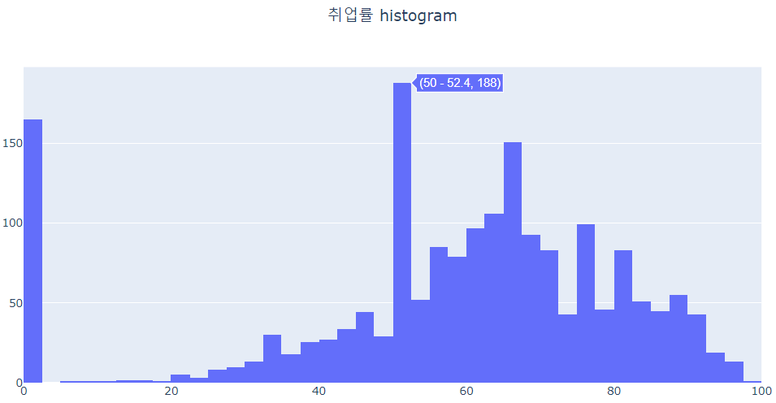
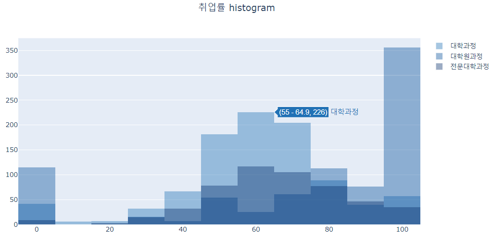

```{r setup, include=FALSE}
knitr::opts_chunk$set(echo = TRUE, message = FALSE, warning = FALSE, fig.width = 6.5, dpi = 130)
library(showtext)
showtext_auto()
library(tidyverse)
library(readxl)
library(patchwork)
library(plotly)
library(reticulate)
```

```{r echo = FALSE, message = FALSE, warning = FALSE}
df_covid19 <- read_csv(file = "https://covid.ourworldindata.org/data/owid-covid-data.csv",
                            col_types = cols(Date = col_date(format = "%Y-%m-%d")
                                             )
                            )
max(df_covid19$date) - 100
df_covid19_100 <- df_covid19 |> 
  filter(iso_code %in% c('KOR', 'OWID_ASI', 'OWID_EUR', 'OWID_OCE', 'OWID_NAM', 'OWID_SAM', 'OWID_AFR')) |>
  filter(date >= max(date) - 100) |>
  mutate(location = case_when(
    location == 'South Korea' ~ '한국', 
    location == 'Asia' ~ '아시아', 
    location == 'Europe' ~ '유럽', 
    location == 'Oceania' ~ '오세아니아', 
    location == 'North America' ~ '북미', 
    location == 'South America' ~ '남미', 
    location == 'Africa' ~ '아프리카')) |>
  mutate(location = fct_relevel(location, '한국', '아시아', '유럽', '북미', '남미', '아프리카', '오세아니아')) |>
  arrange(date)

df_covid19_100_wide <- df_covid19_100 |>
  select(date, location, new_cases, people_fully_vaccinated_per_hundred) |>
  rename('date' = 'date', '확진자' = 'new_cases', '백신접종완료자' = 'people_fully_vaccinated_per_hundred') |>
  pivot_wider(id_cols = date, names_from = location, 
              values_from = c('확진자', '백신접종완료자')) |>
  arrange(date)

df_covid19_stat <- df_covid19 |> 
  group_by(iso_code, continent, location) |>
  summarise(인구수 = max(population, na.rm = T), 
            인당GDP = max(gdp_per_capita, na.rm = T),
            전체확진자수 = sum(new_cases, na.rm = T),
            전체사망자수 = sum(new_deaths, na.rm = T), 
            십만명당중환자실 = last(icu_patients_per_million),
            재생산지수 = last(reproduction_rate),
            봉쇄지수 = max(stringency_index, na.rm = T), 
            전체검사자수 = max(total_tests, na.rm = T), 
            신규검사자수 = sum(new_tests, na.rm = T),
            전체백신접종자수 = max(total_vaccinations, na.rm = T),
            백신접종자완료자수 = max(people_fully_vaccinated, na.rm = T),
            부스터접종자수 = max(total_boosters, na.rm = T),
            인구백명당백신접종완료률 = max(people_fully_vaccinated_per_hundred, na.rm = T),
            인구백명당부스터접종자수 = max(total_boosters_per_hundred, na.rm = T)
            ) |> 
    ungroup() |>
    mutate(십만명당사망자수 = round(전체사망자수 / 인구수 *100000, 5),
           백신접종완료률 = 백신접종자완료자수 / 인구수)

margins <- list(t = 50, b = 25, l = 25, r = 25)


```

```{r echo = FALSE, message = FALSE, warning = FALSE}
## R 코드

df_취업률 <- read_excel('d:/R/data/2020년 학과별 고등교육기관 취업통계.xlsx', 
                     ## '학과별' 시트의 데이터를 불러오는데,
                     sheet = '학과별',
                     ## 앞의 13행을 제외하고
                     skip = 13, 
                     ## 첫번째 행은 열 이름으로 설정
                     col_names = TRUE, 
                     ## 열의 타입을 설정, 처음 9개는 문자형으로 다음 79개는 수치형으로 설정
                     col_types = c(rep('text', 9), rep('numeric', 79)))

## df_취업률에서 첫번째부터 9번째까지의 열과 '계'로 끝나는 열을 선택하여 다시 df_취업률에 저장
df_취업률 <- df_취업률 |> 
  select(1:9, ends_with('계'), '입대자')

## df_취업률에서 졸업자가 500명 이하인 학과 2000개 샘플링
df_취업률_2000 <- df_취업률 |> 
  filter(졸업자_계 < 500) |>
  mutate(id = row_number()) |>
  filter(row_number() %in% seq(from = 1, to = nrow(df_취업률), by = 4))

## 열 이름을 적절히 설정
names(df_취업률_2000)[10:12] <- c('졸업자수', '취업률', '취업자수')

```

```{python echo = FALSE, message = FALSE, warning = FALSE, eval = FALSE}
import pandas as pd
from datetime import datetime, timedelta
from pandas.api.types import CategoricalDtype
from matplotlib import pyplot as plt
import plotly.graph_objects as go

df_covid19 = pd.read_csv("https://covid.ourworldindata.org/data/owid-covid-data.csv")

df_covid19['date'] = pd.to_datetime(df_covid19['date'], format="%Y-%m-%d")

df_covid19_100 = df_covid19[(df_covid19['iso_code'].isin(['KOR', 'OWID_ASI', 'OWID_EUR', 'OWID_OCE', 'OWID_NAM', 'OWID_SAM', 'OWID_AFR'])) & (df_covid19['date'] >= (max(df_covid19['date']) - timedelta(days = 100)))]


df_covid19_100.loc[df_covid19_100['location'] == 'South Korea', "location"] = '한국'
df_covid19_100.loc[df_covid19_100['location'] == 'Asia', "location"] = '아시아'
df_covid19_100.loc[df_covid19_100['location'] == 'Europe', "location"] = '유럽'
df_covid19_100.loc[df_covid19_100['location'] == 'Oceania', "location"] = '오세아니아'
df_covid19_100.loc[df_covid19_100['location'] == 'North America', "location"] = '북미'
df_covid19_100.loc[df_covid19_100['location'] == 'South America', "location"] = '남미'
df_covid19_100.loc[df_covid19_100['location'] == 'Africa', "location"] = '아프리카'

ord = CategoricalDtype(categories = ['한국', '아시아', '유럽', '북미', '남미', '아프리카', '오세아니아'], ordered = True)

df_covid19_100['location'] = df_covid19_100['location'].astype(ord)

df_covid19_100 = df_covid19_100.sort_values(by = 'date')

df_covid19_100_wide = df_covid19_100.loc[:,['date', 'location', 'new_cases', 'people_fully_vaccinated_per_hundred']].rename(columns={'new_cases':'확진자', 'people_fully_vaccinated_per_hundred':'백신접종완료자'})

df_covid19_100_wide = df_covid19_100_wide.pivot(index='date', columns='location', values=['확진자', '백신접종완료자']).sort_values(by = 'date')

df_covid19_100_wide.columns = ['확진자_한국', '확진자_아시아', '확진자_유럽', '확진자_북미', '확진자_남미', '확진자_아프리카','확진자_오세아니아',
                              '백신접종완료자_한국', '백신접종완료자_아시아', '백신접종완료자_유럽', '백신접종완료자_북미', '백신접종완료자_남미', '백신접종완료자_아프리카','백신접종완료자_오세아니아']
                              
df_covid19_stat = df_covid19.groupby(['iso_code', 'continent', 'location'], dropna=True).agg(
    인구수 = ('population', 'max'),
    인당GDP = ('gdp_per_capita', 'max'), 
    전체확진자수 = ('new_cases', 'sum'),
    전체사망자수 = ('new_deaths', 'sum'), 
    십만명당중환자실 = ('icu_patients_per_million', 'last'),
    재생산지수 = ('reproduction_rate', 'last'),
    봉쇄지수 = ('stringency_index', 'max'), 
    전체검사자수 = ('total_tests', 'max'), 
    신규검사자수 = ('new_tests', 'sum'),
    전체백신접종자수 = ('total_vaccinations', 'max'),
    백신접종자완료자수 = ('people_fully_vaccinated', 'max'),
    부스터접종자수 = ('total_boosters', 'max'),
    인구백명당백신접종완료률 = ('people_fully_vaccinated_per_hundred', 'max'),
    인구백명당부스터접종자수 = ('total_boosters_per_hundred', 'max')
).reset_index()

df_covid19_stat['십만명당사망자수'] = round(df_covid19_stat['전체사망자수'] / df_covid19_stat['인구수'] *100000, 5)

df_covid19_stat['백신접종완료률'] = df_covid19_stat['백신접종자완료자수'] / df_covid19_stat['인구수']


######################################   
## python 코드
## 대학 학과 취업률 데이터 셋

df_취업률 = pd.read_excel("d:/R/data/2020년 학과별 고등교육기관 취업통계.xlsx", 
                           sheet_name = '학과별',
                           skiprows=(13), 
                           header = 0)

df_취업률 = pd.concat([df_취업률.iloc[:, 0:8], 
                    df_취업률.loc[:, df_취업률.columns.str.endswith('계')], 
                    df_취업률.loc[:, '입대자']], 
                   axis = 1
                   )

df_취업률_2000 = df_취업률.loc[(df_취업률['졸업자_계'] < 500)]

df_취업률_2000 = df_취업률_2000.iloc[range(0, len(df_취업률_2000.index) , 4)]

df_취업률_2000 = df_취업률_2000.rename(columns = {'졸업자_계':'졸업자수', '취업률_계':'취업률', '취업자_합계_계':'취업자수'})

```

관계의 시각화는 단순히 X축 데이터의 분포에 따라 Y축 데이터의 분포가 어떻게 분포하는지를 위주로 표현한다. 관계의 시각화에서 가장 중요한 정보는 상관관계인데 어떤 독립 변수가 어떤 종속 변수와 밀접하게 관계가 있는지에 대한 전반적인 관계를 먼저 관계의 시각화를 통해 확인할 수 있다. 관계의 시각화는 주로 산점도를 사용한다.

분포의 시각화는 전체 데이터가 어떻게 세부적으로 분포하는지를 표현하는 시각화 방법을 말한다. 보통 전체 데이터를 특정 구분자에 의해 분류하고 이에 대한 사례수나 비율을 나타내는 시각화가 이에 속한다. 대표적인 분포의 시각화는 히스토그램, 밀도 분포 그래프, 박스 플롯 등이 있다.

# 산점도(scatter chart)

산점도는 `plolty`뿐 아니라 데이터 시각화에서 가장 기본적인 시각화 방법이다. 산점도는 X, Y축으로 구성된 데카르트 좌표계 위에 점을 사용하여 데이터의 분포를 표현하는 방법으로 매우 간단한 시각화이지만 데이터의 분포와 데이터의 관계성을 파악하는데 가장 효율적인 시각화이다. 데이터 분석을 시작할 때 대부분의 분석가들이 가장 먼저 시작하는 EDA(Exploratory Data Analysis)의 기초적인 시각화로 사용된다.

산점도는 X, Y의 2차원 축에 매핑되는 두개 혹은 세개의 데이터간의 관계성을 점으로 표현하는 시각화 방법이다. 기본적으로 2차원 공간에 흩어져(scattered) 보이는 형태의 시각화이고, 2차원 축에 매핑되어야 하기 때문에 2개의 변수가 모두 연속형 수치 변수이어야 한다. 산점도는 'x-y 그래프'라고도 하며, 데이터의 흩어져 있는 형태의 시각화를 통해 데이터의 분포와 관계를 알아보는데 사용되는 방법중에 가장 많이 사용된다.

산점도를 통해 살펴볼 수 있는 패턴이나 상관관계는 보통 다음의 세 가지 정도이다.

::: {custom-style="comment"}
-   선형 또는 비선형 상관 관계 : 선형 상관 관계는 데이터의 추세선이 직선을 형성하지만 비선형 상관 관계는 데이터의 추세선이 곡선 또는 기타 형태를 나타냄
-   강한 또는 약한 상관관계 : 강한 상관 관계는 데이터들이 추세선에 가까이 분포하지만 약한 상관 관계는 데이터 들이 추세선에 더 멀리 분포해 있음
-   양의 또는 음의 상관 관계 : 양의 상관 관계는 추세선이 우상향하고(즉, x 값이 증가할 때 y 값이 증가) 음의 상관 관계는 추세선이 우하향함(즉, x 값은 증가할 때 y 값은 감소).
:::

[https://medium.com/\@paymantaei/what-is-a-scatter-plot-and-when-to-use-one-2365e774541](https://medium.com/@paymantaei/what-is-a-scatter-plot-and-when-to-use-one-2365e774541){.uri}

앞서 설명한 바와 같이 X, Y축에 매핑되는 결과가 산점도인데 이를 상관관계의 측면에서 풀어본다면 X축 변수는 독립변수이고 Y축 변수는 종속변수로 볼 수 있다. 하지만 많은 경우 종속 변수를 결정하는 독립 변수는 하나 이상이다. 이렇게 하나 이상의 독립 변수를 표현하기 위해 대부분의 산점도는 점의 색상이나 형태, 크기등을 사용하여 추가적인 독립변수를 표현한다. 이렇게 X축, 색, 점의 형태, 점의 크기를 모두 사용한다면 Y축에 표현되는 종속 변수는 총 4개의 독립 변수로 표현되는 산점도를 그릴 수 있는 것이다. 이중 점의 크기를 사용하는 산점도를 버블 차트라고 한다.

`plotly`에서 산점도는 스캐터(scatter) 트레이스를 사용하여 구현한다. `plotly`에서 스캐터 트레이스는 단지 산점도만을 그리는 것이 아니고 X, Y 축에 좌표상으로 표시되는 선 그래프를 포함하며 산점도와 선 그래프에 문자열을 표기하는 시각화까지 포함한다.

산점도를 그리는데 앞 장에서 `plotly`를 그리기 위해 사용했던 `add_trace()`를 사용할 수 있지만 R과 python 모두 산점도를 위한 전용 함수를 제공한다.

-   R

R에서 산점도는 `add_markers()`를 사용하여 만들 수 있다. `add_markers()`에서 사용하는 속성은 `add_trace()`에서 사용하는 속성 그대로 사용할 수 있다. 만약 이 중 여러개를 동시에 그리기 위해서는 R 자체적으로 제공하는 파이프(`|>`)나 `tidyverse`에서 지원하는 파이프(`%>%`)로 계속 겹쳐서 그릴 수 있다.

```{r eval = FALSE}
df_취업률_2000 |> 
  plot_ly() |>
  add_markers(x = ~졸업자수, y = ~취업자수, color = ~대계열) |>
  layout(title = list(text = '<b>졸업자 대비 취업자수</b>', font = list(color = 'white')), 
         margin = list(t = 50, b = 25, l = 25, r = 25), 
         paper_bgcolor = 'black', plot_bgcolor = 'black', 
         xaxis = list(color = 'white', ticksuffix = '명'), 
         yaxis = list(color = 'white', gridcolor = 'gray', ticksuffix = '명', dtick = 100), 
         legend = list(font = list(color = 'white')))
```

```{r echo = FALSE, fig.cap='color 매핑 결과'}
df_취업률_2000 |> 
  plot_ly() |>
  add_markers(x = ~졸업자수, y = ~취업자수, color = ~대계열, colors = 'Blues') |>
  layout(title = list(text = '<b>졸업자 대비 취업자수</b>', font = list(color = 'white')), 
         margin = list(t = 50, b = 25, l = 25, r = 25), 
         paper_bgcolor = 'black', plot_bgcolor = 'black', 
         xaxis = list(color = 'white', ticksuffix = '명'), 
         yaxis = list(color = 'white', gridcolor = 'gray', ticksuffix = '명', dtick = 100), 
         legend = list(font = list(color = 'white')))
```

앞의 코드를 `add_trace()`를 사용하는 코드는 다음과 같다.[^1]

[^1]: 이 후 R에서 plotly 구현은 add_trace()를 중심으로 설명하겠다.

```{r eval = FALSE}
df_취업률_2000 |> 
  plot_ly() |>
  add_trace(type = 'scatter', mode = 'markers', 
            x = ~졸업자수, y = ~취업자수, color = ~대계열) |>
  layout(title = list(text = '<b>졸업자 대비 취업자수</b>', font = list(color = 'white')), 
         margin = list(t = 50, b = 25, l = 25, r = 25), 
         paper_bgcolor = 'black', plot_bgcolor = 'black', 
         xaxis = list(color = 'white', ticksuffix = '명'), 
         yaxis = list(color = 'white', gridcolor = 'gray', ticksuffix = '명', dtick = 100), 
         legend = list(font = list(color = 'white')))

```

-   python

앞선 2장에서는 `add_trace()`에 'data' 속성을 딕셔너리로 구성하여 트레이스를 구성하였다. 이번 장 부터는 이 방법보다는 `add_trace()`와 `plolty.graph_objects`에서 제공하는 각 트레이스 함수를 사용하는 방법을 사용한다.

`plolty.graph_objects`로 산점도를 그리기 위해서는 `plolty.graph_objects.Scatter()`를 사용한다. 다음의 코드에서와 같이 초기화된 `plotly` 객체의 메쏘드로 `add_trace()`를 호출하고 `add_trace()`의 매개변수로 `plolty.graph_objects.Scatter()`를 설정한다. `plolty.graph_objects.Scatter()`는 스캐터 트레이스에 해당하는 속성들을 매개변수처럼 '='을 사용하여 속성값을 설정하는데 만약 하위 속성이 있는 경우 `{}`나 `dict()`를 사용하여 딕셔너리를 만들어 설정한다. 다음은 2장에서 만들었던 졸업자 대비 취업자수를 `plolty.graph_objects.Scatter()`를 사용한 코드인데 'color' 속성 설정을 위해 `for` 루프를 사용하였고 'colors' 딕셔너리를 만들어 대계열의 이름에 따른 정수값을 매칭해주었다. 그 이후 배경색을 검정으로 설정하고 축의 색과 그리드 컬러, 눈금 라벨등의 'layout' 속성을 설정하였다.

```{python eval = FALSE}
import plotly.graph_objects as go

fig = go.Figure()

colors = {'의약계열': 0, '인문계열': 1, '사회계열': 2, '교육계열': 3, '공학계열': 4, '자연계열': 5, '예체능계열': 6}

for cat, group in df_취업률_2000.groupby('대계열'):
    fig.add_trace(go.Scatter(
        mode = 'markers',
        x = group['졸업자수'], y = group['취업자수'],
        name = cat,
        marker = dict(color = colors[cat]), 
        showlegend = True
    ))

fig.update_layout(title = dict(text = '<b>졸업자 대비 취업자수</b>', x = 0.5, font = dict(color = 'white')), 
         margin = dict(t = 50, b = 25, l = 25, r = 25), 
         paper_bgcolor = 'black', plot_bgcolor = 'black', 
         xaxis = dict(color = 'white', ticksuffix = '명', showgrid = False), 
         yaxis = dict(color = 'white', gridcolor = 'gray', ticksuffix = '명', dtick = 100), 
         legend = dict(font = dict(color = 'white')))
fig.show()

```

```{python eval = FALSE, echo = FALSE}
fig = go.Figure()

colors = {'의약계열': 0, '인문계열': 1, '사회계열': 2, '교육계열': 3, '공학계열': 4, '자연계열': 5, '예체능계열': 6}

for cat, group in df_취업률_2000.groupby('대계열'):
    fig.add_trace(go.Scatter(
        mode = 'markers',
        x = group['졸업자수'], y = group['취업자수'],
        name = cat,
        marker = dict(color = colors[cat]), 
        showlegend = True
    ))

fig.update_layout(title = dict(text = '<b>졸업자 대비 취업자수</b>', x = 0.5, font = dict(color = 'white')), 
         margin = dict(t = 50, b = 25, l = 25, r = 25), 
         paper_bgcolor = 'black', plot_bgcolor = 'black', 
         xaxis = dict(color = 'white', ticksuffix = '명', showgrid = False), 
         yaxis = dict(color = 'white', gridcolor = 'gray', ticksuffix = '명', dtick = 100), 
         legend = dict(font = dict(color = 'white')),
                  colorway = ("#EFF3FF", "#C6DBEF", "#9ECAE1", "#6BAED6", "#4292C6", "#2171B5", "#084594")
                 )
fig.show()

```


앞의 코드를 `plotly.express`로 구현하면 다음과 같다.[^2] `plotly.express`에서 제공하는 스캐터 트레이스를 그리는 함수는 `scatter()`로 이 함수로 설정하는 모든 속성값은 매개변수로 사용된다. 따라서 'data'속성에서 하위 속성이 존재하는 속성들도 딕셔너리를 사용하는 방법이 아닌 매개변수와 같이'='을 사용해 바로 설정하는데 각각의 속성에 따른 매개변수 이름을 확인해야하고 더러는 지원하지 않는 속성도 있다.[^3]

[^2]: 이후 python에서 plotly의 구현은 plotly.graph_objects 중심으로 설명하겠다.

[^3]: 이후 python에서 plotly의 구현은 plotly.graph_objects 중심으로 설명하겠다.

```{python eval = FALSE}
import plotly.express as px
fig = px.scatter(df_취업률_2000, x= '졸업자수', y="취업자수", 
                 color = "대계열")
                 
fig.update_layout(title = dict(text = '<b>졸업자 대비 취업자수</b>', 
                          x = 0.5, font = dict(color = 'white')),
                  margin = dict(t = 50, b = 25, l = 25, r = 25), 
                  paper_bgcolor = 'black', plot_bgcolor = 'black', 
                  xaxis = dict(color = 'white', ticksuffix = '명', showgrid = False), 
                  yaxis = dict(color = 'white', gridcolor = 'gray', 
                          ticksuffix = '명', dtick = 100),
                  legend = dict(font = dict(color = 'white')))
fig.show()

```

```{python eval = FALSE, echo = FALSE}
fig = px.scatter(df_취업률_2000, x= '졸업자수', y="취업자수", 
                 color = "대계열", color_discrete_sequence = ("#EFF3FF", "#C6DBEF","#9ECAE1","#6BAED6","#4292C6","#2171B5","#084594"))
fig.update_layout(title = dict(text = '<b>졸업자 대비 취업자수</b>', x = 0.5, font = dict(color = 'white')), 
         margin = dict(t = 50, b = 25, l = 25, r = 25), 
         paper_bgcolor = 'black', plot_bgcolor = 'black', 
         xaxis = dict(color = 'white', ticksuffix = '명', showgrid = False), 
         yaxis = dict(color = 'white', gridcolor = 'gray', ticksuffix = '명', dtick = 100), 
         legend = dict(font = dict(color = 'white')))
fig.show()

```

## 추세 산점도

산점도가 가장 효과적으로 사용되는 경우는 변수간의 관계성을 살펴보는 것이다. 그렇다면 산점도에 뿌려지는 데이터에 어떤 상관관계가 있는지를 추세선으로 표시하면 데이터간의 관계성을 좀 더 확실히 알아 볼 수 있다.

이러한 상관관계는 상관계수라는 수치로 얼마나 강한 상관관계를 가지는지를 표현한다. 다음의 그림과 같이 상관관계가 높을 수록 추세선 주위에 데이터들이 모여있고 상관관계가 낮을 수록 데이터는 추세선과 관계없이 넓게 뿌려진다. 보통 0.7이상의 상관계수는 매우 강한 상관관계가 있다고 간주되고 0.5이상의 경우 적정한 상관관계가 있다고 간주된다.[^4]

[^4]: <https://www.reneshbedre.com/blog/correlation-analysis-r.html>


`plotly`에서 추세선의 추가는 python에서는 매우 간단하게 추가할 수 있는 방법을 제공하지만 R에서는 직접적으로 추세선을 그리는 기능을 제공하지 않는다.

-   R

R에서 추세선을 그리는데 가장 많이 사용하는 방법은 `ggplot2`에서 제공하는 `geom_smooth()`를 사용하는 방법이다. 하지만 `plotly`의 R 패키지에서는 이런 기능을 제공하지 않는다. 따라서 선형회귀(lm)나 국소회귀(loess) 모델을 만들어 추세선을 그려야 한다.

선형 회귀 추세선 모델을 만들기 위해서는 R base에서 제공하는 `lm()`을 사용하여 상관관계를 파악하고자 하는 독립변수와 종속변수에 적용시켜 만든다. 이렇게 만든 모델에 `fitted()`나 `predict()`를 사용하여 독립변수(X축)에 대응하는 종속변수(Y축)에 대한 추세선을 그려준다. 만약 신뢰구간(Confidence Interval, CI)의 표현이 필요하다면 `add_ribbons()`을 사용하여 그려줄 수 있다.

국소회귀 추세선(LOESS)을 `plotly`로 그리는 방법은 앞서 설명한 바와 같이 `loess()`을 사용하여 국소 선형 회귀 모델을 만들고 선형 회귀 추세선 처럼 `fitted()`를 사용하여 해당 모델에 대한 적합치를 Y축에 매핑함으로써 그려줄 수 있다. 다만 이 과정에서 X축 변량의 순서대로 `fitted()` 값을 그려야 정상적인 추세선이 나타나기 때문에 이 데이터를 정렬하기 위해 임시 데이터프레임을 생성하여 사용하였다.

```{r eval = FALSE}
lm_trend <- lm(data = df_취업률_2000, 취업자수 ~ 졸업자수)

loess_trend <- loess(data = df_취업률_2000, 취업자수 ~ 졸업자수)

df_loess_trend <- data.frame(X = df_취업률_2000$졸업자수, Y = fitted(loess_trend)) |>
  arrange(X)

df_취업률_2000 |>
  plot_ly(type = 'scatter', mode = 'markers') |>
  add_trace(x = ~졸업자수, y = ~취업자수, showlegend = FALSE) |>
  add_trace(mode = 'lines', x = ~졸업자수, y = ~fitted(lm_trend), 
            name = '선형 추세선', line = list(dash = 'dot')) |>
  add_trace(data = df_loess_trend_emp, mode = 'lines', 
            x = ~X, y = ~Y, name = 'loess 추세선'
            )
```

```{r echo = FALSE}
lm_trend <- lm(data = df_취업률_2000, 취업자수 ~ 졸업자수)

loess_trend <- loess(data = df_취업률_2000, 취업자수 ~ 졸업자수)

df_loess_trend <- data.frame(X = df_취업률_2000$졸업자수, Y = fitted(loess_trend)) |>
  arrange(X)

df_취업률_2000 |>
  plot_ly(type = 'scatter', mode = 'markers') |>
  add_trace(x = ~졸업자수, y = ~취업자수, showlegend = FALSE, color = I('darkblue')) |>
  add_trace(mode = 'lines', x = ~졸업자수, y = ~fitted(lm_trend), name = '선형 추세선', color = I('blue'), line = list(dash = 'dot')) |>
  add_trace(data = df_loess_trend_emp, mode = 'lines', x = ~X, y = ~Y, name = 'loess', color = I('skyblue'), dashline = 'dash')
```

하지만 추세선은 이렇게 전체적인 흐름을 보기위해서도 그리지만, 많은 경우 세부 그룹별로 추세선을 그리는 경우도 많다. `plotly`의 R 패키지에서 자체적으로 추세선을 지원하지 않기 때문에 세부 그룹별로 추세선을 그릴때는 `ggplot2`로 그린후 `plotly`로 변환하는 것이 훨씬 효율적이다.

```{r eval = FALSE}
p <- df_취업률_2000 |>
  ggplot(aes(x = 졸업자수, y = 취업자수, color = 대계열)) +
  geom_point() + 
  geom_smooth(method = 'lm', se = FALSE) + 
  geom_smooth(method = 'loess', se= FALSE, linetype = 2)

ggplotly(p)
```

```{r echo = FALSE}
p <- df_취업률_2000 |>
  ggplot(aes(x = 졸업자수, y = 취업자수, color = 대계열)) +
  geom_point() + 
  geom_smooth(method = 'lm', se = FALSE) +
  scale_color_brewer(palette = 'Blues') + 
  geom_smooth(method = 'loess', se= FALSE, linetype = 2)

ggplotly(p)
```

-   python

python에서도 `plotly.graph_objects` 모듈에서는 추세선을 그리는 기능을 제공하지 않는다. 따라서 R과 같이 선형회귀 모델이나 국소 선형회귀 모델을 만들고 이 모델에 적합한 값을 산출하여 이 선을 그려주는 방법을 사용하여야 한다.

python에서 회귀 모델을 만들기 위해서는 먼저 `numpy`와 `scikit-learn` 라이브러리의 `LinearRegression` 모듈을 import하여 선형회귀 모델을 만든다. 이 후 독립변수와 종속변수를 numpy 배열로 만들고 이 두 개의 배열을 `LinearRegression`로 만든 객체의 `fit()` 메쏘드를 사용하여 적합값을 생성한다. 생성된 적합값을 Y축에 매핑하고 독립변수로 사용했던 변수를 X축에 매핑하여 `plotly` 스캐터 트레이스의 선을 그려주면 추세선이 만들어진다.

또 loess 모델을 만들기 위해서 먼저 `statsmodels.api` 라이브러리를 'sm'으로 import하고 `sm.nonparametric.lowess()`를 사용하여 각각의 독립변수 데이터에 대한 적합값으로 구성된 배열을 산출한다. 이 후 독립변수인 이 배열의 첫번째 열을 X로 적합값인 두번째 열을 Y로 매핑하여 `plotly` 스캐터 트레이스로 선을 그어주면 추세선이 만들어진다.

```{python eval = FALSE}
import numpy as np
import statsmodels.api as sm # to build a LOWESS model
from sklearn.linear_model import LinearRegression

############## 선형회귀 모델
linear_regr = LinearRegression()

X = df_취업률_2000['졸업자수'].values.reshape(-1,1)         # 독립변수（NumPy의 배열）
Y = df_취업률_2000['취업자수'].values         # 종속변수（Numpy의 배열）

linear_regr.fit(X, Y)                         # 선형 모델의 가중치를 학습
linear_fit = linear_regr.predict(X)
linear_fit

############## Loess 모델
lowess_fit = sm.nonparametric.lowess(df_취업률_2000['취업자수'], df_취업률_2000['졸업자수'])

fig = go.Figure()

fig.add_trace(go.Scatter(
    mode = 'markers',
    x = df_취업률_2000['졸업자수'], y = df_취업률_2000['취업자수'], 
    showlegend = False
))

fig.add_trace(go.Scatter(
    mode = 'lines', 
    x = df_취업률_2000['졸업자수'], y = linear_fit, 
    name = '선형추세선', 
    line = dict(dash = 'dot')
))

fig.add_trace(go.Scatter(
    mode = 'lines', 
    x = lowess_fit[:,0], y = lowess_fit[:,1], 
    name = 'loess'
))

fig.show()
```


이렇게 각각의 회귀 모델을 만들어 추세선을 만들어 주는 것이 정상적 방법이지만 좀 복잡하다. 하지만 `plotly.express`에서 제공하는 `scatter()`는 'trendline'의 매개변수를 지정해 줌으로써 간단히 추세선을 만들수 있다. 'trendline' 매개변수의 값은 'ols', 'lowess', 'rolling', 'expanding', 'ewm' 중에 하나가 사용된다. 'ols'는 'Ordinary Least Squares regression line'의 준말로 최소자승법을 사용한 회귀선으로 일반적으로 말하는 선형회귀선을 말한다. 국소 선형회귀선인 'lowess', 이동 평균선인 'rolling', 확장 평균선인 'expanding', 지수 가중 평균인 'ewm'을 설정할 수 있다.

```{python eval = FALSE}
import plotly.express as px

fig = px.scatter(df_취업률_2000, x= '졸업자수', y="취업자수", 
                 color = "대계열", trendline = 'ols')
                 
fig = px.scatter(df_취업률_2000, x= '졸업자수', y="취업자수", 
                 color = "대계열", trendline = 'lowess')
                 
fig.show()

```


## 버블 차트(Bubble Chart)

버블 차트는 풍선 차트라고도 하며 2차원의 산점도에 표현되는 각각의 점의 크기를 추가적인 데이터 변수에 따라 다르게 표현함으로써 산점도를 3차원으로 확장할 때 사용하는 차트이다. 물론 버블 차트처럼 3차원 이상의 산점도를 표현하는데 점의 색이나 점의 모양으로 표현할 수도 있지만 점의 색이나 점의 모양을 사용할 떄는 3차원 변수가 연속형 변수가 아니고 이산형 변수일때 보다 효과적이다. 하지만 3차원 변수가 연속형 변수일때는 점의 크기로 표현하는 버블 차트가 효과적이다.

버블 차트를 사용할 떄 주의해야 하는 점이 있다. 첫 번째는 데이터가 너무 많이 표현되는 산점도에는 적절하지 않다는 것이다. 데이터가 표현되는 점의 크기로 세 번째 변수가 표현되는 만큼 데이터가 표시되는 간격이 적절하게 확보되어야 버블 차트의 효과가 높아진다. 두 번째는 데이터가 표현되는 점의 투명도를 잘 설저해야한다는 것이다. 투명도가 너무 짙게 설정되면 데이터들이 서로 겹치는 부분의 데이터를 알아보기가 어려워질 수 있고 투명도가 너무 옅게 되면 데이터 자체를 알아보기 어려워질 수 있다. 세 번쨰는 점의 크기를 결정하는 세 번째 변수는 음의 값을 가지지 않는 데이터가 적합하다는 것이다. 음의 값을 가지면 데이터를 표현하는데 어려움이 있다. 네 번째로 사람의 눈은 일반적으로 원의 크기를 면적으로 인식한다고 알려져있기 떄문에 원의 크기를 결정할 때는 가급적 지름의 크기로 설정하기 보다는 면적의 크기로 설정하는 것이 좋다.

`plotly`로 버블 차트를 만들기 위해서는 스캐터 트레이스로 'mode'를 'markers'로 설정하여 만들 수 있다. 다음은 백신접종완료율 대비 인구백명당 부스터접종자수 산점도에 인구 십만명당 사망자수를 점의 크기로 하는 버블 차트를 그리는 R과 python 코드이다. 버블의 크기를 면적 단위로 설정하기 위해 'sizemode'를 'area'로 설정하였다.

-   R

```{r}
df_covid19_stat |>
  plot_ly() |>
  add_trace(type = 'scatter', mode = 'markers', 
            x = ~백신접종완료률, y = ~인구백명당부스터접종자수, text = ~location,
            marker = list(size = ~십만명당사망자수, opacity = 0.5, sizemode = 'area'))


```

-   python

```{python eval = FALSE}
fig = go.Figure()

fig.add_trace(go.Scatter(
    mode = 'markers', 
    x = df_covid19_stat['백신접종완료률'], 
    y = df_covid19_stat['인구백명당부스터접종자수'], 
    text = df_covid19_stat['location'], 
    marker = dict(size = df_covid19_stat['십만명당사망자수'], opacity = 0.5, sizemode = 'area')
))

```


# 히스토그램(histogram)

히스토그램은 데이터의 특정 변수에 따른 사례수를 나타내는 시각화이다. 특정 변수의 일정한 급간에 몇개의 사례가 있는지는 도수분포라고하고 이를 시각화한 것이 도수분포표, 즉 히스토그램이다. 대부분의 탐색적 데이터 분석(Exploratory Data Analysis)에서 가장 기본적으로 사용하는 시각화가 히스토그램이다. 히스토그램은 일변량 데이터 시각화에 사용하고 보통의 경우 연속형 데이터에서 많이 사용한다.

히스토그램은 데이터의 빈도 분석, 데이터 대칭성 분석을 확인하는데 효과적으로 사용된다.

데이터의 빈도 분석은 어떤 구간에 데이터가 집중되어 있는지 파악하는 것이다. 히스토그램에서 각각의 막대를 bin이라고 부른다. 데이터가 어떤 구간에 집중적으로 분포되어 있는지를 정확히 파악하기 위해서는 bin의 크기를 적절하게 설정해야 한다.

데이터 대칭성 분석은 히스토그램의 전반적 형태가 어떻게 생겼는지를 확인하는 것이다. 데이터의 전반적 분포들이 평균에서 얼마나 떨어져 있는지, 양의 방향 또는 음의 방향으로 치우쳐 있는지를 확인할 수 있다.

히스토그램의 비대칭성은 평균과 중앙값과 밀접한 관계를 가진다. 일반적으로 평균이 중앙값보다 크다면 데이터는 양의 방향으로 치우친 데이터이다. 양의 치우침이 있는 데이터는 데이터의 수가 가장 많은 Peak 점이 중앙값(Median)보다 작고 중앙값은 평균보다 작다. 결국 중앙값을 기준으로 최빈값(Mode)가 왼쪽, 평균이 오른쪽에 위치한다. 그리고 오른쪽으로 더 길게 치우쳐진 꼬리를 가지게 된다.


히스토그램을 그릴때는 몇가지 주의할 점이 있다. 

첫 번쨰는 앞에서 언급한 바와 같이 bin의 크기를 잘 결정해야한다. bin의 크기가 너무 넓으면 데이터들의  분포 특성이 뭉개져서 데이터의 분포 특성을 알아내기 어렵다. 또 bin의 크기를 너무 작게 하면 데이터의 전반적 분포를 파악하기 어렵고 이상치 값들로 인해 데이터의 왜곡도 발생할 수 있다. 

두 번쨰는 동일한 bin의 크기로 설정해야 한다. 맨 좌측이나 맨 우측의 긴 꼬리가 존재하는 경우 긴 꼬리쪽을 몇 개의 'bin'을 병합하여 넓은 bin으로 설정한다면 데이터의 전반적 분포를 확인할 수 없다. 따라서 가급적 데이터의 처음부터 끝까지 동일한 bin의 크기를 유지하는 것이 바람직하다. 

세 번째는 히스토그램의 Y축은 0부터 시작하여야 한다는 것이다. 히스토그램은 각각의 bin 구간에 따른 샘플수를 표현하기 떄문에 샘플이 없는 구간도 표현되어야 하기 때문에 0부터 시작하는 것이 좋다. 

마지막으로 히스토그램은 bin사이의 간격을 두지 않는게 일반적이다. 이것이 막대 그래프와 히스토그램의 차이인데 막대 그래프는 막대와의 간격을 두어 막대간의 구별이 가능하도록 만들지만 히스토그램은 전체적 분포를 보기위해 사용하기 때문에 bin간의 간격을 두지 않는다. 

다음은 각 학과의 취업률의 분포를 히스토그램으로 그리는 R과 python 코드이다. 히스토그램에서 표현할 단변량 변수인 취업률 변수는 X축에 매핑해주고 bin의 설정과 관련하여 'xbins' 속성을 설정한다. 여기서는 bin의 시작점 속성인 'start'를 0, 끝점 속성인 'end'를 100, bin의 크기를 2.5로 설정하였다. 

-   R

R에서 히스토그램을 그리기 위해서 `add_histogram()`을 사용한다. 만약 `add_trace()`를 사용한다면 'type'을 'histogram'으로 설정한다.   

```{r fig.cap='히스토그램 trace 시각화'}
## 취업률 데이터를 사용해 plotly 객체 생성
p_histogram <- df_취업률_2000 |> plot_ly()

p_histogram |> 
  ## histogram trace로 X축을 취업률로 매핑, name을 취업률로 설정
  add_histogram(x = ~취업률, name = '취업률', 
            xbins = list(start = 0, end = 100, size = 2.5)) |>
  ## 제목과 여백 설정
  layout(title = '취업률 histogram', margin = list(t = 50, b = 25, l = 25, r = 25))
```

-   python

python에서 히스토그램을 그리기 위해서는 `plotly.graph_objects.Histogram()`을 사용하였다. 

```{python eval = FALSE}
fig = go.Figure()

fig.add_trace(go.Histogram(x = df_취업률_2000['취업률'], name = '취업률', 
            xbins = dict(start = 0, end = 100, size = 2.5)))

fig.show()

```



## 오버레이 히스토그램

히스토그램은 단일 연속형 변수에 대한 사례수를 표현하는 것이 목적이다. 하지만 이 몇 개의 카테고리로 그룹화한 단일 연속형 변수에 대한 히스토그램을 겹쳐서 그리면 각각의 카테고리에 분포를 한 눈에 비교할 수 있다. 이러한 히스토그램을 오버레이 히스토그램이라고 한다. 오버레이 히스토그램을 사용하면 서로 중첩된 여러 모집단을 시각화하고 비교할 수 있다.

###################################################################### 22.12.01 23.21

`plotly`에서 

-   R

```{r eval = FALSE, fig.cap='히스토그램 trace 시각화'}
## 취업률 데이터를 사용해 plotly 객체 생성
p_histogram <- df_취업률_2000 |> plot_ly()

p_histogram |> 
  ## histogram trace로 X축을 취업률로 매핑, name을 취업률로 설정
  add_histogram(x = ~취업률, color = ~과정구분,  opacity = 0.4,
            xbins = list(size = 5)) |>
  ## 제목과 여백 설정
  layout(title = '취업률 histogram', 
         barmode = "overlay",          
         margin = list(t = 50, b = 25, l = 25, r = 25)
)
```

```{r echo = FALSE, fig.cap='히스토그램 trace 시각화'}
## 취업률 데이터를 사용해 plotly 객체 생성
p_histogram <- df_취업률_2000 |> plot_ly()

p_histogram |> 
  ## histogram trace로 X축을 취업률로 매핑, name을 취업률로 설정
  add_histogram(x = ~취업률, color = ~과정구분, opacity = 0.4,
            xbins = list(size = 5), 
            colors = RColorBrewer::brewer.pal(9, 'Blues')[7:9]) |>
  ## 제목과 여백 설정
  layout(title = '취업률 histogram',          
         margin = list(t = 50, b = 25, l = 25, r = 25), 
         barmode = "overlay"
)
```

-   python

```{python eval = FALSE}
fig = go.Figure()

categoreis = {'전문대학과정':'0', '대학과정':'1', '대학원과정':'2'}

for cat, group in df_취업률_2000.groupby('과정구분'):
    fig.add_trace(go.Histogram(
        x = group['취업률'], 
        name = cat, 
        xbins = dict(size = 10), opacity=0.4    
    ))

fig.update_layout(barmode='overlay')

fig.show()
```

```{python eval = FALSE, echo = FALSE}
fig = go.Figure()

fig.add_trace(go.Histogram(x = df_취업률_2000.loc[df_취업률_2000['과정구분'] == '전문대학과정', '취업률'], 
                           name = "전문대학과정", xbins = dict(size = 5), opacity=0.4
                          )
             )

fig.add_trace(go.Histogram(x = df_취업률_2000.loc[df_취업률_2000['과정구분'] == '대학과정', '취업률'], 
                           name = '대학과정', xbins = dict(size = 5), opacity=0.4
                          )
             )

fig.add_trace(go.Histogram(x = df_취업률_2000.loc[df_취업률_2000['과정구분'] == '대학원과정', '취업률'], 
                           name = '대학원과정', xbins = dict(size = 5), opacity=0.4
                          )
             )
fig.update_layout(barmode='overlay', colorway = ("#2171B5", "#08519C", "#08306B"))

fig.show()

```



## 누적 히스토그램

-   R

```{r fig.cap='히스토그램 trace 시각화'}
## 취업률 데이터를 사용해 plotly 객체 생성
p_histogram <- df_취업률_2000 |> plot_ly()

p_histogram |> 
  ## histogram trace로 X축을 취업률로 매핑, name을 취업률로 설정
  add_histogram(x = ~취업률, name = '취업률',
            xbins = list(start = 0, end = 100, size = 2), 
            cumulative = list(enabled=TRUE)) |>
  ## 제목과 여백 설정
  layout(title = '취업률 histogram', margin = list(t = 50, b = 25, l = 25, r = 25))

```

-   python

```{python eval = FALSE}
fig = go.Figure()

fig.add_trace(go.Histogram(x = df_취업률_2000['취업률'], name = '취업률', 
                           xbins = dict(start = 0, end = 100, size = 2), 
                           cumulative = dict(enabled = True)))

fig.show()

```

## 히스토그램 함수

-   R

```{r eval = FALSE}
p_histogram |> 
  add_trace(type = 'histogram',  ## add_histogram()과 동의 함수 
            x = ~대계열, 
            ## stroke를 흰색으로, 히그토그램 막대 값을 'count'로 설정
            stroke = I('white'), histfunc = 'count') |>
  layout(title = '취업률 histogram', margin = margins, 
         yaxis = list(title = list(text = '학과수')))

p_histogram |> 
  add_trace(type = 'histogram', x = ~대계열, y = ~as.character(취업률), 
            ## stroke를 흰색으로, 히그토그램 막대 값을 'sum'으로 설정
            histfunc = 'sum', stroke = I('white')) |>
  ## Y축을 선형으로 설정
  layout(yaxis=list(type='linear', 
                    title = list(text = '취업률 합계')), 
         title = '취업률 histogram', margin = margins)

p_histogram |> 
  add_trace(type = 'histogram', x = ~대계열, y = ~as.character(취업률), 
            ## stroke를 흰색으로, 히그토그램 막대 값을 'average'로 설정
            histfunc = 'avg', stroke = I('white')) |>
  ## Y축을 선형으로 설정
  layout(yaxis=list(type='linear', 
                    title = list(text = '취업률 평균')), 
         title = '취업률 histogram', margin = margins)

p_histogram |> 
  add_trace(type = 'histogram', x = ~대계열, y = ~as.character(취업률),
            ## stroke를 흰색으로, 히그토그램 막대 값을 'max'로 설정
            histfunc = 'max', stroke = I('white')) |>
  ## Y축을 선형으로 설정
  layout(yaxis=list(type='linear', title = list(text = '취업률 최대값')), 
         title = '취업률 histogram', margin = list(t = 50, b = 25, l = 25, r = 25))

```

```{r echo = FALSE, fig.cap='histfunc에 따른 히스토그램 결과'}
margins = list(t = 50, b = 25, l = 25, r = 25)

p1 <- p_histogram |> add_trace(type = 'histogram', x = ~대계열, stroke = I('white'), histfunc = 'count', color = I('#1f77b4'), stroke = I('white')) |>
  layout(yaxis = list(title = list(text = '학과수')))

p2 <- p_histogram |> add_trace(type = 'histogram', x = ~대계열, y = ~as.character( 취업률), histfunc = 'sum', color = I('#1f77b4'), stroke = I('white')) |> layout(yaxis=list(type='linear', title = list(text = '취업률 합계')))

p3 <- p_histogram |> add_trace(type = 'histogram', x = ~대계열, y = ~as.character(취업률), histfunc = 'avg', color = I('#1f77b4'), stroke = I('white')) |> layout(yaxis=list(type='linear', title = list(text = '취업률 평균')))

p4 <- p_histogram |> add_trace(type = 'histogram', x = ~대계열, y = ~as.character(취업률), histfunc = 'max', color = I('#1f77b4'), stroke = I('white')) |> layout(yaxis=list(type='linear', title = list(text = '취업률 최대값')))

subplot(
  p1 |> layout(annotations = list(x = 0.5 , y = 1.05, text = "histfunc = 'count'", showarrow = F, xref='paper', yref='paper', xanchor = 'center')),
  p2 |> layout(annotations = list(x = 0.5 , y = 1.05, text = "histfunc = 'sum'", showarrow = F, xref='paper', yref='paper', xanchor = 'center')), 
  p3 |> layout(annotations = list(x = 0.5 , y = 1.05, text = "histfunc = 'avg'", showarrow = F, xref='paper', yref='paper', xanchor = 'center')),
  p4 |> layout(annotations = list(x = 0.5 , y = 1.05, text = "histfunc = 'max'", showarrow = F, xref='paper', yref='paper', xanchor = 'center')), 
  nrows = 2, margin = 0.1, titleY = TRUE
) |> hide_legend() |>
  layout(title = '취업률 histogram', margin = margins)

```

-   python

```{python eval = FALSE}
#################
fig = go.Figure()
fig.add_trace(go.Histogram(x = df_취업률_2000['대계열'], y = df_취업률_2000['취업률'],
                           histfunc = 'count', showlegend = False))
fig.show()

#################
fig = go.Figure()
fig.add_trace(go.Histogram(x = df_취업률_2000['대계열'], y = df_취업률_2000['취업률'],
                           histfunc = 'sum', showlegend = False))
fig.show()

#################
fig = go.Figure()
fig.add_trace(go.Histogram(x = df_취업률_2000['대계열'], y = df_취업률_2000['취업률'],
                           histfunc = 'avg', showlegend = False))
fig.show()

#################
fig = go.Figure()
fig.add_trace(go.Histogram(x = df_취업률_2000['대계열'], y = df_취업률_2000['취업률'],
                           histfunc = 'max', showlegend = False))
fig.show()

```

# 박스(Box) 플롯

박스 trace는 박스 플롯을 생성하기 위해 사용되는 trace이다. 앞 장에서 설명했듯이 박스 플롯은 데이터의 전체적 분포를 4분위수(quantile)과 IQR(Inter Quartile Range)를 사용하여 표시하는 시각화로 연속형 변수와 이산형 변수의 시각화에 사용되는 방법이다. 박스 trace를 사용해 박스 플롯을 생성하기 위해서는 `add_trace(type = 'box')`를 사용하거나 `add_boxplot()`을 사용한다.

## 평균, 표준편차가 포함된 박스 플롯

```{r}
df_취업률 |> 
  plot_ly() |> 
  add_boxplot(x = ~대계열, y = ~취업률_계, boxmean = 'sd', notched = TRUE)|>
  ## boxmode를 group으로 설정
  layout(title = list(text = '대학 계열별 취업률 분포'), 
         margin = list(t = 50, b = 25, l = 25, r = 25))

```

```{python eval = FALSE}
fig = go.Figure()
fig.add_trace(go.Box(
    x = df_취업률['대계열'], y = df_취업률['취업률_계'], 
    boxmean = 'sd', notched = True))
    
```

## 그룹 박스 플롯

박스 trace도 막대 trace와 같이 그룹화한 변수를 `color`나 `linetype`등의 속성에 매핑시켜서 다수의 박스 trace를 한번에 만들거나 각각의 박스 trace를 추가하여 그릴 수 있다. 이렇게 여러개의 박스 trace를 그릴 때 그 구성 형태를 결정하기 위해서는 차후 설명할 `layout()`의 `boxmode` 속성을 설정함으로써 가능하다.[^5]

[^5]: boxmode를 사용할 때 'Warning message'를 내는 경우가 있는데 이는 Plotly Community Forum에서도 적절치 않은 경고 메세지로 지적되고 있는데 무시해도 되는 메세지이다.

`boxmode` 속성은 'group'과 'overlay'의 두 가지를 설정할 수 있다. 'group'은 각각의 박스들이 옆으로 배치되면서 전체 박스 플롯이 완성되고 'overlay'는 각각의 박스들이 겹쳐져 그려지면서 완성된다. 다음의 코드는 `color`로 과정구분을 매핑하여 'group'형 박스 플롯을 생성하는 코드이다.

```{r eval = FALSE, fig.cap='박스 trace의 group mode 실행 결과'}
df_취업률 |> 
  plot_ly() |> 
  add_boxplot(x = ~대계열, y = ~취업률_계, 
            ## color를 과정구분으로 매핑
            color = ~과정구분)|>
  ## boxmode를 group으로 설정
  layout(boxmode = "group", title = list(text = '대학 계열별 취업률 분포'), 
         margin = list(t = 50, b = 25, l = 25, r = 25))
```

```{r echo = FALSE, fig.cap='박스 trace의 group mode 실행 결과'}
p_box_group <- df_취업률 |> plot_ly() |> 
  add_boxplot(x = ~대계열, y = ~취업률_계, 
            ## color를 과정구분으로 매핑
            color = ~과정구분, colors = RColorBrewer::brewer.pal(5, 'Blues')[3:5])

p_box_group |> 
  ## boxmode를 group으로 설정
  layout(boxmode = "group") |>
  layout(title = list(text = '대학 계열별 취업률 분포'), 
         margin = margins)
```

```{python eval = FALSE}
fig = go.Figure()
fig.add_trace(go.Box(
    x = df_취업률.loc[df_취업률['과정구분'] == '전문대학과정', '대계열'], y = df_취업률['취업률_계'], 
    name = '전문대학과정')
             )

fig.add_trace(go.Box(
    x = df_취업률.loc[df_취업률['과정구분'] == '대학과정', '대계열'], y = df_취업률['취업률_계'], 
    name = '대학과정')
             )

fig.add_trace(go.Box(
    x = df_취업률.loc[df_취업률['과정구분'] == '대학원과정', '대계열'], y = df_취업률['취업률_계'], 
    name = '대학원과정')
             )

fig.update_layout(boxmode = 'group', 
                  title = dict(text = '학위과정별 취업률 분포', x = 0.5, xanchor = 'center')
                 )

```

```{python eval = FALSE, echo = FALSE}
fig = go.Figure()
fig.add_trace(go.Box(
    x = df_취업률.loc[df_취업률['과정구분'] == '전문대학과정', '대계열'], y = df_취업률['취업률_계'], 
    name = '전문대학과정', marker = dict(color = '#6BAED6'))
             )

fig.add_trace(go.Box(
    x = df_취업률.loc[df_취업률['과정구분'] == '대학과정', '대계열'], y = df_취업률['취업률_계'], 
    name = '대학과정', marker = dict(color = '#3182BD'))
             )

fig.add_trace(go.Box(
    x = df_취업률.loc[df_취업률['과정구분'] == '대학원과정', '대계열'], y = df_취업률['취업률_계'], 
    name = '대학원과정', marker = dict(color = '#08519C'))
             )

fig.update_layout(boxmode = 'group', 
                  title = dict(text = '학위과정별 취업률 분포', x = 0.5, xanchor = 'center')
                 )
```

## 지터(jitter) 박스 플롯

```{r eval = FALSE}
fig <- df_covid19_100_wide |> plot_ly()

fig <- fig |> 
  add_boxplot(y = ~확진자_한국, name = '한국', boxpoints = "all", jitter = 0.3,
        pointpos = -1.8)

fig <- fig |> 
  add_boxplot(y = ~확진자_아시아, name = '아시아', boxpoints = "all", jitter = 0.3,
        pointpos = -1.8)

fig <- fig |> 
  add_boxplot(y = ~확진자_유럽, name = '유럽', boxpoints = "all", jitter = 0.3,
        pointpos = -1.8)

fig <- fig |> 
  add_boxplot(y = ~확진자_북미, name = '북미', boxpoints = "all", jitter = 0.3,
        pointpos = -1.8)

fig <- fig |> 
  add_boxplot(y = ~확진자_남미, name = '남미', boxpoints = "all", jitter = 0.3,
        pointpos = -1.8)

fig <- fig |> 
  add_boxplot(y = ~확진자_아프리카, name = '아프리카', boxpoints = "all", jitter = 0.3,
        pointpos = -1.8)

fig <- fig |> 
  add_boxplot(y = ~확진자_오세아니아, name = '오세아니아', boxpoints = "all", jitter = 0.3,
        pointpos = -1.8)

  ## boxmode를 group으로 설정
fig |>  layout(title = list(text = '한국 및 대륙별 일별 확진자 분포'), 
               xaxis = list(title = '대륙명'),
               yaxis = list(title = '확진자수(명)'),
         margin = list(t = 50, b = 25, l = 25, r = 25), 
         paper_bgcolor='lightgray', plot_bgcolor='lightgray')

```

```{r echo = FALSE}
fig <- df_covid19_100_wide |> plot_ly()

fig <- fig |> 
  add_boxplot(y = ~확진자_한국, name = '한국', boxpoints = "all", jitter = 0.3,
              pointpos = -1.8, marker = list(color = '#084594'), fillcolor = '#084594'
              )

fig <- fig |> 
  add_boxplot(y = ~확진자_아시아, name = '아시아', boxpoints = "all", jitter = 0.3,
        pointpos = -1.8, marker = list(color = "#2171B5"), fillcolor = '#2171B5', 
        line = list(color = "#2171B5"))

fig <- fig |> 
  add_boxplot(y = ~확진자_유럽, name = '유럽', boxpoints = "all", jitter = 0.3,
        pointpos = -1.8, marker = list(color = "#4292C6"))

fig <- fig |> 
  add_boxplot(y = ~확진자_북미, name = '북미', boxpoints = "all", jitter = 0.3,
        pointpos = -1.8, marker = list(color = "#6BAED6"))

fig <- fig |> 
  add_boxplot(y = ~확진자_남미, name = '남미', boxpoints = "all", jitter = 0.3,
        pointpos = -1.8, marker = list(color = "#9ECAE1"))

fig <- fig |> 
  add_boxplot(y = ~확진자_아프리카, name = '아프리카', boxpoints = "all", jitter = 0.3,
        pointpos = -1.8, marker = list(color = "#C6DBEF"))

fig <- fig |> 
  add_boxplot(y = ~확진자_오세아니아, name = '오세아니아', boxpoints = "all", jitter = 0.3,
        pointpos = -1.8, marker = list(color = "#EFF3FF"))

  ## boxmode를 group으로 설정
fig |>  layout(title = list(text = '한국 및 대륙별 일별 확진자 분포'), 
               xaxis = list(title = '대륙명'),
               yaxis = list(title = '확진자수(명)'),
         margin = list(t = 50, b = 25, l = 25, r = 25), 
         paper_bgcolor='lightgray', plot_bgcolor='lightgray',
         colorway = c("#EFF3FF", "#C6DBEF", "#9ECAE1", "#6BAED6", "#4292C6", "#2171B5", "#084594")
#         colorway = RColorBrewer::brewer.pal(7, 'Blues')
         )

```

-   python

```{python eval = FALSE}
fig = go.Figure()
fig.add_trace(go.Box(
  y = df_covid19_100_wide['확진자_한국'], name = '한국',
  boxpoints = "all", jitter = 0.3, pointpos = -1.8))
  
fig.add_trace(go.Box(
  y = df_covid19_100_wide['확진자_아시아'], name = '아시아',
  boxpoints = "all", jitter = 0.3, pointpos = -1.8))
  
fig.add_trace(go.Box(
  y = df_covid19_100_wide['확진자_유럽'], name = '유럽',
  boxpoints = "all", jitter = 0.3, pointpos = -1.8))
  
fig.add_trace(go.Box(
  y = df_covid19_100_wide['확진자_북미'], name = '북미',
  boxpoints = "all", jitter = 0.3, pointpos = -1.8))
  
fig.add_trace(go.Box(
  y = df_covid19_100_wide['확진자_남미'], name = '남미',
  boxpoints = "all", jitter = 0.3, pointpos = -1.8))
  
fig.add_trace(go.Box(
  y = df_covid19_100_wide['확진자_아프리카'], name = '아프리카',
  boxpoints = "all", jitter = 0.3, pointpos = -1.8))
  
fig.add_trace(go.Box(
  y = df_covid19_100_wide['확진자_오세아니아'], name = '오세아니아',
  boxpoints = "all", jitter = 0.3, pointpos = -1.8))
  
fig.update_layout(title = dict(text = '한국 및 대륙별 일별 확진자 분포', x = 0.5),
                  xaxis = dict(title = '대륙명'),
                  yaxis = dict(title = '확진자수(명)'),
                  margin = dict(t = 50, b = 25, l = 25, r = 25), 
                  paper_bgcolor='lightgray', plot_bgcolor='lightgray')

```

# 바이올린(Violin) 플롯

바이올린 trace는 바이올린 플롯을 생성하기 위해 사용되는 trace이다. 앞 장에서 설명했듯이 바이올린 플롯은 박스 플롯에서 확인하기 어려운 데이터의 분포를 확인할 수 있는 시각화 방법이다.

바이올린 trace를 사용해 바이올린 플롯을 생성하기 위해서는 `add_trace(type = 'violin')`를 사용하여야하고 래핑함수를 제공하지 않는다.

::: {custom-style="comment"}
add_trace(p, type = 'violin', ..., data = NULL, inherit = TRUE)\
- p : plot_ly()로 생성한 plotly 객체\
- type : trace 타입을 'violin'로 설정\
- ... : 바이올린 trace의 line 모드에 설정할 수 있는 속성 설정\
- data : 시각화할 데이터프레임\
- inherit : plot_ly()에 설정된 속성 type을 상속할지를 결정하는 논리값\
:::

## 박스 플롯이 포함된 바이올린 플롯

```{r fig.cap='바이올린 trace 생성'}
df_취업률_2000 |> 
  plot_ly() |> 
  ## 바이올린 trace 추가
  add_trace(type = 'violin', x = ~대계열, y = ~취업률, 
            box = list(visible = T),
            meanline = list(visible = T)) |>
  layout(title = list(text = '대학 계열별 취업률 분포'), 
         margin = list(t = 50, b = 25, l = 25, r = 25))
```

-   python

```{python eval = FALSE}
fig = go.Figure()
fig.add_trace(go.Violin(
    x = df_취업률['대계열'], y = df_취업률['취업률_계'], 
    box = dict(visible = True),
    meanline = dict(visible = True)
))

```

## 분리된 바이올린 플롯

앞의 예에서 대학과 전문대학의 바이올린 trace를 각각 추가함으로써 그룹화된 바이올린 플롯을 그렸다. 그런데 이 두 바이올린 플롯을 반씩 붙여서 그리면 바이올린 박스가 반으로 줄기 때문에 데이터를 확인하기 쉬울 것이다.

이렇게 두개의 바이올린 플롯을 반씩 잘라 붙이는 속성이 `side`이다. `side`는 바이올린의 양쪽을 다 사용하는 'both', 왼쪽 부분을 사용하는 'negative', 오른쪽 부분을 사용하는 'positive'를 설정할 수 있다. 그리고 이 두 바이올린을 붙이기 위해 `layout()`의 `violinmode`를 `overlay`로 설정한다. 여기에 앞서 설정한 `box`와 `meanline` 설정하면 박스 trace와 평균선도 반으로 그려서 붙여줄 수 있다. 앞서 그렸던 대학과 전문대학의 계열별 바이올린 플롯을 붙이는 코드는 다음과 같다.

```{r eval = FALSE, fig.cap='바이올린 trace와 박스 trace의 side 병합'}
p_violin |> 
  ## 대학과정을 필터링한 데이터 설정
  add_trace(data = df_취업률_2000 |> filter(과정구분 == '대학과정'),
            ## 바이올린 trace로 추가
            type = 'violin', x = ~대계열, y = ~취업률, name = '대학', 
            ## side, box의 설정
            side = 'positive', box = list(visible = TRUE, width = 0.5), 
            ## meanline의 속성 설정
            meanline = list(visible = TRUE, color = 'red', width = 1)) |>
  ## 전문대학과정을 필터링한 데이터 설정
  add_trace(data = df_취업률_2000 |> filter(과정구분 == '전문대학과정'), 
            type = 'violin', x = ~대계열, y = ~취업률, name = '전문대학', 
            side = 'negative', box = list(visible = TRUE, width = 0.5), 
            meanline = list(visible = TRUE, color = 'red', width = 1)) |> 
  layout(violinmode = "overlay", 
         title = list(text = '대학 계열별 취업률 분포'), 
         margin = margins)

```

```{r echo = FALSE, fig.cap='바이올린 trace와 박스 trace의 side 병합'}
df_취업률_2000 |> 
  plot_ly() |> 
  ## 대학과정을 필터링한 데이터 설정
  add_trace(data = df_취업률_2000 |> filter(과정구분 == '대학과정'),
            ## 바이올린 trace로 추가
            type = 'violin', x = ~대계열, y = ~취업률, name = '대학', color = I(RColorBrewer::brewer.pal(5, 'Blues')[5]), 
            ## side, box의 설정
            side = 'positive', box = list(visible = TRUE, width = 0.5), 
            ## meanline의 속성 설정
            meanline = list(visible = TRUE, color = 'darkblue', width = 1)) |>
  ## 전문대학과정을 필터링한 데이터 설정
  add_trace(data = df_취업률_2000 |> filter(과정구분 == '전문대학과정'), 
            type = 'violin', x = ~대계열, y = ~취업률, name = '전문대학', color = I(RColorBrewer::brewer.pal(5, 'Blues')[3]),  
            side = 'negative', box = list(visible = TRUE, width = 0.5), 
            meanline = list(visible = TRUE, color = 'red', width = 1)) |> 
  layout(violinmode = "overlay", 
         title = list(text = '대학 계열별 취업률 분포'), 
         margin = margins)

```

-   python

```{python eval = FALSE}
fig = go.Figure()
fig.add_trace(go.Violin(
    x = df_취업률.loc[df_취업률['과정구분'] == '전문대학과정', '대계열'], y = df_취업률['취업률_계'], 
    name = '전문대학', 
    side = 'positive', box = dict(visible = True, width = 0.5),
    meanline = dict(visible = True, color = 'red', width = 1)
))

fig.add_trace(go.Violin(
    x = df_취업률.loc[df_취업률['과정구분'] == '대학과정', '대계열'], y = df_취업률['취업률_계'], 
    name = '대학', 
    side = 'negative', box = dict(visible = True, width = 0.5),
    meanline = dict(visible = True, color = 'red', width = 1)
))
fig.update_layout(title = dict(text = '대학 계열별 취업률 분포', x = 0.5), 
         margin = dict(t = 50, b = 25, l = 25, r = 25))

```

```{python eval = FALSE}
fig = go.Figure()
fig.add_trace(go.Violin(
    x = df_취업률.loc[df_취업률['과정구분'] == '전문대학과정', '대계열'], y = df_취업률['취업률_계'], 
    name = '전문대학', 
    side = 'positive', box = dict(visible = True, width = 0.5),
    meanline = dict(visible = True, color = 'red', width = 1)
))

fig.add_trace(go.Violin(
    x = df_취업률.loc[df_취업률['과정구분'] == '대학과정', '대계열'], y = df_취업률['취업률_계'], 
    name = '대학', 
    side = 'negative', box = dict(visible = True, width = 0.5),
    meanline = dict(visible = True, color = 'red', width = 1)
))
fig.update_layout(title = dict(text = '대학 계열별 취업률 분포', x = 0.5), 
         margin = dict(t = 50, b = 25, l = 25, r = 25),
                 colorway = ('#08519C', '#6BAED6'))
```
