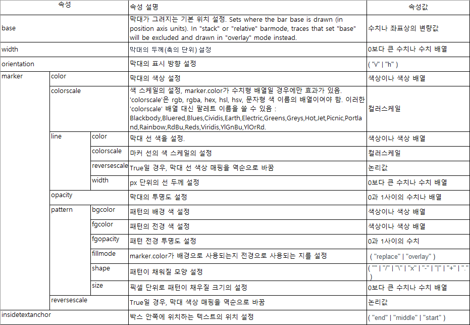
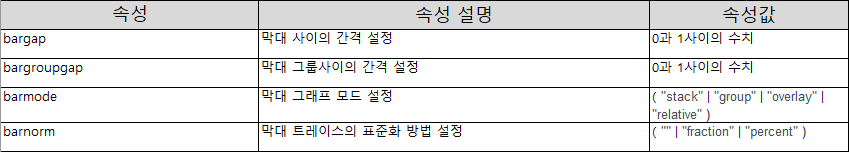
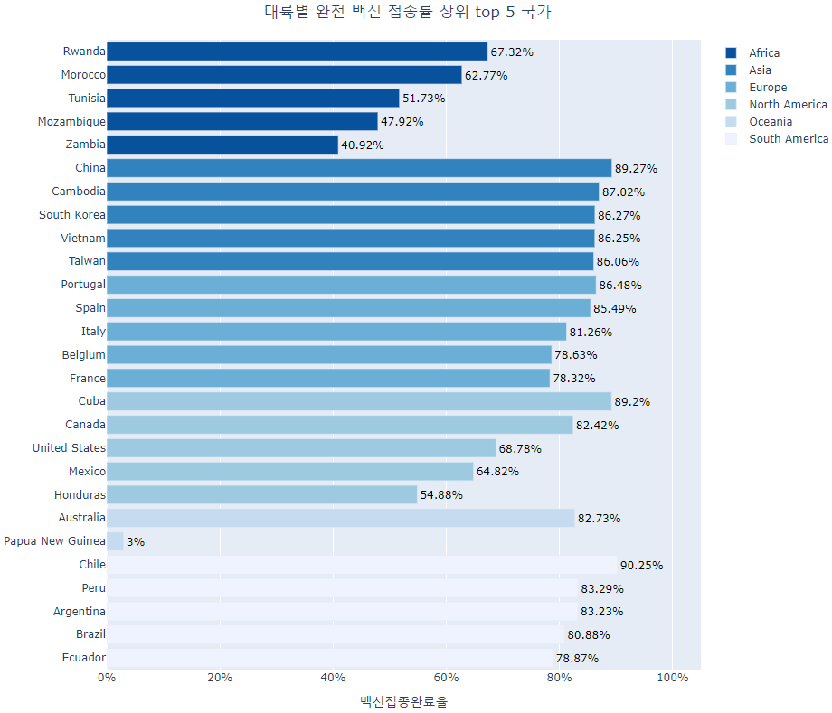
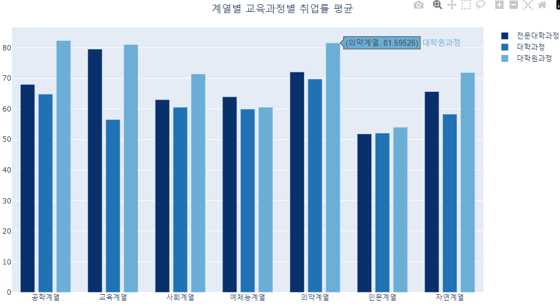
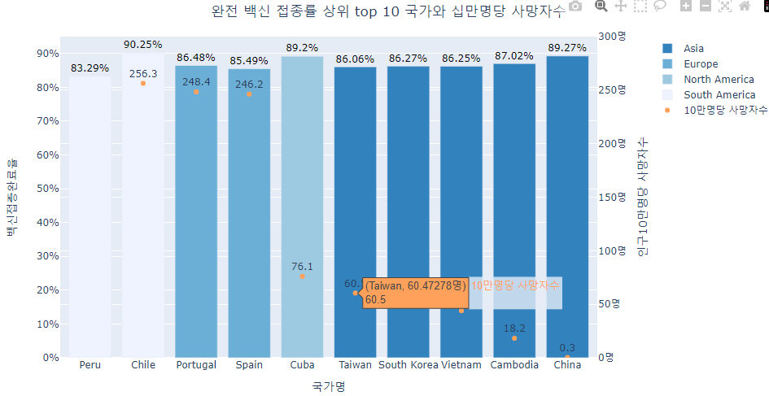
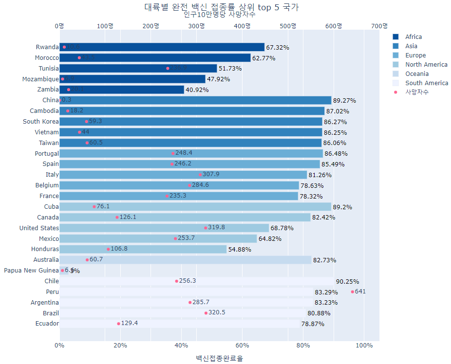
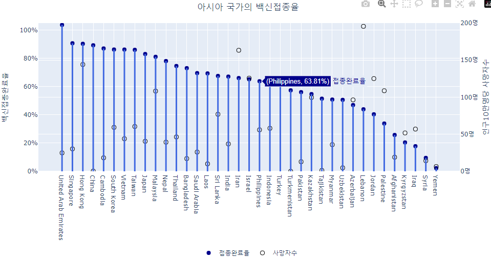
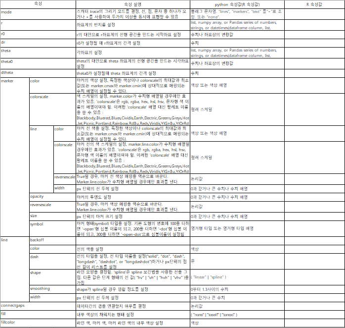
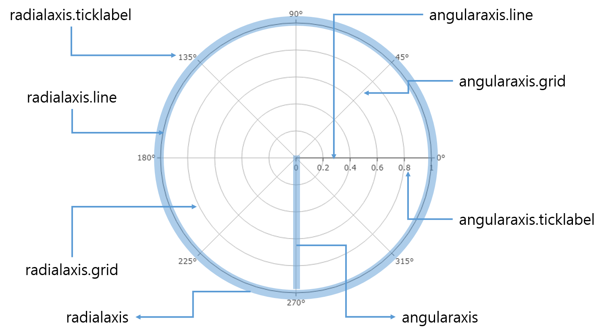
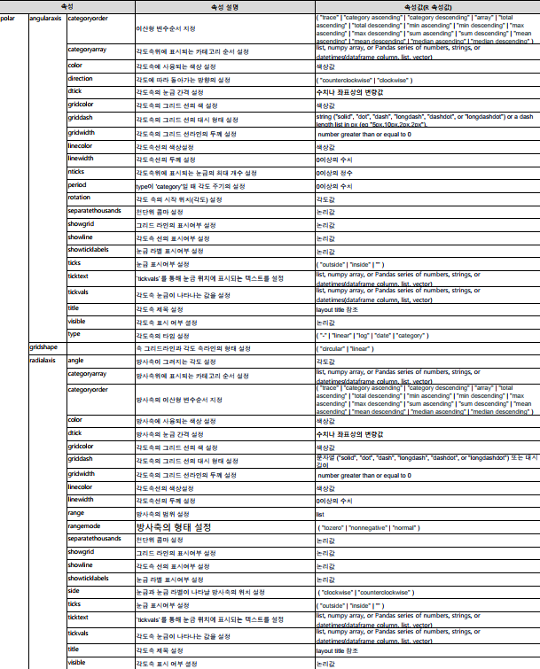

```{r setup, include=FALSE}
knitr::opts_chunk$set(echo = TRUE, message = FALSE, warning = FALSE, fig.width = 6.5, dpi = 130)
library(showtext)
showtext_auto()
library(tidyverse)
library(readxl)
library(patchwork)
library(plotly)

```

```{r echo = FALSE, message = FALSE, warning = FALSE}
df_covid19 <- read_csv(file = "D:/R/git/datavisualization/plotly/RnPy/owid-covid-data_221203.csv",
                            col_types = cols(Date = col_date(format = "%Y-%m-%d")
                                             )
                            )
df_covid19_100 <- df_covid19 |> 
  filter(iso_code %in% c('KOR', 'OWID_ASI', 'OWID_EUR', 'OWID_OCE', 'OWID_NAM', 'OWID_SAM', 'OWID_AFR')) |>
  filter(date >= max(date) - 100) |>
  mutate(location = case_when(
    location == 'South Korea' ~ '한국', 
    location == 'Asia' ~ '아시아', 
    location == 'Europe' ~ '유럽', 
    location == 'Oceania' ~ '오세아니아', 
    location == 'North America' ~ '북미', 
    location == 'South America' ~ '남미', 
    location == 'Africa' ~ '아프리카')) |>
  mutate(location = fct_relevel(location, '한국', '아시아', '유럽', '북미', '남미', '아프리카', '오세아니아')) |>
  arrange(date)

df_covid19_100_wide <- df_covid19_100 |>
  select(date, location, new_cases, people_fully_vaccinated_per_hundred) |>
  rename('date' = 'date', '확진자' = 'new_cases', '백신접종완료자' = 'people_fully_vaccinated_per_hundred') |>
  pivot_wider(id_cols = date, names_from = location, 
              values_from = c('확진자', '백신접종완료자')) |>
  arrange(date)

df_covid19_stat <- df_covid19 |> 
  group_by(iso_code, continent, location) |>
  summarise(인구수 = max(population, na.rm = T), 
            인당GDP = max(gdp_per_capita, na.rm = T),
            전체확진자수 = sum(new_cases, na.rm = T),
            전체사망자수 = sum(new_deaths, na.rm = T), 
            십만명당중환자실 = last(icu_patients_per_million),
            재생산지수 = last(reproduction_rate),
            봉쇄지수 = max(stringency_index, na.rm = T), 
            전체검사자수 = max(total_tests, na.rm = T), 
            신규검사자수 = sum(new_tests, na.rm = T),
            전체백신접종자수 = max(total_vaccinations, na.rm = T),
            백신접종자완료자수 = max(people_fully_vaccinated, na.rm = T),
            부스터접종자수 = max(total_boosters, na.rm = T),
            인구백명당백신접종완료율 = max(people_fully_vaccinated_per_hundred, na.rm = T),
            인구백명당부스터접종자수 = max(total_boosters_per_hundred, na.rm = T)
            ) |> 
    ungroup() |>
    mutate(십만명당사망자수 = round(전체사망자수 / 인구수 *100000, 5),
           백신접종완료율 = 백신접종자완료자수 / 인구수)

margins <- list(t = 50, b = 25, l = 25, r = 25)


```

```{r echo = FALSE, message = FALSE, warning = FALSE}
## R 코드

df_취업률 <- read_excel('d:/R/data/2020년 학과별 고등교육기관 취업통계.xlsx', 
                     ## '학과별' 시트의 데이터를 불러오는데,
                     sheet = '학과별',
                     ## 앞의 13행을 제외하고
                     skip = 13, 
                     ## 첫번째 행은 열 이름으로 설정
                     col_names = TRUE, 
                     ## 열의 타입을 설정, 처음 9개는 문자형으로 다음 79개는 수치형으로 설정
                     col_types = c(rep('text', 9), rep('numeric', 79)))

## df_취업률에서 첫번째부터 9번째까지의 열과 '계'로 끝나는 열을 선택하여 다시 df_취업률에 저장
df_취업률 <- df_취업률 |> 
  select(1:9, ends_with('계'), '입대자')

## df_취업률에서 졸업자가 500명 이하인 학과 2000개 샘플링
df_취업률_500 <- df_취업률 |> 
  filter(졸업자_계 < 500) |>
  mutate(id = row_number()) |>
  filter(row_number() %in% seq(from = 1, to = nrow(df_취업률), by = 4))

## 열 이름을 적절히 설정
names(df_취업률_500)[10:12] <- c('졸업자수', '취업률', '취업자수')

```

```{python echo = FALSE, message = FALSE, warning = FALSE, eval = FALSE}
import pandas as pd
from datetime import datetime, timedelta
from pandas.api.types import CategoricalDtype
from matplotlib import pyplot as plt
import plotly.graph_objects as go

df_covid19 = pd.read_csv("D:/R/git/datavisualization/plotly/RnPy/owid-covid-data_221203.csv")

df_covid19['date'] = pd.to_datetime(df_covid19['date'], format="%Y-%m-%d")

df_covid19_100 = df_covid19[(df_covid19['iso_code'].isin(['KOR', 'OWID_ASI', 'OWID_EUR', 'OWID_OCE', 'OWID_NAM', 'OWID_SAM', 'OWID_AFR'])) & (df_covid19['date'] >= (max(df_covid19['date']) - timedelta(days = 100)))]


df_covid19_100.loc[df_covid19_100['location'] == 'South Korea', "location"] = '한국'
df_covid19_100.loc[df_covid19_100['location'] == 'Asia', "location"] = '아시아'
df_covid19_100.loc[df_covid19_100['location'] == 'Europe', "location"] = '유럽'
df_covid19_100.loc[df_covid19_100['location'] == 'Oceania', "location"] = '오세아니아'
df_covid19_100.loc[df_covid19_100['location'] == 'North America', "location"] = '북미'
df_covid19_100.loc[df_covid19_100['location'] == 'South America', "location"] = '남미'
df_covid19_100.loc[df_covid19_100['location'] == 'Africa', "location"] = '아프리카'

ord = CategoricalDtype(categories = ['한국', '아시아', '유럽', '북미', '남미', '아프리카', '오세아니아'], ordered = True)

df_covid19_100['location'] = df_covid19_100['location'].astype(ord)

df_covid19_100 = df_covid19_100.sort_values(by = 'date')

df_covid19_100_wide = df_covid19_100.loc[:,['date', 'location', 'new_cases', 'people_fully_vaccinated_per_hundred']].rename(columns={'new_cases':'확진자', 'people_fully_vaccinated_per_hundred':'백신접종완료자'})

df_covid19_100_wide = df_covid19_100_wide.pivot(index='date', columns='location', values=['확진자', '백신접종완료자']).sort_values(by = 'date')

df_covid19_100_wide.columns = ['확진자_한국', '확진자_아시아', '확진자_유럽', '확진자_북미', '확진자_남미', '확진자_아프리카','확진자_오세아니아',
                              '백신접종완료자_한국', '백신접종완료자_아시아', '백신접종완료자_유럽', '백신접종완료자_북미', '백신접종완료자_남미', '백신접종완료자_아프리카','백신접종완료자_오세아니아']
                              
df_covid19_stat = df_covid19.groupby(['iso_code', 'continent', 'location'], dropna=False).agg(
    인구수 = ('population', 'max'),
    전체사망자수 = ('new_deaths', 'sum'), 
    백신접종자완료자수 = ('people_fully_vaccinated', 'max'),
    인구백명당백신접종완료율 = ('people_fully_vaccinated_per_hundred', 'max'),
    인구백명당부스터접종자수 = ('total_boosters_per_hundred', 'max')

).reset_index()

df_covid19_stat['십만명당사망자수'] = round(df_covid19_stat['전체사망자수'] / df_covid19_stat['인구수'] *100000, 5)

df_covid19_stat['백신접종완료율'] = df_covid19_stat['백신접종자완료자수'] / df_covid19_stat['인구수']


######################################   
## python 코드
## 대학 학과 취업률 데이터 셋

df_취업률 = pd.read_excel("d:/R/data/2020년 학과별 고등교육기관 취업통계.xlsx", 
                           sheet_name = '학과별',
                           skiprows=(13), 
                           header = 0)

df_취업률 = pd.concat([df_취업률.iloc[:, 0:8], 
                    df_취업률.loc[:, df_취업률.columns.str.endswith('계')], 
                    df_취업률.loc[:, '입대자']], 
                   axis = 1
                   )

df_취업률_500 = df_취업률.loc[(df_취업률['졸업자_계'] < 500)]

df_취업률_500 = df_취업률_500.iloc[range(0, len(df_취업률_500.index) , 4)]

df_취업률_500 = df_취업률_500.rename(columns = {'졸업자_계':'졸업자수', '취업률_계':'취업률', '취업자_합계_계':'취업자수'})

```

비교와 구성의 시각화는 데이터를 구성하는 특정 변수의 변량에 따라 데이터 값들간의 순서를 비교하거나 데이터의 구성 비율에 대한 시각화이다. 이 종류의 시각화는 다른 시각화와 다른 두가지 특징이 있다.

첫번째 특징은 시각화 그래프 내에서 한번 더 통계 처리가 필요하다는 특성을 가진다. 보통 비교의 시각화는 데이터에 값에 따라 시각화 한 후 그 값들을 다시 정렬함으로써 시각화를 완성하게 된다. 따라서 데이터 시각화 이전이나 이후에 시각화 대상 데이터나 시각화 객체 에서 정렬과 같은 통계 처리가 한번 더 일어나게 된다.

두번째 특징은 그 관심의 대상이 데이터 자체의 값 보다는 비교되는 대상 내에서의 상대적 위치에 더 쏠려있다는 점이다. 비교되는 대상 중에 가장 값이 크거나 작은 변량이 무엇인지에 관심이 있는 시각화이다. 비교되는 대상들의 상대적 위치가 명확하게 구분되어야 하기 때문에 비교되는 대상들이 명확하게 구분되어야 하고 이 대상들을 명확하게 구분하기 위해 비교를 위한 변수는 이산형 변수를 사용하는 것이 일반적이다.

비교의 시각화에는 막대 그래프가 많이 사용되는데 순위 막대 그래프, 롤리팝 그래프, 도트 그래프 등이 많이 사용되고 구성의 시각화는 파이 차트, 선버스트 차트, 산키 다이어그램등이 많이 사용된다.

# 막대 그래프

막대 그래프는 이산형 데이터 또는 그룹화되어 이산형으로 집계된 데이터들을 막대의 길이를 사용하여 서로 비교하기 위해 사용되는 시각화이다. 공통 기준선에서부터 시작된 직사각형의 막대를 사용하여 각 변량의 데이터를 표현하고 막대의 길이는 데이터 값에 비례한다. 같은 기준선에서 시작한 막대들이기 때문에 막대의 끝나는 위치에 따라 데이터들이 비교될 수 있다. 또 막대의 크기에 따른 데이터의 증감을 비교할 수도 있다.

막대 그래프에는 그 유형에 따라 수직, 수평 막대 그래프, 스택 막대 그래프, 그룹 막대 그래프의 세 가지로 구분된다.

수직, 수평 막대 그래프는 이산형 데이터 각각의 변량에 각각 하나씩의 막대가 표시되는, 우리가 흔히 아는 형태의 막대 그래프이다. 다만 그 막대의 표시 방향에 따라 수직 막대 그래프와 수평 막대 그래프로 나눌 수 있다. 보통 시각화에 사용하는 보고서는 세로 사이즈보다 가로 사이즈가 작은 경우가 많고, 스크롤이 가능한 웹화면이라고 해도 세로 방향 스크롤은 익숙하지만 가로방향 스크롤은 익숙하지 않다. 따라서 막대로 표현해야 할 변량이 많다면 수직막대그래프로 표현할 수 있는 범위에 한계가 있을 수 밖에 없다. 그래서 막대의 폭이 너무 작아지게 되고 X축에 표시되는 축 라벨이 겹치게 되는 현상이 발생할 수 밖에 없다. 따라서 표현해야 할 막대가 많을 경우에는 수평 막대 그래프를 사용하여 아래쪽으로 길게 만들면 막대의 폭도 적절히 설정가능하고 축 라벨도 정상적으로 표현할 수 있다.

```{r echo = FALSE}
p1 <- plot_ly(
  x = c("giraffes", "orangutans", "monkeys"),
  y = c(20, 14, 23),
  name = "SF Zoo",
  type = "bar", color = I('darkblue')
) |> layout(annotations = list(x = 0.5 , y = 1.1, text = "수직 막대 그래프",
                               showarrow = F, xref='paper', yref='paper', xanchor = 'center',
                               font = list(size = 15)), 
            margin = margins)


p2 <- plot_ly(
  y = c("giraffes", "orangutans", "monkeys"),
  x = c(20, 14, 23),
  name = "SF Zoo",
  type = "bar", 
  orientation = 'h', color = I('darkblue')
) |> layout(annotations = list(x = 0.5 , y = 1.1, text = "수평 막대 그래프", 
                               showarrow = F, xref='paper', yref='paper', xanchor = 'center',
                               font = list(size = 15)), 
            margin = margins)


subplot(p1, p2, nrows = 1, margin = 0.1, heights = 1) |>
  layout(showlegend = FALSE)

```

스택 막대 그래프와 그룹 막대 그래프는 X축의 이산형 변수에 매핑된 변량들을 다시 또 다른 변수로 구분해서 막대를 그려야할 때 사용하는 막대 그래프이다. 스택 막대 그래프는 하나의 막대를 또 다른 변수의 변량으로 구분하여 쌓아 올리는 형태로 사용하는 방법이다. 스택 막대 그래프는 하나의 변량에 대한 세부 변수의 구성 비율을 살펴보기 쉽다는 장점이 있다. 따라서 이 방법은 비교를 위한 시각화라기 보다는 구성을 위한 시각화로 볼 수 있다. 반면 그룹 막대 그래프는 X축의 하나의 변량에 해당하는 또 다른 변수의 변량 만큼의 막대를 묶어 그려주는 방법이다. 따라서 이 방법은 X축의 주 변량을 구성하는 세부 변량의 크기들을 서로 비교할 수 있고 주 변량의 세부 변량들끼리도 비교할 수 있다는 장점이 있지만 구성을 비교하기 어렵다는 단점도 있다.

```{r echo = FALSE}
library(patchwork)
Animals <- c("giraffes", "orangutans", "monkeys", "giraffes", "orangutans", "monkeys")
location <- c(rep('SF_Zoo', 3), rep('LA_Zoo', 3))
value <- c(20, 14, 23, 12, 18, 29)
data <- data.frame(Animals, location, value)

fig1 <- data |> ggplot() +
  geom_bar(aes(x = Animals, y = value, fill = location), position="stack", stat="identity") +
  scale_fill_brewer(palette = "Blues") +
  scale_x_discrete(expand = c(0, 0)) +
  scale_y_continuous(expand = c(0, 0)) +
  theme(panel.background = element_rect(fill = 'white'), axis.line.x = element_line(color = 'black'), 
        legend.position = 'none', plot.title = element_text(vjust = 0.5, hjust = 0.5)) +
  labs(x = '', y= '', title = '스택 막대 그래프')

fig2 <- data |> ggplot() +
  geom_bar(aes(x = Animals, y = value, fill = location), position="dodge", stat="identity") +
  scale_fill_brewer(palette = "Blues") +
  scale_x_discrete(expand = c(0, 0)) +
  scale_y_continuous(expand = c(0, 0)) +
  theme(panel.background = element_rect(fill = 'white'), axis.line.x = element_line(color = 'black'), 
        legend.position = 'none', plot.title = element_text(vjust = 0.5, hjust = 0.5)) +
  labs(x = '', y= '', title = '그룹 막대 그래프')

fig1 + fig2
```

막대 그래프를 그릴때는 다음과 같이 몇 가지 주의해아할 점이 있다.

막대 사이의 간격을 잘 설정해야 한다. 앞 장에서 설명한 히스토그램은 일반적으로 연속형 변수에 대한 막대 그래프이기 때문에 그 간격을 설정하지 않는다. 그 사이의 간격이 마치 연속형 변수에서 데이터가 없는 구간으로 오해될 수 있기 때문이다. 하지만 막대 그래프는 이산형 데이터에 대한 그래프이기 떄문에 각각의 이산형 변량들을 구분하기 위해 적절한 간격을 두어야 한다. 이 간격을 만들떄는 너무 좁은 간격을 두면 얼핏 보았을 때 데이터 변량의 구분이 어려울 수 있고 너무 넓으면 데이터 간격이 넓어 데이터의 비교에 어려움이 따를 수 있다. 보통 엑셀에서 자동적으로 생성되는 막대 그래프는 막대 너비의 30\~40%의 여백을 둔다고 한다.

막대 그래프는 데이터의 비교를 쉽게 하기 위해 막대의 크기대로 정렬하는 것이 좋다. 하지만 이산형 변수의 변량값 자체에 의미가 있는 경우는 정렬하지 않는 경우도 많이 있다. 예를 들어 이산형 변수가 1부터 5까지 중에 선택하는 리커르트 척도나 년도, 월과 같은 시간의 경우처럼 이산형 변수 자체의 순서가 있는 경우는 정렬하지 않는다.

막대의 기준선은 0부터 시작한다. 많은 경우 0부터 시작하는 막대 그래프들의 크기 비교가 쉽지 않을 경우 기준선을 옮김으로써 비교가 도드라지게 시각화하는 경우가 있다. 예를 들어 어떤 두 개의 데이터가 하나는 98%, 하나는 99%라면 두 개의 막대 길이를 비교하기란 쉽지 않다. 그래서 기준선을 95%로 설정한다면 쉽게 비교될 수는 있겠지만 그 차이 때문에 사용자는 고작 1%의 차이를 매우 큰 차이로 오해하기 쉽다.

막대 그래프에서 트레이스는 막대로 표현하고자 하는 하나의 이산형 변수를 표현한다. 수평 막대 그래프나 수직 막대 그래프는 단일 이산형 변수에 따른 연속형 변수의 표현에 사용되기 때문에 하나의 bar 트레이스로 표현이 가능하다. 하지만 스택 막대 그래프나 그룹 막대 그래프는 이산형 변수를 추가하기 때문에 bar 트레이스를 추가하여야 한다.

`plotly`에서 막대 그래프를 그리기 위해서는 bar 트레이스를 사용한다. R에서는 `add_bars()`나 `add_trace(type = 'bars')`를 사용하고 python에서는 `plotly.graph_objects.Bar()`나 `plotly.express.bar()`를 사용한다. 스택 막대 그래프나 그룹 막대 그래프의 경우는 추가적인 bar 트레이스를 `add_trace()`로 추가한 후 'layout' 속성의 'barmode'를 'stack'이나 'group'을 설정하여 스택 막대 그래프나 그룹 막대 그래프를 그릴 수 있다.

다음은 bar 트레이스에서 사용하는 주요 속성이다.



다음은 bar 트레이스에서 사용되는 'layout'의 주요속성이다.



### 수직 막대 그래프

다음의 코드는 대학의 계열별 취업률의 평균에 대한 수직 막대 그래프를 그리는 R과 python의 코드이다. 대학의 계열은 총 7개의 이산형 변수이고 취업률은 0에서부터 100까지의 연속형 변수이다. 따라서 X축에는 대학의 계열을 매핑시키고 Y축에 취업률을 매핑시키는 bar 트레이스로 그릴 수 있다. 여기에 데이터를 표시하기 위해 'text' 속성과 'textposition' 속성을 설정하였다. 또 Y축에 매핑되는 데이터는 백분률 데이터이기 때문에 'ticksuffix' 속성을 사용하여 눈금 라벨의 접미어를 '%'로 설정하였다.

-   R

```{r}
margins_R = list(t = 50, b = 25, l = 25, r = 25)

df_취업률 |> group_by(대계열) |>
  summarise(취업률 = round(mean(취업률_계), 1)) |> plot_ly() |>
  add_trace(type = 'bar', x = ~대계열, y = ~취업률, 
            text = ~취업률, textposition = 'inside') |>
  layout(title = '계열별 취업률 평균', 
         yaxis = list(ticksuffix = '%'),
         margin = margins_R)

```

-   python

```{python eval = FALSE}
df_취업률_대계열평균 = df_취업률.groupby('대계열').agg(취업률 = ('취업률_계', 'mean'))
fig = go.Figure()

fig.add_trace(go.Bar(
    x = df_취업률_대계열평균.index,
    y = df_취업률_대계열평균['취업률'], 
    text = round(df_취업률_대계열평균['취업률'], 1), 
    textposition = 'inside'
))
fig.update_layout(title = dict(text = '계열별 취업률 평균', x = 0.5), 
                 yaxis = dict(ticksuffix = '%'))
fig.show()
```


## 정렬 막대 그래프

비교를 위해 사용하는 막대 그래프는 특정한 이산형 변수에 의한 비교 데이터를 정렬한 후에 가장 높은 순서부터 혹은 가장 낮은 순서부터 그릴 때 가장 효과가 큰 시각화가 된다. 앞의 취업률 막대그래프와 같이 비교에 사용되는 변수의 변량이 많지 않은 경우는 따로 정렬을 하지 않아도 데이터의 크기를 비교하기 쉽지만 사용되는 변수의 변량이 많은 경우는 데이터 크기를 비교하기 어렵다. 이럴 경우에는 막대의 순서를 데이터의 크기별로 정렬해 주는 것이 데이터를 비교하는데 효과적이다. 이렇게 막대의 순서를 정렬해주기 위해서는 데이터 자체의 순서를 정렬한 후 막대 그래프를 그리는 방법도 있고 `plotly`에서 제공하는 막대 정렬 속성을 사용하는 방법이 있다.

`plolty`의 bar 트레이스에서 막대의 순서를 정렬하기 위해서는 'categoryorder'를 사용할 수 있다. 'categoryorder'에는 여러가지 속성값이 있는데 'total ascending'과 'total descending'는 전체 데이터의 오름차순과 내림차순으로 정렬, 'category ascending'과 'category descending'은 변량의 이름으로 정렬, 'array'는 사용자가 원하는 정렬 순서를 'categoryarray' 속성을 사용해서 지정해줄 수 있다.

코로나19 데이터 셋에서 인구 100명당 완전 백신 접종자의 수가 가장 많은 10개의 국가를 시각화하기 위해서는 먼저 인구 100명당 완전 백신 접종자를 내림차순으로 정렬하고 이중 상위 10개국에 대해 막대 그래프를 그리는 R과 python 코드는 다음과 같다. 여기서 인구수가 너무 적은 국가는 백신접종률에 의미가 떨어지기 때문에 인구수가 천만명 이상의 국가를 대상으로 하였고, 'texttemplate'를 사용하여 표시되는 데이터에'%'를 붙여주었고 정렬을 위해 'categoryorder'를 'total desceding'으로 설정하여 정렬하였다.

-   R

```{r eval=FALSE, fig.cap='데이터가 정렬된 막대그래프'}
vaccine_top10 <- df_covid19_stat |>
  filter(인구수 > 10000000) |>
  top_n(10, 인구백명당백신접종완료율)

vaccine_top10 |> 
  plot_ly() |>
  add_trace(type = 'bar', 
            x = ~location, 
            y = ~인구백명당백신접종완료율,
            color = ~continent, text = ~인구백명당백신접종완료율, 
            textposition = 'outside', texttemplate = '%{text}%', 
            textfont = list(color = 'black')) |>
  layout(title = '완전 백신 접종률 상위 top 10 국가', 
         xaxis = list(title = '국가명', categoryorder = 'total descending'), 
         yaxis = list(title = '백신접종완료율', 
                      ticksuffix = '%'), 
         margin = margins_R)

```

```{r fig.cap='데이터가 정렬된 막대그래프', echo=FALSE}
vaccine_top10 <- df_covid19_stat |>
  filter(인구수 > 10000000) |>
  top_n(10, 인구백명당백신접종완료율)

vaccine_top10 |> 
  plot_ly() |>
  add_trace(type = 'bar', 
            x = ~location, y = ~인구백명당백신접종완료율,
            color = ~continent, colors = RColorBrewer::brewer.pal(6, 'Blues')[6:2], 
            text = ~인구백명당백신접종완료율, textposition = 'outside', texttemplate = '%{text}%', 
            textfont = list(color = 'black')
            ) |>
  layout(title = '완전 백신 접종률 상위 top 10 국가', 
         xaxis = list(title = '국가명', categoryorder = 'total descending'), 
         yaxis = list(title = '백신접종완료율', 
                      ticksuffix = '%'), 
         margin = margins_R)

```

-   python

python에서는 앞서 scatter 트레이스에서와 마찬가지로 색상을 지정하는 'color' 속성에 배열이나 리스트를 설정할 수 없다. 따라서 `for` 루프를 사용하여 각각의 대륙별로 색상을 지정한 bar 트레이스를 추가하는 형태로 코딩해야 한다.

```{python eval = FALSE}
vaccine_top10 = df_covid19_stat.loc[df_covid19_stat['인구수'] > 10000000].sort_values(by=['인구백명당백신접종완료율'], ascending=False).head(10)
margins_P = dict(t = 50, b = 25, l = 25, r = 25)

fig = go.Figure()

for continent, group in vaccine_top10.groupby('continent'):
    fig.add_trace(go.Bar(
        x = group['location'], y = group['인구백명당백신접종완료율'], 
        name = continent,
        text = group['인구백명당백신접종완료율'], textposition = 'outside', texttemplate = '%{text}%', 
        textfont = dict(color = 'black')
    ))
fig.update_layout(title = dict(text = '완전 백신 접종률 상위 top 10 국가', x = 0.5), 
         xaxis = dict(title = '국가명', categoryorder = 'total descending'), 
         yaxis = dict(title = '백신접종완료율', 
                      ticksuffix = '%'), 
         margin = margins_P)

fig.show()

```

```{python eval = FALSE, echo = FALSE}

colors = {'South America':"#EFF3FF", 'Oceania':'#C6DBEF', 'North America':'#9ECAE1', 'Europe':'#6BAED6', 'Asia':'#3182BD', 'Africa':'#08519C'}
fig = go.Figure()

for continent, group in vaccine_top10.groupby('continent'):
    fig.add_trace(go.Bar(
        x = group['location'], y = group['인구백명당백신접종완료율'], 
        name = continent,
        marker_color = colors[continent],
        text = group['인구백명당백신접종완료율'], textposition = 'outside', texttemplate = '%{text}%', 
        textfont = dict(color = 'black')
    ))
fig.update_layout(title = dict(text = '대륙별 완전 백신 접종률 상위 top 5 국가', x = 0.5),
         xaxis = dict(title = '국가명', categoryorder = 'total descending'), 
         yaxis = dict(title = '백신접종완료율', 
                      ticksuffix = '%'), 
       margin = dict(t = 50, b = 25, l = 25, r = 25))

fig.show()

```


## 수평 막대 그래프

앞서 살펴본 전세계 국가 중 백신 접종률 top 10은 백신 접종의 전체 현황은 살펴볼 수 있지만 각 대륙별 현황은 알아보기 어렵다. 이렇게 비교가 필요한 그룹간의 데이터를 비교하기 위해서는 각 그룹별로 상위 혹은 하위 데이터를 먼저 전처리 한 후 이 데이터를 사용해 시각화하는 방법을 사용해야 한다. 이번에는 각 대륙별로 그룹화된 백신 접종률 top 5를 비교해보자.

이를 위해서는 먼저 데이터를 전처리해야 한다. 각 대륙별로 그룹화하여 이 그룹별로 top 5를 산출해준다. 이 시각화는 앞선 시각화와는 몇 가지 차이가 있는데 가장 큰 차이는 수평 막대 그래프라는 점이다. 각 대륙별 top 5를 산출하면 6 대륙의 5개 국가이기 때문에 30개 국가가 산출되게 된다. 하지만 앞서와 같이 인구수가 너무 작은 국가를 제외하다보니 오세아니아 대륙은 1개 국가만이 필터링되어 총 26개국이 나오게 된다. 이렇게 많은 막대를 표현하기에는 좌우 폭은 너무 좁다. 따라서 앞서 설명한 바와 같이 표현되는 변량의 수가 많은 막대 그래프는 수평 막대 그래프로 표현하는 것이 효과적이다.

`plolty`에서 수평 막대 그래프를 그리기 위해서는 bar 트레이스 속성의 'orientation'을 'v'로 설정해야 한다. 또 이산형 변수를 Y축에 매핑시키고 연속형 변수를 X축에 매핑시켜 일반적인 막대 그래프의 매핑과 반대로 설정해야 한다.

또 하나의 차이는 각 대륙별로 그룹화하기 위해 하나의 추가적 열을 생성하였다. `plotly`에서는 두 개의 열에 대한 정렬을 사용할 수 없기 때문에 시각화할 순서를 미리 정해주는 순차 번호가 기록되는 열이다. 이 번호를 사용하여 국가를 정렬함으로써 대륙별 백신 접종률의 상위 top 5 국가들에 대한 시각화가 완성된다. 이 순차 번호 열을 Y축에 매핑했기 때문에 Y축에 표시되는 문자열을 설정하기 위해 'ticktext'와 'tickvals' 속성을 설정하였다. 또 X축에 여유를 주기 위해 'layout'의 'xaxis'를 0부터 105까지로 설정하였고, Y축에 눈금 라벨을 설정하기 위해 'tickvals'와 'ticktext'를 설정하였다.

-   R

```{r eval = FALSE}
vaccine_top5_by_continent <- df_covid19_stat |>
  filter(인구수 > 10000000, !is.na(continent)) |>
  group_by(continent) |>
  top_n(5, 인구백명당백신접종완료율) |>
  arrange(continent, desc(인구백명당백신접종완료율)) |>
  ungroup() |>
  mutate(seq = as.factor(seq(1:n())))

vaccine_top5_by_continent |> 
  plot_ly() |>
  add_trace(type = 'bar', 
            y = ~seq, x = ~인구백명당백신접종완료율,
            color = ~continent, 
            text = ~인구백명당백신접종완료율, textposition = 'outside', texttemplate = '%{text}%', 
            textfont = list(color = 'black'), 
            orientation = 'v'
            ) |>
  layout(title = '대륙별 완전 백신 접종률 상위 top 5 국가', 
         xaxis = list(title = '백신접종완료율', 
                      ticksuffix = '%', range = c(0, 105)), 
         yaxis = list(title = '', autorange = 'reversed', 
                      tickvals = ~seq,
                      ticktext = ~location), 
         margin = margins_R, 
         size = list(height = 900)
)
```

```{r echo = FALSE, fig.height = 7}
vaccine_top5_by_continent <- df_covid19_stat |>
  filter(인구수 > 10000000, !is.na(continent)) |>
  group_by(continent) |>
  top_n(5, 인구백명당백신접종완료율) |>
  arrange(continent, desc(인구백명당백신접종완료율)) |>
  ungroup() |>
  mutate(seq = as.factor(seq(1:n())))


vaccine_top5_by_continent |> 
  plot_ly() |>
  add_trace(type = 'bar', 
            y = ~seq, x = ~인구백명당백신접종완료율,
            color = ~continent, colors = RColorBrewer::brewer.pal(6, 'Blues')[6:2], 
            text = ~인구백명당백신접종완료율, textposition = 'outside', texttemplate = '%{text}%', 
            textfont = list(color = 'black'), 
            orientation = 'v'
            ) |>
  layout(barmode = 'group', title = '대륙별 완전 백신 접종률 상위 top 5 국가', 
         xaxis = list(title = '백신접종완료율', 
                      ticksuffix = '%', range = c(0, 105)), 
         yaxis = list(title = '', autorange = 'reversed', 
                      tickvals = ~seq,
                      ticktext = ~location), 
         margin = list(r = 100, t = 80), 
         size = list(height = 900)
  )
```

-   python

```{python eval = FALSE}
vaccine_top5_by_continent = df_covid19_stat.loc[df_covid19_stat['인구수'] > 10000000].sort_values(by=['continent', '인구백명당백신접종완료율'], ascending=False).groupby('continent').head(5).reset_index()

fig = go.Figure()
colors = {'South America':"#EFF3FF", 'Oceania':'#C6DBEF', 'North America':'#9ECAE1', 'Europe':'#6BAED6', 'Asia':'#3182BD', 'Africa':'#08519C'}

for continent, group in vaccine_top5_by_continent.groupby('continent'):
    fig.add_trace(go.Bar(
        y = group['location'], x = group['인구백명당백신접종완료율'], 
        name = continent,
        text = group['인구백명당백신접종완료율'], textposition = 'outside', texttemplate = '%{text}%', 
        textfont = dict(color = 'black'), orientation = 'h'
    ))
    
fig.update_layout(title = dict(text = '대륙별 완전 백신 접종률 상위 top 5 국가', x = 0.5),
         xaxis = dict(title = '백신접종완료율', 
                      ticksuffix = '%', range = (0, 105)), 
         yaxis = dict(title = '', autorange = 'reversed'), 
         margin = dict(t = 50, b = 25, l = 25, r = 25), 
                 height = 800)
   
fig.show()

```

```{python eval = FALSE}
vaccine_top5_by_continent = df_covid19_stat.loc[df_covid19_stat['인구수'] > 10000000].sort_values(by=['continent', '인구백명당백신접종완료율'], ascending=False).groupby('continent').head(5).reset_index()

fig = go.Figure()
colors = {'South America':"#EFF3FF", 'Oceania':'#C6DBEF', 'North America':'#9ECAE1', 'Europe':'#6BAED6', 'Asia':'#3182BD', 'Africa':'#08519C'}

for continent, group in vaccine_top5_by_continent.groupby('continent'):
    fig.add_trace(go.Bar(
        y = group['location'], x = group['인구백명당백신접종완료율'], 
        name = continent,
        marker_color = colors[continent],
        text = group['인구백명당백신접종완료율'], textposition = 'outside', texttemplate = '%{text}%', 
        textfont = dict(color = 'black'), orientation = 'h'
    ))
    
fig.update_layout(title = dict(text = '대륙별 완전 백신 접종률 상위 top 5 국가', x = 0.5),
         xaxis = dict(title = '백신접종완료율', 
                      ticksuffix = '%', range = (0, 105)), 
         yaxis = dict(title = '', autorange = 'reversed'), 
         margin = dict(t = 50, b = 25, l = 25, r = 25), height = 800)
   
fig.show()

```



## 그룹 막대 그래프

앞에서 그린 수평 막대 그래프는 대륙별로 그룹화되어 있긴 하지만 전체 데이터를 하나의 데이터프레임으로 만들고 표시될 순서를 열로 만들어 마치 그룹 막대 그래프처럼 보이게 만든 단순 수평 막대 그래프이다. 하지만 그룹 막대 그래프는 일반적으로 긴 형태의 데이터보다는 넓은 형태의 데이터에 적합한 시각화이다. 각각의 열로 표현된 bar 트레이스를 여러개 추가함으로써 그룹 막대 그래프를 그린다.

다음은 대학의 계열에 따른 과정별 그룹 막대 그래프를 그리는 R과 python 코드이다. 우선 그룹 막대 그래프를 그리기 위해서 먼저 긴 형태의 취업률 데이터프레임 중 시각화에 필요한 데이터만으로 그룹화하고 그룹별로 평균값을 산출한다.이 데이터를 다시 넓은 형태로 만들어서 '전문대학과정', '대학과정', '대학원과정'의 세 개의 열을 가지는 넓은 데이터프레임을 만든다. 이 넓은 데이터프레임의 각 열을 Y축으로 매핑하는 세 개의 bar 트레이스를 하나의 `plotly` 객체에 추가해주고 'layout' 속성의 'barmode'를 'group'으로 설정해서 그룹 막대 그래프를 만든다. 추가적으로 'bargroupgap'을 0.2로 설정해주었는데 막대 그룹내의 막대간의 간격을 설정해주었다. 만약 'bargroupgap'이 설정되지 않는다면 막대 그룹 내의 막대들은 서로 붙어서 표현된다. 

-   R

```{r eval = FALSE}
취업률_by_계열 <- df_취업률 |>
  group_by(과정구분, 대계열) |>
  summarise(취업률 = mean(취업률_계)) |>
  pivot_wider(names_from = 과정구분, values_from = 취업률) 
  
fig <- 취업률_by_계열 |> plot_ly()
fig <- fig |> add_trace(type = 'bar', x = ~대계열, y = ~ 전문대학과정, name = '전문대학과정')
fig <- fig |> add_trace(type = 'bar', x = ~대계열, y = ~ 대학과정, name = '대학과정')
fig <- fig |> add_trace(type = 'bar', x = ~대계열, y = ~대학원과정, name = '대학원과정')
fig |> layout(barmode = 'group', bargroupgap = 0.2,
              title = '계열별 교육과정별 취업률 평균',
         margin = margins_R
  )

```

```{r echo = FALSE}
취업률_by_계열 <- df_취업률 |>
  group_by(과정구분, 대계열) |>
  summarise(취업률 = mean(취업률_계)) |>
  pivot_wider(names_from = 과정구분, values_from = 취업률) 
  
fig <- 취업률_by_계열 |> plot_ly()
fig <- fig |> add_trace(type = 'bar', x = ~대계열, y = ~ 전문대학과정, name = '전문대학과정', 
                        marker = list(color =  RColorBrewer::brewer.pal(9, 'Blues')[9]))
fig <- fig |> add_trace(type = 'bar', x = ~대계열, y = ~ 대학과정, name = '대학과정', 
                        marker = list(color =  RColorBrewer::brewer.pal(9, 'Blues')[7]))
fig <- fig |> add_trace(type = 'bar', x = ~대계열, y = ~대학원과정, name = '대학원과정', 
                        marker = list(color =  RColorBrewer::brewer.pal(9, 'Blues')[5]))
fig |> layout(barmode = 'group', bargroupgap = 0.2,
              title = '계열별 교육과정별 취업률 평균',
         margin = list(r = 100, t = 80)
  )

```

-   python

```{python eval = FALSE}
취업률_by_계열 = df_취업률.groupby(['과정구분', '대계열']).agg(취업률 = ('취업률_계', 'mean')).reset_index().pivot(index = '대계열', columns='과정구분', values='취업률')
취업률_by_계열

fig = go.Figure()

fig.add_trace(go.Bar(
    x = 취업률_by_계열.index, 
    y = 취업률_by_계열['전문대학과정'], 
    name = '전문대학과정'))

fig.add_trace(go.Bar(
    x = 취업률_by_계열.index, 
    y = 취업률_by_계열['대학과정'], 
    name = '대학과정'))

fig.add_trace(go.Bar(
    x = 취업률_by_계열.index, 
    y = 취업률_by_계열['대학원과정'], 
    name = '대학원과정'))

fig.update_layout(barmode = 'group', bargroupgap = 0.2,
              title = '계열별 교육과정별 취업률 평균',
                  title_x = 0.5,
         margin = margins_P)

fig.show()

```

```{python eval = FALSE, echo = FALSE}
취업률_by_계열 = df_취업률.groupby(['과정구분', '대계열']).agg(취업률 = ('취업률_계', 'mean')).reset_index().pivot(index = '대계열', columns='과정구분', values='취업률')
취업률_by_계열

fig = go.Figure()

fig.add_trace(go.Bar(
    x = 취업률_by_계열.index, 
    y = 취업률_by_계열['전문대학과정'], 
    name = '전문대학과정', 
    marker_color = '#08306B'
))

fig.add_trace(go.Bar(
    x = 취업률_by_계열.index, 
    y = 취업률_by_계열['대학과정'], 
    name = '대학과정', 
    marker_color = '#2171B5'))

fig.add_trace(go.Bar(
    x = 취업률_by_계열.index, 
    y = 취업률_by_계열['대학원과정'], 
    name = '대학원과정', 
    marker_color = '#6BAED6'))

fig.update_layout(barmode = 'group', bargroupgap = 0.2,
              title = '계열별 교육과정별 취업률 평균',
                  title_x = 0.5,
         margin = margins_p)

fig.show()

```



## 이중 축 막대 그래프

시각화를 하다보면 하나의 그래프에 여러 개의 데이터를 표현해야하는 경우가 많다. 서로 다른 데이터를 표현하는데 서로 동일한 트레이스를 사용할 수도 있고 다른 트레이스를 병합하여 혼용할 수도 있다. 우리가  흔하게 만나는 경우가 막대 그래프와 선그래프를 혼용하는 경우이다. 이렇게 하나 이상의 데이터를 표현하는 경우에는 보통 X, Y축 중 한 축의 스케일은 공유하지만 나머지 한 축은 각각의 데이터에 대한 스케일을 가질 수 있다. 따라서 추가적인 축의 설정이 필요하다. `plotly`에서 기본적으로 설정되는 X축은 'xaxis', Y축은 'yaxis'로 'layout' 속성에서 설정이 가능하다. 여기에 추가적으로 설정하는 축은 뒤에 숫자를 붙여 설정할 수 있다. X축을 추가적으로 설정하려면 'xaxis2', Y축을 추가적으로 설정하려면 'yaxis2'로 설정하고 'layout'에서 세부 속성을 설정한다. 이렇게 설정된 추가 축은 해당 축을 사용하는 trace에 'xaxis'나 'yaxis' 속성에 'layout'에 설정한 추가 축의 이름을 설정하여 서로 참조하도록 매칭한다. ` plotly`에서는 트레이스에서 'xaxis'와 'yaxis'에 'x2', 'y2'로 설정하면 'layout'의 'xaxis2', 'yaxis2'에 매칭되도록 설계되어 있다. 추가적인 축이 표현되는데에는 'overlaying'과 'side'의 두 가지 속성의 설정이 필요하다. 'overlaying'은 기존 디폴트 축과 겹쳐져서 두 번쨰 축이 표시되고 'side'는 표현되는 곳을 지정하도록 하는 방법이다. 

이중 축의 사례를 살펴보기 위해 앞에서 그렸던 완전 백신 접종률 상위 10 국가 막대 그래프에 인구 10만명당 사망자수를 점으로 표시하는 scatter 트레이스를 추가해보도록 하겠다. 백신 접종률의 Y축 스케일은 0%부터 100%까지의 스케일을 가지지만 해당 국가의 인구 10만명당 사망자수는 0.3부터 281까지의 스케일을 가지기 때문에 추가적인 Y축이 필요하게 된다. 따라서 인구 10만명당 사망자수를 표시하는 `add_trace()`의 'yaxis' 속성에 'y2'를 설정하여 추가적인 축을 사용하는 trace로 설정하다. 두번째 Y축의 설정을 위해 'layout' 속성의 'y2'에 해당하는 축에 대한 'yaxis2' 속성을 설정한다. 그리고 `overlaying` 속성에 'y'를 설정하여 Y축에 오버레이되는 축이라는 점을 설정하였고 `side`를 'right'로 설정하여 `yaxis2`가 오른쪽에 표시되도록 설정하였다. 두번째 Y축의 설정으로 인해 범례와의 간격이 좁아졌다. 그래서 범례를 조금 오른쪽으로 옯겨주었다. 

-   R

```{r eval = FALSE}
vaccine_top10 |> 
  plot_ly() |>
  add_trace(type = 'bar',
            x = ~location, y = ~인구백명당백신접종완료율,
            color = ~continent, text = ~인구백명당백신접종완료율, 
            textposition = 'outside', texttemplate = '%{text}%',
            textfont = list(color = 'black')) |>
  add_trace(type = 'scatter', mode = 'markers+text', 
            name = '10만명당 사망자수', yaxis = "y2",
            x = ~location, 
            y = ~십만명당사망자수, text = ~round(십만명당사망자수, 1), 
            textposition = 'top'
            )|>
  layout(title = '완전 백신 접종률 상위 top 10 국가', 
         xaxis = list(title = '국가명', categoryorder = 'total descending'), 
         yaxis = list(title = '백신접종완료율', 
                      ticksuffix = '%'), 
         yaxis2 = list(title = '인구10만명당 사망자수', 
                       side = "right", overlaying = "y",
                       range = c(0, 300), ticksuffix = '명'),
         margin = list(r = 100, t = 50), 
         legend = list(x = 1.1))

```

```{r echo = FALSE}
vaccine_top10 |> 
  plot_ly() |>
  add_trace(type = 'bar',
            x = ~location, y = ~인구백명당백신접종완료율,
            color = ~continent, colors = RColorBrewer::brewer.pal(6, 'Blues')[6:2], 
            text = ~인구백명당백신접종완료율, textposition = 'outside', texttemplate = '%{text}%',
            textfont = list(color = 'black')) |>
  add_trace(type = 'scatter', mode = 'markers+text', 
            name = '사망자수', yaxis = "y2", color = I('black'), 
            x = ~location, 
            y = ~십만명당사망자수, text = ~round(십만명당사망자수, 1), 
            textposition = 'top'
            )|>
  layout(title = '완전 백신 접종률 상위 top 10 국가', 
         xaxis = list(title = '국가명', categoryorder = 'total descending'), 
         yaxis = list(title = '백신접종완료율', 
                      ticksuffix = '%'), 
         yaxis2 = list(title = '인구10만명당 사망자수', 
                       side = "right", overlaying = "y",
                       range = c(0, 300), ticksuffix = '명'),
         margin = list(r = 100, t = 50), 
         legend = list(x = 1.1))

```

-   python

```{python eval = FALSE}
vaccine_top10 = df_covid19_stat.loc[df_covid19_stat['인구수'] > 10000000].sort_values(by=['인구백명당백신접종완료율'], ascending=False).head(10).reset_index()
    
fig = go.Figure()

for 대륙, group in vaccine_top10.groupby('continent'):
    fig.add_trace(go.Bar(
        x = group['location'], y = group['인구백명당백신접종완료율'], 
        name = 대륙,
        text = group['인구백명당백신접종완료율'], textposition = 'outside', texttemplate = '%{text}%', 
        textfont = dict(color = 'black')
    ))

fig.add_trace(go.Scatter(mode = 'markers+text', 
            name = '10만명당 사망자수', yaxis = "y2",
            x = vaccine_top10['location'], 
            y = vaccine_top10['십만명당사망자수'], text = round(vaccine_top10['십만명당사망자수'], 1), 
            textposition = 'top center')
             )
fig.update_layout(title = dict(text = '완전 백신 접종률 상위 top 10 국가와 십만명당 사망자수', x = 0.5), 
         xaxis = dict(title = '국가명', categoryorder = 'total descending'), 
         yaxis = dict(title = '백신접종완료율', 
                      ticksuffix = '%'), 
         yaxis2 = dict(title = '인구10만명당 사망자수', 
                       side = "right", overlaying = "y",
                       range = (0, 300), ticksuffix = '명'),
         margin = dict(r = 100, t = 50), 
         legend = dict(x = 1.1))
         
fig.show()
```

```{python eval = FALSE, echo = FALSE}
vaccine_top10 = df_covid19_stat.loc[df_covid19_stat['인구수'] > 10000000].sort_values(by=['인구백명당백신접종완료율'], ascending=False).head(10).reset_index()
    
fig = go.Figure()

for 대륙, group in vaccine_top10.groupby('continent'):
    fig.add_trace(go.Bar(
        x = group['location'], y = group['인구백명당백신접종완료율'], 
        name = 대륙,
        marker_color = colors[대륙],
        text = group['인구백명당백신접종완료율'], textposition = 'outside', texttemplate = '%{text}%', 
        textfont = dict(color = 'black')
    ))

fig.add_trace(go.Scatter(mode = 'markers+text', 
            name = '10만명당 사망자수', yaxis = "y2",
            x = vaccine_top10['location'], 
            y = vaccine_top10['십만명당사망자수'], text = round(vaccine_top10['십만명당사망자수'], 1), 
            textposition = 'top center')
             )
fig.update_layout(title = dict(text = '완전 백신 접종률 상위 top 10 국가와 십만명당 사망자수', x = 0.5), 
         xaxis = dict(title = '국가명', categoryorder = 'total descending'), 
         yaxis = dict(title = '백신접종완료율', 
                      ticksuffix = '%'), 
         yaxis2 = dict(title = '인구10만명당 사망자수', 
                       side = "right", overlaying = "y",
                       range = (0, 300), ticksuffix = '명'),
         margin = dict(r = 100, t = 50), 
         legend = dict(x = 1.1))
         
fig.show()
```



백신 접종 완료율과 인구 10만명당 사망자수를 동시에 표기해보니 포르투갈, 칠레, 스페인, 아르헨티나는 높은 백신 접종률에도 불구하고 10만명당 200명 이상의 사망자가 나왔다. 하지만 쿠바, 우리나라, 캄보디아, 호주등의 국가는 높은 접종률을 보이면서 10만명당 사망자수도 낮게 나타난다.

앞서 그렸던 대륙별 완전 백신 접종률 상위 top 5 국가에 인구 10만명당 사망률을 추가적으로 표시하고 축을 추가하는 방법은 다음과 같다.

-   R

```{r eval = FALSE}
vaccine_top5_by_continent |> 
  plot_ly() |>
  add_trace(type = 'bar', 
            y = ~seq, x = ~인구백명당백신접종완료율,
            color = ~continent, 
            text = ~인구백명당백신접종완료율, textposition = 'outside', texttemplate = '%{text}%', 
            textfont = list(color = 'black'), 
            orientation = 'v'
            ) |>
  add_trace(type = 'scatter', mode = 'markers+text', 
            name = '사망자수', xaxis = "x2",
            y = ~seq, x = ~십만명당사망자수, color = I('black'),
            text = ~round(십만명당사망자수, 1), 
            textposition = 'middle right'
            )|>
  layout(barmode = 'group', 
         title = list(text = '대륙별 완전 백신 접종률 상위 top 5 국가', 
                      y = 0.97, yref = 'container'), 
         xaxis = list(title = '백신접종완료율', range = c(0, 105), 
                      ticksuffix = '%'), 
         yaxis = list(title = '', autorange = 'reversed', 
                      tickvals = ~seq,
                      ticktext = ~location), 
         xaxis2 = list(title = list(text = '인구10만명당 사망자수', 
                                    standoff = 1), 
                       side = "top",
                       overlaying = "x",
                       range = c(0, 700), 
                      ticksuffix = '명'),
         margin = list(r = 100, t = 80), 
         size = list(height = 900)
         )
```

```{r echo = FALSE, fig.height = 7}
vaccine_top5_by_continent |> 
  plot_ly() |>
  add_trace(type = 'bar', 
            y = ~seq, x = ~인구백명당백신접종완료율,
            color = ~continent, colors = RColorBrewer::brewer.pal(6, 'Blues')[6:2], 
            text = ~인구백명당백신접종완료율, textposition = 'outside', texttemplate = '%{text}%', 
            textfont = list(color = 'black'), 
            orientation = 'v'
            ) |>
  add_trace(type = 'scatter', mode = 'markers+text', 
            name = '사망자수', xaxis = "x2",
            y = ~seq, x = ~십만명당사망자수, color = I('black'),
            text = ~round(십만명당사망자수, 1), 
            textposition = 'middle right'
            )|>
  layout(barmode = 'group', 
         title = list(text = '대륙별 완전 백신 접종률 상위 top 5 국가', 
                      y = 0.97, yref = 'container'), 
         xaxis = list(title = '백신접종완료율', range = c(0, 105), 
                      ticksuffix = '%'), 
         yaxis = list(title = '', autorange = 'reversed', 
                      tickvals = ~seq,
                      ticktext = ~location), 
         xaxis2 = list(title = list(text = '인구10만명당 사망자수', 
                                    standoff = 1), 
                       side = "top",
                       overlaying = "x",
                       range = c(0, 700), 
                      ticksuffix = '명'),
          margin = list(r = 100, t = 80))

```

-   python

```{python eval = FALSE}
fig = go.Figure()
for continent, group in vaccine_top5_by_continent.groupby('continent'):
    fig.add_trace(go.Bar(
        y = group['location'], x = group['인구백명당백신접종완료율'], 
        name = continent,
        text = group['인구백명당백신접종완료율'], textposition = 'outside', texttemplate = '%{text}%', 
        textfont = dict(color = 'black'), orientation = 'h'
    ))
fig.add_trace(go.Scatter(mode = 'markers+text', 
    xaxis = "x2",
    name = '사망자수',
    x = vaccine_top5_by_continent['십만명당사망자수'], 
    y = vaccine_top5_by_continent['location'], text = round(vaccine_top5_by_continent['십만명당사망자수'], 1), 
    textposition = 'middle right')
    )
    
fig.update_layout(title = dict(text = '대륙별 완전 백신 접종률 상위 top 5 국가', x = 0.5),
         xaxis = dict(title = '백신접종완료율', 
                      ticksuffix = '%', range = (0, 105)),
         xaxis2 = dict(title = dict(text = '인구10만명당 사망자수', standoff = 1), 
                       side = "top", overlaying = "x",
                       range = (0, 700), ticksuffix = '명'),
         yaxis = dict(title = '', autorange = 'reversed'), 
         margin = dict(r = 100, t = 80), 
                 height = 800)

```

```{python eval = FALSE, echo = FALSE}
fig = go.Figure()
for continent, group in vaccine_top5_by_continent.groupby('continent'):
    fig.add_trace(go.Bar(
        y = group['location'], x = group['인구백명당백신접종완료율'], 
        name = continent,
        text = group['인구백명당백신접종완료율'], textposition = 'outside', texttemplate = '%{text}%', 
        textfont = dict(color = 'black'), orientation = 'h'
    ))
fig.add_trace(go.Scatter(mode = 'markers+text', 
    xaxis = "x2",
    name = '사망자수',
    x = vaccine_top5_by_continent['십만명당사망자수'], 
    y = vaccine_top5_by_continent['location'], text = round(vaccine_top5_by_continent['십만명당사망자수'], 1), 
    textposition = 'middle right')
    )
    
fig.update_layout(title = dict(text = '대륙별 완전 백신 접종률 상위 top 5 국가', x = 0.5),
         xaxis = dict(title = '백신접종완료율', 
                      ticksuffix = '%', range = (0, 105)),
         xaxis2 = dict(title = dict(text = '인구10만명당 사망자수', standoff = 1), 
                       side = "top", overlaying = "x",
                       range = (0, 700), ticksuffix = '명'),
         yaxis = dict(title = '', autorange = 'reversed'), 
         margin = dict(r = 100, t = 80), 
                 height = 800)

```



# 롤리팝 그래프

보통 우리가 보는 시각화는 인쇄물 형태이던 웹 브라우저 등의 모니터 화면으로 보던 좌우의 확장보다는 상하의 확장에 더 유연하다. 따라서 좌우로 표현되어야 하는 막대가 많이지면 앞서와 같이 상하 확정을 사용하는 수평형 막대 그래프를 사용한다. 하지만 한눈에 보이는 추세와 비교를 같이 표시하기 위해서는 세로로 긴 형태가 적절치 않은 경우가 있다. 따라서 막대의 너비를 최소화한 직선의 형태로 표현한 막대 그래프를 롤리팝 그래프라고 한다. 

롤리팝 그래프는 막대사탕의 상품명에서 유래된 그래프이다. 막대 그래프와 유사하지만 그 표현을 막대가 아닌 막대 사탕처럼 점과 직선을 사용하여 표현한다는데에서 유래했다. 점으로 표시된 데이터 점으로부터 축까지를 선으로 이어 데이터를 표현하는 방식의 그래프이다.

`plotly`에서는 이 롤리팝 그래프를 트레이스로 제공하지는 않는다. 따라서 롤리팝 그래프를 그리기 위해서는 scatter 트레이스의 'markers'와 scatter 트레이스의 선이 아닌 도형으로서의 선을 축까지 그려줌으로서 만들 수 있다. 점을 그리는 scatter 트레이스는 R과 python이 유사한 방법을 사용하지만 선 도형을 넣는 것은 다소 차이가 있다. 다음은 앞서 아시아 지역 국가들의 십만명당 사망자수가 표현된 대륙별 백신접종율을 롤리팝 그래프로 그린 R과 python 코드이다. 

-   R

R에서 도형으로서의 선은 `add_segments()`를 사용하거나 `add_annotations()`의 type 속성을 'line'으로 설정하여 그릴 수 있다. 롤리팝 그래프를 그리기 위해서 먼저 데이터를 전처리하였다. 아시아 지억 데이터로 필터링하였고 인구수도 5백만명 이상의 국가로 한정하였다. 이 후 `plotly` 객체를 초기화하였는데 모든 트레이스에서 공통적으로 사용하는 X축 매핑을 `plot_ly()`에 넣어주어 추가되는 트레이스에 중복적으로 설정되는 현상을 방지하였다. 다음으로 `add_segments()`로 수직선을 만들어주는데 'xend'는 X축에 매핑되는 값고 동일하게 하였고 Y축에 매핑되는 값은 선의 시작점인 'y'를 국가별 인구 백명당접종완료율로, 선의 끝점인 'yend'는 0로 Y축까지 선이 그어지도록 설정하였다. 여기에 scatter 트레이스로 접종완료율과 십만명당 사망자수를 점으로 표시하였다. 마지막으로 'layout'을 설정하는데 'title', 'yaxis', 'xaxis', 'yaxis2', 'margin', 'legend' 속성을 설정하였다. 


```{r}
df_lolipop <- df_covid19_stat |>
  filter(인구수 > 5000000, continent == 'Asia') |>
  arrange(desc(인구백명당백신접종완료율))

df_lolipop |> 
  plot_ly(x = ~reorder(location, desc(인구백명당백신접종완료율))) |>
  add_segments(xend = ~reorder(location, desc(인구백명당백신접종완료율)),
               y = ~인구백명당백신접종완료율, 
               yend = 0, color = I('gray'), 
               showlegend = FALSE
               ) |>
  add_trace(type = 'scatter', mode = 'markers', name = '접종완료율',
            y = ~인구백명당백신접종완료율, color = I('darkblue')) |>
  add_trace(type = 'scatter', mode = 'markers', 
            symbol = I('circle-open'),
            name = '사망자수', yaxis = "y2",
            y = ~십만명당사망자수, color = I('black'),
            text = ~round(십만명당사망자수, 1), 
            textposition = 'right'
            )|>
  layout(barmode = 'group', 
         title = list(text = '아시아 국가의 백신접종율', 
                      y = 0.97, yref = 'container'), 
         yaxis = list(title = '백신접종완료율', range = c(0, 105), 
                      ticksuffix = '%'), 
         xaxis = list(title = ''),
         yaxis2 = list(title = list(text = '인구10만명당 사망자수', 
                                    standoff = 10), 
                       side = "right", overlaying = "y",
                       range = c(0, 200), ticksuffix = '명'),
         margin = list(t = 50, b = 25, l = 25, r = 70), 
         legend = list(orientation = 'h', y = -0.5, x = 0.5, 
                       yref = 'container', xanchor = 'center'),
          showlegend = T)
```

-   python

python에서 선 도형을 그리기 위해서는 `add_shape()`의 'type'을 'line'으로 설정하고 X축의 시작점을 'x0', 끝점을 'x1', Y축의 시작점을 'y0', 끝점을 'y1'을 설정하여 그렸고 선의 속성을 설정하기 위해 'line' 속성의 하위 속성을 설정하였다. 다만 'x0', 'x1', 'y0', 'y1'는 벡터형 변수를 설정할 수 없기 때문에 `for` 루프를 사용하여 각각의 국가별로 선을 그려주었다. 이후 접종율과 사망자수를 표시하는 scatter 트레이스를 추가해주었고 'layout' 속성으로 'title', 'xaxis', 'yaxis', 'yaxis2', 'margin', 'legend', 'showlegend'를 설정해주었다. 

```{python eval = FALSE}
df_lolipop = df_covid19_stat.reset_index()

df_lolipop = df_lolipop.loc[(df_lolipop['인구수'] > 5000000) & (df_lolipop['continent'] == 'Asia') & (df_lolipop['인구백명당백신접종완료율'].isna() == False)].sort_values(by = '인구백명당백신접종완료율', ascending=False)

fig = go.Figure()

for index, row in df_lolipop.iterrows():
    fig.add_shape(type="line", xref="x", yref="y",
        x0=row['location'], y0=0, x1=row['location'], y1=row['인구백명당백신접종완료율'],
        line=dict(color="RoyalBlue",width=3)
    )

fig.add_trace(go.Scatter(
    mode = 'markers', name = '접종완료율',
    x = df_lolipop['location'], y = df_lolipop['인구백명당백신접종완료율'], 
    marker = dict(color = 'darkblue', symbol = 0, size = 8) 
))

fig.add_trace(go.Scatter(
    mode = 'markers', name = '사망자수',
    x = df_lolipop['location'], y = df_lolipop['십만명당사망자수'], yaxis = "y2",
    marker = dict(color = 'black', symbol = 100, size = 8) 
))

fig.update_layout(
         title = dict(text = '아시아 국가의 백신접종율', x = 0.5), 
         xaxis = dict(title = ''),
         yaxis = dict(title = '백신접종완료율', range = (0, 105), 
                      ticksuffix = '%'), 
         yaxis2 = dict(title = dict(text = '인구10만명당 사망자수', 
                                    standoff = 10), 
                       side = "right", overlaying = "y",
                       range = (0, 200), ticksuffix = '명'),
         margin = dict(t = 50, b = 25, l = 25, r = 70), 
         legend = dict(orientation = 'h', y = -0.5, x = 0.5, xanchor = 'center'),
         showlegend = True)

```



# 레이더 차트

레이다 차트(Radar Chart)는 특정 객체나 이벤트를 여러 평가 항목에 따라 평가를 한 결과를 시각화할 때 주로 사용된다. 평가 항목 수에 따른 다각형을 중심으로부터 측정 단위에 따라 일정 간격으로 척도를 재는 칸을 나누어 평가 항목 간 결과를 한눈에 볼 수 있도록 해주는 차트이다. 원점을 중심으로 둥글게 펼쳐진 각각의 데이터 축에 표현되다보니 마치 레이더망과 같이 생겨 붙여진 이름이다.  여러 측정 항목을 함께 겹쳐 놓아 비교하기에도 편리하고 항목 간 비율뿐만 아니라 균형과 경향을 직관적으로 알 수 있어 편리하다.

`plotly`에서 레이다 차트를 그리는 타입이 레이다(radar) 트레이스가 아닌 scatterpolar 트레이스라는 이름의 트레이스를 사용한다. scatterploar 트레이스는 단지 레이더 차트를 그리기 위해 사용되는 트레이스가 아니고 축을 X, Y축이 아닌 각도(angular)와 반지름(radial)를 사용하는 극 좌표계(Ploar)를 사용하는 scatter 트레이스를 말한다. 따라서 'mode'를 'markers'나 'text'로 사용하는 scatterpolar 트레이스를 사용할 수도 있다.

scatterpolar 트레이스에서 중요하게 사용되는 속성이 'theta'와 'r', 'fill'이다. 'theta'는 각도로 표현되는 축을 설정하는 속성으로 레이더 차트에서 평가 항목으로 설정해야하는 변수나 벡터를 설정한다. 'r'은 반지름으로 표현되는 축을 설정하는 속성으로 레이터 차트에서 평가 항목의 측정값을 설정한다. 'fill'은 단색으로 채울 영역을 설정하는 속성이다. 이 속성은 'none', 'toself', 'tonext'의 세가지 값을 가지는데 'toself'는 trace의 시작점과 끝점을 연결해 닫힌 모양으로 만들고 해당 트레이스 설정된 색을 채우고 트레이스가 여러 개일 경우 트레이스가 겹치는 곳의 색은 양 트레이스의 색이 겹쳐 표현된다. 'tonext'도 시작점과 끝점을 연결해 닫힌 모양으로 만들고 내부를 채우는데 완전히 겹쳐지는 트레이스의 색을 설정된 색을 사용한다는 것이 차이이다. 'none'은 내부를 채우지 않는다.

다음은 scatterploar 트레이스에서 사용되는 주요 속성들이다. 



`plotly`에서 scatterploar 트레이스를 사용할 때는 지금까지 사용했던 X, Y축의 데카르트 좌표계가 아닌 극좌표계(polar)를 사용하기 때문에 'layout'을 설정할 때 축 설정과 관련한 속성들이 다소 차이가 있다. 극좌표계는 'layout' 속성의 'polar' 속성으로 설정한다. 'polar' 좌표도 'angularaxis'와 'radialaxis'의 두 개의 축으로 구성된다. 다음의 그림은 극좌표계의 주요 구성을 보이고 있다. 



이들을 설정하는 'polar' 속성도 크게 'angularaxis'와  'radialaxis'의 두 가지 하위 속성으로  설정이 가능하다. 다음은 극좌표계에서 사용되는 좌표계 설정을 위한 주요 'layout'속성들이다. 



다음은 대륙별 백신접종완료율을 레이더 차트로 시각화하는 R과 python 코드이다. 

-   R

```{r}
df_radar_veccine <- df_covid19_stat |> 
  filter(iso_code %in% c('OWID_AFR', 'OWID_ASI', 'OWID_EUR', 'OWID_NAM', 'OWID_OCE', 'OWID_SAM')) |>
  select(continent, location, 인구백명당백신접종완료율)

df_radar_veccine |>
  plot_ly() |>
  add_trace(type = 'scatterpolar',  
            theta = ~location, 
            r = ~인구백명당백신접종완료율,
            fill = 'toself'
            ) |>
  layout(polar = list(angularaxis = 
                        list(ticktext = c('아프리카', '아시아', '유럽', '북미', '오세아니아', '남미'), 
                             tickvals = c('Africa', 'Asia', 'Europe', 'North America', 'Oceania', 'South America'), 
                             linewidth = 2, linecolor = 'black', gridcolor = 'gray'
                             ), 
                      radialaxis = 
                        list(linewidth = 2, linecolor = 'dodgerblue', gridcolor = 'skyblue', 
                             nticks = 5, ticksuffix = '%', 
                             title = '백신 접종률')
                      ),
         title = list(text = '대륙별 백신 접종률', x = 0.5), 
         margin = margins_R
         )
```

-   python

```{python eval = FALSE}
df_radar_veccine = df_covid19_stat.copy().reset_index()
df_radar_veccine = df_radar_veccine[(df_radar_veccine['iso_code'].isin(['OWID_ASI', 'OWID_EUR', 'OWID_OCE', 'OWID_NAM', 'OWID_SAM', 'OWID_AFR']))]

fig = go.Figure()

fig.add_trace(go.Scatterpolar(
    theta = df_radar_veccine['location'], 
    r = df_radar_veccine['인구백명당백신접종완료율'], 
    fill = 'toself'
))

fig.update_layout(polar = dict(angularaxis =
                               dict(ticktext = ('아프리카', '아시아', '유럽', '북미', '오세아니아', '남미'),
                                    tickvals = ('Africa', 'Asia', 'Europe', 'North America', 'Oceania', 'South America'),
                                    linewidth = 2, linecolor = 'black', gridcolor = 'gray'
                                    ), 
                               radialaxis = dict(linewidth = 2, linecolor = 'dodgerblue', gridcolor = 'skyblue',
                                                 nticks = 5, ticksuffix = '%', title = '백신 접종률')
                               ),
                  title = dict(text = '대륙별 백신 접종률', x = 0.5),
                  margin = margins_P
         )
```

# 덤델 차트

덤벨(Dumbbell) 그래프는 동일한 변수의 두개의 값을 비교하기 위해 사용하는 차트이다. 일반적으로 양쪽 끝을 둥글게 만들고 그 사이를 선으로 연결하여 생긴 형태가 운동할때 쓰는 아령과 같이 생겨서 붙여진 이름이다.  롤리팝 그래프와 유사하게 보이지만 롤리팝 그래프는 막대 그래프의 변형으로 시작점을 모두 기준선에 맞추어 시작하지만 덤벨 차트는 시작점이 일정하지 않기 때문에 보통 두 개의 데이터를 비교하고 어떤 변량에서 차이가 더 큰지를 비교할 때 많이 사용한다. 

`plotly`는 덤벨 그래프를 위한 트레이스를 제공하지 않기 떄문에 롤리팝 그래프와 같이 scatter 트레이스의 'markers' 타입으로 각 변량에 따른 두 개의 데이터를 표시하고 이 사이를 선 도형으로 이어서 그린다. 

다음은 대륙별 인구수가 백만 이상의 국가 중에 십만명당 사망자수가 가장 작은 나라와 가장 큰 나라의 차이를 덤벨 차트로 시각화하는 R과 python 코드이다. 데이터 전처리 단계에서는 먼저 전체 데이터를 각 대륙별로 인구수가 천만명이 넘는 국가를 필터링하고 그룹화하여 최대값과 최소값을 구한 데이터프레임을 만들었다. 이 데이터를 설명한 바와 같이 최대값을 표시하는 scatter 트레이스와 최소값을 표시하는 scatter 트레이스를 만들었고 이 사이를 선으로 잇는 선 도형을 만들었다.  

-   R

```{r}
df_covid19_stat |>
  filter(!is.na(continent), 인구수 > 10000000) |>
  group_by(continent) |>
  summarise(min = min(십만명당사망자수), max = max(십만명당사망자수)) |>
  plot_ly() |>
  add_segments( 
            x = ~min, xend = ~max, y = ~continent, yend = ~continent,
            showlegend = FALSE, 
            color = I('gray')) |>
  add_trace(type = 'scatter', mode = 'markers+text', 
            x = ~min, y = ~continent, name = '최소', 
            text = ~round(min, 1), textposition = 'bottom center', 
            color = I('#1f77b4')) |>
  add_trace(type = 'scatter', mode = 'markers+text', 
            x = ~max, y = ~continent, name = '최대',  
            text = ~round(max, 1), textposition = 'bottom center', 
            color = I('darkblue'), symbol = I('circle-open')) |>
  layout(title = '대륙별 10만명당 사망자수 차이', 
         xaxis = list(title = '10만명당 사망자수'), 
         yaxis = list(title = '', autorange = 'reversed'), 
         margin = margins_R
         )
```

-   python

```{python eval = FALSE}
df_dumbbell = df_covid19_stat.copy().reset_index()
df_dumbbell = df_dumbbell.loc[(df_dumbbell['continent'].isna() == False) & (df_dumbbell['인구수'] > 10000000)].groupby('continent')['십만명당사망자수'].agg([('min', 'min'), ('max', 'max')]).reset_index()

fig = go.Figure()
fig.add_trace(go.Scatter(
    mode = 'markers+text', name = '최소',
    x = df_dumbbell['min'], y = df_dumbbell['continent'],
    text = round(df_dumbbell['min'], 1), textposition = 'bottom center', 
    marker = dict(size = 8, color = 'skyblue')
))
fig.add_trace(go.Scatter(
    mode = 'markers+text', name = '최대',
    x = df_dumbbell['max'], y = df_dumbbell['continent'], 
    text = round(df_dumbbell['max'], 1), textposition = 'bottom center', 
    marker = dict(size = 8, color = 'darkblue', symbol = 'circle-open')
))
for index, row in df_dumbbell.iterrows():
    fig.add_shape(type="line", xref="x", yref="y",
        x0=row['min'], y0=row['continent'], x1=row['max'], y1=row['continent'],
        line=dict(color="gray",width=3)
    )
fig.update_layout(title = dict(text = '대륙별 10만명당 사망자수 차이', x = 0.5), 
         xaxis = dict(title = '10만명당 사망자수'), 
         yaxis = dict(title = '', autorange = 'reversed'), 
         margin = margins_P
         )
fig.show()

```

대륙별 10만명당 사망자수 차이 시각화를 보면 남미의 경우 최소 사망자수 국가와 최대 사망자수 국가의 차이가 약 620명으로 가장 크게 나타난다. 반면 아시아 국가의 경우 최대와 최소의 차이가 약 165명정도로 가장 작게 나타나고 있음을 알 수 있다.


# 비율 막대 그래프

앞 장에서 `plotly`가 지원하는 bar 트레이스는 수평, 수직 막대 그래프, 그룹 막대 그래프, 스택 막대 그래프의 네 가지 유형을 살펴보았다. 하지만 막대 그래프를 사용하여  변량 간의 데이터를 비교하는 것이 아닌 각 변량을 구성하고 있는 구성 성분의 비율을 살펴보기 위해서는 스택 막대 그래프를 백분률로 표시하면 그 구성 비율이 쉽게 표현된다. 이를 비율 막대 그래프라고 하는데 막대 길이가 모두 100으로 같게 그리고 막대를 구성하는 변량은 전체 대비 비율로 표현하는 막대 그래프이다. 따라서 전체 데이터 값의 비교가 불가능하고 단지 그 세부 분류의 비율만을 확인할 수 있다.

비율 막대 그래프를 그리기 위해서는 먼저 표현하고자 하는 변수의 각 변량 데이터를 백분률로 전처리한 후 이 비율을 bar 트레이스의 스택 막대 그래프로 그려준다. 


다음은 전세계 국가들의 소득별로 그룹화한 통계를 사용하여 '전체 확진자', '전체 사망자', '백신접종완료자수'를 비율 막대로 표시하는 R과 python 코드이다. 먼저 데이터 중에 소득별 데이터만 필터링하고 행은 '전체확진자수', '전체 사망자수', '백신접종자완료자수'로, 열은 'High income', 'Low income', 'Lower middle income', 'Upper middle income'을 가지도록 변환하였다. 이 후 각 열의 합계값을 가지는 'sum' 열을 만들고 각각의 열을 'sum' 열로 나누어 행 전체의 비율로 각각의 열을 계산하였다. 이 비율로 비율 막대 그래프를 그리는데 수평 막대 그래프를 그리고 'barmode'를 'stack'으로 설정하여 누적형 스택 막대그래프로 설정하였다. 이렇게 그려진 비율 막대 그래프에 각 비율 텍스트를 넣어주는데 `plotly`에서는 이 비율을 넣어주는 기능을 제공하지 않기 때문에 'annotation'을 추가하여 각각의 비율을 표기해 주었다. 마지막으로 'layout' 속성의 'tickformat'을 사용하여 X축의 스케일을 백분률로 바꾸어 주었다.   

-   R

R에서 비율 스택 막대 그래프를 그릴떄는 설명한대로 막대의 구성으로 이루어지는 bar 트레이스들을 추가함으로써 그릴 수 있다. 여기서는 각각의 Y 변수에 따라 그 구성비(High income, Low income, Lower middle income, Upper middle income)에 해당하는 4개의 bar 트레이스를 추가하였다. 여기에 'barmode'를 'stack'으로 설정해서 각각 스택 막대 그래프로 만들었고 각각의 비율 텍스트를 표기하기 위해 `add_annotations()`를 사용하였다. 텍스트의 X 위치를 결정할 때 각각의 변량의 중간의 위치하도록 하는데 두 번째, 세 번쨰, 네 번째 텍스트는 앞에 표시된 변량의 누적량만큼을 더해서 X 위치를 결정하였다. 여기에 'layout' 속성의 'xaxis', 'yaxis', 'legend', 'margin'을 설정하였다. 이 중 'legend'는 가로형태로 표현하기 위해 'orientation'을 'h'로 설정하였다. 

```{r eval=FALSE}
df_covid19_stat |>
  filter(iso_code %in% c('OWID_HIC', 'OWID_LIC', 'OWID_LMC', 'OWID_UMC')) |>
  select(3, 6, 7, 14) |>
  pivot_longer(cols = c(2, 3, 4)) |>
  pivot_wider(names_from = location) |>
  group_by(name) |>
  mutate(sum = (`High income`+`Low income`+`Lower middle income`+`Upper middle income`)) |>
  mutate(`High income` = `High income` / sum, 
         `Low income` = `Low income` / sum, 
         `Lower middle income` = `Lower middle income` / sum, 
         `Upper middle income` = `Upper middle income` / sum) |>
  plot_ly() |>
  add_trace(type = 'bar', x = ~`High income`, y = ~name, 
            name = 'High income', orientation = 'h',
          marker = list(line = list(color = 'white', 
                                    width = 2))) |>
  add_trace(type = 'bar', x = ~`Upper middle income`, y = ~name, 
            name = 'Upper middle income', orientation = 'h',
          marker = list(line = list(color = 'white', 
                                    width = 2))) |>
  add_trace(type = 'bar', x = ~`Lower middle income`, y = ~name, 
            name = 'Lower middle income', orientation = 'h',
          marker = list(line = list(color = 'white', 
                                    width = 2))) |>
  add_trace(type = 'bar', x = ~`Low income`, y = ~name, 
            name = 'Low income', orientation = 'h',
          marker = list(line = list(color = 'white', 
                                    width = 2))) |>
  add_annotations(xref = 'x', yref = 'y',
                  x = ~`High income` / 2, y = ~name,
                  text = ~paste(round(`High income`*100, 1), '%'),
                  font = list(color = 'white'),
                  showarrow = FALSE) |>
  add_annotations(xref = 'x', yref = 'y',
                  x = ~`High income` + `Upper middle income` / 2, y = ~name,
                  text = ~paste(round(`Upper middle income`*100, 1), '%'),
                  font = list(color = 'white'),
                  showarrow = FALSE) |>
  add_annotations(xref = 'x', yref = 'y',
                  x = ~`High income` + `Upper middle income` + `Lower middle income` / 2, 
                  y = ~name,
                  text = ~paste(round(`Lower middle income`*100, 1), '%'),
                  font = list(color = 'white'),
                  showarrow = FALSE) |>
  layout(barmode = 'stack', 
         title = '국가 소득급간별 코로나19 현황',
         xaxis = list(title = '', tickformat = '.0%'), 
         yaxis = list(title = ''), 
         legend = list(orientation = 'h', traceorder = 'normal'), 
         margin = margins) 

```

```{r echo=FALSE}
df_covid19_stat |>
  filter(iso_code %in% c('OWID_HIC', 'OWID_LIC', 'OWID_LMC', 'OWID_UMC')) |>
  select(3, 6, 7, 14) |>
  pivot_longer(cols = c(2, 3, 4)) |>
  pivot_wider(names_from = location) |>
  group_by(name) |>
  mutate(sum = (`High income`+`Low income`+`Lower middle income`+`Upper middle income`)) |>
  mutate(`High income` = `High income` / sum, 
         `Low income` = `Low income` / sum, 
         `Lower middle income` = `Lower middle income` / sum, 
         `Upper middle income` = `Upper middle income` / sum) |>
  plot_ly(type = 'bar', x = ~`High income`, y = ~name, orientation = 'h', name = 'High income',
        marker = list(color = RColorBrewer::brewer.pal(9, 'Blues')[9], 
          line = list(color = 'white', width = 2))) |>
#  add_trace(x = ~`High income`, name = 'High income') |>
  add_trace(x = ~`Upper middle income`, name = 'Upper middle income', 
             marker = list(color = RColorBrewer::brewer.pal(9, 'Blues')[8])) |>
  add_trace(x = ~`Lower middle income`, name = 'Lower middle income', 
             marker = list(color = RColorBrewer::brewer.pal(9, 'Blues')[7])) |>
  add_trace(x = ~`Low income`, name = 'Low income', 
             marker = list(color = RColorBrewer::brewer.pal(9, 'Blues')[6])) |>
  add_annotations(xref = 'x', yref = 'y',
                  x = ~`High income` / 2, y = ~name,
                  text = ~paste(round(`High income`*100, 1), '%'),
                  font = list(color = 'white'), 
                  showarrow = FALSE) |>
  add_annotations(xref = 'x', yref = 'y',
                  x = ~`High income` + `Upper middle income` / 2, y = ~name,
                  text = ~paste(round(`Upper middle income`*100, 1), '%'),
                  font = list(color = 'white'), 
                  showarrow = FALSE) |>
  add_annotations(xref = 'x', yref = 'y',
                  x = ~`High income` + `Upper middle income` + `Lower middle income` / 2, y = ~name,
                  text = ~paste(round(`Lower middle income`*100, 1), '%'),
                  font = list(color = 'white'), 
                  showarrow = FALSE) |>
  layout(barmode = 'stack', 
         title = '국가 소득급간별 코로나19 현황',
         xaxis = list(title = '', tickformat = '.0%'), 
         yaxis = list(title = ''), 
         legend = list(orientation = 'h', traceorder = 'normal'), 
         margin = margins) 

```

-   python

python에서 비율 스택 막대 그래프를 그릴떄도 설명한대로 막대의 구성으로 이루어지는 bar 트레이스들을 추가함으로써 그릴 수 있다. 여기서도 각각의 Y 변수에 따라 그 구성비(High income, Low income, Lower middle income, Upper middle income)에 해당하는 4개의 bar 트레이스를 추가하였다. 여기에 'barmode'를 'stack'으로 설정하였고, 각각의 비율 텍스트를 표기하기 위해 `add_annotation()`를 사용하였다. `add_annotation()`의 속성중 표시될 텍스트를 지정하는 'text' 속성은 R과는 달리 단일 문자열만 설정이 가능해 `for` 루프를 사용하여 각각의 행의 'annotation'을 추가하는 방법을 사용하였다. 텍스트의 X 위치를 결정할 때 각각의 변량의 중간의 위치하도록 하는데 두 번째, 세 번쨰, 네 번째 텍스트는 앞에 표시된 변량의 누적량만큼을 더해서 X 위치를 결정하였다. 여기에 'layout' 속성의 'xaxis', 'yaxis', 'legend', 'margin'을 설정하였다. 이 중 'legend'는 가로형태로 표현하기 위해 'orientation'을 'h'로 설정하였다. 

```{python eval = FALSE}
df_covid19_stat_tmp = df_covid19_stat.loc[df_covid19_stat['iso_code'].isin(['OWID_HIC', 'OWID_LIC', 'OWID_LMC', 'OWID_UMC']), ['location', '전체확진자수', '전체사망자수', '백신접종자완료자수']].transpose().copy()
df_covid19_stat_tmp = df_covid19_stat_tmp.rename(columns=df_covid19_stat_tmp.iloc[0]).drop(df_covid19_stat_tmp.index[0])

df_covid19_stat_tmp['sum'] = df_covid19_stat_tmp.sum(axis = 1)
df_covid19_stat_tmp['High income'] = df_covid19_stat_tmp['High income'] / df_covid19_stat_tmp['sum']
df_covid19_stat_tmp['Low income'] = df_covid19_stat_tmp['Low income'] / df_covid19_stat_tmp['sum']
df_covid19_stat_tmp['Lower middle income'] = df_covid19_stat_tmp['Lower middle income'] / df_covid19_stat_tmp['sum']
df_covid19_stat_tmp['Upper middle income'] = df_covid19_stat_tmp['Upper middle income'] / df_covid19_stat_tmp['sum']

fig = go.Figure()

fig.add_trace(go.Bar(
    x = df_covid19_stat_tmp['High income'], 
    y = df_covid19_stat_tmp.index, orientation = 'h', name = 'High income', 
    marker = dict(line = dict(color = 'white', width = 2))
))

fig.add_trace(go.Bar(
    x = df_covid19_stat_tmp['Upper middle income'], 
    y = df_covid19_stat_tmp.index, orientation = 'h', name = 'Upper middle income', 
    marker = dict(line = dict(color = 'white', width = 2))
))

fig.add_trace(go.Bar(
    x = df_covid19_stat_tmp['Lower middle income'], 
    y = df_covid19_stat_tmp.index, orientation = 'h', name = 'Lower middle income', 
    marker = dict(line = dict(color = 'white', width = 2))
))

fig.add_trace(go.Bar(
    x = df_covid19_stat_tmp['Low income'], 
    y = df_covid19_stat_tmp.index, orientation = 'h', name = 'Low income', 
    marker = dict(line = dict(color = 'white', width = 2))
))

for index, row in df_covid19_stat_tmp.iterrows():
    fig.add_annotation(
        xref = 'x', yref = 'y',
        x = row['High income'] / 2, y = index, 
        text = str(round(row['High income'] * 100, 1)) + '%',  
        showarrow = False, 
        font = dict(color = 'white')
    )
    fig.add_annotation(
        xref = 'x', yref = 'y',
        x = (row['Upper middle income'] / 2) + row['High income'], y = index, 
        text = str(round(row['Upper middle income'] * 100, 1)) + '%',  
        showarrow = False, 
        font = dict(color = 'white')
    )
    fig.add_annotation(
        xref = 'x', yref = 'y',
        x = (row['Lower middle income'] / 2) + row['High income'] + row['Upper middle income'], y = index, 
        text = str(round(row['Lower middle income'] * 100, 1)) + '%',  
        showarrow = False, 
        font = dict(color = 'white')
    )
    fig.add_annotation(
        xref = 'x', yref = 'y',
        x = (row['Low income'] / 2) + row['High income'] + row['Upper middle income'] + row['Lower middle income'], y = index, 
        text = str(round(row['Low income'] * 100, 1)) + '%',  
        showarrow = False, 
        font = dict(color = 'white')
    )


fig.update_layout(barmode = 'stack', 
         title = '국가 소득급간별 코로나19 현황',
         xaxis = dict(title = '', tickformat = '.0%'), 
         yaxis = dict(title = ''), 
         legend = dict(orientation = 'h', traceorder = 'normal'), 
         margin = margins_P) 

```

# 파이 차트

파이 차트는 원 그래프라고도 말하는 차트이다. 파이 차트는 비율 막대 그래프와 같이 데이터 전체에 대한 각 변량의 비율만큼의 슬라이스 모양으로 백분율을 표시한 차트이다. 각 부분의 중심 각도를 비율로 변환해서 슬라이스를 만들어 데이터의 구성을 표현하는데, 전체적인 비율을 쉽게 파악할 수 있다는 장점이 있다. 일부 연구 에 따르면 사람으 인식은 면적보다는 길이에 더 민감하기 때문에 파이 차트에서의 각 부분들에 대한 크기 비교는 막대 차트의 크기 비교에 비해 어렵다고 전해진다. 특히 파이 차트에 표시되는 변량이 많은 경우와 변량의 크기가 유사한 경우에는 특히 파이 차트가 적절치 않다. 하지만 일부 변량에 데이터가 집중되는 경우에는 막대 그래프보다 원형 파이 차트로 구성하는게 효과적일수 있다.

`plotly`에서는 파이 차트를 만들기 위해 pie 트레이스를 제공한다. pie 트레이스는 X, Y축으로 구성되는 데카르트 좌표계를 사용하지 않기 때문에 'x', 'y' 속성이 사용되지 않는다. 대신 'values'와 'labels' 속성을 사용하여 데이터를 표현한다. 'values' 속성에 설정된 수치 배열에 따라 원을 각각의 슬라이스로 구분하게 되고 'labels'에 설정된 베열이 각각의 트레이스 이름으로 설정된다. 또 원 그래프에 표시되는 데이터 값은 기본적으로 백분률 값이 표시된다. 

`plotly`의 pie 트레이스는 기본적으로 시계 반대방향으로 'values'의 순서대로 표시된다. 만약 시계 방향으로 표시하기를 원한다면 'direction'을 'clockwise'로 설정해준다. 정렬을 할지 여부는 'sort' 속성으로 사용하는데 파이 차트에서는 가급적 정렬된 상태로 사용하는 것이 효과적이다. 

다음은 대학의 졸업자들이 각 계열별로 어떻게 구성되는지를 표시하는 파이 차트를 만드는 R과 python 코드이다. 파이 차트를 위해 먼저 전체 졸업자수를 계열별로 합산한 데이터를 만들어주었고 'values'를 졸업자수로, 'labels'를 대계열 이름으로 설정하였다. 

```{r eval=FALSE}
df_취업률_500 |> group_by(대계열) |>
  summarise(졸업자수 = sum(졸업자수)) |> 
  plot_ly() |>
  ## value와 labels를 매핑한 파이 trace 추가
  add_trace(type = 'pie', values = ~졸업자수, labels = ~대계열, direction = 'clockwise') |> 
  layout(title = list(text = '대학 계열별 졸업생 분포'), 
         margin = margins_R)

```

```{r echo=FALSE}
df_취업률_500 |> group_by(대계열) |>
  summarise(졸업자수 = sum(졸업자수)) |> 
  plot_ly() |>
  ## value와 labels를 매핑한 파이 trace 추가
  add_trace(type = 'pie', values = ~졸업자수, labels = ~대계열, direction = 'clockwise', 
            marker = list(colors =  RColorBrewer::brewer.pal(9, 'Blues')[seq(from = 9, to = 3, by = -1)])) |> 
  layout(title = list(text = '대학 계열별 졸업생 분포'), 
         margin = margins_R)

```

-   python

```{python eval = FALSE}
df_pie = df_취업률_500.groupby('대계열').sum('졸업자수').reset_index()[['대계열', '졸업자수']]

fig = go.Figure()

fig.add_trace(go.Pie(
    values = df_pie['졸업자수'],
    labels = df_pie['대계열'],
    direction = 'clockwise',
    sort = True
))

```


```{python eval = FALSE, echo = FALSE}
df_pie = df_취업률_500.groupby('대계열').sum('졸업자수').reset_index()[['대계열', '졸업자수']]

fig = go.Figure()

fig.add_trace(go.Pie(
    values = df_pie['졸업자수'],
    labels = df_pie['대계열'],
    direction = 'clockwise',
    sort = True
    
))
fig.update_layout(colorway = ("#08306B", "#08519C", "#2171B5", "#4292C6", "#6BAED6", "#9ECAE1", "#C6DBEF"))

```

## 파이 차트의 라벨 표시

pie 트레이스는 기본적으로 백분율을 자동 계산하여 표시해 준다. 하지만 'textinfo' 속성을 사용하면 백분율 외에도  데이터 자체 값이나 백분율과 데이터 값을 혼용할 수 있다. 다음은  'textinfo' 속성을 달리하여 파이 차트를 그리는 R과 python 코드이다. 

-   R

```{r eval = FALSE}
p_pie <- df_취업률_500 |> group_by(대계열) |>
  summarise(졸업자수 = sum(졸업자수)) |> 
  plot_ly()


p_pie |>
  ## value와 labels를 매핑한 파이 trace 추가
  add_trace(type = 'pie', values = ~졸업자수, labels = ~대계열, direction = 'clockwise', 
            textinfo = 'value') |> 
  layout(title = list(text = '대학 계열별 취업률 분포'), 
         margin = margins_R)

p_pie |>
  ## value와 labels를 매핑한 파이 trace 추가
  add_trace(type = 'pie', values = ~졸업자수, labels = ~대계열, direction = 'clockwise', 
            textinfo = 'value + percent') |> 
  layout(title = list(text = '대학 계열별 취업률 분포'), 
         margin = margins_R)

p_pie |>
  ## value와 labels를 매핑한 파이 trace 추가
  add_trace(type = 'pie', values = ~졸업자수, labels = ~대계열, direction = 'clockwise', 
            textinfo = 'label+value') |> 
  layout(title = list(text = '대학 계열별 취업률 분포'), 
         margin = margins_R)

p_pie |>
  ## value와 labels를 매핑한 파이 trace 추가
  add_trace(type = 'pie', values = ~졸업자수, labels = ~대계열, direction = 'clockwise', 
            textinfo = 'label+percent') |> 
  layout(title = list(text = '대학 계열별 취업률 분포'), 
         margin = margins_R)
```

```{r echo = FALSE}
p_pie <- df_취업률_500 |> group_by(대계열) |>
  summarise(졸업자수 = sum(졸업자수)) |> 
  plot_ly()


fig <- p_pie |>
  ## value와 labels를 매핑한 파이 trace 추가
  add_trace(type = 'pie', values = ~졸업자수, labels = ~대계열, direction = 'clockwise', 
            textinfo = 'value', textfont = list(size = 7),  
            domain = list(x = c(0, 0.45), y = c(0.55, 1)))

fig <- fig |>
  ## value와 labels를 매핑한 파이 trace 추가
  add_trace(type = 'pie', values = ~졸업자수, labels = ~대계열, direction = 'clockwise', 
            textinfo = 'value+percent', textfont = list(size = 7), 
            domain = list(x = c(0.45, 1), y = c(0.55, 1)))

fig <- fig |>
  ## value와 labels를 매핑한 파이 trace 추가
  add_trace(type = 'pie', values = ~졸업자수, labels = ~대계열, direction = 'clockwise', 
            textinfo = 'label+value', textfont = list(size = 7),
            domain = list(x = c(0, 0.45), y = c(0, 0.45)))

fig <- fig |>
  ## value와 labels를 매핑한 파이 trace 추가
  add_trace(type = 'pie', values = ~졸업자수, labels = ~대계열, direction = 'clockwise', 
            textinfo = 'label+percent', textfont = list(size = 7),
            domain = list(x = c(0.45, 1), y = c(0, 0.45)))

fig |> 
  add_annotations(x = 0.25, y = 1.05, text = 'textinfo = \'value\'', 
                  showarrow = FALSE, xanchor = 'center') |>
  add_annotations(x = 0.75, y = 1.05, text = 'textinfo = \'value+percent\'', 
                  showarrow = FALSE, xanchor = 'center') |>
  add_annotations(x = 0.25, y = 0.48, text = 'textinfo = \'label+value\'', 
                  showarrow = FALSE, xanchor = 'center') |>
  add_annotations(x = 0.75, y = 0.48, text = 'textinfo = \'label+percent\'', 
                  showarrow = FALSE, xanchor = 'center') |>
  layout(colorway = c("#08306B", "#08519C", "#2171B5", "#4292C6", "#6BAED6", "#9ECAE1", "#C6DBEF"), 
         margin = margins_R)
```

-   python

```{python eval = FALSE}
fig = go.Figure()

fig.add_trace(go.Pie(
    values = df_pie['졸업자수'],
    labels = df_pie['대계열'],
    direction = 'clockwise', 
    textinfo = 'value'
))
fig.update_layout(title = dict(text = '대학 계열별 졸업생 분포', x = 0.5))

fig = go.Figure()

fig.add_trace(go.Pie(
    values = df_pie['졸업자수'],
    labels = df_pie['대계열'],
    direction = 'clockwise',
    textinfo = 'value + percent'
))
fig.update_layout(title = dict(text = '대학 계열별 졸업생 분포', x = 0.5))

fig = go.Figure()

fig.add_trace(go.Pie(
    values = df_pie['졸업자수'],
    labels = df_pie['대계열'],
    direction = 'clockwise',
    textinfo = 'label+value'
))
fig.update_layout(title = dict(text = '대학 계열별 졸업생 분포', x = 0.5))

fig = go.Figure()

fig.add_trace(go.Pie(
    values = df_pie['졸업자수'],
    labels = df_pie['대계열'],
    direction = 'clockwise',
    textinfo = 'label+percent'
))
fig.update_layout(title = dict(text = '대학 계열별 졸업생 분포', x = 0.5))

fig.show()
```


```{python eval = FALSE, echo = FALSE}
fig = go.Figure()

fig.add_trace(go.Pie(
    values = df_pie['졸업자수'],
    labels = df_pie['대계열'],
    direction = 'clockwise', 
    textinfo = 'value', textfont = dict(size = 10),
    domain = dict(x = (0, 0.45), y = (0.55, 1))
))

fig.add_trace(go.Pie(
    values = df_pie['졸업자수'],
    labels = df_pie['대계열'],
    direction = 'clockwise',
    textinfo = 'value + percent', textfont = dict(size = 10), 
    domain = dict(x = (0.45, 1), y = (0.55, 1))
))

fig.add_trace(go.Pie(
    values = df_pie['졸업자수'],
    labels = df_pie['대계열'],
    direction = 'clockwise',
    textinfo = 'label+value', textfont = dict(size = 10),
            domain = dict(x = (0, 0.45), y = (0, 0.45))
))

fig.add_trace(go.Pie(
    values = df_pie['졸업자수'],
    labels = df_pie['대계열'],
    direction = 'clockwise',
    textinfo = 'label+percent', textfont = dict(size = 10),
            domain = dict(x = (0.45, 1), y = (0, 0.45))
))
fig.add_annotation(x = 0.22, y = 1.05, text = "textinfo = 'value'", 
                  showarrow = False, xanchor = 'center')
fig.add_annotation(x = 0.72, y = 1.05, text = "textinfo = 'value+percent'", 
                  showarrow = False, xanchor = 'center')
fig.add_annotation(x = 0.22, y = 0.48, text = "textinfo = 'label+value'", 
                  showarrow = False, xanchor = 'center')
fig.add_annotation(x = 0.72, y = 0.48, text = "textinfo = 'value+percent'", 
                  showarrow = False, xanchor = 'center')
fig.update_layout(height = 800, 
                 colorway = ("#08306B", "#08519C", "#2171B5", "#4292C6", "#6BAED6", "#9ECAE1", "#C6DBEF"))

```

## 도넛 차트

도넛 차트는 도넛 형태로 생긴 파이 차트의 변형 차트이다. 파이 차트에 중앙 홀을 만듦으로 만들 수 있는 차트이다. 중앙 홀은 pie 트레이스의 'hole' 속성을 사용해 간단히 만들 수 있다. 'hole'은 0부터 1까지의 수치를 가지는데 파이 차트의 반지름을 1로한 상대적 비율을 설정한다. 하지만 중요한 것은 이 중간 공간을 어떻게 이용할지이다. 보통 이 중앙 홀에 해당 파이 차트를 대표하는 간단한 문구를 넣어주면 효율적으로 사용이 가능하다. 이 문구는 비율 막대 그래프에서 사용했던 annotation으로 넣어줄 수 있다.

다음은 도넛 차트를 만들고 중앙 홀에 '졸업생수' 문구를 넣는 R과 python 코드이다. 

-   R

```{r eval = FALSE}
p_pie |>
  ## value와 labels를 매핑한 파이 trace 추가
  add_trace(type = 'pie', values = ~졸업자수, labels = ~대계열, direction = 'clockwise', 
            textinfo = 'value', hole = 0.3) |> 
  add_annotations(x = 0.5, y = 0.5, text = '<b>졸업생수</b>', 
                  showarrow = FALSE, xanchor = 'center', 
                  font = list(size = 20)) |> 
  layout(title = list(text = '대학 계열별 졸업생 분포'), 
         margin = margins_R)


```
```{r echo = FALSE}
p_pie |>
  ## value와 labels를 매핑한 파이 trace 추가
  add_trace(type = 'pie', values = ~졸업자수, labels = ~대계열, direction = 'clockwise', 
            textinfo = 'value', hole = 0.3) |> 
  add_annotations(x = 0.5, y = 0.5, text = '<b>졸업생수</b>', 
                  showarrow = FALSE, xanchor = 'center', 
                  font = list(size = 20)) |> 
  layout(title = list(text = '대학 계열별 졸업생 분포'), 
         margin = margins_R, 
         colorway = RColorBrewer::brewer.pal(9, 'Blues')[seq(from = 9, to = 3, by = -1)])
```

-   python

```{python eval = FALSE}
fig = go.Figure()

fig.add_trace(go.Pie(
    values = df_pie['졸업자수'],
    labels = df_pie['대계열'],
    direction = 'clockwise',
    sort = True,
    hole = 0.3
))
fig.add_annotation(x = 0.5, y = 0.5, text = '<b>졸업생수</b>', 
                  showarrow = False, xanchor = 'center', 
                  font = dict(size = 20) 
)
fig.update_layout(title = dict(text = '대학 계열별 졸업생 분포', x = 0.5))


```

```{python eval = FALSE, echo = FALSE}
fig = go.Figure()

fig.add_trace(go.Pie(
    values = df_pie['졸업자수'],
    labels = df_pie['대계열'],
    direction = 'clockwise',
    sort = True,
    hole = 0.3
))
fig.add_annotation(x = 0.5, y = 0.5, text = '<b>졸업생수</b>', 
                  showarrow = False, xanchor = 'center', 
                  font = dict(size = 20) 
)
fig.update_layout(colorway = ("#08306B", "#08519C", "#2171B5", "#4292C6", "#6BAED6", "#9ECAE1", "#C6DBEF"))

```

## 파이 차트의 강조

보통 시각화에서 특정한 부분을 강조하고 싶을 때 해당 부분의 색을 도드라지게 해서 강조하는 것이 일반적 방법이다. 하지만 파이 차트에서는 색을 통해 강조하는 방법도 가능하겠지만 마치 피자의 한 조각을 떼낸 것처럼 강조하고자 하는 부분의 슬라이스를 조금 바깥쪽으로 뺴서 강조하는 경우도 있다. 이를 위해서 pie 트레이스에서 'pull' 속성을 사용한다. 'pull'에는 0부터 1까지의 수치나 수치 배열이 오는데 수치가 올 경우 설정한 수치만큼  슬라이스를 밖으로 빼준다. 

다음은 교육계열을 강조하는 졸업생수 도넛 차트의 R과 python 코드이다.  

-   R

```{r eval = FALSE}
p_pie |>
  ## value와 labels를 매핑한 파이 trace 추가
  add_trace(type = 'pie', values = ~졸업자수, labels = ~대계열, direction = 'clockwise', 
            textinfo = 'value', hole = 0.3, 
            pull = c(0, 0.2, 0, 0, 0, 0, 0)) |> 
  add_annotations(x = 0.5, y = 0.5, text = '<b>졸업생수</b>', 
                  showarrow = FALSE, xanchor = 'center', 
                  font = list(size = 20)) |> 
  layout(title = list(text = '대학 계열별 졸업생 분포'), 
         margin = margins_R)

```
```{r echo = FALSE}
p_pie |>
  ## value와 labels를 매핑한 파이 trace 추가
  add_trace(type = 'pie', values = ~졸업자수, labels = ~대계열, direction = 'clockwise', 
            textinfo = 'value', hole = 0.3, 
            pull = c(0, 0.2, 0, 0, 0, 0, 0)) |> 
  add_annotations(x = 0.5, y = 0.5, text = '<b>졸업생수</b>', 
                  showarrow = FALSE, xanchor = 'center', 
                  font = list(size = 20)) |> 
  layout(title = list(text = '대학 계열별 졸업생 분포'), 
         margin = margins_R, 
         colorway = RColorBrewer::brewer.pal(9, 'Blues')[seq(from = 9, to = 3, by = -1)])
```

-   python

```{python eval = FALSE}
fig = go.Figure()

fig.add_trace(go.Pie(
    values = df_pie['졸업자수'],
    labels = df_pie['대계열'],
    direction = 'clockwise',
    sort = True,
    hole = 0.3, 
    pull = (0, 0.2, 0, 0, 0, 0, 0)
))
fig.add_annotation(x = 0.5, y = 0.5, text = '<b>졸업생수</b>', 
                  showarrow = False, xanchor = 'center', 
                  font = dict(size = 20) 
)
fig.update_layout(title = dict(text = '대학 계열별 졸업생 분포', x = 0.5))

```

```{python eval = FALSE, echo = FALSE}
fig = go.Figure()

fig.add_trace(go.Pie(
    values = df_pie['졸업자수'],
    labels = df_pie['대계열'],
    direction = 'clockwise',
    sort = True,
    hole = 0.3, 
    pull = (0, 0.2, 0, 0, 0, 0, 0)
))
fig.add_annotation(x = 0.5, y = 0.5, text = '<b>졸업생수</b>', 
                  showarrow = False, xanchor = 'center', 
                  font = dict(size = 20) 
)
fig.update_layout(title = dict(text = '대학 계열별 졸업생 분포', x = 0.5))
fig.update_layout(colorway = ("#08306B", "#08519C", "#2171B5", "#4292C6", "#6BAED6", "#9ECAE1", "#C6DBEF"))
```

# 선버스트 차트

'sunburst'의 사전적 의미는 '햇살'이다. 햇살처럼 퍼저나가는 데이터를 표현하기 위해 사용되는 형태의 시각화이다. `plotly`에서 지원하는 선버스트 trace는 루트(root)에서 잎(leaf)까지 원의 방사형 바깥쪽으로 퍼져나가면서 계층화된 데이터를 시각화한다. 따라서 선버스트 trace를 그리기 위해서는 계층화된 데이터가 필요하다. 선버스트 trace의 각 섹터는 `labels`과 `parents`의 속성에서 설정하는데 `label`은 선버스트 trace에서 표시되는 섹터의 표시 라벨의 벡터가 설정되고 `parents`는 각 섹터의 부모 섹터를 가리키는 라벨을 설정한다. 만약 `parents`에 설정된 부모 섹터가''이면 가장 안쪽의 노드인 루트 노드가 된다.

선버스트 trace에서 추가적으로 알아두어야 할 속성이 `branchvalues`와 `insidetextorientation`이다. `branchvalues`는 `values`로 설정된 아이템의 합계 산출 방법을 설정한다. "total"로 설정하면 `values`의 아이템이 모든 하위 항목의 값으로 간주된다. 예를 들어 부모 섹터의 `values`가 50, 2개의 자식 섹터의 `values`가 각각 20라면 부모 섹터의 40%씩을 차지하게 된다. 반면 "remainer"는 부모 섹터와 자식 섹터에 해당하는 `values`를 모두 더해서 비율을 산출하게 된다. 앞의 예처럼 부모 섹터가 50, 2개의 자식 섹터가 각각 20이라면 20/(50+20+20)이므로 22%가 산출된다.

-   R

```{r}
fig1 <- plot_ly(
  labels = c("root", "level1-1", "level1-2"),
  parents = c("", "root", "root"),
  values = c(50, 20, 20),
  type = 'sunburst', textinfo = 'label+percent parent+percent entry', 
  branchvalues = 'reminder', 
  marker= list(colors = RColorBrewer::brewer.pal(3, 'Blues')),
  domain = list(x = c(0.51, 1), y = c(0, 1))
)

fig2 <- plot_ly(
  labels = c("root", "level1-1", "level1-2"),
  parents = c("", "root", "root"),
  values = c(50, 20, 20),
  type = 'sunburst',textinfo = 'label+percent parent+percent entry', 
  branchvalues = 'total', 
  domain = list(x = c(0, 0.49), y = c(0, 1))
)


subplot(fig1 |>
          add_annotations(x = 0.5, y = 1, xref = 'paper', yref = 'paper', 
                          xanchor = 'center', 
                          text = "branchvalues = 'total'", showarrow = F), 
        fig2  |>
          add_annotations(x = 0.5, y = 1, xref = 'paper', yref = 'paper', 
                          xanchor = 'center', 
                          text = "branchvalues = 'reminder'", showarrow = F)
)
  


```

-   python

```{python eval = FALSE}
fig = go.Figure()

fig.add_trace(go.Sunburst(
    labels = ("root(total)", "level1-1", "level1-2"),
    parents = ("", "root(total)", "root(total)"),
    values = (50, 20, 20),
    textinfo = 'label+percent parent+percent entry', 
    branchvalues = 'total',
    domain=dict(column=0)
))

fig.add_trace(go.Sunburst(
    labels = ("root(remainder)", "level1-1", "level1-2"),
    parents = ("", "root(remainder)", "root(remainder)"),
    values = (50, 20, 20),
    textinfo = 'label+percent parent+percent entry', 
    branchvalues = 'remainder',
    domain=dict(column=1)
))

fig.update_layout(
    grid= dict(columns=2, rows=1),
    margin = dict(t=0, l=0, r=0, b=0)
)

fig.show()

```

`insidetextorientation`은 선버스트 trace에 표시되는 내부 정보 문자열이 표시되는 각도를 설정한다. `insidetextorientation`는 'radial'과 'horizontal'의 두 가지 방법이 사용되는데 'radial'은 섹터의 각도에 따라 문자가 회전하고 'horizontal'은 섹터의 각도와 관계없이 수평으로 표기된다.

다음은 선버스트 trace를 위해 필요한 데이터의 전처리 과정이다. df_sunburst_cases 데이터프레임을 만들기 위해서 두 개의 데이터프레임을 `rbind()`로 붙여 하나의 데이터프레임으로 만들었다. 첫 번째 데이터프레임은 각 대륙별 전체 확진자수 데이터프레임이고 두 번째 데이터프레임은 각 대륙별로 전체 확진자수가 많은 5개 국가의 데이터프레임이다.

-   R

```{r}
df_sunburst_cases <- rbind(
  ## 각 대륙별 전체 확진자수 데이터프레임
  df_covid19_stat |> 
  filter(iso_code %in% c('OWID_AFR', 'OWID_ASI', 'OWID_EUR', 'OWID_NAM', 'OWID_OCE', 'OWID_SAM')) |>
  select(continent, location, 전체확진자수),
  ## 전체 확진자가 많은 대륙별 5개국 데이터 프레임
  df_covid19_stat |> 
    filter(!is.na(continent)) |>
    group_by(continent) |> top_n(5, wt = 전체확진자수) |>
    select(continent, location, 전체확진자수)
)

head(df_sunburst_cases, 10)
```

-   python

```{python eval = FALSE}
df_sunburst_cases = df_covid19_stat.copy().reset_index()
df_sunburst_cases = df_sunburst_cases[(df_sunburst_cases['iso_code'].isin(['OWID_ASI', 'OWID_EUR', 'OWID_OCE', 'OWID_NAM', 'OWID_SAM', 'OWID_AFR']))]
df_sunburst_cases = df_sunburst_cases[['iso_code', 'continent', 'location', '전체확진자수']]

df_sunburst_cases_1 = df_covid19_stat.copy().reset_index()
df_sunburst_cases_1 = df_sunburst_cases_1.dropna(subset = ['continent'])
df_sunburst_cases_1 = df_sunburst_cases_1.sort_values(by = '전체확진자수', ascending=False).groupby('continent').head(5)
df_sunburst_cases_1 = df_sunburst_cases_1[['iso_code', 'continent', 'location', '전체확진자수']]

pd.concat([df_sunburst_cases, df_sunburst_cases_1])

```

전처리된 데이터프레임을 보면 대륙의 데이터를 나타내는 행에는 'continent' 열이 비어있다. 각 대륙의 확진자가 많은 5개국은 'continent' 열에 대륙 이름이 기록되었다. 따라서 `parents` 속성이 'continent'열로 설정되고 전체 섹터의 이름으로 설정되는 `label`은 'location'열로 설정되었다. 이들 섹터의 값은 전체 확진자 열로 설정된다.

이제 전처리된 데이터를 사용하여 선버스트 차트를 만든다. `add_trace()`의 `type`에 'sunburst'를 설정함으로써 해당 trace가 선버스트 trace임을 설정하고 선버스트 trace에 필수적으로 필요한 `labels`, `parents`, `values` 속성에 전처리한 데이터 중 해당 열을 매핑하여 완성하였다.

```{r eval = FALSE, message=FALSE, warning=FALSE, error=FALSE}
df_sunburst_cases |>
  plot_ly() |>
  add_trace(type = 'sunburst',  
            labels = ~location, 
            parents = ~continent, 
            values = ~전체확진자수,
            branchvalues = 'total', 
            insidetextorientation='radial', 
            textinfo = 'label+percent parent+percent entry', 
            texttemplate = '국가:%{label}<br>전체의 %{percentParent}<br>%{parent}대륙의%{percentEntry}'
            )
```

```{r echo = FALSE, message=FALSE, warning=FALSE, error=FALSE}
df_sunburst_cases |>
  plot_ly() |>
  add_trace(type = 'sunburst',  
            labels = ~location, 
            parents = ~continent, 
            values = ~전체확진자수,
            branchvalues = 'total', 
            insidetextorientation='radial', 
            marker = list(colors = RColorBrewer::brewer.pal(5, 'Blues')), 
            textinfo = 'label+percent parent+percent entry', 
            texttemplate = '국가:%{label}<br>전체의 %{percentParent}<br>%{parent}대륙의%{percentEntry}'
            )
```

다른 trace와는 달리 선버스트 trace는 마우스 클릭에 따른 추가적인 사용자 반응 작용이 있다. 선버스트 차트에서 특정 섹터를 클릭하면 해당 부분 섹터가 확대되어 표시됨으로써 세부 데이터를 확인하기 쉬워진다.


```{python eval = FALSE}
fig = go.Figure()

fig.add_trace(go.Sunburst(
    labels = df_sunburst_cases['location'], 
    parents = df_sunburst_cases['continent'], 
    values = df_sunburst_cases['전체확진자수'],
    branchvalues = 'total', 
    insidetextorientation='radial', 
    textinfo = 'label+percent parent+percent entry', 
    texttemplate = '국가:%{label}<br>전체의 %{percentParent}<br>%{parent}대륙의%{percentEntry}'            
))

```

```{python eval = FALSE, echo = FALSE}
fig = go.Figure()

fig.add_trace(go.Sunburst(
    labels = df_sunburst_cases['location'], 
    parents = df_sunburst_cases['continent'], 
    values = df_sunburst_cases['전체확진자수'],
    branchvalues = 'total', 
    insidetextorientation='radial', 
    textinfo = 'label+percent parent+percent entry', 
    texttemplate = '국가:%{label}<br>전체의 %{percentParent}<br>%{parent}대륙의%{percentEntry}'            
))

fig.update_layout(colorway = ("#EFF3FF", "#BDD7E7", "#6BAED6", "#3182BD", "#08519C"))

```

# 산키 다이어그램

산키 다이어그램은 두개 혹은 두개 이상의 변수간의 데이터 흐름을 잘 보여주는 다이어그램이다. 각각의 변수 항목의 변량들은 왼쪽과 오른쪽에 네모 박스로 표현하고 변량들의 데이터가 연관된 항목간의 데이터 량에 따라 굵기가 다른 선으로 이어지는 형태로 표현되는 다이어그램으로 비교적 최근부터 사용되기 시작한 그래프 형태이다.

최근 `plotly`에서 제공하는 trace에 `sankey`를 제공하기 때문에 추가적인 패키지의 도움없이 산키 다이어그램을 만들수 있지만 `ggplot2`의 경우는 확장 패키지로 만들어진 `ggsankey` 패키지를 통해 `ggplot` 객체의 산키 다이어그램을 만들 수 있다. 이외에도 `networkD3` 패키지를 사용할 수 있다.

산키 다이어그램을 생성하기 위해서는 세가지 데이터가 필요하다.

첫번째는 (네모 박스로 표현되는) 각각 노드의 이름, 두번째는 각각의 노드들이 연결되는 링크에 대한 정보, 세번째는 링크의 굵기가 표현될 데이터 정보이다.

이번 절에서 만들어 볼 산키 다이어그램은 취업통계 데이터를 사용하여 대학 과정(전문대학과정, 대학과정, 대학원과정)에 따른 졸업자가 졸업 후 어떤 진로를 선택했는지(취업, 진학 등)의 흐름을 연결하는 다이어그램이다. 이 산키 다이어그램을 생성하기 위해서는 앞서 설명한 세가지 데이터를 만들기 위해 다음과 같이 전처리하였다.

```{r}
df_sankey <- df_취업률 |> 
  ## 열 중에서 3열(과정구분, 왼쪽 노드로 사용)과 12열, 21열부터 26열(오른쪽 노드로 사용)까지를 선택
  select(3, 12, 21:26) |> 
  ## 과정구분 열을 사용하여 그룹화
  group_by(과정구분) |>
  ## 전체 열에 대해 `sum`을 적용(summarise_all은 전체 열에 동일한 요약함수를 적영하는 함수임)
  summarise_all(sum) |>
  ## 열이름을 적절히 변경
  rename(c('취업' = '취업자_합계_계', '진학' = '진학자_계', '취업불가' = '취업불가능자_계', '외국인' = '외국인유학생_계', '제외인정' = '제외인정자_계', '기타' = '기타_계', '미상' = '미상_계')) |>
  ##  첫번째 열을 제외하고 나머지 열들에 긴 형태의 데이터로 변환, 열 이름이 들어간 열은 '구분'으로 데이터 값이 들어간 열은 '학생수'열로 설정
  pivot_longer(cols = 2:8, names_to = '졸업구분', values_to = '학생수') |>
  ## 과정구분 열과 구분 열의 순서설정을 위해 팩터 레벨 설정
  mutate(과정구분_node = case_when(
    과정구분 == '전문대학과정' ~ 0, 
    과정구분 == '대학과정' ~ 1,
    과정구분 == '대학원과정' ~ 2),
    졸업구분_node = case_when(
      졸업구분 == '취업' ~ 3, 
      졸업구분 == '진학' ~ 4, 
      졸업구분 == '취업불가' ~ 5, 
      졸업구분 == '외국인' ~ 6, 
      졸업구분 == '제외인정' ~ 7, 
      졸업구분 == '기타' ~ 8, 
      졸업구분 == '미상' ~ 9)
    ) |>
  arrange(과정구분_node, 졸업구분_node)

head(df_sankey, 10)
```

이 데이터에서 뜻하는 것은 '과정구분'(전문대학, 대학, 대학원)의 졸업자가 '졸업구분'(취업, 진학 등)으로 몇 명이 배출되었는지를 한 행에 나타낸다. 예를 들어 첫 번쨰 행의 경우 전문대학과정 졸업자 중에 취업으로 간 학생은 105904명이라는 의미이다.

이 데이터에서 앞서 설명한 세가지 데이터 벡터를 생성한다.

첫 번째 벡터는 노드의 이름을 가지는 벡터이다. 노드의 이름은 '과정구분' 열과 '졸업구분' 열의 각각의 변량을 벡터로 만들었다.

```{r}
## 왼쪽 노드로 사용할 변량을 from에 저장
from <- unique(as.character(df_sankey$과정구분))

## 오른쪽 노드로 사용할 변량을 to에 저장
to <- unique(as.character(df_sankey$졸업구분))

## 전체 노드 벡터 생성
node <- c(from, to)

node
```

두번째로는 노드 링크 정보를 생성한다. 노드 링크 정보는 앞서 전처리한 df_sankey에서 '과정구분' 열에서 '졸업구분'열로 이동하는 의미로 구성하였고 각각의 노드에 대한 번호를 만들었 때문에 'source'를 '과정구분_node' 열 벡터로, 'target'을 '졸업구분_node' 열로 설정한다.

여기서 중요한 것이 R에서 사용하는 인덱스는 일반적으로 1부터 시작하지만 여기서 사용하는 인덱스는 0부터 시작한다는 것이다.

세번쨰로 노드 데이터 정보를 생성한다. 앞서 데이터를 전처리 할 때 노드 링크의 순서에 따라 데이터를 정리해 놓았기 때문에 df_sankey의 학생수 열을 사용할 수 있다.

이제 데이터의 전처리가 끝났으니 `plotly`의 `sankey` trace를 사용하여 산키 다이어그램을 생성한다.

```{r fig.cap='산키 다이어그램'}
df_sankey |> plot_ly(
    type = "sankey",
    orientation = "h",

    node = list(
      label = node,
      color = c(rep('lightblue', 3), rep('darkblue', 7)),
      pad = 15,
      thickness = 20,
      line = list(
        color = "black",
        width = 0.5
      )
    ),

    link = list(
      source = ~과정구분_node,
      target = ~졸업구분_node,
      value =  ~학생수
    )
  ) |>
  layout(title = '대학과정별 졸업자의 졸업 후 진로', 
         margin = margins)


```

# 트리맵

구성의 시각화 방법을 보다보면 하나 특징적인 것이 원으로 데이터의 비율을 표현하는 시각화 방법이 많다는 점이다. 이중 가장 대표적인 것이 파이차트, 도넛차트 등이며 선버스트나 레이더 차트도 원형이다. 하지만 시각화는 네모난 종이위에 표현되거나 네모난 화면위에 표현된다. 따라서 원형으로 표현되는 차트들 네모난 종이나 화면에 표현하면 시각화에 사용되지 못하는 공간이 많아져서 전체 영역을 호과적으로 사용하지 못한다. 이러한 단점을 극복하기 위해 네모난 사각형을 사용하여 전체의 비율을 표현한 시각화 방법이 트리맵이다.

트리맵은 잎(및/또는 외부 가지)에서 루트를 향하는 계층적 데이터를 직사각형으로 시각화한다. 앞서 설명한 선버스트 차트의 사각형 버전이다. 그래서 선버스트에서 사용한 `labels`, `parents`, `values` 속성을 동일하게 사용할 수 있다.

다음은 앞서 만들었던 선버스트 trace를 그대로 트리맵 trace로 만든 코드이다.

-   R

```{r eval = FALSE}
df_sunburst_cases |>
  plot_ly() |>
  add_trace(type = 'treemap',  
            labels = ~location, 
            parents = ~continent, 
            values = ~전체확진자수,
            textinfo = 'label+value+percent parent+percent entry'
            )
```

```{r echo = FALSE}
df_sunburst_cases |>
  plot_ly() |>
  add_trace(type = 'treemap',  
            labels = ~location, 
            parents = ~continent, 
            values = ~전체확진자수,
            marker = list(colors = RColorBrewer::brewer.pal(5, 'Blues')), 
            textinfo = 'label+value+percent parent+percent entry'
            )
```

트리맵도 선버스트와 같이 마우스 클릭으로 세부 섹터를 확대하여 사용할 수 있다.


-   python

```{python eval = FALSE}
fig = go.Figure()
fig.add_trace(go.Treemap(
    labels = df_sunburst_cases['location'], 
    parents = df_sunburst_cases['continent'], 
    values = df_sunburst_cases['전체확진자수'],
    textinfo = 'label+value+percent parent+percent entry'
    
))

```

```{python eval = FALSE, echo = FALSE}
fig = go.Figure()
fig.add_trace(go.Treemap(
    labels = df_sunburst_cases['location'], 
    parents = df_sunburst_cases['continent'], 
    values = df_sunburst_cases['전체확진자수'],
    textinfo = 'label+value+percent parent+percent entry'
    
))

fig.update_layout(colorway = ("#EFF3FF", "#BDD7E7", "#6BAED6", "#3182BD", "#08519C"))
```

# 벤 다이어그램

벤다이어그램은 아마도 중학교 시절 한번식은 그려본 차트일 것이다. 사실 이 차트는 지금까지 줄기차게 설명했던 데이터의 시각화와는 좀 다른 형태의 시각화이다. 우선 데이터의 양에 직접적인 관계가 없고 데이터의 성질에 관계가 있다는 점에서 정량적 시각화가 아닌 정성적 시각화이다. 각 데이터의 크기를 비교하는 것이 아닌 데이터간의 관계를 표현한다는 점도 다른 시각화와 매우 다르다. 하지만 데이터의 전반적 구조를 표현하거나 데이터 분석을 통해 도출된 인사이트를 전달하는 과정에서 효과적으로 사용될 수 있는 시각화이다.

R의 많은 사용자들은 데이터와 직접적 관계가 없는 벤다이어그램을 R에서 그린다는게 어색할 것이다. 보통 이렇게 데이터와 직접적 관계가 없는 시각화는 파워포인트와 같은 프리젠테이션 전용 툴이나 일러스트레이터와 같은 전문 그래픽 툴을 사용하는 것이 일반적이다. 하지만 R 마크다운을 사용하여 R에서 직접적으로 문서를 만들거나 그래픽 툴에 익숙하지 않은 데이터 분석가들을 위해 R에서 벤다이어그램을 그릴 수 있도는 패키지가 제공되고 있다.

아쉽게도 `plotly`나 `ggplot2`에서는 벤다이어그램을 지원하지 않는다. 하지만 R에서 벤다이어그램을 만들 수 있도록 `ggplot2`의 확장 패키지로 `ggVennDiagram` 패키지가 지원된다.[^1] 이 패키지에서 제공하는 `ggVennDiagram()`을 이용해서 벤다이어그램을 만들 수 있다.

[^1]: 이 패키지외에 `VennDiagram` 패키지도 있지만 `VennDiagram` 패키지에서는 한글을 지원하지 못한다는 결정적 단점이 있다.

벤다이어그램을 그리기 위해서는 먼저 `ggVennDiagram`패키지를 설치한다.

```{r}
## ggVennDiagram 설치
if(!require(ggVennDiagram)) {
  install.packages('ggVennDiagram')
  library(ggVennDiagram)
}
```

`ggVennDiagram` 패키지에서 제공하는 `ggVennDiagram()`의 사용법은 다음과 같다.

::: {custom-style="comment"}
ggVennDiagram(x, category.names = names(x), show_intersect = FALSE, set_color = "black", set_size = NA, label = c("both", "count", "percent", "none"), label_alpha = 0.5, label_geom = c("label", "text"), label_color = "black", label_size = NA, label_percent_digit = 0, label_txtWidth = 40, edge_lty = "solid", edge_size = 1, ...)\
- x : 벤다이어그램에 사용 할 벡터 리스트\
- category.names : 각각의 원에 해당하는 카테고리의 이름 설정\
- show_intersect : 인터랙티브 플롯(plotly)으로 생성할지 여부를 결정하는 논리값\
- set_color : 벤다이어그램 안의 텍스트 라벨 색 설정\
- set_size : 벤다이어그램 안의 텍스트 라벨 크기 설정\
- label : 텍스트 라벨의 표시 형태 설정, "both", "count", "percent", "none" 중에 하나 설정\
- label_alpha : 벤다이어그램 안의 텍스트 라벨 투명도 설정\
- label_geom : 벤다이어그램 안의 텍스트 기하요소 설정, "label", "text" 중에 하나 설정\
- label_color : 벤다이어그램 안의 텍스트 색 설정\
- label_size : 벤다이어그램 안의 라벨 크기 설정\
- label_percent_digit : 라벨 타입이 'percent'일 경우 소수점 아래 몇자리까지 출력할지 설정\
- label_txtWidth : 벤다이어그램 교차부분의 텍스트 너비 설정\
- edge_lty : 벤다이어그램 가장자리 라인 타입 설정\
- edge_size : 벤다이어그램 가장자리 라인 굵기 설정
:::

벤다이어그램은 보통 3개의 원으로 표현되는 것이 효율적이다. 그 이상의 원으로 표현은 가능하겠지만 오히려 데이터의 특징을 전반적으로 확인하는데 방해되는 경우도 많다.

벤다이어그램을 그리기 위해서는 먼저 벤다이어그램에 사용할 데이터 벡터를 생성해야 한다. 여기서는 공학계열의 학과들을 과정구분별로 필터링해서 세개의 벡터를 생성하고 이에 대한 벤다이어그램을 그리도록 한다.

```{r}
## 전문대학과정의 공학계열 학과명을 벡터로 저장
vec_전문대학과명 <- df_취업률 |> 
  filter(대계열 == '공학계열', 과정구분 == '전문대학과정') |>
  select(학과명) |> 
  ## 하나의 열만 선택하더라도 여전히 데이터프레임이기 때문에 pull()로 벡터화
  pull()

## 대학과정의 공학계열 학과명을 벡터로 저장
vec_대학학과명 <- df_취업률 |> 
  filter(대계열 == '공학계열', 과정구분 == '대학과정') |>
  select(학과명) |> 
  pull()

## 대학원과정의 공학계열 학과명을 벡터로 저장
vec_대학원학과명 <- df_취업률 |> 
  filter(대계열 == '공학계열', 과정구분 == '대학원과정') |>
  select(학과명) |> 
  pull()

## 벤다이어그램의 제목 설정과 데이터를 연결한 리스트 생성
list_venn_diagram <- list(전문대학 = vec_전문대학과명, 대학 = vec_대학학과명, 대학원 = vec_대학원학과명)
```

```{r fig.cap='기본 벤다이어그램'}
## 벤다이어그램 생성
ggVennDiagram(list_venn_diagram)
```

# 업셋 그래프

중복이 허용되면서 변량이 많지 않은 데이터를 시각화하는 방법으로 많이 활용되는 것이 벤다이어그램이다. 벤다이어그램은 10장에서 설명하겠지만 원으로 변량을 표현해 중복에 대한 표현이 가능한 장점이 있다. 하지만 원(변량)이 3개를 넘어가면 매우 혼란스러워진다. 이 벤다이어그램의 단점을 극복하기 위해 2014년에 제안된 시각화 방법이 업셋 그래프이다.[^2]

[^2]: [Alexander Lex](https://vdl.sci.utah.edu/team/lex/), [Nils Gehlenborg](http://www.gehlenborg.com/), [Hendrik Strobelt](http://hendrik.strobelt.com/), Romain Vuillemot, [Hanspeter Pfister](http://vcg.seas.harvard.edu/people/hanspeter-pfister)\
    [**UpSet: Visualization of Intersecting Sets**](https://sci.utah.edu/~vdl/papers/2014_infovis_upset.pdf)\
    IEEE Transactions on Visualization and Computer Graphics (InfoVis), 20(12): 1983--1992, [doi:10.1109/TVCG.2014.2346248](http://dx.doi.org/10.1109/TVCG.2014.2346248), 2014.

업셋 그래프는 그래프의 아래쪽에 해당 데이터를 구성하는 세트의 조합이 표현되고 위쪽에는 해당 세트의 조합에 대한 데이터 값을 표현하는 막대 그래프가 표현된다. 이렇게 구성함으로써 단일 세트만 가능했던 막대 그래프에 변량의 세트에 대한 표현이 가능해져서 벤다이어그램에서 해석이 어려웠던 다양한 데이터의 조합에 대한 시각화에 매우 효과적이다.

업셋 그래프는 3개 이상 30개 미만의 집합 데이터에 가장 적합하다 . 4세트 미만의 경우 익숙한 벤 다이어그램이 친숙하다. 또 업셋 그래프는 집합 데이터의 분포를 분석하는 데 적합하기때문에 교차하는 집합의 조합의 빈도확인에 매우 효과적이다.[^3]

[^3]: <https://upset.app/>

그럼 이제 업셋 그래프를 만들어 보겠다. df_취업통계 데이터는 각 학과를 7개의 학제(전문대학(2년제), 전문대학(3년제), 대학교, 산업대학 등)로 구분되어 있다. 따라서 같은 학과명을 가지더라도 서로 학제가 달라 최대 7개의 행이 있을 수 있다. 그래서 동일한 학과명이 여러 학제에 걸쳐 존재하는 경우가 많은데 이 분포를 알아내기 위해 업셋 그래프를 만든다.

이 업셋 그래프를 만들기 위해 사용하는 데이터는 이 df_취업통계 데이터로 각각의 학과명이 속한 학제를 리스트로 만든 열이 필요하다. 이 열을 기준으로 빈도를 표현한 막대 그래프를 그릴 것이다. 이를 위해 다음과 같이 데이터를 전처리 한다.

```{r}
## df_취업통계에서
df_과정구분_upset <- df_취업률 |>
  ## 학과명으로 그룹화
  group_by(학과명) |>
  ## 학제를 리스트로 만든 학과리스트 열을 생성(각각의 그룹의 행에 학과리스트 열은 모두 같은 값을 가지기 때문에 맨 아래에서 중복을 제거)
  mutate(학제리스트 = list(unique(sort(학제)))) |>
  ## 필요한 열만 선택
  select(3:6, 8, 학제리스트, 11) |>
  ## 중복을 제거
  unique()
```

전처리가 끝났으면 본격적으로 업셋 그래프를 만든다. 이를 위해 먼저 `ggupset` 패키지를 설치해야한다.

```{r}
## ggupset 패키지 설치
if(!require(ggupset)) {
  install.packages('ggupset')
  library(ggupset)
}

```

업셋 그래프를 그리는 코드는 다음과 같다. 먼저 학과명의 조합 리스트로 구성된 학과명을 X축으로 매핑한 geom_bar 레이어를 생성한다. 이후 X축의 스케일를 업셋 스케일로 바꾸어주면 업셋의 기본 그래프가 생성된다. 축의 스케일을 업셋 스케일로 바꾸려면 `scale_x_upset()`을 사용한다.

::: {custom-style="comment"}
scale_x\_upset(order_by = c("freq", "degree"), n_sets = Inf, n_intersections = Inf, sets = NULL, intersections = NULL, reverse = FALSE, ytrans = "identity", ..., position = "bottom")\
- order_by : X축의 순서 설정을 어떻게 할지 설정\
- n_sets : 전체 셋의 최대값 설정\
- n_intersections : 표시될 교차 셋의 최대값 설정\
- sets : 표시하고 싶은 셋의 이름 벡터 설정\
- intersections : 표시될 교차 셋의 이름 벡터 설정\
- reverse : 교차값의 역순으로 설정할 논리값 설정\
- ytrans : Y축의 변환 설정\
- ... : 이산형 스케일과 관련한 추가 매개변수\
- position : X축을 아래에 위치할 것인지 위에 위치할 것인지 설정
:::

빈도수를 표현하는 `geom_bar()`의 X축 스케일을 `scale_x_upset()`으로 설정하여 업셋 그래프를 그리는 코드는 다음과 같다.

```{r fig.cap='기본 업셋 그래프'}
library(ggupset)

df_과정구분_upset |> ggplot() +
  ## X축을 학제리스트로 매핑한 geom_bar 레이어 생성
  geom_bar(aes(x=학제리스트)) +
  ## X축 스케일을 업셋 스케일로 설정
  scale_x_upset()

```

7개의 학제에 대한 조합이 표현되다보니 조합의 수가 너무 많아 보인다. 이 중 빈도가 많은 10개의 조합만 표시하도록하는 코드는 다음과 같다.

```{r fig.cap='기본 업셋 그래프'}
ggplot(df_과정구분_upset, aes(x=학제리스트)) +
  geom_bar() +
  ## n_intersection을 10으로 설정해서 X축 변량을 10개로 한정
  scale_x_upset(n_intersections = 10)


```

앞의 그래프를 보면 대학교에만 존재하는 학과가 가장 많고 다음은 일반대학원이다. 세번째로 많은 분포는 대학교와 일반대학원에 같이 존재하는 학과가 있다는 것을 알 수 있다.

앞의 업셋 그래프의 조합 매트릭스의 조합이 많은 순으로 정렬 순서를 바꾸면 다음과 같이 바꿀 수 있다.

```{r fig.cap='조합순으로 정렬된 업셋 그래프'}
df_과정구분_upset |>
  ggplot() +
  geom_bar(aes(x=학제리스트), fill = "dodgerblue") +
  geom_text(aes(x=학제리스트, label = ..count..), stat = 'count', vjust = -1, size = 3, color = "darkblue") +
  ## order_by를 'degree'로 설정하여 매트릭스 조합을 정렬 기준으로 맞추고 내림차순으로 설정하기 위해 reverse를 설정
  scale_x_upset(n_intersections = 10,  
                order_by="degree", 
                reverse = TRUE) +
  ylab("학과수") + xlab("학제 조합")

```

업셋 그래프에 사용되는 상위 그래프는 막대 그래프외에 모든 그래프를 사용할 수 있다. 다만 X축의 조합 매트릭스를 설정함으로써 데이터를 잘 설명할 수 있는지 고려하여 설정하는 것이 좋다. 다음은 앞의 빈도수의 막대 그래프를 취업률에 대한 바이올린 그래프로 바꾼 코드이다.

```{r fig.cap='바이올린 업셋 그래프'}
df_과정구분_upset |> 
  ggplot() +
  ## 상부 그래프의 레이어를 geom_violin 레이어로 생성
  geom_violin(aes(x=학제리스트, y = 취업률_계), fill = "darkblue") +
  scale_x_upset(n_intersections = 10,  order_by="degree", reverse = TRUE) +
  ylab("취업률") + xlab("학제 조합")

```
