```{r setup, include=FALSE}
knitr::opts_chunk$set(echo = TRUE, message = FALSE, warning = FALSE, fig.width = 6.5, dpi = 130)
library(showtext)
showtext_auto()
library(tidyverse)
library(readxl)
library(patchwork)
library(plotly)

```

```{r echo = FALSE, message = FALSE, warning = FALSE}
##  R code
## 데이터 전처리를 위한 패키지 설치 및 로딩
if(!require(readr)) {
  install.packages('readr')
  library(readr)
}

if(!require(lubridate)) {
  install.packages('lubridate')
  library(lubridate)
}

if(!require(tidyverse)) {
  install.packages('tidyverse')
  library(tidyverse)
}

## 1. covid19 원본 데이터 셋 로딩
## covid19 데이터 로딩(파일을 다운로드 받은 경우)
# df_covid19 <- read_csv(file = "데이터저장경로/owid-covid-data.csv",
#                             col_types = cols(Date = col_date(format = "%Y-%m-%d")
#                                              )
#                             )
## covid19 데이터 로딩(온라인에서 바로 로딩할 경우)
df_covid19 <- read_csv(file = "https://covid.ourworldindata.org/data/owid-covid-data.csv",
                            col_types = cols(Date = col_date(format = "%Y-%m-%d")
                                             )
                            )
## 2. 전체 데이터셋 중 최근 100일간의 데이터를 필터링한 df_covid19_100 생성
df_covid19_100 <- df_covid19 |> 
  ## 한국 데이터와 각 대륙별 데이터만을 필터링
  filter(iso_code %in% c('KOR', 'OWID_ASI', 'OWID_EUR', 'OWID_OCE', 'OWID_NAM', 'OWID_SAM', 'OWID_AFR')) |>
  ## 읽은 데이터의 마지막 데이터에서 100일전 데이터까지 필터링
  filter(date >= max(date) - 100) |>
  ## 국가명을 한글로 변환
  mutate(location = case_when(
    location == 'South Korea' ~ '한국', 
    location == 'Asia' ~ '아시아', 
    location == 'Europe' ~ '유럽', 
    location == 'Oceania' ~ '오세아니아', 
    location == 'North America' ~ '북미', 
    location == 'South America' ~ '남미', 
    location == 'Africa' ~ '아프리카')) |>
  ## 국가 이름의 순서를 설정 
  mutate(location = fct_relevel(location, '한국', '아시아', '유럽', '북미', '남미', '아프리카', '오세아니아')) |>
  ## 날짜로 정렬
  arrange(date)


## 3. df_covid19_100을 한국과 각 대륙별열로 배치한 넓은 형태의 데이터프레임으로 변환
df_covid19_100_wide <- df_covid19_100 |>
  ## 날짜, 국가명, 확진자와, 백신접종완료자 데이터만 선택
  select(date, location, new_cases, people_fully_vaccinated_per_hundred) |>
  ## 열 이름을 적절히 변경
  rename('date' = 'date', '확진자' = 'new_cases', '백신접종완료자' = 'people_fully_vaccinated_per_hundred') |>
  ## 넓은 형태의 데이터로 변환
  pivot_wider(id_cols = date, names_from = location, 
              values_from = c('확진자', '백신접종완료자')) |>
  ## 날짜로 정렬
  arrange(date)

## 4. covid19 데이터를 국가별로 요약한 df_covid19_stat 생성
df_covid19_stat <- df_covid19 |> 
  group_by(iso_code, continent, location) |>
  summarise(인구수 = max(population, na.rm = T), 
            인당GDP = max(gdp_per_capita, na.rm = T),
            전체확진자수 = sum(new_cases, na.rm = T),
            전체사망자수 = sum(new_deaths, na.rm = T), 
            십만명당중환자실 = last(icu_patients_per_million),
            재생산지수 = last(reproduction_rate),
            봉쇄지수 = max(stringency_index), 
            전체검사자수 = max(total_tests, na.rm = T), 
            신규검사자수 = sum(new_tests, na.rm = T),
            전체백신접종자수 = max(total_vaccinations, na.rm = T),
            백신접종자완료자수 = max(people_fully_vaccinated, na.rm = T),
            부스터접종자수 = max(total_boosters, na.rm = T),
            인구백명당백신접종완료률 = max(people_fully_vaccinated_per_hundred, na.rm = T),
            인구백명당부스터접종자수 = max(total_boosters_per_hundred, na.rm = T)
            ) |> 
    ungroup() |>
    mutate(십만명당사망자수 = round(전체사망자수 / 인구수 *100000, 5),
           백신접종완료률 = 백신접종자완료자수 / 인구수)


```

```{r echo = FALSE, message = FALSE, warning = FALSE}
## R 코드

df_취업률 <- read_excel('d:/R/data/2020년 학과별 고등교육기관 취업통계.xlsx', 
                     ## '학과별' 시트의 데이터를 불러오는데,
                     sheet = '학과별',
                     ## 앞의 13행을 제외하고
                     skip = 13, 
                     ## 첫번째 행은 열 이름으로 설정
                     col_names = TRUE, 
                     ## 열의 타입을 설정, 처음 9개는 문자형으로 다음 79개는 수치형으로 설정
                     col_types = c(rep('text', 9), rep('numeric', 79)))

## df_취업률에서 첫번째부터 9번째까지의 열과 '계'로 끝나는 열을 선택하여 다시 df_취업률에 저장
df_취업률 <- df_취업률 |> 
  select(1:9, ends_with('계'), '입대자')

## df_취업률에서 졸업자가 500명 이하인 학과 2000개 샘플링
df_취업률_2000 <- df_취업률 |> 
  filter(졸업자_계 < 500) |>
  mutate(id = row_number()) |>
  filter(row_number() %in% seq(from = 1, to = nrow(df_취업률), by = 4))

## 열 이름을 적절히 설정
names(df_취업률_2000)[10:12] <- c('졸업자수', '취업률', '취업자수')

margins = list(t = 50, b = 25, l = 25, r = 25)

```

```{python echo = FALSE, message = FALSE, warning = FALSE, eval = FALSE}
import pandas as pd
from datetime import datetime, timedelta
from pandas.api.types import CategoricalDtype
from matplotlib import pyplot as plt
import plotly.graph_objects as go

df_covid19 = pd.read_csv("https://covid.ourworldindata.org/data/owid-covid-data.csv")

df_covid19['date'] = pd.to_datetime(df_covid19['date'], format="%Y-%m-%d")

df_covid19_100 = df_covid19[(df_covid19['iso_code'].isin(['KOR', 'OWID_ASI', 'OWID_EUR', 'OWID_OCE', 'OWID_NAM', 'OWID_SAM', 'OWID_AFR'])) & (df_covid19['date'] >= (max(df_covid19['date']) - timedelta(days = 100)))]


df_covid19_100.loc[df_covid19_100['location'] == 'South Korea', "location"] = '한국'
df_covid19_100.loc[df_covid19_100['location'] == 'Asia', "location"] = '아시아'
df_covid19_100.loc[df_covid19_100['location'] == 'Europe', "location"] = '유럽'
df_covid19_100.loc[df_covid19_100['location'] == 'Oceania', "location"] = '오세아니아'
df_covid19_100.loc[df_covid19_100['location'] == 'North America', "location"] = '북미'
df_covid19_100.loc[df_covid19_100['location'] == 'South America', "location"] = '남미'
df_covid19_100.loc[df_covid19_100['location'] == 'Africa', "location"] = '아프리카'

ord = CategoricalDtype(categories = ['한국', '아시아', '유럽', '북미', '남미', '아프리카', '오세아니아'], ordered = True)

df_covid19_100['location'] = df_covid19_100['location'].astype(ord)

df_covid19_100 = df_covid19_100.sort_values(by = 'date')

df_covid19_100_wide = df_covid19_100.loc[:,['date', 'location', 'new_cases', 'people_fully_vaccinated_per_hundred']].rename(columns={'new_cases':'확진자', 'people_fully_vaccinated_per_hundred':'백신접종완료자'})

df_covid19_100_wide = df_covid19_100_wide.pivot(index='date', columns='location', values=['확진자', '백신접종완료자']).sort_values(by = 'date')

df_covid19_100_wide.columns = ['확진자_한국', '확진자_아시아', '확진자_유럽', '확진자_북미', '확진자_남미', '확진자_아프리카','확진자_오세아니아',
                              '백신접종완료자_한국', '백신접종완료자_아시아', '백신접종완료자_유럽', '백신접종완료자_북미', '백신접종완료자_남미', '백신접종완료자_아프리카','백신접종완료자_오세아니아']
                              
df_covid19_stat = df_covid19.groupby(['iso_code', 'continent', 'location'], dropna=False).agg(
    인구수 = ('population', 'max'),
    인당GDP = ('gdp_per_capita', 'max'), 
    전체확진자수 = ('new_cases', 'sum'),
    전체사망자수 = ('new_deaths', 'sum'), 
    십만명당중환자실 = ('icu_patients_per_million', 'last'),
    재생산지수 = ('reproduction_rate', 'last'),
    봉쇄지수 = ('stringency_index', 'max'), 
    전체검사자수 = ('total_tests', 'max'), 
    신규검사자수 = ('new_tests', 'sum'),
    전체백신접종자수 = ('total_vaccinations', 'max'),
    백신접종자완료자수 = ('people_fully_vaccinated', 'max'),
    부스터접종자수 = ('total_boosters', 'max'),
    인구백명당백신접종완료률 = ('people_fully_vaccinated_per_hundred', 'max'),
    인구백명당부스터접종자수 = ('total_boosters_per_hundred', 'max')
)

df_covid19_stat['십만명당사망자수'] = round(df_covid19_stat['전체사망자수'] / df_covid19_stat['인구수'] *100000, 5)

df_covid19_stat['백신접종완료률'] = df_covid19_stat['백신접종자완료자수'] / df_covid19_stat['인구수']


######################################   
## python 코드
## 대학 학과 취업률 데이터 셋

df_취업률 = pd.read_excel("d:/R/data/2020년 학과별 고등교육기관 취업통계.xlsx", 
                           sheet_name = '학과별',
                           skiprows=(13), 
                           header = 0)

df_취업률 = pd.concat([df_취업률.iloc[:, 0:8], 
                    df_취업률.loc[:, df_취업률.columns.str.endswith('계')], 
                    df_취업률.loc[:, '입대자']], 
                   axis = 1
                   )

df_취업률_2000 = df_취업률.loc[(df_취업률['졸업자_계'] < 500)]

df_취업률_2000 = df_취업률_2000.iloc[range(0, len(df_취업률_2000.index) , 4)]

df_취업률_2000 = df_취업률_2000.rename(columns = {'졸업자_계':'졸업자수', '취업률_계':'취업률', '취업자_합계_계':'취업자수'})

```

시간의 시각화는 시간의 흐름에 따른 데이터의 변화를 시각화 한 것이다. 시간의 시각화는 추세(Trend)라고 하는 시간에 따른 데이터의 변화가 발생하는데 추세가 꼭 시간의 흐름에 종속되지는 않는다. 예를 들자면 회차(물론 이 또한 시간의 흐름과 무관하지 않지만)나 이벤트의 발생과 같은 흐름도 추세에 속할 수 있다. 하지만 시간의 흐름에 따른 추세의 측정에 있어 하나 중요한 것은 그것이 시간이든 회차이든 특정 이벤트이던 그들의 흐름을 측정하는 간격이나 성질이 일정해야 한다는 것이다. 시간의 경우 추세를 측정하기위해서는 시간적 간격, 즉, 연도별, 월별, 일별 등의 간격이 동일해야 하고 회차의 경우 1회, 2회와 같이 연속된 회차로 기록되어야 유의미하다. 만약 시간의 간격이 어느 구간에서는 연도별, 어느 구간에서는 월별로 표현된다면 추세를 정확히 파악하기 어렵다. 따라서 추세에는 데이터의 흐름, 특히 흐름의 측정 간격이 매우 중요하다.

시간을 시각화할 때는 데이터의 포인트와 해당 데이터의 바로 전 데이터와 다음 데이터를 연결하는 선 그래프가 많이 사용되지만 막대 그래프도 많이 사용된다.

# 선 그래프

선 그래프 (또는 꺾은 선형 차트)는 특정한 변량의 흐름에 따라 변화되는 데이터 값들을 선으로 연결하여 그 변화량을 보여주는 시각화 방법이다. 이 선그래프가 가장 효과적으로 사용되는 시각화가 시간의 흐름에 따라 변화하는 시계열 데이터에 대한 시각화 방법이다. 각각의 시간에 관측된 데이터 포인트들을 같은 변수이나 변량끼리 선으로 연결하였기 때문에 그 기본은 산점도에 있다고 할수도 있다.

-   R

```{r eval = FALSE}
total_deaths_5_nations_by_day <- df_covid19 |> 
  filter((iso_code %in% c('KOR', 'USA', 'JPN', 'GBR', 'FRA'))) |>
  filter(!is.na(total_deaths_per_million))

total_deaths_5_nations_by_day |>
  ## plotly 객체 생성
  plot_ly() |>
  add_trace(type = 'scatter', mode = 'lines', 
            x = ~date, y = ~total_deaths_per_million , linetype = ~location, connectgaps = T) |>
  layout(title = '코로나 19 사망자수 추세', 
         xaxis = list(title = ''), 
         yaxis = list(title = '10만명당 사망자수 누계'), 
         margin = margins)

```

```{r echo = FALSE}
total_deaths_5_nations_by_day <- df_covid19 |> 
  filter((iso_code %in% c('KOR', 'USA', 'JPN', 'GBR', 'FRA'))) |>
  filter(!is.na(total_deaths_per_million))

total_deaths_5_nations_by_day |>
  ## plotly 객체 생성
  plot_ly() |>
  add_trace(type = 'scatter', mode = 'lines', 
            x = ~date, y = ~total_deaths_per_million , linetype = ~location, connectgaps = T, 
            color = ~location, colors = RColorBrewer::brewer.pal(7, 'Blues')[3:7]
) |>
  layout(title = '코로나 19 사망자수 추세', 
         xaxis = list(title = ''), 
         yaxis = list(title = '10만명당 사망자수 누계'), 
         margin = margins)

```

-   python

```{python eval = FALSE}
total_deaths_5_nations_by_day = df_covid19.copy()
total_deaths_5_nations_by_day = total_deaths_5_nations_by_day[(total_deaths_5_nations_by_day['iso_code'].isin(['KOR', 'USA', 'JPN', 'GBR', 'FRA']))].dropna(subset = ['total_deaths_per_million'])

nations = {'France':'0', 'Japan':'1', 'South Korea':'2', 'United Kingdom':'3', 'United States':'4'}

fig = go.Figure()
for location, group in total_deaths_5_nations_by_day.groupby('location'):
    fig.add_trace(go.Scatter(
        mode = 'lines', 
        x = group['date'], 
        y = group['total_deaths_per_million'], 
        line = dict(dash = nations[location]), 
        name = location,
        connectgaps = True
    ))

fig.update_layout(title = dict(text = '코로나 19 사망자수 추세', x = 0.5), 
                  xaxis = dict(title = ''), 
                  yaxis = dict(title = '10만명당 사망자수 누계'))   
    
fig.show()

```

```{python eval = FALSE, echo=FALSE}
total_deaths_5_nations_by_day = df_covid19.copy()
total_deaths_5_nations_by_day = total_deaths_5_nations_by_day[(total_deaths_5_nations_by_day['iso_code'].isin(['KOR', 'USA', 'JPN', 'GBR', 'FRA']))].dropna(subset = ['total_deaths_per_million'])

nations = {'France':'0', 'Japan':'1', 'South Korea':'2', 'United Kingdom':'3', 'United States':'4'}

fig = go.Figure()
for location, group in total_deaths_5_nations_by_day.groupby('location'):
    fig.add_trace(go.Scatter(
        mode = 'lines', 
        x = group['date'], 
        y = group['total_deaths_per_million'], 
        line = dict(dash = nations[location], color = "#08519C"), 
        name = location,
        connectgaps = True
    ))

fig.update_layout(title = dict(text = '코로나 19 사망자수 추세', x = 0.5), 
                  xaxis = dict(title = ''), 
                  yaxis = dict(title = '10만명당 사망자수 누계'))   
    
fig.show()

```

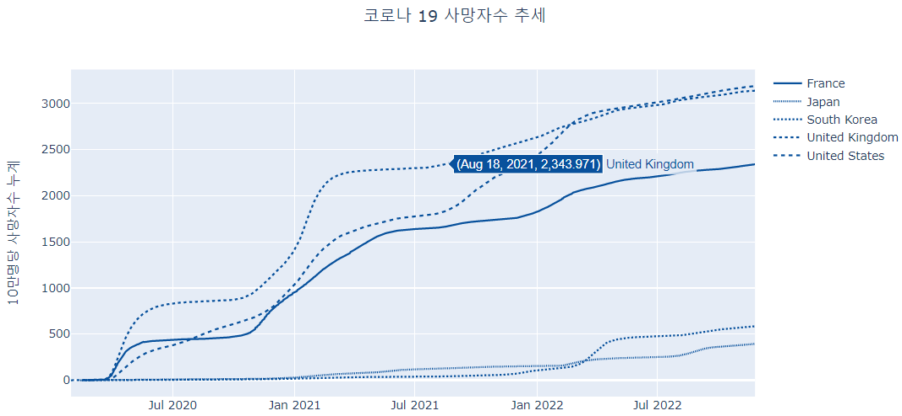

앞의 시각화를 보면 주요 5개국의 10만명당 사망자수 누계의 추세를 보이고 있다. 2020년 4\~5월 경부터 영국, 프랑스의 사망자수가 급격히 증가하고 이 시기부터 미국의 사망자수도 증가하였지만 초기의 사망자 추세는 영국, 프랑스보다는 증가 추세가 높지 않았다. 하지만 2020년 연말에 접어들면서 이 세 나라의 증가세가 비슷해지기 시작했고 이후 미국의 증가세는 꾸준히 증가한 반면 프랑스와 영국은 2021년 상반기부터 증가 추세가 낮아지기 시작했다. 반면 우리나라와 일본의 경우 2021년까지 매우 낮은 증가세를 모이지만 꾸준히 증가하였고 2022년에 들어서 우리나라의 증가세가 급격히 늘어나기 시작한 것으로 나타나고 있다.

이 시각화를 보면 범례를 사용하여 각 선에 해당하는 국가를 나타내고 있다. 하지만 선에 따른 국가를 확인하기 위해서는 범례와 데이터 선을 번갈아 찾아야 하기 때문에 다소 불편함이 따른다. 선 옆에 바로 국가명을 표현해 주면 이러한 불편함이 다소 감소될 수 있다.

-   R

```{r eval = FALSE}
last_day = max(distinct(total_deaths_5_nations_by_day, date) |> pull()) + 180

total_deaths_5_nations_by_day |>
  ## plotly 객체 생성
  plot_ly() |>
  add_trace(type = 'scatter', mode = 'lines', 
            x = ~date, y = ~total_deaths_per_million , linetype = ~location, connectgaps = T) |>
  add_trace(type = 'scatter', mode = 'text', 
            x =~ (total_deaths_5_nations_by_day |> filter(date == max(date)) |> select(date) |> pull()), 
            y = ~(total_deaths_5_nations_by_day |> filter(date == max(date)) |> select(total_deaths_per_million) |> pull()),
            text = ~(total_deaths_5_nations_by_day |> filter(date == max(date)) |> select(location) |> pull()), 
            textposition = 'middle right'
  ) |>
  layout(title = '코로나 19 사망자수 추세', 
         xaxis = list(title = '', range = c('2020-02-15', format(last_day, format="%Y-%m-%d"))), 
         yaxis = list(title = '10만명당 사망자수 누계'), 
         margin = margins,
         showlegend = FALSE)

```


```{r fig.cap = '범례를 데이터 옆에 직접 표기한 선 그래프', echo = FALSE}
last_day = max(distinct(total_deaths_5_nations_by_day, date) |> pull()) + 180

total_deaths_5_nations_by_day |>
  ## plotly 객체 생성
  plot_ly() |>
  add_trace(type = 'scatter', mode = 'lines', 
            x = ~date, y = ~total_deaths_per_million , linetype = ~location, connectgaps = T, 
            color = ~location, colors = RColorBrewer::brewer.pal(7, 'Blues')[3:7]) |>
  add_trace(type = 'scatter', mode = 'text', 
            x =~ (total_deaths_5_nations_by_day |> filter(date == max(date)) |> select(date) |> pull()), 
            y = ~(total_deaths_5_nations_by_day |> filter(date == max(date)) |> select(total_deaths_per_million) |> pull()),
            text = ~(total_deaths_5_nations_by_day |> filter(date == max(date)) |> select(location) |> pull()), 
            textposition = 'middle right'
  ) |>
  layout(title = '코로나 19 사망자수 추세', 
         xaxis = list(title = '', range = c('2020-02-15', format(last_day, format="%Y-%m-%d"))), 
         yaxis = list(title = '10만명당 사망자수 누계'), 
         margin = margins,
         showlegend = FALSE)

```

-   python

```{python eval = FALSE}
fig = go.Figure()
for location, group in total_deaths_5_nations_by_day.groupby('location'):
    fig.add_trace(go.Scatter(
        mode = 'lines', 
        x = group['date'], 
        y = group['total_deaths_per_million'], 
        line = dict(dash = nations[location]), 
        name = location,
        connectgaps = True, showlegend = False
    ))
    fig.add_trace(go.Scatter(
        mode = 'text',
        x = group.loc[group['date'] == group['date'].max(), 'date'], 
        y = group.loc[group['date'] == group['date'].max(), 'total_deaths_per_million'],
        text = group.loc[group['date'] == group['date'].max(), 'location'], 
        showlegend = False, 
        textposition = 'middle right'
    ))    
    
fig.update_layout(title = dict(text = '코로나 19 사망자수 추세', x = 0.5), 
                  xaxis = dict(title = '', 
                               range = [total_deaths_5_nations_by_day['date'].min(), total_deaths_5_nations_by_day['date'].max() + timedelta(days=150)]), 
                  yaxis = dict(title = '10만명당 사망자수 누계'))   
fig.show()

```

```{python eval = FALSE, echo = FALSE}
fig = go.Figure()
for location, group in total_deaths_5_nations_by_day.groupby('location'):
    fig.add_trace(go.Scatter(
        mode = 'lines', 
        x = group['date'], 
        y = group['total_deaths_per_million'], 
        line = dict(dash = nations[location], color = "#08519C"), 
        name = location,
        connectgaps = True, showlegend = False
    ))
    fig.add_trace(go.Scatter(
        mode = 'text',
        x = group.loc[group['date'] == group['date'].max(), 'date'], 
        y = group.loc[group['date'] == group['date'].max(), 'total_deaths_per_million'],
        text = group.loc[group['date'] == group['date'].max(), 'location'], 
        showlegend = False, 
        textposition = 'middle right'
    ))    
    
fig.update_layout(title = dict(text = '코로나 19 사망자수 추세', x = 0.5), 
                  xaxis = dict(title = '', 
                               range = [total_deaths_5_nations_by_day['date'].min(), total_deaths_5_nations_by_day['date'].max() + timedelta(days=150)]), 
                  yaxis = dict(title = '10만명당 사망자수 누계'))   
fig.show()
```

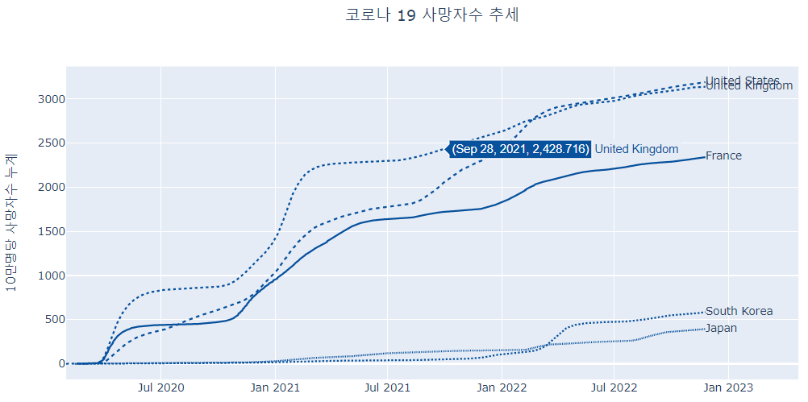

## rangeslider를 사용한 선 그래프

지금까지 그려본 `plotly` 선 그래프는 사실 정적 시각화로도 그릴 수 있는 그래프이다. 물론 `plotly`가 modebar나 마우스를 사용한 상호작용과 같이 기본적으로 제공하는 동적 시각화 기능을 사용하면 시각화를 다양하게 사용할 수 있지만 `plotly`에서만 제공하는 선 그래프의 특별한 기능들이 있다. 그 중에 하나가 'rangeslider'이다.

rangeslider는 선 그래프의 전체적인 형태를 유지하면서 사용자가 직접 X축에 매핑된 시간 축을 이동, 확대, 축소하기 위한 작은 서브플롯차트를 제공하는 기능이다. 이 서브 플롯의 왼쪽 막대와 오른쪽 막대를 움직이면서 X축의 범위를 사용자가 직접 설정할 수 있다. 이 rangeslider는 X축에만 제공되는 속성인 `rangeslider`의 세부 속성인 `visible`을 'TRUE'로 설정하면 나타나고 세부 설정을 위한 다양한 속성들을 제공한다.

-   R

```{r fig.cap = 'rangeslider가 설정된 선 그래프', eval = FALSE}
total_deaths_5_nations_by_day |>
  ## plotly 객체 생성
  plot_ly() |>
  add_trace(type = 'scatter', mode = 'lines', 
            x = ~date, y = ~total_deaths_per_million , 
            linetype = ~location, connectgaps = T
) |>
  layout(title = '코로나 19 사망자수 추세', 
         xaxis = list(title = '', rangeslider = list(visible = T)), 
         yaxis = list(title = '10만명당 사망자수 누계'), 
         showlegend = T, margin = margins, 
         title='Time Series with Rangeslider',
         margin = margins)

```

```{r echo = FALSE}
total_deaths_5_nations_by_day |>
  ## plotly 객체 생성
  plot_ly() |>
  add_trace(type = 'scatter', mode = 'lines', 
            x = ~date, y = ~total_deaths_per_million , linetype = ~location, connectgaps = T, 
            color = ~location, colors = RColorBrewer::brewer.pal(7, 'Blues')[3:7]
) |>
  layout(title = '코로나 19 사망자수 추세', 
         xaxis = list(title = '', rangeslider = list(visible = T)), 
         yaxis = list(title = '10만명당 사망자수 누계'), 
         showlegend = T, margin = margins, 
         title='Time Series with Rangeslider',
         margin = margins)

```

-   python

```{python eval = FALSE}
fig = go.Figure()
for location, group in total_deaths_5_nations_by_day.groupby('location'):
    fig.add_trace(go.Scatter(
        mode = 'lines', 
        x = group['date'], 
        y = group['total_deaths_per_million'], 
        line = dict(dash = nations[location]), 
        name = location,
        connectgaps = True
    ))

fig.update_layout(title = dict(text = '코로나 19 사망자수 추세', x = 0.5), 
                  xaxis = dict(title = '', rangeslider = dict(visible = True)), 
                  yaxis = dict(title = '10만명당 사망자수 누계'))   
    
fig.show()
```

```{python eval = FALSE, echo = FALSE}
fig = go.Figure()
for location, group in total_deaths_5_nations_by_day.groupby('location'):
    fig.add_trace(go.Scatter(
        mode = 'lines', 
        x = group['date'], 
        y = group['total_deaths_per_million'], 
        line = dict(dash = nations[location], color = "#08519C"), 
        name = location,
        connectgaps = True
    ))

fig.update_layout(title = dict(text = '코로나 19 사망자수 추세', x = 0.5), 
                  xaxis = dict(title = '', rangeslider = dict(visible = True)), 
                  yaxis = dict(title = '10만명당 사망자수 누계'))   
    
fig.show()
```

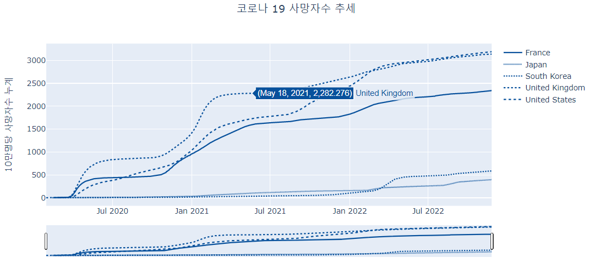

## 기간 설정 버튼(rangeselector)을 사용한 선 그래프 

앞서 설명한 rangeslider는 전체 기간중에 특정 기간을 사용자가 직접 설정할 수 있는 장점이 있지만 정확한 기간을 설정하기는 어렵다. 예를 들어 최근 30일, 최근 6개월과 같은 명확한 기간을 설정하고자 할 때는 효과적이지 못하다. 이런 경우를 대비하여 `plotly`에서 제공하는 기능이 `rangeselecor`이다. `rangeselector`는 버튼으로 제공되는데 최근 일에서부터 거꾸로 얼마의 기간 범위를 설정할지를 결정할 수 있다. `rangeselector`의 `button` 속성을 설정하기 위해 사용하는 주요 속성은 다음과 같다.

+----------+----------------------------------------------+-----------------------------------------------------------+----------+
| 속성     | 설명                                         | 속성값                                                    | 세부속성 |
+==========+==============================================+===========================================================+==========+
| count    | step으로 설정된 단위를 얼마나 shift할지 설정 | 0이상의 수치                                              |          |
+----------+----------------------------------------------+-----------------------------------------------------------+----------+
| label    | 버튼의 표시 문자열                           | 문자열                                                    |          |
+----------+----------------------------------------------+-----------------------------------------------------------+----------+
| step     | count의 값에서 사용될 시간 간격 설정         | 'month', 'year', 'day', 'hour', 'minute', 'second', 'all' |          |
+----------+----------------------------------------------+-----------------------------------------------------------+----------+
| stepmode | 범위 업데이트 모드의 설정                    | 'backward', 'todate'                                      |          |
+----------+----------------------------------------------+-----------------------------------------------------------+----------+
| visible  | 버튼을 표시할지 설정                         | 논리값                                                    |          |
+----------+----------------------------------------------+-----------------------------------------------------------+----------+

다음의 코드를 보면 총 5개의 버튼을 생성하였다. 첫 번째 버튼은 `step`을 'day'로 설정하고 `count`를 7로 설정하였기 때문에 범위를 최근일로부터 7일전부터 최근일까지를 설정한다. 네 번째 버튼에서 보면 `stepmode`가 다른 버튼과 달리 'todate'로 설정되어 있다. 반면 다섯 번째 버튼은 네 번째 버튼과 `stepmode`외에는 동일한 속성들을 가진다. `stepmode`가 'todate'로 설정되면 `step`이 `count`만큼의 설정되는 범위에서 가장 가까운 타임스탬프로 위치한다. 따라서 `stepmode`가 'todate'로 설정되면 현재로부터 1년전의 1월 1일로 범위가 설정된다. 반면 `stepmode`가 'bakcward'로 설정되면 현재로부터 1년전까지만 설정이 된다. 예를 들어 X축의 마지막 날짜가 2022년 3월 1일이라면 2021년 3월 1일로 범위가 설정되게 된다.

-   R

```{r eval = FALSE}
total_deaths_5_nations_by_day |>
  ## plotly 객체 생성
  plot_ly() |>
  add_trace(type = 'scatter', mode = 'lines', 
            x = ~date, y = ~total_deaths_per_million , linetype = ~location, connectgaps = T) |>
  layout(title = '코로나 19 사망자수 추세', 
         yaxis = list(title = '10만명당 사망자수 누계'), 
         xaxis = list(title = '', 
                      range = c(min(total_deaths_5_nations_by_day$date),
                                max(total_deaths_5_nations_by_day$date)),
                      rangeslider = list(visible = T, autorange = F, range = c(min(total_deaths_5_nations_by_day$date),
                                max(total_deaths_5_nations_by_day$date))
                                         ), 
                      rangeselector=list(
                        buttons=list(
                          list(count=7, label="1W", step="day", stepmode="backward"),
                          list(count=1, label="1m", step="month", stepmode="backward"),
                          list(count=6, label="6m", step="month", stepmode="backward"),
                          list(count=1, label="YTD", step="year", stepmode="todate"),
                          list(count=1, label="1y", step="year", stepmode="backward")
                          )
                        )
                      ),
         showlegend = T, margin = margins
         )

```

```{r echo = FALSE}
total_deaths_5_nations_by_day |>
  ## plotly 객체 생성
  plot_ly() |>
  add_trace(type = 'scatter', mode = 'lines', 
            x = ~date, y = ~total_deaths_per_million , linetype = ~location, connectgaps = T, 
            color = ~location, colors = RColorBrewer::brewer.pal(7, 'Blues')[3:7]
) |>
  layout(title = '코로나 19 사망자수 추세', 
         yaxis = list(title = '10만명당 사망자수 누계'), 
         xaxis = list(title = '', 
                      range = c(min(total_deaths_5_nations_by_day$date),
                                max(total_deaths_5_nations_by_day$date)),
                      rangeslider = list(visible = T, autorange = F, range = c(min(total_deaths_5_nations_by_day$date),
                                max(total_deaths_5_nations_by_day$date))
                                         ), 
                      rangeselector=list(
                        buttons=list(
                          list(count=7, label="1W", step="day", stepmode="backward"),
                          list(count=1, label="1m", step="month", stepmode="backward"),
                          list(count=6, label="6m", step="month", stepmode="backward"),
                          list(count=1, label="YTD", step="year", stepmode="todate"),
                          list(count=1, label="1y", step="year", stepmode="backward")
                          )
                        )
                      ),
         showlegend = T, margin = margins
         )

```

-   python

```{python eval = FALSE}
fig = go.Figure()
for location, group in total_deaths_5_nations_by_day.groupby('location'):
    fig.add_trace(go.Scatter(
        mode = 'lines', 
        x = group['date'], 
        y = group['total_deaths_per_million'], 
        line = dict(dash = nations[location]), 
        name = location,
        connectgaps = True
    ))

fig.update_layout(title = dict(text = '코로나 19 사망자수 추세', x = 0.5), 
                  xaxis = dict(title = '', 
                               rangeslider = dict(visible = True),
                               rangeselector=dict(
                                 ################################################################# 주의
                                   buttons=list([
                                       dict(count=7, label="1W", step="day", stepmode="backward"),
                                       dict(count=1, label="1m", step="month", stepmode="backward"),
                                       dict(count=6, label="6m", step="month", stepmode="backward"),
                                       dict(count=1, label="YTD", step="year", stepmode="todate"),
                                       dict(count=1, label="1y", step="year", stepmode="backward")
                                       ])
                                   )
                               ), 
                  yaxis = dict(title = '10만명당 사망자수 누계'))   
    
fig.show()
```

```{python eval = FALSE, echo = FALSE}
fig = go.Figure()
for location, group in total_deaths_5_nations_by_day.groupby('location'):
    fig.add_trace(go.Scatter(
        mode = 'lines', 
        x = group['date'], 
        y = group['total_deaths_per_million'], 
        line = dict(dash = nations[location], color = "#08519C"), 
        name = location,
        connectgaps = True
    ))

fig.update_layout(title = dict(text = '코로나 19 사망자수 추세', x = 0.5), 
                  xaxis = dict(title = '', 
                               rangeslider = dict(visible = True),
                               rangeselector=dict(
                                   buttons=list([
                                       dict(count=7, label="1W", step="day", stepmode="backward"),
                                       dict(count=1, label="1m", step="month", stepmode="backward"),
                                       dict(count=6, label="6m", step="month", stepmode="backward"),
                                       dict(count=1, label="YTD", step="year", stepmode="todate"),
                                       dict(count=1, label="1y", step="year", stepmode="backward")
                                       ])
                                   )
                               ), 
                  yaxis = dict(title = '10만명당 사망자수 누계'))   
    
fig.show()

```

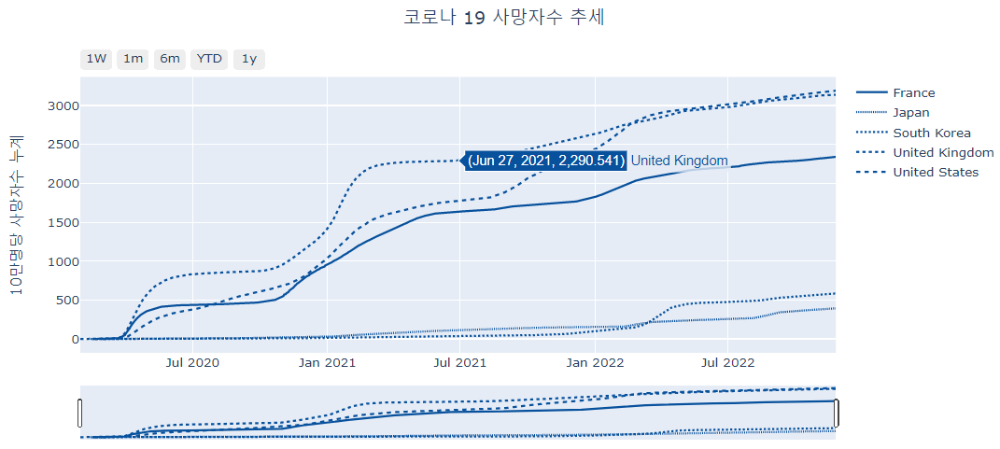

## 호버모드를 사용한 선 그래프

이렇게 `mode`에 'text'를 설정할 때는 하여 정확한 데이터를 표시하는 방법도 있지만 마우스의 이동에 따라 X, Y축의 정확한 위치를 표시해주는 보조선을 사용하는 방법도 있다. 이런 보조선은 `layout()`의 `hovermode`속성을 사용하여 설정할 수 있다. `hovermode`는 'x unified', 'y unified'로 설정하면 X, Y축의 수직, 수평선의 보조선이 생성되고 이 선에 해당하는 데이터에 대한 정보가 표시된다.

-   R

```{r eval = FALSE}
total_deaths_5_nations_by_day |>
  ## plotly 객체 생성
  plot_ly() |>
  add_trace(type = 'scatter', mode = 'lines', 
            x = ~date, y = ~total_deaths_per_million , linetype = ~location, connectgaps = T) |>
  layout(title = '코로나 19 사망자수 추세', 
         xaxis = list(title = ''), 
         yaxis = list(title = '10만명당 사망자수 누계'), 
         margin = margins, 
         hovermode="x")

```

```{r echo = FALSE}
total_deaths_5_nations_by_day |>
  ## plotly 객체 생성
  plot_ly() |>
  add_trace(type = 'scatter', mode = 'lines', 
            x = ~date, y = ~total_deaths_per_million , linetype = ~location, connectgaps = T, 
            color = ~location, colors = RColorBrewer::brewer.pal(7, 'Blues')[3:7]) |>
  layout(title = '코로나 19 사망자수 추세', 
         xaxis = list(title = ''), 
         yaxis = list(title = '10만명당 사망자수 누계'), 
         margin = margins, 
         hovermode="x")

```

-   python

```{python eval = FALSE}
fig = go.Figure()
for location, group in total_deaths_5_nations_by_day.groupby('location'):
    fig.add_trace(go.Scatter(
        mode = 'lines', 
        x = group['date'], 
        y = group['total_deaths_per_million'], 
        line = dict(dash = nations[location]), 
        name = location,
        connectgaps = True
    ))
fig.update_layout(title = dict(text = '코로나 19 사망자수 추세', x = 0.5), 
                  xaxis = dict(title = ''), 
                  yaxis = dict(title = '10만명당 사망자수 누계'),
                  hovermode="x")       
fig.show()

```

```{python eval = FALSE, echo = FALSE}
fig = go.Figure()
for location, group in total_deaths_5_nations_by_day.groupby('location'):
    fig.add_trace(go.Scatter(
        mode = 'lines', 
        x = group['date'], 
        y = group['total_deaths_per_million'], 
        line = dict(dash = nations[location]),
        name = location,
        connectgaps = True
    ))
fig.update_layout(title = dict(text = '코로나 19 사망자수 추세', x = 0.5), 
                  xaxis = dict(title = ''), 
                  yaxis = dict(title = '10만명당 사망자수 누계'), 
                  hovermode="x", 
                  colorway = ("#9ECAE1", "#6BAED6", "#4292C6", "#2171B5", "#084594"))   
    
fig.show()
```

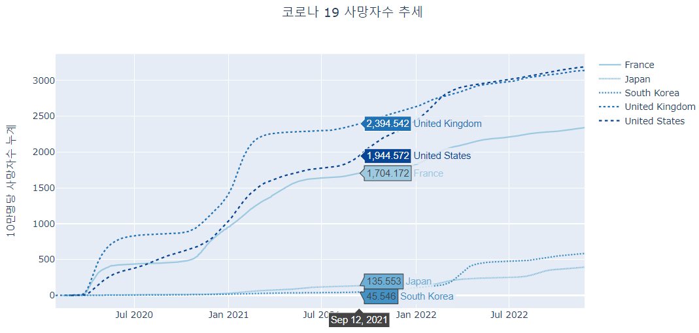

## 스파크모드을 사용한 선 그래프

-   R

```{r eval = FALSE}
total_deaths_5_nations_by_day |>
  ## plotly 객체 생성
  plot_ly() |>
  add_trace(type = 'scatter', mode = 'lines', 
            x = ~date, y = ~total_deaths_per_million , linetype = ~location, connectgaps = T) |>
  layout(title = '코로나 19 사망자수 추세', 
         xaxis = list(title = '', 
                      spikemode = 'toaxis+across'), 
         yaxis = list(title = '10만명당 사망자수 누계'), 
         margin = margins, 
         hovermode="x")


```

```{r echo = FALSE}
total_deaths_5_nations_by_day |>
  ## plotly 객체 생성
  plot_ly() |>
  add_trace(type = 'scatter', mode = 'lines', 
            x = ~date, y = ~total_deaths_per_million , linetype = ~location, connectgaps = T, 
            color = ~location, colors = RColorBrewer::brewer.pal(7, 'Blues')[3:7]) |>
  layout(title = '코로나 19 사망자수 추세', 
         xaxis = list(title = '', 
                      spikemode = 'toaxis+across'), 
         yaxis = list(title = '10만명당 사망자수 누계'), 
         margin = margins, 
         hovermode="x")


```


-   python

```{python eval = FALSE}
fig = go.Figure()
for location, group in total_deaths_5_nations_by_day.groupby('location'):
    fig.add_trace(go.Scatter(
        mode = 'lines', 
        x = group['date'], 
        y = group['total_deaths_per_million'], 
        line = dict(dash = nations[location]), 
        name = location,
        connectgaps = True
    ))
fig.update_layout(title = dict(text = '코로나 19 사망자수 추세', x = 0.5), 
                  xaxis = dict(title = '', 
                      spikemode = 'toaxis+across'), 
                  yaxis = dict(title = '10만명당 사망자수 누계'), 
                  hovermode="x")   
    
fig.show()

```

```{python eval = FALSE, echo = FALSE}
fig = go.Figure()
for location, group in total_deaths_5_nations_by_day.groupby('location'):
    fig.add_trace(go.Scatter(
        mode = 'lines', 
        x = group['date'], 
        y = group['total_deaths_per_million'], 
        line = dict(dash = nations[location]),
        name = location,
        connectgaps = True
    ))
fig.update_layout(title = dict(text = '코로나 19 사망자수 추세', x = 0.5), 
                  xaxis = dict(title = '', 
                      spikemode = 'toaxis+across'), 
                  yaxis = dict(title = '10만명당 사망자수 누계'), 
                  hovermode="x", 
                  colorway = ("#9ECAE1", "#6BAED6", "#4292C6", "#2171B5", "#084594")                  
                  )   
    
fig.show()
```

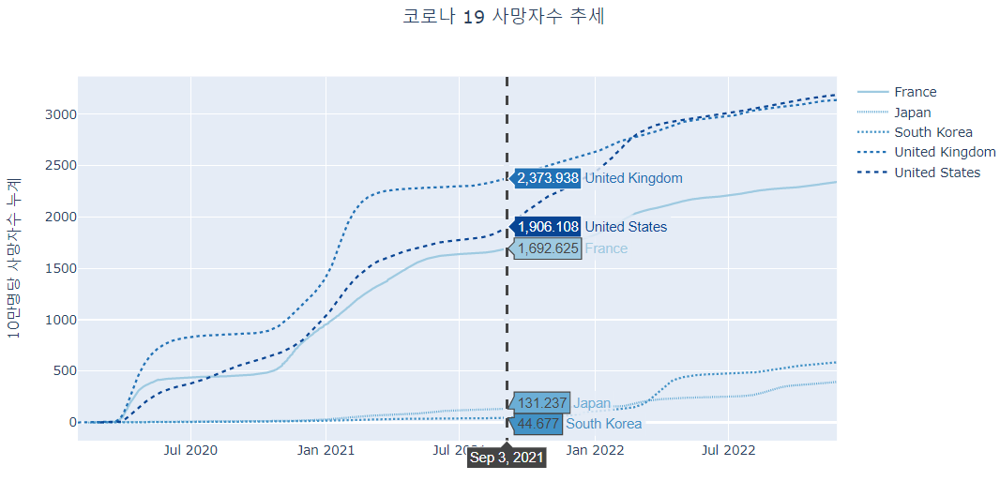

# 캔들 스틱 차트

우선 삼성전자의 최근 100일 주가를 가져오도록 하겠다. 

-   R

```{r}
library(tqk)
library(lubridate)
code <- code_get()

## 삼성전자 코드값을 가져온다. 
sse_code <- code |> filter(name == '삼성전자') |>
  select(code) |> 
  pull()

samsung <- tqk_get(sse_code, from=today() - 100, to=today())

```

-   python

```{python eval = FALSE}
from pandas_datareader import data as pdr
import yfinance as yf
yf.pdr_override()
end_today = datetime.today()
start_day = end_today - timedelta(days=100)
end_today = end_today.strftime("%Y-%m-%d")
start_day = start_day.strftime("%Y-%m-%d")
samsung_stock = pdr.get_data_yahoo("005930.KS", start=start_day, end=end_today)

```


`plotly`에서는 주식차트에서 사용하는 캔들스틱 트레이스를 지원한다. 캔들스틱 트레이스를 사용하기 위해서는 `add_trace()`의 'type' 속성을 'candlestick'으로 설정하고 'open', 'close', 'high', 'low' 값으로 그릴 값이 저장된 열을 매핑해주면 간단히 그려진다. 

-   R

```{r}
samsung |> plot_ly() |>
  add_trace(
    type="candlestick", x = ~date,
    open = ~open, close = ~close,
    high = ~high, low = ~low) |> 
  layout(title = "삼성전자 Candlestick Chart")


```

-   python

```{python eval = FALSE}
fig = go.Figure()
fig.add_trace(go.Candlestick(
     x = samsung_stock.index,
    open = samsung_stock['Open'], close = samsung_stock['Close'],
    high = samsung_stock['High'], low = samsung_stock['Low']
))
fig.update_layout(title = dict(text = "삼성전자 Candlestick Chart", x = 0.5))

```

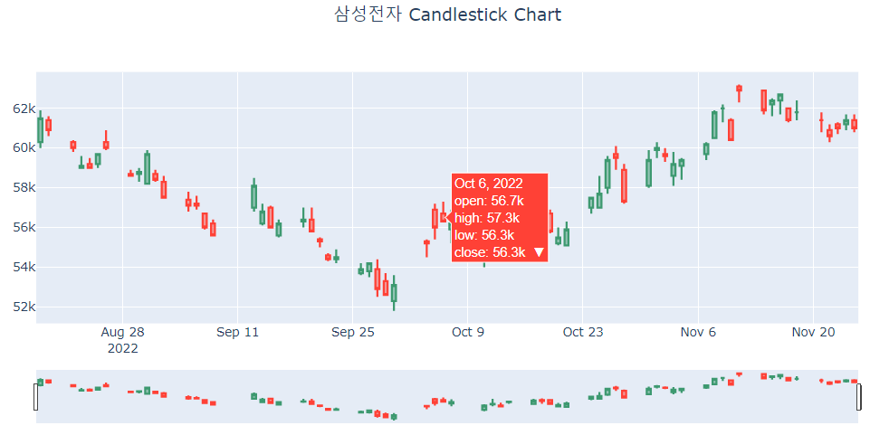

위의 캔들스틱 그래프에서 보이듯이 기본적으로 시가, 종가, 고가, 저가가 표시되는 캔들스틱 그래프가 만들어졌는데 캔들스틱 그래프 아래에는 rangeslider가 자동적으로 그려져서 주가 기간을 쉽게 설정할 수 있도록 되어 있다. 만약 rangeslider가 없는 캔들스틱 그래프는 다음과 같이 그릴수 있다. 

-   R

```{r}
samsung |> plot_ly() |>
  add_trace(
    type="candlestick", x = ~date,
    open = ~open, close = ~close,
    high = ~high, low = ~low) |> 
  layout(title = "삼성전자 Candlestick Chart", 
         xaxis = list(rangeslider = list(visible = F)))

```

-   python

```{python eval = FALSE}
fig = go.Figure()
fig.add_trace(go.Candlestick(
     x = samsung_stock.index,
    open = samsung_stock['Open'], close = samsung_stock['Close'],
    high = samsung_stock['High'], low = samsung_stock['Low']
))
fig.update_layout(title = dict(text = "삼성전자 Candlestick Chart", x = 0.5), 
         xaxis = dict(rangeslider = dict(visible = False)))

```

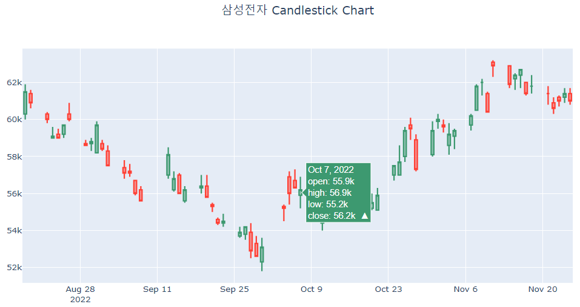

## 캔들 스틱 색 변경

앞에서 그린 캔들스틱은 우리가 흔히 보는 주가 그래프와 조금 다른 점이 있다. 캔들스틱의 색인데 우리나라에서는 파란색과 붉은색으로 표시되는데 `plotly`에서는 초록색과 붉은색으로 표시된다. 이를 파란색과 붉은색으로 바꾸기 위해서는 'increasing'과 'decreasing' 속성을 사용한다. 

-   R

```{r}
samsung |> plot_ly() |>
  add_trace(
    type="candlestick", x = ~date,
    open = ~open, close = ~close,
    high = ~high, low = ~low, 
    increasing = list(line = list(color = 'red')), 
    decreasing = list(line = list(color = 'blue'))
    ) |> 
  layout(title = "삼성전자 Candlestick Chart", 
         xaxis = list(rangeslider = list(visible = F)))

```

-   python

```{python eval = FALSE}
fig = go.Figure()
fig.add_trace(go.Candlestick(
     x = samsung_stock.index,
    open = samsung_stock['Open'], close = samsung_stock['Close'],
    high = samsung_stock['High'], low = samsung_stock['Low'], 
    increasing = dict(line = dict(color = 'red')), 
    decreasing = dict(line = dict(color = 'blue'))
))
fig.update_layout(title = dict(text = "삼성전자 Candlestick Chart", x = 0.5), 
         xaxis = dict(rangeslider = dict(visible = False)))

```

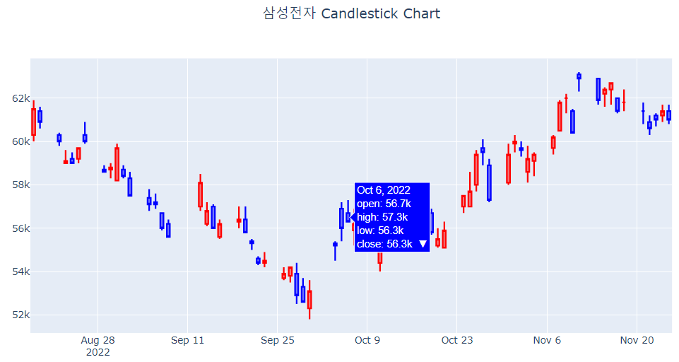

## 거래량 그래프 추가

이제 그래프 하단에 거래량 그래프를 추가해보도록 하겠다. 거래량 그래프를 추가하기 위해서는 `subplot()`을 사용하여 두 개의 트레이스를 붙여서 그려야 한다. 그래서 막대 트레이스로 거래량 그래프를 그리고 이 그래프를 캔들스틱 차트 아래에 붙이도록 하겠다. 일반적으로 거래량 그래프는 아래쪽에 위치하고 크기는 전체 높이의 20%정도로 설정하고 캔들스틱 차트를 70%, 여백으로 10%정도를 설정하겠다.  

-   R

```{r}
fig1 <- samsung |> plot_ly() |>
  add_trace(
    type="candlestick", x = ~date,
    open = ~open, close = ~close,
    high = ~high, low = ~low, 
    increasing = list(line = list(color = 'red')), 
    decreasing = list(line = list(color = 'blue'))
  ) |> 
  layout(title = "삼성전자 Candlestick Chart", 
         xaxis = list(rangeslider = list(visible = F)),
         yaxis = list(title = '주가'),
         showlegend = FALSE)

fig2 <- samsung %>% plot_ly() |>
  add_trace(type = 'bar', x=~date, y=~volume, type='bar',
                 color = I('gray'), showlegend = FALSE) |>
  layout(yaxis = list(title = '거래량'))

subplot(fig1, fig2, heights = c(0.7,0.2), nrows=2,
        shareX = TRUE)

```

- python

```{python eval = FALSE}
from plotly.subplots import make_subplots

fig = make_subplots(rows = 2, cols = 1, row_heights=[0.7, 0.3])

fig.add_trace(go.Candlestick(
    x = samsung_stock.index,
    open = samsung_stock['Open'], close = samsung_stock['Close'],
    high = samsung_stock['High'], low = samsung_stock['Low'], 
    increasing = dict(line = dict(color = 'red')), 
    decreasing = dict(line = dict(color = 'blue'))
), 
    row = 1, col = 1)

fig.add_trace(go.Bar(
    x = samsung_stock.index,
    y = samsung_stock['Volume'], 
    marker = dict(color = 'gray')
), 
             row = 2, col =1)

fig.update_yaxes(title_text="주가", row=1, col=1)
fig.update_yaxes(title_text="거래량", row=2, col=1)

fig.update_layout(title = dict(text = "삼성전자 Candlestick Chart", x = 0.5),
                  xaxis = dict(rangeslider = dict(visible = False)), 
                  showlegend = False
)

```

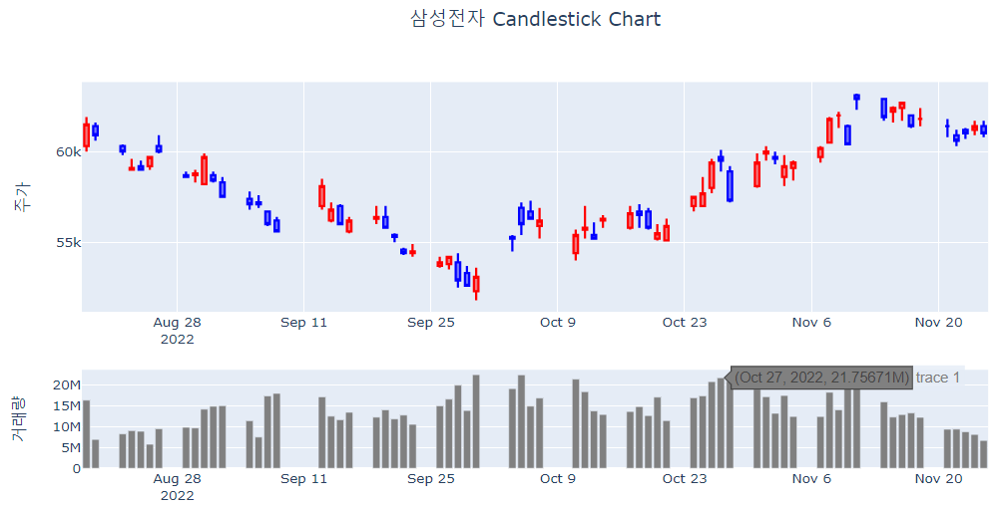

## 주말 효과가 제거된 선 그래프

코로나19 데이터의 1주일 이상의 장기 데이터를 한번이라도 본 경험이 있다면 일요일과 월요일에 확진자 수가 급감했다가 화요일부터 다시 증가한다는 계절성을 보았을 것이다. 토요일과 일요일에 검사 건수가 적어지는 주말 효과에 의해 검사 결과가 나오는 일요일과 월요일의 확진자가 감소했다가 월요일부터 다시 검사 건수가 늘어나기 때문에 이 검사 결과가 나오는 화요일부터 확진자가 증가한다. 따라서 이 주말효과는 데이터의 전반적 추세를 살펴보는데 다소 방해가 되는 요소이다. `plotly`는 이와 같은 달력 상의 특정 주기나 특정 날짜를 제거해주는 기능을 `rangebreaks`를 통해 설정할 수 있다. `rangebreaks`를 사용할 때 하나 주의해야하는 것은 `rangebreaks`의 세부속성을 모두 리스트로 만들어 주어야 한다는 것이다.

| 속성    | 설명                                                            | 속성값                    | 세부속성 |
|---------|-----------------------------------------------------------------|---------------------------|----------|
| bounds  | rangebreaks를 설정할 최소, 최대값을 설정, 패턴을 설정할 수 있음 | 리스트                    |          |
| dvalue  | values에 설정하는 크기 설정. 밀리세컨드로 설정                  | 0이상의 수치              |          |
| enable  | rangebreaks를 설정할지 여부 설정                                | 논리값                    |          |
| pattern | rangebreaks로 설정할 타임라인 패턴 설정                         | 'day of week', 'hour', '' |          |
| values  | rangebreak에 해당하는 좌표 값을 설정                            | 리스트                    |          |

-   R

```{r}
fig1 <- samsung |> plot_ly() |>
  add_trace(
    type="candlestick", x = ~date,
    open = ~open, close = ~close,
    high = ~high, low = ~low, 
    increasing = list(line = list(color = 'red')), 
    decreasing = list(line = list(color = 'blue'))
  ) |> 
  layout(title = "삼성전자 Candlestick Chart", 
         xaxis = list(rangeslider = list(visible = F), 
                      rangebreaks=list(
                        list(bounds=list("sat", "mon")), 
                        list(values = list("2022-09-09", "2022-09-12", "2022-10-03", "2022-10-10"))
                      )
         ),
         yaxis = list(title = '주가'),
         showlegend = FALSE)

fig2 <- samsung %>% plot_ly() |>
  add_trace(type = 'bar', x=~date, y=~volume, type='bar',
            color =I('gray'), showlegend = FALSE) |>
  layout(xaxis = list(rangebreaks=list(
    list(bounds=list("sat", "mon")), 
    list(values = list("2022-09-09", "2022-09-12", "2022-10-03", "2022-10-10"))
  )
  ),
  yaxis = list(title = '거래량'))

subplot(fig1, fig2, heights = c(0.7,0.2), nrows=2,
        shareX = TRUE)

```


-   python

```{python eval = FALSE}
fig = make_subplots(rows = 2, cols = 1, row_heights=[0.7, 0.3])

fig.add_trace(go.Candlestick(
    x = samsung_stock.index,
    open = samsung_stock['Open'], close = samsung_stock['Close'],
    high = samsung_stock['High'], low = samsung_stock['Low'], 
    increasing = dict(line = dict(color = 'red')), 
    decreasing = dict(line = dict(color = 'blue'))
), 
    row = 1, col = 1)

fig.add_trace(go.Bar(
    x = samsung_stock.index,
    y = samsung_stock['Volume'], 
    marker = dict(color = 'gray')
), 
             row = 2, col =1)
fig.update_xaxes(rangeslider = dict(visible = False), 
                               rangebreaks = [
                                   dict(bounds=["sat", "mon"]), #hide weekends
                                   dict(values=["2022-09-09", "2022-09-12", "2022-10-03", "2022-10-10"])  # hide Christmas and New Year's
                                   ], 
                               row = 1, col = 1)
fig.update_xaxes(rangeslider = dict(visible = False), 
                               rangebreaks = [
                                   dict(bounds=["sat", "mon"]), #hide weekends
                                   dict(values=["2022-09-09", "2022-09-12", "2022-10-03", "2022-10-10"])  # hide Christmas and New Year's
                                   ], 
                               row = 2, col = 1)
fig.update_yaxes(title_text="주가", row=1, col=1)
fig.update_yaxes(title_text="거래량", row=2, col=1)

fig.update_layout(title = dict(text = "삼성전자 Candlestick Chart", x = 0.5),
                  showlegend = False
)

```

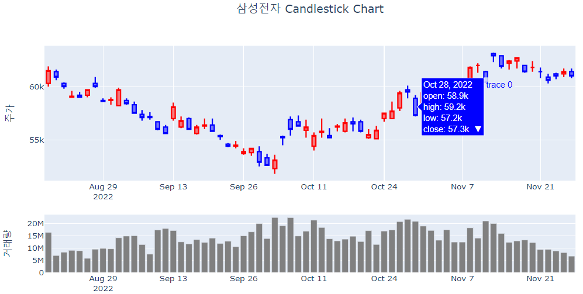

-   R

```{r}
total_deaths_5_nations_since_100day <- 
  total_deaths_5_nations_by_day |>
  ## 한국 데이터만 필터링
  filter((iso_code %in% c('KOR'))) |>
  ## 주말 효과를 확인하기 위해 최근 100일 데이터만 필터링
  filter(date > max(date)-100) 

## 주말효과가 있는 선 trace 추가
p1 <- total_deaths_5_nations_since_100day |>
  plot_ly() |>
  add_trace(type = 'scatter', mode = 'lines', 
            x = ~date, y = ~new_cases , 
            linetype = ~location, connectgaps = T
)

## 주말효과가 없는 선 trace 추가
p2 <- total_deaths_5_nations_since_100day |>
  plot_ly() |>
  add_trace(type = 'scatter', mode = 'lines', 
            x = ~date, y = ~new_cases , 
            linetype = ~location, connectgaps = T) |> 
  layout(xaxis = list(
    ## rangebreaks의 설정
    rangebreaks=list(
      ## 제거기간을 일요일부터 화요일 이전까지 패턴 설정
      list(bounds=list("sun", "tue")), 
      ## 제거날짜에 크리스마스 포함
      list(values=list('2022-03-02'))
      )
    )
    )

subplot(p1, p2, nrows = 2) |>
  layout(title = '', 
         hovermode = "x unified")

```

```{r echo = FALSE}
total_deaths_5_nations_since_100day <- total_deaths_5_nations_by_day |>
  filter((iso_code %in% c('KOR'))) |>
  filter(date > max(date)-100) 

p1 <- total_deaths_5_nations_since_100day |>
  ## plotly 객체 생성
  plot_ly() |>
  add_trace(type = 'scatter', mode = 'lines', 
            x = ~date, y = ~new_cases , linetype = ~location, connectgaps = T, 
            color = ~location, colors = RColorBrewer::brewer.pal(7, 'Blues')[3:7]
)

p2 <- total_deaths_5_nations_since_100day |>
  filter((iso_code %in% c('KOR'))) |>
  ## plotly 객체 생성
  plot_ly() |>
  add_trace(type = 'scatter', mode = 'lines', 
            x = ~date, y = ~new_cases , linetype = ~location, connectgaps = T, 
            color = ~location, colors = RColorBrewer::brewer.pal(7, 'Blues')[3:7]
) |> 
  layout(xaxis = list(
                      rangebreaks=list(
                                       list(bounds=list("sun", "tue")), 
                                       list(values=list('2022-03-02'))
                                       )
                      )
         )

subplot(p1 |> 
          layout(annotations = list(x = 0.5 , y = 1.05, 
                                    text = "주말이 포함된 확진자수", showarrow = F, 
                                    xref='paper', yref='paper', xanchor = 'center')),
        p2 |> 
          layout(annotations = list(x = 0.5 , y = 1.05, 
                                    text = "주말이 제거된 확진자수", showarrow = F, 
                                    xref='paper', yref='paper', xanchor = 'center')), 
        nrows = 2, margin = 0.05) |>
  layout(hovermode = "x unified")
```


# 시간축의 설정

# 스파크라인

스파크라인 그래프는 X, Y축이 생략되고 데이터 흐름이 표현된 선만으로 표시되는 선 그래프를 말한다. 이 그래프는 그 시각화 자체로 사용되기 보다는 다른 정보, 특히 표의 컬럼에 표현되거나 다른 시각화의 보조적 정보의 제공 형태로 사용된다. 특히 많은 선 그래프를 표현하지만 서브 플롯도  다소 많다고 느끼는 경우 사용할 수 있다. 

다음은 아시아 국가들의 최근 100일간 코로나19 신규 확진자에 대한 스파크라인 그래프를 그리는 코드이다. 

```{r}
df_covid19_100 |>
  ## 국가명으로 그룹화
  group_by(location) |>
  ## 그룹화한 각각의 데이터 그룹들에 적용할 코드 설정
  do(
    ## 각 그룹화한 데이터를 사용해 plotly 객체 생성    
    p = plot_ly(.) |> 
      ## line 모드의 스캐터 trace 추가
      add_trace(type = 'scatter', mode = 'lines',
                ## X, Y축에 변수 매핑, color를 설정
                x = ~date, y = ~new_cases, name = ~location) |>
      ## layout으로 X, Y축을 설정
      layout(title = list(title = NULL),
             xaxis = list(tickfont = list(size = 10), 
                          showgrid = FALSE),  
             yaxis = list(title = list(text = ~location), 
                          showticklabels = F, 
                          showgrid = FALSE, 
                          rangemode = 'tozero'))
  ) |>
  ## 생성된 plotly 객체들을 subplot 생성
  subplot(nrows = 7, shareX = TRUE, shareY = TRUE) |>
  ## 생성된 subplot의 layout 설정
  layout(showlegend = FALSE, 
         title = '최근 100일간 코로나19 확진자수',
         margin = margins)

```


# 퍼널 차트

인구 연령별 인구수를 표현 그래프에서 많이 사용된다. 하지만 `plotly`에서는 피라미드 그래프라는 이름으로 사용되지 않고 퍼널(깔때기, funnel) trace라는 이름으로 사용된다. 퍼널 trace는 변량의 크기를 길이로 표현한 막대로 표현하고 각 막대의 중간을 맞춰 양쪽으로 퍼져나가는 깔때기 형태의 trace이다. 이 퍼널 차트는 영업 및 마케팅 부서에서 자주 사용되는데 여러 단계별로 값이나 지표가 변화하는 것을 한 눈에 표현하기 위한 목적으로 사용한다.

코로나19 데이터를 사용하여 퍼널 차트를 만들기 위해 일간 코로나19 데이터를 주(week) 단위로 요약하여 주 단위로 값의 변화를 살펴보겠다. 먼저 최근 100일간의 우리나라 코로나19 신규 확진자 데이터를 주 단위로 요약하는 전처리는 다음과 같다.

-   R

```{r}
df_funnel <- 
  df_covid19_100 |> 
  filter(iso_code == 'KOR') |>
  ## date의 월 단위 열을 yearmonth에 저장
  mutate(date_by_week = lubridate::floor_date(date, "week"), 
         yearweekth =  paste0(lubridate::year(date_by_week), '년 ', 
                           lubridate::week(date_by_week), '주')) |> 
  ## iso_code, yearmonth로 그룹화
  group_by(iso_code, date_by_week, yearweekth) |>
  ## new_cases 합계 산출
  summarise(new_cases = sum(new_cases))
```

전처리된 데이터를 사용하여 퍼널 차트를 그려본다. X축은 데이터 값인 신규 확진자 수를 매핑하고 Y축은 단계로 구분했던 연도의 주(Week) 차수를 매핑함으로서 퍼널 차트를 쉽게 그릴 수 있다.

```{r fig.cap = '우리나라 주별 확진자 퍼널 차트'}
df_funnel |>
  plot_ly() |>
  add_trace(type = 'funnel', x = ~new_cases, y = ~date_by_week, 
            text = ~new_cases, texttemplate = '%{text:,.0f}') |>
  layout(title = '우리나라 주별 확진자수', 
    yaxis = list(title = '', 
                      tickvals = ~date_by_week, 
                      ticktext = ~yearweekth), 
    margin = margins)

```

-   python

```{python eval = FALSE}
import datetime

df_funnel = df_covid19_100.copy()
df_funnel = df_funnel.loc[(df_funnel['iso_code'] == 'KOR')]
df_funnel['date_by_week'] = df_funnel['date'].dt.floor('7D')
df_funnel['yearweekth'] = df_funnel['date'].dt.isocalendar().year.astype(str) + '년' + df_funnel['date'].dt.isocalendar().week.astype(str) + '주'
df_funnel = df_funnel.groupby(yearweekth)['new_cases'].agg([('new_cases', 'sum')])
fig = go.Figure()
fig.add_trace(go.Funnel(
    x = df_funnel['new_cases'], y = df_funnel.index, 
    text = df_funnel['new_cases'], texttemplate = '%{text:,.0f}'
))

fig.update_layout(title = dict(text = '우리나라 주별 확진자수', x = 0.5), 
    yaxis = dict(title = '', 
                      ticktext = df_funnel.index), 
    margin = margins)


```

앞선 퍼널 차트에서 보면 우리나라의 신규 확진자 수는 2022년 4주차부터 늘어나기 시작해서 2022년 11주차(3.13\~3.19)까지 급격히 증가하고 감소하는 상황이라는 것이 한눈에 보인다.

만약 이 퍼널 차트를 전체 대륙이 한꺼번에 나타나도록 그리기 위해서는 어떻게 해야할까? 여러 변량을 추가하려면 `add_trace()`를 추가하면 간단히 그려진다. 다음은 아시아와 유럽의 신규 확진자 주별 데이터에 대한 퍼널 차트이다.

-   R

```{r eval = FALSE}
df_funnel_Asia <- 
  df_covid19_100 |> 
  filter(location == '아시아') |>
  ## date의 월 단위 열을 yearmonth에 저장
  mutate(date_by_week = lubridate::floor_date(date, "week"), 
         yearweekth =  paste0(lubridate::year(date_by_week), '년 ', 
                           lubridate::week(date_by_week), '주')) |> 
  ## iso_code, yearmonth로 그룹화
  group_by(iso_code, date_by_week, yearweekth) |>
  ## new_cases 합계 산출
  summarise(new_cases = sum(new_cases))

df_funnel_Europe <- 
  df_covid19_100 |> 
  filter(location == '유럽') |>
  ## date의 월 단위 열을 yearmonth에 저장
  mutate(date_by_week = lubridate::floor_date(date, "week"), 
         yearweekth =  paste0(lubridate::year(date_by_week), '년 ', 
                           lubridate::week(date_by_week), '주')) |> 
  ## iso_code, yearmonth로 그룹화
  group_by(iso_code, date_by_week, yearweekth) |>
  ## new_cases 합계 산출
  summarise(new_cases = sum(new_cases))

df_funnel_Asia |> 
  plot_ly() |>
  add_trace(type = 'funnel', name = '아시아', 
            x = ~new_cases, y = ~date_by_week, 
            text = ~new_cases, texttemplate = '%{text:,.0f}') |>
  add_trace(data = df_funnel_Europe,type = 'funnel', name = '유럽',
            x = ~new_cases, y = ~date_by_week, 
            text = ~new_cases, texttemplate = '%{text:,.0f}') |>
  layout(title = '아시아와 유럽의 주별 확진자수', 
    yaxis = list(title = '', 
                      tickvals = ~date_by_week, 
                      ticktext = ~yearweekth), 
    margin = margins)

```

```{r echo = FALSE}
# df_funnel_2 <- 
#   df_covid19_100 |> 
#   filter(location %in% c('아시아', '유럽')) |>
#   ## date의 월 단위 열을 yearmonth에 저장
#   mutate(date_by_week = lubridate::floor_date(date, "week"), 
#          yearweekth =  paste0(lubridate::year(date_by_week), '년 ', 
#                            lubridate::week(date_by_week), '주')) |> 
#   ## iso_code, yearmonth로 그룹화
#   group_by(iso_code, date_by_week, yearweekth) |>
#   ## new_cases 합계 산출
#   summarise(new_cases = sum(new_cases))


df_funnel_Asia <- 
  df_covid19_100 |> 
  filter(location == '아시아') |>
  ## date의 월 단위 열을 yearmonth에 저장
  mutate(date_by_week = lubridate::floor_date(date, "week"), 
         yearweekth =  paste0(lubridate::year(date_by_week), '년 ', 
                           lubridate::week(date_by_week), '주')) |> 
  ## iso_code, yearmonth로 그룹화
  group_by(iso_code, date_by_week, yearweekth) |>
  ## new_cases 합계 산출
  summarise(new_cases = sum(new_cases))

df_funnel_Europe <- 
  df_covid19_100 |> 
  filter(location == '유럽') |>
  ## date의 월 단위 열을 yearmonth에 저장
  mutate(date_by_week = lubridate::floor_date(date, "week"), 
         yearweekth =  paste0(lubridate::year(date_by_week), '년 ', 
                           lubridate::week(date_by_week), '주')) |> 
  ## iso_code, yearmonth로 그룹화
  group_by(iso_code, date_by_week, yearweekth) |>
  ## new_cases 합계 산출
  summarise(new_cases = sum(new_cases))

df_funnel_Asia |> 
  plot_ly() |>
  add_trace(type = 'funnel', name = '아시아', 
            x = ~new_cases, y = ~date_by_week, 
            text = ~new_cases, texttemplate = '%{text:,.0f}', 
            color = I(RColorBrewer::brewer.pal(3, 'Blues')[3]), 
            textfont = list(color = 'white')) |>
  add_trace(data = df_funnel_Europe,type = 'funnel', name = '유럽',
            x = ~new_cases, y = ~date_by_week, 
            text = ~new_cases, texttemplate = '%{text:,.0f}', 
            color = I(RColorBrewer::brewer.pal(3, 'Blues')[2]), 
            textfont = list(color = 'black')) |>
  layout(title = '아시아와 유럽의 주별 확진자수', 
    yaxis = list(title = '', 
                      tickvals = ~date_by_week, 
                      ticktext = ~yearweekth), 
    margin = margins)
  

```

-   python

```{python eval = FALSE}
import datetime

df_funnel_asia = df_covid19_100.copy()
df_funnel_asia = df_funnel_asia.loc[(df_funnel_asia['location'] == '아시아')]
df_funnel_asia['date_by_week'] = df_funnel_asia['date'].dt.floor('7D')
df_funnel_asia['yearweekth'] = df_funnel_asia['date'].dt.isocalendar().year.astype(str) + '년' + df_funnel_asia['date'].dt.isocalendar().week.astype(str) + '주'
df_funnel_asia = df_funnel_asia.groupby('yearweekth')['new_cases'].agg([('new_cases', 'sum')])

df_funnel_europe = df_covid19_100.copy()
df_funnel_europe = df_funnel_europe.loc[(df_funnel_europe['location'] == '유럽')]
df_funnel_europe['date_by_week'] = df_funnel_europe['date'].dt.floor('7D')
df_funnel_europe['yearweekth'] = df_funnel_europe['date'].dt.isocalendar().year.astype(str) + '년' + df_funnel_europe['date'].dt.isocalendar().week.astype(str) + '주'
df_funnel_europe = df_funnel_europe.groupby('yearweekth')['new_cases'].agg([('new_cases', 'sum')])

fig = go.Figure()

fig.add_trace(go.Funnel(
    x = df_funnel_asia['new_cases'], y = df_funnel_asia.index, name = '아시아', 
    text = df_funnel_asia['new_cases'], texttemplate = '%{text:,.0f}'
))

fig.add_trace(go.Funnel(
    x = df_funnel_europe['new_cases'], y = df_funnel_europe.index, name = '유럽',
    text = df_funnel_europe['new_cases'], texttemplate = '%{text:,.0f}', 
))

fig.update_layout(title = dict(text = '우리나라 주별 확진자수', x = 0.5), 
                  yaxis = dict(title = '',  ticktext = df_funnel.index),
                  margin = margins)

```

퍼널 차트의 또하나의 표현 방식은 퍼널 면적(funnel area) 차트이다. 퍼널 면적 차트가 완전한 피라미드 형태의 차트이다. 앞선 퍼널 차트에서 각각의 막대 사이의 공간을 없애고 삼각형 형태로 표현되며 면적으로 데이터 값을 표현한다.

