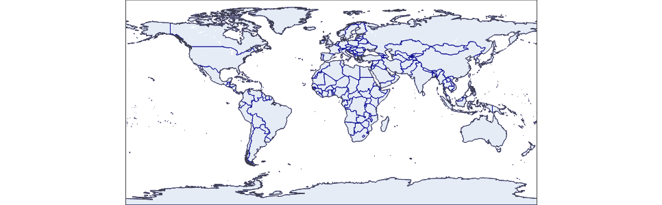
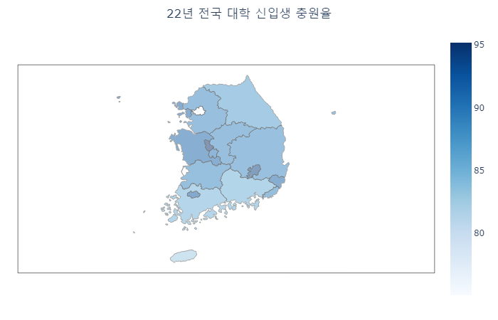

```{r setup, include=FALSE}
knitr::opts_chunk$set(echo = TRUE, message = FALSE, warning = FALSE, fig.width = 6.5, dpi = 130, eval = FALSE)
library(showtext)
showtext_auto()
library(tidyverse)
library(readxl)
library(patchwork)
library(plotly)

```

```{r echo = FALSE, message = FALSE, warning = FALSE, eval = TRUE}
##  R code
## 데이터 전처리를 위한 패키지 설치 및 로딩
if(!require(readr)) {
  install.packages('readr')
  library(readr)
}

if(!require(lubridate)) {
  install.packages('lubridate')
  library(lubridate)
}

if(!require(tidyverse)) {
  install.packages('tidyverse')
  library(tidyverse)
}

## 1. covid19 원본 데이터 셋 로딩
## covid19 데이터 로딩(파일을 다운로드 받은 경우)
# df_covid19 <- read_csv(file = "데이터저장경로/owid-covid-data.csv",
#                             col_types = cols(Date = col_date(format = "%Y-%m-%d")
#                                              )
#                             )
## covid19 데이터 로딩(온라인에서 바로 로딩할 경우)
# df_covid19 <- read_csv(file = "https://covid.ourworldindata.org/data/owid-covid-data.csv",
#                             col_types = cols(Date = col_date(format = "%Y-%m-%d")
#                                              )
#                             )

df_covid19 <- read_csv(file = "D:/R/git/datavisualization/plotly/RnPy/owid-covid-data_221203.csv",
                            col_types = cols(Date = col_date(format = "%Y-%m-%d")
                                             )
                            )
## 2. 전체 데이터셋 중 최근 100일간의 데이터를 필터링한 df_covid19_100 생성
df_covid19_100 <- df_covid19 |> 
  ## 한국 데이터와 각 대륙별 데이터만을 필터링
  filter(iso_code %in% c('KOR', 'OWID_ASI', 'OWID_EUR', 'OWID_OCE', 'OWID_NAM', 'OWID_SAM', 'OWID_AFR')) |>
  ## 읽은 데이터의 마지막 데이터에서 100일전 데이터까지 필터링
  filter(date >= max(date) - 100) |>
  ## 국가명을 한글로 변환
  mutate(location = case_when(
    location == 'South Korea' ~ '한국', 
    location == 'Asia' ~ '아시아', 
    location == 'Europe' ~ '유럽', 
    location == 'Oceania' ~ '오세아니아', 
    location == 'North America' ~ '북미', 
    location == 'South America' ~ '남미', 
    location == 'Africa' ~ '아프리카')) |>
  ## 국가 이름의 순서를 설정 
  mutate(location = fct_relevel(location, '한국', '아시아', '유럽', '북미', '남미', '아프리카', '오세아니아')) |>
  ## 날짜로 정렬
  arrange(date)


## 3. df_covid19_100을 한국과 각 대륙별열로 배치한 넓은 형태의 데이터프레임으로 변환
df_covid19_100_wide <- df_covid19_100 |>
  ## 날짜, 국가명, 확진자와, 백신접종완료자 데이터만 선택
  select(date, location, new_cases, people_fully_vaccinated_per_hundred) |>
  ## 열 이름을 적절히 변경
  rename('date' = 'date', '확진자' = 'new_cases', '백신접종완료자' = 'people_fully_vaccinated_per_hundred') |>
  ## 넓은 형태의 데이터로 변환
  pivot_wider(id_cols = date, names_from = location, 
              values_from = c('확진자', '백신접종완료자')) |>
  ## 날짜로 정렬
  arrange(date)

## 4. covid19 데이터를 국가별로 요약한 df_covid19_stat 생성
df_covid19_stat <- df_covid19 |> 
  group_by(iso_code, continent, location) |>
  summarise(인구수 = max(population, na.rm = T), 
            인당GDP = max(gdp_per_capita, na.rm = T),
            전체확진자수 = sum(new_cases, na.rm = T),
            전체사망자수 = sum(new_deaths, na.rm = T), 
            십만명당중환자실 = last(icu_patients_per_million),
            재생산지수 = last(reproduction_rate),
            봉쇄지수 = max(stringency_index), 
            전체검사자수 = max(total_tests, na.rm = T), 
            신규검사자수 = sum(new_tests, na.rm = T),
            전체백신접종자수 = max(total_vaccinations, na.rm = T),
            백신접종자완료자수 = max(people_fully_vaccinated, na.rm = T),
            부스터접종자수 = max(total_boosters, na.rm = T),
            인구백명당백신접종완료률 = max(people_fully_vaccinated_per_hundred, na.rm = T),
            인구백명당부스터접종자수 = max(total_boosters_per_hundred, na.rm = T)
            ) |> 
    ungroup() |>
    mutate(십만명당사망자수 = round(전체사망자수 / 인구수 *100000, 5),
           백신접종완료률 = 백신접종자완료자수 / 인구수)


```

```{r echo = FALSE, message = FALSE, warning = FALSE, eval = TRUE}
## R 코드

df_취업률 <- read_excel('d:/R/data/2020년 학과별 고등교육기관 취업통계.xlsx', 
                     ## '학과별' 시트의 데이터를 불러오는데,
                     sheet = '학과별',
                     ## 앞의 13행을 제외하고
                     skip = 13, 
                     ## 첫번째 행은 열 이름으로 설정
                     col_names = TRUE, 
                     ## 열의 타입을 설정, 처음 9개는 문자형으로 다음 79개는 수치형으로 설정
                     col_types = c(rep('text', 9), rep('numeric', 79)))

## df_취업률에서 첫번째부터 9번째까지의 열과 '계'로 끝나는 열을 선택하여 다시 df_취업률에 저장
df_취업률 <- df_취업률 |> 
  select(1:9, ends_with('계'), '입대자')

## df_취업률에서 졸업자가 500명 이하인 학과 2000개 샘플링
df_취업률_2000 <- df_취업률 |> 
  filter(졸업자_계 < 500) |>
  mutate(id = row_number()) |>
  filter(row_number() %in% seq(from = 1, to = nrow(df_취업률), by = 4))

## 열 이름을 적절히 설정
names(df_취업률_2000)[10:12] <- c('졸업자수', '취업률', '취업자수')

margins_R = list(t = 50, b = 25, l = 25, r = 25)

```

```{python echo = FALSE, message = FALSE, warning = FALSE, eval = FALSE}
import pandas as pd
from datetime import datetime, timedelta
from pandas.api.types import CategoricalDtype
from matplotlib import pyplot as plt
import plotly.graph_objects as go

df_covid19 = pd.read_csv("D:/R/git/datavisualization/plotly/RnPy/owid-covid-data_221203.csv")

df_covid19['date'] = pd.to_datetime(df_covid19['date'], format="%Y-%m-%d")

df_covid19_100 = df_covid19[(df_covid19['iso_code'].isin(['KOR', 'OWID_ASI', 'OWID_EUR', 'OWID_OCE', 'OWID_NAM', 'OWID_SAM', 'OWID_AFR'])) & (df_covid19['date'] >= (max(df_covid19['date']) - timedelta(days = 100)))]


df_covid19_100.loc[df_covid19_100['location'] == 'South Korea', "location"] = '한국'
df_covid19_100.loc[df_covid19_100['location'] == 'Asia', "location"] = '아시아'
df_covid19_100.loc[df_covid19_100['location'] == 'Europe', "location"] = '유럽'
df_covid19_100.loc[df_covid19_100['location'] == 'Oceania', "location"] = '오세아니아'
df_covid19_100.loc[df_covid19_100['location'] == 'North America', "location"] = '북미'
df_covid19_100.loc[df_covid19_100['location'] == 'South America', "location"] = '남미'
df_covid19_100.loc[df_covid19_100['location'] == 'Africa', "location"] = '아프리카'

ord = CategoricalDtype(categories = ['한국', '아시아', '유럽', '북미', '남미', '아프리카', '오세아니아'], ordered = True)

df_covid19_100['location'] = df_covid19_100['location'].astype(ord)

df_covid19_100 = df_covid19_100.sort_values(by = 'date')

df_covid19_100_wide = df_covid19_100.loc[:,['date', 'location', 'new_cases', 'people_fully_vaccinated_per_hundred']].rename(columns={'new_cases':'확진자', 'people_fully_vaccinated_per_hundred':'백신접종완료자'})

df_covid19_100_wide = df_covid19_100_wide.pivot(index='date', columns='location', values=['확진자', '백신접종완료자']).sort_values(by = 'date')

df_covid19_100_wide.columns = ['확진자_한국', '확진자_아시아', '확진자_유럽', '확진자_북미', '확진자_남미', '확진자_아프리카','확진자_오세아니아',
                              '백신접종완료자_한국', '백신접종완료자_아시아', '백신접종완료자_유럽', '백신접종완료자_북미', '백신접종완료자_남미', '백신접종완료자_아프리카','백신접종완료자_오세아니아']
                              
df_covid19_stat = df_covid19.groupby(['iso_code', 'continent', 'location'], dropna=False).agg(
    인구수 = ('population', 'max'),
    전체확진자수 = ('new_cases', 'sum'),
    전체사망자수 = ('new_deaths', 'sum'), 
    백신접종자완료자수 = ('people_fully_vaccinated', 'max'),
    인구백명당백신접종완료율 = ('people_fully_vaccinated_per_hundred', 'max'),
    인구백명당부스터접종자수 = ('total_boosters_per_hundred', 'max')
).reset_index()

df_covid19_stat['십만명당사망자수'] = round(df_covid19_stat['전체사망자수'] / df_covid19_stat['인구수'] *100000, 5)

df_covid19_stat['백신접종완료율'] = df_covid19_stat['백신접종자완료자수'] / df_covid19_stat['인구수']

######################################   
## python 코드
## 대학 학과 취업률 데이터 셋

df_취업률 = pd.read_excel("d:/R/data/2020년 학과별 고등교육기관 취업통계.xlsx", 
                           sheet_name = '학과별',
                           skiprows=(13), 
                           header = 0)

df_취업률 = pd.concat([df_취업률.iloc[:, 0:8], 
                    df_취업률.loc[:, df_취업률.columns.str.endswith('계')], 
                    df_취업률.loc[:, '입대자']], 
                   axis = 1
                   )

df_취업률_2000 = df_취업률.loc[(df_취업률['졸업자_계'] < 500)]

df_취업률_2000 = df_취업률_2000.iloc[range(0, len(df_취업률_2000.index) , 4)]

df_취업률_2000 = df_취업률_2000.rename(columns = {'졸업자_계':'졸업자수', '취업률_계':'취업률', '취업자_합계_계':'취업자수'})

margins_P = dict(t = 50, b = 25, l = 25, r = 25)

```

이번 장에서는 지금까지 살펴본 시각화외에도 `plotly`에서 추가적으로 제공하는 시각화 중 지수(index)의 시가화와 지도의 시각화를 살펴보도록 하겠다.

지수(Index)는 데이터 들을 특징일 종합하여 하나의 수치로 표현한 것을 말한다. 평균, 표준편차와 같은 수치도 가장 흔하게 만날 수 있는 지수 중에 하나이고 매일 매일 주식 시장 전체의 가격 변동을 종합한 KOPIS나 KOSDAQ와 같은 주가 종합 지수도 있다. 이렇게 하나의 수치를 시각화로 표현하는 방법을 `plotly`에서 제공한다.

지도(Map)의 시각화는 매우 흔하게 사용하는 시각화로 보통 행정 구역과 같은 공간 단위별로 수집된 데이터에 대해 무늬나 색상의 단계로 데이터를 표현하는 단계 구분도(Choropleth map)나 지도위에 위경도 좌표를 지닌 객체들을 표현하는 분산 맵(Scatter map) 등이 사용된다.

# 인디케이터(indicator)

인디케이터의 사전적 의미는 '가리키는 것'이다. 특정한 지시, 징후, 징표를 가리키는 것이라는 의미가 적절할 것이다. `plotly`에서 인디케이터의 의미는 'value' 속성으로 지정된 단일 값을 시각화하는 것이다. 인디케이터의 속성은 다음의 네 가지 속성이 첫번째 레벨의 속성이다.

-   value: 시각화 할 값
-   mode: 인디케이터의 종류
-   align: 수치와 델터 인디케이터의 정렬(left, center, right)
-   domain: 인디케이터의 위치 범위

`plotly`에서는 인디케이터를 시각화하기 위해 indicator 트레이스를 제공한다. indicator 트레이스는 인디케이터로 표현할 수치를 수치, 델타, 게이지의 세 가지 방법을 사용하여 시각화하는 것이다. 이 세가지 방법은 'mode' 속성을 통해 설정이 가능한데, 다음은 indicator 트레이스에서 사용하는 주요 속성이다.


## 수치(number) 인디케이터

수치 인디케이터는 단일 수치값을 시각화하는 방법이다. 이 수치 인디케이터는 indicator 트레이스 속성 중에 'number' 속성에 의해 설정이 가능하다. 다음은 수치 인디케이터의 설정에 사용하는 'number'의 주요 속성이다.


수치 인디케이터는 전체 인디케이터에서 표현되는 부분 중에 수치값을 표현하는 부분으로 수치 인디케이터가 단독으로 사용되기 보다는 뒤에 설명할 'delta'나 'guage'와 함께 전체 인디케이터를 구성하는 일부분으로 사용되는 경우가 일반적이다. 하지만 단순한 현재 수치를 표현할 때는 단독으로 사용될 수 있다.

다음은 주요 5개국의 코로나 19 사망자수 선 그래프에 한국의 코로나 사망자수를 indicator 트레이스로 추가하는 R과 python 코드이다. 한국의 코로나 사망자수를 그리고 나서 그래프 영역의 특정 부분(X축의 0.4\~0.6, Y축의 0,85\~0.95)에 수치 속성만을 가지는 indicator 트레이스를 추가하였다. indicator 트레이스의 'value'를 설정하기 위해 앞서 코로나 사망자수를 그리는데 사용했던 total_deaths_5\_nations_by_day 데이터프레임에서 한국의 10만명당 사망자수 데이터를 산출하고 이 데이터를 사용하여 indicator 트레이스를 생성하였다. indicator 트레이스의 위치를 설정하는데 'domain' 속성을 사용한다.

-   R

R에서 수치 인디케이터를 만들기 위해서는 indicator 트레이스를 만드는데, `add_trace(type = 'indicator', ...)`를 사용한다. 수치 인디케이터는 'mode' 속성을 "number"로 설정하고 'number' 속성을 설정하여 만들 수 있다.

```{r echo=FALSE, eval = TRUE}
## 5개국 데이터로 전처리
total_deaths_5_nations_by_day <- df_covid19 |> 
  filter((iso_code %in% c('KOR', 'USA', 'JPN', 'GBR', 'FRA'))) |>
  filter(!is.na(total_deaths_per_million))

```

```{r}
number_KOR <- total_deaths_5_nations_by_day |>
  filter(date == max(date), iso_code == 'KOR') |>
  select(total_deaths_per_million) |> pull()

fig1 <- total_deaths_5_nations_by_day |>
  plot_ly() |>
  ## scatter 트레이스 생성
  add_trace(type = 'scatter', mode = 'lines', 
            x = ~date, y = ~total_deaths_per_million , 
            linetype = ~location, connectgaps = T) |>
  ## layout의 제목, 축제목, 여백 속성 설정
  layout(title = list(text = '코로나 19 사망자수 추세', pad = list(b = 5)), 
         xaxis = list(title = ''), 
         yaxis = list(title = '10만명당 사망자수 누계', domain = c(0, 0.8)), 
         margin = margins_R)

fig1 |>
  add_trace(type = 'indicator', mode = 'number', 
            value = number_KOR,  
            title = list(text = paste0('<b>한국 코로나 사망자(10만명당)</b>\n', year(today()), '년', month(today()), '월', day(today()), '일'),
                     font = list(family = '나눔고딕', size = 15)
                     ),
            number = list(font = list(family = '나눔고딕', 
                                      size = 15), 
                          suffix = '명'),
            domain = list(x = c(0.4, 0.6), y = c(0.8, 0.9)))

```

```{r echo=FALSE}
number_KOR <- total_deaths_5_nations_by_day |>
  filter(date == max(date), iso_code == 'KOR') |>
  select(total_deaths_per_million) |> pull()

fig1 <- total_deaths_5_nations_by_day |>
  plot_ly() |>
  ## scatter 트레이스 생성
  add_trace(type = 'scatter', mode = 'lines', 
            x = ~date, y = ~total_deaths_per_million , 
            linetype = ~location, connectgaps = T, 
            color = ~location, colors = RColorBrewer::brewer.pal(9, 'Blues')[seq(from = 9, to = 5, by = -1)]
) |>
  ## layout의 제목, 축제목, 여백 속성 설정
  layout(title = list(text = '코로나 19 사망자수 추세', pad = list(b = 5)), 
         xaxis = list(title = ''), 
         yaxis = list(title = '10만명당 사망자수 누계', domain = c(0, 0.8)), 
         margin = margins_R)

fig1 |>
  add_trace(type = 'indicator', mode = 'number', 
            value = number_KOR,  
            title = list(text = paste0('<b>한국 코로나 사망자(10만명당)</b>\n', year(today()), '년', month(today()), '월', day(today()), '일'),
                     font = list(family = '나눔고딕', size = 15)
                     ),
            number = list(font = list(family = '나눔고딕', 
                                      size = 15), 
                          suffix = '명'),
            domain = list(x = c(0.4, 0.6), y = c(0.8, 0.9)))

```

-   python

python에서 수치 인디케이터를 만들기 위해서는 indicator 트레이스를 사용하고, `add_trace()`에 `plotly.graph_objects.Indicator()`를 사용한다. 수치 인디케이터는 'mode' 속성을 "number"로 설정하고 'number' 속성을 설정하여 만들 수 있다.

```{python}
from datetime import datetime, timedelta

today = datetime.today()

number_KOR = total_deaths_5_nations_by_day.loc[(total_deaths_5_nations_by_day['date']==total_deaths_5_nations_by_day['date'].max()) & (total_deaths_5_nations_by_day['iso_code']=='KOR')]
number_KOR = number_KOR.loc[:,'total_deaths_per_million'].values[0]

fig = go.Figure()
for location, group in total_deaths_5_nations_by_day.groupby('location'):
    fig.add_trace(go.Scatter(
        mode = 'lines', 
        x = group['date'], 
        y = group['total_deaths_per_million'], 
        line = dict(dash = nations[location]), 
        name = location,
        connectgaps = True
    ))

fig.update_layout(title = dict(text = '코로나 19 사망자수 추세', x = 0.5), 
                  xaxis = dict(title = ''), 
                  yaxis = dict(title = '10만명당 사망자수 누계', domain = (0, 0.8)))   

fig.add_trace(go.Indicator(
    mode = 'number', value = number_KOR,
    title = dict(text = '<b>한국 코로나 사망자(10만명당)</b><br>' + str(today.year) + '년' + str(today.month) + '월' + str(today.day) + '일\n',
                 font = dict(family = '나눔고딕', size = 15)),
    number = dict(font = dict(family = '나눔고딕', size = 15),
                  suffix = '명'),
    domain = dict(x = (0.4, 0.6), y = (0.8, 0.9))
))

fig.show()

```

```{python echo = FALSE}
from datetime import datetime, timedelta

today = datetime.today()

number_KOR = total_deaths_5_nations_by_day.loc[(total_deaths_5_nations_by_day['date']==total_deaths_5_nations_by_day['date'].max()) & (total_deaths_5_nations_by_day['iso_code']=='KOR')]
number_KOR = number_KOR.loc[:,'total_deaths_per_million'].values[0]

fig = go.Figure()
for location, group in total_deaths_5_nations_by_day.groupby('location'):
    fig.add_trace(go.Scatter(
        mode = 'lines', 
        x = group['date'], 
        y = group['total_deaths_per_million'], 
        line = dict(dash = nations[location]), 
        name = location,
        connectgaps = True
    ))

fig.update_layout(title = dict(text = '코로나 19 사망자수 추세', x = 0.5), 
                  xaxis = dict(title = ''), 
                  yaxis = dict(title = '10만명당 사망자수 누계', domain = (0, 0.8)), 
                 colorway = ("#08306B", "#08519C", "#2171B5", "#4292C6", "#6BAED6"))   

fig.add_trace(go.Indicator(
    mode = 'number', value = number_KOR,
    title = dict(text = '<b>한국 코로나 사망자(10만명당)</b><br>' + str(today.year) + '년' + str(today.month) + '월' + str(today.day) + '일\n',
                 font = dict(family = '나눔고딕', size = 15)),
    number = dict(font = dict(family = '나눔고딕', size = 15),
                  suffix = '명'),
    domain = dict(x = (0.4, 0.6), y = (0.8, 0.9))
))

fig.show()

```


## 델타(delta) 인디케이터

델타 인디케이터는 일반적으로 수치 인디케이터와 병행하여 사용하여 수치 인디케이터에 표현된 값이 비교 기준값과의 차이를 기호와 증감값을 사용하여 보여주는 인디케이터를 말한다. 델타 인디케이터에는 수치 인디케이터에 비해 다음과 같은 몇 가지 요소들이 필요하다.

-   reference : 값의 증감을 비교할 기준 값
-   relative : 값의 증감이 절대적인지, 상대적인지를 결정
-   increasing : 값이 증가할 경우 표시할 속성
-   decreasing : 값이 감소할 경우 표시할 속성

다음은 델타 인디케이터의 설정에 사용하는 'delta'의 주요 속성이다.


-   R

R에서 델타 인디케이터를 만들기 위해서는 indicator 트레이스를 사용하는데, `add_trace(type = 'indicator', ...)`를 사용한다. 수치 인디케이터는 'mode' 속성을 "delta"로 설정하고 'delta' 속성을 설정하여 만들 수 있다.

```{r}
number1_KOR <- total_deaths_5_nations_by_day |>
  filter(date == max(date)-1, iso_code == 'KOR') |>
  select(total_deaths_per_million) |> pull()

fig1 <- total_deaths_5_nations_by_day |>
  plot_ly() |>
  ## scatter 트레이스 생성
  add_trace(type = 'scatter', mode = 'lines', 
            x = ~date, y = ~total_deaths_per_million , 
            linetype = ~location, connectgaps = T) |>
  ## layout의 제목, 축제목, 여백 속성 설정
  layout(title = list(text = '코로나 19 사망자수 추세', pad = list(b = 5)), 
         xaxis = list(title = ''), 
         yaxis = list(title = '10만명당 사망자수 누계', domain = c(0, 0.8)), 
         margin = margins_R)

fig1 |>
  add_trace(type = 'indicator', mode = 'number+delta', 
            value = number_KOR,  
            title = list(text = paste0('<b>한국 코로나 사망자(10만명당)</b>\n', year(today()), '년', month(today()), '월', day(today()), '일'),
                     font = list(family = '나눔고딕', size = 15)
                     ),
            number = list(font = list(family = '나눔고딕', 
                                      size = 15), 
                          suffix = '명'),
            delta = list(reference = number1_KOR, position = 'right', 
                         increasing = list(color = 'red'),
                         decreasing = list(color = 'blue'),
                         font = list(family = '나눔고딕', size = 10)),
            domain = list(x = c(0.4, 0.6), y = c(0.8, 0.9)))

```

```{r echo = FALSE}
number1_KOR <- total_deaths_5_nations_by_day |>
  filter(date == max(date)-1, iso_code == 'KOR') |>
  select(total_deaths_per_million) |> pull()

delta_KOR <- number_KOR - number1_KOR 

fig1 <- total_deaths_5_nations_by_day |>
  plot_ly() |>
  ## scatter 트레이스 생성
  add_trace(type = 'scatter', mode = 'lines', 
            x = ~date, y = ~total_deaths_per_million , 
            linetype = ~location, connectgaps = T, 
            color = ~location, colors = RColorBrewer::brewer.pal(9, 'Blues')[seq(from = 9, to = 5, by = -1)]
) |>
  ## layout의 제목, 축제목, 여백 속성 설정
  layout(title = list(text = '코로나 19 사망자수 추세', pad = list(b = 5)), 
         xaxis = list(title = ''), 
         yaxis = list(title = '10만명당 사망자수 누계', domain = c(0, 0.8)), 
         margin = margins_R)

fig1 |>
  add_trace(type = 'indicator', mode = 'number+delta', 
            value = number_KOR,  
            title = list(text = paste0('<b>한국 코로나 사망자(10만명당)</b>\n', year(today()), '년', month(today()), '월', day(today()), '일'),
                     font = list(family = '나눔고딕', size = 15)
                     ),
            number = list(font = list(family = '나눔고딕', 
                                      size = 15), 
                          suffix = '명'),
            delta = list(reference = number1_KOR, position = 'right', 
                         increasing = list(color = 'red'),
                         decreasing = list(color = 'blue'),
                         font = list(family = '나눔고딕', size = 10)),
            domain = list(x = c(0.4, 0.6), y = c(0.8, 0.9)))

```

-   python

python에서 델타 인디케이터를 만들기 위해서는 indicator 트레이스를 사용하고, `add_trace()`에 `plotly.graph_objects.Indicator()`를 사용한다. 델타 인디케이터는 'mode' 속성을 "delta"로 설정하고 'delta' 속성을 설정하여 만들 수 있다.

```{python}
number1_KOR = total_deaths_5_nations_by_day.loc[(total_deaths_5_nations_by_day['date']==total_deaths_5_nations_by_day['date'].max()- timedelta(days = 1)) & (total_deaths_5_nations_by_day['iso_code']=='KOR')]
number1_KOR = number1_KOR.loc[:,'total_deaths_per_million'].values[0]

fig = go.Figure()
for location, group in total_deaths_5_nations_by_day.groupby('location'):
    fig.add_trace(go.Scatter(
        mode = 'lines', 
        x = group['date'], 
        y = group['total_deaths_per_million'], 
        line = dict(dash = nations[location]), 
        name = location,
        connectgaps = True
    ))

fig.update_layout(title = dict(text = '코로나 19 사망자수 추세', x = 0.5), 
                  xaxis = dict(title = ''), 
                  yaxis = dict(title = '10만명당 사망자수 누계', domain = (0, 0.8)))   

fig.add_trace(go.Indicator(
    mode = 'number+delta', value = number_KOR,
    title = dict(text = '<b>한국 코로나 사망자(10만명당)</b><br>' + str(today.year) + '년' + str(today.month) + '월' + str(today.day) + '일\n',
                 font = dict(family = '나눔고딕', size = 15)),
    number = dict(font = dict(family = '나눔고딕', size = 15),
                  suffix = '명'),
    delta = dict(reference = number1_KOR, position = 'right', 
                 increasing = dict(color = 'red'),
                 decreasing = dict(color = 'blue'),
                 font = dict(family = '나눔고딕', size = 10)),
    domain = dict(x = (0.4, 0.6), y = (0.8, 0.9))
))

fig.show()

```

```{python echo = FALSE}
number1_KOR = total_deaths_5_nations_by_day.loc[(total_deaths_5_nations_by_day['date']==total_deaths_5_nations_by_day['date'].max()- timedelta(days = 1)) & (total_deaths_5_nations_by_day['iso_code']=='KOR')]
number1_KOR = number1_KOR.loc[:,'total_deaths_per_million'].values[0]

fig = go.Figure()
for location, group in total_deaths_5_nations_by_day.groupby('location'):
    fig.add_trace(go.Scatter(
        mode = 'lines', 
        x = group['date'], 
        y = group['total_deaths_per_million'], 
        line = dict(dash = nations[location]), 
        name = location,
        connectgaps = True
    ))

fig.update_layout(title = dict(text = '코로나 19 사망자수 추세', x = 0.5), 
                  xaxis = dict(title = ''), 
                  yaxis = dict(title = '10만명당 사망자수 누계', domain = (0, 0.8)), 
                 colorway = ("#08306B", "#08519C", "#2171B5", "#4292C6", "#6BAED6"))   

fig.add_trace(go.Indicator(
    mode = 'number+delta', value = number_KOR,
    title = dict(text = '<b>한국 코로나 사망자(10만명당)</b><br>' + str(today.year) + '년' + str(today.month) + '월' + str(today.day) + '일\n',
                 font = dict(family = '나눔고딕', size = 15)),
    number = dict(font = dict(family = '나눔고딕', size = 15),
                  suffix = '명'),
    delta = dict(reference = number1_KOR, position = 'right', 
                 increasing = dict(color = 'red'),
                 decreasing = dict(color = 'blue'),
                 font = dict(family = '나눔고딕', size = 10)),
    domain = dict(x = (0.4, 0.6), y = (0.8, 0.9))
))

fig.show()

```


## 게이지(gauge) 인디케이터

게이지 인디케이터는 둥근 반원의 형태의 틀에 둥글게 그려지는 막대의 각도에 의해 최소값과 최대값 사이에서의 현재의 지수를 표현할 때 사용하는 시각화이다. 이 시각화를 구성하는데에는 주 표현값인 'value' 값 이외에 'steps', 'threshold', 'delta'의 속성을 사용한다. 게이지 인디케이터는 indicator 트레이스에 'mode' 속성에 "gauge"를 포함하여 만들 수 있다. "gauge"만을 사용하거나, "number+gauge"를 사용하여 수치와 함꼐 게이지를 사용하거나, "number+gauge+delta"를 사용하여 수치, 게이지, 증감 기호를 모두 사용할 수도 있다.

다음은 게이지 인디케이터의 설정에 사용하는 'gauge'의 주요 속성이다.


-   R

R에서 게이지 인디케이터를 만들기 위해서는 indicator 트레이스를 사용하는데, `add_trace(type = 'indicator', ...)`를 사용한다. 수치 인디케이터는 'mode' 속성을 "gauge"로 설정하고 'gauge' 속성을 설정하여 만들 수 있다.

```{r}
max_deaths_per_million_by_day <- total_deaths_5_nations_by_day |> group_by(location) |>
  summarise(최대사망자 = max(new_deaths_per_million, na.rm = TRUE))

deaths_per_million_in_lateast <- total_deaths_5_nations_by_day |> group_by(location) |>
  filter(is.na(new_deaths_per_million) == FALSE) |>
  filter(date == max(date)) |>
  select(iso_code, date, new_deaths_per_million)


df_gauge <- left_join(max_deaths_per_million_by_day, deaths_per_million_in_lateast, by = 'location') |> arrange(location)

fig_gauge <- df_gauge |> plot_ly() |>
  add_trace(type = 'indicator', mode = "gauge+number", title = pull(df_gauge[3, 1]),
            domain = list(row = 1, column = 1), value = pull(df_gauge[3, 5]), 
            gauge = list(axis = list(
              range = list(NULL, pull(df_gauge[3, 2])*1.2)),
              steps = list(
                list(range = c(0, pull(df_gauge[3, 2])*1.2*0.5), color = "lightgray"),
                list(range = c(pull(df_gauge[3, 2])*1.2*0.5, pull(df_gauge[3, 2])*1.2*0.75), color = "darkgray"),
                list(range = c(pull(df_gauge[3, 2])*1.2*0.75, pull(df_gauge[3, 2])*1.2), color = "gray")),
              threshold = list(line = list(color = 'white'),
                value = pull(df_gauge[3, 2])), 
              bar = list(color = "darkblue")), 
            number = list(suffix = '명'))

fig_gauge <- fig_gauge |>
  add_trace(type = 'indicator', mode = "gauge+number", title = pull(df_gauge[1, 1]),
            domain = list(row = 0, column = 0), value = pull(df_gauge[1, 5]), 
            gauge = list(axis = list(
              range = list(NULL, pull(df_gauge[1, 2])*1.2)),
              steps = list(
                list(range = c(0, pull(df_gauge[1, 2])*1.2*0.5), color = "lightgray"),
                list(range = c(pull(df_gauge[1, 2])*1.2*0.5, pull(df_gauge[1, 2])*1.2*0.75), color = "darkgray"),
                list(range = c(pull(df_gauge[1, 2])*1.2*0.75, pull(df_gauge[1, 2])*1.2), color = "gray")),
              threshold = list(line = list(color = 'white'),
              value = pull(df_gauge[1, 2])), 
            bar = list(color = "darkblue")), 
            number = list(suffix = '명'))

fig_gauge <- fig_gauge |>
  add_trace(type = 'indicator', mode = "gauge+number", title = pull(df_gauge[2, 1]),
            domain = list(row = 0, column = 2), value = pull(df_gauge[2, 5]), 
            gauge = list(axis = list(
              range = list(NULL, pull(df_gauge[2, 2])*1.2)),
              steps = list(
                list(range = c(0, pull(df_gauge[2, 2])*1.2*0.5), color = "lightgray"),
                list(range = c(pull(df_gauge[2, 2])*1.2*0.5, pull(df_gauge[2, 2])*1.2*0.75), color = "darkgray"),
                list(range = c(pull(df_gauge[2, 2])*1.2*0.75, pull(df_gauge[2, 2])*1.2), color = "gray")),
              threshold = list(line = list(color = 'white'),
              value = pull(df_gauge[2, 2])), 
            bar = list(color = "darkblue")), 
            number = list(suffix = '명'))

fig_gauge <- fig_gauge |>
  add_trace(type = 'indicator', mode = "gauge+number", title = pull(df_gauge[4, 1]),
            domain = list(row = 2, column = 0), value = pull(df_gauge[4, 5]), 
            gauge = list(axis = list(
              range = list(NULL, pull(df_gauge[4, 2])*1.2)),
              steps = list(
                list(range = c(0, pull(df_gauge[4, 2])*1.2*0.5), color = "lightgray"),
                list(range = c(pull(df_gauge[4, 2])*1.2*0.5, pull(df_gauge[4, 2])*1.2*0.75), color = "darkgray"),
                list(range = c(pull(df_gauge[4, 2])*1.2*0.75, pull(df_gauge[4, 2])*1.2), color = "gray")),
              threshold = list(line = list(color = 'white'),
              value = pull(df_gauge[4, 2])), 
            bar = list(color = "darkblue")), 
            number = list(suffix = '명'))

fig_gauge <- fig_gauge |>
  add_trace(type = 'indicator', mode = "gauge+number", title = pull(df_gauge[5, 1]),
            domain = list(row = 2, column = 2), value = pull(df_gauge[5, 5]), 
            gauge = list(axis = list(
              range = list(NULL, pull(df_gauge[5, 2])*1.2)),
              steps = list(
                list(range = c(0, pull(df_gauge[5, 2])*1.2*0.5), color = "lightgray"),
                list(range = c(pull(df_gauge[5, 2])*1.2*0.5, pull(df_gauge[5, 2])*1.2*0.75), color = "darkgray"),
                list(range = c(pull(df_gauge[5, 2])*1.2*0.75, pull(df_gauge[5, 2])*1.2), color = "gray")),
              threshold = list(line = list(color = 'white'),
              value = pull(df_gauge[5, 2])), 
            bar = list(color = "darkblue")), 
            number = list(suffix = '명'))

fig_gauge |> layout(grid=list(rows=3, columns=3), 
                    margin = margins_R, 
                    title = '10만명당 사망자수(최근 공식발표 기준)')


```

-   python

python에서 게이지 인디케이터를 만들기 위해서는 indicator 트레이스를 사용하고, `add_trace()`에 `plotly.graph_objects.Indicator()`를 사용한다. 게이지 인디케이터는 'mode' 속성을 "gauge"로 설정하고 'gauge' 속성을 설정하여 만들 수 있다.

```{python}
deaths_per_million_in_lateast = total_deaths_5_nations_by_day[total_deaths_5_nations_by_day['new_deaths_per_million'].isna() == False]
deaths_per_million_in_lateast = pd.merge(deaths_per_million_in_lateast.groupby('location')['date'].max(), deaths_per_million_in_lateast, on = ("location", 'date'))[['iso_code', 'location', 'date', 'new_deaths_per_million']]
df_gauge = pd.merge(deaths_per_million_in_lateast, total_deaths_5_nations_by_day.groupby('location')['new_deaths_per_million'].max().reset_index(), on = 'location').sort_values('location')
df_gauge.columns = ('iso_code', 'location', 'date', '최근사망자', '최대사망자')

fig = go.Figure()
fig.add_trace(go.Indicator(
    type = 'indicator', mode = "gauge+number", title = df_gauge.iloc[2, 1],
            domain = dict(row = 1, column = 1), value = df_gauge.iloc[2, 3], 
            gauge = dict(axis = dict(
              range = (0, df_gauge.iloc[2, 4]*1.2)),
              steps = [
                dict(range = (0, (df_gauge.iloc[2, 4])*1.2*0.5), color = "lightgray"),
                dict(range = ((df_gauge.iloc[2, 4])*1.2*0.5, (df_gauge.iloc[2, 4])*1.2*0.75), color = "darkgray"), 
                dict(range = ((df_gauge.iloc[2, 4])*1.2*0.75, (df_gauge.iloc[2, 4])*1.2), color = "gray")],
              threshold = dict(
                line = dict(color = 'white'),
                value = df_gauge.iloc[2, 4]), 
              bar = dict(color = "darkblue")), 
            number = dict(suffix = '명')
))

fig.add_trace(go.Indicator(
    type = 'indicator', mode = "gauge+number", title = df_gauge.iloc[0, 1],
            domain = dict(row = 0, column = 0), value = df_gauge.iloc[0, 3], 
            gauge = dict(axis = dict(
              range = (0, df_gauge.iloc[0, 4]*1.2)),
              steps = [
                dict(range = (0, (df_gauge.iloc[0, 4])*1.2*0.5), color = "lightgray"),
                dict(range = ((df_gauge.iloc[0, 4])*1.2*0.5, (df_gauge.iloc[0, 4])*1.2*0.75), color = "darkgray"),
                dict(range = ((df_gauge.iloc[0, 4])*1.2*0.75, (df_gauge.iloc[0, 4])*1.2), color = "gray")],
              threshold = dict(
                line = dict(color = 'white'),
                value = df_gauge.iloc[0, 4]), 
              bar = dict(color = "darkblue")), 
            number = dict(suffix = '명')))

fig.add_trace(go.Indicator(
    type = 'indicator', mode = "gauge+number", title = df_gauge.iloc[1, 1],
            domain = dict(row = 0, column = 2), value = df_gauge.iloc[1, 3], 
            gauge = dict(axis = dict(
              range = (0, df_gauge.iloc[1, 4]*1.2)),
              steps = [
                dict(range = (0, (df_gauge.iloc[1, 4])*1.2*0.5), color = "lightgray"),
                dict(range = ((df_gauge.iloc[1, 4])*1.2*0.5, (df_gauge.iloc[1, 4])*1.2*0.75), color = "darkgray"),
                dict(range = ((df_gauge.iloc[1, 4])*1.2*0.75, (df_gauge.iloc[1, 4])*1.2), color = "gray")],
              threshold = dict(
                line = dict(color = 'white'),
                value = df_gauge.iloc[1, 4]), 
              bar = dict(color = "darkblue")), 
            number = dict(suffix = '명')))

fig.add_trace(go.Indicator(
    type = 'indicator', mode = "gauge+number", title = df_gauge.iloc[3, 1],
            domain = dict(row = 2, column = 0), value = df_gauge.iloc[3, 3], 
            gauge = dict(axis = dict(
              range = (0, df_gauge.iloc[3, 4]*1.2)),
              steps = [
                dict(range = (0, (df_gauge.iloc[3, 4])*1.2*0.5), color = "lightgray"),
                dict(range = ((df_gauge.iloc[3, 4])*1.2*0.5, (df_gauge.iloc[3, 4])*1.2*0.75), color = "darkgray"),
                dict(range = ((df_gauge.iloc[3, 4])*1.2*0.75, (df_gauge.iloc[3, 4])*1.2), color = "gray")],
              threshold = dict(
                line = dict(color = 'white'),
                value = df_gauge.iloc[3, 4]), 
              bar = dict(color = "darkblue")), 
            number = dict(suffix = '명')))

fig.add_trace(go.Indicator(
    type = 'indicator', mode = "gauge+number", title = df_gauge.iloc[4, 1],
            domain = dict(row = 2, column = 2), value = df_gauge.iloc[4, 3], 
            gauge = dict(axis = dict(
              range = (0, df_gauge.iloc[4, 4]*1.2)),
              steps = [
                dict(range = (0, (df_gauge.iloc[4, 4])*1.2*0.5), color = "lightgray"),
                dict(range = ((df_gauge.iloc[4, 4])*1.2*0.5, (df_gauge.iloc[4, 4])*1.2*0.75), color = "darkgray"),
                dict(range = ((df_gauge.iloc[4, 4])*1.2*0.75, (df_gauge.iloc[4, 4])*1.2), color = "gray")],
              threshold = dict(
                line = dict(color = 'white'),
                value = df_gauge.iloc[4, 4]), 
              bar = dict(color = "darkblue")), 
            number = dict(suffix = '명')))

fig.update_layout(grid=dict(rows=3, columns=3),
              title = dict(text = '10만명당 사망자수(최근 공식발표 기준)', x = 0.5))

fig.show()

```


## 불릿(bullet) 인디케이터

불릿 인디케이터는 막대 그래프를 변형하여 특정 값의 현재 상태를 표시하는 시각화의 방법이다. 온도계나 진행률의 표시에 사용되는 방식을 차용하여 만드는 불릿 인디케이터는 둥글게 표시되는 게이지 인디케이터의 대용으로 대시보드에서 많이 사용된다. 불릿 인디케이터는 단계를 나타내는 질적 단계(step)와 양적 막대(value), 임계치의 표시의 세 가지 요소로 구성한다. 단계는 일반적으로 배열의 형태로 단계 값들을 지정하여 정의하고, 막대는 표시할 수치의 현재 값을 나타내고, 임계값은 수치의 목표치나 한계치에 대한 목표 지점을 표시함으로서 나타낸다.

불릿 인디케이터는 indicator 트레이스를 사용하여 만들수 있고 게이지 인디케이터의 속성 중 'shape'를 "bullet"으로 설정함으로써 만들 수 있다. 또 게이지 인디케이터의 속성들을 공유한다.

-   R

R에서 불릿 인디케이터를 만들기 위해서는 indicator 트레이스를 사용하는데, `add_trace(type = 'indicator', ...)`를 사용한다. 불릿 인디케이터는 'mode' 속성을 "gauge"로, 'gauge'의 'shape' 속성을 "bullet"으로 설정하고 'gauge' 속성을 설정하여 만들 수 있다.

```{r}
fig_gauge <- df_gauge |> plot_ly() |>
  add_trace(type = 'indicator', mode = "gauge+number", title = pull(df_gauge[3, 1]),
            domain = list(x = c(0.3,0.8), y = c(0.82, 0.9)),
            value = pull(df_gauge[3, 5]), 
            gauge = list(axis = list(
              range = list(NULL, pull(df_gauge[3, 2])*1.2)),
              steps = list(
                list(range = c(0, pull(df_gauge[3, 2])*1.2*0.5), color = "lightgray"),
                list(range = c(pull(df_gauge[3, 2])*1.2*0.5, pull(df_gauge[3, 2])*1.2*0.75), color = "darkgray"),
                list(range = c(pull(df_gauge[3, 2])*1.2*0.75, pull(df_gauge[3, 2])*1.2), color = "gray")),
              shape = "bullet",
              threshold = list(
                line = list(color = 'white'),
                value = pull(df_gauge[3, 2])), 
              bar = list(color = "darkblue")), 
            number = list(suffix = '명'))

fig_gauge <- fig_gauge |>
  add_trace(type = 'indicator', mode = "gauge+number", title = pull(df_gauge[1, 1]),
            domain = list(x = c(0.3,0.8), y = c(0.62, 0.7)),
            value = pull(df_gauge[1, 5]), 
            gauge = list(axis = list(
              shape = "bullet",
              range = list(NULL, pull(df_gauge[1, 2])*1.2)),
              steps = list(
                list(range = c(0, pull(df_gauge[1, 2])*1.2*0.5), color = "lightgray"),
                list(range = c(pull(df_gauge[1, 2])*1.2*0.5, pull(df_gauge[1, 2])*1.2*0.75), color = "darkgray"),
                list(range = c(pull(df_gauge[1, 2])*1.2*0.75, pull(df_gauge[1, 2])*1.2), color = "gray")),
              shape = "bullet",
              threshold = list(
              line = list(color = 'white'),
              value = pull(df_gauge[1, 2])), 
            bar = list(color = "darkblue")), 
            number = list(suffix = '명'))

fig_gauge <- fig_gauge |>
  add_trace(type = 'indicator', mode = "gauge+number", title = pull(df_gauge[2, 1]),
            domain = list(x = c(0.3,0.8), y = c(0.42, 0.5)),
            value = pull(df_gauge[2, 5]), 
            gauge = list(axis = list(
              shape = "bullet",
              range = list(NULL, pull(df_gauge[2, 2])*1.2)),
              steps = list(
                list(range = c(0, pull(df_gauge[2, 2])*1.2*0.5), color = "lightgray"),
                list(range = c(pull(df_gauge[2, 2])*1.2*0.5, pull(df_gauge[2, 2])*1.2*0.75), color = "darkgray"),
                list(range = c(pull(df_gauge[2, 2])*1.2*0.75, pull(df_gauge[2, 2])*1.2), color = "gray")),
              shape = "bullet",
              threshold = list(
              line = list(color = 'white'),
              value = pull(df_gauge[2, 2])), 
            bar = list(color = "darkblue")), 
            number = list(suffix = '명'))

fig_gauge <- fig_gauge |>
  add_trace(type = 'indicator', mode = "gauge+number", title = pull(df_gauge[4, 1]),
            domain = list(x = c(0.3,0.8), y = c(0.22, 0.3)),
            value = pull(df_gauge[4, 5]), 
            gauge = list(axis = list(
              shape = "bullet",
              range = list(NULL, pull(df_gauge[4, 2])*1.2)),
              steps = list(
                list(range = c(0, pull(df_gauge[4, 2])*1.2*0.5), color = "lightgray"),
                list(range = c(pull(df_gauge[4, 2])*1.2*0.5, pull(df_gauge[4, 2])*1.2*0.75), color = "darkgray"),
                list(range = c(pull(df_gauge[4, 2])*1.2*0.75, pull(df_gauge[4, 2])*1.2), color = "gray")),
              shape = "bullet",
              threshold = list(
              line = list(color = 'white'),
              value = pull(df_gauge[4, 2])), 
            bar = list(color = "darkblue")), 
            number = list(suffix = '명'))

fig_gauge <- fig_gauge |>
  add_trace(type = 'indicator', mode = "gauge+number", title = pull(df_gauge[5, 1]),
            domain = list(x = c(0.3,0.8), y = c(0.02, 0.1)),
            value = pull(df_gauge[5, 5]), 
            gauge = list(axis = list(
              shape = "bullet",
              range = list(NULL, pull(df_gauge[5, 2])*1.2)),
              steps = list(
                list(range = c(0, pull(df_gauge[5, 2])*1.2*0.5), color = "lightgray"),
                list(range = c(pull(df_gauge[5, 2])*1.2*0.5, pull(df_gauge[5, 2])*1.2*0.75), color = "darkgray"),
                list(range = c(pull(df_gauge[5, 2])*1.2*0.75, pull(df_gauge[5, 2])*1.2), color = "gray")),
              shape = "bullet",
              threshold = list(
              line = list(color = 'white'),
              value = pull(df_gauge[5, 2])), 
            bar = list(color = "darkblue")), 
            number = list(suffix = '명'))

fig_gauge |> layout(margin = margins_R, 
                    title = '10만명당 사망자수(최근 공식발표 기준)')
```

-   python

python에서 불릿 인디케이터를 만들기 위해서는 indicator 트레이스를 사용하고, `add_trace()`에 `plotly.graph_objects.Indicator()`를 사용한다. 불릿 인디케이터는 'mode' 속성을 "gauge"로, 'gauge'의 'shape' 속성을 "bullet"로 설정하고 'gauge' 속성을 설정하여 만들 수 있다.

```{python}
fig = go.Figure()
fig.add_trace(go.Indicator(
    type = 'indicator', mode = "gauge+number", title = df_gauge.iloc[2, 1],
            domain = dict(x = (0.3,0.8), y = (0.82, 0.9)),
            value = df_gauge.iloc[2, 3], 
            gauge = dict(axis = dict(
              range = (0, df_gauge.iloc[2, 4]*1.2)),
              shape = "bullet",
              steps = [
                dict(range = (0, (df_gauge.iloc[2, 4])*1.2*0.5), color = "lightgray"),
                dict(range = ((df_gauge.iloc[2, 4])*1.2*0.5, (df_gauge.iloc[2, 4])*1.2*0.75), color = "darkgray"),
                dict(range = ((df_gauge.iloc[2, 4])*1.2*0.75, (df_gauge.iloc[2, 4])*1.2), color = "gray")],
              threshold = dict(
                line = dict(color = 'white'),
                value = df_gauge.iloc[2, 4]), 
              bar = dict(color = "darkblue")), 
            number = dict(suffix = '명')))

fig.add_trace(go.Indicator(
    type = 'indicator', mode = "gauge+number", title = df_gauge.iloc[0, 1],
            domain = dict(x = (0.3,0.8), y = (0.62, 0.7)),
            value = df_gauge.iloc[0, 3], 
            gauge = dict(axis = dict(
              range = (0, df_gauge.iloc[0, 4]*1.2)),
              shape = "bullet",
              steps = [
                dict(range = (0, (df_gauge.iloc[0, 4])*1.2*0.5), color = "lightgray"),
                dict(range = ((df_gauge.iloc[0, 4])*1.2*0.5, (df_gauge.iloc[0, 4])*1.2*0.75), color = "darkgray"),
                dict(range = ((df_gauge.iloc[0, 4])*1.2*0.75, (df_gauge.iloc[0, 4])*1.2), color = "gray")],
              threshold = dict(
                line = dict(color = 'white'),
                value = df_gauge.iloc[0, 4]), 
              bar = dict(color = "darkblue")), 
            number = dict(suffix = '명')))

fig.add_trace(go.Indicator(
    type = 'indicator', mode = "gauge+number", title = df_gauge.iloc[1, 1],
            domain = dict(x = (0.3,0.8), y = (0.42, 0.5)),
            value = df_gauge.iloc[1, 3], 
            gauge = dict(axis = dict(
              range = (0, df_gauge.iloc[1, 4]*1.2)),
              shape = "bullet",
              steps = [
                dict(range = (0, (df_gauge.iloc[1, 4])*1.2*0.5), color = "lightgray"),
                dict(range = ((df_gauge.iloc[1, 4])*1.2*0.5, (df_gauge.iloc[1, 4])*1.2*0.75), color = "darkgray"),
                dict(range = ((df_gauge.iloc[1, 4])*1.2*0.75, (df_gauge.iloc[1, 4])*1.2), color = "gray")],
              threshold = dict(
                line = dict(color = 'white'),
                value = df_gauge.iloc[1, 4]), 
              bar = dict(color = "darkblue")), 
            number = dict(suffix = '명')))

fig.add_trace(go.Indicator(
    type = 'indicator', mode = "gauge+number", title = df_gauge.iloc[3, 1],
            domain = dict(x = (0.3,0.8), y = (0.22, 0.3)),
            value = df_gauge.iloc[3, 3], 
            gauge = dict(axis = dict(
              range = (0, df_gauge.iloc[3, 4]*1.2)),
              shape = "bullet",
              steps = [
                dict(range = (0, (df_gauge.iloc[3, 4])*1.2*0.5), color = "lightgray"),
                dict(range = ((df_gauge.iloc[3, 4])*1.2*0.5, (df_gauge.iloc[3, 4])*1.2*0.75), color = "darkgray"),
                dict(range = ((df_gauge.iloc[3, 4])*1.2*0.75, (df_gauge.iloc[3, 4])*1.2), color = "gray")],
              threshold = dict(
                line = dict(color = 'white'),
                value = df_gauge.iloc[3, 4]), 
              bar = dict(color = "darkblue")), 
            number = dict(suffix = '명')))

fig.add_trace(go.Indicator(
    type = 'indicator', mode = "gauge+number", title = df_gauge.iloc[4, 1],
            domain = dict(x = (0.3,0.8), y = (0.02, 0.1)),
            value = df_gauge.iloc[4, 3], 
            gauge = dict(axis = dict(
              range = (0, df_gauge.iloc[4, 4]*1.2)),
              shape = "bullet",
              steps = [
                dict(range = (0, (df_gauge.iloc[4, 4])*1.2*0.5), color = "lightgray"),
                dict(range = ((df_gauge.iloc[4, 4])*1.2*0.5, (df_gauge.iloc[4, 4])*1.2*0.75), color = "darkgray"),
                dict(range = ((df_gauge.iloc[4, 4])*1.2*0.75, (df_gauge.iloc[4, 4])*1.2), color = "gray")],
              threshold = dict(
                line = dict(color = 'white'),
                value = df_gauge.iloc[4, 4]), 
              bar = dict(color = "darkblue")), 
            number = dict(suffix = '명')))

fig.update_layout(grid=dict(rows=3, columns=3),
              title = dict(text = '10만명당 사망자수(최근 공식발표 기준)', x = 0.5))

fig.show()
```


# 지도의 시각화

지도의 시각화는 `plotly`에서 쉽게 할수 있는 매우 강력한 시각화 방법이다. 사실 지도의 시각화는 엑셀이나 파워포인트, 포토샾이나 일러스트 같은 대중적으로 많이 사용되는 툴에서도 가능하겠지만 매우 번거로운 작업임에 틀림없다. 또 단순한 지도의 시각화라면 다소의 시간과 많은 정신적 스트레스를 감소하고라도 할 수 있겠지만 만약 200개가 넘는 시군구 지역별 시각화를 해야한다면 이는 단순히 시간과 정신적 스트레스과 바꿀수 있는 작업이 아닐 것이다. 이때는 전문가를 찾아 의뢰하는 것이 해결책이겠지만 항상 전문가들은 바쁘기때문에 시간이 많이 소요되고 비싸다. `plolty`는 지도의 시각화에 생각보다 많은 기능이 지원된다.

지도를 시각화하기 위해서는 먼저 몇가지 알아야하는 개념이 있다.

## 지도 시각화의 기초 개념

### 지형 데이터

지형 데이터는 지도를 표현하기 위한 지형의 경계선에 대한 폴리곤 정보를 가지고 있는 데이터를 말한다. 지형 데이터는 다음의 두 가지 형태의 데이터 파일로 제공된다.

-   shape 파일

Shape 파일은 대부분의 GIS(Geographical Information System)에서 사용되는 지형 벡터 데이터 파일 포맷이다. 확장자를 'shp'로 설정하는데 선, 점, 다각형(Polygon)으로 지형을 벡터의 형태로 표현하는 텍스트 파일이다. 하지만 Shape 파일은 보통'\*.shp', '\*.shx', '\*.dbf', '\*.kml', '\*.prj' 등의 파일이 한 세트처럼 제공되는 것이 일반적이다. 그렇다고 이 네개의 파일을 모두 쓰는 것은 아니고 사용하는 응용에 따라 선택하여 사용할 수 있다.

-   geojson 파일

GeoJSON은 위치정보를 갖는 점을 기반으로 체계적으로 지형을 표현하기 위해 설계된 개방형 공개 표준 형식이다. 지형 정보를 자바스그립트 오브젝트 노테이션(JAVA Script Object Notation, JSON)을 활용하여 사용하는 파일 포맷으로 OpenLayers, Leaflet, MapServer, Geoforge 소프트웨어, GeoServer, GeoDjango, GDAL, Safe Software FME 등 많은 매핑 및 GIS 소프트웨어 패키지에서 지원하고있다[^1]

[^1]: <https://ko.wikipedia.org/wiki/GeoJSON>

geojson 파일의 확장자는 '\*.json'으로 붙는다. geojson 파일은 앞서 설명한 Shape 파일에서부터 변환하여 생성할 수 있다.

geojson 파일은 Shape 파일에 비해 파일 사이즈가 작고 처리속도도 Shape 파일보다 매우 빠르다는 장점이 있다.

### 지도 투영법

지구는 3차원의 구형태이지만 우리가 보는 지도는 2차원의 평면이다. 따라서 3차원을 2차원에 표현해야 하기 때문에 이 표현의 방법이 여러가지인데 이를 투영법(Projection)이라고 한다. `plotly`에서는 이 투영법에 따라 지도가 화면에 표현되는 평태가 달라진다. `plolty`에서 지원하는 투영법은 정각도법(equirectangular), 원통도법(mercator), 정사도법(orthographic) 등 총 22개의 투영법을 지원한다.

### 좌표계의 종류

일반적으로 지도의 좌표라고 하면 북위, 남위와 같이 적도를 기준으로 북쪽으로 얼마나 많이 떨어졌는지, 남쪽으로 얼마나 많이 떨어졌는지를 표시하는 위도(latitude)와 동경, 서경과 같이 영국 그리니치 천문대를 기준으로 동쪽으로의 위치, 서쪽으로의 위치를 표시하는 경도(longitude)를 생각한다. 이를 좌표계라고 하는데 이 좌표계도 몇 가지 종류가 있다. 이 좌표계가 어떻게 설정되어 있는가에 따라 같은 위도와 경도의 위치도 달라질 수 있다.

-   WGS84(EPSG:4326): 미국에서 군사용으로 GPS 시스템를 이용하면서 만든 좌표계(경도와 위도)

-   Bessel 1841(EPSG:4004): 3차원 원형 지구를 2차원으로 투영한 결과에 대한 좌표계로 우리나라에서 많이 사용되는 좌표계

-   GRS80 UTM-K(EPSG:5179): 한반도 전체를 하나의 좌표계로, 전국을경도 127.5를 기준으로 설계한 지도로 네이버에서 사용

-   GRS80 중부원점(EPSG:5181): 과거 지리원 좌표계를 타원체로 수정한 좌표계. Kakao, 공공데이터포탈에서 사용

-   Web mercator projection(Pseudo-Mercator, EPSG:3857) : WGS84 타원체의 장반경을 반지름으로 하는 좌표계로 구글, 빙, 야후 등 에서 사용

-   Albers projection(EPSG:9822) : 미국 지질 조사국에서 사용하는 좌표계

## 지도의 데이터 표현

`plotly`는 지도를 그리기 위해 사용하는 패키지가 아니다. 즉 `plotly`에서의 지도의 사용은 지역적 데이터를 표현하기 지도를 사용하여 시각화하기 위해 사용하는 것이다. 그렇다면 데이터를 어떻게 지도위에 표현할 것인가가 가장 중요하다. 지도위에 데이터를 표현하는 방법은 지역의 색을 사용하여 각각의 지역의 특성을 시각화하는 단계 구분도(Choropleth Map)과 지도의 특정 위치에 점을 표기하는 방법(Scatter Map)이 많이 사용된다.

### 지도 트레이스

`plotly`에서 지도를 그리기 위해서는 앞서 설명한 두 가지 데이터 타입(shape, geojson) 중 geojson 타입을 기본적으로 사용한다. 이 geojson 데이터를 사용하여 지도에 데이터를 표현하는 방법에 따라 다음과 같이 다섯 가지 트레이스를 제공한다.

-   scatter geo 트레이스 : geojson 지형 정보 위에 위도와 경도로 표현된 scatter 트레이스의 점이나 선을 표시하는 트레이스

-   choropleth 트레이스 : geojson 지형 정보의 지형 다각형(polygon)에 'z'로 매핑되는 내부 색을 통해 데이터를 표현하는 트레이스

-   scattermapbox 트레이스 : mapbox.com에서 제공하는 맵위에 위도와 경도로 표현된 scatter 트레이스의 점이나 선을 표시하는 트레이스

-   choroplethmapbox 트레이스 : mapbox.com에서 제공하는 맵위에 지형 다각형(polygon)에 'z'로 매핑되는 내부 색을 통해 데이터를 표현하는 트레이스

-   densitymapbox 트레이스 : 색상을 사용하여 위도, 경도 좌표와 'z'에 매핑된 값에 따른 밀도 커널 데이터를 표현하는 트레이스

### 단계 구분도(Choropleth Map)

지역적으로 구분된 데이터를 지도에 표시하는 방법으로 가장 많이 사용되는 것은 색으로 지도의 지형에 데이터를 표시하는 방법이다. 각각의 다각형(Polygon)으로 구성되어 있는 지역의 내부 색을 데이터에 따라 다르게 함으로서 지역간 데이터의 차이를 시각화 하는 방법이다. 결국 색이 칠해진 다각형을 배치함으로 데이터를 표현하는 것이다.

단계 구분도를 그리기 위해 전국의 대학 충원률 데이터를 사용하도록 하겠다.[^2] 앞서 다른 `plotly`의 트레이스는 대부분 R과 python의 용법이 유사했지만 지도의 시각화에는 다소 차이가 있기 때문에 따로 설명하도록 한다.

[^2]: 해당 파일은 교육통계 홈페이지([https://kess.kedi.re.kr)에서](https://kess.kedi.re.kr)에서){.uri} 다운로드 받을 수 있으며 필자의 블로그에서도 다운받을 수 있다.

단계 구분도를 그리기 위해 중요한 것은 지형 데이터에서 지역을 표현하는 키와 표현할 데이터에서 지역을 표현하는 키를 맞추어야 한다는 것이다. 전국 대학 충원률 데이터에서는 지역이 한글로 표현되어 있고 지형 데이터에서는 각각의 지형 데이터에서 사용하는 형태의 키로 저장되어 있기 때문에 지형 데이터의 키와 맞추기 위해 충원률 데이터의 지역을 지형 데이터의 키로 변환하는 과정을 거쳤다.

-   R

R에서 단계 구분도를 그리기 위해서는 choropleth 트레이스를 사용하는데 `add_trace(type = 'choropleth', ...)`를 사용한다. R에서 단계 구분도를 그리기 위한 지형 데이터를 가져오는 방법은 여러가지가 있지만 여기서는 `raster` 패키지의 `getData()`를 통해 제공되는 한국의 지형 데이터를 사용하였다. `getData()`는 특정 국가의 지형 데이터를 가져오는 함수인데 'level'에 따라 지도의 지형 레벨을 결정할 수 있는데 한국 지형 데이터의 경우 'level = 1'이면 시도 단위의 지형 데이터를 의미한다. 이 데이터를 `sf` 데이터 타입으로 가져왔는데 `sf` 데이터 타입은 R의 `sf` 패키지에서 제공하는 데이터 타입으로 'simple feature'의 준말이다.

`sf` 데이터 타입은 지형 데이터를 R에서 기본적으로 사용되는 data.frame이나 tibble 형태로 저장하는 데이터 타입으로 R에서 다루기가 쉽게 사용되는 데이터 타입으로 R을 종합적으로 관장하는 R consortium에서 관리하는 데이터 타입이다. 따라서 R에서 가장 쉽게 지형 데이터를 관리하고 처리할 수 있는 데이터 타입이기 때문에 `plolty`에서도 `sf` 데이터 타입을 지원할 수 있도록 `add_sf()`를 제공한다. `sf` 데이터 타입으로 정의된 지형 데이터는 다른 트레이스에서 사용했던 `add_trace()`대신 `add_sf()`를 사용하여 지형 데이터를 만들어주는데 코드는 다음과 같다.[^3]

[^3]: add_trace(type = 'choropleth', ...)을 사용하여 만들수도 있겠으나 지도의 크기가 작게 표현되어 R에서는 add_sf()를 쓰는 것이 효과적이다.


```{r echo = FALSE}
library(raster)
library(sf)

####  충원율 데이터
df_충원율 <- read_excel('D:/R/git/datavisualization/plotly/RnPy/chap6/고등 주요 01-시도별 신입생 충원율(2010-2022)_220825y.xlsx', 
                     ## 'data' 시트의 데이터를 불러오는데,
                     sheet = 'Sheet1',
                     ## 앞의 10행을 제외하고
                     skip = 7, 
                     ## 첫번째 행은 열 이름을 설정
                     col_names = FALSE, 
                     ## 열의 타입을 설정, 처음 8개는 문자형으로 다음 56개는 수치형으로 설정
                     col_types = c(rep('text', 2), rep('numeric', 12)))

df_충원율 <- df_충원율 |> dplyr::select(1, 2, 3, 4, 5)

## df_입학자의 열이름을 적절한 이름으로 설정
colnames(df_충원율) <- c('연도', '지역', '정원내모집인원', '정원내입학생수', '신입생충원율')


df_충원율 <- df_충원율 |> filter(연도 == '2022', 지역 != '전국') |> 
  mutate(id = case_when(
    지역 == '강원' ~ 'KR.KW', 
    지역 == '경기' ~ 'KR.KG',
    지역 == '경남' ~ 'KR.KN',
    지역 == '경북' ~ 'KR.KB',
    지역 == '광주' ~ 'KR.KJ',
    지역 == '대구' ~ 'KR.TG',
    지역 == '대전' ~ 'KR.TJ',
    지역 == '부산' ~ 'KR.PU',
    지역 == '서울' ~ 'KR.SO',
    지역 == '세종' ~ 'KR.SJ',
    지역 == '울산' ~ 'KR.UL',
    지역 == '인천' ~ 'KR.IN',
    지역 == '전남' ~ 'KR.CN',
    지역 == '전북' ~ 'KR.CB',
    지역 == '제주' ~ 'KR.CJ',
    지역 == '충남' ~ 'KR.GN',
    지역 == '충북' ~ 'KR.GB'
  ))

# Get the map data in sf format
map_data <- getData("GADM", country = "KOR", level = 1, type = "sf")
st_crs(map_data) <- st_crs(map_data)

province <- map_data$HASC_1

plot_dat <- left_join(map_data, df_충원율, by = c("HASC_1" = "id")) %>%
  st_as_sf()

plot_ly(plot_dat) %>%
  add_sf(type = "scatter", 
         split = ~지역,
         color = ~신입생충원율,
         showlegend = F,       # don't show a legend for each region
         colors = "Blues",
         text = ~paste0(지역, "\n", round(신입생충원율, 2), '%'),
         hoveron = "fills",
         hoverinfo = "text") %>%
  layout(title = '22년 전국 대학 신입생 충원율', 
         margin = margins_R) 

```

```{r echo = FALSE}
library(raster)
library(sf)

# Get the map data in sf format
map_data <- getData("GADM", country = "KOR", level = 1, type = "sf")
st_crs(map_data) <- st_crs(map_data)

province <- map_data$HASC_1

####  충원율 데이터
df_충원율 <- read_excel('데이터저장경로/고등 주요 01-시도별 신입생 충원율(2010-2022)_220825y.xlsx', 
                     ## 'data' 시트의 데이터를 불러오는데,
                     sheet = 'Sheet1',
                     ## 앞의 10행을 제외하고
                     skip = 7, 
                     ## 첫번째 행은 열 이름을 설정
                     col_names = FALSE, 
                     ## 열의 타입을 설정, 처음 8개는 문자형으로 다음 56개는 수치형으로 설정
                     col_types = c(rep('text', 2), rep('numeric', 12)))

df_충원율 <- df_충원율 |> dplyr::select(1, 2, 3, 4, 5)

## df_입학자의 열이름을 적절한 이름으로 설정
colnames(df_충원율) <- c('연도', '지역', '정원내모집인원', '정원내입학생수', '신입생충원율')


df_충원율 <- df_충원율 |> filter(연도 == '2022', 지역 != '전국') |> 
  mutate(id = case_when(
    지역 == '강원' ~ 'KR.KW', 
    지역 == '경기' ~ 'KR.KG',
    지역 == '경남' ~ 'KR.KN',
    지역 == '경북' ~ 'KR.KB',
    지역 == '광주' ~ 'KR.KJ',
    지역 == '대구' ~ 'KR.TG',
    지역 == '대전' ~ 'KR.TJ',
    지역 == '부산' ~ 'KR.PU',
    지역 == '서울' ~ 'KR.SO',
    지역 == '세종' ~ 'KR.SJ',
    지역 == '울산' ~ 'KR.UL',
    지역 == '인천' ~ 'KR.IN',
    지역 == '전남' ~ 'KR.CN',
    지역 == '전북' ~ 'KR.CB',
    지역 == '제주' ~ 'KR.CJ',
    지역 == '충남' ~ 'KR.GN',
    지역 == '충북' ~ 'KR.GB'
  ))

plot_dat <- left_join(map_data, df_충원율, by = c("HASC_1" = "id")) %>%
  st_as_sf()


plot_ly(plot_dat) %>%
  add_sf(type = "scatter", 
         split = ~지역,
         color = ~신입생충원율,
         showlegend = F,       # don't show a legend for each region
         colors = "Blues",
         text = ~paste0(지역, "\n", round(신입생충원율, 2), '%'),
         hoveron = "fills",
         hoverinfo = "text") %>%
  layout(title = '22년 전국 대학 신입생 충원율', 
         margin = margins_R) 

```


`add_sf()`를 사용할 때 알아두어야 할 속성은 'split' 속성이다. 이 속성은 `plotly`의 choropleth 속성에 나와있지 않은 속성인데 단계 구분도에서 단계를 구분하는 열로 사용하는 속성이다. 또 하나 주의해야 할 것은 `add_sf()`로 사용할 때는 'type'속성을 "choropleth"가 아닌 "scatter"로 설정해야 한다는 것이다. 결국 `add_sf()`는 `sf` 데이터 타입을 지역으로 잘라내고(split) 이들을 scatter 트레이스 형태로 뿌려주는 형태로 단계 구분도가 만들어진다. 그렇기 때문에 사용하는 data 속성과 layout 속성도 scatter 트레이스의 속성들을 사용한다. 

-   python

python에서는 지금까지 해왔던 대로 choropleth 트레이스를 추가해 주는 방식으로 사용한다. python에서 choropleth 트레이스를 추가하지 위해서는 `add_trace()`에 `plotly.graph_objects.Choropleth()`를 사용하여 추가한다.

다음은 choropleth 트레이스에서 사용되는 주요 속성들이다.


`plotly`에서는 미국 지도를 바로 지원하지만 한국 지도를 지원하지 않는다. 따라서 제일 먼저 한국 지형을 geoJSON으로 불러 읽어들이고 이를 'geojson'으로 설정한다. 두 번째로 이 'geojson' 데이터에서 대학 충원율 데이터와 연결할 키를 'featureidkey'로 설정한다. 세 번쨰로 'featureidkey'와 연결될 대학 충원율 데이터의 키를 'locations'에 설정하고 색상으로 표시할 대학 충원율 데이터를 'z'에 설정한다. 

```{python}
import json

def cat(row):
    key = row['지역']
    value = {'강원' : '42','경기' : '41','경남' : '48','경북' : '47','광주' : '29','대구' : '27','대전' : '30','부산' : '26','서울' : '11','세종' : '36','울산' : '31','인천' : '28','전남' : '46','전북' : '45','제주' : '50','충남' : '44','충북' : '43'}.get(key)
    return value

geometry = json.load(open('D:/R/git/datavisualization/plotly/RnPy/chap6/TL_SCCO_CTPRVN.json', encoding='utf-8'))

df_충원율 = pd.read_excel("D:/R/git/datavisualization/plotly/RnPy/chap6/고등 주요 01-시도별 신입생 충원율(2010-2022)_220825y.xlsx", 
                           sheet_name = 'Sheet1',
                           skiprows=(6), 
                           header = 0)
df_충원율 = df_충원율.iloc[:, 0:5]
df_충원율.columns = ('연도', '지역', '정원내모집인원', '정원내입학생수', '신입생충원율')
df_충원율['지역코드']= df_충원율.apply(cat, axis=1)
df_충원율 = df_충원율[(df_충원율['지역'] != '전국')&(df_충원율['연도'] == 2022)]

fig = go.Figure()

fig.add_trace(go.Choropleth(
  geojson=geometry, 
  featureidkey='properties.CTPRVN_CD', 
  locations = df_충원율['지역코드'], 
  z = df_충원율['신입생충원율'], 
  colorscale="Blues", 
#  text = df_충원율['신입생충원율'],
  marker=dict(line=dict(width=1), opacity = 0.5),
  colorbar = dict(y = 0.5, yanchor = 'middle'),
  text = df_충원율['지역'] + '\n' + round(df_충원율['신입생충원율'], 2).astype(str) + '%',
#  hoveron = "fills",
  hoverinfo = "text"
))

fig.update_layout(
  title = dict(text = '한국지도', x = 0.5),
  geo=dict(
    showframe = True,
    fitbounds = "locations",
    visible = False,
    center=dict(lon=126.98, lat=37.56)
  ),
  autosize=False,
  margin = dict(t = 50, b = 25, l = 25, r = 25,
    pad=4,
    autoexpand=True
  ))

```



## scatter

-   R

```{r}
df_univ <- read_excel("D:/R/git/datavisualization/plotly/RnPy/chap6/university.xlsx", 
                      col_types = c('text', 'numeric', 'numeric'))
                       
map_data_lev2 <- getData("GADM", country = "KOR", level = 2, type = "sf")

plot_dat_seoul <- plot_dat |> filter(GID_1 == 'KOR.16_1')

plot_mapbox(plot_dat_seoul) |>
  add_sf() |>
  add_trace(data = df_univ, type = 'scatter', mode = 'markers+text', 
              x = ~lon, y = ~lat, 
              marker = list(color = 'white'),
              text = ~학교명) |>
  layout(title = '서울지역 주요 대학', 
        margin = margins_R, 
        showlegend = FALSE)

```

-   python

```{python}
mapbox_access_token = open(".mapbox_token").read()

fig = go.Figure(go.Scattermapbox(
        lat=df_univ['lat'],
        lon=df_univ['lon'],
        mode='markers',
        marker=go.scattermapbox.Marker(
            size=9
        ),
        text=df_univ['학교명'],
    ))

fig.update_layout(
    autosize=True,
    hovermode='closest',
    mapbox=dict(
        accesstoken= mapbox_access_token,
        bearing=0,
        center=dict(lon=126.98, lat=37.56),
        pitch=0,
        zoom=10
    ),
)

fig.show()

```


