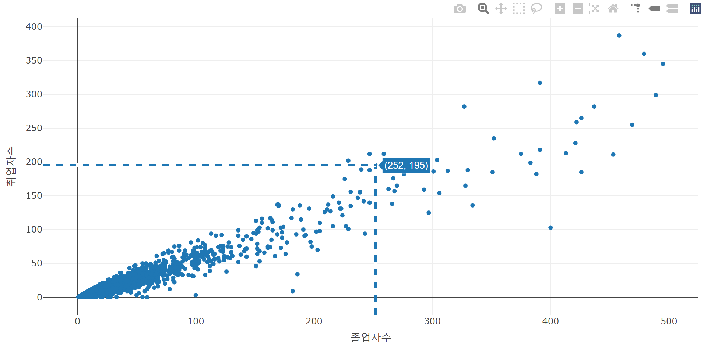

```{r setup, include=FALSE}
knitr::opts_chunk$set(echo = TRUE, message = FALSE, warning = FALSE, fig.width = 6.5, dpi = 130, eval = FALSE)
library(showtext)
showtext_auto()
library(tidyverse)
library(readxl)
library(patchwork)
library(plotly)

```

```{r echo = FALSE, message = FALSE, warning = FALSE, eval = TRUE}
##  R code
## 데이터 전처리를 위한 패키지 설치 및 로딩
if(!require(readr)) {
  install.packages('readr')
  library(readr)
}

if(!require(lubridate)) {
  install.packages('lubridate')
  library(lubridate)
}

if(!require(tidyverse)) {
  install.packages('tidyverse')
  library(tidyverse)
}

## 1. covid19 원본 데이터 셋 로딩
## covid19 데이터 로딩(파일을 다운로드 받은 경우)
# df_covid19 <- read_csv(file = "데이터저장경로/owid-covid-data.csv",
#                             col_types = cols(Date = col_date(format = "%Y-%m-%d")
#                                              )
#                             )
## covid19 데이터 로딩(온라인에서 바로 로딩할 경우)
# df_covid19 <- read_csv(file = "https://covid.ourworldindata.org/data/owid-covid-data.csv",
#                             col_types = cols(Date = col_date(format = "%Y-%m-%d")
#                                              )
#                             )

df_covid19 <- read_csv(file = "D:/R/git/datavisualization/plotly/RnPy/owid-covid-data_221203.csv",
                            col_types = cols(Date = col_date(format = "%Y-%m-%d")
                                             )
                            )
## 2. 전체 데이터셋 중 최근 100일간의 데이터를 필터링한 df_covid19_100 생성
df_covid19_100 <- df_covid19 |> 
  ## 한국 데이터와 각 대륙별 데이터만을 필터링
  filter(iso_code %in% c('KOR', 'OWID_ASI', 'OWID_EUR', 'OWID_OCE', 'OWID_NAM', 'OWID_SAM', 'OWID_AFR')) |>
  ## 읽은 데이터의 마지막 데이터에서 100일전 데이터까지 필터링
  filter(date >= max(date) - 100) |>
  ## 국가명을 한글로 변환
  mutate(location = case_when(
    location == 'South Korea' ~ '한국', 
    location == 'Asia' ~ '아시아', 
    location == 'Europe' ~ '유럽', 
    location == 'Oceania' ~ '오세아니아', 
    location == 'North America' ~ '북미', 
    location == 'South America' ~ '남미', 
    location == 'Africa' ~ '아프리카')) |>
  ## 국가 이름의 순서를 설정 
  mutate(location = fct_relevel(location, '한국', '아시아', '유럽', '북미', '남미', '아프리카', '오세아니아')) |>
  ## 날짜로 정렬
  arrange(date)


## 3. df_covid19_100을 한국과 각 대륙별열로 배치한 넓은 형태의 데이터프레임으로 변환
df_covid19_100_wide <- df_covid19_100 |>
  ## 날짜, 국가명, 확진자와, 백신접종완료자 데이터만 선택
  select(date, location, new_cases, people_fully_vaccinated_per_hundred) |>
  ## 열 이름을 적절히 변경
  rename('date' = 'date', '확진자' = 'new_cases', '백신접종완료자' = 'people_fully_vaccinated_per_hundred') |>
  ## 넓은 형태의 데이터로 변환
  pivot_wider(id_cols = date, names_from = location, 
              values_from = c('확진자', '백신접종완료자')) |>
  ## 날짜로 정렬
  arrange(date)

## 4. covid19 데이터를 국가별로 요약한 df_covid19_stat 생성
df_covid19_stat <- df_covid19 |> 
  group_by(iso_code, continent, location) |>
  summarise(인구수 = max(population, na.rm = T), 
            인당GDP = max(gdp_per_capita, na.rm = T),
            전체확진자수 = sum(new_cases, na.rm = T),
            전체사망자수 = sum(new_deaths, na.rm = T), 
            십만명당중환자실 = last(icu_patients_per_million),
            재생산지수 = last(reproduction_rate),
            봉쇄지수 = max(stringency_index), 
            전체검사자수 = max(total_tests, na.rm = T), 
            신규검사자수 = sum(new_tests, na.rm = T),
            전체백신접종자수 = max(total_vaccinations, na.rm = T),
            백신접종자완료자수 = max(people_fully_vaccinated, na.rm = T),
            부스터접종자수 = max(total_boosters, na.rm = T),
            인구백명당백신접종완료률 = max(people_fully_vaccinated_per_hundred, na.rm = T),
            인구백명당부스터접종자수 = max(total_boosters_per_hundred, na.rm = T)
            ) |> 
    ungroup() |>
    mutate(십만명당사망자수 = round(전체사망자수 / 인구수 *100000, 5),
           백신접종완료률 = 백신접종자완료자수 / 인구수)


```

```{r echo = FALSE, message = FALSE, warning = FALSE, eval = TRUE}
## R 코드

df_취업률 <- read_excel('d:/R/data/2020년 학과별 고등교육기관 취업통계.xlsx', 
                     ## '학과별' 시트의 데이터를 불러오는데,
                     sheet = '학과별',
                     ## 앞의 13행을 제외하고
                     skip = 13, 
                     ## 첫번째 행은 열 이름으로 설정
                     col_names = TRUE, 
                     ## 열의 타입을 설정, 처음 9개는 문자형으로 다음 79개는 수치형으로 설정
                     col_types = c(rep('text', 9), rep('numeric', 79)))

## df_취업률에서 첫번째부터 9번째까지의 열과 '계'로 끝나는 열을 선택하여 다시 df_취업률에 저장
df_취업률 <- df_취업률 |> 
  select(1:9, ends_with('계'), '입대자')

## df_취업률에서 졸업자가 500명 이하인 학과 2000개 샘플링
df_취업률_2000 <- df_취업률 |> 
  filter(졸업자_계 < 500) |>
  mutate(id = row_number()) |>
  filter(row_number() %in% seq(from = 1, to = nrow(df_취업률), by = 4))

## 열 이름을 적절히 설정
names(df_취업률_2000)[10:12] <- c('졸업자수', '취업률', '취업자수')

margins_R = list(t = 50, b = 25, l = 25, r = 25)

```

```{python echo = FALSE, message = FALSE, warning = FALSE, eval = FALSE}
import pandas as pd
from datetime import datetime, timedelta
from pandas.api.types import CategoricalDtype
from matplotlib import pyplot as plt
import plotly.graph_objects as go

df_covid19 = pd.read_csv("D:/R/git/datavisualization/plotly/RnPy/owid-covid-data_221203.csv")

df_covid19['date'] = pd.to_datetime(df_covid19['date'], format="%Y-%m-%d")

df_covid19_100 = df_covid19[(df_covid19['iso_code'].isin(['KOR', 'OWID_ASI', 'OWID_EUR', 'OWID_OCE', 'OWID_NAM', 'OWID_SAM', 'OWID_AFR'])) & (df_covid19['date'] >= (max(df_covid19['date']) - timedelta(days = 100)))]


df_covid19_100.loc[df_covid19_100['location'] == 'South Korea', "location"] = '한국'
df_covid19_100.loc[df_covid19_100['location'] == 'Asia', "location"] = '아시아'
df_covid19_100.loc[df_covid19_100['location'] == 'Europe', "location"] = '유럽'
df_covid19_100.loc[df_covid19_100['location'] == 'Oceania', "location"] = '오세아니아'
df_covid19_100.loc[df_covid19_100['location'] == 'North America', "location"] = '북미'
df_covid19_100.loc[df_covid19_100['location'] == 'South America', "location"] = '남미'
df_covid19_100.loc[df_covid19_100['location'] == 'Africa', "location"] = '아프리카'

ord = CategoricalDtype(categories = ['한국', '아시아', '유럽', '북미', '남미', '아프리카', '오세아니아'], ordered = True)

df_covid19_100['location'] = df_covid19_100['location'].astype(ord)

df_covid19_100 = df_covid19_100.sort_values(by = 'date')

df_covid19_100_wide = df_covid19_100.loc[:,['date', 'location', 'new_cases', 'people_fully_vaccinated_per_hundred']].rename(columns={'new_cases':'확진자', 'people_fully_vaccinated_per_hundred':'백신접종완료자'})

df_covid19_100_wide = df_covid19_100_wide.pivot(index='date', columns='location', values=['확진자', '백신접종완료자']).sort_values(by = 'date')

df_covid19_100_wide.columns = ['확진자_한국', '확진자_아시아', '확진자_유럽', '확진자_북미', '확진자_남미', '확진자_아프리카','확진자_오세아니아',
                              '백신접종완료자_한국', '백신접종완료자_아시아', '백신접종완료자_유럽', '백신접종완료자_북미', '백신접종완료자_남미', '백신접종완료자_아프리카','백신접종완료자_오세아니아']
                              
df_covid19_stat = df_covid19.groupby(['iso_code', 'continent', 'location'], dropna=False).agg(
    인구수 = ('population', 'max'),
    전체확진자수 = ('new_cases', 'sum'),
    전체사망자수 = ('new_deaths', 'sum'), 
    백신접종자완료자수 = ('people_fully_vaccinated', 'max'),
    인구백명당백신접종완료율 = ('people_fully_vaccinated_per_hundred', 'max'),
    인구백명당부스터접종자수 = ('total_boosters_per_hundred', 'max')
).reset_index()

df_covid19_stat['십만명당사망자수'] = round(df_covid19_stat['전체사망자수'] / df_covid19_stat['인구수'] *100000, 5)

df_covid19_stat['백신접종완료율'] = df_covid19_stat['백신접종자완료자수'] / df_covid19_stat['인구수']

######################################   
## python 코드
## 대학 학과 취업률 데이터 셋

df_취업률 = pd.read_excel("d:/R/data/2020년 학과별 고등교육기관 취업통계.xlsx", 
                           sheet_name = '학과별',
                           skiprows=(13), 
                           header = 0)

df_취업률 = pd.concat([df_취업률.iloc[:, 0:8], 
                    df_취업률.loc[:, df_취업률.columns.str.endswith('계')], 
                    df_취업률.loc[:, '입대자']], 
                   axis = 1
                   )

df_취업률_2000 = df_취업률.loc[(df_취업률['졸업자_계'] < 500)]

df_취업률_2000 = df_취업률_2000.iloc[range(0, len(df_취업률_2000.index) , 4)]

df_취업률_2000 = df_취업률_2000.rename(columns = {'졸업자_계':'졸업자수', '취업률_계':'취업률', '취업자_합계_계':'취업자수'})

margins_P = dict(t = 50, b = 25, l = 25, r = 25)

```

`plotly`는 동적 시각화인 만큼 Zoom in, Zoom out 뿐 아니라 사용자와의 상호 작용을 통한 많은 기능을 제공한다. 이번 장에서는 `plotly` 시각화에서 제공하는 다양한 기능을 알아본다. 

# plotly 시각화 사용하기

R의 `ggplot2`나 python의 `matplotlib`, `seaborn`로 만든 정적 시각화는 그래프를 만들때 시각화한 데이터 외에 시각화 자체에서 추가적인 데이터를 얻기가 어렵다. 따라서 시각화에 추가적인 데이터를 제공하기 위해서는 다시 코딩해서 만들어야하는 불편함이 따른다. 특히 특정 위치의 데이터 값을 확인하거나 특정 구간 데이터를 줌인하기 위해서도 다시 코딩해야하는데 사용자의 사용을 예상하여 따라 수없이 많은 시각화를 만들어 놓을 수는 없다. 반면 `plotly`와 같은 동적 시각화에서는 특징적 데이터 값의 확인, 줌인, 줌 아웃, 특정 데이터만의 표기 등과 같은 탐색적 데이터 분석에 자유롭게 사용할 수 있는 다양한 기능을 제공한다.

## modebar의 사용

`plotly`가 시각화 사용자와의 상호작용을 위한 주요 기능을 제공하는 메뉴가 'modebar'이다. 'modebar'는 `plotly`가 실행되는 R-Studio, Jupiter Notbook이나 웹 브라우저의 오른쪽 상단에 나타나는 버튼 메뉴를 말한다. 기본적으로 설정되는 'modebar'는 다음의 그림과 같이 8개의 기능을 버튼을 통해 제공한다.


### 시각화 저장 버튼  

시각화 저장 기능은 기본적으로 모드바의 가장 왼쪽에 카메라 아이콘으로 표현된다. 이 기능은 현재 표시되는 `plotly` 시각화를 정적 이미지로 저장한다. `plotly`에서는 기본적을 'png'타입으로 이미지의 저장이 가능하다. 


### Zoom()과 Pan() 기능 버튼 

`plotly` 시각화는 기본적으로 마우스로 시각화의 플롯 영역에서 좌클릭한 상태로 드래그하면 시각화의 확대 영역을 설정할 수 있다. 이 기능은 `plotly` 시각화에서 마우스의 기본 기능 설정이기 때문에 'Zoom' 버튼을 누르지 않고 가능하다. Zoom 기능을 완료하고 원 상태의 시각화로 돌아가기 위해서는 모드바의 리셋 버튼을 누르거나 마우스 더블 클릭으로 돌아갈 수 있다. 

Pan 기능은 시각화의 표현 비율을 그대로 두고 그래프를 이동시키는 기능이다. 이 기능을 사용하려면 모드바의 'Pan' 버튼을 누른 다음 마우스 좌클릭한 상태에서 움직이면 그래프가 같이 움직이게 된다. 그래프의 이동에 따라 X축과 Y축도 같이 이동하는 것을 확인할 수 있다. Pan 기능을 사용하고 원래 시각화로 돌아가기 위해서는 모드바의 리셋 버튼을 누르거나 마우스 더블 클릭으로 돌아갈 수 있다. 

### Zoom In()과 ZoomOut() 기능 버튼

앞서 Zoom 버튼은 마우스 드래그를 통해 Zoom 기능을 활용하였다. 하지만 Zoom In/Out 기능 버튼의 '+' 버튼을 누를때 마다 현재 시각화의 중심으로 Zoom In 이 되고 '-' 버튼을 누를때 마다 현재 시각화의 중심에서 Zoom Out이 된다. 

### Autoscale()과 Reset Axes() 기능 버튼

`plotly`를 만들때 X축과 Y축의 범위를 설정하지 않으면 `plotly`는 표시되는 데이터의 사이즈에 맞게 X축과 Y축의 범위를 자동 설정한다. 이 기능을 'Autoscale'이라고 하는데 'Autoscale' 버튼은 `plotly`가 시각화를 생성할 당시 자동적으로 설정했던 축 설정으로 되돌아 가는 버튼이다. 'reset axes' 버튼은 초기 시각화로 돌아가는 기능을 제공한다. 

### toggle spike line() 기능 버튼

'Toggle Spike Line' 버튼은 X축, Y축으로 그려지는 보조선의 설정을 변경하는 버튼이다. 이 버튼으로 스파이크 라인을 활성화하면 X축과 Y축으로 'toaxis'가 설정된 스파이크 라인이 설정되고 다시 한번 누르면 스파이크 라인이 없어진다. 



### Show Closet Data On Hover()/Compare Data On Hover() 기능 

이 두 버튼은 호버의 설정과 관련한 기능을 조절하는 버튼이다. 'Show Closet Data On Hover' 버튼은 데이터에 가장 가까운 데이터에 호버가 나타나는 기능으로 설정하는 버튼이고 'Compare Data On Hover'는 X축으로 동일한 데이터에 대한 호버가 표시되는 기능, 즉 'hovermode'를 "x"로 설정하는 버튼이다.


## 마우스의 기능


## 호버를 통한 데이터 확인

`plotly` 시각화에서 가장 쉽게 사용하는 기능은 마우스를 사용하여 해당 위치의 데이터 정보를 확인하는 기능이다. `plotly` 객체로 생성된 시각화 위에 표현된 각 트레이스들은 자체 데이터를 JSON의 형태로 포함하고 있기 때문에 마우스 포인터를 트레이스위에 위치시키면 호버를 통해 해당 트레이스의 정보가 표시된다.

마우스 포인터에 의해 표시되는 호버의 정보는 각 트레이스의 'hoverinfo', 'hovertemplate' 등 호버 속성 설정에 따라 표시된다. 


## 드래그를 통한 Zoom In

`plotly`로 완성된 시각화에서 트레이스가 나타나는 플롯팅 영역(plotting area)에서 마우스 왼쪽 버튼을 클릭한 상태에서 드래그하면 다음 그림과 같이 줌 인 영역을 선택할 수 있다. 이렇게 영역을 선택한 후에 마우스 클릭을 놓으면 해당 부분이 줌인 되어 표시되게 된다. 만약 다시 처음의 상태로 돌아가려면 모드바의 집 아이콘인 'Reset Axes' 버튼을 사용한다.


## 드래그를 통한 축 이동

`plolty`에서 마우스를 드래그를 통해 추가적으로 할 수 있는 기능은 축 이동이다. X축과 Y축의 위치에서 마우스의 왼쪽 버튼을 클릭한 상태에서 상하 또는 좌우로 드래그를 하면 축의 범위가 조절된다. 이를 통해 데이터가 표현되는 축의 범위를 변

## 마우스 휠을 사용한 줌

줌인과 줌아웃을 지원하는 많은 프로그램에서는 마우스 휠을 사용하는 프로그램이 많다. `plotly`도 마우스 휠을 사용하여 줌인과 줌아웃을 사용할 수 있는데 이 기능은 기본적으로 지원하지 않고 `config()`를 사용하여 설정해야 한다. `config()`는 `plotly` 시각화가 사용자와의 상호작용을 지원하는 기능을 조절하고 설정하는 다양한 속성을 조절하는 함수이다. `config()`에서 설정할 수 있는 주요 속성은 다음과 같다.[^6]

[^6]: <https://github.com/plotly/plotly.js/blob/master/src/plot_api/plot_config.js>

+------------------------+------------------------------------------------+---------------------------------------------------+------------------------------------------------------------------------------------------+
| 속성                   | 설명                                           | 속성값                                            | 세부 속성                                                                                |
+========================+================================================+===================================================+==========================================================================================+
| staticPlot             | 정적 시각화로 설정                             | 논리값                                            |                                                                                          |
+------------------------+------------------------------------------------+---------------------------------------------------+------------------------------------------------------------------------------------------+
| editable               | 시각화를 편집할 수 있는지를 설정               | 논리값                                            |                                                                                          |
+------------------------+------------------------------------------------+---------------------------------------------------+------------------------------------------------------------------------------------------+
| edit                   | editable이 TRUE인 경우 편집 가능한 세부 속성   | 세부 속성들의 리스트                              | annotationPosition, annotationText, axisTitleText, legendPosition, legendText, titleText |
+------------------------+------------------------------------------------+---------------------------------------------------+------------------------------------------------------------------------------------------+
| scrollZoom             | 마우스 휠을 줌으로 사용할지를 설정             | 'cartesian', 'gl3d', 'geo', 'mapbox', TRUE, FALSE |                                                                                          |
+------------------------+------------------------------------------------+---------------------------------------------------+------------------------------------------------------------------------------------------+
| doubleClick            | 마우스 더블 클릭을 어떤 기능으로 사용할지 설정 | FALSE, 'reset', 'autosize', 'reset+autosize'      |                                                                                          |
+------------------------+------------------------------------------------+---------------------------------------------------+------------------------------------------------------------------------------------------+
| showTips               | 팁(호버)를 사용할지 설정                       | 논리값                                            |                                                                                          |
+------------------------+------------------------------------------------+---------------------------------------------------+------------------------------------------------------------------------------------------+
| displayModeBar         | 모드바의 표시 방법 설정                        | 'hover', TRUE, FALSE                              |                                                                                          |
+------------------------+------------------------------------------------+---------------------------------------------------+------------------------------------------------------------------------------------------+
| modeBarButtonsToRemove | 모드바의 버튼 중 없앨 버튼 설정                | 버튼 ID 문자열                                    |                                                                                          |
+------------------------+------------------------------------------------+---------------------------------------------------+------------------------------------------------------------------------------------------+
| modeBarButtonsToAdd    | 모드바에 포함시킬 버튼 설정                    | 버튼 ID 문자열                                    |                                                                                          |
+------------------------+------------------------------------------------+---------------------------------------------------+------------------------------------------------------------------------------------------+
| toImageButtonOptions   | 이미지 저장 버튼의 설정                        |                                                   |                                                                                          |
+------------------------+------------------------------------------------+---------------------------------------------------+------------------------------------------------------------------------------------------+
| displaylogo            | 모드바의 plotly 로고를 표시할지 설정           | 논리값                                            |                                                                                          |
+------------------------+------------------------------------------------+---------------------------------------------------+------------------------------------------------------------------------------------------+

## 축의 이동

`plotly` 시각화에서 마우스를 사용한 기능중에 또 하나가 축의 이동이다. `plotly`의 플롯 영역(plotting area)에서 마우스를 클릭하고 드래그를 하면 줌인의 기능을 위한 사각형이 만들어지지만 X, Y축의 위치에서 마우스를 클릭하고 드래그하면 축을 이동시킬수 있다. 따라서 줌인한 후에 축을 이동시키면 사용자가 자세히 보기를 원하는 지역의 데이터를 확인할 수 있다.


## 범례의 사용

`plotly`에서 범례는 단순히 trace들의 이름과 표현방식을 매핑해주는 역할을 넘어 trace들의 표시를 조절할 수 있는 기능이 있다. 범례의 아이템을 클릭하면 해당 trace가 표시를 토글하는 역할을 한다. 따라서 여러 데이터 trace중에 특정한 trace만을 확인하기 위해서 해당 trace만 남기고 다른 trace의 표시를 꺼둘수 있는 기능이 있다. 또 `legendgroup`으로 그룹화된 범례는 해당 그룹의 아이템의 클릭만으로 그 그룹의 전체 trace를 켜거나 꺼둘 수 있다.


# Plotly 배포


